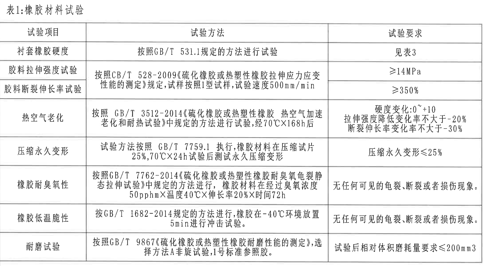
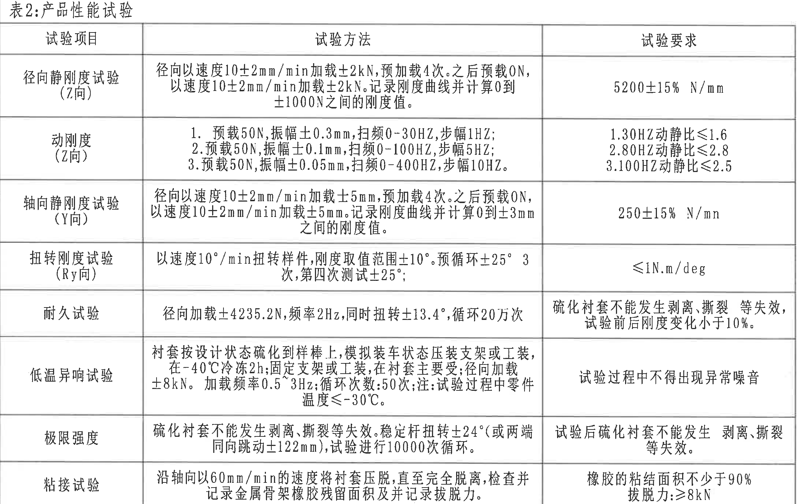
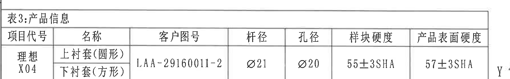
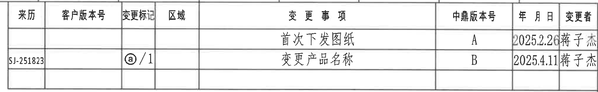
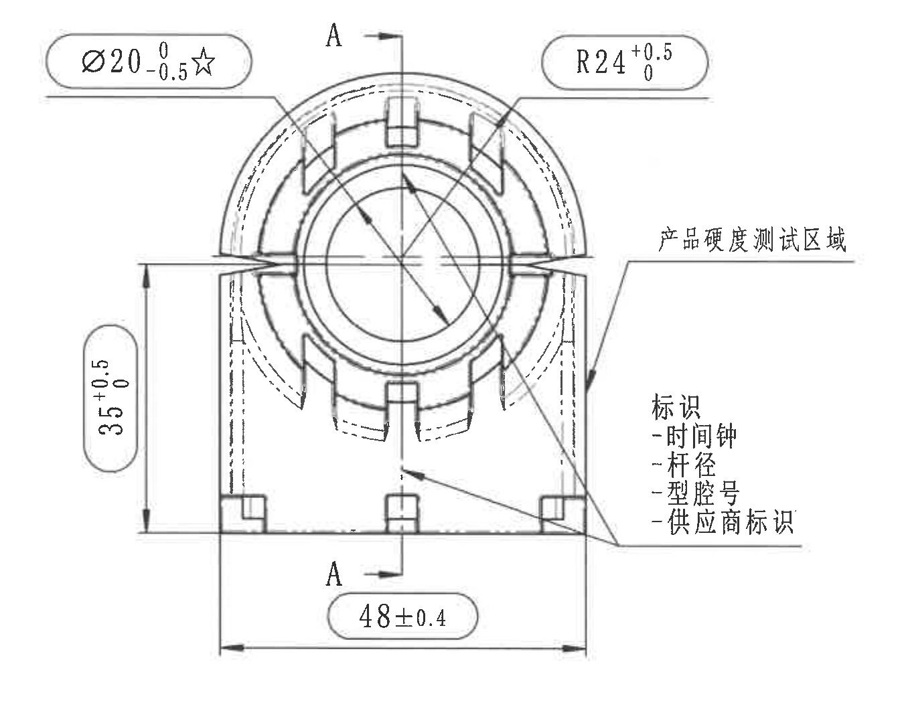
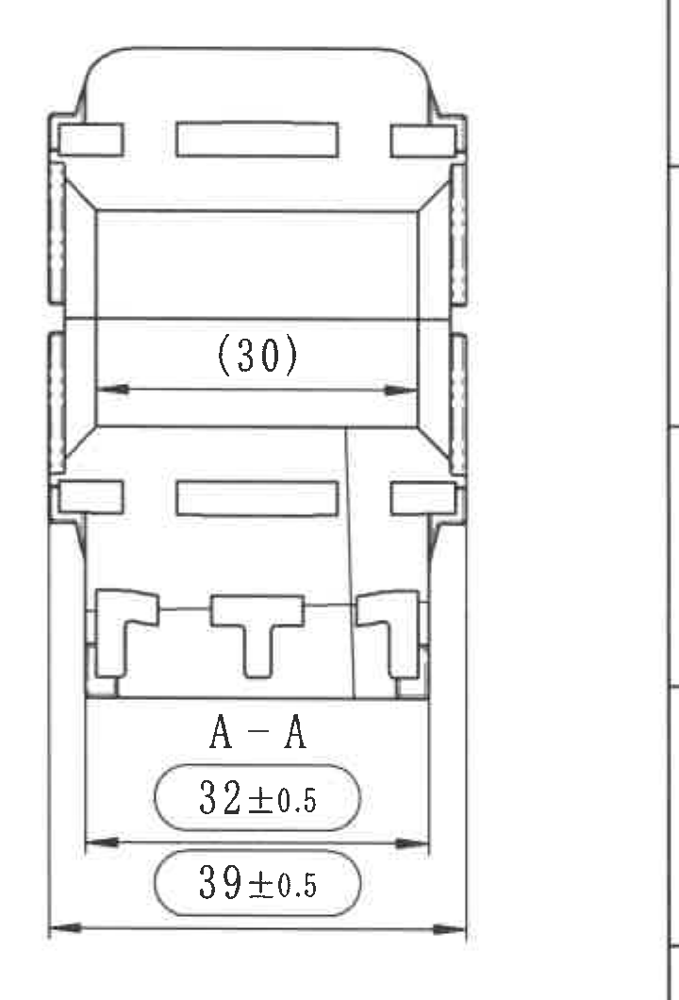
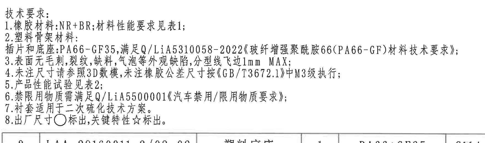
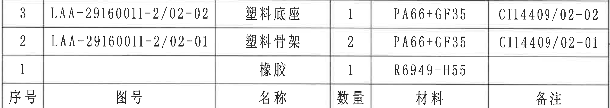
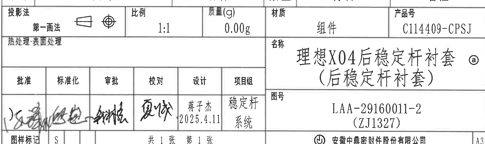
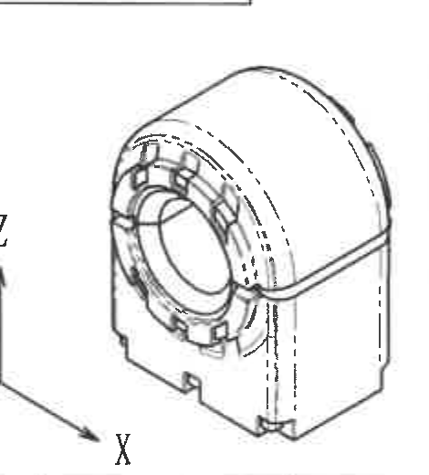

# 20C114409 内容识别与裁切提取

整页渲染图：`outputs/20C114409_assets/images/page_1.png`。页面尺寸：4959 × 3505 px，单页。

## object_1：表1:橡胶材料试验

原图位置/视图名称：第1页左上至左中区域，表1:橡胶材料试验。

| 试验项目 | 试验方法 | 试验要求 |
|---|---|---|
| 衬套橡胶硬度 | 按照GB/T 531.1规定的方法进行试验 | 见表3 |
| 胶料拉伸强度试验 | 按照CB/T 528-2009《硫化橡胶或热塑性橡胶拉伸应力应变性能的测定》规定，试样按照1型试样，试验速度500mm/min | ≥14MPa |
| 胶料断裂伸长率试验 | 按照CB/T 528-2009《硫化橡胶或热塑性橡胶拉伸应力应变性能的测定》规定，试样按照1型试样，试验速度500mm/min | ≥350% |
| 热空气老化 | 按照 GB/T 3512-2014《硫化橡胶或热塑性橡胶 热空气加速老化和耐热试验》中规定的方法进行试验，经70°C×168h后 | 硬度变化：0~+10；拉伸强度降低变化率不大于-20%；断裂伸长率变化率不大于-30% |
| 压缩永久变形 | 试验方法按照 GB/T 7759.1 执行，橡胶材料在压缩试片25%，70°C×24h试验后测试永久压缩变形 | 压缩永久变形≤25% |
| 橡胶耐臭氧性 | 按照GB/T 7762-2014《硫化橡胶或热塑性橡胶耐臭氧龟裂静态拉伸试验》中规定的方法进行，橡胶材料在经过臭氧浓度50pphm×温度40°C×伸长率20%×时间72h | 无任何可见的龟裂、断裂或者损伤现象。 |
| 橡胶低温脆性 | 按GB/T 1682-2014规定的方法进行，橡胶在-40°C环境放置5min进行冲击试验。 | 无任何可见的龟裂、断裂或者损伤现象。 |
| 耐磨试验 | 按照GB/T 9867《硫化橡胶或热塑性橡胶耐磨性能的测定》，选择方法A非旋试验，1号标准参照胶。 | 试验后相对体积磨耗量要求≤200mm3 |

| 提取项 | 原图数值或文本 | 含义说明 |
|---|---|---|
| 表名 | 表1:橡胶材料试验 | 橡胶材料类检验项目汇总。 |
| 硬度要求来源 | 见表3 | 硬度不是在本表给固定值，而是引用表3的样块硬度和产品表面硬度。 |
| 拉伸强度 | ≥14MPa | 胶料拉伸强度最低要求。 |
| 断裂伸长率 | ≥350% | 胶料断裂伸长率最低要求。 |
| 老化条件 | 70°C×168h | 热空气老化试验温度和时间。 |
| 老化后硬度变化 | 0~+10 | 热老化后硬度变化允许范围。 |
| 老化后拉伸强度变化 | 不大于-20% | 拉伸强度降低变化率限制。 |
| 老化后断裂伸长率变化 | 不大于-30% | 断裂伸长率变化率限制。 |
| 压缩永久变形 | ≤25% | 压缩永久变形上限。 |
| 臭氧条件 | 50pphm×40°C×20%×72h | 臭氧浓度、温度、伸长率和时间条件。 |
| 低温冲击 | -40°C，5min | 低温脆性试验环境与放置时间。 |
| 磨耗量 | ≤200mm3 | 耐磨试验后相对体积磨耗量上限。 |

边界归属说明：裁切范围为表1标题、表头和表1全部7项试验行；下方表2标题未纳入本对象。左侧和右侧均按表格外框截取，没有把图框坐标字母作为表格内容。

## object_2：表2:产品性能试验

原图位置/视图名称：第1页左中至左下大表格区域，表2:产品性能试验。

| 试验项目 | 试验方法 | 试验要求 |
|---|---|---|
| 径向静刚度试验（Z向） | 径向以速度10±2mm/min加载±2kN，预加载4次。之后预载0N，以速度10±2mm/min加载±2kN。记录刚度曲线并计算0到±1000N之间的刚度值。 | 5200±15% N/mm |
| 动刚度（Z向） | 1. 预载50N，振幅±0.3mm，扫频0-30HZ，步幅1HZ；2. 预载50N，振幅±0.1mm，扫频0-100HZ，步幅5HZ；3. 预载50N，振幅±0.05mm，扫频0-400HZ，步幅10HZ。 | 1. 30HZ动静比≤1.6；2. 80HZ动静比≤2.8；3. 100HZ动静比≤2.5 |
| 轴向静刚度试验（Y向） | 径向以速度10±2mm/min加载±5mm，预加载4次。之后预载0N，以速度10±2mm/min加载±5mm。记录刚度曲线并计算0到±3mm之间的刚度值。 | 250±15% N/mm |
| 扭转刚度试验（Ry向） | 以速度10°/min扭转样件，刚度取值范围±10°。预循环±25° 3次，第四次测试±25°； | ≤1N.m/deg |
| 耐久试验 | 径向加载±4235.2N，频率2Hz，同时扭转±13.4°，循环20万次 | 硫化衬套不能发生剥离、撕裂等失效，试验前后刚度变化小于10%。 |
| 低温异响试验 | 衬套按设计状态硫化到样棒上，模拟装车状态压装支架或工装，在-40°C冷冻2h；固定支架或工装，在衬套主要受径向加载±8kN。加载频率0.5~3Hz；循环次数：50次；注：试验过程中零件温度≤-30°C。 | 试验过程中不得出现异常噪音 |
| 极限强度 | 硫化衬套不能发生剥离、撕裂等失效。稳定杆扭转±24°（或两端同向跳动±122mm），试验进行10000次循环。 | 试验后硫化衬套不能发生剥离、撕裂等失效。 |
| 粘接试验 | 沿轴向以60mm/min的速度将衬套压脱，直至完全脱离，检查并记录金属骨架橡胶残留面积及并记录拔脱力。 | 橡胶的粘结面积不少于90%；拔脱力：≥8kN |

| 提取项 | 原图数值或文本 | 含义说明 |
|---|---|---|
| 径向静刚度方向 | Z向 | Z向径向静刚度测试。 |
| 径向静刚度加载速度 | 10±2mm/min | 加载速度公差范围。 |
| 径向静刚度载荷 | ±2kN | 径向加载载荷。 |
| 径向静刚度计算区间 | 0到±1000N | 刚度值取计算区间。 |
| 径向静刚度要求 | 5200±15% N/mm | 目标刚度和允许偏差。 |
| 动刚度条件1 | 50N，±0.3mm，0-30HZ，1HZ | 第一段扫频条件。 |
| 动刚度条件2 | 50N，±0.1mm，0-100HZ，5HZ | 第二段扫频条件。 |
| 动刚度条件3 | 50N，±0.05mm，0-400HZ，10HZ | 第三段扫频条件。 |
| 动刚度要求 | 30HZ≤1.6；80HZ≤2.8；100HZ≤2.5 | 各频点动静比上限。 |
| 轴向静刚度方向 | Y向 | Y向轴向静刚度测试。 |
| 轴向静刚度加载位移 | ±5mm | 轴向静刚度试验位移。 |
| 轴向静刚度计算区间 | 0到±3mm | 刚度值取计算区间。 |
| 轴向静刚度要求 | 250±15% N/mm | 目标刚度和允许偏差。 |
| 扭转刚度方向 | Ry向 | 绕Y轴方向的扭转刚度。 |
| 扭转速度 | 10°/min | 扭转加载速度。 |
| 刚度取值范围 | ±10° | 扭转刚度计算角度范围。 |
| 预循环/测试角度 | ±25° 3次；第四次测试±25° | 扭转测试循环条件。 |
| 扭转刚度要求 | ≤1N.m/deg | 扭转刚度上限。 |
| 耐久载荷 | ±4235.2N | 径向加载值。 |
| 耐久频率 | 2Hz | 耐久试验频率。 |
| 耐久扭转角 | ±13.4° | 同步扭转角。 |
| 耐久循环 | 20万次 | 耐久循环次数。 |
| 低温条件 | -40°C冷冻2h，试验中零件温度≤-30°C | 低温异响试验温度要求。 |
| 低温加载 | ±8kN，0.5~3Hz，50次 | 低温异响加载条件。 |
| 极限强度条件 | ±24°或±122mm，10000次循环 | 稳定杆扭转或跳动循环条件。 |
| 粘接试验速度 | 60mm/min | 轴向压脱速度。 |
| 粘接要求 | 粘结面积不少于90%；拔脱力≥8kN | 粘接质量判定标准。 |

边界归属说明：裁切范围从表2标题开始，至粘接试验行下边界结束；未纳入表1、表3或右侧图形区域。表内方向标记Z向、Y向、Ry向均属于试验项目名，不属于加工视图尺寸。

## object_3：表3:产品信息

原图位置/视图名称：第1页左下区域，表3:产品信息。

| 项目代号 | 名称 | 客户图号 | 杆径 | 孔径 | 样块硬度 | 产品表面硬度 |
|---|---|---|---|---|---|---|
| 理想X04 | 上衬套（圆形） 下衬套（方形） | LAA-29160011-2 | Ø21 | Ø20 | 55±3SHA | 57±3SHA |

| 提取项 | 原图数值或文本 | 含义说明 |
|---|---|---|
| 项目代号 | 理想X04 | 产品项目代号。 |
| 名称 | 上衬套（圆形）；下衬套（方形） | 产品上下衬套形态说明。 |
| 客户图号 | LAA-29160011-2 | 客户图纸编号。 |
| 杆径 | Ø21 | 稳定杆配合直径。 |
| 孔径 | Ø20 | 衬套孔径信息。 |
| 样块硬度 | 55±3SHA | 样块硬度要求，表1硬度项引用。 |
| 产品表面硬度 | 57±3SHA | 产品表面硬度要求，表1硬度项引用。 |

边界归属说明：裁切包含表3完整表头和唯一数据行。右侧邻近图框坐标区域非常近，裁切内容中仅表格外框内的“产品表面硬度”列属于本对象。

## object_4：修订履历表

原图位置/视图名称：第1页右上区域，修订履历表。

| REV/中鼎版本号 | 来历 | 客户版本号 | 变更标记 | 区域 | DESCRIPTION/变更事项 | 年月日 | 变更者 |
|---|---|---|---|---|---|---|---|
| A |  |  |  |  | 首次下发图纸 | 2025.2.26 | 蒋子杰 |
| B | SJ-251823 |  | ⓐ/1 |  | 变更产品名称 | 2025.4.11 | 蒋子杰 |

| 提取项 | 原图数值或文本 | 含义说明 |
|---|---|---|
| 版本A事项 | 首次下发图纸 | 初版下发记录。 |
| 版本A日期 | 2025.2.26 | A版日期。 |
| 版本A变更者 | 蒋子杰 | A版变更人员。 |
| 版本B来历 | SJ-251823 | B版来源编号。 |
| 版本B变更标记 | ⓐ/1 | 图纸变更标记。 |
| 版本B事项 | 变更产品名称 | B版变更内容。 |
| 版本B日期 | 2025.4.11 | B版日期。 |
| 版本B变更者 | 蒋子杰 | B版变更人员。 |

边界归属说明：裁切保留履历表列线、表头和两条修订记录；上方相邻图框线可见但不属于修订内容，右侧图框坐标字母未作为表格字段提取。

## object_5：主加工视图/正视图

原图位置/视图名称：第1页右中偏左，主加工视图/正视图。

| 提取项 | 原图数值或文本 | 含义说明 |
|---|---|---|
| 孔径关键尺寸 | Ø20 0/-0.5 ☆ | 直径20，正偏差0，负偏差0.5；星号按技术要求第8条表示关键特性。该标注箭头指向中心圆孔，归属主视图。 |
| 顶部圆弧半径 | R24 +0.5/0 | 外圆弧半径24，正偏差0.5，负偏差0；引线指向上部圆弧，归属主视图。 |
| 左侧高度 | 35 +0.5/0 | 侧向高度尺寸35，正偏差0.5，负偏差0；完整尺寸线和箭头位于主视图左侧。 |
| 底部总宽 | 48±0.4 | 底部宽度48，双向公差±0.4；完整尺寸线和箭头位于主视图底部。 |
| 剖切标记 | A-A | 剖切位置和方向标记，指向右侧A-A剖视图；不是尺寸值。 |
| 硬度测试区域 | 产品硬度测试区域 | 引线指向主视图右侧侧壁区域，用于标明硬度测试位置。 |
| 标识内容 | 标识：-时间钟 -杆径 -型腔号 -供应商标识 | 标识清单，说明产品上需要出现的标识项。 |

边界归属说明：裁切包含主视图本体、与主视图相连的全部尺寸线、箭头、引线和标识文字。右侧A-A剖视图未纳入；因此`(30)`、`32±0.5`、`39±0.5`不归属主视图。

## object_6：A-A剖视图

原图位置/视图名称：第1页右侧，A-A剖视图。

| 提取项 | 原图数值或文本 | 含义说明 |
|---|---|---|
| 参考内宽 | (30) | 括号内参考尺寸，表示剖视图中部内腔/开口宽度参考值；括号表示该尺寸为参考信息，不能作为主控加工尺寸处理，但必须保留。 |
| 下部内侧宽度 | 32±0.5 | A-A剖视图下部内侧结构宽度，公差±0.5。 |
| 外侧总宽 | 39±0.5 | A-A剖视图底部外侧总宽，公差±0.5。 |
| 视图名称 | A-A | 与主视图剖切线对应。 |

边界归属说明：裁切只包含A-A剖视图及本剖视图尺寸线。其尺寸线和箭头完整位于该裁切内，不归入主视图；主视图右侧标识文字未纳入本对象。

## object_7：技术要求/NOTES

原图位置/视图名称：第1页右中偏下，技术要求/NOTES。

| 序号 | 原图文本 | 含义说明 |
|---|---|---|
| 1 | 橡胶材料:NR+BR;材料性能要求见表1; | 橡胶材料为NR+BR，性能要求引用表1。 |
| 2 | 塑料骨架材料:插片和底座:PA66-GF35,满足Q/LiA5310058-2022《玻纤增强聚酰胺66(PA66-GF)材料技术要求》; | 塑料骨架、插片和底座材料及标准要求。 |
| 3 | 表面无毛刺,裂纹,缺料,气泡等外观缺陷,分型线飞边1mm MAX; | 外观缺陷限制和分型线飞边最大1mm。 |
| 4 | 未注尺寸请参照3D数模,未注橡胶公差尺寸按《GB/T3672.1》中M3级执行; | 未注尺寸和橡胶公差等级说明。 |
| 5 | 产品性能试验见表2; | 性能试验引用表2。 |
| 6 | 禁限用物质需满足Q/LiA5500001《汽车禁用/限用物质要求》; | 禁限用物质标准。 |
| 7 | 衬套适用于二次硫化技术方案。 | 工艺适用说明。 |
| 8 | 出厂尺寸○标出,关键特性☆标出。 | 圆圈标识为出厂尺寸，星号标识为关键特性；主视图Ø20后的☆据此解释。 |

边界归属说明：裁切为技术要求1-8条文本。为完整保留第2条右端标准名称，右侧留有空白；底部可见BOM上边线和少量表格线，但这些线不属于NOTES正文。

## object_8：明细/BOM表

原图位置/视图名称：第1页右下，技术要求下方、标题栏上方，明细/BOM表。

| 序号 | 图号 | 名称 | 数量 | 材料 | 备注 |
|---|---|---|---|---|---|
| 3 | LAA-29160011-2/02-02 | 塑料底座 | 1 | PA66+GF35 | C114409/02-02 |
| 2 | LAA-29160011-2/02-01 | 塑料骨架 | 2 | PA66+GF35 | C114409/02-01 |
| 1 |  | 橡胶 | 1 | R6949-H55 |  |

| 提取项 | 原图数值或文本 | 含义说明 |
|---|---|---|
| 序号3 | LAA-29160011-2/02-02；塑料底座；1；PA66+GF35；C114409/02-02 | 塑料底座明细。 |
| 序号2 | LAA-29160011-2/02-01；塑料骨架；2；PA66+GF35；C114409/02-01 | 塑料骨架明细。 |
| 序号1 | 橡胶；1；R6949-H55 | 橡胶材料明细，图号和备注为空白。 |

边界归属说明：裁切包含BOM三条物料记录和表头；上边缘紧邻技术要求，但未把技术要求文字作为BOM字段；下方标题栏未纳入。

## object_9：标题栏

原图位置/视图名称：第1页右下角，标题栏。

| 字段 | 原图数值或文本 | 含义说明 |
|---|---|---|
| 投影法 | 第一画法 | 图纸投影法。 |
| 比例 | 1:1 | 图样比例。 |
| 质量(g) | 0.00g | 图样质量字段。 |
| 材质 | 组件 | 标题栏材质字段。 |
| 产品号 | C114409-CPSJ | 产品号。 |
| 热处理/表面处理 | 热处理:表面处理 | 标题栏处理字段，原格内未填写额外工艺值。 |
| 名称 | 理想X04后稳定杆衬套（后稳定杆衬套） | 图样名称。 |
| 图号 | LAA-29160011-2（ZJ1327） | 图样编号和括号内代号。 |
| 批准 | 签名 | 批准栏手写签名。 |
| 标准化 | 签名 | 标准化栏手写签名。 |
| 审批 | 签名 | 审批栏手写签名。 |
| 校对 | 签名 | 校对栏手写签名。 |
| 设计 | 蒋子杰 2025.4.11 | 设计人员和日期。 |
| 项目组 | 稳定杆系统 | 项目组名称。 |
| 图样标记 | S | 图样标记。 |
| 页数 | 共1张 第1张 | 总张数和当前张。 |
| 公司 | 安徽中鼎密封件股份有限公司 | 出图单位。 |
| 图幅 | A3 | 图幅规格。 |

边界归属说明：裁切保留标题栏主要字段。顶部与BOM下边界相邻，但BOM三条明细不在本对象中；右侧/底部邻近图框边栏，仅A3作为标题栏图幅字段提取。

## object_10：轴测参考视图

原图位置/视图名称：第1页下部中间偏右，轴测参考视图。

| 提取项 | 原图数值或文本 | 含义说明 |
|---|---|---|
| 视图类型 | 轴测参考视图 | 显示零件三维外形、中心孔、前端齿/槽结构、外壳圆弧和底部卡脚。 |
| 坐标标识 | X、Y、Z | 视图旁有三维坐标方向标识；X、Z清晰可见，Y方向箭头在左下邻近区域。 |
| 尺寸 | 无尺寸数值 | 该视图未标注加工尺寸、半径或角度，仅作形态参考。 |

边界归属说明：裁切只用于显示三维形态参考，不含尺寸线。右侧标题栏边界已排除；左侧坐标轴局部邻近但不作为尺寸标注提取。

## 裁切检查记录

| 对象 | 裁切图片 | 检查结论 | 边界/重裁记录 |
|---|---|---|---|
| object_1 | outputs/20C114409_assets/images/object_1.png | 完整包含表1标题、表头、全部行列文字。 | 初裁右侧试验要求列被截断且带入表2标题，已重裁到表1外框。 |
| object_2 | outputs/20C114409_assets/images/object_2.png | 完整包含表2标题、表头和8项试验记录。 | 初裁带入左侧图框分区字母，已重裁到表格外框。 |
| object_3 | outputs/20C114409_assets/images/object_3.png | 完整包含表3表头、唯一数据行及右侧产品表面硬度列。 | 右侧非常接近图框边栏，为保留完整列名和值，裁切到表格右外框；图框坐标不作为表格内容。 |
| object_4 | outputs/20C114409_assets/images/object_4.png | 完整包含修订履历表头和两条记录。 | 初裁右侧混入图框坐标，左侧来历列略窄；已重裁，保留完整来历列和右边框。 |
| object_5 | outputs/20C114409_assets/images/object_5.png | 完整包含主视图全部尺寸线、箭头、引线和文字。 | 初裁右侧“产品硬度测试区域”文字被截断，已加宽重裁；未带入A-A剖视图。 |
| object_6 | outputs/20C114409_assets/images/object_6.png | 完整包含A-A剖视图、(30)、32±0.5、39±0.5尺寸线和文字。 | 边界清晰，未混入主视图尺寸。 |
| object_7 | outputs/20C114409_assets/images/object_7.png | 完整包含技术要求1-8条文字。 | 为读全第2条材料标准，右侧加宽；底部可见BOM上边线，不提取为NOTES正文。 |
| object_8 | outputs/20C114409_assets/images/object_8.png | 完整包含BOM三条记录和表头。 | 右侧备注列完整；上边界紧邻技术要求但未混入技术要求文字。 |
| object_9 | outputs/20C114409_assets/images/object_9.png | 完整包含标题栏主要字段、签名栏、公司名和A3图幅。 | 已重裁去掉BOM数据行和底部坐标数字；顶部紧贴标题栏上边线，未截断可识别字段。 |
| object_10 | outputs/20C114409_assets/images/object_10.png | 完整包含轴测零件主体和可见坐标标识，无尺寸文字。 | 已收右边界以排除标题栏；左侧坐标轴局部邻近，未作为尺寸提取。 |
