# 20C114410 内容识别与裁切提取
## 整页渲染
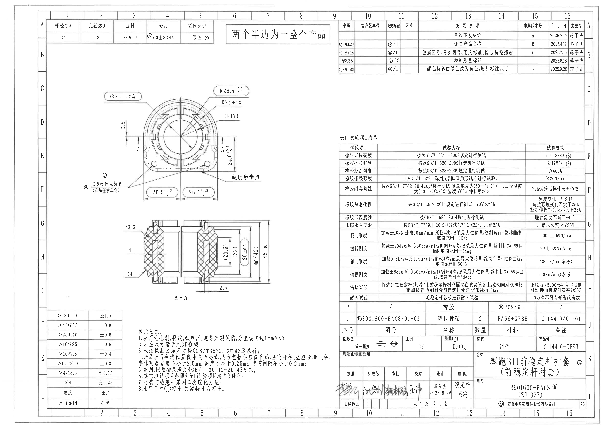
| 项目 | 数值 |
| --- | --- |
| 源文件 | input/20C114410.pdf |
| 页数 | 1 |
| 整页PNG | outputs/20C114410_assets/images/page_1.png |
| PNG尺寸 | 4959 x 3505 px |
| 图纸方向 | 已按 PDF 渲染结果横向显示 |

## object_1 左上产品属性表
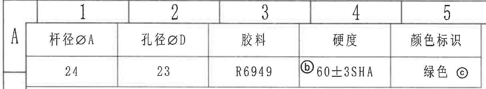
| 原图位置/视图名称 | 左上 A1-A5 网格，产品属性表 |
| --- | --- |
| object_kind | table |
| bbox | [300, 90, 1760, 360] |

| 杆径ØA | 孔径ØD | 胶料 | 硬度 | 颜色标识 |
| --- | --- | --- | --- | --- |
| 24 | 23 | R6949 | ⓑ60±3SHA | 绿色ⓒ |

| 提取项 | 原图数值或文本 | 含义说明 |
| --- | --- | --- |
| 杆径ØA | 24 | 产品属性/材料定义；带圈字母为变更标记或标识关联。 |
| 孔径ØD | 23 | 产品属性/材料定义；带圈字母为变更标记或标识关联。 |
| 胶料 | R6949 | 产品属性/材料定义；带圈字母为变更标记或标识关联。 |
| 硬度 | ⓑ60±3SHA | 产品属性/材料定义；带圈字母为变更标记或标识关联。 |
| 颜色标识 | 绿色ⓒ | 产品属性/材料定义；带圈字母为变更标记或标识关联。 |

边界归属说明：裁切包含完整表格线和字段，左侧、上侧图框坐标线不作为本表字段。

## object_2 上方产品说明框
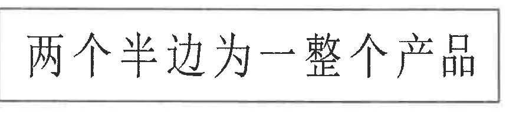
| 原图位置/视图名称 | 上方中部说明框 |
| --- | --- |
| object_kind | notes |
| bbox | [1850, 185, 2730, 395] |

| 提取项 | 原图数值或文本 | 含义说明 |
| --- | --- | --- |
| 产品组成说明 | 两个半边为一整个产品 | 说明两个半边组合成一个完整产品。 |

边界归属说明：裁切仅含该说明框，不包含左侧属性表或右侧变更表内容。

## object_3 右上变更履历表
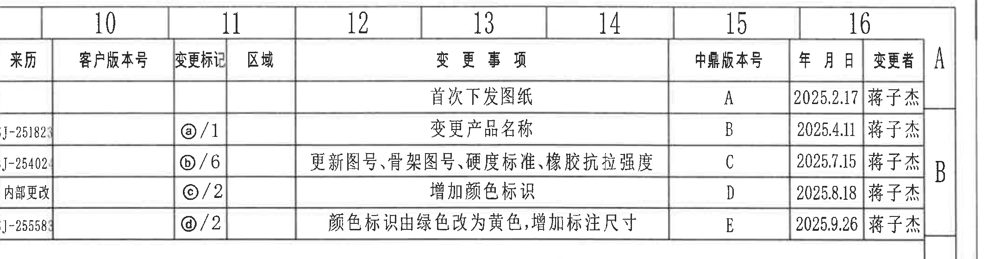
| 原图位置/视图名称 | 右上 A-B 网格，变更履历表 |
| --- | --- |
| object_kind | table |
| bbox | [2780, 80, 4940, 640] |

| 来源 | 客户版本号 | 变更标记 | 区域 | 变更事项 | 中鼎版本号 | 年月日 | 变更者 |
| --- | --- | --- | --- | --- | --- | --- | --- |
|  |  |  |  | 首次下发图纸 | A | 2025.2.17 | 蒋子杰 |
| SJ-25182 |  | ⓐ/1 |  | 变更产品名称 | B | 2025.4.11 | 蒋子杰 |
| SJ-25402 |  | ⓑ/6 |  | 更新图号、骨架图号、硬度标准、橡胶抗拉强度 | C | 2025.7.15 | 蒋子杰 |
| 内部更改 |  | ⓒ/2 |  | 增加颜色标识 | D | 2025.8.18 | 蒋子杰 |
| SJ-25558 |  | ⓓ/2 |  | 颜色标识由绿色改为黄色, 增加标注尺寸 | E | 2025.9.26 | 蒋子杰 |

| 提取项 | 原图数值或文本 | 含义说明 |
| --- | --- | --- |
| 表头 | 来源 / 客户版本号 / 变更标记 / 区域 / 变更事项 / 中鼎版本号 / 年月日 / 变更者 | 修订履历字段。 |
| 变更标记 | ⓐ/1, ⓑ/6, ⓒ/2, ⓓ/2 | 圈字母与图中相同圈号标注关联，斜杠后数字为区域/页内索引。 |
| 中鼎版本号 | A, B, C, D, E | 版本递增记录。 |
| 可读来源 | SJ-25182, SJ-25402, 内部更改, SJ-25558 | 来源列位于左边界，按扫描图可读文本提取。 |

边界归属说明：右侧图框字母 A/B 不属于表格；来源列靠近原扫描边界，未把图框外文字纳入表格。

## object_4 主视图/正面加工视图
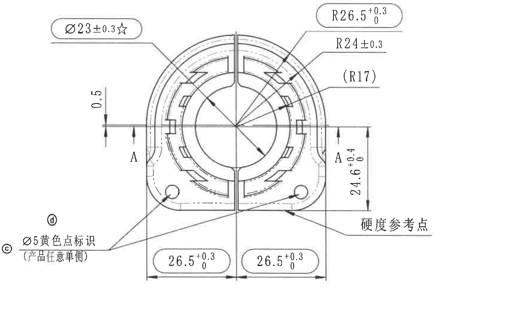
| 原图位置/视图名称 | 左中 C-F 网格，主视图/正面加工视图 |
| --- | --- |
| object_kind | view |
| bbox | [680, 690, 2400, 1750] |

| 提取项 | 原图数值或文本 | 含义说明 |
| --- | --- | --- |
| 直径尺寸 | Ø23±0.3☆ | 主视图上方引出至中心圆/孔位，直径23，公差±0.3；☆为关键特性。 |
| 外圆半径 | R26.5 +0.3/0 | 主视图右上外侧圆弧半径，单向公差上偏差+0.3、下偏差0。 |
| 圆弧半径 | R24±0.3 | 主视图右上内侧圆弧半径，公差±0.3。 |
| 参考半径 | (R17) | 括号尺寸，为参考半径；表示内部圆弧/轮廓参考，不作为普通控制尺寸。 |
| 窄槽/间隙 | 0.5 | 主视图左侧竖向小间隙尺寸。 |
| 剖切标识 | A-A | 主视图左右两侧剖切位置，对应 object_6 A-A 剖面。 |
| 高度尺寸 | 24.6 +0.4/0 | 主视图右侧竖向尺寸，控制底部参考线到上部剖切/轮廓位置。 |
| 硬度位置 | 硬度参考点 | 右下引出至零件底部区域，指示硬度测量参考位置。 |
| 底部左尺寸 | 26.5 +0.3/0 | 底部左半边水平尺寸，单向公差+0.3/0。 |
| 底部右尺寸 | 26.5 +0.3/0 | 底部右半边水平尺寸，单向公差+0.3/0。 |
| 颜色点标识 | ⓓ / ⓒ Ø5黄色点标识(产品任意单侧) | 直径5黄色点标识，产品任意单侧；带变更/颜色标记。 |

边界归属说明：本对象只提取主视图正面尺寸。A-A 剖切标识仅指向 object_6，不把剖面高度尺寸归入主视图；试验表和技术要求文本不属于本视图。

## object_5 表1 试验项目清单
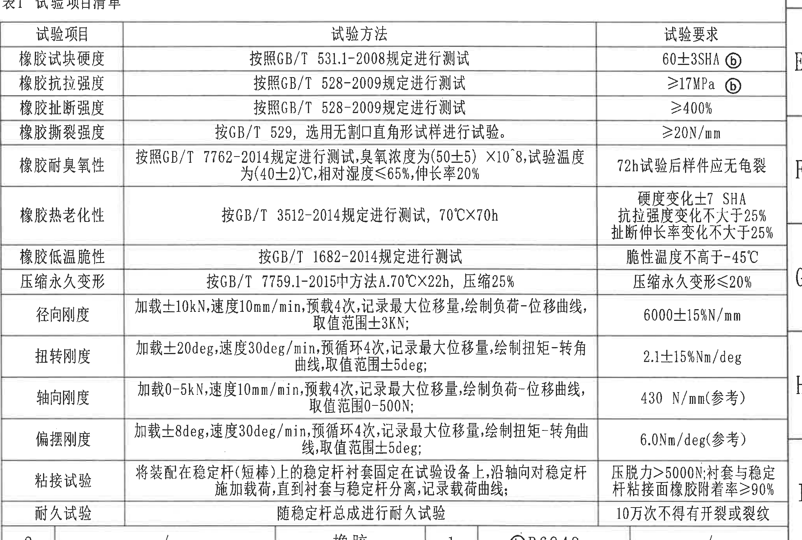
| 原图位置/视图名称 | 右侧 E-I 网格，表1 试验项目清单 |
| --- | --- |
| object_kind | table |
| bbox | [2770, 1120, 4820, 2500] |

| 试验项目 | 试验方法 | 试验要求 |
| --- | --- | --- |
| 橡胶试块硬度 | 按照GB/T 531.1-2008规定进行测试 | 60±3SHA ⓑ |
| 橡胶抗拉强度 | 按照GB/T 528-2009规定进行测试 | ≥17MPa ⓑ |
| 橡胶扯断强度 | 按照GB/T 528-2009规定进行测试 | ≥400% |
| 橡胶撕裂强度 | 按GB/T 529, 选用无割口直角形试样进行试验。 | ≥20N/mm |
| 橡胶耐臭氧性 | 按照GB/T 7762-2014规定进行测试, 臭氧浓度为(50±5)×10^8, 试验温度为(40±2)℃, 相对湿度≤65%, 伸长率20% | 72h试验后样件应无龟裂 |
| 橡胶热老化性 | 按GB/T 3512-2014规定进行测试, 70℃×70h | 硬度变化±7 SHA; 抗拉强度变化不大于25%; 扯断伸长率变化不大于25% |
| 橡胶低温脆性 | 按GB/T 1682-2014规定进行测试 | 脆性温度不高于-45℃ |
| 压缩永久变形 | 按GB/T 7759.1-2015中方法A, 70℃×22h, 压缩25% | 压缩永久变形≤20% |
| 径向刚度 | 加载±10kN, 速度10mm/min, 预载4次, 记录最大位移量, 绘制负荷-位移曲线, 取值范围±3kN | 6000±15%N/mm |
| 扭转刚度 | 加载±20deg, 速度30deg/min, 预循环4次, 记录最大位移量, 绘制扭矩-转角曲线, 取值范围±5deg | 2.1±15%Nm/deg |
| 轴向刚度 | 加载0-5kN, 速度10mm/min, 预载4次, 记录最大位移量, 绘制负荷-位移曲线, 取值范围0-500N | 430 N/mm(参考) |
| 偏摆刚度 | 加载±8deg, 速度30deg/min, 预循环4次, 记录最大位移量, 绘制扭矩-转角曲线, 取值范围±5deg | 6.0Nm/deg(参考) |
| 粘接试验 | 将装配在稳定杆(短棒)上的稳定杆衬套固定在试验设备上, 沿轴向对稳定杆施加载荷, 直到衬套与稳定杆分离, 记录载荷曲线 | 压脱力>5000N; 衬套与稳定杆粘接面橡胶附着率≥90% |
| 耐久试验 | 随稳定杆总成进行耐久试验 | 10万次不得有开裂或裂纹 |

| 提取项 | 原图数值或文本 | 含义说明 |
| --- | --- | --- |
| 硬度要求 | 60±3SHA ⓑ | 与属性表硬度一致，ⓑ对应变更记录。 |
| 抗拉强度 | ≥17MPa ⓑ | 橡胶抗拉强度下限要求，ⓑ对应变更记录。 |
| 参考刚度 | 430 N/mm(参考), 6.0Nm/deg(参考) | 括号“参考”表示参考要求/参考指标，仍按原图提取。 |
| 耐久次数 | 10万次不得有开裂或裂纹 | 耐久试验合格判据。 |

边界归属说明：底部完整包含“耐久试验”行；下方 BOM 表不归入试验清单。

## object_6 A-A 剖面视图
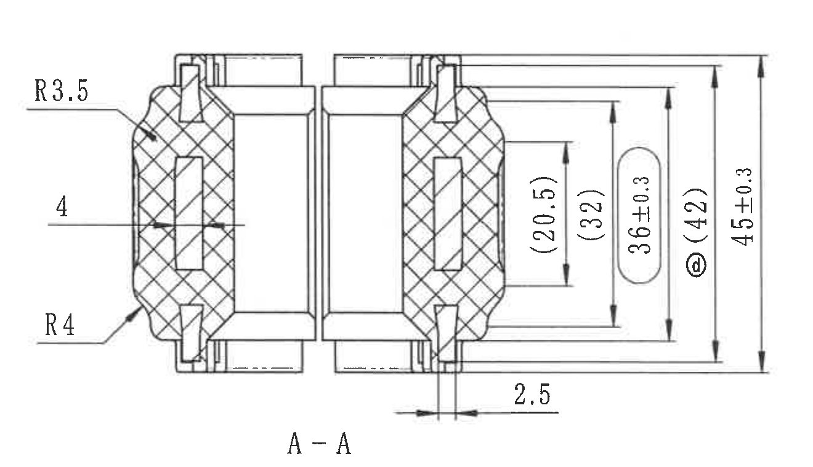
| 原图位置/视图名称 | 左下 G-I 网格，A-A 剖面视图 |
| --- | --- |
| object_kind | section |
| bbox | [960, 1710, 2280, 2470] |

| 提取项 | 原图数值或文本 | 含义说明 |
| --- | --- | --- |
| 剖视名称 | A-A | 对应主视图 A-A 剖切线。 |
| 外部圆角 | R3.5 | 剖面左上外轮廓圆角半径。 |
| 外部圆角 | R4 | 剖面左下外轮廓圆角半径。 |
| 局部尺寸 | 4 | 剖面左侧水平标注，指示局部厚度/宽度位置。 |
| 参考高度 | (20.5) | 括号内参考尺寸，位于右侧最内竖向尺寸线。 |
| 参考高度 | (32) | 括号内参考尺寸，位于右侧第二组竖向尺寸线。 |
| 控制高度 | 36±0.3 | 右侧带椭圆框高度尺寸，公差±0.3。 |
| 参考高度/变更标记 | ⓓ (42) | 括号内参考尺寸，带ⓓ变更标记。 |
| 总高度 | 45±0.3 | 右侧最外竖向总高度，公差±0.3。 |
| 底部间隙 | 2.5 | 剖面底部局部水平间隙尺寸。 |

边界归属说明：A-A 剖面尺寸独立提取，未归入主视图；顶部和右侧尺寸线、箭头和文字均完整。

## object_7 左下未注尺寸公差表
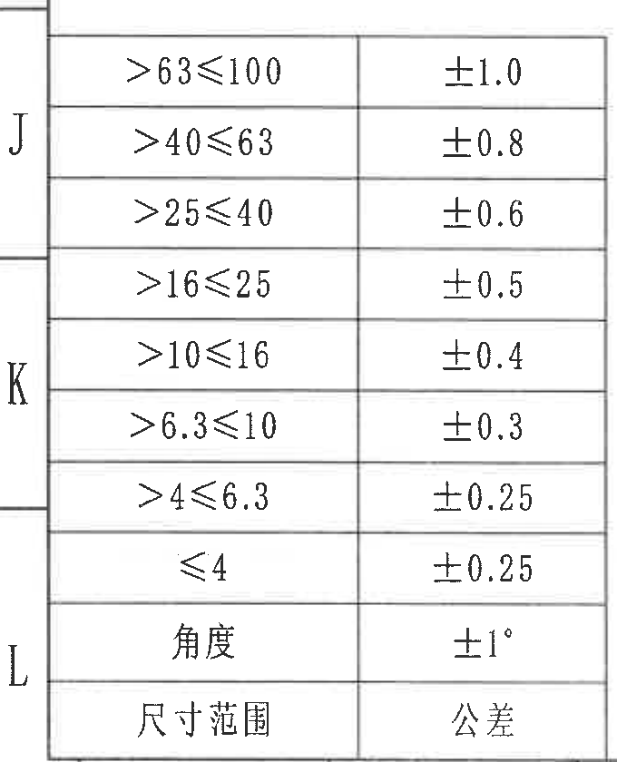
| 原图位置/视图名称 | 左下 J-L 网格，未注尺寸公差表 |
| --- | --- |
| object_kind | table |
| bbox | [330, 2500, 1010, 3340] |

| 尺寸范围 | 公差 |
| --- | --- |
| >63≤100 | ±1.0 |
| >40≤63 | ±0.8 |
| >25≤40 | ±0.6 |
| >16≤25 | ±0.5 |
| >10≤16 | ±0.4 |
| >6.3≤10 | ±0.3 |
| >4≤6.3 | ±0.25 |
| ≤4 | ±0.25 |
| 角度 | ±1° |

| 提取项 | 原图数值或文本 | 含义说明 |
| --- | --- | --- |
| 未注线性尺寸公差 | 见上表 | 用于未单独标注公差的线性尺寸。 |
| 未注角度公差 | ±1° | 用于未单独标注公差的角度尺寸。 |

边界归属说明：左侧 J/K/L 是图框坐标，不属于表格。

## object_8 技术要求 NOTES
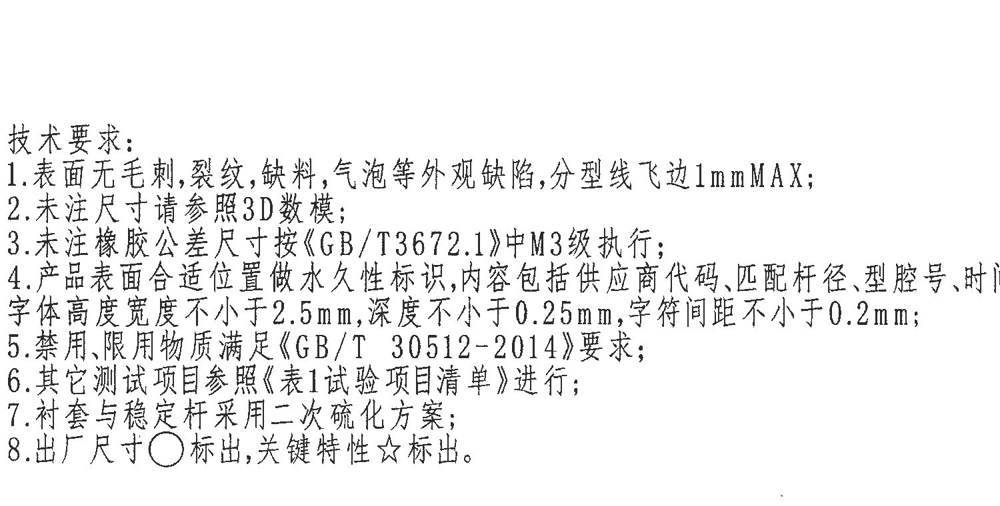
| 原图位置/视图名称 | 下中 J-L 网格，技术要求 |
| --- | --- |
| object_kind | notes |
| bbox | [1120, 2500, 2620, 3260] |

| 序号 | 原图文本 | 含义说明 |
| --- | --- | --- |
| 1 | 表面无毛刺、裂纹、缺料、气泡等外观缺陷, 分型线飞边1mmMAX; | 按原图技术要求转录。 |
| 2 | 未注尺寸请参照3D数模; | 按原图技术要求转录。 |
| 3 | 未注橡胶公差尺寸按《GB/T3672.1》中M3级执行; | 按原图技术要求转录。 |
| 4 | 产品表面合适位置做永久性标识, 内容包括供应商代码、匹配杆径、型腔号、时间钟, 字体高度宽度不小于2.5mm, 深度不小于0.25mm, 字符间距不小于0.2mm; | 按原图技术要求转录。 |
| 5 | 禁用、限用物质满足《GB/T 30512-2014》要求; | 按原图技术要求转录。 |
| 6 | 其它测试项目参照《表1试验项目清单》进行; | 按原图技术要求转录。 |
| 7 | 衬套与稳定杆采用二次硫化方案; | 按原图技术要求转录。 |
| 8 | 出厂尺寸○标出, 关键特性☆标出。 | 按原图技术要求转录。 |

边界归属说明：裁切区域不包含右侧标题栏字段；第8条解释主视图中的○和☆符号。

## object_9 右下标题栏
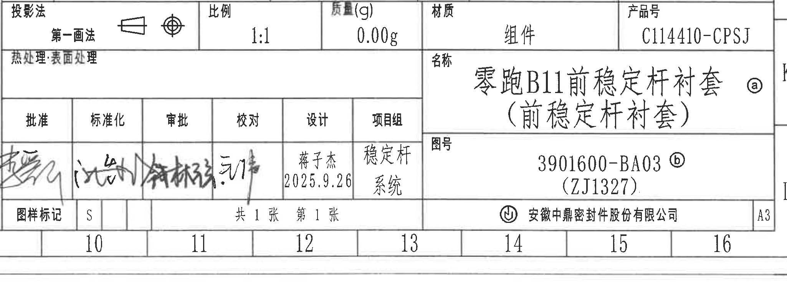
| 原图位置/视图名称 | 右下 J-L 网格，标题栏 |
| --- | --- |
| object_kind | title_block |
| bbox | [2770, 2740, 4820, 3505] |

| 字段 | 原图数值或文本 |
| --- | --- |
| 投影法 | 第一画法 |
| 比例 | 1:1 |
| 质量(g) | 0.00g |
| 材质 | 组件 |
| 产品号 | C114410-CPSJ |
| 名称 | 零跑B11前稳定杆衬套(前稳定杆衬套) ⓐ |
| 图号 | 3901600-BA03 ⓑ (ZJ1327) |
| 设计 | 蒋子杰 2025.9.26 |
| 项目组 | 稳定杆系统 |
| 图样标记 | S |
| 页码 | 共1张 第1张 |
| 公司 | 安徽中鼎密封件股份有限公司 |
| 幅面 | A3 |

| 提取项 | 原图数值或文本 | 含义说明 |
| --- | --- | --- |
| 投影法 | 第一画法 | 图样采用第一角法投影。 |
| 名称 | 零跑B11前稳定杆衬套(前稳定杆衬套) ⓐ | 图样名称，ⓐ对应变更履历 B 行产品名称变更。 |
| 图号 | 3901600-BA03 ⓑ (ZJ1327) | 主图号和括号内参考/关联编号，ⓑ对应变更记录。 |

边界归属说明：上方 BOM/材料明细另见 object_11；标题栏只提取投影法、比例、名称、图号、签审和公司信息。

## object_10 主视图局部标注：黄色点标识与 26.5 尺寸
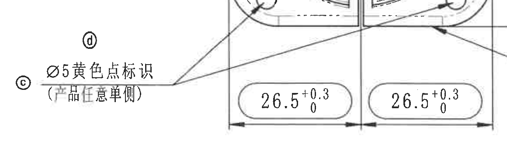
| 原图位置/视图名称 | 主视图左下/底部局部标注 |
| --- | --- |
| object_kind | detail |
| bbox | [650, 1340, 1810, 1670] |

| 提取项 | 原图数值或文本 | 含义说明 |
| --- | --- | --- |
| 局部颜色标识 | ⓓ; ⓒ Ø5黄色点标识(产品任意单侧) | 主视图局部放大，说明黄色点直径5，产品任意单侧；ⓒ/ⓓ为变更标记。 |
| 底部左尺寸 | 26.5 +0.3/0 | 同主视图底部左半边尺寸。 |
| 底部右尺寸 | 26.5 +0.3/0 | 同主视图底部右半边尺寸。 |

边界归属说明：该局部对象归属于 object_4 主视图，用于确认边界附近黄色点标识和 26.5 尺寸；不单独作为剖面视图。

## object_11 右下 BOM/材料明细表
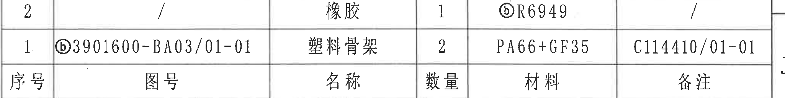
| 原图位置/视图名称 | 试验表下方、标题栏上方，BOM/材料明细 |
| --- | --- |
| object_kind | table |
| bbox | [2770, 2480, 4820, 2740] |

| 序号 | 图号 | 名称 | 数量 | 材料 | 备注 |
| --- | --- | --- | --- | --- | --- |
| 2 | / | 橡胶 | 1 | ⓑR6949 | / |
| 1 | ⓑ3901600-BA03/01-01 | 塑料骨架 | 2 | PA66+GF35 | C114410/01-01 |

| 提取项 | 原图数值或文本 | 含义说明 |
| --- | --- | --- |
| 橡胶材料 | ⓑR6949 | BOM 第2项，材料与左上属性表“胶料 R6949”一致。 |
| 塑料骨架材料 | PA66+GF35 | BOM 第1项，塑料骨架材料。 |
| 备注 | C114410/01-01 | 塑料骨架备注/关联号。 |

边界归属说明：上方相邻试验表仅为边界；下方标题栏不在本对象提取范围。

## 裁切检查记录
| 对象 | 名称 | 检查结果 |
| --- | --- | --- |
| object_1 | 左上产品属性表 | 完整。表格线和单元格文字均在裁切内；左侧/上侧图框坐标线为边界参照。 |
| object_2 | 上方产品说明框 | 完整。说明框四边和文字均完整，无相邻对象文字。 |
| object_3 | 右上变更履历表 | 完整。右侧日期/变更者完整；左侧来源列为原扫描边缘字段，可读项已提取，右侧图框字母 A/B 不归入表。 |
| object_4 | 主视图 | 完整。所有主视图尺寸线、箭头和文字均包含；底部黄色点标识靠近边缘但未裁断，另用 object_10 局部裁切辅助读取。 |
| object_5 | 试验项目清单 | 完整。表头至“耐久试验”行均完整；下方相邻 BOM 分界不提取。 |
| object_6 | A-A 剖面视图 | 完整。顶部和右侧高度尺寸线经重裁后未贴边；未混入主视图尺寸。 |
| object_7 | 未注尺寸公差表 | 完整。表格正文完整；左侧 J/K/L 为图框坐标栏，不归入表。 |
| object_8 | 技术要求 NOTES | 完整。1-8 条文字完整，无标题栏内容。 |
| object_9 | 标题栏 | 完整。标题栏主体字段完整；BOM 明细已单独裁切为 object_11。 |
| object_10 | 主视图局部标注 | 完整。黄色点标识和两处 26.5 尺寸线、箭头、文字完整；归属主视图。 |
| object_11 | BOM/材料明细表 | 完整。两条明细和表头完整；上方试验表仅相邻边界，不提取。 |
