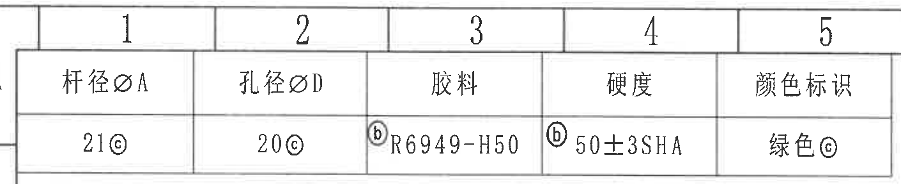
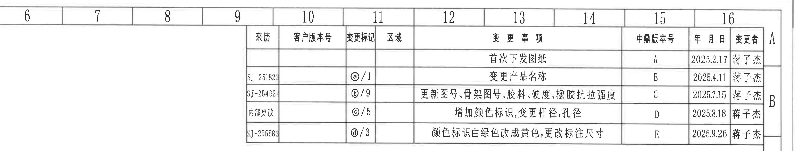
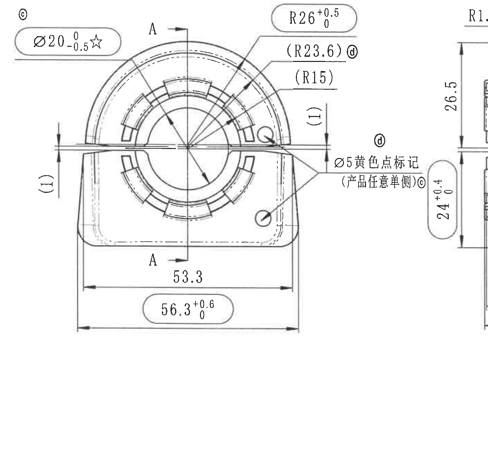
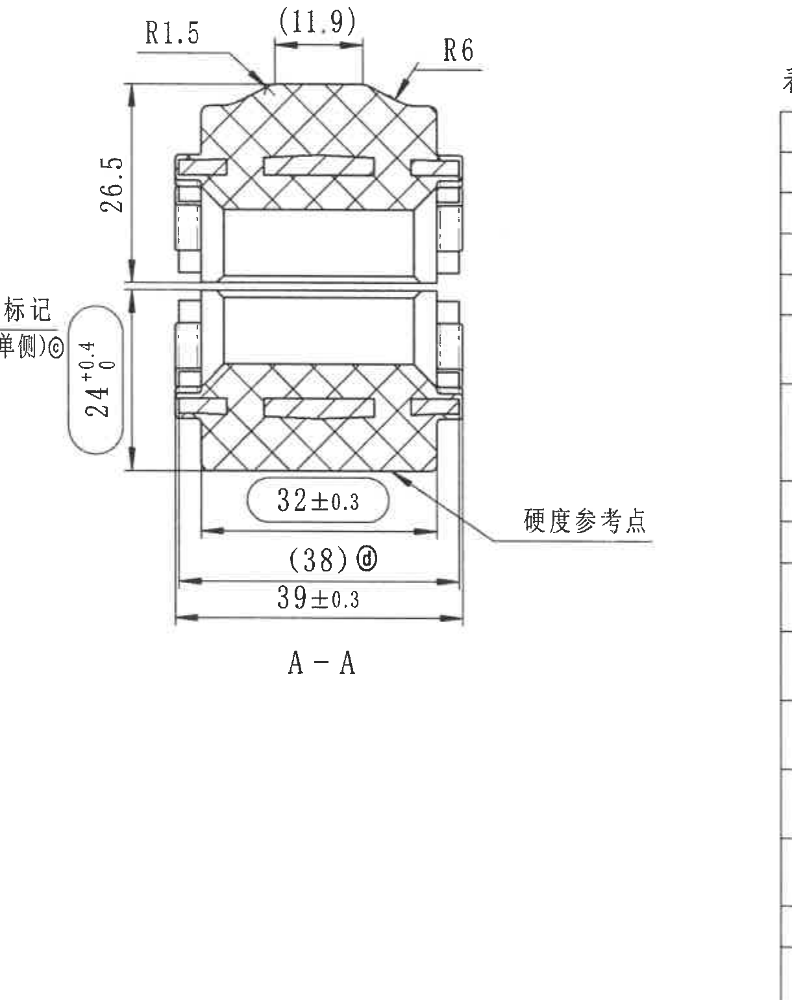
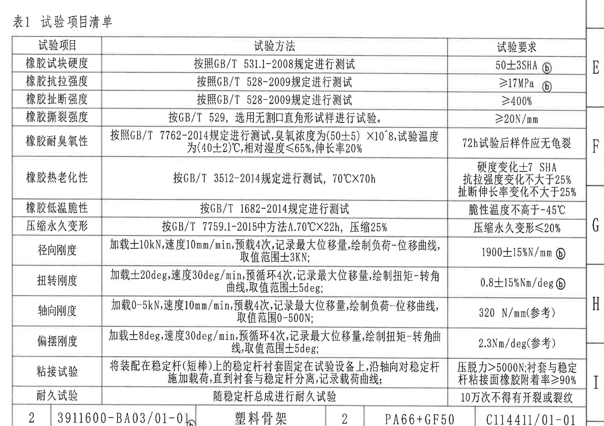
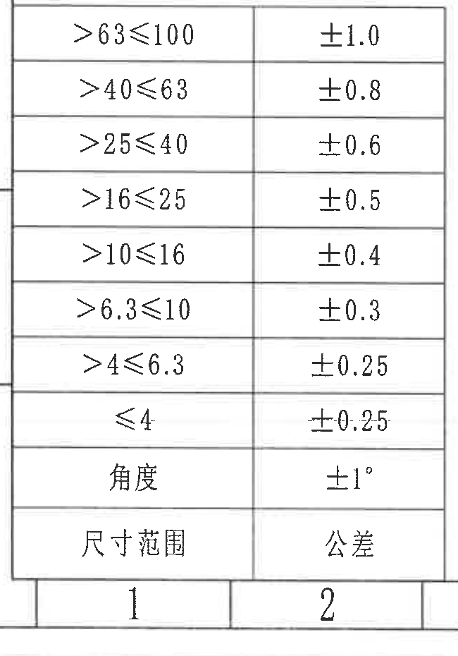
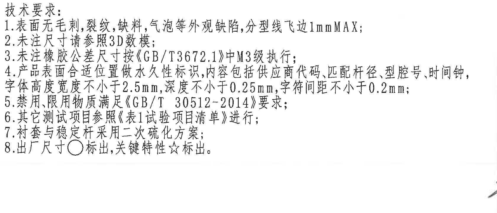
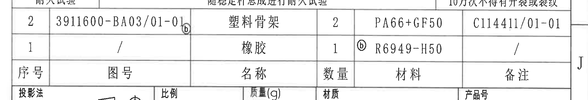
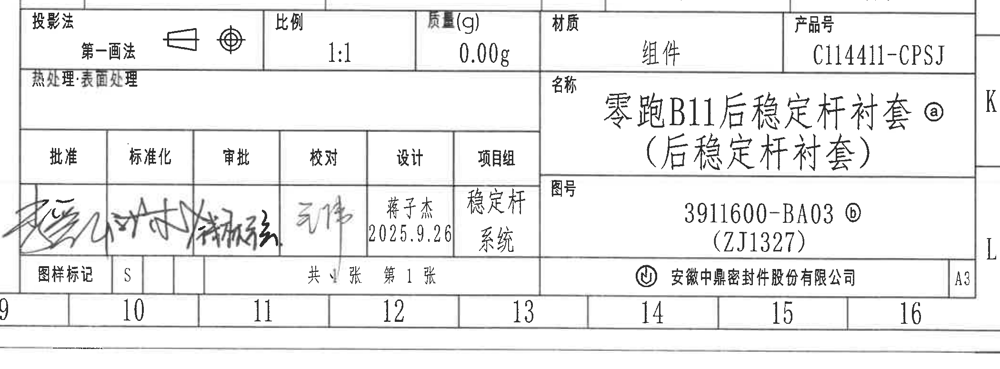
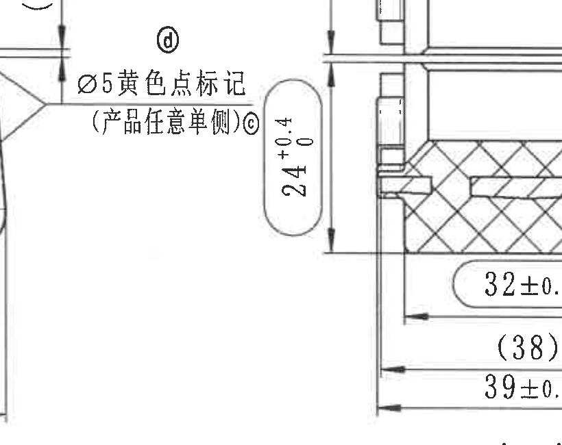

# 20C114411 内容识别

整页渲染 PNG：`outputs/20C114411_assets/images/page_1.png`  
整页尺寸：4959 × 3505 px。以下 bbox 坐标均以整页 PNG 左上角为原点，格式为 `[x0, y0, x1, y1]`。

## object_1 参数表

原图位置/视图名称：页面左上 A 区参数表，bbox `[350, 80, 1760, 370]`。

| 杆径ØA | 孔径ØD | 胶料 | 硬度 | 颜色标识 |
|---|---|---|---|---|
| 21ⓒ | 20ⓒ | ⓑ R6949-H50 | ⓑ 50±3SHA | 绿色ⓒ |

| 提取项 | 原图数值或文本 | 含义说明 |
|---|---|---|
| 杆径ØA | 21ⓒ | 稳定杆匹配杆径参数，带变更标记ⓒ。 |
| 孔径ØD | 20ⓒ | 衬套孔径参数，带变更标记ⓒ。 |
| 胶料 | ⓑ R6949-H50 | 橡胶材料牌号，带变更标记ⓑ。 |
| 硬度 | ⓑ 50±3SHA | 橡胶硬度要求，肖氏 A，公差 ±3，带变更标记ⓑ。 |
| 颜色标识 | 绿色ⓒ | 图纸当前参数表内的颜色标识，带变更标记ⓒ。 |

边界归属说明：裁切包含上方图框坐标 1-5；该坐标属于图纸边框，不属于参数表字段，未作为表格内容提取。

## object_2 修订履历表

原图位置/视图名称：页面右上 A-B 区修订履历表，bbox `[1810, 70, 4910, 660]`。

| 来历 | 客户版本号 | 变更标记 | 区域 | 变更事项 | 中鼎版本号 | 年月日 | 变更者 |
|---|---|---|---|---|---|---|---|
|  |  |  |  | 首次下发图纸 | A | 2025.2.17 | 蒋子杰 |
| SJ-25182 |  | ⓐ/1 |  | 变更产品名称 | B | 2025.4.11 | 蒋子杰 |
| SJ-25402 |  | ⓑ/9 |  | 更新图号、骨架图号、胶料、硬度、橡胶抗拉强度 | C | 2025.7.15 | 蒋子杰 |
| 内部更改 |  | ⓒ/5 |  | 增加颜色标识,变更杆径,孔径 | D | 2025.8.18 | 蒋子杰 |
| SJ-25558 |  | ⓓ/3 |  | 颜色标识由绿色改成黄色,更改标注尺寸 | E | 2025.9.26 | 蒋子杰 |

| 提取项 | 原图数值或文本 | 含义说明 |
|---|---|---|
| 版本 A | 首次下发图纸；2025.2.17；蒋子杰 | 初次发布记录。 |
| 版本 B | ⓐ/1；变更产品名称；2025.4.11 | 与标题栏产品名称处ⓐ对应。 |
| 版本 C | ⓑ/9；更新图号、骨架图号、胶料、硬度、橡胶抗拉强度；2025.7.15 | 与材料、硬度、图号、试验要求等处ⓑ对应。 |
| 版本 D | ⓒ/5；增加颜色标识,变更杆径,孔径；2025.8.18 | 与参数表和黄色点标记处ⓒ对应。 |
| 版本 E | ⓓ/3；颜色标识由绿色改成黄色,更改标注尺寸；2025.9.26 | 与参考尺寸标注处ⓓ对应。 |

边界归属说明：裁切包含上方图框坐标 6-16 和右侧图框字母 A/B；这些是图框定位信息，不作为修订表字段提取。

## object_3 主加工视图

原图位置/视图名称：页面左中 D-G 区主加工视图，bbox `[425, 1015, 1845, 2395]`。

| 提取项 | 原图数值或文本 | 含义说明 |
|---|---|---|
| 变更标记 | ⓒ | 位于 Ø20 标注附近；对应修订履历中“增加颜色标识,变更杆径,孔径”。 |
| 孔径关键尺寸 | Ø20 0/-0.5 ☆ | 内孔直径 20，上偏差 0，下偏差 -0.5；☆表示关键特性。 |
| 外圆弧半径 | R26 +0.5/0 | 主视图上部圆弧半径 26，上偏差 +0.5，下偏差 0。 |
| 参考半径 | (R23.6) ⓓ | 括号内参考尺寸；与变更标记ⓓ关联。 |
| 参考半径 | (R15) | 括号内参考尺寸，用于说明内侧圆弧轮廓。 |
| 参考局部尺寸 | (1) | 在左右水平分型/唇边附近各出现一次；括号表示参考尺寸。 |
| 剖切基准字母 | A-A | 主视图竖向剖切线和上下箭头，剖面结果见 object_4。 |
| 水平尺寸 | 53.3 | 主视图下部内侧宽度/基准宽度尺寸。 |
| 水平外宽 | 56.3 +0.6/0 | 主视图下部外宽尺寸，上偏差 +0.6，下偏差 0。 |
| 局部标记 | Ø5 黄色点标记（产品任意单侧）ⓒ | 产品任意单侧设置直径 5 的黄色点标记，带变更标记ⓒ。 |
| 数量前缀 | 未见 | 当前主视图未见“n×”或类似数量前缀标注。 |
| T 编号 | 未见 | 当前主视图未见独立 T 编号。 |
| 角度/弧向尺寸 | 未见角度和弧长标注；见 R 类半径标注 | 当前主视图的圆弧信息以 R 半径形式表达。 |
| 总高度 | 未见单一总高度尺寸 | 当前主视图未给出整体高度尺寸；相邻剖面中有 26.5 和 24+0.4/0。 |

边界归属说明：为完整包含“Ø5 黄色点标记（产品任意单侧）ⓒ”引出文字，裁切右侧露出 A-A 剖面左缘和 24+0.4/0 标注；这些相邻剖面尺寸不归入主视图尺寸，已在 object_4 和 object_10 中说明。

## object_4 A-A 剖面视图

原图位置/视图名称：页面中部 D-H 区 A-A 剖面视图，bbox `[1565, 1010, 2785, 2550]`。

| 提取项 | 原图数值或文本 | 含义说明 |
|---|---|---|
| 剖面名称 | A-A | 对应主视图 A-A 剖切线。 |
| 圆角半径 | R1.5 | 剖面顶部左侧圆角半径。 |
| 参考宽度 | (11.9) | 顶部平台宽度，括号表示参考尺寸。 |
| 圆角半径 | R6 | 剖面顶部右侧圆角半径。 |
| 垂直尺寸 | 26.5 | 剖面上半部垂直高度/距离尺寸。 |
| 垂直尺寸 | 24 +0.4/0 | 剖面下半部垂直高度/距离尺寸，上偏差 +0.4，下偏差 0。 |
| 水平尺寸 | 32±0.3 | 剖面底部局部宽度，公差 ±0.3。 |
| 参考宽度 | (38) ⓓ | 剖面底部参考宽度，括号表示参考尺寸，带变更标记ⓓ。 |
| 水平总宽 | 39±0.3 | 剖面底部外侧宽度/总宽，公差 ±0.3。 |
| 硬度测点 | 硬度参考点 | 引出线指向剖面下部橡胶区域，说明硬度测试参考位置。 |
| 数量前缀 | 未见 | 当前剖面未见数量前缀标注。 |
| T 编号 | 未见 | 当前剖面未见独立 T 编号。 |
| 角度/弧向尺寸 | 未见角度和弧长标注；见 R1.5、R6 半径 | 剖面圆角以半径标注表达。 |
| 总高度 | 未见单一总高度尺寸 | 当前剖面给出上下分段垂直尺寸 26.5 和 24+0.4/0，未给出整体相加总高度标注。 |

边界归属说明：左边界为完整保留 24+0.4/0 的尺寸线和箭头，带入了主视图“黄色点标记”尾部文字；该文字不归入 A-A 剖面。右边界接近试验表区域但未提取试验表内容。

## object_5 表1 试验项目清单

原图位置/视图名称：页面右中 E-I 区试验项目清单，bbox `[2725, 1055, 4835, 2545]`。

| 试验项目 | 试验方法 | 试验要求 |
|---|---|---|
| 橡胶试块硬度 | 按照GB/T 531.1-2008规定进行测试 | 50±3SHA ⓑ |
| 橡胶抗拉强度 | 按照GB/T 528-2009规定进行测试 | ≥17MPa ⓑ |
| 橡胶扯断强度 | 按照GB/T 528-2009规定进行测试 | ≥400% |
| 橡胶撕裂强度 | 按GB/T 529，选用无割口直角形试样进行试验。 | ≥20N/mm |
| 橡胶耐臭氧性 | 按照GB/T 7762-2014规定进行测试，臭氧浓度为(50±5) ×10^8，试验温度为(40±2)℃，相对湿度≤65%，伸长率20% | 72h试验后样件应无龟裂 |
| 橡胶热老化性 | 按GB/T 3512-2014规定进行测试，70℃×70h | 硬度变化±7 SHA；抗拉强度变化不大于25%；扯断伸长率变化不大于25% |
| 橡胶低温脆性 | 按GB/T 1682-2014规定进行测试 | 脆性温度不高于-45℃ |
| 压缩永久变形 | 按GB/T 7759.1-2015中方法A.70℃×22h，压缩25% | 压缩永久变形≤20% |
| 径向刚度 | 加载±10kN，速度10mm/min，预载4次，记录最大位移量，绘制负荷-位移曲线，取值范围±3kN； | 1900±15%N/mm ⓑ |
| 扭转刚度 | 加载±20deg，速度30deg/min，预循环4次，记录最大位移量，绘制扭矩-转角曲线，取值范围±5deg； | 0.8±15%Nm/deg ⓑ |
| 轴向刚度 | 加载0-5kN，速度10mm/min，预载4次，记录最大位移量，绘制负荷-位移曲线，取值范围0-500N； | 320 N/mm(参考) |
| 偏摆刚度 | 加载±8deg，速度30deg/min，预循环4次，记录最大位移量，绘制扭矩-转角曲线，取值范围±5deg； | 2.3Nm/deg(参考) |
| 粘接试验 | 将装配在稳定杆(短棒)上的稳定杆衬套固定在试验设备上，沿轴向对稳定杆施加载荷，直到衬套与稳定杆分离，记录载荷曲线。 | 压脱力>5000N；衬套与稳定杆粘接面橡胶附着率≥90% |
| 耐久试验 | 随稳定杆总成进行耐久试验 | 10万次不得有开裂或裂纹 |

| 提取项 | 原图数值或文本 | 含义说明 |
|---|---|---|
| 表号 | 表1 试验项目清单 | 技术要求第 6 条引用的试验项目清单。 |
| 参考要求 | 320 N/mm(参考)、2.3Nm/deg(参考) | 括号内“参考”表示轴向刚度、偏摆刚度为参考要求。 |
| 角度条件 | ±20deg、30deg/min、±5deg；±8deg、30deg/min、±5deg | 扭转刚度和偏摆刚度试验中的角度/角速度/取值范围。 |
| 变更标记 | ⓑ | 出现在硬度、抗拉强度、径向刚度、扭转刚度等要求处，与修订履历版本 C 对应。 |
| 臭氧浓度指数 | ×10^8 | 扫描件指数位置较小，按高分辨率局部检查可见内容记录为 ×10^8。 |

边界归属说明：裁切右侧包含图框坐标字母 E-I；这些属于图框定位。下边缘与明细表相接，露出上边框残片；试验表只提取至“耐久试验”行。

## object_6 一般公差表

原图位置/视图名称：页面左下 J-L 区一般公差表，bbox `[360, 2515, 1010, 3445]`。

| 尺寸范围 | 公差 |
|---|---|
| >63≤100 | ±1.0 |
| >40≤63 | ±0.8 |
| >25≤40 | ±0.6 |
| >16≤25 | ±0.5 |
| >10≤16 | ±0.4 |
| >6.3≤10 | ±0.3 |
| >4≤6.3 | ±0.25 |
| ≤4 | ±0.25 |
| 角度 | ±1° |

| 提取项 | 原图数值或文本 | 含义说明 |
|---|---|---|
| 未注线性尺寸公差 | 见尺寸范围/公差表 | 用于未单独标注公差的尺寸。 |
| 未注角度公差 | 角度 ±1° | 用于未单独标注公差的角度尺寸。 |

边界归属说明：裁切底部带入图框坐标 1、2；这些不属于一般公差表。表头在原图底部可见，Markdown 中按“尺寸范围/公差”还原为表头。

## object_7 NOTES / 技术要求

原图位置/视图名称：页面下中 J-K 区技术要求，bbox `[1080, 2560, 2760, 3280]`。

| 提取项 | 原图数值或文本 | 含义说明 |
|---|---|---|
| 技术要求 1 | 表面无毛刺,裂纹,缺料,气泡等外观缺陷,分型线飞边1mmMAX; | 外观缺陷和分型线飞边限制。 |
| 技术要求 2 | 未注尺寸请参照3D数模; | 未注尺寸以 3D 数模为依据。 |
| 技术要求 3 | 未注橡胶公差尺寸按《GB/T3672.1》中M3级执行; | 未注橡胶尺寸公差等级。 |
| 技术要求 4 | 产品表面合适位置做永久性标识,内容包括供应商代码,匹配杆径,型腔号,时间钟,字体高度宽度不小于2.5mm,深度不小于0.25mm,字符间距不小于0.2mm; | 永久标识内容、字符尺寸、深度和间距要求。 |
| 技术要求 5 | 禁用,限用物质满足《GB/T 30512-2014》要求; | 受限物质要求。 |
| 技术要求 6 | 其它测试项目参照《表1试验项目清单》进行; | 指向 object_5 试验项目清单。 |
| 技术要求 7 | 衬套与稳定杆采用二次硫化方案; | 工艺方案要求。 |
| 技术要求 8 | 出厂尺寸○标出,关键特性☆标出。 | 出厂尺寸和关键特性的图形符号说明。 |

边界归属说明：右下角有相邻签名区域的少量笔画，不属于 NOTES 文本；已排除。技术要求第 4 条为完整句末，未被裁断。

## object_8 明细表

原图位置/视图名称：页面右下 J 区明细表，bbox `[2725, 2440, 4835, 2800]`。

| 序号 | 图号 | 名称 | 数量 | 材料 | 备注 |
|---|---|---|---|---|---|
| 2 | 3911600-BA03/01-01 ⓑ | 塑料骨架 | 2 | PA66+GF50 | C114411/01-01 |
| 1 | / | 橡胶 | 1 | ⓑ R6949-H50 | / |

| 提取项 | 原图数值或文本 | 含义说明 |
|---|---|---|
| 明细行 2 | 图号 3911600-BA03/01-01 ⓑ；塑料骨架；数量 2；PA66+GF50；备注 C114411/01-01 | 塑料骨架组件信息。 |
| 明细行 1 | 图号 /；橡胶；数量 1；ⓑ R6949-H50；备注 / | 橡胶材料信息。 |

边界归属说明：上边界与试验表“耐久试验”行相接，下边界与标题栏表头相接；提取只还原明细表内“序号/图号/名称/数量/材料/备注”区域。

## object_9 标题栏

原图位置/视图名称：页面右下 K-L 区标题栏，bbox `[2725, 2730, 4825, 3505]`。

| 字段 | 原图数值或文本 |
|---|---|
| 投影法 | 第一画法 |
| 比例 | 1:1 |
| 质量(g) | 0.00g |
| 材质 | 组件 |
| 产品号 | C114411-CPSJ |
| 热处理/表面处理 | 空白 |
| 名称 | 零跑B11后稳定杆衬套ⓐ（后稳定杆衬套） |
| 图号 | 3911600-BA03 ⓑ（ZJ1327） |
| 批准 | 签名 |
| 标准化 | 签名 |
| 审批 | 签名 |
| 校对 | 签名 |
| 设计 | 蒋子杰；2025.9.26 |
| 项目组 | 稳定杆；系统 |
| 图样标记 | S |
| 页数 | 共 1 张 第 1 张 |
| 公司 | 安徽中鼎密封件股份有限公司 |
| 幅面 | A3 |

| 提取项 | 原图数值或文本 | 含义说明 |
|---|---|---|
| 产品号 | C114411-CPSJ | 图纸产品代号。 |
| 名称 | 零跑B11后稳定杆衬套ⓐ（后稳定杆衬套） | 产品名称，带变更标记ⓐ。 |
| 图号 | 3911600-BA03 ⓑ（ZJ1327） | 图纸号/内部编号，带变更标记ⓑ。 |
| 比例/质量/材质 | 1:1；0.00g；组件 | 标题栏基础属性。 |

边界归属说明：标题栏上缘与明细表相接，裁切包含共边附近内容；物料明细不在本对象提取，已归入 object_8。底部包含图框坐标 9-16，这些不属于标题栏字段。

## object_10 局部标注：黄色点标记与相邻尺寸

原图位置/视图名称：主视图右侧与 A-A 剖面左侧相邻处局部标注，bbox `[1285, 1365, 2105, 2015]`。

| 提取项 | 原图数值或文本 | 含义说明 |
|---|---|---|
| 局部标记 | Ø5 黄色点标记 | 标记直径为 5。 |
| 标记位置说明 | （产品任意单侧）ⓒ | 黄色点可位于产品任意单侧，带变更标记ⓒ。 |
| 相邻剖面尺寸 | 24 +0.4/0 | 该尺寸线与 A-A 剖面左侧轮廓相连，归属 object_4；本局部裁切用于说明边界位置和防止误归属。 |
| 相邻变更标记 | ⓓ | 处于局部裁切上方，关联主视图参考尺寸/相邻标注，不作为 Ø5 黄色点标记本身的尺寸。 |

边界归属说明：该裁切故意覆盖主视图右侧标记文字和 A-A 剖面的左侧尺寸，以核对边界归属。最终尺寸归属为：Ø5 黄色点标记属于主视图/局部标记；24+0.4/0 属于 A-A 剖面；右侧剖面结构不重复提取为局部视图几何。

## 裁切检查记录

| 对象 | 检查结果 | 边界处理 |
|---|---|---|
| object_1 参数表 | 完整包含表格文字和单元格线 | 上方图框坐标带入，已排除。 |
| object_2 修订履历表 | 完整包含 REV/变更事项/日期/变更者等行列 | 右侧和上方图框坐标带入，已排除。 |
| object_3 主加工视图 | 完整包含主视图尺寸线、箭头和 Ø5 标记文字 | 为保留右侧标记文字，带入 A-A 剖面左缘；相邻剖面尺寸未归入主视图。 |
| object_4 A-A 剖面视图 | 完整包含剖面尺寸线、箭头、文字和 A-A 名称 | 左侧带入主视图标记尾部，已排除；24+0.4/0 保留完整。 |
| object_5 试验项目清单 | 完整包含表头和全部试验行 | 右侧图框字母和下方相邻表格上边缘带入，未提取为试验表内容。 |
| object_6 一般公差表 | 完整包含尺寸范围、公差和角度公差 | 底部图框坐标 1、2 带入，已排除。 |
| object_7 技术要求 | 完整包含 1-8 条 NOTES 文本 | 右下角相邻签名字迹小片段带入，已排除。 |
| object_8 明细表 | 完整包含两条明细行和表头 | 上下分别与试验表、标题栏共边；只提取明细表字段。 |
| object_9 标题栏 | 完整包含标题栏主要字段、签字区、图号、公司和幅面 | 顶部与明细表共边；物料明细已归入 object_8。 |
| object_10 局部标注 | 完整包含 Ø5 黄色点标记、产品任意单侧说明和相邻 24 尺寸 | 用于边界判定；24+0.4/0 归属 A-A 剖面，不重复归入主视图。 |

