# 20C114420 内容识别

- 输入文件：`input/20C114420.pdf`
- 整页 PNG：`20C114420_assets/images/page_1.png`
- 页面：第 1 页，4959 x 3505 px，bbox `[0, 0, 4959, 3505]`
- 坐标基准：整页 PNG 左上角为原点，bbox 为 `[x0, y0, x1, y1]`
- 识别说明：原文件为扫描图，以下文字和尺寸按裁切图中可见内容转写；未在裁切图中出现的 T 编号未补写。

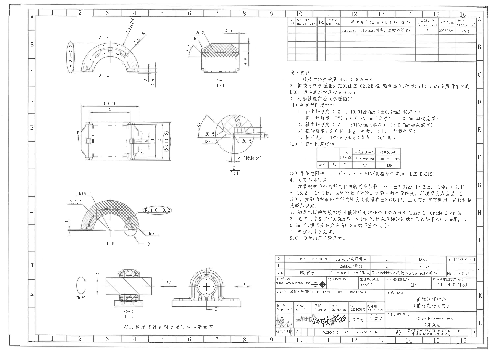

## object_1 - 上左主视图

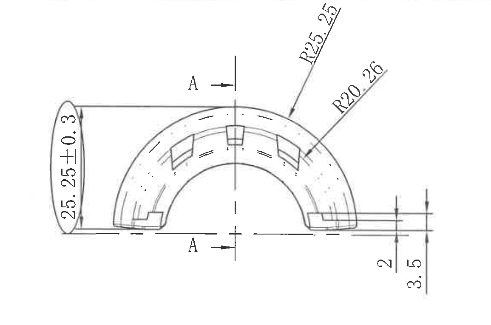

- 原图位置/视图名称：第 1 页，上左主视图，bbox `[540, 175, 1695, 940]`

| 提取项 | 原图数值或文本 | 含义说明 |
|---|---:|---|
| 外形竖向尺寸 | 25.25±0.3（椭圆框） | 主视图左侧竖向尺寸，标注整体外形高度；椭圆框按技术要求第 8 条为出厂检验尺寸。 |
| 半径 | R25.25 | 上部外圆弧半径，箭头指向外侧大圆弧。 |
| 半径 | R20.26 | 内侧/槽形相关圆弧半径，箭头指向右上方内圆弧区域。 |
| 台阶/厚度尺寸 | 2 | 右下伸出部位内侧竖向尺寸，尺寸线连接该局部台阶。 |
| 总高/局部高度 | 3.5 | 右下伸出部位外侧竖向总高度，尺寸线连接外侧上下边。 |
| 剖切标识 | A-A | 中心竖向剖切线及上下箭头，指向 object_2 的 A-A 剖视图。 |
| T 编号 | 未见 | 本裁切对象中未出现 T 编号。 |

边界归属说明：左侧椭圆框 25.25±0.3、右侧 2 和 3.5 的尺寸线与箭头均完整保留，并归属于本主视图；A-A 只作为剖切位置标识，A-A 剖面内的 45°、R4.5、R1、0.5、6.6 等尺寸归属于 object_2。

## object_2 - A-A 剖视图

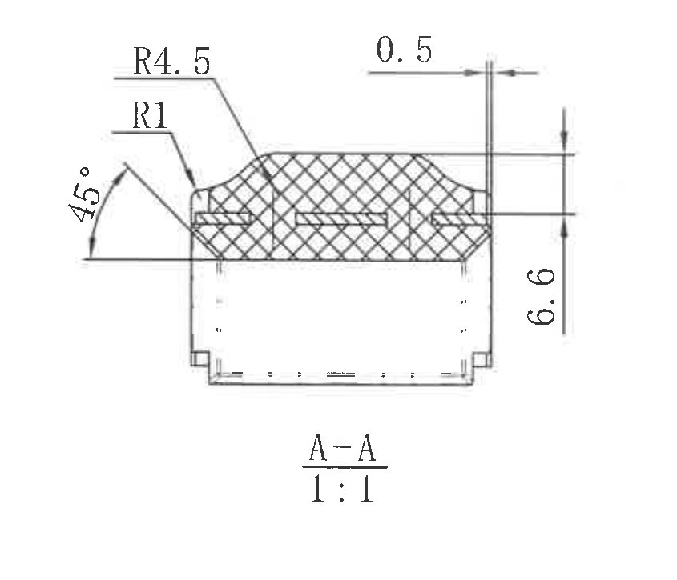

- 原图位置/视图名称：第 1 页，A-A 剖视图，比例 1:1，bbox `[1760, 240, 2605, 965]`

| 提取项 | 原图数值或文本 | 含义说明 |
|---|---:|---|
| 剖视名称 | A-A | 对应 object_1 中 A-A 剖切位置。 |
| 比例 | 1:1 | 剖视图绘图比例。 |
| 角度 | 45° | 左侧斜面/倒角角度。 |
| 半径 | R4.5 | 上部圆角/过渡圆弧半径。 |
| 半径 | R1 | 左上内侧小圆角半径。 |
| 小尺寸 | 0.5 | 上方右侧水平尺寸，表示局部窄边/偏距。 |
| 竖向尺寸 | 6.6 | 右侧剖面竖向高度尺寸。 |
| T 编号 | 未见 | 本裁切对象中未出现 T 编号。 |

边界归属说明：本图只提取 A-A 剖面内部尺寸和剖面名称，未把 object_1 主视图中的 R25.25、R20.26、25.25±0.3 或右下 2/3.5 归入本对象。

## object_3 - 中部尺寸视图

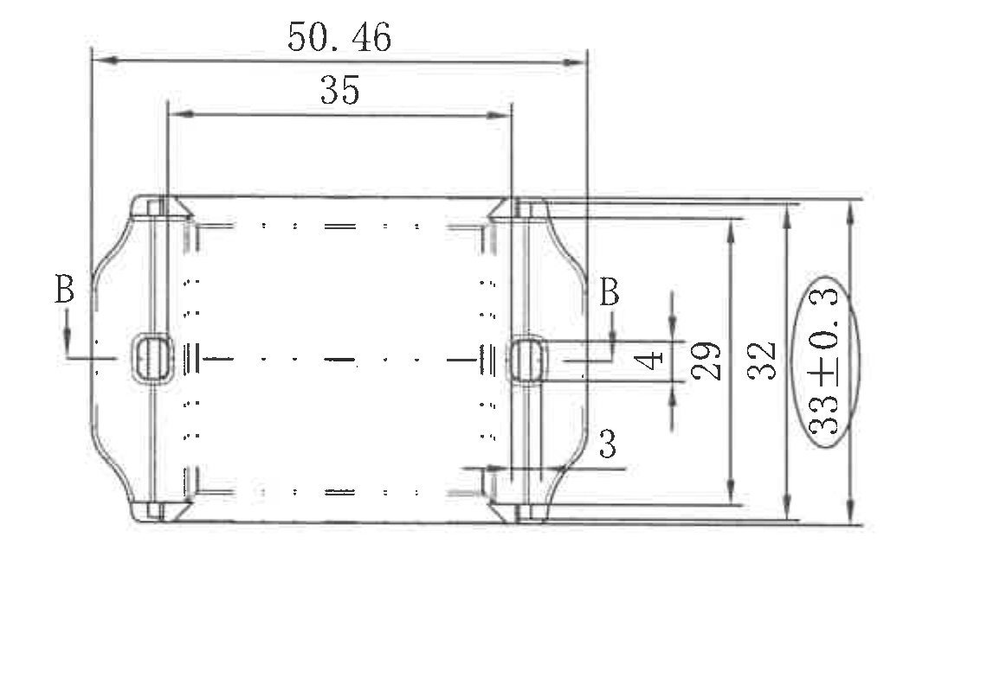

- 原图位置/视图名称：第 1 页，中部尺寸视图，bbox `[700, 985, 1855, 1790]`

| 提取项 | 原图数值或文本 | 含义说明 |
|---|---:|---|
| 总长度 | 50.46 | 顶部外侧水平尺寸，表示左右端外侧基准间距。 |
| 内部长度 | 35 | 顶部内侧水平尺寸，表示两内侧竖向基准间距。 |
| 局部竖向尺寸 | 4 | 右侧小凸台/连接部位的竖向厚度。 |
| 竖向尺寸 | 29 | 右侧内侧竖向尺寸，连接局部上下边。 |
| 竖向尺寸 | 32 | 右侧中间竖向尺寸，连接外侧上下边。 |
| 检验竖向尺寸 | 33±0.3（椭圆框） | 最右侧竖向尺寸，椭圆框按技术要求第 8 条为出厂检验尺寸。 |
| 局部尺寸 | 3 | 右下部局部边/台阶尺寸。 |
| 剖切标识 | B-B | 左右 B 标识和剖切箭头指向 object_5 的 B-B 剖视图。 |
| T 编号 | 未见 | 本裁切对象中未出现 T 编号。 |

边界归属说明：右侧 4、29、32、33±0.3 与 3 的尺寸线均连接本中部视图的右侧结构，归属于本对象；右上相邻的局部 D 放大图尺寸不归入本对象。

## object_4 - 局部视图 D

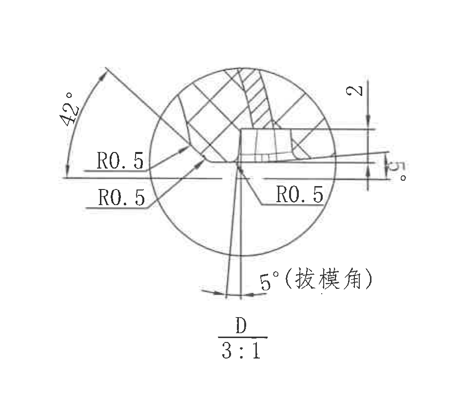

- 原图位置/视图名称：第 1 页，局部视图 D，比例 3:1，bbox `[1830, 1000, 2790, 1815]`

| 提取项 | 原图数值或文本 | 含义说明 |
|---|---:|---|
| 局部视图名称 | D | 对应 object_5 中 D 圈注局部位置。 |
| 比例 | 3:1 | 局部放大比例。 |
| 角度 | 42° | 左侧斜面/局部夹角。 |
| 半径 | R0.5 | 左上过渡圆角半径。 |
| 半径 | R0.5 | 左下过渡圆角半径。 |
| 半径 | R0.5 | 右下局部圆角半径。 |
| 竖向尺寸 | 2 | 右上局部竖向尺寸。 |
| 角度 | 5° | 右侧局部斜面角度。 |
| 拔模角 | 5°（拔模角） | 底部标注的拔模角。 |
| T 编号 | 未见 | 本裁切对象中未出现 T 编号。 |

边界归属说明：本对象为 D 局部放大图，所有 R0.5、42°、2、5° 标注均连接放大圆内结构；object_5 中的 D 圈注只作为索引，不把 object_4 的尺寸并入 B-B 剖视。

## object_5 - B-B 剖视图

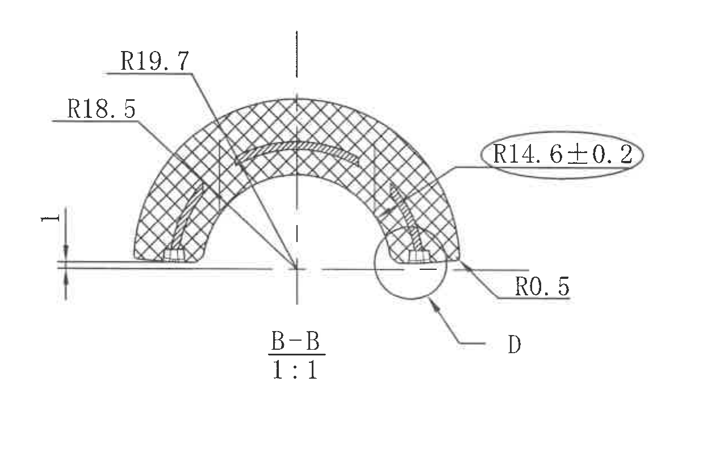

- 原图位置/视图名称：第 1 页，B-B 剖视图，比例 1:1，bbox `[570, 1815, 1815, 2630]`

| 提取项 | 原图数值或文本 | 含义说明 |
|---|---:|---|
| 剖视名称 | B-B | 对应 object_3 中 B-B 剖切位置。 |
| 比例 | 1:1 | 剖视图绘图比例。 |
| 半径 | R19.7 | 外侧大圆弧半径。 |
| 半径 | R18.5 | 左侧/内侧相关圆弧半径。 |
| 检验半径 | R14.6±0.2（椭圆框） | 中部内弧半径，椭圆框按技术要求第 8 条为出厂检验尺寸。 |
| 局部半径 | R0.5 | 右下 D 局部附近小圆角半径。 |
| 竖向尺寸 | 1 | 左侧底部小竖向尺寸。 |
| 局部索引 | D | 右下圆圈和引出线指向 object_4 的 D 局部放大图。 |
| T 编号 | 未见 | 本裁切对象中未出现 T 编号。 |

边界归属说明：R19.7、R18.5、R14.6±0.2、R0.5 和 1 均属于 B-B 剖视；D 圈注只表示需要查看局部 D，局部 D 内的 42°、2、5° 等不归入本剖视对象。

## object_6 - 图 1 稳定杆衬套刚度试验装夹示意图

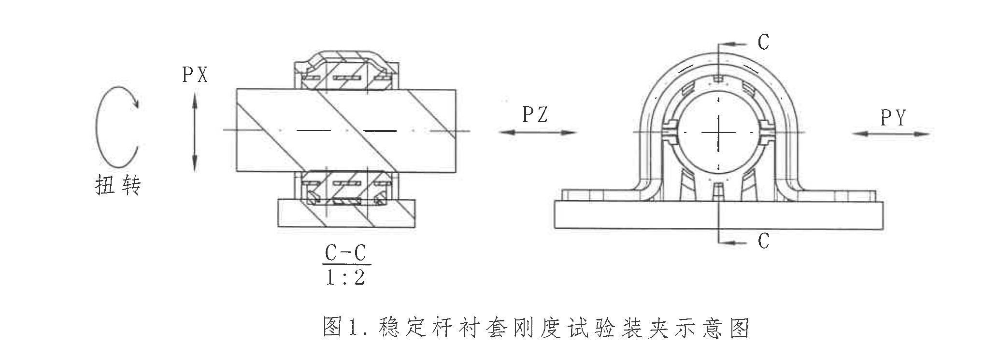

- 原图位置/视图名称：第 1 页，底部试验装夹示意图，bbox `[560, 2570, 2630, 3285]`

| 提取项 | 原图数值或文本 | 含义说明 |
|---|---|---|
| 图题 | 图1. 稳定杆衬套刚度试验装夹示意图 | 技术要求第 3 条引用的性能试验装夹示意。 |
| 方向标识 | PX | 径向加载方向，图中为上下双向箭头。 |
| 方向标识 | PY | 径向加载方向，图中为右侧水平双向箭头。 |
| 方向标识 | PZ | 轴向加载方向，图中为中部水平双向箭头。 |
| 扭转标识 | 扭转 | 左侧旋转箭头表示扭转载荷方向。 |
| 剖视名称 | C-C | 左侧夹具剖视图名称。 |
| 比例 | 1:2 | C-C 剖视图比例。 |
| 剖切标识 | C | 右侧视图上下 C 标识，表示 C-C 剖切位置。 |
| 数值尺寸 | 未见 | 本示意图未给出数值尺寸。 |

边界归属说明：本对象是装夹/加载示意，不属于零件加工尺寸视图；PX、PY、PZ 和扭转标识与 NOTES 中刚度/耐久条件对应，不归入 object_1 到 object_5 的加工尺寸。

## object_7 - 修订履历表

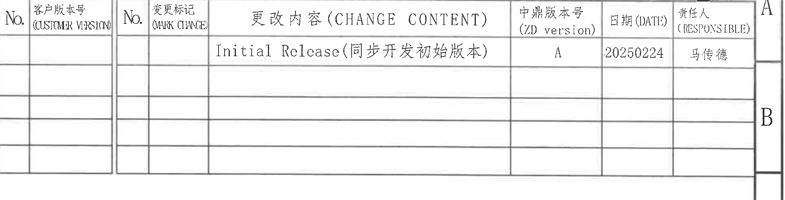

- 原图位置/视图名称：第 1 页，右上修订履历表，bbox `[2860, 175, 4800, 670]`

| 客户No. | 客户版本号 (CUSTOMER VERSION) | No. | 变更标记 (MARK CHANGE) | 更改内容 (CHANGE CONTENT) | 中鼎版本号 (ZD version) | 日期 (DATE) | 责任人 (RESPONSIBLE) |
|---|---|---|---|---|---|---|---|
|  |  |  |  | Initial Relcase(同步开发初始版本) | A | 20250224 | 马传德 |
|  |  |  |  |  |  |  |  |
|  |  |  |  |  |  |  |  |
|  |  |  |  |  |  |  |  |
|  |  |  |  |  |  |  |  |

| 提取项 | 原图数值或文本 | 含义说明 |
|---|---|---|
| 表头 | 客户版本号、变更标记、更改内容、中鼎版本号、日期、责任人 | 修订履历字段。 |
| 修订记录 | Initial Relcase(同步开发初始版本) / A / 20250224 / 马传德 | 初始同步开发版本记录。 |
| 空白行 | 4 行空白记录区 | 原图保留的未填写修订行。 |

边界归属说明：左侧客户版本小表与右侧变更表共用同一修订区域，因此合并为一个表格对象；右边缘可见图框字母 A/B，属于外侧图框坐标，不作为修订表字段提取。

## object_8 - 技术要求 NOTES

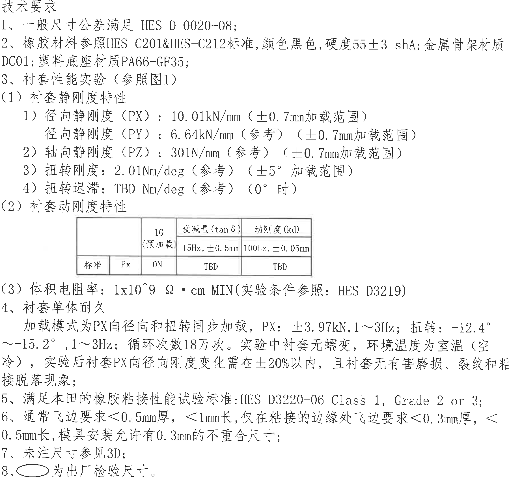

- 原图位置/视图名称：第 1 页，右侧技术要求，bbox `[2870, 700, 4670, 2400]`

| 提取项 | 原图数值或文本 | 含义说明 |
|---|---|---|
| 标题 | 技术要求 | 右侧 NOTES 区域标题。 |
| 1 | 一般尺寸公差满足 HES D 0020-08; | 未单独标注公差的一般尺寸按该标准。 |
| 2 | 橡胶材料参照HES-C201&HES-C212标准，颜色黑色，硬度55±3 shA; 金属骨架材质DC01; 塑料底座材质PA66+GF35; | 材料、颜色、硬度和骨架/底座材料要求。 |
| 3 | 衬套性能实验（参照图1） | 性能试验参照 object_6 图 1 装夹示意。 |
| (1) | 衬套静刚度特性 | 静刚度项目标题。 |
| 1) | 径向静刚度（PX）：10.01kN/mm（±0.7mm加载范围） | PX 方向径向静刚度要求。 |
| 1) | 径向静刚度（PY）：6.64kN/mm（参考）（±0.7mm加载范围） | PY 方向径向静刚度参考值。 |
| 2) | 轴向静刚度（PZ）：301N/mm（参考）（±0.7mm加载范围） | PZ 方向轴向静刚度参考值。 |
| 3) | 扭转刚度：2.01Nm/deg（参考）（±5°加载范围） | 扭转刚度参考值和角度加载范围。 |
| 4) | 扭转迟滞：TBD Nm/deg（参考）（0°时） | 扭转迟滞参考项，数值待定。 |
| (2) | 衬套动刚度特性 | 动刚度项目标题，表格另见 object_9。 |
| (3) | 体积电阻率：1x10^9 Ω·cm MIN（实验条件参照：HES D3219） | 最小体积电阻率要求。 |
| 4 | 衬套单体耐久：加载模式为PX向径向和扭转同步加载，PX：±3.97kN，1～3Hz；扭转：+12.4°～-15.2°，1～3Hz；循环次数18万次。实验中衬套无蠕变，环境温度为室温（空冷），实验后衬套PX向径向刚度变化需在±20%以内，且衬套无有害磨损、裂纹和粘接脱落现象; | 单体耐久载荷、频率、循环次数和判定条件。 |
| 5 | 满足本田的橡胶粘接性能试验标准：HES D3220-06 Class 1, Grade 2 or 3; | 橡胶粘接性能标准。 |
| 6 | 通常飞边要求<0.5mm厚，<1mm长，仅在粘接的边缘处飞边要求<0.3mm厚，<0.5mm长，模具安装允许有0.3mm的不重合尺寸; | 飞边厚度、长度和模具安装不重合允许值。 |
| 7 | 未注尺寸参见3D; | 未注尺寸依据 3D 数据。 |
| 8 | 椭圆框为出厂检验尺寸。 | 解释 object_1、object_3、object_5 中椭圆框尺寸的检验含义。 |

边界归属说明：本对象只提取右侧技术要求文字和其中的动态刚度表区域；左侧零件视图、右侧图框坐标字母未纳入 NOTES 文本。内嵌动态刚度表作为 object_9 另行精裁和还原。

## object_9 - NOTES 内嵌动态刚度表

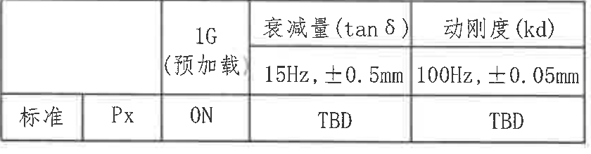

- 原图位置/视图名称：第 1 页，技术要求中的动刚度特性表，bbox `[3140, 1470, 3980, 1690]`

| 指标类别 | 方向 | 1G（预加载） | 衰减量(tanδ) 15Hz, ±0.5mm | 动刚度(kd) 100Hz, ±0.05mm |
|---|---|---|---|---|
| 标准 | Px | 0N | TBD | TBD |

| 提取项 | 原图数值或文本 | 含义说明 |
|---|---|---|
| 表头 | 1G（预加载）、衰减量(tanδ)、动刚度(kd) | 动刚度特性测试字段。 |
| 频率/振幅 | 15Hz, ±0.5mm | 衰减量 tanδ 的测试条件。 |
| 频率/振幅 | 100Hz, ±0.05mm | 动刚度 kd 的测试条件。 |
| 标准行 | 标准 / Px / 0N / TBD / TBD | Px 方向，预加载 0N，衰减量与动刚度待定。 |

边界归属说明：该裁切为 object_8 内嵌表格的精裁区域，只包含表格边框和表内文字；下方体积电阻率文字未纳入本表格对象。

## object_10 - BOM / Composition 表

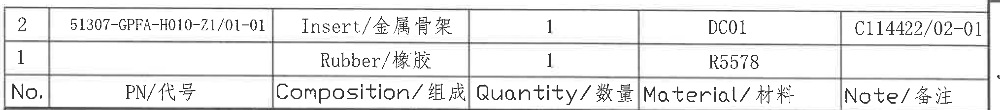

- 原图位置/视图名称：第 1 页，右下 BOM / Composition 明细表，bbox `[2720, 2520, 4750, 2745]`

| No. | PN/代号 | Composition/组成 | Quantity/数量 | Material/材料 | Note/备注 |
|---:|---|---|---:|---|---|
| 2 | 51307-GPFA-H010-Z1/01-01 | Insert/金属骨架 | 1 | DC01 | C114422/02-01 |
| 1 |  | Rubber/橡胶 | 1 | R5578 |  |

| 提取项 | 原图数值或文本 | 含义说明 |
|---|---|---|
| 表头 | No., PN/代号, Composition/组成, Quantity/数量, Material/材料, Note/备注 | BOM 明细字段；原图中表头位于数据行下方。 |
| 明细 2 | 51307-GPFA-H010-Z1/01-01 / Insert/金属骨架 / 1 / DC01 / C114422/02-01 | 金属骨架件，数量 1，材料 DC01。 |
| 明细 1 | Rubber/橡胶 / 1 / R5578 | 橡胶件，数量 1，材料 R5578，PN 和备注为空。 |

边界归属说明：本对象只提取 BOM 明细表。右侧图框字母 J 与表格外框邻接，保留用于保证右边框完整，但不作为 BOM 字段提取；下方标题栏字段归入 object_11。

## object_11 - 标题栏

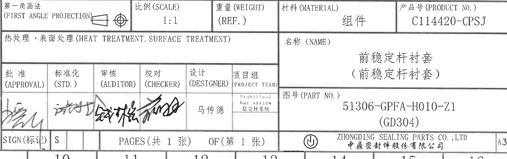

- 原图位置/视图名称：第 1 页，右下标题栏，bbox `[2725, 2745, 4715, 3370]`

| 提取项 | 原图数值或文本 | 含义说明 |
|---|---|---|
| 投影法 | 第一角画法 (FIRST ANGLE PROJECTION) | 投影视图方法。 |
| 比例 | 1:1 | 图纸比例。 |
| 重量 | (REF.) | 重量为参考项，未给出具体数值。 |
| 材料 | 组件 | 总成/组件材料栏。 |
| 产品号 | C114420-CPSJ | 产品编号。 |
| 热处理/表面处理 | 空白 | 原栏位未填写具体处理要求。 |
| 名称 | 前稳定杆衬套（前稳定杆衬套） | 零件/组件名称。 |
| 图号 | 51306-GPFA-H010-Z1 (GD304) | 图纸/零件号。 |
| 批准 | 签名/手写，无法精确转写 | 审批栏手写签名。 |
| 标准化 | 签名/手写，无法精确转写 | 标准化栏手写签名。 |
| 审核 | 签名/手写，无法精确转写 | 审核栏手写签名。 |
| 校对 | 签名/手写，无法精确转写 | 校对栏手写签名。 |
| 设计 | 马传德 | 设计人员。 |
| 项目组 | Stabilized bar system / 稳定杆系统 | 项目组信息。 |
| SIGN | S | 标记栏值。 |
| 页数 | PAGES（共 1 张） / OF（第 1 张） | 总页数与当前页。 |
| 公司 | ZHONGDING SEALING PARTS CO.,LTD / 中鼎密封件股份有限公司 | 出图公司。 |
| 图幅 | A3 | 图纸幅面。 |

边界归属说明：本对象覆盖标题栏完整字段；上方 BOM 明细表已归入 object_10。底部可见少量外框坐标数字边缘，是图框坐标栏残留，不作为标题栏字段提取。

## 裁切检查记录

| 对象 | 检查结果 | 边界处理记录 |
|---|---|---|
| object_1 | 完整 | 25.25±0.3、R25.25、R20.26、2、3.5 和 A-A 标识完整；未混入 A-A 剖视尺寸。 |
| object_2 | 完整 | A-A、1:1、45°、R4.5、R1、0.5、6.6 完整；未混入主视图尺寸。 |
| object_3 | 完整 | 50.46、35、4、29、32、33±0.3、3 和 B-B 标识完整；未混入局部 D。 |
| object_4 | 完整 | 42°、三处 R0.5、2、5°、5°（拔模角）和 D 3:1 完整；未混入 NOTES。 |
| object_5 | 完整 | R19.7、R18.5、R14.6±0.2、R0.5、1、D 索引和 B-B 1:1 完整；局部 D 放大尺寸另归 object_4。 |
| object_6 | 完整 | PX、PY、PZ、扭转、C-C 1:2、C 标识和图题完整；底部图框坐标栏已排除。 |
| object_7 | 完整 | 修订表表头和 A/20250224/马传德记录完整；右侧 A/B 为外框坐标残留，未提取为表格字段。 |
| object_8 | 完整 | 技术要求 1-8 条和内嵌表格区域完整；右侧图框坐标已排除。 |
| object_9 | 完整 | 动刚度表边框、表头、频率条件和标准行完整；下方体积电阻率文字已排除。 |
| object_10 | 完整 | BOM 两行明细和表头完整；右侧 J 为外框坐标残留，未提取为 BOM 字段。 |
| object_11 | 完整 | 标题栏投影法、比例、重量、材料、产品号、名称、图号、签名栏、页码、公司和 A3 完整；底部坐标数字边缘未作为标题栏字段提取。 |
