# 20C114421 内容识别与裁切提取

整页渲染图：`outputs/20C114421_assets/images/page_1.png`，像素尺寸 `4959 x 3505`，PDF 第 1 页。

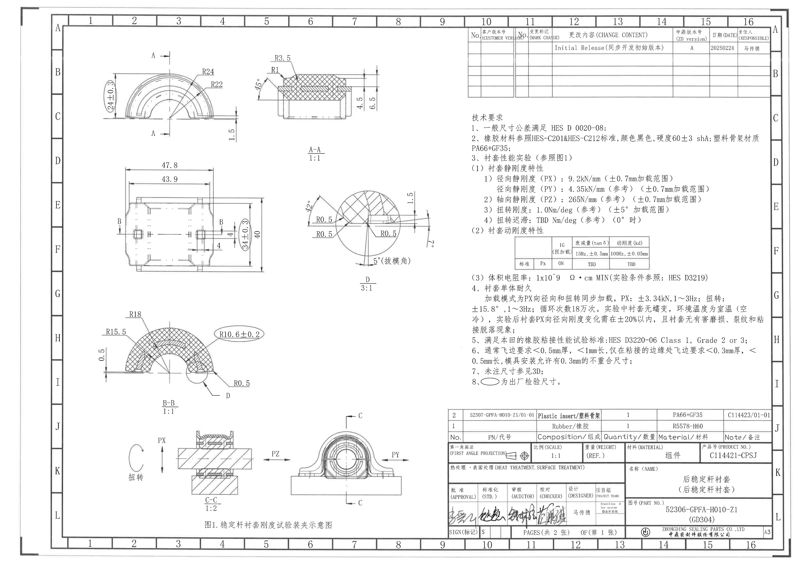

## object_1 | 左上半圆端面视图

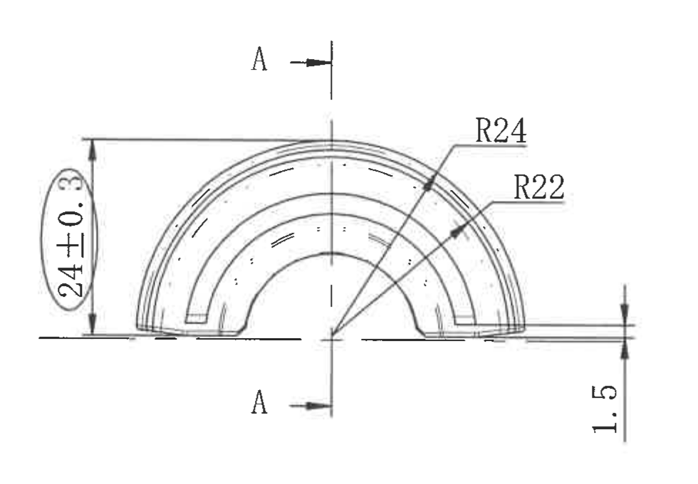

原图位置/视图名称：第 1 页左上，半圆端面视图，带 A-A 剖切指示。

| 提取项 | 原图数值或文本 | 含义说明 |
|---|---:|---|
| 竖向圈注尺寸 | 24±0.3 | 半圆外轮廓从底边到最高点的竖向尺寸；圈注按技术要求第 8 条为出厂检验尺寸。 |
| 外圆弧半径 | R24 | 外侧半圆弧半径。 |
| 内/中间圆弧半径 | R22 | 内侧同心弧形轮廓半径。 |
| 右侧底部高度 | 1.5 | 右端底部台阶/基准线附近的竖向高度。 |
| 剖切标识 | A、A | A-A 剖切位置与方向，剖面内容在 object_2 中提取。 |
| 直径符号、数量前缀、星号关键尺寸、T 编号 | 未见 | 本裁切对象未出现直径符号、数量前缀、星号关键尺寸或 T 编号。 |

边界归属说明：裁切只保留左上半圆端面视图及其 A-A 剖切指示；右侧 A-A 剖面实体和其尺寸不归入本对象。

## object_2 | A-A 剖面视图

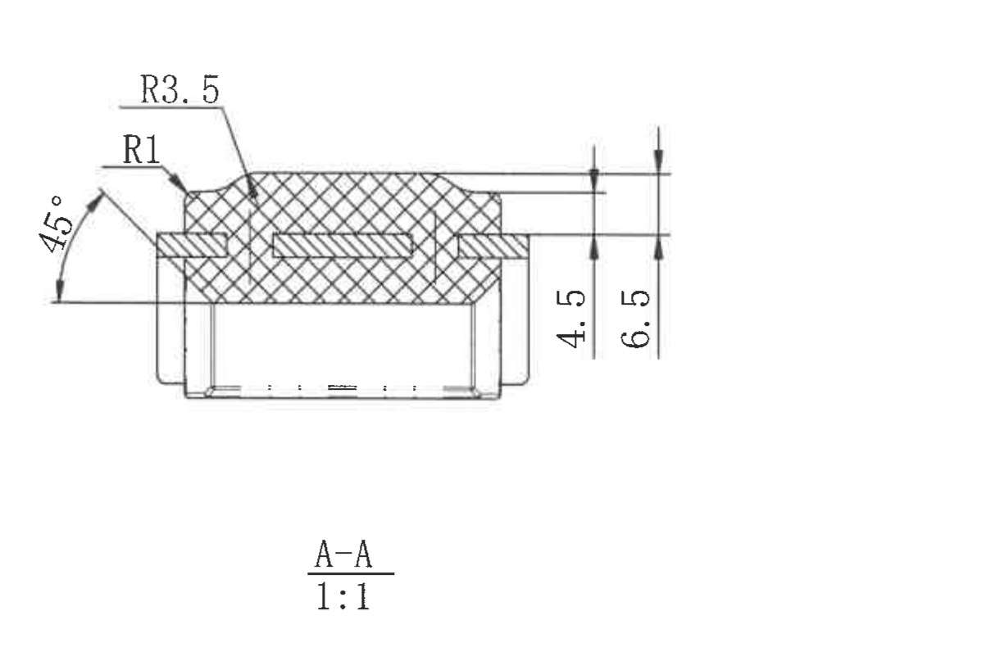

原图位置/视图名称：第 1 页上部偏中，A-A 剖面视图，比例 1:1。

| 提取项 | 原图数值或文本 | 含义说明 |
|---|---:|---|
| 视图标题/比例 | A-A / 1:1 | 与 object_1 的 A-A 剖切指示对应，原比例显示。 |
| 倒角/斜面角度 | 45° | 左侧入口斜面角度。 |
| 小圆角 | R1 | 左上局部圆角半径。 |
| 上部圆角/过渡半径 | R3.5 | 剖面上方局部圆角或过渡弧半径。 |
| 竖向尺寸 | 4.5 | 剖面右侧局部高度尺寸。 |
| 总高度/竖向尺寸 | 6.5 | 剖面右侧整体竖向高度尺寸。 |
| 直径符号、数量前缀、星号关键尺寸、T 编号 | 未见 | 本裁切对象未出现直径符号、数量前缀、星号关键尺寸或 T 编号。 |

边界归属说明：裁切仅包含 A-A 剖面本体、剖面线和 A-A/1:1 标题；左侧端面视图尺寸不归入本对象。

## object_3 | 主视图

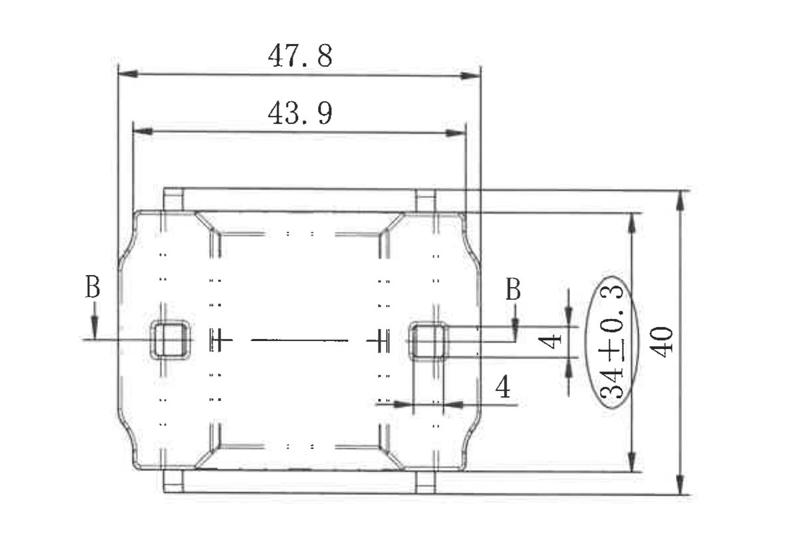

原图位置/视图名称：第 1 页中左，零件主视图，带 B-B 剖切指示。

| 提取项 | 原图数值或文本 | 含义说明 |
|---|---:|---|
| 总长 | 47.8 | 主视图上方外侧水平总长度。 |
| 内侧长度 | 43.9 | 主视图上方内侧水平长度。 |
| 总高度 | 40 | 主视图右侧外侧竖向总高度。 |
| 圈注高度 | 34±0.3 | 主视图右侧圈注竖向尺寸；圈注按技术要求第 8 条为出厂检验尺寸。 |
| 局部竖向尺寸 | 4 | 右侧小凸台/开口处竖向尺寸。 |
| 局部横向尺寸 | 4 | 右下局部槽/台阶横向尺寸。 |
| 剖切标识 | B、B | B-B 剖切位置与方向，剖面内容在 object_5 中提取。 |
| 直径符号、数量前缀、星号关键尺寸、T 编号 | 未见 | 本裁切对象未出现直径符号、数量前缀、星号关键尺寸或 T 编号。 |

边界归属说明：裁切右边界只到主视图 40、34±0.3 和局部 4 尺寸线外侧；右侧局部 D 放大视图已单独裁为 object_4，不归入主视图。

## object_4 | 局部 D 放大视图

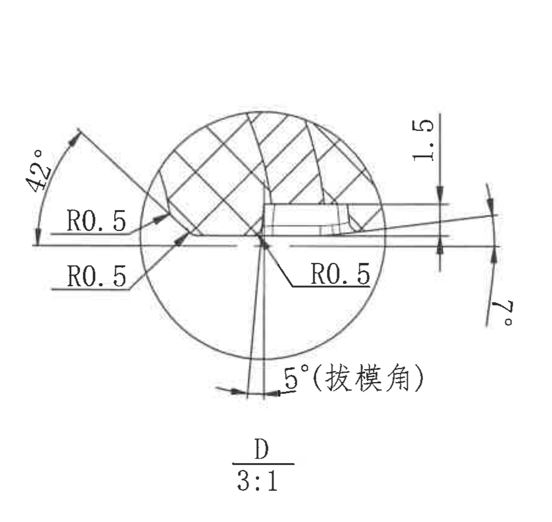

原图位置/视图名称：第 1 页中部偏右，局部 D 放大视图，比例 3:1。

| 提取项 | 原图数值或文本 | 含义说明 |
|---|---:|---|
| 视图标题/比例 | D / 3:1 | 从 B-B 剖面右下局部引出的 D 放大详图。 |
| 角度 | 42° | 左侧斜面/弧边附近角度。 |
| 圆角半径 | R0.5 | 左上指向局部圆角半径。 |
| 圆角半径 | R0.5 | 左下指向局部圆角半径。 |
| 圆角半径 | R0.5 | 中右内侧局部圆角半径。 |
| 竖向尺寸 | 1.5 | 右上局部竖向尺寸。 |
| 角度 | 2° | 右侧斜面/拔模方向附近角度。 |
| 拔模角 | 5°（拔模角） | 下方标注的拔模角。 |
| 直径符号、数量前缀、星号关键尺寸、T 编号 | 未见 | 本裁切对象未出现直径符号、数量前缀、星号关键尺寸或 T 编号。 |

边界归属说明：裁切仅包含 D 圆形放大区域、D/3:1 标题及其尺寸；左侧主视图和右侧技术要求文字不归入本对象。

## object_5 | B-B 剖面视图

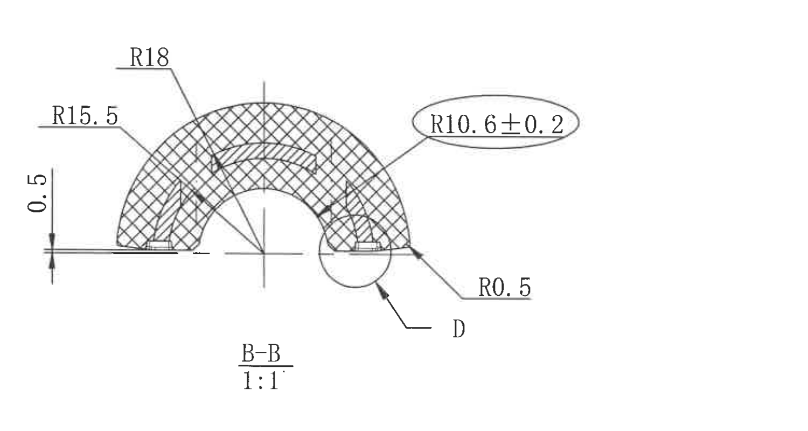

原图位置/视图名称：第 1 页左下偏上，B-B 剖面视图，比例 1:1。

| 提取项 | 原图数值或文本 | 含义说明 |
|---|---:|---|
| 视图标题/比例 | B-B / 1:1 | 与 object_3 的 B-B 剖切指示对应。 |
| 外弧半径 | R18 | B-B 剖面外侧上弧半径。 |
| 内弧/骨架相关半径 | R15.5 | B-B 剖面内部弧形轮廓半径。 |
| 圈注半径 | R10.6±0.2 | 内侧圆弧半径，带公差 ±0.2；圈注按技术要求第 8 条为出厂检验尺寸。 |
| 圆角半径 | R0.5 | 右下局部圆角半径，与 D 详图位置相邻。 |
| 竖向尺寸 | 0.5 | 左侧底边附近小高度尺寸。 |
| 局部详图索引 | D | 指向右下局部，放大详图见 object_4。 |
| 直径符号、数量前缀、星号关键尺寸、T 编号 | 未见 | 本裁切对象未出现直径符号、数量前缀、星号关键尺寸或 T 编号。 |

边界归属说明：裁切保留 B-B 剖面和 D 索引气泡；下方图 1 的 C-C 剖切标识已排除，不归入本对象。

## object_6 | 图 1 稳定杆衬套刚度试验装夹示意图

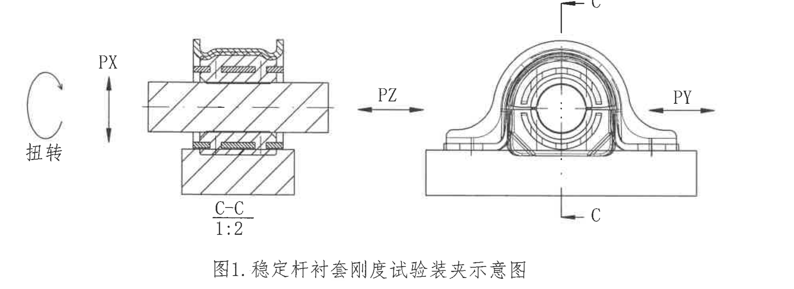

原图位置/视图名称：第 1 页下部左中，图 1 稳定杆衬套刚度试验装夹示意图。

| 提取项 | 原图数值或文本 | 含义说明 |
|---|---|---|
| 图题 | 图1. 稳定杆衬套刚度试验装夹示意图 | 技术要求第 3 条引用的试验装夹示意图。 |
| 载荷方向 | PX | 左侧竖向双向箭头，表示径向加载方向 PX。 |
| 载荷方向 | PZ | 中部水平双向箭头，表示轴向加载方向 PZ。 |
| 载荷方向 | PY | 右侧水平双向箭头，表示径向加载方向 PY。 |
| 扭转 | 扭转 | 左侧旋转箭头，表示扭转载荷。 |
| 剖面标识 | C-C / 1:2 | 左侧装夹剖面视图，比例 1:2。 |
| 剖切标识 | C、C | 右侧视图上下 C 剖切指示。 |
| 直径符号、数量前缀、星号关键尺寸、T 编号 | 未见 | 本图为试验装夹示意，未给出加工尺寸、直径符号、数量前缀、星号关键尺寸或 T 编号。 |

边界归属说明：裁切只包含图 1 试验装夹示意图、PX/PY/PZ/扭转方向和 C-C/C 标识；上方 B-B 剖面标题不归入本对象。

## object_7 | 修订履历表

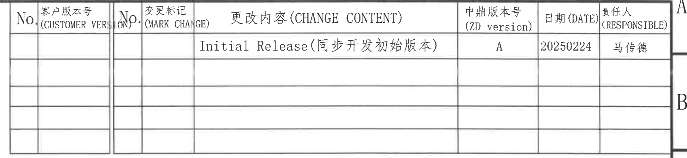

原图位置/视图名称：第 1 页右上，修订/变更记录表。

原表还原：

| No. | 客户版本号 (CUSTOMER VERSION) | No. | 变更标记 (MARK CHANGE) | 更改内容 (CHANGE CONTENT) | 中鼎版本号 (ZD version) | 日期 (DATE) | 责任人 (RESPONSIBLE) |
|---|---|---|---|---|---|---|---|
|  |  |  |  | Initial Release(同步开发初始版本) | A | 20250224 | 马传德 |
|  |  |  |  |  |  |  |  |
|  |  |  |  |  |  |  |  |
|  |  |  |  |  |  |  |  |
|  |  |  |  |  |  |  |  |

| 提取项 | 原图数值或文本 | 含义说明 |
|---|---|---|
| 表头字段 | No.; 客户版本号; No.; 变更标记; 更改内容; 中鼎版本号; 日期; 责任人 | 修订履历列名。 |
| 修订内容 | Initial Release(同步开发初始版本) | 初始发布/同步开发初始版本。 |
| 中鼎版本号 | A | 本次记录对应的中鼎版本号。 |
| 日期 | 20250224 | 变更记录日期。 |
| 责任人 | 马传德 | 本次变更责任人。 |

边界归属说明：表格右侧与图框坐标区距离极近，裁切为保证责任人列完整包含了极窄相邻图框线；右侧图框字母 A/B 不作为修订表内容提取。

## object_8 | 技术要求 / NOTES

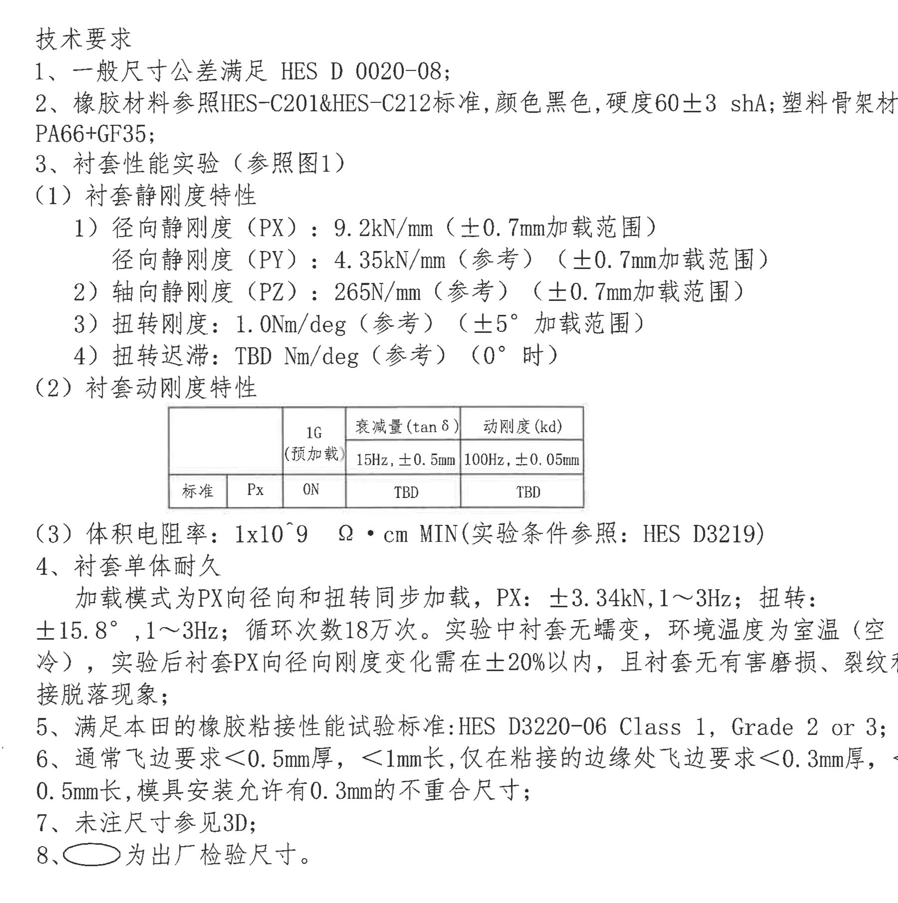

原图位置/视图名称：第 1 页右中，技术要求文字区。

原文还原：

```text
技术要求
1、一般尺寸公差满足 HES D 0020-08;
2、橡胶材料参照HES-C201&HES-C212标准，颜色黑色，硬度60±3 shA; 塑料骨架材质
PA66+GF35;
3、衬套性能实验（参照图1）
（1）衬套静刚度特性
    1）径向静刚度（PX）：9.2kN/mm（±0.7mm加载范围）
       径向静刚度（PY）：4.35kN/mm（参考）（±0.7mm加载范围）
    2）轴向静刚度（PZ）：265N/mm（参考）（±0.7mm加载范围）
    3）扭转刚度：1.0Nm/deg（参考）（±5° 加载范围）
    4）扭转迟滞：TBD Nm/deg（参考）（0° 时）
（2）衬套动刚度特性
（3）体积电阻率：1x10^9 Ω・cm MIN(实验条件参照：HES D3219)
4、衬套单体耐久
    加载模式为PX向径向和扭转同步加载，PX：±3.34kN,1～3Hz; 扭转:
±15.8°，1～3Hz; 循环次数18万次。实验中衬套无蠕变，环境温度为室温（空
冷），实验后衬套PX向径向刚度变化需在±20%以内，且衬套无有害磨损、裂纹和粘
接脱落现象;
5、满足本田的橡胶粘接性能试验标准:HES D3220-06 Class 1, Grade 2 or 3;
6、通常飞边要求<0.5mm厚，<1mm长，仅在粘接的边缘处飞边要求<0.3mm厚，<
0.5mm长，模具安装允许有0.3mm的不重合尺寸;
7、未注尺寸参见3D;
8、（椭圆圈注符号）为出厂检验尺寸。
```

| 提取项 | 原图数值或文本 | 含义说明 |
|---|---|---|
| 一般尺寸公差 | HES D 0020-08 | 未单独标注的一般尺寸公差按该标准。 |
| 橡胶材料标准 | HES-C201 & HES-C212 | 橡胶材料参照标准。 |
| 颜色 | 黑色 | 橡胶颜色要求。 |
| 硬度 | 60±3 shA | 橡胶硬度要求，公差 ±3 shA。 |
| 塑料骨架材料 | PA66+GF35 | 塑料骨架材质。 |
| 径向静刚度 PX | 9.2kN/mm（±0.7mm加载范围） | PX 方向径向静刚度要求。 |
| 径向静刚度 PY | 4.35kN/mm（参考）（±0.7mm加载范围） | PY 方向径向静刚度参考值。 |
| 轴向静刚度 PZ | 265N/mm（参考）（±0.7mm加载范围） | PZ 方向轴向静刚度参考值。 |
| 扭转刚度 | 1.0Nm/deg（参考）（±5°加载范围） | 扭转刚度参考值及加载范围。 |
| 扭转迟滞 | TBD Nm/deg（参考）（0°时） | 扭转迟滞待定参考值。 |
| 动刚度特性表 | 见 object_11 | 嵌入表格已单独裁切并还原。 |
| 体积电阻率 | 1x10^9 Ω・cm MIN | 体积电阻率下限，实验条件参照 HES D3219。 |
| 单体耐久 PX | ±3.34kN, 1～3Hz | PX 向径向加载条件。 |
| 单体耐久扭转 | ±15.8°, 1～3Hz | 扭转载荷条件。 |
| 循环次数 | 18万次 | 耐久循环次数。 |
| 刚度变化 | ±20%以内 | 试验后 PX 向径向刚度变化要求。 |
| 粘接性能标准 | HES D3220-06 Class 1, Grade 2 or 3 | 本田橡胶粘接性能试验标准。 |
| 飞边要求 | <0.5mm厚，<1mm长；粘接边缘 <0.3mm厚，<0.5mm长 | 飞边控制要求。 |
| 模具安装允许 | 0.3mm的不重合尺寸 | 模具安装允许的不重合尺寸。 |
| 未注尺寸 | 参见3D | 未标注尺寸来源。 |
| 圈注符号含义 | 为出厂检验尺寸 | 图中椭圆圈注尺寸为出厂检验尺寸。 |

边界归属说明：裁切只包含技术要求文字区；右侧图框坐标字母已排除。技术要求内的动刚度特性表另作为 object_11 单独裁切和还原。

## object_11 | 技术要求内动刚度特性表

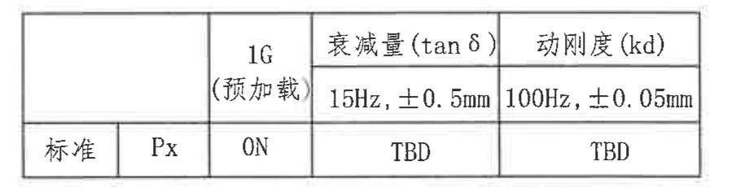

原图位置/视图名称：第 1 页右中，技术要求第 3（2）项下方嵌入表格。

原表还原：

|  |  | 1G（预加载） | 衰减量 (tanδ) | 动刚度 (kd) |
|---|---|---|---|---|
|  |  |  | 15Hz, ±0.5mm | 100Hz, ±0.05mm |
| 标准 | Px | 0N | TBD | TBD |

| 提取项 | 原图数值或文本 | 含义说明 |
|---|---|---|
| 预加载 | 1G（预加载） / 0N | 动刚度测试预加载条件。 |
| 方向/标准 | 标准 / Px | 表中标准行和 Px 方向。 |
| 衰减量 | tanδ; 15Hz, ±0.5mm; TBD | 衰减量测试频率、位移和待定结果。 |
| 动刚度 | kd; 100Hz, ±0.05mm; TBD | 动刚度测试频率、位移和待定结果。 |

边界归属说明：裁切只包含技术要求中的动刚度特性表外框和表内文字；下方体积电阻率文字不归入本对象。

## object_9 | Composition / 组成明细表

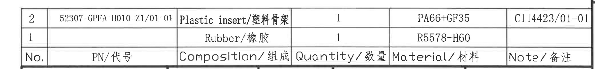

原图位置/视图名称：第 1 页右下，标题栏上方 Composition/组成明细表。

原表还原：

| No. | PN/代号 | Composition/组成 | Quantity/数量 | Material/材料 | Note/备注 |
|---:|---|---|---:|---|---|
| 2 | 52307-GPFA-H010-Z1/01-01 | Plastic insert/塑料骨架 | 1 | PA66+GF35 | C114423/01-01 |
| 1 |  | Rubber/橡胶 | 1 | R5578-H60 |  |

| 提取项 | 原图数值或文本 | 含义说明 |
|---|---|---|
| 明细 2 代号 | 52307-GPFA-H010-Z1/01-01 | 塑料骨架零件号/代号。 |
| 明细 2 组成 | Plastic insert/塑料骨架 | 组件中的塑料骨架。 |
| 明细 2 数量 | 1 | 组件中数量。 |
| 明细 2 材料 | PA66+GF35 | 塑料骨架材料。 |
| 明细 2 备注 | C114423/01-01 | 关联备注/编号。 |
| 明细 1 组成 | Rubber/橡胶 | 组件中的橡胶件。 |
| 明细 1 数量 | 1 | 组件中数量。 |
| 明细 1 材料 | R5578-H60 | 橡胶材料牌号。 |

边界归属说明：裁切只包含 Composition/组成明细表表头和两行数据；下方标题栏字段不归入本对象。

## object_10 | 标题栏

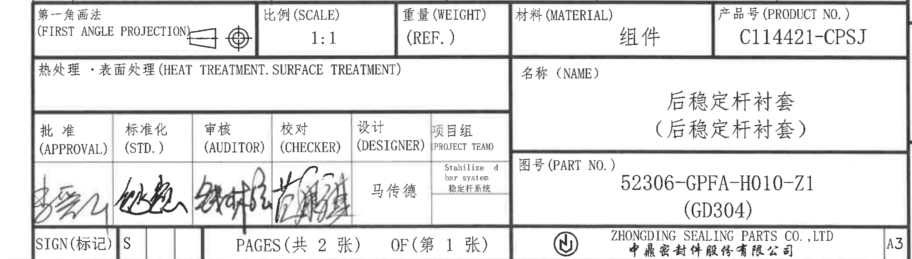

原图位置/视图名称：第 1 页右下标题栏。

| 提取项 | 原图数值或文本 | 含义说明 |
|---|---|---|
| 投影法 | 第一角画法 (FIRST ANGLE PROJECTION) | 图纸投影法，并带投影符号。 |
| 比例 | 1:1 | 图纸比例。 |
| 重量 | (REF.) | 重量为参考项，未给出具体数值。 |
| 材料 | 组件 | 标题栏材料/对象类型。 |
| 产品号 | C114421-CPSJ | 产品编号。 |
| 热处理/表面处理 | 空白 | 原栏位未填写具体处理要求。 |
| 名称 | 后稳定杆衬套 / (后稳定杆衬套) | 零件/组件名称。 |
| 图号 | 52306-GPFA-H010-Z1 / (GD304) | 图纸零件号。 |
| 批准 | 手写签名，无法可靠辨识 | 审批签名栏。 |
| 标准化 | 手写签名，无法可靠辨识 | 标准化签名栏。 |
| 审核 | 手写签名，无法可靠辨识 | 审核签名栏。 |
| 校对 | 手写签名，无法可靠辨识 | 校对签名栏。 |
| 设计 | 马传德 | 设计人。 |
| 项目组 | Stabilized bar system / 稳定杆系统 | 项目组字段。 |
| 标记 | SIGN(标记): S | 标记栏。 |
| 页码 | PAGES(共 2 张) OF(第 1 张) | 共 2 张，第 1 张。 |
| 公司 | ZHONGDING SEALING PARTS CO., LTD / 中鼎密封件股份有限公司 | 出图公司。 |
| 图幅 | A3 | 图纸幅面。 |

边界归属说明：裁切包含标题栏完整外框及 A3 图幅字段；上方 Composition/组成明细表已单独裁为 object_9，底部图框坐标数字不作为标题栏内容提取。

## 裁切检查记录

| 图片 | 检查结果 |
|---|---|
| page_1.png | 整页渲染完整，包含原图全部图框、视图、表格、NOTES、标题栏。 |
| object_1.png | 完整包含左上端面视图尺寸线和文字；未混入 A-A 剖面实体。 |
| object_2.png | 完整包含 A-A 剖面、45°、R1、R3.5、4.5、6.5 和 A-A/1:1 标题。 |
| object_3.png | 完整包含主视图 47.8、43.9、34±0.3、40、两个 4 和 B-B 指示；未混入局部 D。 |
| object_4.png | 完整包含局部 D 圆形详图、42°、R0.5、1.5、2°、5°和 D/3:1 标题；未混入技术要求文字。 |
| object_5.png | 完整包含 B-B 剖面、R18、R15.5、R10.6±0.2、R0.5、0.5、D 索引和 B-B/1:1 标题；未混入下方图 1 C-C。 |
| object_6.png | 完整包含图 1 装夹示意、PX/PY/PZ、扭转、C-C/1:2 和 C 剖切标识；未混入 B-B 标题。 |
| object_7.png | 修订表各列和数据完整；右侧因保证 RESPONSIBLE 列完整保留极窄相邻图框线，图框字母不作为表格内容提取。 |
| object_8.png | 技术要求文字 1-8 条完整，右侧图框坐标未纳入；长行已按整页图核对。 |
| object_11.png | 技术要求内动刚度表格外框、表头和数据完整；未混入下方体积电阻率文字。 |
| object_9.png | Composition/组成明细表表头和两行数据完整；未混入下方标题栏字段。 |
| object_10.png | 标题栏主要字段、公司名和 A3 完整；底部图框坐标数字未作为标题栏内容提取。 |
