# 20C114422.pdf 内容识别

整页渲染图：`outputs/20C114422_assets/images/page_1.png`  
页面尺寸：4959 x 3505 px，bbox `[0, 0, 4959, 3505]`

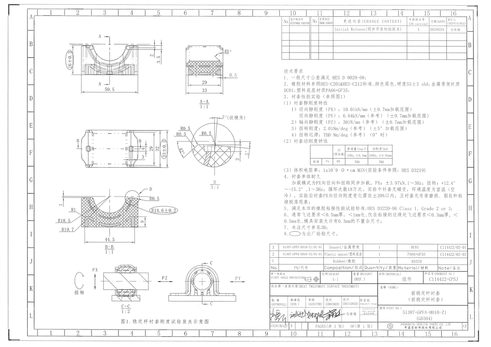

## object_1 - 主视图 / 左上加工视图

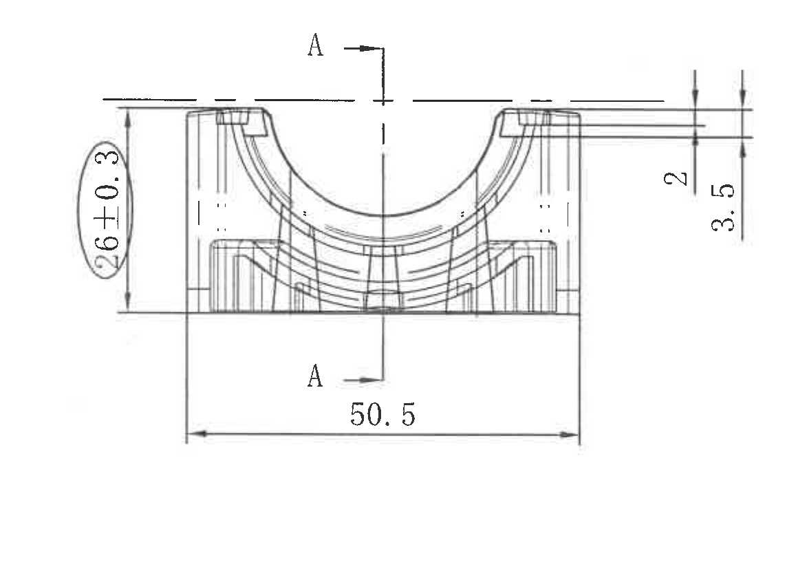

原图位置/视图名称：第 1 页左上，主视图，bbox `[550, 300, 1710, 1130]`。

| 提取项 | 原图数值或文本 | 含义说明 |
|---|---|---|
| 宽度尺寸 | 50.5 | 主视图底部总宽度尺寸，未另标单位，按图纸通用单位 mm 理解。 |
| 出厂检验尺寸/高度 | 26±0.3 | 左侧椭圆框内竖向尺寸；根据 NOTES 第 8 条，椭圆框为出厂检验尺寸，公差为 ±0.3。 |
| 局部高度/台阶尺寸 | 2 | 右上竖向局部尺寸，标在顶面附近两条水平线之间。 |
| 局部高度/台阶尺寸 | 3.5 | 右上竖向外侧尺寸，覆盖比 `2` 更大的高度范围。 |
| 剖切基准 | A-A | 中心剖切线，上下均标注 `A`，指向 object_2 的 A-A 剖视图。 |
| 直径符号 | 未见 | 本裁切对象内未见 `Φ` 或直径符号。 |
| 星号关键尺寸/T 编号 | 未见 | 本裁切对象内未见带星号关键尺寸或 T 编号。 |

边界归属说明：裁切区域完整包含 `50.5`、`26±0.3`、`2`、`3.5` 及 A-A 剖切线。右侧扩大到包含完整 `2`、`3.5` 尺寸线和箭头，但未纳入右侧 A-A 剖视图。

## object_2 - A-A 剖视图

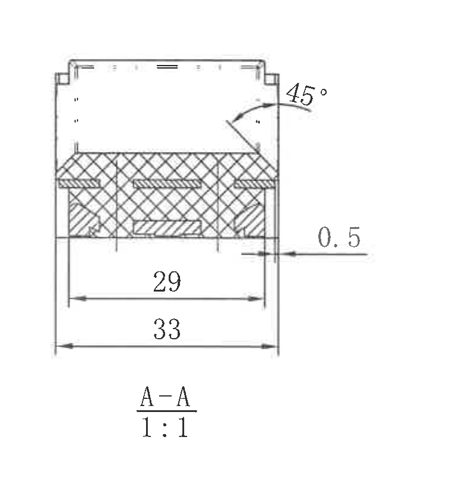

原图位置/视图名称：第 1 页上部偏中，A-A 剖视图，比例 `1:1`，bbox `[1785, 360, 2545, 1160]`。

| 提取项 | 原图数值或文本 | 含义说明 |
|---|---|---|
| 视图标识 | A-A | 与 object_1 主视图中的 A-A 剖切线对应。 |
| 比例 | 1:1 | A-A 剖视图原图比例。 |
| 宽度尺寸 | 29 | 剖视图内部宽度尺寸。 |
| 宽度尺寸 | 33 | 剖视图外侧总宽度尺寸。 |
| 局部尺寸 | 0.5 | 右侧水平局部尺寸，标注在右侧外轮廓附近。 |
| 角度 | 45° | 右上斜面/倒角角度。 |
| 剖面填充 | 交叉剖面线 | 表示剖切材料区域。 |
| 直径符号 | 未见 | 本剖视图内未见 `Φ` 或直径符号。 |
| 星号关键尺寸/T 编号 | 未见 | 本剖视图内未见带星号关键尺寸或 T 编号。 |

边界归属说明：裁切完整包含 A-A 剖视图本体、`45°`、`0.5`、`29`、`33`、视图名和比例。未带入左侧主视图或下方局部视图内容。

## object_8 - 修订履历表 / 右上表格

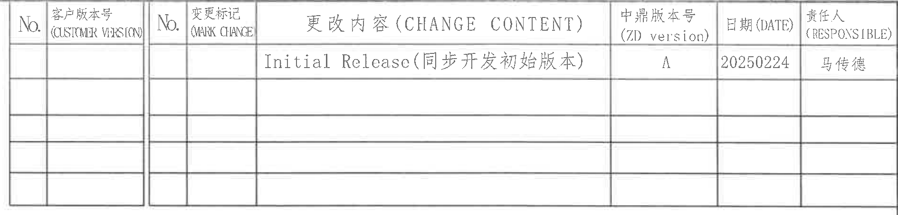

原图位置/视图名称：第 1 页右上，修订履历表，bbox `[2825, 165, 4715, 620]`。

原表格还原：

| No. | 客户版本号 (CUSTOMER VERSION) | No. | 变更标记 (MARK CHANGE) | 更改内容 (CHANGE CONTENT) | 中鼎版本号 (ZD version) | 日期 (DATE) | 责任人 (RESPONSIBLE) |
|---|---|---|---|---|---|---|---|
|  |  |  |  | Initial Release(同步开发初始版本) | A | 20250224 | 马传德 |
|  |  |  |  |  |  |  |  |
|  |  |  |  |  |  |  |  |
|  |  |  |  |  |  |  |  |
|  |  |  |  |  |  |  |  |

| 提取项 | 原图数值或文本 | 含义说明 |
|---|---|---|
| 表头 | No.; 客户版本号 (CUSTOMER VERSION); No.; 变更标记 (MARK CHANGE); 更改内容 (CHANGE CONTENT); 中鼎版本号 (ZD version); 日期 (DATE); 责任人 (RESPONSIBLE) | 修订履历表列名。 |
| 修订内容 | Initial Release(同步开发初始版本) | 初始发布/同步开发初始版本。 |
| 中鼎版本号 | A | 本行对应中鼎版本。 |
| 日期 | 20250224 | 修订日期，格式按原图为 8 位数字。 |
| 责任人 | 马传德 | 本行责任人。 |

边界归属说明：裁切完整包含表头、首条修订记录和下方空白记录行；未带入右侧图框坐标 A/B。

## object_3 - 俯视/平面加工视图

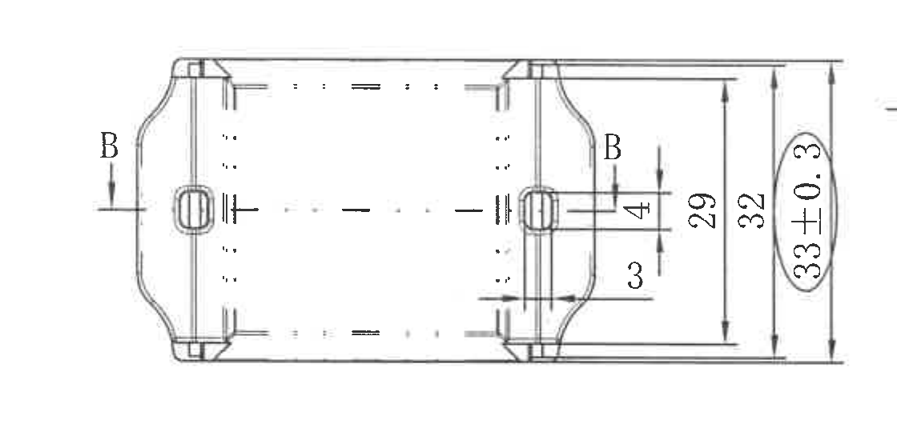

原图位置/视图名称：第 1 页中左，俯视/平面视图，bbox `[650, 1240, 1770, 1800]`。

| 提取项 | 原图数值或文本 | 含义说明 |
|---|---|---|
| 剖切基准 | B-B | 左右两处均标注 `B`，对应 object_5 的 B-B 剖视图。 |
| 竖向尺寸 | 29 | 右侧内部竖向尺寸。 |
| 竖向尺寸 | 32 | 右侧中间竖向尺寸。 |
| 出厂检验尺寸/竖向尺寸 | 33±0.3 | 右侧椭圆框内竖向尺寸；根据 NOTES 第 8 条，椭圆框为出厂检验尺寸，公差为 ±0.3。 |
| 局部尺寸 | 4 | 右侧小凸耳/局部区域的竖向尺寸。 |
| 局部尺寸 | 3 | 右侧小凸耳下方局部尺寸。 |
| 直径符号 | 未见 | 本视图内未见 `Φ` 或直径符号。 |
| 星号关键尺寸/T 编号 | 未见 | 本视图内未见带星号关键尺寸或 T 编号。 |

边界归属说明：裁切完整包含左右 B-B 剖切标记以及右侧尺寸组 `29`、`32`、`33±0.3`、`4`、`3`。右侧边缘有远离本视图的轻微扫描线残影，不作为尺寸或视图内容提取。

## object_4 - 局部视图 D

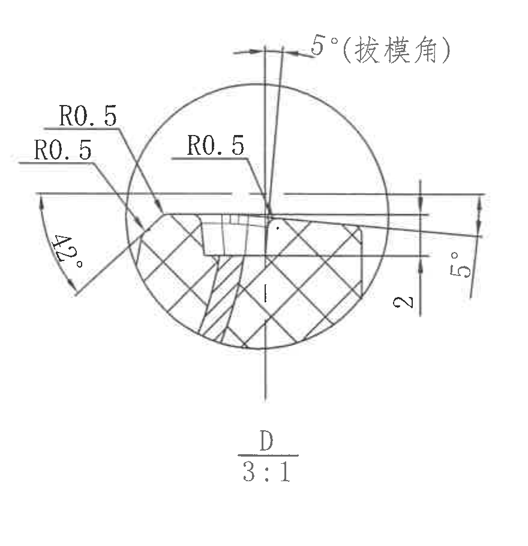

原图位置/视图名称：第 1 页中部偏左，局部视图 D，比例 `3:1`，bbox `[1725, 1105, 2605, 2015]`。

| 提取项 | 原图数值或文本 | 含义说明 |
|---|---|---|
| 视图标识 | D | 局部放大视图，与 object_5 中的 D 圆圈指引对应。 |
| 比例 | 3:1 | 局部视图 D 的放大比例。 |
| 圆角半径 | R0.5 | 左上圆角/边缘半径。 |
| 圆角半径 | R0.5 | 左下指引处圆角/边缘半径。 |
| 圆角半径 | R0.5 | 中上部指引处圆角半径。 |
| 角度 | 42° | 左侧弧形角度标注。 |
| 高度/厚度尺寸 | 2 | 右下竖向尺寸。 |
| 拔模角 | 5°(拔模角) | 顶部标注，说明该处拔模角为 5°。 |
| 角度 | 5° | 右侧局部角度标注。 |
| 直径符号 | 未见 | 本局部视图内未见 `Φ` 或直径符号。 |
| 星号关键尺寸/T 编号 | 未见 | 本局部视图内未见带星号关键尺寸或 T 编号。 |

边界归属说明：裁切完整包含 D 局部放大圆框、尺寸线、角度弧线和视图名。左侧相邻视图残线已排除，提取内容只归属局部 D。

## object_5 - B-B 剖视图

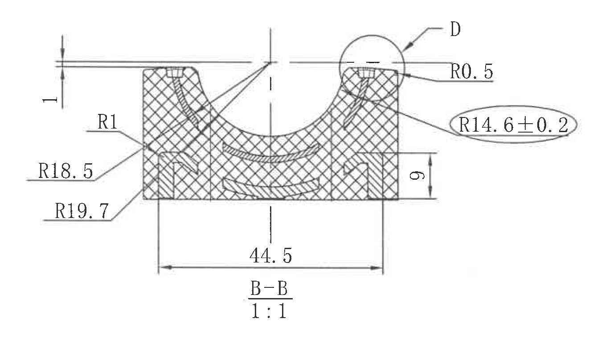

原图位置/视图名称：第 1 页左下偏中，B-B 剖视图，比例 `1:1`，bbox `[500, 1845, 1840, 2625]`。

| 提取项 | 原图数值或文本 | 含义说明 |
|---|---|---|
| 视图标识 | B-B | 与 object_3 的 B-B 剖切标记对应。 |
| 比例 | 1:1 | B-B 剖视图原图比例。 |
| 局部厚度/高度 | 1 | 左上竖向局部尺寸。 |
| 圆角半径 | R1 | 左侧局部圆角半径。 |
| 半径尺寸 | R18.5 | 左侧外轮廓半径尺寸。 |
| 半径尺寸 | R19.7 | 左侧外轮廓半径尺寸。 |
| 圆角半径 | R0.5 | 右上局部 D 附近圆角半径。 |
| 出厂检验半径 | R14.6±0.2 | 右侧椭圆框内半径尺寸；根据 NOTES 第 8 条，椭圆框为出厂检验尺寸，公差为 ±0.2。 |
| 高度尺寸 | 9 | 右下竖向高度尺寸。 |
| 宽度尺寸 | 44.5 | 底部总宽度尺寸。 |
| 局部视图索引 | D | 右上圆圈指向局部 D，详见 object_4。 |
| 直径符号 | 未见 | 本剖视图内未见 `Φ` 或直径符号。 |
| 星号关键尺寸/T 编号 | 未见 | 本剖视图内未见带星号关键尺寸或 T 编号。 |

边界归属说明：裁切完整包含 B-B 剖视图、左侧 R 尺寸组、右侧 D 指引和 `R14.6±0.2`，以及底部 `44.5`、`B-B`、`1:1`。上方水平线属于该剖视图尺寸延长线区域，不另归入其他视图。

## object_9 - NOTES / 技术要求

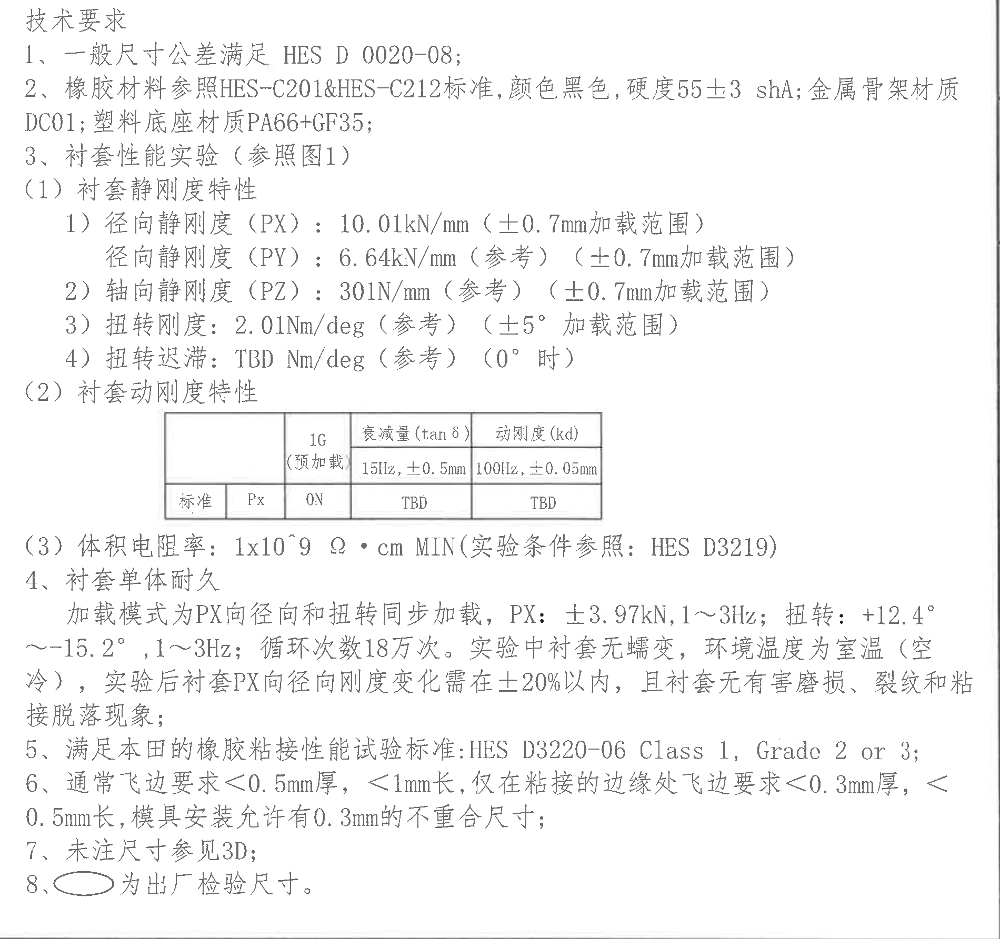

原图位置/视图名称：第 1 页右中，技术要求 NOTES，bbox `[2820, 680, 4720, 2465]`。

| 提取项 | 原图数值或文本 | 含义说明 |
|---|---|---|
| 标题 | 技术要求 | NOTES 区域标题。 |
| 1 | 一般尺寸公差满足 HES D 0020-08; | 未单独标注的普通尺寸公差按 HES D 0020-08。 |
| 2 | 橡胶材料参照 HES-C201&HES-C212 标准，颜色黑色，硬度 55±3 shA; 金属骨架材质 DC01; 塑料底座材质 PA66+GF35; | 材料、颜色、硬度和零件材料要求。 |
| 3 | 衬套性能实验（参照图1） | 性能试验参照底部图 1 装夹示意图。 |
| 3(1) | 衬套静刚度特性 | 静刚度试验项目。 |
| 3(1)1 | 径向静刚度（PX）：10.01kN/mm（±0.7mm加载范围） | PX 方向径向静刚度要求，加载范围 ±0.7mm。 |
| 3(1)1 | 径向静刚度（PY）：6.64kN/mm（参考）（±0.7mm加载范围） | PY 方向径向静刚度参考值，加载范围 ±0.7mm；括号内“参考”表示该数值为参考要求。 |
| 3(1)2 | 轴向静刚度（PZ）：301N/mm（参考）（±0.7mm加载范围） | PZ 方向轴向静刚度参考值，加载范围 ±0.7mm；括号内“参考”表示该数值为参考要求。 |
| 3(1)3 | 扭转刚度：2.01Nm/deg（参考）（±5°加载范围） | 扭转刚度参考值，角度加载范围 ±5°。 |
| 3(1)4 | 扭转迟滞：TBD Nm/deg（参考）（0° 时） | 扭转迟滞待定，参考项目，条件为 0° 时。 |
| 3(2) | 衬套动刚度特性 | 动刚度特性，原图表格另见 object_10。 |
| 3(3) | 体积电阻率：1x10^9 Ω · cm MIN（实验条件参照：HES D3219） | 体积电阻率最小值要求和试验条件标准。 |
| 4 | 衬套单体耐久 | 耐久试验项目。 |
| 4 内容 | 加载模式为 PX 向径向和扭转同步加载，PX: ±3.97kN, 1～3Hz; 扭转: +12.4°～-15.2°, 1～3Hz; 循环次数 18 万次。实验中衬套无蠕变，环境温度为室温（空冷），实验后衬套 PX 向径向刚度变化需在 ±20% 以内，且衬套无有害磨损、裂纹和粘接脱落现象; | 单体耐久加载方向、载荷、频率、扭转角、循环次数、环境和合格判定。 |
| 5 | 满足本田的橡胶粘接性能试验标准: HES D3220-06 Class 1, Grade 2 or 3; | 橡胶粘接性能标准等级。 |
| 6 | 通常飞边要求＜0.5mm厚，＜1mm长，仅在粘接的边缘处飞边要求＜0.3mm厚，＜0.5mm长，模具安装允许有 0.3mm 的不重合尺寸; | 飞边厚度、长度和模具安装错位允许值。 |
| 7 | 未注尺寸参见 3D; | 未标注尺寸以 3D 为准。 |
| 8 | 椭圆框为出厂检验尺寸。 | 图中椭圆框标注的尺寸为出厂检验尺寸，例如 object_1 的 `26±0.3`、object_3 的 `33±0.3`、object_5 的 `R14.6±0.2`。 |

边界归属说明：裁切完整包含 NOTES 第 1-8 条和内嵌动刚度表。右侧保留 NOTES 区域边界线；不提取相邻标题栏或 BOM 字段。

## object_10 - NOTES 内嵌动刚度特性表

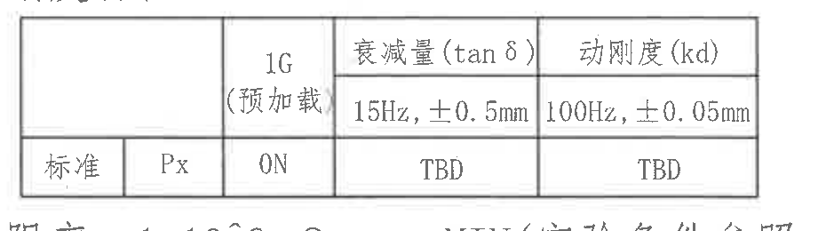

原图位置/视图名称：第 1 页右中，技术要求第 3(2) 项内嵌表格，bbox `[3110, 1445, 4040, 1705]`。

原表格还原：

|  |  | 1G（预加载） | 衰减量 (tan δ) | 动刚度 (kd) |
|---|---|---|---|---|
|  |  |  | 15Hz, ±0.5mm | 100Hz, ±0.05mm |
| 标准 | Px | ON | TBD | TBD |

| 提取项 | 原图数值或文本 | 含义说明 |
|---|---|---|
| 表格位置 | 衬套动刚度特性 | 技术要求第 3(2) 项中的动刚度特性表。 |
| 预加载 | 1G（预加载）; ON | 试验预加载条件为 1G，状态 ON。 |
| 衰减量 | tan δ; 15Hz, ±0.5mm; TBD | 衰减量项目，频率/位移条件为 15Hz、±0.5mm，标准值待定。 |
| 动刚度 | kd; 100Hz, ±0.05mm; TBD | 动刚度项目，频率/位移条件为 100Hz、±0.05mm，标准值待定。 |
| 标准方向 | Px | 标准行对应 Px 方向。 |

边界归属说明：表格外框和所有单元格文字完整。裁切上下边缘有极少 NOTES 正文残影，未作为表格字段提取。

## object_6 - C-C 剖视图 / 图 1 试验装夹示意局部

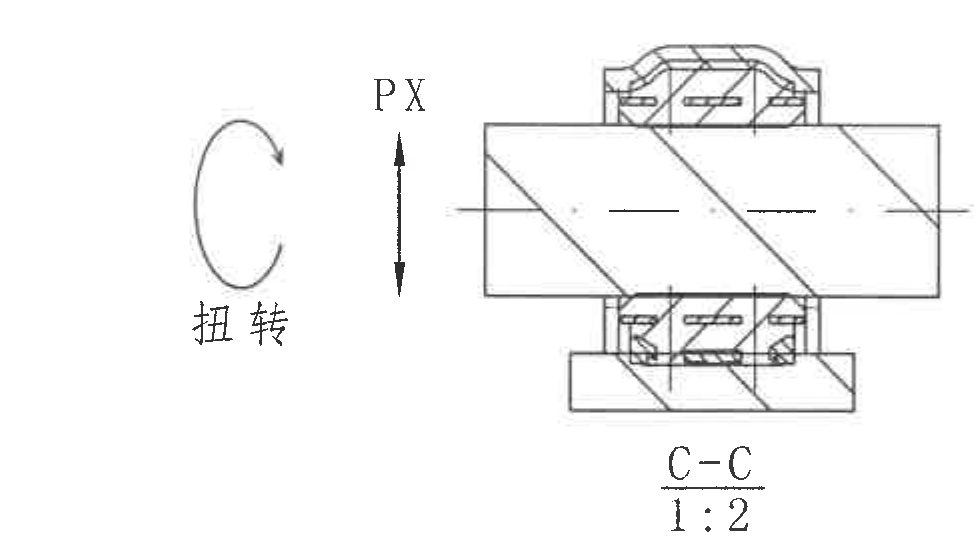

原图位置/视图名称：第 1 页底部左侧，C-C 剖视图，比例 `1:2`，bbox `[560, 2630, 1540, 3190]`。

| 提取项 | 原图数值或文本 | 含义说明 |
|---|---|---|
| 视图标识 | C-C | 试验装夹示意中的剖视图。 |
| 比例 | 1:2 | C-C 剖视图原图比例。 |
| 载荷方向 | PX | 竖向双向箭头，表示 PX 方向加载。 |
| 扭转方向 | 扭转 | 左侧弧形箭头，表示扭转载荷方向。 |
| 数值尺寸 | 未见 | 本裁切对象内无具体数值尺寸标注。 |
| 直径符号 | 未见 | 本裁切对象内未见 `Φ` 或直径符号。 |
| 星号关键尺寸/T 编号 | 未见 | 本裁切对象内未见带星号关键尺寸或 T 编号。 |

边界归属说明：裁切完整包含 C-C 剖视图、`PX` 双向箭头、扭转箭头、`C-C` 和 `1:2`。右侧 PZ/PY 端面视图未纳入本对象。

## object_7 - 图 1 端面/侧向试验装夹视图

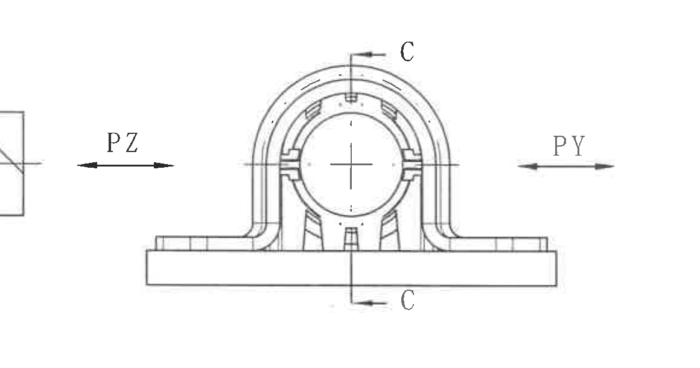

原图位置/视图名称：第 1 页底部中偏左，图 1 端面/侧向试验装夹视图，bbox `[1460, 2570, 2620, 3180]`。

| 提取项 | 原图数值或文本 | 含义说明 |
|---|---|---|
| 剖切标识 | C | 上下两处 `C`，对应 C-C 剖视关系。 |
| 载荷方向 | PZ | 左侧水平双向箭头，表示 PZ 方向加载。 |
| 载荷方向 | PY | 右侧水平双向箭头，表示 PY 方向加载。 |
| 中心线 | 十字中心线 | 表示圆孔/装夹中心位置。 |
| 数值尺寸 | 未见 | 本裁切对象内无具体数值尺寸标注。 |
| 直径符号 | 未见 | 本裁切对象内未见 `Φ` 或直径符号。 |
| 星号关键尺寸/T 编号 | 未见 | 本裁切对象内未见带星号关键尺寸或 T 编号。 |

边界归属说明：PZ 箭头靠近左侧 C-C 视图，为保证 PZ 箭头完整，左缘保留少量 C-C 剖视图边缘残片；该残片不归入本对象提取内容。端面视图本体、PZ/PY 箭头和 C 标识完整。

## object_13 - 图 1 说明文字

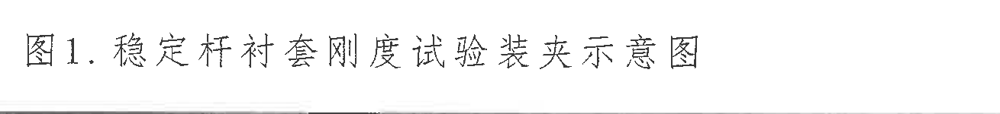

原图位置/视图名称：第 1 页底部左中，图 1 说明文字，bbox `[1190, 3180, 2500, 3330]`。

| 提取项 | 原图数值或文本 | 含义说明 |
|---|---|---|
| 图题 | 图1. 稳定杆衬套刚度试验装夹示意图 | 对 object_6 和 object_7 试验装夹视图的公共说明文字。 |

边界归属说明：裁切完整包含图题文字，不包含上方试验装夹图形和右下标题栏。

## object_11 - BOM / 明细表

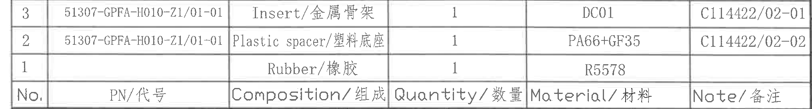

原图位置/视图名称：第 1 页右下，BOM/明细表，bbox `[2695, 2465, 4725, 2740]`。

原表格还原：

| No. | PN/代号 | Composition/组成 | Quantity/数量 | Material/材料 | Note/备注 |
|---|---|---|---|---|---|
| 3 | 51307-GPFA-H010-Z1/01-01 | Insert/金属骨架 | 1 | DC01 | C114422/02-01 |
| 2 | 51307-GPFA-H010-Z1/01-01 | Plastic spacer/塑料底座 | 1 | PA66+GF35 | C114422/02-02 |
| 1 |  | Rubber/橡胶 | 1 | R5578 |  |

| 提取项 | 原图数值或文本 | 含义说明 |
|---|---|---|
| 表头 | No.; PN/代号; Composition/组成; Quantity/数量; Material/材料; Note/备注 | BOM 明细表列名。 |
| 物料 3 | Insert/金属骨架; PN 51307-GPFA-H010-Z1/01-01; 数量 1; 材料 DC01; 备注 C114422/02-01 | 金属骨架明细。 |
| 物料 2 | Plastic spacer/塑料底座; PN 51307-GPFA-H010-Z1/01-01; 数量 1; 材料 PA66+GF35; 备注 C114422/02-02 | 塑料底座明细。 |
| 物料 1 | Rubber/橡胶; 数量 1; 材料 R5578 | 橡胶件明细，原图 PN 和备注为空。 |

边界归属说明：裁切完整包含三条物料记录和底部表头；下方标题栏未纳入本对象。

## object_12 - 标题栏

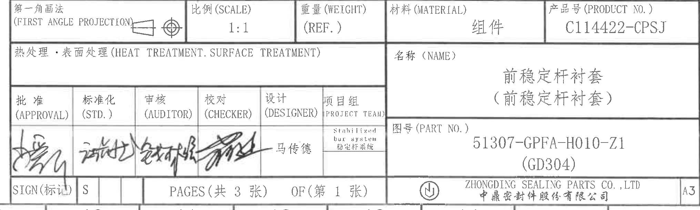

原图位置/视图名称：第 1 页右下标题栏，bbox `[2695, 2740, 4725, 3350]`。

| 提取项 | 原图数值或文本 | 含义说明 |
|---|---|---|
| 投影法 | 第一角画法 (FIRST ANGLE PROJECTION) | 图纸投影方式，并带第一角投影图示。 |
| 比例 | 1:1 | 标题栏比例。 |
| 重量 | (REF.) | 重量栏为参考项，未填具体重量。 |
| 材料 | 组件 | 标题栏材料栏。 |
| 产品号 | C114422-CPSJ | 产品号 (PRODUCT NO.)。 |
| 热处理/表面处理 | 热处理・表面处理 (HEAT TREATMENT. SURFACE TREATMENT) | 栏位存在，未见具体处理内容填写。 |
| 名称 | 前稳定杆衬套（前稳定杆衬套） | 零件/组件名称。 |
| 图号 | 51307-GPFA-H010-Z1 (GD304) | PART NO. 图号。 |
| 批准 | 批准 (APPROVAL) | 栏内为手写签名。 |
| 标准化 | 标准化 (STD.) | 栏内为手写签名。 |
| 审核 | 审核 (AUDITOR) | 栏内为手写签名。 |
| 校对 | 校对 (CHECKER) | 栏内为手写签名。 |
| 设计 | 设计 (DESIGNER) | 栏内为手写签名；旁边文字为马传德。 |
| 项目组 | Stabilized bar system / 稳定杆系统 | 项目组栏内容。 |
| 标记 | SIGN(标记); S | 标记栏内容。 |
| 页数 | PAGES(共 3 张) OF(第 1 张) | 总 3 张，本页第 1 张。 |
| 公司 | ZHONGDING SEALING PARTS CO., LTD / 中鼎密封件股份有限公司 | 出图公司。 |
| 图幅 | A3 | 标题栏右下角图幅。 |

边界归属说明：裁切从 BOM 下方标题栏起始行开始，完整包含投影法、比例、重量、材料、产品号、名称、图号、签核、页数、公司和图幅字段。底边仅保留标题栏边框，不提取下方图框坐标编号。

## 裁切检查记录

| 对象 | 检查结果 |
|---|---|
| page_1.png | 整页 PNG 已渲染，页面完整，尺寸 4959 x 3505 px。 |
| object_1.png | 完整包含主视图尺寸线和文字；重裁后 `2`、`3.5` 未被裁掉。 |
| object_2.png | A-A 剖视图完整，尺寸线、角度文字、视图名和比例完整。 |
| object_3.png | 俯视/平面视图完整；左侧 B 标记和右侧尺寸组完整。 |
| object_4.png | 局部 D 完整；重裁后排除了相邻视图残片。 |
| object_5.png | B-B 剖视图完整；所有 R 尺寸、`9`、`44.5`、D 指引完整。 |
| object_6.png | C-C 剖视图完整；右侧相邻 PZ/PY 视图未纳入。 |
| object_7.png | 端面试验装夹视图本体、PZ/PY 箭头和 C 标识完整；左缘为保证 PZ 箭头完整保留少量相邻 C-C 边缘残片，未提取为本对象内容。 |
| object_8.png | 修订履历表表头、首行数据和空白行完整，无右侧图框坐标混入。 |
| object_9.png | NOTES 第 1-8 条完整，内嵌表格完整可见。 |
| object_10.png | 动刚度表外框和单元格完整；上下有极少 NOTES 正文残影，未作为表格字段提取。 |
| object_11.png | BOM 三条记录和表头完整；下方标题栏已排除。 |
| object_12.png | 标题栏主要字段完整；下方图框坐标编号未纳入。 |
| object_13.png | 图 1 说明文字完整，无上方图形或标题栏内容混入。 |
