# 20C114423 PDF 内容识别与裁切提取

整页 PNG 渲染：`20C114423_assets/images/page_1.png`  
页面：1 页；渲染尺寸：4959 x 3505 px；坐标基准：整页 PNG 左上角为 `[0, 0]`。

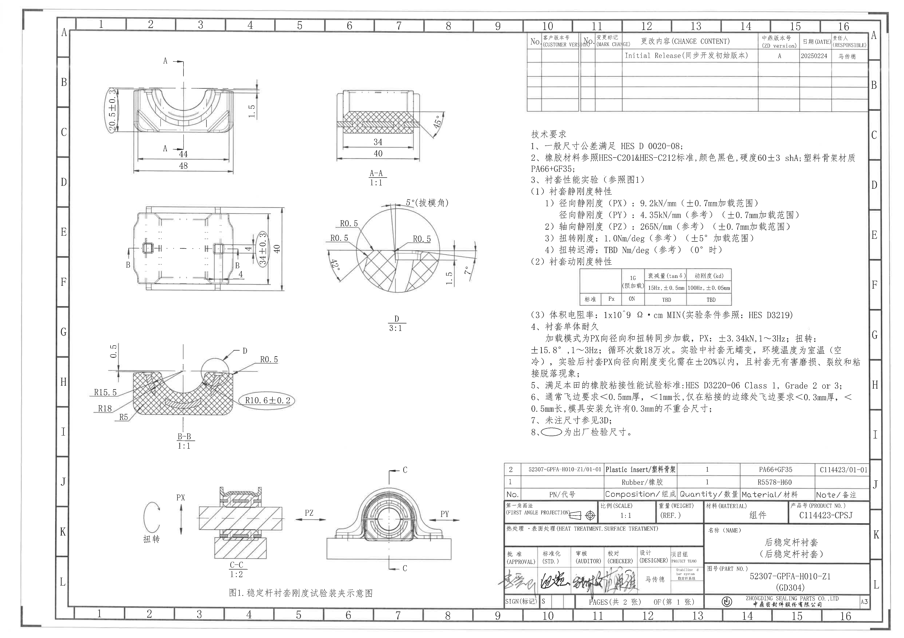

说明：本文件按整页 PNG 的原图结构裁切并识别。尺寸单位按机械图默认理解为 mm；角度单位按图中 `°`；括号内 `参考`、`REF.` 均保留并说明为参考性质。未见带星号关键尺寸、未见直径符号尺寸、未见 T 编号。

## object_1 主视图 / A-A 剖切位置

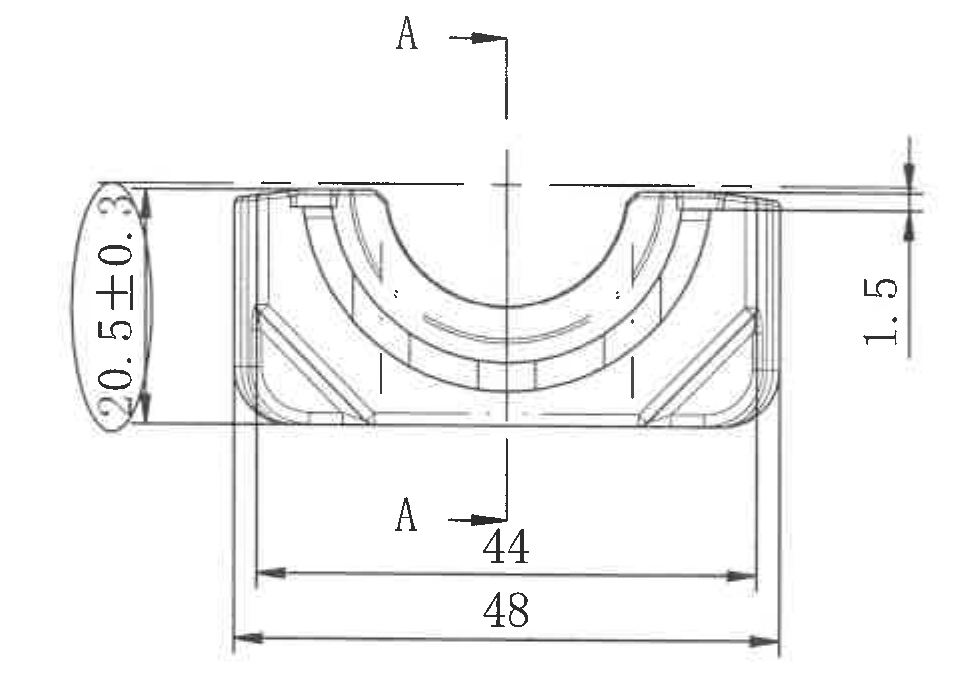

原图位置/视图名称：页 1，主视图，bbox `[500, 300, 1475, 990]`。图中标出 A-A 剖切线。

| 提取项 | 原图数值或文本 | 含义说明 |
|---|---:|---|
| 左侧竖向外形尺寸 | `20.5±0.3` | 主视图左侧外形高度/竖向尺寸，椭圆圈出，按技术要求第 8 条属于出厂检验尺寸；公差为 `±0.3`。 |
| 右侧竖向小台阶尺寸 | `1.5` | 主视图右上局部台阶或唇边高度尺寸，属于主视图右侧边界处的标注。 |
| 下方内侧横向尺寸 | `44` | 主视图下方较短的横向尺寸，箭头终止在内侧竖向引出线之间。 |
| 下方总横向尺寸 | `48` | 主视图下方较长的总宽尺寸，箭头终止在外侧引出线之间。 |
| 剖切标识 | `A`、`A` | 中心竖向剖切线和箭头定义 A-A 剖面位置，对应 object_2。 |

边界归属说明：右侧 `1.5` 尺寸线和文字完整包含在本裁切内，归属于主视图；未把右上 A-A 剖面图中的 `34`、`40`、`45°` 混入本对象。

## object_2 A-A 剖面视图

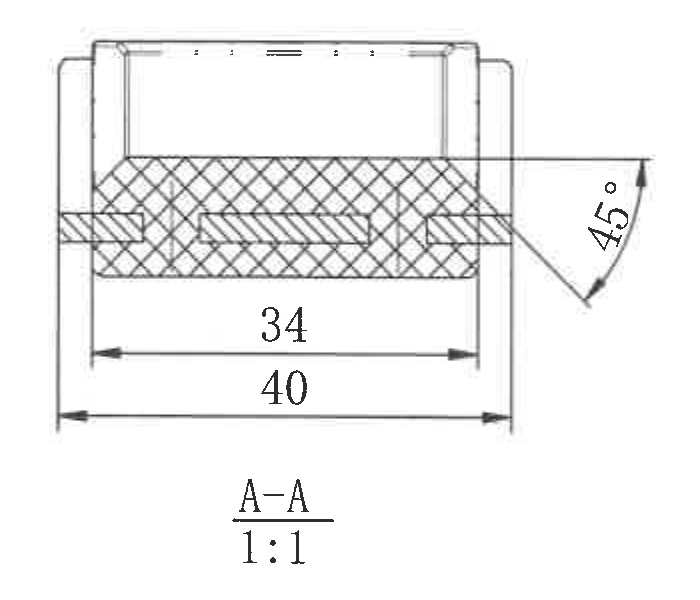

原图位置/视图名称：页 1，A-A 剖面视图，bbox `[1790, 455, 2490, 1055]`，比例 `1:1`。

| 提取项 | 原图数值或文本 | 含义说明 |
|---|---:|---|
| 内侧横向尺寸 | `34` | A-A 剖面中剖切区域内部宽度尺寸。 |
| 外侧横向尺寸 | `40` | A-A 剖面整体外侧宽度尺寸。 |
| 右侧角度 | `45°` | 右侧斜面/倒角角度标注。 |
| 剖面名称与比例 | `A-A`、`1:1` | 本对象为 A-A 剖面，比例为 1:1。 |

边界归属说明：本裁切只包含 A-A 剖面及其 `34`、`40`、`45°` 尺寸；未将主视图的 `44`、`48`、`20.5±0.3`、`1.5` 纳入本对象。

## object_3 俯视图 / B-B 剖切位置

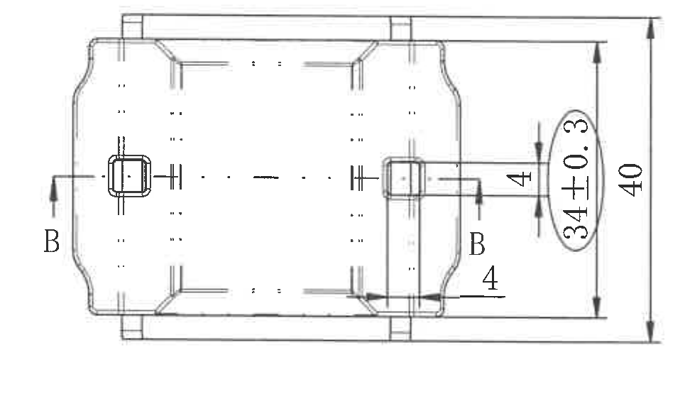

原图位置/视图名称：页 1，俯视图，bbox `[630, 1115, 1595, 1670]`。图中标出 B-B 剖切线。

| 提取项 | 原图数值或文本 | 含义说明 |
|---|---:|---|
| 右侧局部竖向尺寸 | `34±0.3` | 俯视图右侧椭圆圈出的检验尺寸，公差为 `±0.3`；按技术要求第 8 条属于出厂检验尺寸。 |
| 右侧总竖向尺寸 | `40` | 俯视图最右侧整体竖向外形尺寸。 |
| 右上局部尺寸 | `4` | 右上局部结构的竖向/台阶尺寸，箭头位于右侧凸耳区域。 |
| 右下局部尺寸 | `4` | 右下靠近 B 剖切标识处的局部尺寸，属于俯视图内局部结构。 |
| 剖切标识 | `B`、`B` | B-B 剖切位置，对应 object_5。 |

边界归属说明：本裁切包含俯视图完整外形、两处 `4`、`34±0.3` 和 `40` 尺寸线；未将右侧局部放大 D 或下方 B-B 剖面尺寸归入本对象。

## object_4 局部放大视图 D

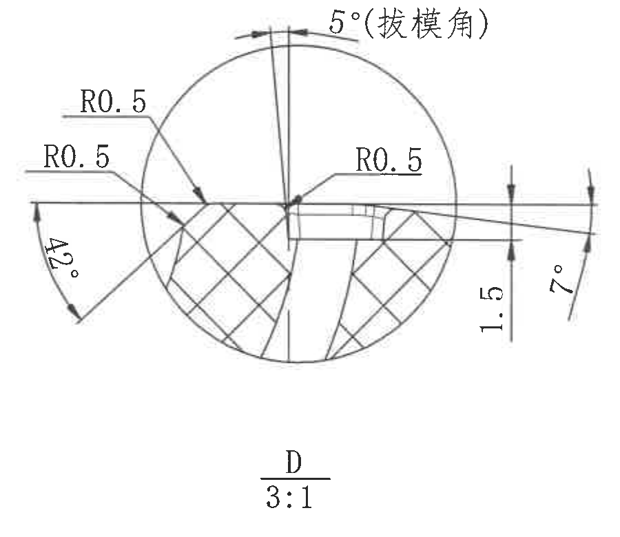

原图位置/视图名称：页 1，局部视图 D，bbox `[1750, 1080, 2650, 1860]`，比例 `3:1`。

| 提取项 | 原图数值或文本 | 含义说明 |
|---|---:|---|
| 左上圆角 | `R0.5` | 局部 D 左上过渡圆角半径。 |
| 左下圆角 | `R0.5` | 局部 D 左下过渡圆角半径。 |
| 右侧圆角 | `R0.5` | 局部 D 右侧台阶/肩部过渡圆角半径。 |
| 上方拔模角 | `5°(拔模角)` | 局部 D 上方结构的拔模角。 |
| 左侧角度 | `42°` | 左侧斜边/倒角角度。 |
| 右侧竖向尺寸 | `1.5` | 局部 D 右侧小台阶高度尺寸。 |
| 右侧角度 | `7°` | 右侧斜面/拔模方向角度。 |
| 视图名称与比例 | `D`、`3:1` | 本对象为局部放大视图 D，放大比例 3:1。 |

边界归属说明：局部 D 的圆角、角度和 `1.5` 尺寸均完整包含；未把相邻俯视图的 `34±0.3`、`40` 或 B-B 剖面尺寸混入。

## object_5 B-B 剖面视图

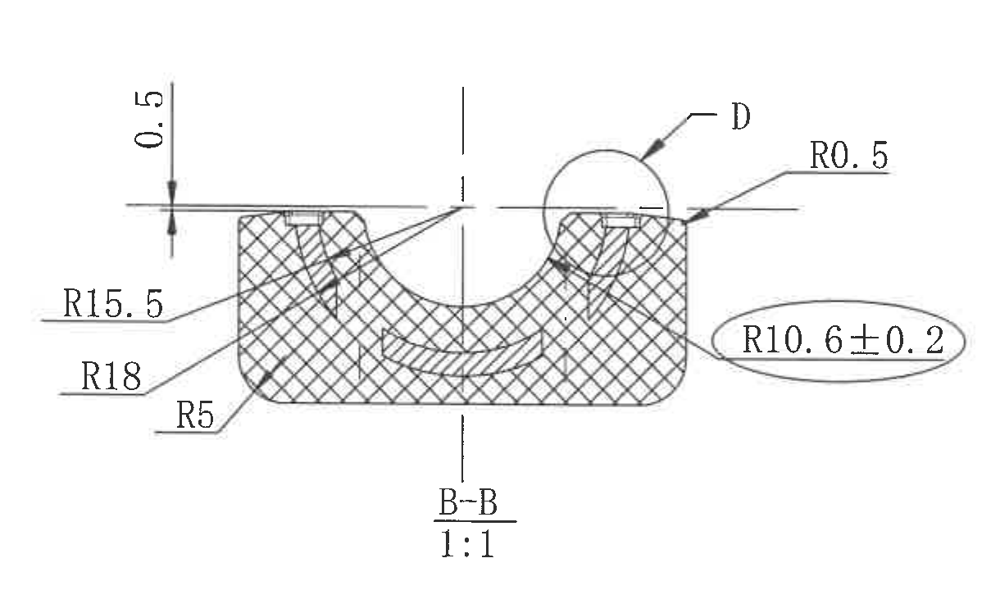

原图位置/视图名称：页 1，B-B 剖面视图，bbox `[440, 1785, 1660, 2505]`，比例 `1:1`。

| 提取项 | 原图数值或文本 | 含义说明 |
|---|---:|---|
| 上方局部高度 | `0.5` | B-B 剖面上方左侧局部高度/间隙尺寸。 |
| 左侧内圆弧半径 | `R15.5` | B-B 剖面左侧引出线指向内侧弧面半径。 |
| 左下圆弧半径 | `R18` | B-B 剖面左下外侧圆弧半径。 |
| 底部圆角半径 | `R5` | B-B 剖面底部左侧圆角半径。 |
| 右上圆角半径 | `R0.5` | B-B 剖面右上肩部过渡圆角半径。 |
| 右侧检验半径 | `R10.6±0.2` | B-B 剖面右侧椭圆圈出的半径尺寸，公差为 `±0.2`；按技术要求第 8 条属于出厂检验尺寸。 |
| 局部视图索引 | `D` | 圆圈和引出箭头表示此处有局部放大视图 D，对应 object_4。 |
| 剖面名称与比例 | `B-B`、`1:1` | 本对象为 B-B 剖面，比例为 1:1。 |

边界归属说明：本裁切完整包含 B-B 剖面、顶部 `0.5` 尺寸线和右侧 `R10.6±0.2` 椭圆标注；未把上方俯视图或右侧局部 D 视图尺寸归入本对象。

## object_6 图 1 稳定杆衬套刚度试验装夹示意图

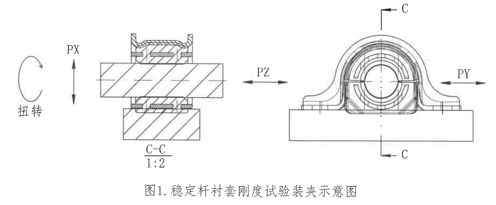

原图位置/视图名称：页 1，图 1 试验装夹示意图，bbox `[720, 2550, 2560, 3310]`。

| 提取项 | 原图数值或文本 | 含义说明 |
|---|---|---|
| 左侧扭转载荷标识 | `扭转` | 左侧弯箭头表示扭转载荷方向。 |
| 径向载荷方向 | `PX` | 左侧竖向双向箭头表示 PX 方向加载。 |
| 轴向载荷方向 | `PZ` | 中间水平双向箭头表示 PZ 方向加载。 |
| 右侧径向载荷方向 | `PY` | 右侧水平双向箭头表示 PY 方向加载。 |
| 剖面标识 | `C-C`、`1:2` | 左侧为 C-C 剖面示意，比例 1:2。 |
| 剖切标识 | `C`、`C` | 右侧夹具视图上的 C-C 剖切位置。 |
| 图题 | `图1.稳定杆衬套刚度试验装夹示意图` | 技术要求第 3 条引用的试验装夹示意图。 |

边界归属说明：本裁切覆盖图 1 的 C-C 剖面、右侧 C 剖切位置、PX/PY/PZ/扭转方向和图题；该图为试验装夹示意，不与零件主视、剖面尺寸混合。

## object_7 修订履历表

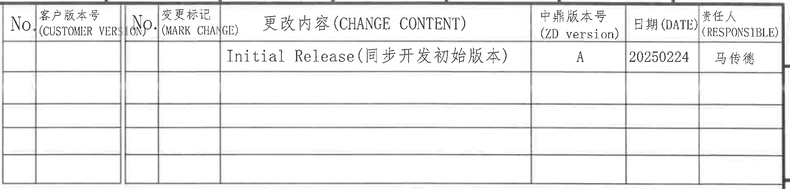

原图位置/视图名称：页 1，右上修订履历表，bbox `[2885, 170, 4780, 625]`。

原表还原：

| No. | 客户版本号 (CUSTOMER VERSION) | No. | 变更标记 (MARK CHANGE) | 更改内容 (CHANGE CONTENT) | 中鼎版本号 (ZD version) | 日期 (DATE) | 责任人 (RESPONSIBLE) |
|---|---|---|---|---|---|---|---|
|  |  |  |  | Initial Release(同步开发初始版本) | A | 20250224 | 马传德 |
|  |  |  |  |  |  |  |  |
|  |  |  |  |  |  |  |  |
|  |  |  |  |  |  |  |  |
|  |  |  |  |  |  |  |  |

| 提取项 | 原图数值或文本 | 含义说明 |
|---|---|---|
| 更改内容 | `Initial Release(同步开发初始版本)` | 初始发布/同步开发初始版本。 |
| 中鼎版本号 | `A` | 本页对应中鼎版本 A。 |
| 日期 | `20250224` | 修订记录日期。 |
| 责任人 | `马传德` | 修订责任人。 |

边界归属说明：本裁切仅包含修订履历表边框、表头和行记录；未纳入右侧外框坐标字母或下方技术要求文本。

## object_8 技术要求（上半部分）

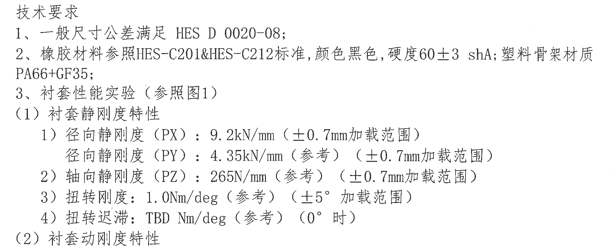

原图位置/视图名称：页 1，技术要求上半部分，bbox `[2865, 700, 4750, 1460]`。

原文还原：

```text
技术要求
1、一般尺寸公差满足 HES D 0020-08;
2、橡胶材料参照HES-C201&HES-C212标准，颜色黑色，硬度60±3 shA; 塑料骨架材质
PA66+GF35;
3、衬套性能实验（参照图1）
（1）衬套静刚度特性
  1）径向静刚度（PX）：9.2kN/mm（±0.7mm加载范围）
     径向静刚度（PY）：4.35kN/mm（参考）（±0.7mm加载范围）
  2）轴向静刚度（PZ）：265N/mm（参考）（±0.7mm加载范围）
  3）扭转刚度：1.0Nm/deg（参考）（±5°加载范围）
  4）扭转迟滞：TBD Nm/deg（参考）（0°时）
（2）衬套动刚度特性
```

| 提取项 | 原图数值或文本 | 含义说明 |
|---|---|---|
| 一般尺寸公差标准 | `HES D 0020-08` | 未单独标注公差的尺寸按该标准。 |
| 橡胶材料标准 | `HES-C201&HES-C212` | 橡胶材料参考标准。 |
| 颜色 | `黑色` | 橡胶颜色要求。 |
| 硬度 | `60±3 shA` | 橡胶硬度要求，公差 `±3 shA`。 |
| 塑料骨架材质 | `PA66+GF35` | 塑料骨架材料。 |
| PX 径向静刚度 | `9.2kN/mm（±0.7mm加载范围）` | PX 方向静刚度要求，加载位移范围 `±0.7mm`。 |
| PY 径向静刚度 | `4.35kN/mm（参考）（±0.7mm加载范围）` | PY 方向静刚度为参考值，加载位移范围 `±0.7mm`。 |
| PZ 轴向静刚度 | `265N/mm（参考）（±0.7mm加载范围）` | PZ 方向静刚度为参考值，加载位移范围 `±0.7mm`。 |
| 扭转刚度 | `1.0Nm/deg（参考）（±5°加载范围）` | 扭转刚度为参考值，角位移加载范围 `±5°`。 |
| 扭转迟滞 | `TBD Nm/deg（参考）（0°时）` | 扭转迟滞待定，参考项，条件为 `0°` 时。 |

边界归属说明：本裁切为技术要求第 1 条至第 3(2) 条标题，动态刚度表未并入本对象，见 object_9；第 3(3) 条及后续内容见 object_12。

## object_9 衬套动刚度特性表

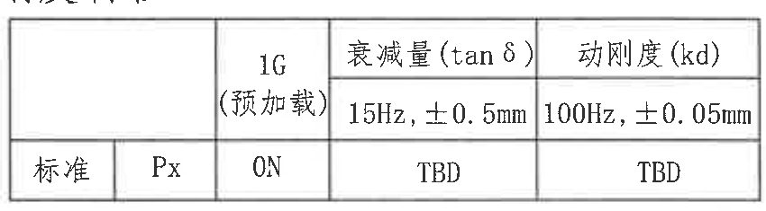

原图位置/视图名称：页 1，技术要求中的衬套动刚度特性表，bbox `[3170, 1455, 4020, 1690]`。

原表还原：

|  |  | `1G`<br>`(预加载)` | 衰减量 (tan δ)<br>`15Hz, ±0.5mm` | 动刚度 (kd)<br>`100Hz, ±0.05mm` |
|---|---|---|---|---|
| 标准 | Px | 0N | TBD | TBD |

| 提取项 | 原图数值或文本 | 含义说明 |
|---|---|---|
| 预加载 | `1G (预加载)`、`0N` | 标准 Px 条件下预加载为 0N。 |
| 衰减量测试条件 | `15Hz, ±0.5mm` | tan δ 的测试频率和振幅条件。 |
| 衰减量结果 | `TBD` | 衰减量结果待定。 |
| 动刚度测试条件 | `100Hz, ±0.05mm` | 动刚度 kd 的测试频率和振幅条件。 |
| 动刚度结果 | `TBD` | 动刚度结果待定。 |

边界归属说明：本裁切只包含动态刚度特性小表；未包含表上方静刚度文字，也未包含表下方体积电阻率文字。

## object_10 BOM / 材料明细表

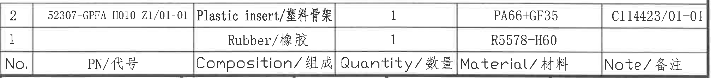

原图位置/视图名称：页 1，右下 BOM/材料明细表，bbox `[2765, 2535, 4780, 2757]`。

原表还原：

| No. | PN/代号 | Composition/组成 | Quantity/数量 | Material/材料 | Note/备注 |
|---|---|---|---:|---|---|
| 2 | 52307-GPFA-H010-Z1/01-01 | Plastic insert/塑料骨架 | 1 | PA66+GF35 | C114423/01-01 |
| 1 |  | Rubber/橡胶 | 1 | R5578-H60 |  |

| 提取项 | 原图数值或文本 | 含义说明 |
|---|---|---|
| 零件 2 代号 | `52307-GPFA-H010-Z1/01-01` | 塑料骨架部件代号。 |
| 零件 2 组成 | `Plastic insert/塑料骨架` | 塑料骨架。 |
| 零件 2 数量 | `1` | 每组件数量 1。 |
| 零件 2 材料 | `PA66+GF35` | 塑料骨架材料。 |
| 零件 2 备注 | `C114423/01-01` | 备注/关联编号。 |
| 零件 1 组成 | `Rubber/橡胶` | 橡胶件。 |
| 零件 1 数量 | `1` | 每组件数量 1。 |
| 零件 1 材料 | `R5578-H60` | 橡胶材料牌号。 |

边界归属说明：本裁切只包含 BOM 表头和两行物料记录；未纳入下方标题栏的比例、重量、材料、产品号等字段。

## object_11 标题栏

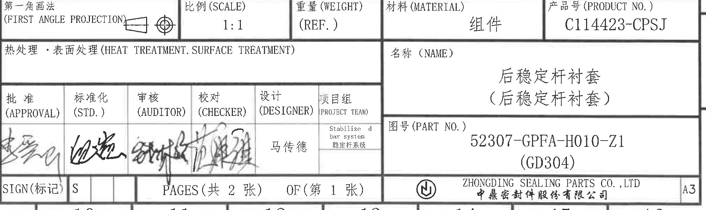

原图位置/视图名称：页 1，标题栏，bbox `[2765, 2760, 4790, 3365]`。

| 提取项 | 原图数值或文本 | 含义说明 |
|---|---|---|
| 投影法 | `第一角画法 (FIRST ANGLE PROJECTION)` | 图纸采用第一角画法。 |
| 比例 | `1:1` | 图纸比例。 |
| 重量 | `(REF.)` | 重量为参考项，未给出数值。 |
| 材料 | `组件` | 标题栏材料/类别为组件。 |
| 产品号 | `C114423-CPSJ` | 产品编号。 |
| 热处理/表面处理 | `热处理・表面处理 (HEAT TREATMENT.SURFACE TREATMENT)` | 栏位存在，内容为空。 |
| 名称 | `后稳定杆衬套（后稳定杆衬套）` | 零件/组件名称。 |
| 图号 | `52307-GPFA-H010-Z1 (GD304)` | Part No.。 |
| 批准 | `APPROVAL` 签名 | 批准栏签名。 |
| 标准化 | `STD.` 签名 | 标准化栏签名。 |
| 审核 | `AUDITOR` 签名 | 审核栏签名。 |
| 校对 | `CHECKER` 签名 | 校对栏签名。 |
| 设计 | `DESIGNER`、`马传德` | 设计责任人。 |
| 项目组 | `Stabilized bar system / 稳定杆系统` | 项目组名称。 |
| 标记 | `SIGN(标记)`、`S` | 标记为 S。 |
| 页数 | `PAGES(共 2 张)`、`OF(第 1 张)` | 共 2 张，本页第 1 张。 |
| 公司 | `ZHONGDING SEALING PARTS CO., LTD`、`中鼎密封件股份有限公司` | 出图公司。 |
| 图幅 | `A3` | 图纸幅面。 |

边界归属说明：本裁切从 BOM 下边界以下开始，仅包含标题栏各字段、签名区、页码区、公司和图幅；未将上方 BOM 行项目混入标题栏提取。

## object_12 技术要求（下半部分）

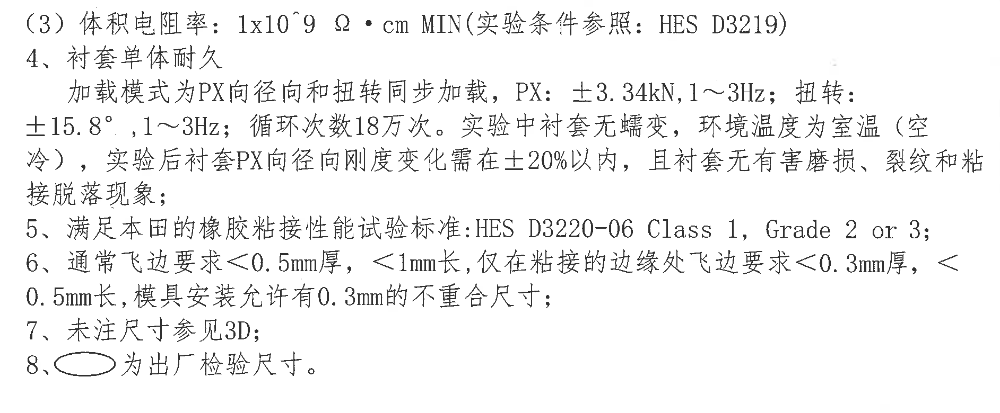

原图位置/视图名称：页 1，技术要求下半部分，bbox `[2865, 1685, 4750, 2465]`。

原文还原：

```text
（3）体积电阻率：1x10^9 Ω • cm MIN(实验条件参照：HES D3219)
4、衬套单体耐久
   加载模式为PX向径向和扭转同步加载，PX：±3.34kN,1～3Hz; 扭转:
±15.8°，1～3Hz；循环次数18万次。实验中衬套无蠕变，环境温度为室温（空
冷），实验后衬套PX向径向刚度变化需在±20%以内，且衬套无有害磨损、裂纹和粘
接脱落现象；
5、满足本田的橡胶粘接性能试验标准:HES D3220-06 Class 1, Grade 2 or 3;
6、通常飞边要求<0.5mm厚，<1mm长，仅在粘接的边缘处飞边要求<0.3mm厚，<
0.5mm长，模具安装允许有0.3mm的不重合尺寸；
7、未注尺寸参见3D;
8、○ 为出厂检验尺寸。
```

| 提取项 | 原图数值或文本 | 含义说明 |
|---|---|---|
| 体积电阻率 | `1x10^9 Ω • cm MIN` | 最小体积电阻率要求。 |
| 电阻率实验条件标准 | `HES D3219` | 体积电阻率实验条件参照标准。 |
| 耐久加载模式 | `PX向径向和扭转同步加载` | 衬套单体耐久试验加载方式。 |
| PX 载荷 | `±3.34kN, 1～3Hz` | PX 径向加载力和频率。 |
| 扭转载荷 | `±15.8°，1～3Hz` | 扭转角度和频率。 |
| 循环次数 | `18万次` | 耐久循环次数。 |
| 环境温度 | `室温（空冷）` | 试验环境条件。 |
| 试验后刚度变化 | `±20%以内` | 试验后 PX 径向刚度变化限值。 |
| 橡胶粘接标准 | `HES D3220-06 Class 1, Grade 2 or 3` | 橡胶粘接性能试验标准。 |
| 通常飞边要求 | `<0.5mm厚，<1mm长` | 通常飞边厚度和长度限制。 |
| 粘接边缘飞边要求 | `<0.3mm厚，<0.5mm长` | 粘接边缘处飞边限制。 |
| 模具安装不重合尺寸 | `0.3mm` | 模具安装允许的不重合尺寸。 |
| 未注尺寸 | `参见3D` | 未注尺寸依据 3D 数据。 |
| 椭圆标记说明 | `○ 为出厂检验尺寸` | 图中椭圆圈出的尺寸为出厂检验尺寸。 |

边界归属说明：本裁切从动态刚度表下方开始，包含技术要求第 3(3) 条至第 8 条；未将 object_9 的动态刚度表混入本对象。

## 裁切检查记录

| 对象 | 检查结论 | 尺寸线/文字完整性 | 归属检查 |
|---|---|---|---|
| object_1 主视图 | 通过 | `20.5±0.3`、`1.5`、`44`、`48` 和 A-A 标识完整。 | 未带入 A-A 剖面主体；右侧 `1.5` 判定归属主视图。 |
| object_2 A-A 剖面 | 通过 | `34`、`40`、`45°`、`A-A 1:1` 完整。 | 未带入主视图尺寸。 |
| object_3 俯视图 | 通过 | `34±0.3`、`40`、两处 `4`、B-B 标识完整。 | 未带入局部 D 或 B-B 剖面尺寸。 |
| object_4 局部 D | 通过 | 三处 `R0.5`、`5°(拔模角)`、`42°`、`1.5`、`7°`、`D 3:1` 完整。 | 未带入俯视图或 B-B 剖面尺寸。 |
| object_5 B-B 剖面 | 通过 | `0.5`、`R15.5`、`R18`、`R5`、`R0.5`、`R10.6±0.2`、`B-B 1:1` 完整。 | 未带入上方俯视图；D 呼出作为索引保留。 |
| object_6 图 1 装夹示意 | 通过 | `PX`、`PY`、`PZ`、`扭转`、`C-C 1:2`、图题完整。 | 作为试验示意图独立提取，未归入零件加工视图。 |
| object_7 修订履历表 | 通过 | 表头、表格线和 `Initial Release` 行完整。 | 未混入下方技术要求文本。 |
| object_8 技术要求上半 | 通过 | 第 1 条至第 3(2) 条标题完整。 | 动态刚度表单独归属 object_9。 |
| object_9 动刚度表 | 通过 | 小表边框、表头、`15Hz, ±0.5mm`、`100Hz, ±0.05mm`、`TBD` 完整。 | 未混入上方/下方技术要求正文。 |
| object_10 BOM 表 | 通过 | 两行物料、表头和边框完整。 | 未混入标题栏字段。 |
| object_11 标题栏 | 通过 | 投影法、比例、重量、材料、产品号、名称、图号、签名、页数、公司和 A3 完整。 | 未混入上方 BOM 行项目。 |
| object_12 技术要求下半 | 通过 | 第 3(3) 条至第 8 条完整。 | 未混入动态刚度表。 |
