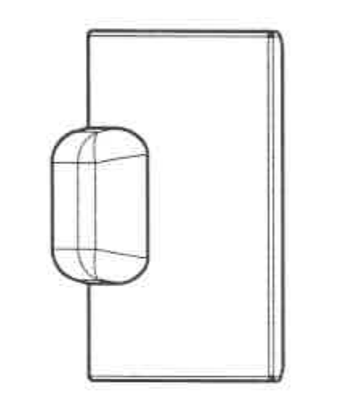
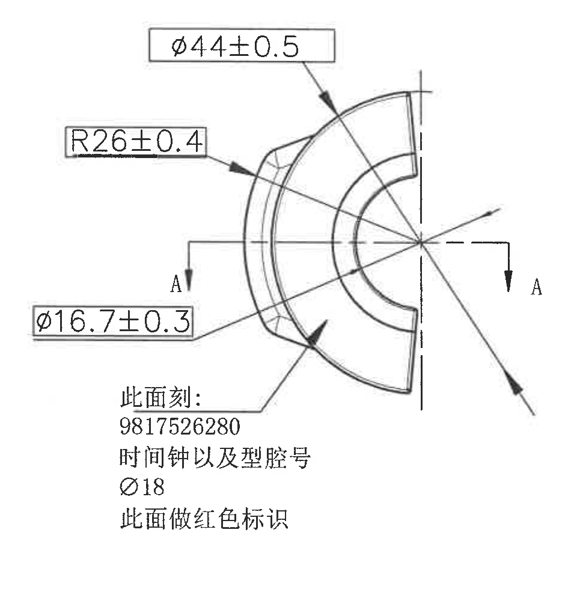
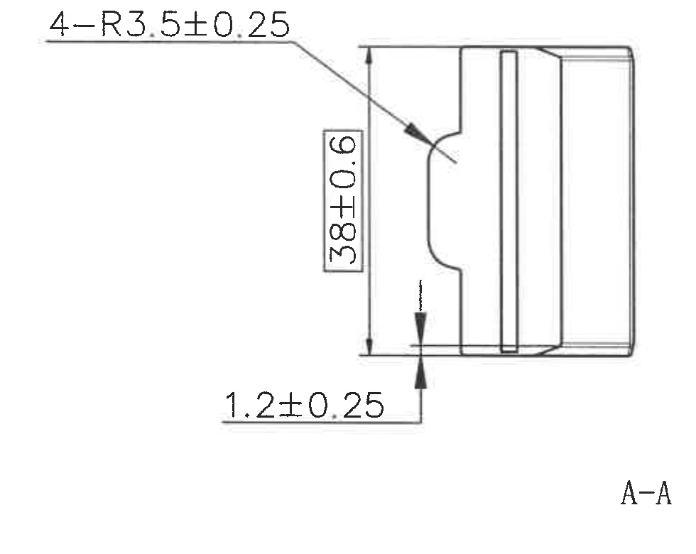
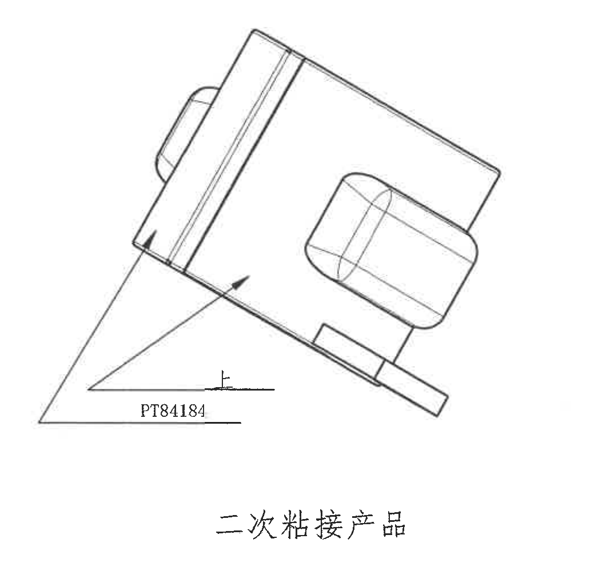
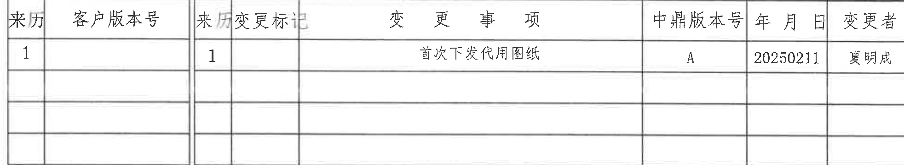
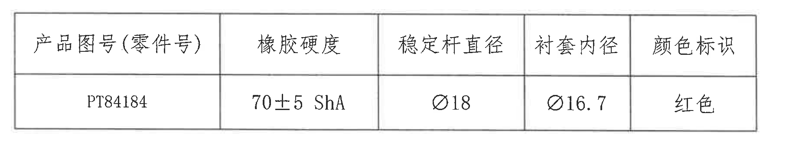
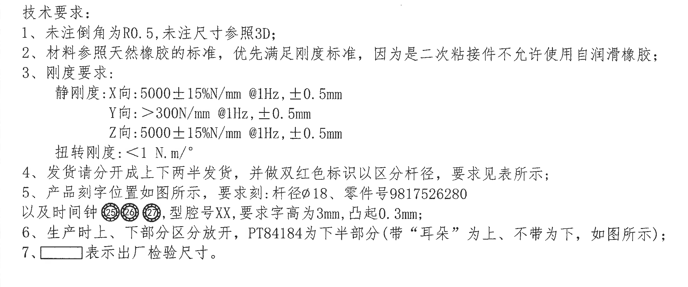
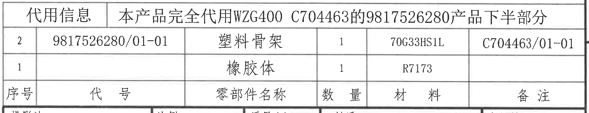
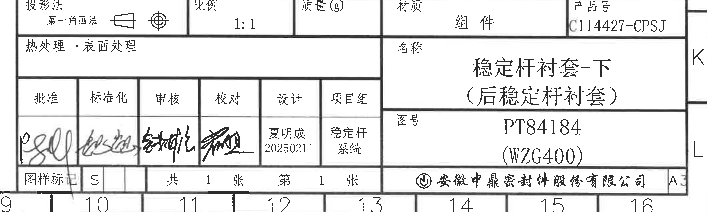

# 20C114427.pdf 内容识别与裁切提取

输入文件: `input/20C114427.pdf`  
整页渲染图: `outputs/20C114427_assets/images/page_1.png`  
整页 PNG 尺寸: 4959 x 3505 px, page bbox `[0, 0, 4959, 3505]`

全页可见标注检查: 本页可见尺寸中未发现括号内参考尺寸、带星号关键尺寸、T 编号、几何基准符号或角度尺寸；剖面字母 `A-A` 作为剖面视图标识出现在主视图和剖面视图中。NOTES 第 1 条写明“未注尺寸参照3D”，属于未注尺寸的参考来源说明。

## object_1 | 上方小视图

原图位置/视图名称: page 1, bbox `[1060, 460, 1490, 980]`, 上方小视图。

| 提取项 | 原图数值或文本 | 含义说明 |
| --- | --- | --- |
| 视图图形 | 无尺寸文字 | 该视图显示矩形本体与左侧圆角凸出结构的相对位置。 |
| 尺寸标注 | 无 | 此裁切区域内没有尺寸线、箭头、公差、直径符号或剖面标识。 |
| 几何关系 | 矩形本体、圆角凸台/耳部轮廓 | 用于表达产品局部外形和凸出部分位置，具体尺寸需从其他视图和表格读取。 |

边界归属说明: 裁切仅包含上方小视图图线，未包含左下主视图、A-A 剖面、修订表或任何表格文字。该对象内没有尺寸文字可归属到其他对象。

## object_2 | 左侧主视图

原图位置/视图名称: page 1, bbox `[720, 1070, 1670, 2050]`, 左侧主视图。

| 提取项 | 原图数值或文本 | 含义说明 |
| --- | --- | --- |
| 直径尺寸 | `Ø44±0.5` | 主视图外侧圆弧轮廓的直径尺寸，公差为 ±0.5。 |
| 半径尺寸 | `R26±0.4` | 主视图外侧弧形轮廓半径，公差为 ±0.4。 |
| 直径尺寸 | `Ø16.7±0.3` | 主视图内侧孔/衬套内径相关尺寸，公差为 ±0.3。 |
| 剖面标识 | `A-A` | 主视图水平剖切线两端均标 `A`，指向 object_3 的 A-A 剖面视图；剖面尺寸不归入本对象。 |
| 刻字说明 | `此面刻: 9817526280` | 指定该面刻零件号/代号 `9817526280`。 |
| 刻字说明 | `时间钟以及型腔号` | 指定同一面还需刻时间钟和型腔号。 |
| 刻字说明 | `Ø18` | 指定刻字内容或杆径标识为 Ø18。 |
| 颜色标识 | `此面做红色标识` | 指定该面做红色标识。 |

边界归属说明: 本裁切完整包含 `Ø44±0.5`、`R26±0.4`、`Ø16.7±0.3` 的标注框、引出线和箭头，也完整包含 A-A 剖切线及两端箭头。右侧只保留主视图剖切方向线，没有混入 object_3 的 A-A 剖面尺寸。

## object_3 | A-A 剖面视图

原图位置/视图名称: page 1, bbox `[1880, 1150, 2860, 1930]`, A-A 剖面视图。

| 提取项 | 原图数值或文本 | 含义说明 |
| --- | --- | --- |
| 圆角/弧半径 | `4-R3.5±0.25` | 数量前缀 `4-` 表示 4 处 R3.5 圆角/弧形过渡，公差为 ±0.25。 |
| 总高度尺寸 | `38±0.6` | A-A 剖面中竖向总高度尺寸，公差为 ±0.6。 |
| 台阶/边缘尺寸 | `1.2±0.25` | 剖面底部小台阶或边缘厚度/高度尺寸，公差为 ±0.25。 |
| 剖面名 | `A-A` | 与 object_2 中 A-A 剖切线对应。 |

边界归属说明: 裁切完整包含本剖面视图、`4-R3.5±0.25` 引出线、`38±0.6` 竖向尺寸线、`1.2±0.25` 尺寸线和视图名 `A-A`。左侧主视图的 A-A 剖切箭头不纳入本对象提取。

## object_4 | 右侧二次粘接产品视图

原图位置/视图名称: page 1, bbox `[3480, 850, 4540, 1850]`, 二次粘接产品视图。

| 提取项 | 原图数值或文本 | 含义说明 |
| --- | --- | --- |
| 视图标题 | `二次粘接产品` | 表示该图为二次粘接产品状态/方向示意。 |
| 产品标识 | `PT84184` | 引出线标注的产品图号或零件标识。 |
| 指示线 | 2 条箭头引出线 | 指向粘接产品结构区域，用于说明 `PT84184` 对应的下半部分/位置。 |
| 尺寸标注 | 无 | 本视图未给出数值尺寸、公差、直径、半径或角度。 |

边界归属说明: 裁切包含完整二次粘接视图、`PT84184` 标识和标题文字。下方产品参数表未混入本对象；本对象不提取 object_6 表格中的尺寸或材料字段。

## object_5 | 顶部修订履历表

原图位置/视图名称: page 1, bbox `[2748, 180, 4713, 540]`, 顶部修订履历表。

原表还原:

| 来历 | 客户版本号 | 来历 | 变更标记 | 变更事项 | 中鼎版本号 | 年月日 | 变更者 |
| --- | --- | --- | --- | --- | --- | --- | --- |
| 1 |  | 1 |  | 首次下发代用图纸 | A | 20250211 | 夏明成 |
|  |  |  |  |  |  |  |  |
|  |  |  |  |  |  |  |  |
|  |  |  |  |  |  |  |  |

| 提取项 | 原图数值或文本 | 含义说明 |
| --- | --- | --- |
| 表头 | `来历 / 客户版本号 / 来历 / 变更标记 / 变更事项 / 中鼎版本号 / 年月日 / 变更者` | 修订履历表字段。 |
| 修订记录 | `1, 1, 首次下发代用图纸, A, 20250211, 夏明成` | 表示首次下发代用图纸，中鼎版本号为 A，日期 20250211，变更者夏明成。 |
| 空白行 | 3 行空白 | 原表保留未填写的后续修订行。 |

边界归属说明: 裁切只包含顶部修订履历表的表格外框和内部行列。上方图框坐标编号和右侧图框字母未作为表格字段提取。

## object_6 | 产品参数表

原图位置/视图名称: page 1, bbox `[2870, 1900, 4720, 2280]`, 产品参数表。

原表还原:

| 产品图号(零件号) | 橡胶硬度 | 稳定杆直径 | 衬套内径 | 颜色标识 |
| --- | --- | --- | --- | --- |
| PT84184 | 70±5 ShA | Ø18 | Ø16.7 | 红色 |

| 提取项 | 原图数值或文本 | 含义说明 |
| --- | --- | --- |
| 产品图号(零件号) | `PT84184` | 本表对应的产品图号/零件号。 |
| 橡胶硬度 | `70±5 ShA` | 橡胶硬度规格，公差为 ±5 ShA。 |
| 稳定杆直径 | `Ø18` | 适配稳定杆直径。 |
| 衬套内径 | `Ø16.7` | 衬套内径名义值。 |
| 颜色标识 | `红色` | 产品颜色标识要求。 |

边界归属说明: 裁切完整包含产品参数表的表头、唯一数据行和外框。上方二次粘接视图、下方代用信息表和标题栏均未作为本对象内容提取。

## object_7 | 技术要求 NOTES

原图位置/视图名称: page 1, bbox `[380, 2100, 2580, 3020]`, 技术要求/NOTES。

| 提取项 | 原图数值或文本 | 含义说明 |
| --- | --- | --- |
| 标题 | `技术要求:` | NOTES 区域标题。 |
| 1 | `未注倒角为R0.5, 未注尺寸参照3D;` | 未单独标注的倒角按 R0.5；未注尺寸以 3D 数据为参考。 |
| 2 | `材料参照天然橡胶的标准，优先满足刚度标准，因为是二次粘接件不允许使用自润滑橡胶;` | 材料和刚度优先级要求；二次粘接件禁止使用自润滑橡胶。 |
| 3-静刚度 X 向 | `5000±15%N/mm @1Hz, ±0.5mm` | X 向静刚度要求及测试位移幅值。 |
| 3-静刚度 Y 向 | `>300N/mm @1Hz, ±0.5mm` | Y 向静刚度下限及测试位移幅值。 |
| 3-静刚度 Z 向 | `5000±15%N/mm @1Hz, ±0.5mm` | Z 向静刚度要求及测试位移幅值。 |
| 3-扭转刚度 | `<1 N.m/°` | 扭转刚度要求。 |
| 4 | `发货请分开成上下两半发货，并做双红色标识以区分杆径，要求见表所示;` | 发货需上下半分开，并用双红色标识区分杆径。 |
| 5 | `产品刻字位置如图所示，要求刻:杆径Ø18、零件号9817526280以及时间钟 25 26 27，型腔号XX，要求字高为3mm，凸起0.3mm;` | 刻字内容、杆径、零件号、时间钟、型腔号、字高和凸起高度要求；时间钟在原图中为圈号 25、26、27。 |
| 6 | `生产时上、下部分区分放开，PT84184为下半部分(带“耳朵”为上、不带为下，如图所示);` | 生产时区分上下部分；PT84184 属于下半部分。 |
| 7 | `□ 表示出厂检验尺寸。` | 图纸中矩形框标注代表出厂检验尺寸。 |

边界归属说明: 裁切完整包含 NOTES 的 1-7 条文字和第 7 条前的矩形符号。该区域没有视图尺寸线，刚度、杆径、字高等数值作为技术要求提取，不归入主视图或剖面视图尺寸。

## object_8 | 代用信息/BOM 表

原图位置/视图名称: page 1, bbox `[2745, 2378, 4765, 2768]`, 代用信息/BOM 表。

原表还原（按原图从上到下）:

| 代用信息 | 本产品完全代用WZG400 C704463的9817526280产品下半部分 |  |  |  |  |
| --- | --- | --- | --- | --- | --- |
| 2 | 9817526280/01-01 | 塑料骨架 | 1 | 70G33HS1L | C704463/01-01 |
| 1 |  | 橡胶体 | 1 | R7173 |  |
| 序号 | 代号 | 零部件名称 | 数量 | 材料 | 备注 |

| 提取项 | 原图数值或文本 | 含义说明 |
| --- | --- | --- |
| 代用说明 | `本产品完全代用WZG400 C704463的9817526280产品下半部分` | 说明本产品对原 WZG400/C704463/9817526280 下半部分的代用关系。 |
| 序号 2 | `9817526280/01-01 / 塑料骨架 / 1 / 70G33HS1L / C704463/01-01` | BOM 第 2 项，塑料骨架，数量 1，材料 70G33HS1L，备注 C704463/01-01。 |
| 序号 1 | `橡胶体 / 1 / R7173` | BOM 第 1 项，橡胶体，数量 1，材料 R7173；代号和备注为空白。 |
| 表头 | `序号 / 代号 / 零部件名称 / 数量 / 材料 / 备注` | 原图表头位于该表底部。 |

边界归属说明: 该表与下方标题栏共用水平分隔线，裁切保留共享边线以保证表格完整。下方标题栏字段没有作为本对象字段提取；右侧图框坐标线不作为 BOM 内容。

## object_9 | 标题栏

原图位置/视图名称: page 1, bbox `[2705, 2765, 4815, 3400]`, 标题栏。

标题栏字段还原:

| 字段 | 原图文本 |
| --- | --- |
| 投影法 | 第一角画法；原图含第一角投影符号 |
| 比例 | 1:1 |
| 质量(g) | 空白 |
| 材质 | 组件 |
| 产品号 | C114427-CPSJ |
| 热处理·表面处理 | 空白 |
| 名称 | 稳定杆衬套-下 |
| 名称补充 | (后稳定杆衬套) |
| 批准 | 手写签名 |
| 标准化 | 手写签名 |
| 审核 | 手写签名 |
| 校对 | 手写签名 |
| 设计 | 夏明成 / 20250211 |
| 项目组 | 稳定杆系统 |
| 图号 | PT84184 |
| 图号补充 | (WZG400) |
| 图样标记 | S |
| 张数 | 共 1 张 第 1 张 |
| 公司 | 安徽中鼎密封件股份有限公司 |
| 图幅 | A3 |

| 提取项 | 原图数值或文本 | 含义说明 |
| --- | --- | --- |
| 产品号 | `C114427-CPSJ` | 标题栏产品号。 |
| 图号 | `PT84184 (WZG400)` | 图纸图号及括号内平台/项目标识。 |
| 名称 | `稳定杆衬套-下 (后稳定杆衬套)` | 零件名称与括号内补充名称。 |
| 比例 | `1:1` | 图纸比例。 |
| 材质 | `组件` | 标题栏材质/物料属性。 |
| 设计 | `夏明成 20250211` | 设计人员与日期。 |
| 项目组 | `稳定杆系统` | 项目组信息。 |
| 图样标记 | `S` | 图样标记。 |
| 张数 | `共1张 第1张` | 本图纸共 1 张，当前第 1 张。 |

边界归属说明: 裁切完整包含标题栏主体、签字栏、图号栏、公司栏和图幅信息。右侧和底部可见少量图框坐标字母/数字，属于图纸边框定位信息，不作为标题栏字段；上方 BOM 表字段不归入本对象。

## 裁切检查记录

| 对象 | bbox | 完整性检查 | 归属检查 |
| --- | --- | --- | --- |
| object_1 | `[1060, 460, 1490, 980]` | 完整包含小视图轮廓；无尺寸文字需要补裁。 | 未混入其他视图或表格。 |
| object_2 | `[720, 1070, 1670, 2050]` | 完整包含 `Ø44±0.5`、`R26±0.4`、`Ø16.7±0.3` 的文字、尺寸线、箭头和 A-A 剖切标识。 | 剖面 A-A 的实际剖视尺寸未归到本对象。 |
| object_3 | `[1880, 1150, 2860, 1930]` | 完整包含 `4-R3.5±0.25`、`38±0.6`、`1.2±0.25`、箭头和 `A-A` 视图名。 | 未混入左侧主视图尺寸。 |
| object_4 | `[3480, 850, 4540, 1850]` | 完整包含二次粘接产品视图、`PT84184` 和标题文字。 | 未混入产品参数表字段。 |
| object_5 | `[2748, 180, 4713, 540]` | 完整包含修订履历表表头、记录行和空白行。 | 图框坐标编号未作为表格内容提取。 |
| object_6 | `[2870, 1900, 4720, 2280]` | 完整包含产品参数表表头和数据行。 | 未混入上方二次粘接视图或下方 BOM 表。 |
| object_7 | `[380, 2100, 2580, 3020]` | 完整包含技术要求 1-7 条和第 7 条矩形符号。 | 技术要求中的数值按 NOTES 归属，不并入加工视图尺寸。 |
| object_8 | `[2745, 2378, 4765, 2768]` | 完整包含代用信息/BOM 表、顶部代用说明、两条数据和底部表头。 | 与标题栏共用分隔线；标题栏字段未作为本表内容提取。 |
| object_9 | `[2705, 2765, 4815, 3400]` | 完整包含标题栏主体字段、签名栏、图号、公司、图幅和张数。 | 右侧/底部图框坐标为边框定位信息，未作为标题栏字段。 |
