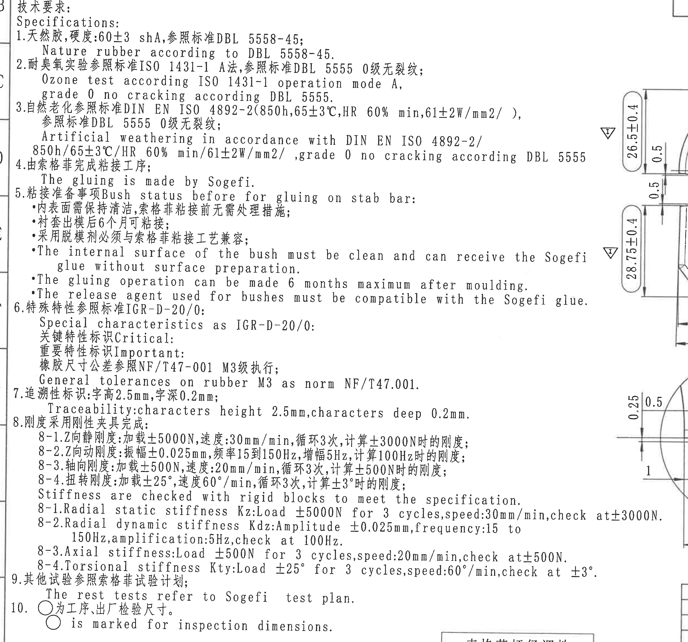
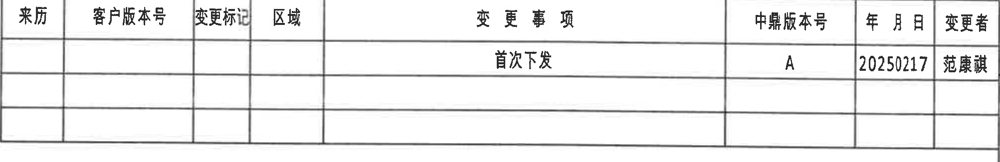
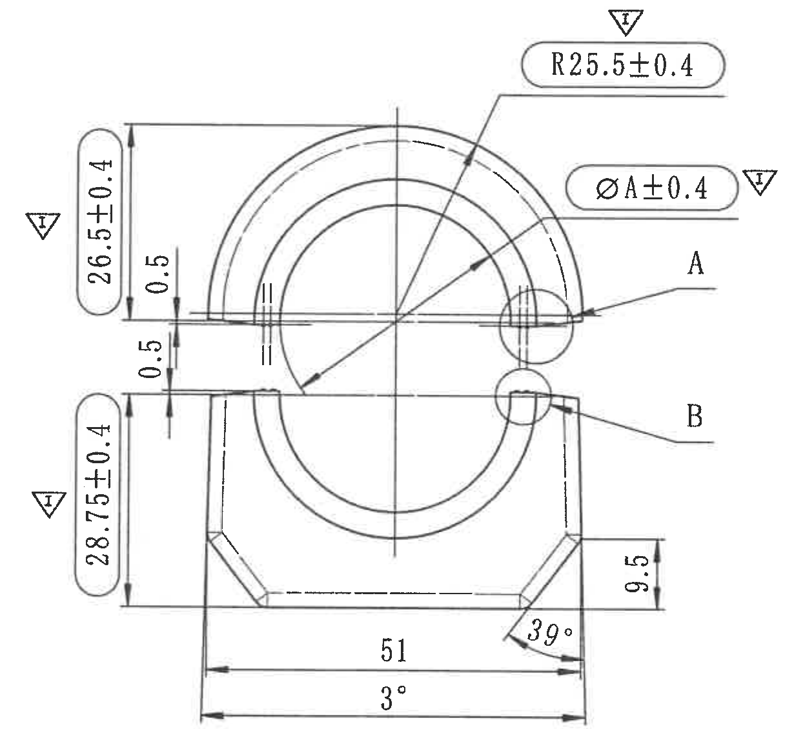
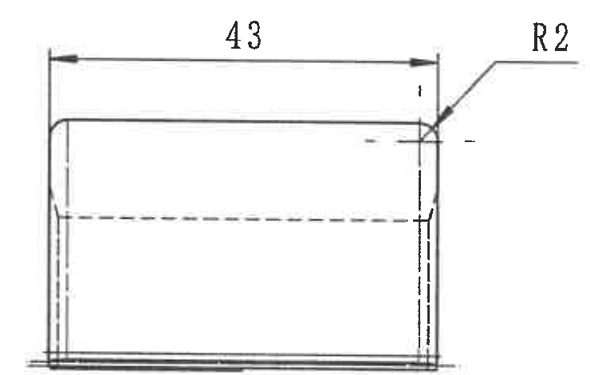
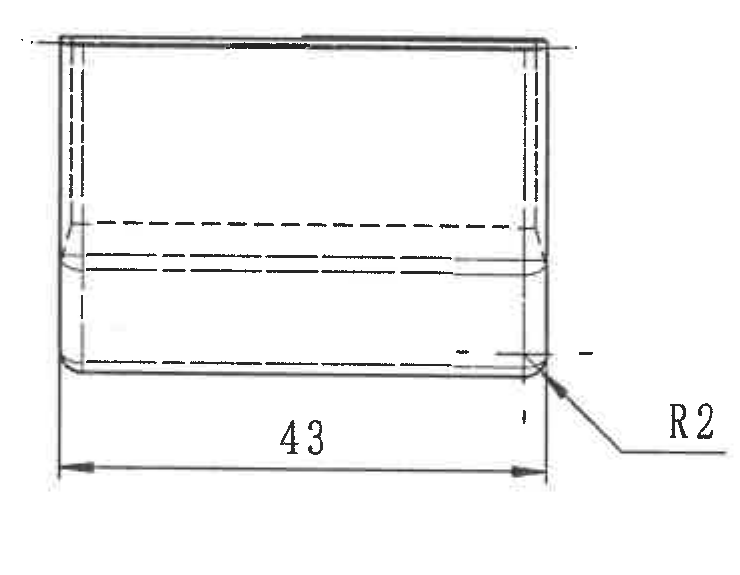
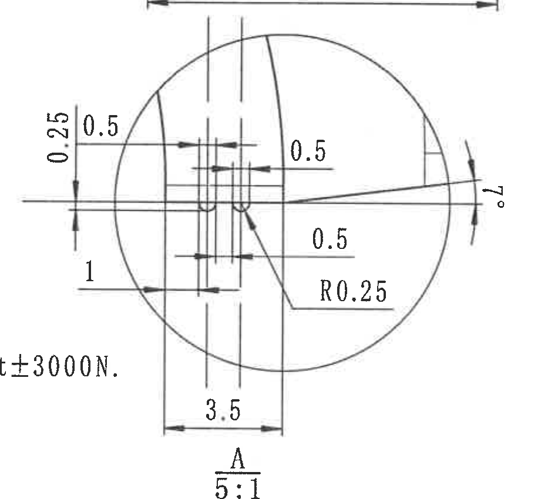
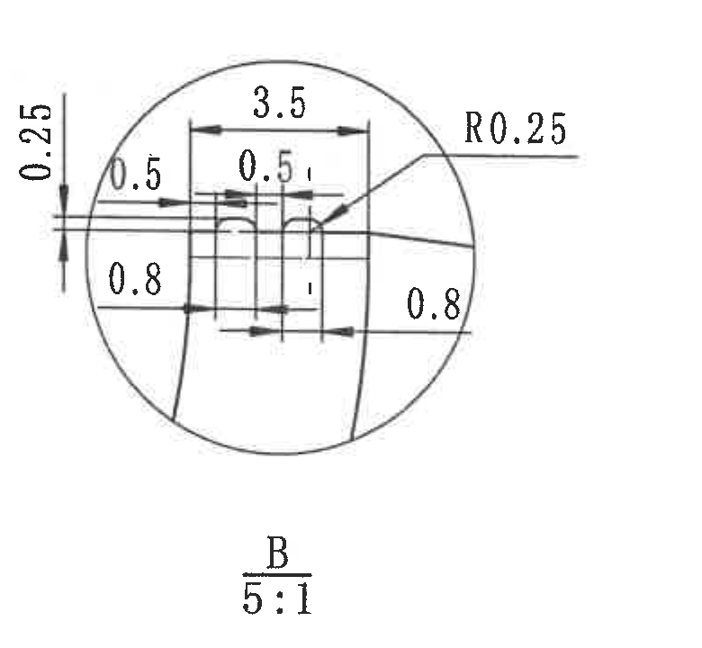
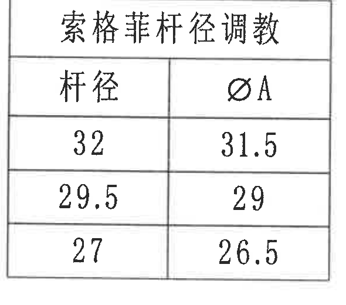
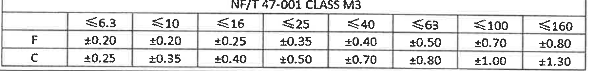
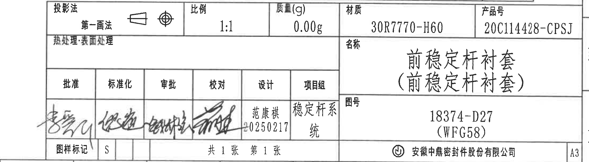

# 20C114428 内容识别

源文件: `input/20C114428.pdf`
整页渲染图: `outputs/20C114428_assets/images/page_1.png`

识别说明: PDF 为扫描图，先渲染为 4959 x 3505 PNG 后裁切。以下每个裁切对象均按原图区域顺序记录；尺寸、括号内参考信息、直径符号、半径、角度、局部视图比例、表格字段和边界归属均在对象内说明。

## object_1 - 技术要求 / Specifications

原图位置/视图名称: 左侧技术要求区，bbox `[345, 405, 2825, 2720]`。

| 提取项 | 原图数值或文本 | 含义说明 |
|---|---|---|
| 标题 | 技术要求 / Specifications | 技术要求说明区。 |
| 1 | 天然胶, 硬度: 60+3 shA, 参照标准 DBL 5558-45 / Nature rubber according to DBL 5558-45. | 材料为天然橡胶，硬度要求约 60 shA，上偏差 +3；执行 DBL 5558-45。 |
| 2 | ISO 1431-1 A法; DBL 5555 0级无裂纹 | 臭氧试验按 ISO 1431-1 操作模式 A，验收为 DBL 5555 0 级无裂纹。 |
| 3 | DIN EN ISO 4892-2 (850h, 65+/-3 degC, HR 60% min, 61+/-2 W/mm2/); DBL 5555 0级无裂纹 | 自然/人工老化条件与验收要求。 |
| 4 | The gluing is made by Sogefi. | 粘接工序由 Sogefi 完成。 |
| 5 | Bush status before for gluing on stab bar | 稳定杆粘接前衬套状态要求。 |
| 5-1 | 内表面需保持清洁, 索格菲粘接前无需处理措施 | 衬套内表面清洁即可接受 Sogefi 胶。 |
| 5-2 | 衬套出模后6个月可粘接 | 成型后最多 6 个月内可粘接。 |
| 5-3 | 采用脱模剂必须与索格菲粘接工艺兼容 | 脱模剂需与 Sogefi 胶兼容。 |
| 6 | IGR-D-20/0; Critical; Important; NF/T47-001 M3 | 特殊特性和橡胶尺寸一般公差等级。 |
| 7 | 字高 2.5mm, 字深 0.2mm | 追溯性字符标识要求。 |
| 8 | Stiffness are checked with rigid blocks to meet the specification. | 刚度测试需用刚性夹具。 |
| 8-1 | Z向静刚度: 加载 +/-5000N, 速度 30mm/min, 循环3次, 计算 +/-3000N 时刚度 | 径向静刚度 Kz 条件。 |
| 8-2 | Z向动刚度: 振幅 +/-0.025mm, 频率 15 到 150Hz, 增幅 5Hz, 计算 100Hz 时刚度 | 径向动刚度 Kdz 条件。 |
| 8-3 | 轴向刚度: 加载 +/-500N, 速度 20mm/min, 循环3次, 计算 +/-500N 时刚度 | 轴向刚度条件。 |
| 8-4 | 扭转刚度: 加载 +/-25 deg, 速度 60 deg/min, 循环3次, 计算 +/-3 deg 时刚度 | 扭转刚度 Kty 条件。 |
| 9 | The rest tests refer to Sogefi test plan. | 其他试验参考 Sogefi 试验计划。 |
| 10 | 圆圈为工序、出厂检验尺寸 / circle is marked for inspection dimensions. | 圆圈标识表示工序或出厂检验尺寸。 |

边界归属说明: 为完整保留第 3、5、8 条长英文行，右边界接近主视图并带入少量主视图边缘尺寸片段；这些片段不属于 NOTES，本区域只提取技术要求文字。底部止于第 10 条英文说明下方，杆径调整表作为 object_8 单独提取。

## object_2 - 修订履历表 / Change History

原图位置/视图名称: 上方右侧修订履历表，bbox `[2770, 180, 4775, 505]`。

| 来历 | 客户版本号 | 变更标记 | 区域 | 变更事项 | 中鼎版本号 | 年月日 | 变更者 |
|---|---|---|---|---|---|---|---|
|  |  |  |  | 首次下发 | A | 20250217 | 范康祺 |
|  |  |  |  |  |  |  |  |
|  |  |  |  |  |  |  |  |

| 提取项 | 原图数值或文本 | 含义说明 |
|---|---|---|
| 表头 | 来历、客户版本号、变更标记、区域、变更事项、中鼎版本号、年月日、变更者 | 修订履历字段。 |
| 修订记录 | 首次下发 / A / 20250217 / 范康祺 | 图纸首次下发记录。 |

边界归属说明: 裁切按表格外框，不包含图框坐标数字和右侧 A/B 分区字母。

## object_3 - 主加工视图

原图位置/视图名称: 中央主加工视图，bbox `[2470, 535, 3700, 1665]`。

| 提取项 | 原图数值或文本 | 含义说明 |
|---|---|---|
| 半径尺寸 | R25.5+/-0.4 | 主视图上部圆弧半径，带 +/-0.4 公差，旁有检验标识。 |
| 直径尺寸 | diameter A +/-0.4 | 与下方杆径调整表中的 diameter A 对应，主视图中以直径符号标注，带 +/-0.4 公差，旁有检验标识。 |
| 左上高度 | 26.5+/-0.4 | 主视图左侧上部竖向尺寸，带 +/-0.4 公差和检验标识。 |
| 左下高度 | 28.75+/-0.4 | 主视图左侧下部竖向尺寸，带 +/-0.4 公差和检验标识。 |
| 局部间隙 | 0.5 | 左侧上部水平/竖向间隙尺寸。 |
| 局部间隙 | 0.5 | 左侧中部间隙尺寸。 |
| 底部宽度 | 51 | 主体底部总宽度尺寸，完整尺寸线和两端箭头在主视图内。 |
| 底部角度 | 3 deg | 主体底部外侧角度/斜度标注。 |
| 斜边角度 | 39 deg | 右下斜边角度。 |
| 右侧高度 | 9.5 | 右侧局部竖向高度。 |
| 局部索引 | A | 指向右侧上圆圈区域，对应局部视图 A。 |
| 局部索引 | B | 指向右侧下圆圈区域，对应局部视图 B。 |

边界归属说明: 底部边界扩至完整包含 `51`、`3 deg`、`39 deg` 和 `9.5` 的尺寸线及文字；下方 A 局部放大视图未纳入。本对象不提取右侧剖面视图尺寸。

## object_4 - 右上侧向/剖面视图

原图位置/视图名称: 右上侧向/剖面视图，bbox `[3840, 585, 4580, 1055]`。

| 提取项 | 原图数值或文本 | 含义说明 |
|---|---|---|
| 长度 | 43 | 视图顶部总体长度尺寸，尺寸线和两端箭头完整。 |
| 圆角半径 | R2 | 右上角圆角半径，引出线指向角部。 |
| 内部线 | 虚线/隐藏线 | 表示内部轮廓或不可见边。 |

边界归属说明: 裁切包含 `43` 的完整尺寸线、箭头、`R2` 引出线和文字；下边界止于本视图底部，未混入右下视图。

## object_5 - 右下侧向/剖面视图

原图位置/视图名称: 右下侧向/剖面视图，bbox `[3840, 1110, 4580, 1685]`。

| 提取项 | 原图数值或文本 | 含义说明 |
|---|---|---|
| 长度 | 43 | 视图底部总体长度尺寸，尺寸线和两端箭头完整。 |
| 圆角半径 | R2 | 右侧下部圆角半径，引出线指向角部。 |
| 内部线 | 虚线/隐藏线 | 表示内部轮廓或不可见边。 |

边界归属说明: 上边界扩至本视图顶边，完整包含主体轮廓；未提取右上视图的 `43` 或 `R2`。

## object_6 - 局部视图 A, 5:1

原图位置/视图名称: 下方圆形局部放大视图 A，bbox `[2530, 1640, 3480, 2490]`。

| 提取项 | 原图数值或文本 | 含义说明 |
|---|---|---|
| 竖向尺寸 | 0.25 | 局部 A 左侧上方小台阶/间隙竖向尺寸。 |
| 水平尺寸 | 0.5 | 局部 A 左侧上方水平尺寸。 |
| 水平尺寸 | 0.5 | 局部 A 中部右侧水平尺寸。 |
| 水平尺寸 | 0.5 | 局部 A 下方水平尺寸。 |
| 竖向/偏置尺寸 | 1 | 局部 A 左下竖向或偏置尺寸。 |
| 圆角半径 | R0.25 | 局部 A 内侧圆角半径。 |
| 底部宽度 | 3.5 | 局部 A 底部宽度尺寸。 |
| 弧向/角度 | 3 deg | 局部 A 右侧弧形尺寸线处角度标注，放大确认是 `3 deg`。 |
| 视图名/比例 | A / 5:1 | A 局部放大视图，比例 5:1。 |

边界归属说明: 裁切扩至完整包含左侧 `0.25`、`0.5`、`1` 和底部 `A/5:1`；顶部少量主视图尺寸线和左下 NOTES 尾字因邻近带入，不作为本对象提取。

## object_7 - 局部视图 B, 5:1

原图位置/视图名称: 右下圆形局部放大视图 B，bbox `[3810, 1655, 4590, 2375]`。

| 提取项 | 原图数值或文本 | 含义说明 |
|---|---|---|
| 竖向尺寸 | 0.25 | 局部 B 左侧上方竖向尺寸。 |
| 水平尺寸 | 0.5 | 局部 B 左侧水平尺寸。 |
| 顶部宽度 | 3.5 | 局部 B 顶部宽度尺寸。 |
| 中部尺寸 | 0.5 | 局部 B 中心小结构宽度/间距。 |
| 左下尺寸 | 0.8 | 局部 B 左下侧尺寸。 |
| 右下尺寸 | 0.8 | 局部 B 右下侧尺寸。 |
| 圆角半径 | R0.25 | 局部 B 上部圆角半径。 |
| 视图名/比例 | B / 5:1 | B 局部放大视图，比例 5:1。 |

边界归属说明: 裁切完整包含圆形放大区域、所有尺寸线、引出线、`R0.25` 和 `B/5:1` 标注，未混入其他视图。

## object_8 - 索格菲杆径调整表

原图位置/视图名称: 左下杆径调整表，bbox `[1920, 2690, 2510, 3210]`。

| 杆径 | diameter A |
|---|---|
| 32 | 31.5 |
| 29.5 | 29 |
| 27 | 26.5 |

| 提取项 | 原图数值或文本 | 含义说明 |
|---|---|---|
| 表题 | 索格菲杆径调整 | 对不同杆径给出对应的 `diameter A` 调整值。 |
| 表头 | 杆径 / diameter A | `diameter A` 与主视图 `diameter A +/-0.4` 标注对应。 |

边界归属说明: 裁切包含完整外框、表头和三行数据，不与 NOTES 或标题栏混合。

## object_9 - NF/T 47-001 CLASS M3 公差表

原图位置/视图名称: 右下方一般公差表，bbox `[2795, 2530, 4605, 2748]`。

| NF/T 47-001 CLASS M3 | <=6.3 | <=10 | <=16 | <=25 | <=40 | <=63 | <=100 | <=160 |
|---|---:|---:|---:|---:|---:|---:|---:|---:|
| F | +/-0.20 | +/-0.20 | +/-0.25 | +/-0.35 | +/-0.40 | +/-0.50 | +/-0.70 | +/-0.80 |
| C | +/-0.25 | +/-0.35 | +/-0.40 | +/-0.50 | +/-0.70 | +/-0.80 | +/-1.00 | +/-1.30 |

| 提取项 | 原图数值或文本 | 含义说明 |
|---|---|---|
| 表题 | NF/T 47-001 CLASS M3 | 橡胶件 M3 级一般公差表。 |
| F 行 | +/-0.20 到 +/-0.80 | F 类尺寸公差，按尺寸范围递增。 |
| C 行 | +/-0.25 到 +/-1.30 | C 类尺寸公差，按尺寸范围递增。 |

边界归属说明: 裁切包含表题、列头、F/C 两行和外框；底部贴近标题栏但未提取标题栏字段。

## object_10 - 标题栏

原图位置/视图名称: 右下标题栏，bbox `[2580, 2740, 4790, 3350]`。

| 字段 | 原图数值或文本 | 含义说明 |
|---|---|---|
| 投影法 | 第一画法 | 图纸投影方法。 |
| 比例 | 1:1 | 图纸比例。 |
| 质量(g) | 0.00g | 标题栏质量字段。 |
| 材质 | 30R7770-H60 | 材料牌号。 |
| 产品号 | 20C114428-CPSJ | 产品编号。 |
| 热处理/表面处理 | 空白 | 原图该栏未填写具体值。 |
| 名称 | 前稳定杆衬套 (前稳定杆衬套) | 零件名称。括号内为原图重复标注。 |
| 图号 | 18374-D27 (WFG58) | 图样编号，括号内为参考/关联代号。 |
| 批准 | 手写签名 | 签署栏。 |
| 标准化 | 手写签名 | 签署栏。 |
| 审批 | 手写签名 | 签署栏。 |
| 校对 | 手写签名 | 签署栏。 |
| 设计 | 范康祺 20250217 | 设计者与日期。 |
| 项目组 | 稳定杆系统 | 项目组名称。 |
| 图样标记 | S | 图样标记。 |
| 张数 | 共1张 第1张 | 共 1 张，第 1 张。 |
| 公司 | 安徽中鼎密封件股份有限公司 | 出图公司。 |
| 幅面 | A3 | 图纸幅面。 |

边界归属说明: 裁切覆盖标题栏本体和签署栏，左扩以保留越界手写签名；不包含左侧杆径调整表。

## 裁切检查记录

| 对象 | 检查结果 | 完整性说明 |
|---|---|---|
| object_1 NOTES | 通过，带边界说明 | 技术要求文字完整；右侧少量主视图尺寸片段因长行保留带入，不提取为 NOTES。 |
| object_2 修订履历表 | 通过 | 表格外框、表头、首行记录完整，无图框坐标混入。 |
| object_3 主加工视图 | 通过 | R25.5、diameter A、26.5、28.75、0.5、51、3 deg、39 deg、9.5、A/B 引出完整；未带入下方 A 局部圆。 |
| object_4 右上视图 | 通过 | 43 和 R2 的尺寸线、箭头、引出线、文字完整；未混入右下视图。 |
| object_5 右下视图 | 通过 | 主体轮廓、43、R2、虚线完整；未提取右上视图尺寸。 |
| object_6 局部 A | 通过，带边界说明 | 0.25、0.5、1、R0.25、3.5、3 deg、A/5:1 完整；少量邻近 NOTES/主视图片段不作为本对象内容。 |
| object_7 局部 B | 通过 | 0.25、0.5、3.5、0.8、R0.25、B/5:1 完整，无其他视图片段。 |
| object_8 杆径调整表 | 通过 | 表题、表头和三行数据完整。 |
| object_9 公差表 | 通过 | NF/T 47-001 CLASS M3、列头、F/C 行完整；底部外框贴近标题栏但未提取标题栏字段。 |
| object_10 标题栏 | 通过 | 标题栏字段和签署栏完整；左扩保留手写签名，不含杆径调整表。 |
