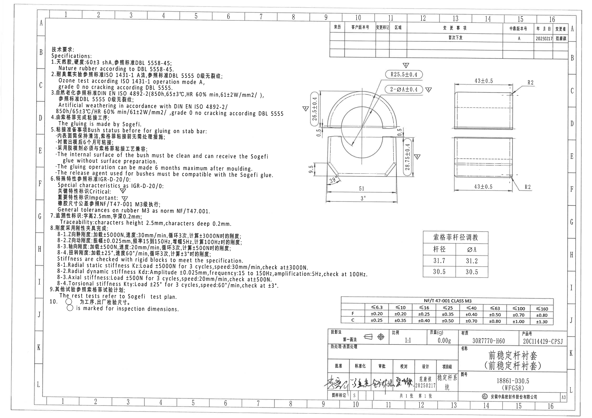
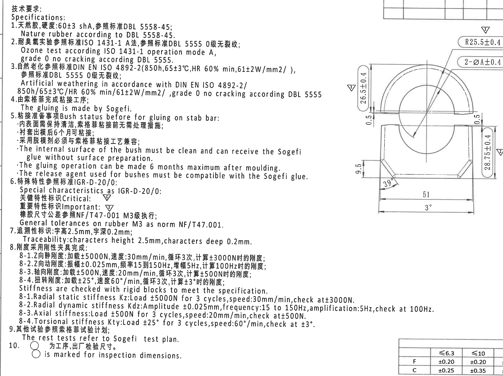
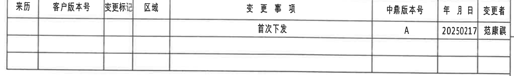
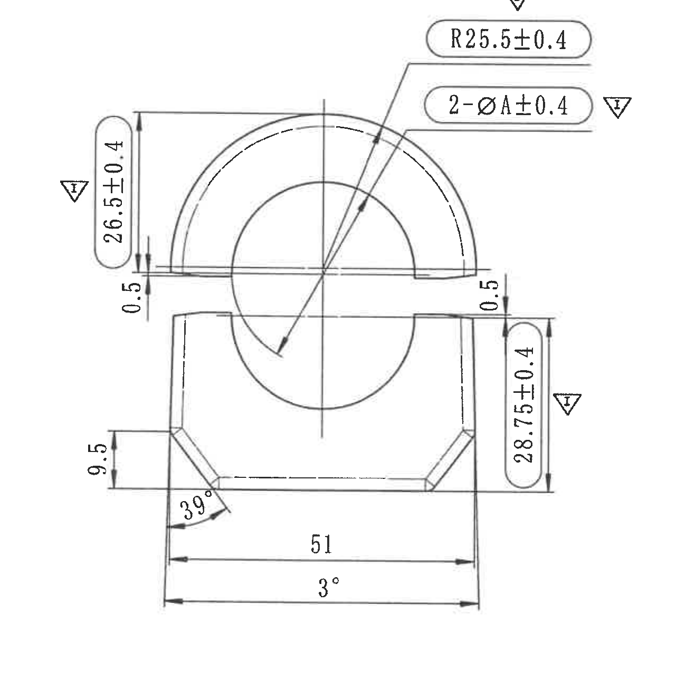
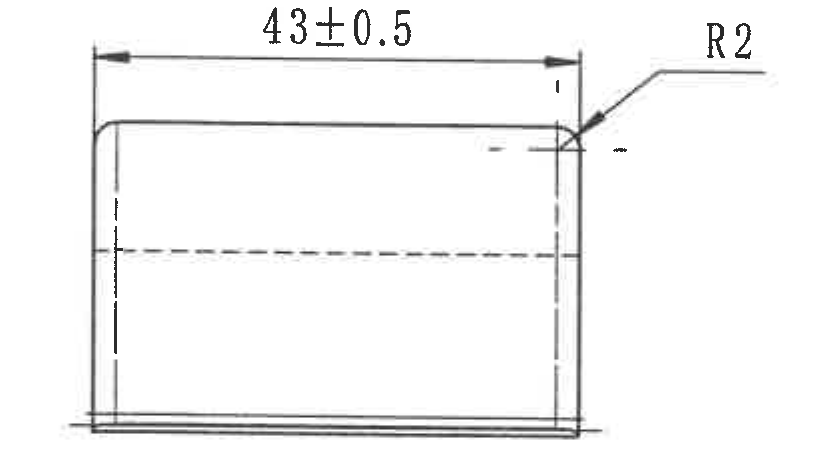
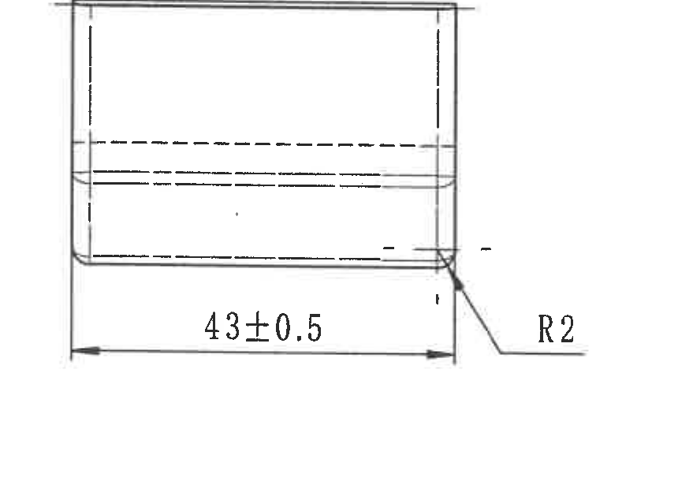
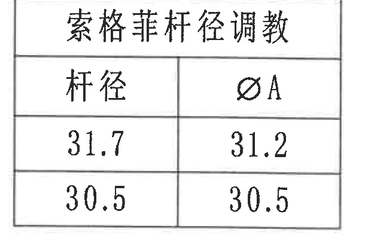
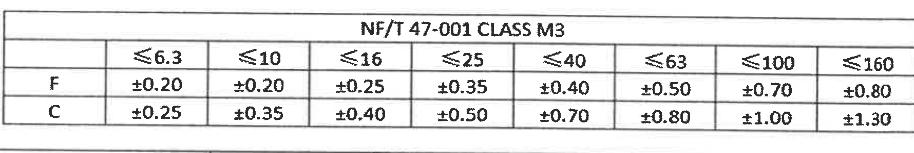
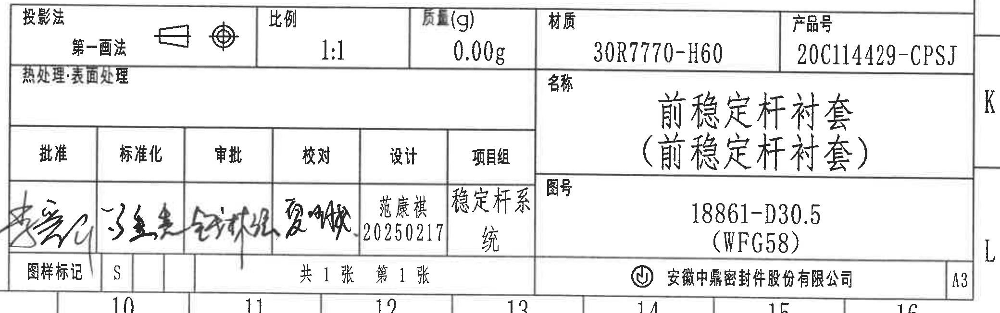

# 20C114429 内容识别与裁切提取
## 整页渲染

| 项目 | 数值 |
|---|---|
| 页码 | 1 |
| 整页 PNG | outputs/20C114429_assets/images/page_1.png |
| 像素尺寸 | 4959 x 3505 |
| bbox | [0, 0, 4959, 3505] |
## object_1 - 技术要求 / Specifications

- 原图位置/视图名称: 技术要求 / Specifications，page 1，bbox [360, 360, 3510, 2720]
- 边界归属说明: 左侧 B-J 区域的技术要求说明。右缘因原图文字和主视图距离近，裁切内可见少量主视图尺寸线片段；这些片段不归属于 NOTES，尺寸归属在 object_3 主视图中提取。
### 原图文本还原
```text
技术要求:
Specifications:
1. 天然胶,硬度:60±3 shA,参照标准DBL 5558-45;
   Nature rubber according to DBL 5558-45.
2. 耐臭氧实验参照标准ISO 1431-1 A法,参照标准DBL 5555 0级无裂纹;
   Ozone test according ISO 1431-1 operation mode A,
   grade 0 no cracking according DBL 5555.
3. 自然老化参照标准DIN EN ISO 4892-2(850h,65±3°C,HR 60% min,61±2W/mm2/ ),
   参照标准DBL 5555 0级无裂纹;
   Artificial weathering in accordance with DIN EN ISO 4892-2/
   850h/65±3°C/HR 60% min/61±2W/mm2/, grade 0 no cracking according DBL 5555
4. 由索格菲完成粘接工序;
   The gluing is made by Sogefi.
5. 粘接准备事项Bush status before for gluing on stab bar:
   ·内表面需保持清洁,索格菲粘接前无需处理措施;
   ·衬套出模后6个月可粘接;
   ·采用脱模剂必须与索格菲粘接工艺兼容;
   ·The internal surface of the bush must be clean and can receive the Sogefi
    glue without surface preparation.
   ·The gluing operation can be made 6 months maximum after moulding.
   ·The release agent used for bushes must be compatible with the Sogefi glue.
6. 特殊特性参照标准IGR-D-20/0:
   Special characteristics as IGR-D-20/0:
   关键特性标识Critical: triangle C
   重要特性标识Important: triangle I
   橡胶尺寸公差参照NF/T47-001 M3级执行;
   General tolerances on rubber M3 as norm NF/T47.001.
7. 追溯性标识:字高2.5mm,字深0.2mm;
   Traceability: characters height 2.5mm, characters deep 0.2mm.
8. 刚度采用刚性夹具完成:
   8-1. Z向静刚度:加载±5000N,速度:30mm/min,循环3次,计算±3000N时的刚度;
   8-2. Z向动刚度:振幅±0.025mm,频率15到150Hz,增幅5Hz,计算100Hz时的刚度;
   8-3. 轴向刚度:加载±500N,速度:20mm/min,循环3次,计算±500N时的刚度;
   8-4. 扭转刚度:加载±25°,速度60°/min,循环3次,计算±3°时的刚度;
   Stiffness are checked with rigid blocks to meet the specification.
   8-1. Radial static stiffness Kz: Load ±5000N for 3 cycles, speed:30mm/min, check at ±3000N.
   8-2. Radial dynamic stiffness Kdz: Amplitude ±0.025mm, frequency:15 to 150Hz, amplification:5Hz, check at 100Hz.
   8-3. Axial stiffness: Load ±500N for 3 cycles, speed:20mm/min, check at ±500N.
   8-4. Torsional stiffness Kty: Load ±25° for 3 cycles, speed:60°/min, check at ±3°.
9. 其他试验参照索格菲试验计划;
   The rest tests refer to Sogefi test plan.
10. circle mark 为工序、出厂检验尺寸。
    circle mark is marked for inspection dimensions.
```
### 提取表格
| 提取项 | 原图数值或文本 | 含义说明 |
|---|---|---|
| 材料与硬度 | 天然胶；60±3 shA；DBL 5558-45 | 规定衬套材料为天然橡胶，硬度为 60±3 shA，材料标准按 DBL 5558-45。 |
| 耐臭氧实验 | ISO 1431-1 A法；DBL 5555 0级无裂纹 | 耐臭氧按 ISO 1431-1 operation mode A，结果要求 DBL 5555 0 级无裂纹。 |
| 自然老化 | DIN EN ISO 4892-2；850h；65±3°C；HR 60% min；61±2W/mm2；DBL 5555 0级无裂纹 | 人工/自然老化条件及合格等级。 |
| 粘接工序 | The gluing is made by Sogefi. | 粘接由 Sogefi 完成。 |
| 粘接准备 | 内表面清洁；无需表面处理；出模后最多6个月；脱模剂与 Sogefi 胶兼容 | 规定粘接前衬套状态和工艺兼容性。 |
| 特殊特性标识 | Critical: triangle C；Important: triangle I | 说明图中三角 C 为关键特性，三角 I 为重要特性；主视图多处尺寸带 I 标识。 |
| 一般公差 | NF/T47-001 M3 | 橡胶尺寸未注公差按 NF/T47-001 M3，详见 object_7。 |
| 追溯性标识 | 字高 2.5mm；字深 0.2mm | 规定追溯字符尺寸。 |
| Z向静刚度 | 加载±5000N；30mm/min；循环3次；计算±3000N | 刚性夹具测试静刚度 Kz。 |
| Z向动刚度 | 振幅±0.025mm；15-150Hz；增幅5Hz；计算100Hz | 刚性夹具测试动态刚度 Kdz。 |
| 轴向刚度 | 加载±500N；20mm/min；循环3次；计算±500N | 轴向刚度测试条件。 |
| 扭转刚度 | 加载±25°；60°/min；循环3次；计算±3° | 扭转刚度 Kty 测试条件。 |
| 其他试验 | The rest tests refer to Sogefi test plan. | 其他未列试验按 Sogefi 试验计划。 |
| 检验尺寸标记 | 圆圈标记为工序、出厂检验尺寸 | 圆圈符号表示 inspection dimensions。 |

## object_2 - 修订履历表 / 变更事项表

- 原图位置/视图名称: 修订履历表 / 变更事项表，page 1，bbox [2735, 200, 4775, 505]
- 边界归属说明: 图纸上方 A-B 区域的变更记录表。表内一条有效记录为首次下发，中鼎版本号 A，日期 20250217，变更者范康祺；其余行为空白。
### 原表还原
| 来历 | 客户版本号 | 变更标记 | 区域 | 变更事项 | 中鼎版本号 | 年月日 | 变更者 |
|---|---|---|---|---|---|---|---|
|  |  |  |  | 首次下发 | A | 20250217 | 范康祺 |
|  |  |  |  |  |  |  |  |
|  |  |  |  |  |  |  |  |
### 提取表格
| 提取项 | 原图数值或文本 | 含义说明 |
|---|---|---|
| 表头 | 来历 / 客户版本号 / 变更标记 / 区域 / 变更事项 / 中鼎版本号 / 年月日 / 变更者 | 修订履历字段。 |
| 变更事项 | 首次下发 | 该版本为首次下发。 |
| 中鼎版本号 | A | 本次下发版本。 |
| 年月日 | 20250217 | 变更记录日期。 |
| 变更者 | 范康祺 | 变更记录责任人。 |

## object_3 - 主视图 / 第一画法正面加工视图

- 原图位置/视图名称: 主视图 / 第一画法正面加工视图，page 1，bbox [2420, 550, 3720, 1870]
- 边界归属说明: 右中部 C-F 区域的主视图。该对象只提取主视图内尺寸；右侧两个侧视图的 43±0.5 与 R2 不归入本对象。
### 提取表格
| 提取项 | 原图数值或文本 | 含义说明 |
|---|---|---|
| 重要特性尺寸 | 26.5±0.4 | 左侧竖向尺寸，带三角 I，表示重要特性；包含完整尺寸线、箭头和文字。 |
| 局部厚度 | 0.5 | 左侧上唇/台阶厚度。 |
| 圆弧半径 | R25.5±0.4 | 上方圆弧半径尺寸，带三角 I；R 表示半径，±0.4 为公差。 |
| 两处直径 A | 2-ØA±0.4 | 数量前缀 2 表示两处；Ø 为直径；A 值由杆径调教表 object_6 给出；带三角 I。 |
| 局部厚度 | 0.5 | 右侧上唇/台阶厚度。 |
| 重要特性总高度 | 28.75±0.4 | 右侧竖向总高度/到下基准边尺寸，带三角 I。 |
| 局部高度 | 9.5 | 左下局部台阶高度。 |
| 斜边角度 | 39° | 左下倒角/斜边角度。 |
| 底部宽度 | 51 | 底部水平宽度尺寸。 |
| 底部角度 | 3° | 底部外侧斜度/角度尺寸。 |
| 中心/隐藏线 | 中心线、虚线轮廓 | 表示圆心、对称或内部不可见轮廓。 |
| 特性标识 | 三角 I | 主视图中的 26.5±0.4、R25.5±0.4、2-ØA±0.4、28.75±0.4 均邻近 Important 标识。 |

## object_4 - 上侧视图 / 端部侧向加工视图

- 原图位置/视图名称: 上侧视图 / 端部侧向加工视图，page 1，bbox [3715, 650, 4535, 1115]
- 边界归属说明: 右上 C-D 区域的侧视图。该对象独立于下方侧视图；只提取顶部侧视图中的 43±0.5 与右上 R2。
### 提取表格
| 提取项 | 原图数值或文本 | 含义说明 |
|---|---|---|
| 水平总长 | 43±0.5 | 上侧视图顶部水平长度，±0.5 为公差。 |
| 圆角半径 | R2 | 右上角圆角半径，引线完整指向角部。 |
| 隐藏线 | 虚线 | 表示不可见内部边界。 |

## object_5 - 下侧视图 / 端部侧向加工视图

- 原图位置/视图名称: 下侧视图 / 端部侧向加工视图，page 1，bbox [3715, 1150, 4575, 1770]
- 边界归属说明: 右中 E-F 区域的下侧视图。该对象独立于上方侧视图；只提取下侧视图中的 43±0.5 与右下 R2。
### 提取表格
| 提取项 | 原图数值或文本 | 含义说明 |
|---|---|---|
| 水平总长 | 43±0.5 | 下侧视图底部水平长度，±0.5 为公差。 |
| 圆角半径 | R2 | 右下角圆角半径，引线完整指向角部。 |
| 隐藏线 | 虚线 | 表示不可见内部边界。 |

## object_6 - 索格菲杆径调教表

- 原图位置/视图名称: 索格菲杆径调教表，page 1，bbox [3520, 1945, 4140, 2345]
- 边界归属说明: 右中 H-I 区域的杆径调教表。ØA 与主视图中的 2-ØA±0.4 对应，用于不同杆径时选取直径 A。
### 原表还原
| 杆径 | ØA |
|---|---|
| 31.7 | 31.2 |
| 30.5 | 30.5 |
### 提取表格
| 提取项 | 原图数值或文本 | 含义说明 |
|---|---|---|
| 表题 | 索格菲杆径调教 | Sogefi 杆径调教数据表。 |
| 杆径对应 ØA | 31.7 -> 31.2 | 当杆径为 31.7 时，主视图 2-ØA±0.4 中 A 取 31.2。 |
| 杆径对应 ØA | 30.5 -> 30.5 | 当杆径为 30.5 时，主视图 2-ØA±0.4 中 A 取 30.5。 |

## object_7 - NF/T 47-001 CLASS M3 橡胶一般公差表

- 原图位置/视图名称: NF/T 47-001 CLASS M3 橡胶一般公差表，page 1，bbox [2850, 2465, 4630, 2765]
- 边界归属说明: 右下 J 区域标题栏上方的橡胶一般公差表，与 NOTES 第 6 条“橡胶尺寸公差参照 NF/T47-001 M3级执行”对应。
### 原表还原
| NF/T 47-001 CLASS M3 | ≤6.3 | ≤10 | ≤16 | ≤25 | ≤40 | ≤63 | ≤100 | ≤160 |
|---|---|---|---|---|---|---|---|---|
| F | ±0.20 | ±0.20 | ±0.25 | ±0.35 | ±0.40 | ±0.50 | ±0.70 | ±0.80 |
| C | ±0.25 | ±0.35 | ±0.40 | ±0.50 | ±0.70 | ±0.80 | ±1.00 | ±1.30 |
### 提取表格
| 提取项 | 原图数值或文本 | 含义说明 |
|---|---|---|
| 标准/等级 | NF/T 47-001 CLASS M3 | 橡胶一般公差标准和等级。 |
| F 行公差 | ≤6.3:±0.20；≤10:±0.20；≤16:±0.25；≤25:±0.35；≤40:±0.40；≤63:±0.50；≤100:±0.70；≤160:±0.80 | F 级对应各尺寸范围的公差。 |
| C 行公差 | ≤6.3:±0.25；≤10:±0.35；≤16:±0.40；≤25:±0.50；≤40:±0.70；≤63:±0.80；≤100:±1.00；≤160:±1.30 | C 级对应各尺寸范围的公差。 |

## object_8 - 标题栏 / 图纸信息栏

- 原图位置/视图名称: 标题栏 / 图纸信息栏，page 1，bbox [2725, 2748, 4805, 3400]
- 边界归属说明: 右下 K-L 区域标题栏。手写签名无法可靠转写为姓名，保留为“手写签名”；印刷字段按可辨文字提取。
### 提取表格
| 提取项 | 原图数值或文本 | 含义说明 |
|---|---|---|
| 投影法 | 第一画法 | 标题栏投影方式。 |
| 比例 | 1:1 | 图样比例。 |
| 质量(g) | 0.00g | 标题栏质量字段。 |
| 材质 | 30R7770-H60 | 材料牌号字段。 |
| 产品号 | 20C114429-CPSJ | 产品编号。 |
| 热处理/表面处理 | 热处理: 表面处理 | 标题栏工艺处理字段。 |
| 名称 | 前稳定杆衬套（前稳定杆衬套） | 零件名称。 |
| 图号 | 18861-D30.5 (WFG58) | 图纸/零件图号。 |
| 批准 | 手写签名 | 签名为手写，未可靠识别为具体姓名。 |
| 标准化 | 手写签名 | 签名为手写，未可靠识别为具体姓名。 |
| 审批 | 手写签名 | 签名为手写，未可靠识别为具体姓名。 |
| 校对 | 手写签名 | 签名为手写，未可靠识别为具体姓名。 |
| 设计 | 范康祺 20250217 | 设计人员和日期。 |
| 项目组 | 稳定杆系统 | 项目组名称。 |
| 图样标记 | S | 图样标记字段。 |
| 张数 | 共1张 第1张 | 总张数和当前页。 |
| 公司 | 安徽中鼎密封件股份有限公司 | 出图公司。 |
| 图幅 | A3 | 图幅规格。 |

## 裁切检查记录
| 对象 | 检查结果 | 边界与归属确认 |
|---|---|---|
| object_1 NOTES | 文字完整；为保留 NOTES 长英文行，右缘包含少量主视图边缘片段。 | 主视图片段不在 NOTES 中提取；其尺寸归 object_3。 |
| object_2 修订履历表 | 表格外框、列线、表头和有效记录完整。 | 未带入下方视图；上方坐标格已尽量排除。 |
| object_3 主视图 | 尺寸线、箭头、引线、三角 I 标识和文字完整。 | 右侧未混入 object_4/object_5 侧视图；侧视图尺寸不归入主视图。 |
| object_4 上侧视图 | 43±0.5 尺寸线、箭头和 R2 引线完整。 | 下方侧视图仅有极少上边轮廓接近边界，不提取；当前对象只取上侧视图。 |
| object_5 下侧视图 | 43±0.5 尺寸线、箭头和 R2 引线完整。 | 上侧视图不归入本对象。 |
| object_6 杆径调教表 | 表题、表头、两行数据和边框完整。 | 独立表格，未混入公差表或主视图尺寸。 |
| object_7 NF/T47-001 表 | 标题、表头、F/C 两行和所有数值完整。 | 下方标题栏已排除，标题栏字段不归入本对象。 |
| object_8 标题栏 | 标题栏主要字段、签名栏、公司、图幅完整。 | 上方公差表不归入标题栏；手写签名不臆造姓名。 |

