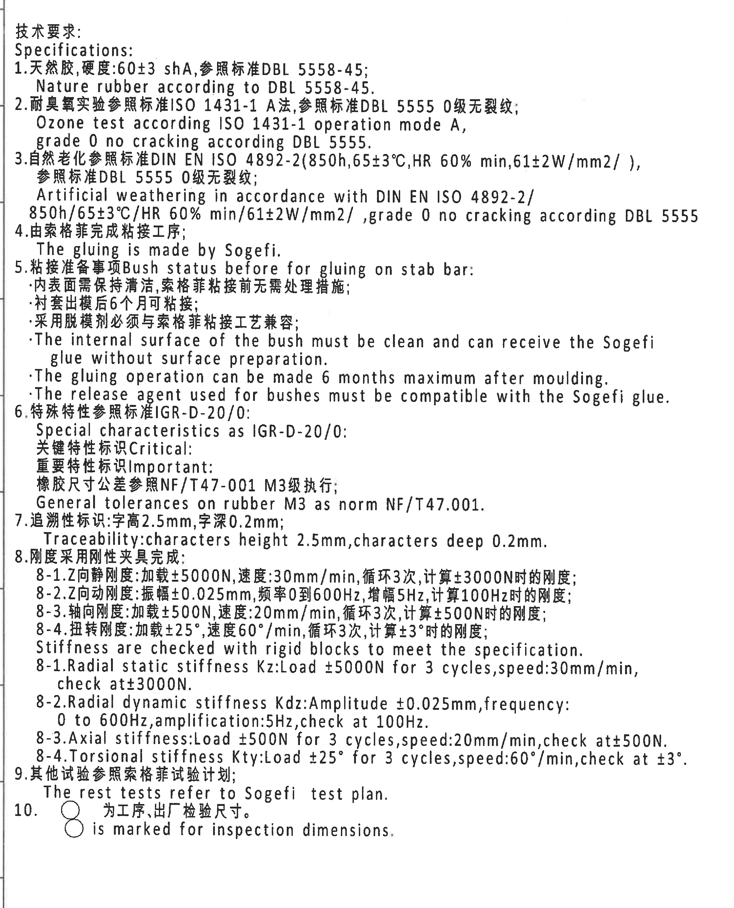
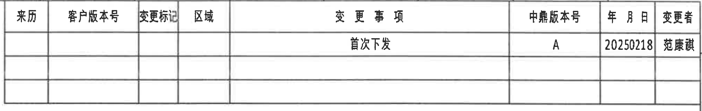
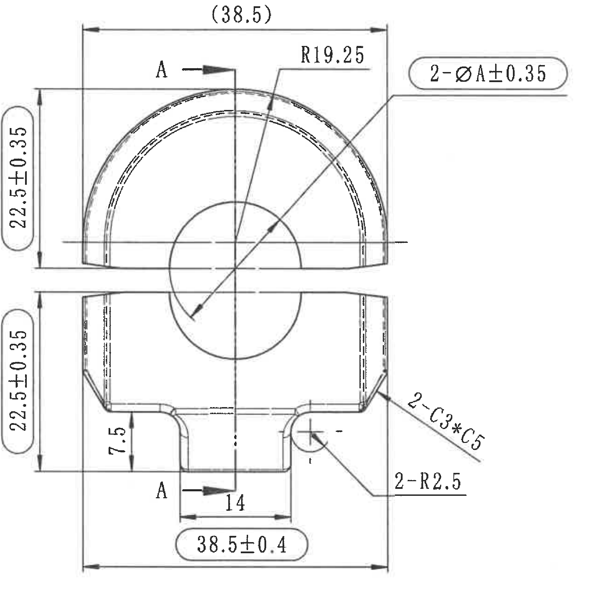
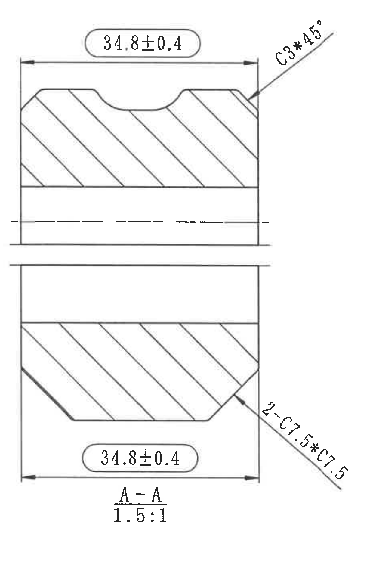
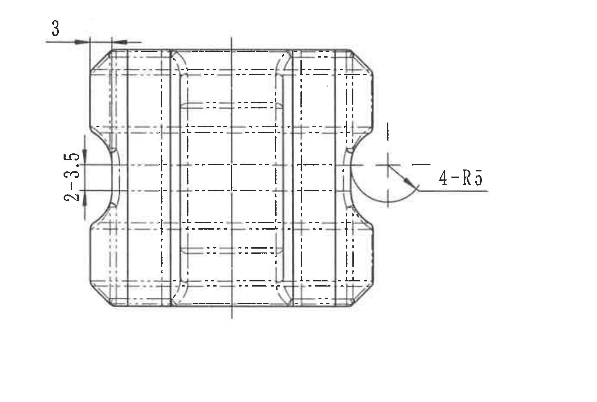
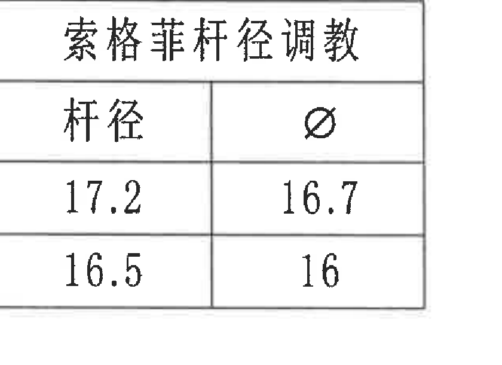
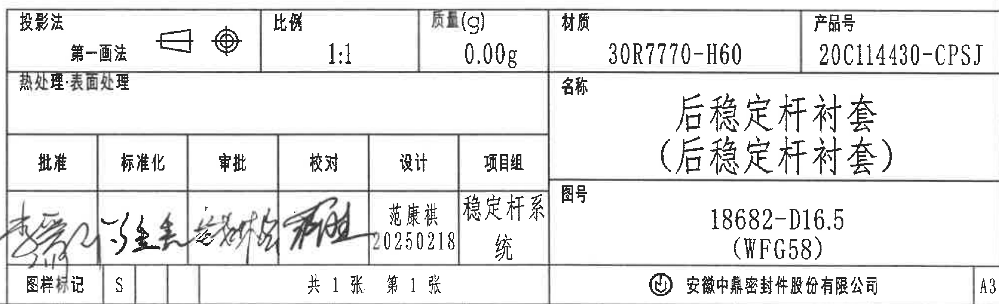

# 20C114430 内容识别

整页渲染图：`20C114430_assets/images/page_1.png`，页面 1，PNG 尺寸 `6612 x 4673`。以下对象按原图区域拆分，bbox 坐标均为整页 PNG 像素坐标 `[x1, y1, x2, y2]`。

## object_1 - NOTES / 技术要求

原图位置/视图名称：页面 1 左侧技术要求区，bbox `[480, 360, 3270, 3810]`，object_kind: `notes`。

| 提取项 | 原图数值或文本 | 含义说明 |
|---|---|---|
| 标题 | 技术要求: Specifications: | 技术要求/规范说明区。 |
| 1 | 天然胶,硬度:60±3 shA,参照标准DBL 5558-45; Nature rubber according to DBL 5558-45. | 材料为天然胶，硬度 `60±3 shA`，按 `DBL 5558-45`。 |
| 2 | 耐臭氧实验参照标准ISO 1431-1 A法,参照标准DBL 5555 0级无裂纹; Ozone test according ISO 1431-1 operation mode A, grade 0 no cracking according DBL 5555. | 臭氧试验按 `ISO 1431-1 A`；判定为 `DBL 5555` 0 级无裂纹。 |
| 3 | 自然老化参照标准DIN EN ISO 4892-2(850h,65±3°C,HR 60% min,61±2W/mm2/ ), 参照标准DBL 5555 0级无裂纹; Artificial weathering in accordance with DIN EN ISO 4892-2/ 850h/65±3°C/HR 60% min/61±2W/mm2/ ,grade 0 no cracking according DBL 5555 | 人工老化条件：`850h`、`65±3°C`、`HR 60% min`、`61±2W/mm2/`；按 `DBL 5555` 0 级无裂纹。 |
| 4 | 由索格菲完成粘接工序; The gluing is made by Sogefi. | 粘接工序由 Sogefi 完成。 |
| 5 | 粘接准备事项Bush status before for gluing on stab bar: ·内表面需保持清洁,索格菲粘接前无需处理措施; ·衬套出模后6个月可粘接; ·采用脱模剂必须与索格菲粘接工艺兼容; ·The internal surface of the bush must be clean and can receive the Sogefi glue without surface preparation. ·The gluing operation can be made 6 months maximum after moulding. ·The release agent used for bushes must be compatible with the Sogefi glue. | 稳定杆粘接前衬套状态要求：内表面清洁、出模后 6 个月内可粘接、脱模剂需与 Sogefi 胶兼容。 |
| 6 | 特殊特性参照标准IGR-D-20/0: Special characteristics as IGR-D-20/0: 关键特性标识Critical: 重要特性标识Important: 橡胶尺寸公差参照NF/T47-001 M3级执行; General tolerances on rubber M3 as norm NF/T47.001. | 特殊特性按 `IGR-D-20/0`；橡胶通用尺寸公差按 `NF/T47-001`/`NF/T47.001` M3 级。 |
| 7 | 追溯性标识:字高2.5mm,字深0.2mm; Traceability:characters height 2.5mm,characters deep 0.2mm. | 追溯性字符高度 `2.5mm`、深度 `0.2mm`。 |
| 8 | 刚度采用刚性夹具完成: 8-1.Z向静刚度:加载±5000N,速度:30mm/min,循环3次,计算±3000N时的刚度; 8-2.Z向动刚度:振幅±0.025mm,频率0到600Hz,增幅5Hz,计算100Hz时的刚度; 8-3.轴向刚度:加载±500N,速度:20mm/min,循环3次,计算±500N时的刚度; 8-4.扭转刚度:加载±25°,速度60°/min,循环3次,计算±3°时的刚度; Stiffness are checked with rigid blocks to meet the specification. 8-1.Radial static stiffness Kz:Load ±5000N for 3 cycles,speed:30mm/min,check at±3000N. 8-2.Radial dynamic stiffness Kdz:Amplitude ±0.025mm,frequency:0 to 600Hz,amplification:5Hz,check at 100Hz. 8-3.Axial stiffness:Load ±500N for 3 cycles,speed:20mm/min,check at±500N. 8-4.Torsional stiffness Kty:Load ±25° for 3 cycles,speed:60°/min,check at ±3°. | 刚度测试要求：径向静刚度 Kz、径向动刚度 Kdz、轴向刚度、扭转刚度 Kty 的载荷/频率/速度/循环和计算点。 |
| 9 | 其他试验参照索格菲试验计划; The rest tests refer to Sogefi test plan. | 其他试验按 Sogefi 试验计划。 |
| 10 | ○ 为工序,出厂检验尺寸。 ○ is marked for inspection dimensions. | 圆圈标识表示工序/出厂检验尺寸。 |

边界归属说明：该裁切只提取左侧 NOTES 文本。右侧主视图尺寸、表格和标题栏不归入本对象；裁切右边界留到第 3 条英文长行末尾后即停止，未提取任何主视图尺寸。

## object_2 - 修订履历表

原图位置/视图名称：页面 1 顶部右侧修订履历表，bbox `[3660, 210, 6350, 640]`，object_kind: `table`。

原表行列还原：

| 来历 | 客户版本号 | 变更标记 | 区域 | 变更事项 | 中鼎版本号 | 年月日 | 变更者 |
|---|---|---|---|---|---|---|---|
|  |  |  |  | 首次下发 | A | 20250218 | 范康祺 |
|  |  |  |  |  |  |  |  |
|  |  |  |  |  |  |  |  |

| 提取项 | 原图数值或文本 | 含义说明 |
|---|---|---|
| 表头 | 来历 / 客户版本号 / 变更标记 / 区域 / 变更事项 / 中鼎版本号 / 年月日 / 变更者 | 修订履历表字段。 |
| 修订记录 1 | 变更事项: 首次下发; 中鼎版本号: A; 年月日: 20250218; 变更者: 范康祺 | 首次发布记录，版本 A，日期 2025-02-18。 |
| 空白行 | 第 2、3 行为空 | 原表保留空白修订行。 |

边界归属说明：裁切包含完整表格外框和所有列线、行线、表头及首行记录；右侧图框坐标字母已排除，未并入表格内容。

## object_3 - 主视图 / 加工视图

原图位置/视图名称：页面 1 中上部主视图，bbox `[3300, 690, 5010, 2400]`，object_kind: `view`。

| 提取项 | 原图数值或文本 | 含义说明 |
|---|---|---|
| 参考尺寸 | `(38.5)` | 括号内参考尺寸，位于主视图顶部水平尺寸线上，表示上部外形宽度参考值；因带括号，作为参考尺寸说明，不作为直接控制公差尺寸。 |
| 上部高度 | `22.5±0.35` | 左侧上半部分竖向尺寸，带公差 `±0.35`。 |
| 下部高度 | `22.5±0.35` | 左侧下半部分竖向尺寸，带公差 `±0.35`；与上部高度分别标注，未合并。 |
| 圆弧半径 | `R19.25` | 主视图上部外圆弧/拱形轮廓半径。 |
| 直径/数量前缀 | `2-ØA±0.35` | 两处直径 A，公差 `±0.35`；A 为图中以字母保留的直径参数，原图未在主视图内给出固定数值。 |
| 剖切标识 | `A`、`A` | 上下两个 A 箭头为 A-A 剖面切割方向和剖面索引，归属到 A-A 剖视图 object_4。 |
| 局部高度 | `7.5` | 主视图底部左侧竖向台阶/凸台高度尺寸。 |
| 底部槽宽 | `14` | 主视图底部中央槽/颈部水平宽度。 |
| 总宽/检验尺寸 | `38.5±0.4` | 主视图底部总体宽度，带公差 `±0.4`，标注框显示为重点/检验关注尺寸。 |
| 倒角/数量前缀/星号 | `2-C3*C5` | 两处倒角，按原图保留 `*` 符号，含义为 C3 与 C5 的倒角组合。 |
| 圆角/数量前缀 | `2-R2.5` | 两处 R2.5 圆角，位于底部内侧过渡位置。 |
| 总高度 | 未见单独总高度尺寸 | 当前主视图未标出单一总高度；图中以两处 `22.5±0.35` 分别表达上下高度。 |
| T 编号 | 未见 | 当前主视图未出现 T 编号。 |
| 弧向尺寸 | 未见弧长类尺寸 | 当前主视图有半径 `R19.25` 和 `R2.5`，未见弧长/弧向尺寸标注。 |

边界归属说明：顶部 `(38.5)`、左侧两处 `22.5±0.35`、右侧 `2-ØA±0.35`、`2-C3*C5`、`2-R2.5` 均由引出线或尺寸线指向主视图轮廓，归入主视图。右侧 A-A 剖视图未混入；下方底视/局部视图的 `3`、`2-3.5`、`4-R5` 不归入本对象。

## object_4 - A-A 剖视图

原图位置/视图名称：页面 1 右上部 A-A 剖视图，bbox `[5000, 650, 6250, 2600]`，object_kind: `section`。

| 提取项 | 原图数值或文本 | 含义说明 |
|---|---|---|
| 视图名称 | `A-A` | 由主视图 A-A 剖切箭头引出的剖面视图。 |
| 比例 | `1.5:1` | A-A 剖视图局部放大比例。 |
| 上部宽度 | `34.8±0.4` | A-A 剖视图上半部分水平宽度，带公差 `±0.4`，标注框显示为重点/检验关注尺寸。 |
| 下部宽度 | `34.8±0.4` | A-A 剖视图下半部分水平宽度，带公差 `±0.4`，与上部宽度分别标注。 |
| 倒角/角度/星号 | `C3*45°` | 上部右端倒角，按原图保留 `*`，角度为 `45°`。 |
| 倒角/数量前缀/星号 | `2-C7.5*C7.5` | 两处倒角，按原图保留 `*`，倒角尺寸为 C7.5 与 C7.5。 |
| 中心线/断开线 | 剖视图中部断开表示 | 中间空白断开表示长向省略，不是独立尺寸。 |
| T 编号 | 未见 | 当前剖视图未出现 T 编号。 |
| 弧向尺寸 | 未见 | 当前剖视图未见弧长/弧向尺寸；倒角和宽度为主要尺寸信息。 |

边界归属说明：`34.8±0.4` 两处、`C3*45°`、`2-C7.5*C7.5` 的箭头均指向 A-A 剖面轮廓，归入本剖视图；主视图右侧引出线和图框坐标栏未作为本对象内容提取。

## object_5 - 下方局部/底视图

原图位置/视图名称：页面 1 中下部局部/底视图，bbox `[3260, 2360, 5110, 3610]`，object_kind: `detail`。

| 提取项 | 原图数值或文本 | 含义说明 |
|---|---|---|
| 顶部局部尺寸 | `3` | 左上角水平尺寸，箭头指向上边缘小台阶/边距。 |
| 左侧数量尺寸 | `2-3.5` | 左侧竖向尺寸，数量前缀 `2-` 表示两处 3.5 尺寸。 |
| 圆角/数量前缀 | `4-R5` | 右侧引出标注，四处 R5 圆角。 |
| 隐线/中心线 | 多条虚线与中心线 | 表示内部结构和中心位置，不是独立数值尺寸。 |
| T 编号 | 未见 | 当前局部/底视图未出现 T 编号。 |
| 弧向尺寸 | 未见弧长类尺寸 | 当前视图仅标出半径 `4-R5`，未见弧长/弧向尺寸。 |

边界归属说明：`3`、`2-3.5`、`4-R5` 均由尺寸线或引出线连接到下方局部/底视图轮廓，归入 object_5；主视图的 `38.5±0.4`、`2-R2.5` 不归入本对象。

## object_6 - 索格菲杆径调教表

原图位置/视图名称：页面 1 右中部小表，bbox `[5420, 2840, 6260, 3450]`，object_kind: `table`。

原表行列还原：

| 索格菲杆径调教 |  |
|---|---|
| 杆径 | Ø |
| 17.2 | 16.7 |
| 16.5 | 16 |

| 提取项 | 原图数值或文本 | 含义说明 |
|---|---|---|
| 表题 | 索格菲杆径调教 | Sogefi 杆径与对应内径/直径调整表。 |
| 表头 | 杆径 / Ø | 左列为杆径，右列为对应 Ø 值。 |
| 数据 1 | 杆径 `17.2` -> Ø `16.7` | 杆径 17.2 对应 Ø 16.7。 |
| 数据 2 | 杆径 `16.5` -> Ø `16` | 杆径 16.5 对应 Ø 16。 |

边界归属说明：裁切包含小表完整外框、表题、表头和两行数据；周围视图与标题栏未混入。

## object_7 - 标题栏

原图位置/视图名称：页面 1 右下标题栏，bbox `[3660, 3625, 6350, 4445]`，object_kind: `title_block`。

标题栏表格还原：

| 投影法 | 比例 | 质量(g) | 材质 | 产品号 |
|---|---|---|---|---|
| 第一画法；投影符号见原图 | 1:1 | 0.00g | 30R7770-H60 | 20C114430-CPSJ |

| 热处理:表面处理 | 名称 |
|---|---|
|  | 后稳定杆衬套 (后稳定杆衬套) |

| 批准 | 标准化 | 审批 | 校对 | 设计 | 项目组 |
|---|---|---|---|---|---|
| 手写签名 | 手写签名 | 手写签名 | 手写签名 | 范康祺 20250218 | 稳定杆系统 |

| 图号 | 图样标记 | 张数 | 公司/幅面 |
|---|---|---|---|
| 18682-D16.5 (WFG58) | S | 共 1 张 第 1 张 | 安徽中鼎密封件股份有限公司 / A3 |

| 提取项 | 原图数值或文本 | 含义说明 |
|---|---|---|
| 投影法 | 第一画法，带第一角法投影符号 | 工程图投影方式。 |
| 比例 | `1:1` | 标题栏总图比例。 |
| 质量 | `0.00g` | 标题栏质量字段。 |
| 材质 | `30R7770-H60` | 材料/胶料牌号。 |
| 产品号 | `20C114430-CPSJ` | 产品编号。 |
| 热处理/表面处理 | `热处理:表面处理` | 标题栏该字段未见单独填写值，按原图文字保留。 |
| 名称 | `后稳定杆衬套` `(后稳定杆衬套)` | 零件名称及括号内重复名称。 |
| 图号 | `18682-D16.5` `(WFG58)` | 图号/关联编号。 |
| 设计 | `范康祺` / `20250218` | 设计人及日期。 |
| 项目组 | `稳定杆系统` | 项目组名称。 |
| 图样标记 | `S` | 图样标记字段。 |
| 张数 | `共 1 张 第 1 张` | 图纸总张数和当前页。 |
| 公司 | `安徽中鼎密封件股份有限公司` | 出图公司。 |
| 幅面 | `A3` | 图纸幅面。 |

边界归属说明：裁切覆盖标题栏本体，包括投影法、比例、质量、材质、产品号、名称、图号、审批签字区、公司和 A3 幅面。底部坐标数字和右侧图框坐标字母不作为标题栏字段提取；标题栏右下的 `A3` 属标题栏幅面字段，已保留。

## 裁切检查记录

| 对象 | 图片路径 | 检查结果 | 边界检查说明 |
|---|---|---|---|
| object_1 | `20C114430_assets/images/object_1.png` | 完整 | NOTES 文字 1-10 项完整；右边界未提取主视图尺寸。 |
| object_2 | `20C114430_assets/images/object_2.png` | 完整 | 修订履历表外框、表头、首行记录和空白行完整；图框坐标字母已排除。 |
| object_3 | `20C114430_assets/images/object_3.png` | 完整 | 主视图所有尺寸线、箭头、括号参考尺寸 `(38.5)`、文字 `2-ØA±0.35`、`2-C3*C5`、`2-R2.5` 完整；未混入下方局部视图尺寸。 |
| object_4 | `20C114430_assets/images/object_4.png` | 完整 | A-A 剖视图、剖面线、`34.8±0.4` 两处、`C3*45°`、`2-C7.5*C7.5`、`A-A 1.5:1` 完整；未提取图框坐标栏。 |
| object_5 | `20C114430_assets/images/object_5.png` | 完整 | 下方局部/底视图本体、`3`、`2-3.5`、`4-R5` 尺寸线和文字完整。 |
| object_6 | `20C114430_assets/images/object_6.png` | 完整 | 小表外框、表题、表头和两行数据完整。 |
| object_7 | `20C114430_assets/images/object_7.png` | 完整 | 标题栏表格、文字字段、签字区、公司名和 A3 字段完整；图框坐标数字/字母不作为字段提取。 |
