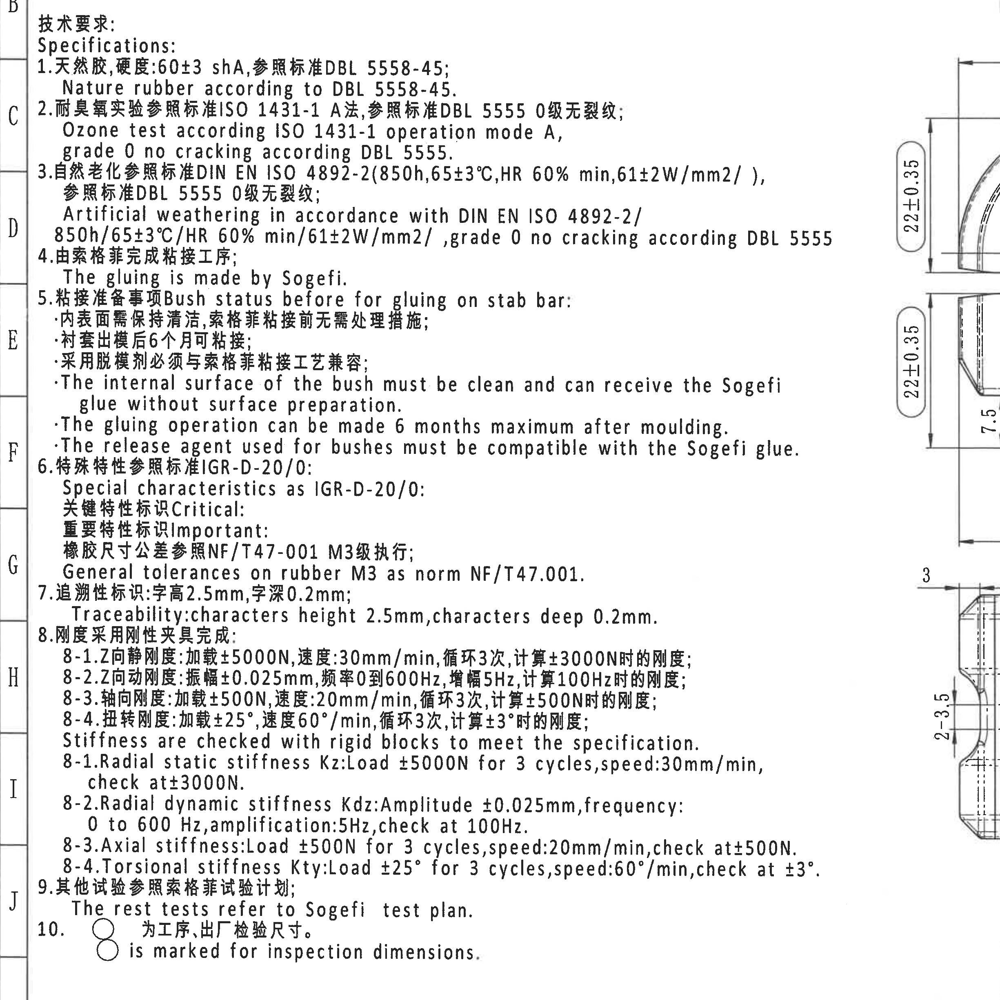
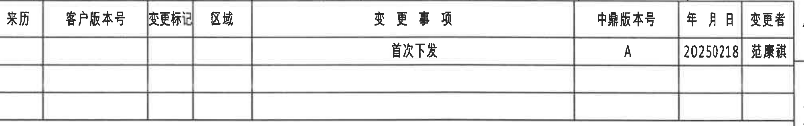
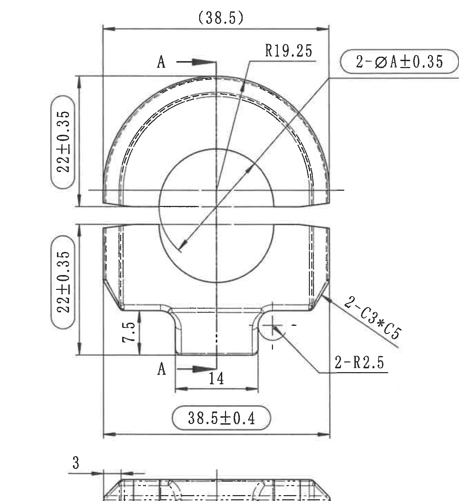
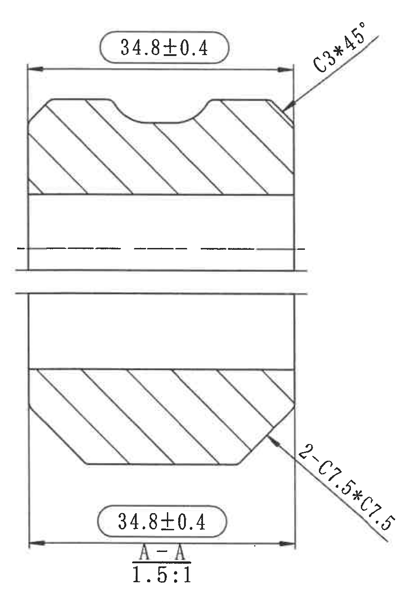
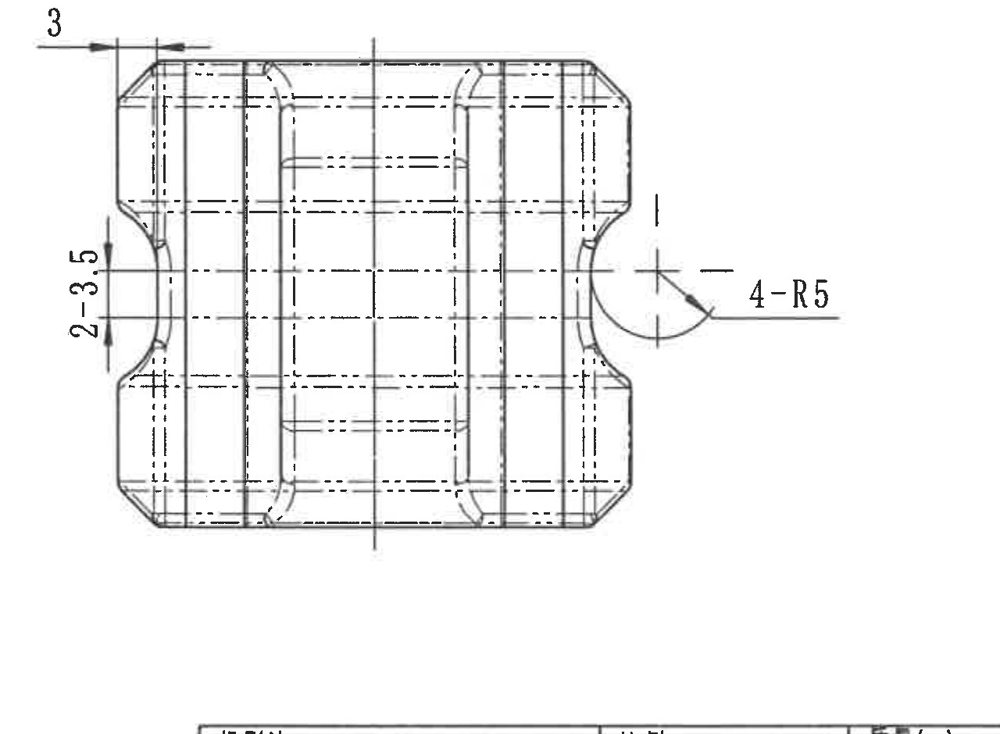
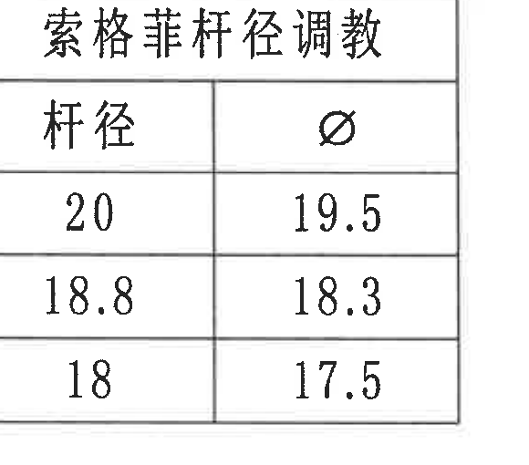
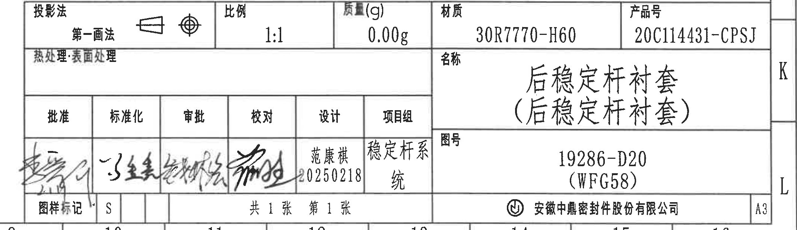

# 20C114431 PDF 内容识别与裁切提取

整页 PNG：`outputs/20C114431_assets/images/page_1.png`  
页面尺寸：4959 × 3505 px；以下 bbox 均为 `[x, y, width, height]`。

## object_1 - 技术要求 / Specifications / NOTES

- 原图位置/视图名称：左侧 B-J 网格区域，技术要求 / Specifications / NOTES。
- bbox：`[300, 430, 2450, 2450]`

| 提取项 | 原图数值或文本 | 含义说明 |
|---|---|---|
| 标题 | 技术要求；Specifications | 技术要求双语说明区。 |
| 1 | 天然胶, 硬度: 60+3 shA, 参照标准 DBL 5558-45; Nature rubber according to DBL 5558-45. | 材料为天然胶，硬度要求 60+3 shA，材料标准 DBL 5558-45。 |
| 2 | 耐臭氧实验参照标准 ISO 1431-1 A法, 参照标准 DBL 5555 0级无裂纹; Ozone test according ISO 1431-1 operation mode A, grade 0 no cracking according DBL 5555. | 臭氧试验按 ISO 1431-1 A法，按 DBL 5555 判定 0 级无裂纹。 |
| 3 | 自然老化参照标准 DIN EN ISO 4892-2 (850h, 65±3°C, HR 60% min, 61±2W/mm2/), 参照标准 DBL 5555 0级无裂纹; Artificial weathering in accordance with DIN EN ISO 4892-2 / 850h/65±3°C/HR 60% min/61±2W/mm2/, grade 0 no cracking according DBL 5555. | 老化/人工气候条件与判定要求。 |
| 4 | 由索格菲完成粘接工序; The gluing is made by Sogefi. | 粘接工序由 Sogefi 完成。 |
| 5 | 粘接准备事项 Bush status before for gluing on stab bar: 内表面需保持清洁, 索格菲粘接前无需处理措施; 衬套出模后6个月可粘接; 采用脱模剂必须与索格菲粘接工艺兼容; The internal surface of the bush must be clean and can receive the Sogefi glue without surface preparation. The gluing operation can be made 6 months maximum after moulding. The release agent used for bushes must be compatible with the Sogefi glue. | 粘接前衬套状态、清洁、出模后期限和脱模剂兼容要求。 |
| 6 | 特殊特性参照标准 IGR-D-20/0; Special characteristics as IGR-D-20/0; 关键特性标识 Critical; 重要特性标识 Important; 橡胶尺寸公差参照 NF/T47-001 M3级执行; General tolerances on rubber M3 as norm NF/T47.001. | 特殊特性与橡胶尺寸通用公差等级。 |
| 7 | 追溯性标识: 字高2.5mm, 字深0.2mm; Traceability: characters height 2.5mm, characters deep 0.2mm. | 追溯字符高度和刻深。 |
| 8 | 刚度采用刚性夹具完成; Stiffness are checked with rigid blocks to meet the specification. | 刚度检测用刚性夹具。 |
| 8-1 | Z向静刚度: 加载±5000N, 速度30mm/min, 循环3次, 计算±3000N时的刚度; Radial static stiffness Kz: Load ±5000N for 3 cycles, speed 30mm/min, check at ±3000N. | Z向/径向静刚度 Kz 检测条件。 |
| 8-2 | Z向动刚度: 振幅±0.025mm, 频率0到600Hz, 增幅5Hz, 计算100Hz时的刚度; Radial dynamic stiffness Kdz: Amplitude ±0.025mm, frequency 0 to 600 Hz, amplification 5Hz, check at 100Hz. | Z向/径向动刚度 Kdz 检测条件。 |
| 8-3 | 轴向刚度: 加载±500N, 速度20mm/min, 循环3次, 计算±500N时的刚度; Axial stiffness: Load ±500N for 3 cycles, speed 20mm/min, check at ±500N. | 轴向刚度检测条件。 |
| 8-4 | 扭转刚度: 加载±25°, 速度60°/min, 循环3次, 计算±3°时的刚度; Torsional stiffness Kty: Load ±25° for 3 cycles, speed 60°/min, check at ±3°. | 扭转刚度 Kty 检测条件。 |
| 9 | 其他试验参照索格菲试验计划; The rest tests refer to Sogefi test plan. | 其他试验引用 Sogefi 试验计划。 |
| 10 | ○ 为工序、出厂检验尺寸。○ is marked for inspection dimensions. | 圆圈标记表示工序/出厂检验尺寸。 |

边界归属说明：该裁切对象只提取左侧 NOTES 文本；右侧扩展用于完整保留第 8 项英文长句，不提取相邻主加工视图尺寸。

## object_2 - 顶部修订履历表 / Revision Table

- 原图位置/视图名称：页面上方 A-B 网格，列 9-16 附近，修订履历表。
- bbox：`[2770, 160, 2005, 315]`

| 来历 | 客户版本号 | 变更标记 | 区域 | 变更事项 | 中鼎版本号 | 年月日 | 变更者 |
|---|---|---|---|---|---|---|---|
|  |  |  |  | 首次下发 | A | 20250218 | 范康祺 |
|  |  |  |  |  |  |  |  |
|  |  |  |  |  |  |  |  |

| 提取项 | 原图数值或文本 | 含义说明 |
|---|---|---|
| 表头 | 来历、客户版本号、变更标记、区域、变更事项、中鼎版本号、年月日、变更者 | 修订履历字段。 |
| 修订记录 | 首次下发 / A / 20250218 / 范康祺 | 初次下发记录，中鼎版本号 A，日期 2025-02-18，变更者范康祺。 |
| 空白行 | 后续两行为空白 | 无额外修订记录。 |

边界归属说明：右侧轻微带入图框字母边缘，图框字母不属于修订表字段；表格本体列线、行线、表头和记录完整。

## object_3 - 主加工视图 / 正视图

- 原图位置/视图名称：页面中部 C-G 网格，列 9-12 附近，主加工正视图。
- bbox：`[2350, 500, 1330, 1450]`

| 提取项 | 原图数值或文本 | 含义说明 |
|---|---|---|
| 参考总宽度 | (38.5) | 括号内参考尺寸，位于主视图顶部，表示上部外形参考宽度；仅作参考，不作为带公差控制尺寸。 |
| 圆弧半径 | R19.25 | 上半圆外轮廓半径。 |
| 直径/配杆尺寸 | 2-ØA+0.35 | 两处直径尺寸；A 对应杆径表中的杆径参数，带 +0.35 公差。标注引线指向中心孔/内圆相关结构。 |
| 上部高度 | 22±0.35 | 主视图上半部从中间分型/中心基准到上外形的竖向高度，带 ±0.35 公差。 |
| 下部高度 | 22±0.35 | 主视图下半部从中间分型/中心基准到下外形的竖向高度，带 ±0.35 公差。 |
| 右侧倒角 | 2-C3*C5 | 两处 C3 by C5 倒角，位于主视图右侧端部；星号为原图乘号写法。 |
| 圆角 | 2-R2.5 | 两处 R2.5 圆角，位于下部凸台与侧部过渡处。 |
| 台阶高度 | 7.5 | 下部台阶/凸台旁竖向尺寸。 |
| 凸台宽度 | 14 | 下部中央凸台宽度。 |
| 总宽度检验尺寸 | 38.5±0.4 | 主视图下方圆角框尺寸，表示总宽度控制尺寸，带 ±0.4 公差；按 NOTES 第10项，圆圈/圆角框标识为工序、出厂检验尺寸。 |
| 剖切标识 | A / A-A | 主视图上、下箭头标示 A-A 剖切方向和剖切位置；剖面本体见 object_4。 |

边界归属说明：该对象只提取正视图尺寸。A-A 剖面尺寸归 object_4；下方局部/底视图尺寸归 object_5。靠近边界的顶部 `2-ØA+0.35`、左侧两个 `22±0.35`、右侧 `2-C3*C5`、`2-R2.5` 均完整保留。

## object_4 - A-A 剖面视图

- 原图位置/视图名称：页面右中 C-G 网格，列 13-15 附近，A-A 剖面。
- bbox：`[3735, 500, 920, 1335]`

| 提取项 | 原图数值或文本 | 含义说明 |
|---|---|---|
| 上部宽度检验尺寸 | 34.8±0.4 | A-A 剖面上部外宽，圆角框标识，带 ±0.4 公差。 |
| 上右倒角 | C3*45° | A-A 剖面右上角倒角，C3，角度 45°。 |
| 下部倒角 | 2-C7.5*C7.5 | A-A 剖面下部两处 C7.5 by C7.5 倒角。 |
| 下部宽度检验尺寸 | 34.8±0.4 | A-A 剖面下部外宽，圆角框标识，带 ±0.4 公差。 |
| 剖面标识 | A-A | 与主视图 A-A 剖切线对应。 |
| 比例 | 1.5:1 | A-A 剖面放大比例。 |
| 剖面线 | 斜线填充 | 表示被剖切的材料区域。 |

边界归属说明：该对象是剖面视图，所有 `34.8±0.4`、`C3*45°`、`2-C7.5*C7.5` 均归 A-A 剖面，不归主视图。右侧接近图框但尺寸文字和引线完整。

## object_5 - 下方局部/底视图

- 原图位置/视图名称：页面下中 H-I 网格，列 9-12 附近，下方局部/底视图。
- bbox：`[2500, 1810, 1280, 940]`

| 提取项 | 原图数值或文本 | 含义说明 |
|---|---|---|
| 顶部局部尺寸 | 3 | 位于底视图左上边缘，表示端部/边缘小尺寸。 |
| 左侧凹部尺寸 | 2-3.5 | 两处 3.5 尺寸，位于底视图左侧凹部竖向标注。 |
| 右侧圆角 | 4-R5 | 四处 R5 圆角，标注引线指向侧边圆弧凹槽。 |
| 中心线/虚线 | 可见中心线、虚线 | 表示对称中心、隐藏边/内部轮廓。 |

边界归属说明：该对象与主视图上下相邻；上边缘 `3` 尺寸属于本局部/底视图，不归 object_3。右侧 `4-R5` 引线和文字完整保留。

## object_6 - 索格菲杆径调教表

- 原图位置/视图名称：页面右下 H-J 网格，列 14-15 附近，杆径调教表。
- bbox：`[4090, 2145, 580, 510]`

| 杆径 | Ø |
|---:|---:|
| 20 | 19.5 |
| 18.8 | 18.3 |
| 18 | 17.5 |

| 提取项 | 原图数值或文本 | 含义说明 |
|---|---|---|
| 表题 | 索格菲杆径调教 | Sogefi 杆径调教/匹配表。 |
| 列名 | 杆径、Ø | 左列为杆径，右列为对应直径值。 |
| 数据行1 | 20 -> 19.5 | 杆径 20 对应 Ø19.5。 |
| 数据行2 | 18.8 -> 18.3 | 杆径 18.8 对应 Ø18.3。 |
| 数据行3 | 18 -> 17.5 | 杆径 18 对应 Ø17.5。 |

边界归属说明：该表为独立表格对象，未混入标题栏；表格边框、表头和三行数据完整。

## object_7 - 标题栏 / Title Block

- 原图位置/视图名称：页面右下 J-L 网格，列 9-16 附近，标题栏。
- bbox：`[2690, 2735, 2140, 620]`

| 提取项 | 原图数值或文本 | 含义说明 |
|---|---|---|
| 投影法 | 第一画法 | 投影方法为第一画法。 |
| 比例 | 1:1 | 图样比例。 |
| 质量(g) | 0.00g | 标题栏质量字段。 |
| 材质 | 30R7770-H60 | 材料牌号/规格。 |
| 产品号 | 20C114431-CPSJ | 产品编号。 |
| 热处理/表面处理 | 空白 | 原图该字段未填写具体内容。 |
| 名称 | 后稳定杆衬套（后稳定杆衬套） | 零件名称。 |
| 图号 | 19286-D20 (WFG58) | 图样编号/平台或项目代号。 |
| 批准 | 签名，日期不清晰 | 签署栏，手写内容可见但不稳定识读。 |
| 标准化 | 签名 | 标准化签署栏。 |
| 审批 | 签名 | 审批签署栏。 |
| 校对 | 签名 | 校对签署栏。 |
| 设计 | 范康祺 20250218 | 设计人员和日期。 |
| 项目组 | 稳定杆系统 | 项目组字段。 |
| 图样标记 | S | 图样标记字段。 |
| 张数 | 共1张 第1张 | 共 1 张，第 1 张。 |
| 公司 | 安徽中鼎密封件股份有限公司 | 出图/所属公司。 |
| 幅面 | A3 | 图纸幅面。 |

边界归属说明：标题栏字段完整；下侧少量图框坐标行不作为标题栏字段。右侧 K/L 字母为图框坐标，不作为标题栏字段。

## 裁切检查记录

| 对象 | 图片路径 | 检查结果 | 边界与重裁记录 |
|---|---|---|---|
| object_1 | `outputs/20C114431_assets/images/object_1.png` | 完整包含 NOTES 标题和 1-10 项文字。 | 初版右侧第8项英文长句被截断，已向右重裁；只提取 NOTES 文本，不提取相邻主视图。 |
| object_2 | `outputs/20C114431_assets/images/object_2.png` | 表头、首条修订记录和空白行完整。 | 裁切略含右侧图框边缘；图框字母不计入表格字段。 |
| object_3 | `outputs/20C114431_assets/images/object_3.png` | 主视图完整包含尺寸线、箭头和文字：`(38.5)`、`R19.25`、`2-ØA+0.35`、两个 `22±0.35`、`2-C3*C5`、`2-R2.5`、`7.5`、`14`、`38.5±0.4`、A-A 标识。 | 初版截断左侧和右侧尺寸并带入底视图，已扩大/收紧重裁；底视图尺寸不归入主视图。 |
| object_4 | `outputs/20C114431_assets/images/object_4.png` | A-A 剖面尺寸线和文字完整：两个 `34.8±0.4`、`C3*45°`、`2-C7.5*C7.5`、`A-A`、`1.5:1`。 | 初版左侧尺寸箭头靠边，已重裁；右侧接近图框但未截断标注。 |
| object_5 | `outputs/20C114431_assets/images/object_5.png` | 下方局部/底视图尺寸线和文字完整：`3`、`2-3.5`、`4-R5`。 | 初版右侧 `4-R5` 被截断，已向右重裁；上边 `3` 明确归本视图。 |
| object_6 | `outputs/20C114431_assets/images/object_6.png` | 表题、表头和三行数据完整。 | 未发现截断或混入其他对象。 |
| object_7 | `outputs/20C114431_assets/images/object_7.png` | 标题栏主要字段完整：投影法、比例、质量、材质、产品号、名称、图号、签署、图样标记、张数、公司、A3。 | 初版左侧和底边略截，已重裁；下侧图框坐标行不作为标题栏字段。 |
