# 20C114435 内容识别与裁切提取

PDF 源文件：`input/20C114435.pdf`

整页渲染图：`outputs/20C114435_assets/images/page_1.png`，尺寸 4959 x 3505 px。PDF 为扫描图像，未检测到可用文本层；以下内容基于整页 PNG 和分对象裁切图人工识别转录。

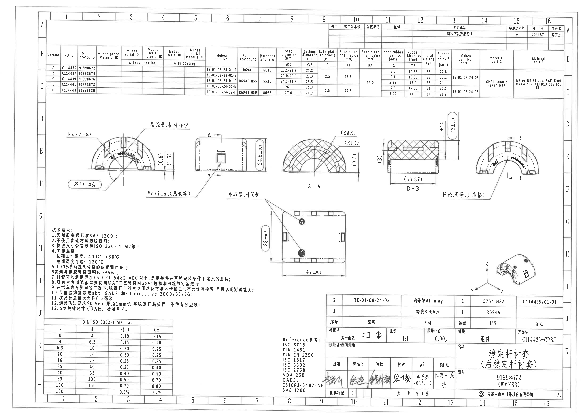

## object_1：修订履历表 / 变更记录表

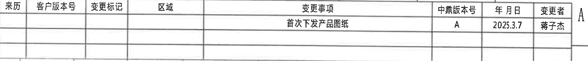

原图位置/视图名称：页面上方右侧 A 区，修订履历表。

| 来历 | 客户版本号 | 变更标记 | 区域 | 变更事项 | 中鼎版本号 | 年月日 | 变更者 |
|---|---|---|---|---|---|---|---|
|  |  |  |  | 首次下发产品图纸 | A | 2025.3.7 | 蒋子杰 |

| 提取项 | 原图数值或文本 | 含义说明 |
|---|---|---|
| 变更事项 | 首次下发产品图纸 | 首次发布该产品图纸。 |
| 中鼎版本号 | A | 中鼎内部版本为 A。 |
| 年月日 | 2025.3.7 | 变更/发布日期。 |
| 变更者 | 蒋子杰 | 变更记录责任人。 |

边界归属说明：裁切对象为修订履历表。右侧图框行标 A 少量露出，不属于表格字段；底部紧邻变型参数总表，不提取下方表格内容。

## object_2：变型参数总表 / Variant parameter table

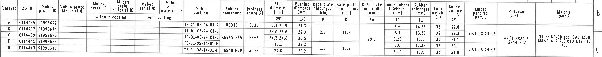

原图位置/视图名称：页面上方 B-C 区，横向变型参数总表。

| Variant | ZD ID | Mubea proto. ID | Mubea proto. Material ID | Mubea serial ID without coating | Mubea serial material ID without coating | Mubea serial ID with coating | Mubea serial material ID with coating | Mubea part No. | Rubber compound | Hardness (shore A) | ØD Stab diameter (mm) | ØE Bushing diameter (mm) | B Rate plate thickness (mm) | RI Rate plate inner radius (mm) | RA Rate plate inner radius (mm) | T1 Inner rubber thickness (mm) | T2 Rubber thickness (mm) | Total weight (g) | Rubber volume (cm³) | Mubea part No. part 1 | Material part 1 | Material part 2 |
|---|---|---|---|---|---|---|---|---|---|---|---|---|---|---|---|---|---|---|---|---|---|---|
| A | C114435 | 91998672 |  |  |  |  |  | TE-01-08-24-01-A | R6949 | 60±3 | 22.1-22.5 | 21.3 |  |  |  | 6.6 | 14.35 | 38 | 22.8 |  |  |  |
| B | C114437 | 91998674 |  |  |  |  |  | TE-01-08-24-01-B |  |  | 23.0-23.6 | 22.3 | 2.5 | 16.5 |  | 6.1 | 13.85 | 38 | 22.2 | TE-01-08-24-03 |  |  |
| C | C114439 | 91998676 |  |  |  |  |  | TE-01-08-24-01-C | R6949-H55 | 55±3 | 24.2-24.8 | 23.5 |  |  | 19.0 | 5.25 | 13.0 | 36 | 21.1 |  | GB/T 3880.2 -5754-H22 | NR or NR-BR acc. SAE J200 M4AA 617 A13 B13 C12 F17 K11 |
| E | C114441 | 91998678 |  |  |  |  |  | TE-01-08-24-01-E |  |  | 26.1 | 25.3 | 1.5 | 17.5 |  | 5.6 | 12.35 | 31 | 20.1 |  |  |  |
| H | C114443 | 91998680 |  |  |  |  |  | TE-01-08-24-01-H | R6949-H50 | 50±3 | 27.0 | 26.2 |  |  |  | 5.15 | 11.9 | 32 | 21.8 | TE-01-08-24-05 |  |  |

| 提取项 | 原图数值或文本 | 含义说明 |
|---|---|---|
| Variant | A, B, C, E, H | 变型代号，其他视图中的 `Variant(见表格)` 引用此列。 |
| ØD | 22.1-22.5；23.0-23.6；24.2-24.8；26.1；27.0 | 稳定杆直径/杆径尺寸，右端面视图用 `ØD` 代号引用。 |
| ØE | 21.3；22.3；23.5；25.3；26.2 | 衬套孔径/内径，主视图 `ØE±0.3☆` 与此列对应。 |
| B | 2.5；1.5 | Rate plate thickness，B-B 剖面左侧 `(B)` 代号引用。表中为合并单元格/分组值。 |
| RI | 16.5；17.5 | Rate plate inner radius，A-A 剖面 `(RIR)` 引用。 |
| RA | 19.0 | Rate plate inner radius，A-A 剖面 `(RAR)` 引用。 |
| T1 | 6.6；6.1；5.25；5.6；5.15 | Inner rubber thickness，B-B 剖面 `T1±0.3` 对应。 |
| T2 | 14.35；13.85；13.0；12.35；11.9 | Rubber thickness，B-B 剖面 `T2±0.3` 对应。 |
| Hardness | 60±3；55±3；50±3 | 橡胶硬度 shore A。 |
| Total weight | 38；38；36；31；32 g | 单件总重量。 |
| Rubber volume | 22.8；22.2；21.1；20.1；21.8 cm³ | 橡胶体积。 |
| Material part 1 | GB/T 3880.2 -5754-H22 | 金属/铝骨架材料规范。 |
| Material part 2 | NR or NR-BR acc. SAE J200 M4AA 617 A13 B13 C12 F17 K11 | 橡胶材料规范。 |

边界归属说明：该对象为上方完整参数总表，按原图宽表结构还原。空白单元保持空白；表中多处纵向合并单元格按原可见位置记录。右侧紧贴图框行标，图框文字不作为表格字段。

## object_3：左侧主视图 / 半圆端面加工视图

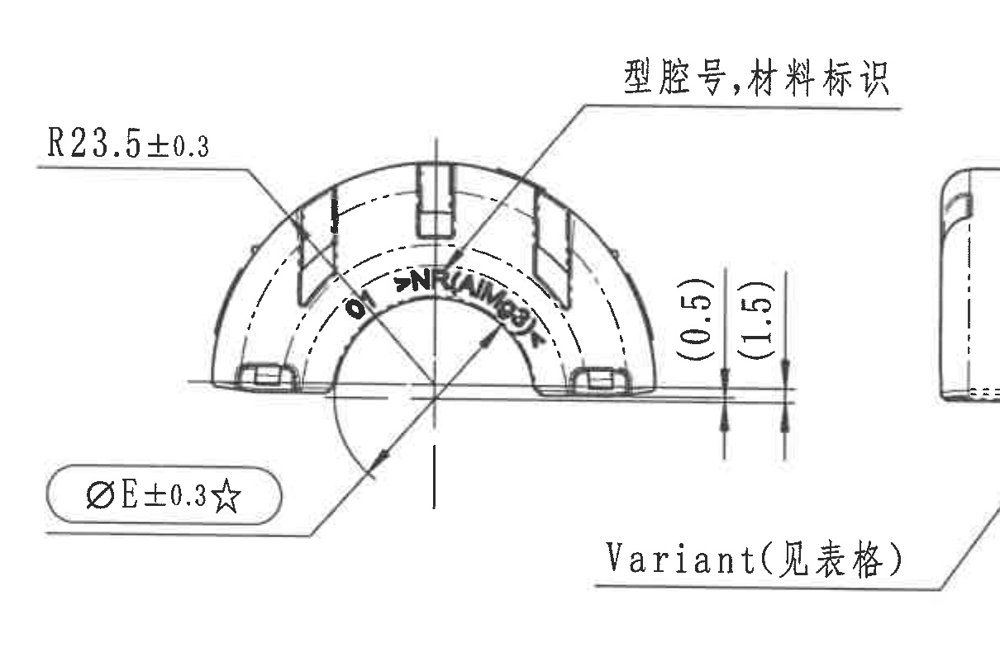

原图位置/视图名称：页面中部左侧 E-F 区，半圆端面主视图。

| 提取项 | 原图数值或文本 | 含义说明 |
|---|---|---|
| 外弧半径 | R23.5±0.3 | 外轮廓弧半径 23.5，允许公差 ±0.3。 |
| 孔径/内径关键尺寸 | ØE±0.3☆ | 直径 E，公差 ±0.3；星号表示关键尺寸，见 NOTES 第13条。E 的具体数值见参数总表 ØE 列。 |
| 参考尺寸 | (0.5) | 括号内参考尺寸，位于视图右侧局部高度/间隙标注处；仅供参考但必须保留。 |
| 参考尺寸 | (1.5) | 括号内参考尺寸，位于视图右侧局部高度/间隙标注处；仅供参考但必须保留。 |
| 标识说明 | 型腔号,材料标识 | 引线指向零件表面标识位置，表示需有型腔号和材料标识。 |

边界归属说明：右下可见 `Variant(见表格)` 的文字/引线边缘，但其箭头落到相邻侧视图方形标识，归 object_4；本对象只提取主视图自身尺寸和标识。

## object_4：侧视图 / A-A 剖切位置视图

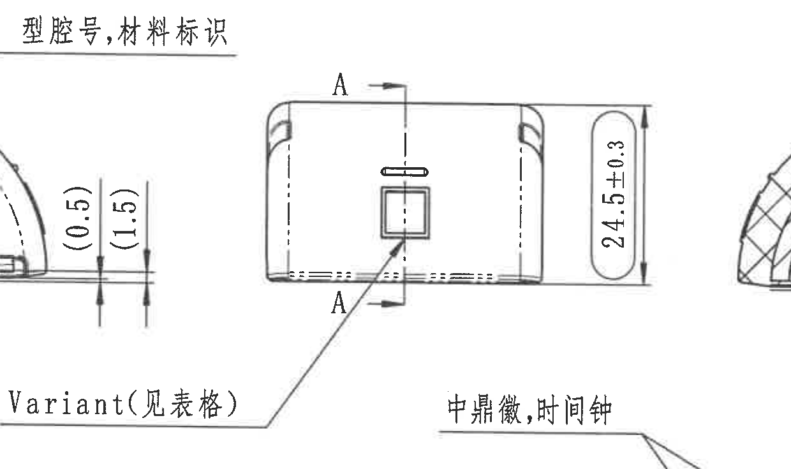

原图位置/视图名称：页面中部偏左 E-F 区，主视图右侧的侧视图。

| 提取项 | 原图数值或文本 | 含义说明 |
|---|---|---|
| 剖切标识 | A（上、下两处） | 表示 A-A 剖切位置和方向，对应 object_5。 |
| 总高度/侧向尺寸 | 24.5±0.3 | 该侧视方向外形高度/总高，公差 ±0.3。 |
| 变型引用 | Variant(见表格) | 引线指向方形标识，表示变型信息从 object_2 参数总表读取。 |
| 标识说明 | 方形标识、顶部槽/孔 | 显示外表面标识和槽/孔位置。 |

边界归属说明：左侧可见主视图 `(0.5)/(1.5)` 尺寸边缘，右侧可见 A-A 剖面边缘，均不归属本对象；下方 `中鼎徽,时间钟` 引线箭头落入俯视图，归 object_8。

## object_5：A-A 剖面视图

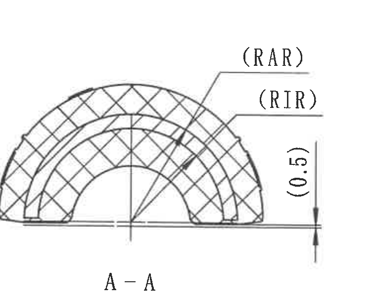

原图位置/视图名称：页面中部 E-F 区，A-A 剖面。

| 提取项 | 原图数值或文本 | 含义说明 |
|---|---|---|
| 剖面名称 | A-A | 与 object_4 中 A-A 剖切标识对应。 |
| 弧向/半径代号 | (RAR) | 括号内代号/参考标注，指 Rate plate inner radius 的 RA 值，见参数总表。 |
| 弧向/半径代号 | (RIR) | 括号内代号/参考标注，指 Rate plate inner radius 的 RI 值，见参数总表。 |
| 参考尺寸 | (0.5) | 括号内参考高度/间隙尺寸，位于 A-A 剖面右侧。 |

边界归属说明：裁切仅包含 A-A 剖面及其 RAR/RIR/(0.5) 标注；B-B 剖面 `(B)` 未归入本对象。

## object_6：B-B 剖面视图

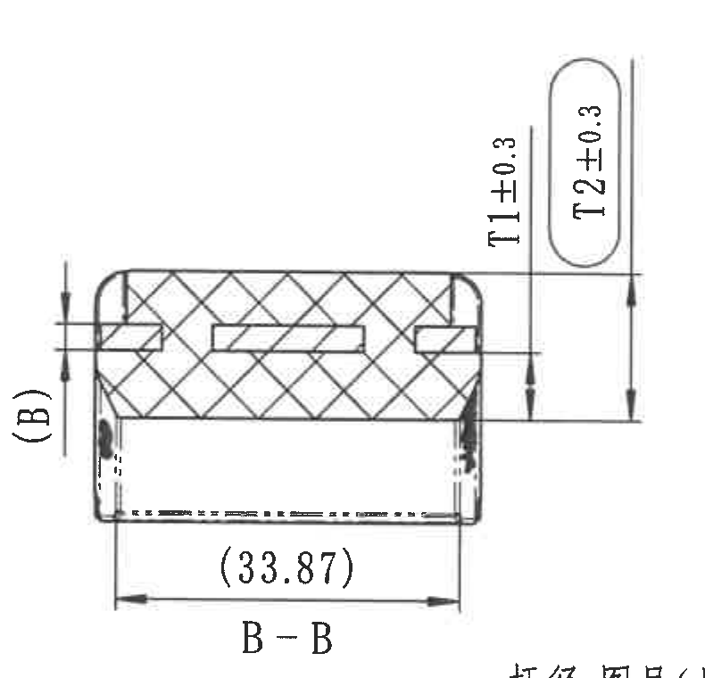

原图位置/视图名称：页面中部偏右 E-F 区，B-B 剖面。

| 提取项 | 原图数值或文本 | 含义说明 |
|---|---|---|
| 剖面名称 | B-B | 与 object_7 中 B-B 剖切标识对应。 |
| 厚度尺寸 | T1±0.3 | 内橡胶厚度，公差 ±0.3；具体 T1 数值按 object_2 参数总表随 Variant 变化。 |
| 厚度尺寸 | T2±0.3 | 橡胶厚度，公差 ±0.3；具体 T2 数值按 object_2 参数总表随 Variant 变化。 |
| 参考尺寸 | (33.87) | 括号内参考尺寸，位于 B-B 剖面底部横向尺寸线。 |
| 参考代号 | (B) | 括号内代号，指参数总表的 Rate plate thickness B。 |

边界归属说明：底部露出 object_7 的 `杆径,图号(见表格)` 顶部，不属于 B-B 剖面；本对象只提取 T1/T2、(33.87)、(B) 和剖面名。

## object_7：右侧端面视图 / B-B 剖切位置视图

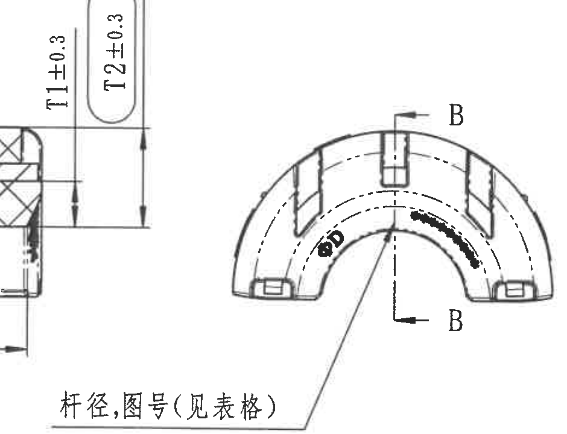

原图位置/视图名称：页面中部右侧 E-F 区，右端面视图。

| 提取项 | 原图数值或文本 | 含义说明 |
|---|---|---|
| 剖切标识 | B（上、下两处） | 表示 B-B 剖切位置和方向，对应 object_6。 |
| 杆径代号 | ØD | 直径 D，代表稳定杆直径/杆径；具体值见 object_2 参数总表 ØD 列。 |
| 表格引用 | 杆径,图号(见表格) | 引线说明杆径和图号按参数总表读取。 |

边界归属说明：左侧 T1/T2 尺寸线边缘来自 B-B 剖面 object_6，不归属本端面视图。

## object_8：俯视图 / 平面加工视图

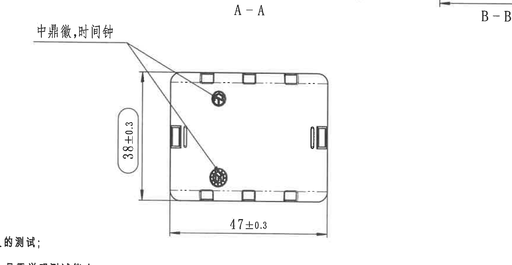

原图位置/视图名称：页面中下部 G-H 区，俯视/平面加工视图。

| 提取项 | 原图数值或文本 | 含义说明 |
|---|---|---|
| 宽度/总宽 | 38±0.3 | 俯视方向总宽，公差 ±0.3。 |
| 长度/总长 | 47±0.3 | 俯视方向总长，公差 ±0.3。 |
| 标识说明 | 中鼎徽,时间钟 | 引线指向两个圆形标识位置，要求布置中鼎徽和时间钟。 |
| 局部结构 | 上/下边矩形嵌件、左右侧槽/孔 | 显示嵌件/卡箍接触或外形局部结构。 |

边界归属说明：顶部露出 A-A/B-B 剖面名，左下露出 NOTES 文字边缘，均不属于俯视图；本对象只提取 `38±0.3`、`47±0.3` 和 `中鼎徽,时间钟` 引线。

## object_9：等轴测局部/方向示意图

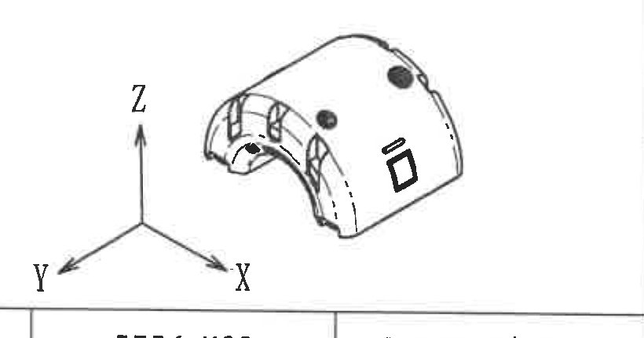

原图位置/视图名称：页面右下 H-I 区，等轴测三维示意。

| 提取项 | 原图数值或文本 | 含义说明 |
|---|---|---|
| 坐标轴 | X | 三维方向标识。 |
| 坐标轴 | Y | 三维方向标识。 |
| 坐标轴 | Z | 三维方向标识。 |
| 等轴测外形 | 半圆橡胶衬套、孔/槽、圆形与矩形标识 | 用于表达零件三维外观和标识位置；未给出独立尺寸。 |

边界归属说明：底部带入相邻 BOM 表顶线，为保留完整 Y/X/Z 轴标所需；该表线不作为等轴测内容提取。

## object_10：技术要求 / NOTES

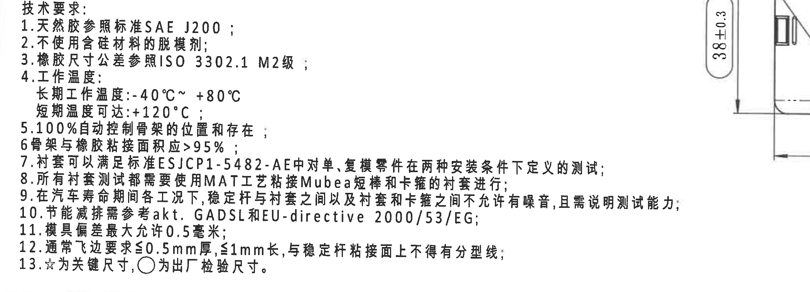

原图位置/视图名称：页面左下 H-J 区，技术要求文本块。

| 提取项 | 原图数值或文本 | 含义说明 |
|---|---|---|
| 1 | 天然胶参照标准SAE J200； | 材料标准要求。 |
| 2 | 不使用含硅材料的脱模剂； | 工艺/材料限制。 |
| 3 | 橡胶尺寸公差参照ISO 3302.1 M2级； | 橡胶尺寸通用公差标准，详见 object_11。 |
| 4 | 工作温度：长期工作温度:-40°C~+80°C；短期温度可达:+120°C； | 工作温度条件。 |
| 5 | 100%自动控制骨架的位置和存在； | 骨架位置和存在性需全检/自动控制。 |
| 6 | 骨架与橡胶粘接面积应>95%； | 粘接面积要求。 |
| 7 | 衬套可以满足标准ESJCP1-5482-AE中对单、复模零件在两种安装条件下定义的测试； | 测试标准要求。 |
| 8 | 所有衬套测试都需要使用MATT艺粘接Mubea短棒和卡箍的衬套进行； | 测试样件/工艺说明。 |
| 9 | 在汽车寿命期间各工况下，稳定杆与衬套之间以及衬套和卡箍之间不允许有噪音，且需说明测试能力； | NVH/噪音和测试能力要求。 |
| 10 | 节能减排需参考akt. GADSL和EU-directive 2000/53/EG； | 环保法规/清单要求。 |
| 11 | 模具偏差最大允许0.5毫米； | 模具偏差限制。 |
| 12 | 通常飞边要求≤0.5mm厚，≤1mm长，与稳定杆粘接面上不得有分型线； | 飞边和分型线限制。 |
| 13 | ☆为关键尺寸，○为出厂检验尺寸。 | 关键尺寸和出厂检验尺寸符号说明。 |

边界归属说明：右侧裁入俯视图 `38±0.3` 尺寸和局部边缘，这是为保留第9条长句完整；该尺寸归 object_8，不在 NOTES 中作为本对象尺寸提取。

## object_11：DIN ISO 3302-1 M2 class 公差表

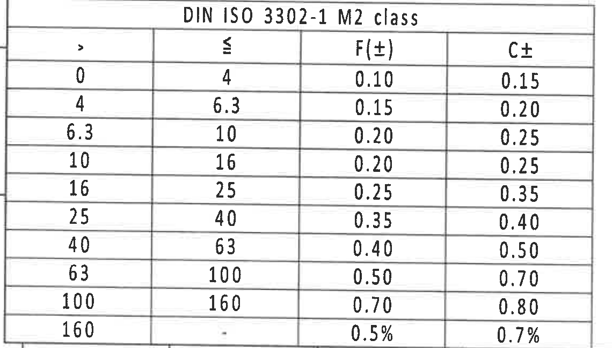

原图位置/视图名称：页面左下 J-L 区，橡胶尺寸公差表。

| DIN ISO 3302-1 M2 class |  |  |  |
|---|---|---|---|
| > | ≤ | F(±) | C± |
| 0 | 4 | 0.10 | 0.15 |
| 4 | 6.3 | 0.15 | 0.20 |
| 6.3 | 10 | 0.20 | 0.25 |
| 10 | 16 | 0.20 | 0.25 |
| 16 | 25 | 0.25 | 0.35 |
| 25 | 40 | 0.35 | 0.40 |
| 40 | 63 | 0.40 | 0.50 |
| 63 | 100 | 0.50 | 0.70 |
| 100 | 160 | 0.70 | 0.80 |
| 160 | - | 0.5% | 0.7% |

| 提取项 | 原图数值或文本 | 含义说明 |
|---|---|---|
| 标准 | DIN ISO 3302-1 M2 class | 对应 NOTES 第3条橡胶尺寸公差。 |
| F(±), C± | 表内各范围值 | 按尺寸范围给出 F 和 C 两类公差。 |

边界归属说明：左侧有少量相邻图框线露出，表格外框、表头、行列和数值完整。

## object_12：Reference 参考标准清单

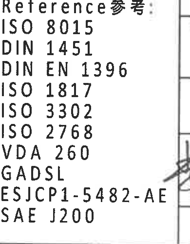

原图位置/视图名称：页面下部偏中 K-L 区，参考标准清单。

| 提取项 | 原图数值或文本 | 含义说明 |
|---|---|---|
| Reference 参考 | ISO 8015 | 参考标准。 |
| Reference 参考 | DIN 1451 | 参考标准。 |
| Reference 参考 | DIN EN 1396 | 参考标准。 |
| Reference 参考 | ISO 1817 | 参考标准。 |
| Reference 参考 | ISO 3302 | 参考标准。 |
| Reference 参考 | ISO 2768 | 参考标准。 |
| Reference 参考 | VDA 260 | 参考标准。 |
| Reference 参考 | GADSL | 参考清单/法规。 |
| Reference 参考 | ESJCP1-5482-AE | 客户/测试标准。 |
| Reference 参考 | SAE J200 | 橡胶材料标准。 |

边界归属说明：右侧邻接标题栏签名区，有少量签名尖端/竖线露出；为完整保留 `ESJCP1-5482-AE` 未再收窄。签名不属于本对象。

## object_13：BOM 明细表 / 零件组成表

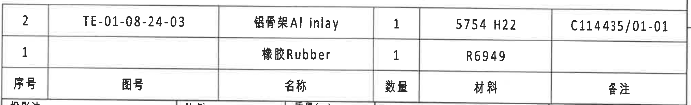

原图位置/视图名称：页面右下 I-J 区，标题栏上方 BOM 明细表。

| 序号 | 图号 | 名称 | 数量 | 材料 | 备注 |
|---|---|---|---|---|---|
| 2 | TE-01-08-24-03 | 铝骨架Al inlay | 1 | 5754 H22 | C114435/01-01 |
| 1 |  | 橡胶Rubber | 1 | R6949 |  |

| 提取项 | 原图数值或文本 | 含义说明 |
|---|---|---|
| 序号2 | TE-01-08-24-03 / 铝骨架Al inlay / 1 / 5754 H22 / C114435/01-01 | 铝骨架零件。 |
| 序号1 | 橡胶Rubber / 1 / R6949 | 橡胶零件。 |

边界归属说明：对象完整包含 BOM 表头和两行记录；底部紧邻标题栏顶线，不提取标题栏字段。

## object_14：标题栏 / Title block

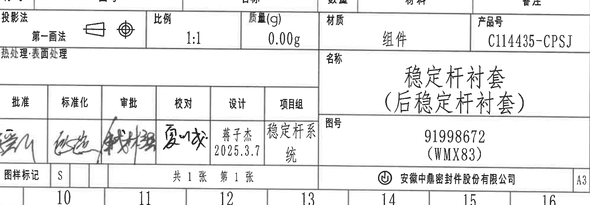

原图位置/视图名称：页面右下 J-L 区，标题栏和签批栏。

| 字段 | 原图数值或文本 |
|---|---|
| 投影法 | 第一画法 |
| 比例 | 1:1 |
| 质量(g) | 0.00g |
| 材质 | 组件 |
| 产品号 | C114435-CPSJ |
| 热处理/表面处理 |  |
| 名称 | 稳定杆衬套（后稳定杆衬套） |
| 图号 | 91998672 (WMX83) |
| 批淮/批准 | 签名 |
| 标准化 | 签名 |
| 审批 | 签名 |
| 校对 | 签名 |
| 设计 | 蒋子杰 2025.3.7 |
| 项目组 | 稳定杆系统 |
| 图样标记 | S |
| 页数 | 共1张 第1张 |
| 公司 | 安徽中鼎密封件股份有限公司 |
| 图幅 | A3 |

| 提取项 | 原图数值或文本 | 含义说明 |
|---|---|---|
| 产品号 | C114435-CPSJ | 产品编号。 |
| 名称 | 稳定杆衬套（后稳定杆衬套） | 零件/组件名称。 |
| 图号 | 91998672 (WMX83) | 图样编号。 |
| 比例 | 1:1 | 图样比例。 |
| 质量 | 0.00g | 标题栏给出的质量字段。 |
| 设计 | 蒋子杰 2025.3.7 | 设计人员和日期。 |

边界归属说明：顶部裁入 BOM 表底部少量内容，但标题栏字段完整；底部图框坐标 10-16 不作为标题栏字段提取。

## 裁切检查记录

| 对象 | 图片路径 | 检查结果 |
|---|---|---|
| page_1 | outputs/20C114435_assets/images/page_1.png | 整页 PNG 已渲染，尺寸 4959 x 3505 px，包含完整图框和全部图面内容。 |
| object_1 | outputs/20C114435_assets/images/object_1.png | 修订履历表表头和记录完整；右侧图框行标 A 少量露出，未提取为表格内容。 |
| object_2 | outputs/20C114435_assets/images/object_2.png | 变型参数总表表头、行列和数值完整；右边界靠近图框，但表格内容未被截断。 |
| object_3 | outputs/20C114435_assets/images/object_3.png | 主视图尺寸线和文字完整；右下 `Variant` 片段属于相邻侧视图，已排除。 |
| object_4 | outputs/20C114435_assets/images/object_4.png | 侧视图 `24.5±0.3`、A-A 剖切标识和 Variant 引线完整；邻近主视图/A-A 边缘仅作边界残留，不提取。 |
| object_5 | outputs/20C114435_assets/images/object_5.png | A-A 剖面、RAR/RIR 和 `(0.5)` 完整，无尺寸文字截断。 |
| object_6 | outputs/20C114435_assets/images/object_6.png | B-B 剖面、T1/T2、`(33.87)` 和 `(B)` 完整；底部露出下一视图文字顶部，未提取。 |
| object_7 | outputs/20C114435_assets/images/object_7.png | 右端面视图、B 剖切标识、ØD 和 `杆径,图号(见表格)` 完整；左侧 T1/T2 残留归 object_6。 |
| object_8 | outputs/20C114435_assets/images/object_8.png | 俯视图、`38±0.3`、`47±0.3`、`中鼎徽,时间钟` 引线完整；顶部 A-A/B-B 文字残留不归属本图。 |
| object_9 | outputs/20C114435_assets/images/object_9.png | 等轴测图和 X/Y/Z 轴标完整；底部 BOM 顶线为相邻表格边界，未提取。 |
| object_10 | outputs/20C114435_assets/images/object_10.png | NOTES 1-13 条完整；右侧俯视图 `38±0.3` 为边界残留，尺寸归 object_8。 |
| object_11 | outputs/20C114435_assets/images/object_11.png | DIN ISO 公差表表头和所有行完整；左侧少量图框线露出，不影响表格还原。 |
| object_12 | outputs/20C114435_assets/images/object_12.png | Reference 清单文字完整；右侧签名尖端残留不属于本对象。 |
| object_13 | outputs/20C114435_assets/images/object_13.png | BOM 表头和两行明细完整；未提取下方标题栏字段。 |
| object_14 | outputs/20C114435_assets/images/object_14.png | 标题栏字段完整；顶部 BOM 边缘和底部图框坐标不作为标题栏内容。 |
