# 20C114436 PDF 内容识别

源文件：`input/20C114436.pdf`  
整页渲染图：`outputs/20C114436_assets/images/page_1.png`  
页面：1；整页 PNG 尺寸：4959 x 3505 px

## object_1 - 修订履历表

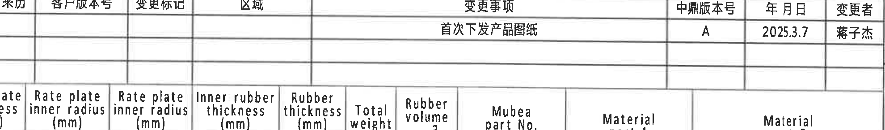

原图位置/视图名称：第 1 页右上角修订履历表，bbox `[2800, 220, 4780, 515]`。

原表还原：

| 来历 | 客户版本号 | 变更标记 | 区域 | 变更事项 | 中鼎版本号 | 年月日 | 变更者 |
|---|---|---|---|---|---|---|---|
|  |  |  |  | 首次下发产品图纸 | A | 2025.3.7 | 蒋子杰 |
|  |  |  |  |  |  |  |  |

| 提取项 | 原图数值或文本 | 含义说明 |
|---|---|---|
| 表格类型 | 修订履历 | 记录图纸版本和变更事项。 |
| 变更事项 | 首次下发产品图纸 | 本版为首次发布。 |
| 中鼎版本号 | A | 中鼎内部版本为 A。 |
| 年月日 | 2025.3.7 | 修订日期。 |
| 变更者 | 蒋子杰 | 变更责任人。 |

边界归属说明：裁切包含完整修订履历表头、数据行和底部空白行；下边缘可见参数表表头上缘残留，该残留属于 object_2 参数表，不作为本表内容提取。

## object_2 - Variant 参数表

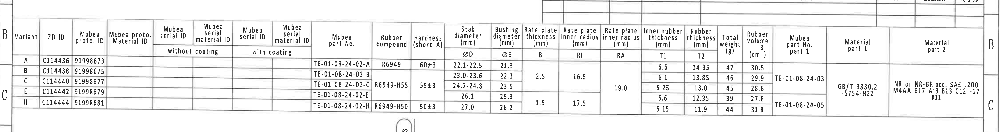

原图位置/视图名称：第 1 页上方横向 Variant 参数表，bbox `[330, 300, 4850, 900]`。

原表还原：

| Variant | ZD ID | Mubea proto. ID | Mubea proto. Material ID | Mubea serial ID without coating | Mubea serial material ID without coating | Mubea serial ID with coating | Mubea serial material ID with coating | Mubea part No. | Rubber compound | Hardness (shore A) | Stab diameter ØD (mm) | Bushing diameter ØE (mm) | Rate plate thickness B (mm) | Rate plate inner radius RI (mm) | Rate plate inner radius RA (mm) | Inner rubber thickness T1 (mm) | Rubber thickness T2 (mm) | Total weight (g) | Rubber volume (cm³) | Mubea part No. part 1 | Material part 1 | Material part 2 |
|---|---|---|---|---|---|---|---|---|---|---|---|---|---|---|---|---|---|---|---|---|---|---|
| A | C114436 | 91998673 |  |  |  |  |  | TE-01-08-24-02-A | R6949 | 60±3 | 22.1-22.5 | 21.3 |  |  |  | 6.6 | 14.35 | 47 | 30.5 |  |  |  |
| B | C114438 | 91998675 |  |  |  |  |  | TE-01-08-24-02-B |  |  | 23.0-23.6 | 22.3 | 2.5 | 16.5 |  | 6.1 | 13.85 | 46 | 29.9 | TE-01-08-24-03 |  |  |
| C | C114440 | 91998677 |  |  |  |  |  | TE-01-08-24-02-C | R6949-H55 | 55±3 | 24.2-24.8 | 23.5 |  |  | 19.0 | 5.25 | 13.0 | 45 | 28.8 |  | GB/T 3880.2 -5754-H22 | NR or NR-BR acc. SAE J200 M4AA 617 A13 B13 C12 F17 K11 |
| E | C114442 | 91998679 |  |  |  |  |  | TE-01-08-24-02-E |  |  | 26.1 | 25.3 |  |  |  | 5.6 | 12.35 | 39 | 27.8 |  |  |  |
| H | C114444 | 91998681 |  |  |  |  |  | TE-01-08-24-02-H | R6949-H50 | 50±3 | 27.0 | 26.2 | 1.5 | 17.5 |  | 5.15 | 11.9 | 44 | 31.8 | TE-01-08-24-05 |  |  |

| 提取项 | 原图数值或文本 | 含义说明 |
|---|---|---|
| Variant | A/B/C/E/H | 表格给出 5 个变型。 |
| ZD ID | C114436/C114438/C114440/C114442/C114444 | 各变型对应图号或产品编号。 |
| Mubea proto. ID | 91998673/91998675/91998677/91998679/91998681 | 各变型的 Mubea 原型 ID。 |
| Mubea part No. | TE-01-08-24-02-A/B/C/E/H | 各变型主体零件号。 |
| Rubber compound | R6949、R6949-H55、R6949-H50 | 橡胶配方；空白单元格表示原表未单独填写。 |
| Hardness | 60±3、55±3、50±3 shore A | 橡胶硬度，单位 shore A。 |
| ØD | 22.1-22.5、23.0-23.6、24.2-24.8、26.1、27.0 mm | 稳定杆直径，使用直径符号 ØD。 |
| ØE | 21.3、22.3、23.5、25.3、26.2 mm | 衬套直径，使用直径符号 ØE。 |
| B | 2.5 mm、1.5 mm | Rate plate thickness；B、C 处为 2.5，H 处为 1.5，空白按原表保留。 |
| RI | 16.5、17.5 mm | Rate plate inner radius RI，B/C 对应 16.5，H 对应 17.5。 |
| RA | 19.0 mm | Rate plate inner radius RA，C 行区域显示 19.0。 |
| T1 | 6.6、6.1、5.25、5.6、5.15 mm | Inner rubber thickness T1。 |
| T2 | 14.35、13.85、13.0、12.35、11.9 mm | Rubber thickness T2。 |
| Total weight | 47、46、45、39、44 g | 总重量。 |
| Rubber volume | 30.5、29.9、28.8、27.8、31.8 cm³ | 橡胶体积。 |
| Mubea part No. part 1 | TE-01-08-24-03、TE-01-08-24-05 | 附件 part 1 零件号；跨行单元格按原图位置保留。 |
| Material part 1 | GB/T 3880.2 -5754-H22 | part 1 材料。 |
| Material part 2 | NR or NR-BR acc. SAE J200 M4AA 617 A13 B13 C12 F17 K11 | part 2 材料规范。 |

边界归属说明：裁切覆盖参数表完整表头和 5 个 Variant 数据行；左侧有图框坐标字母残留，右侧有图框坐标字母残留，均不是表格字段。表中跨行/跨列字段按原位置保留，不把空白格主观补齐。

## object_3 - 左侧主视图

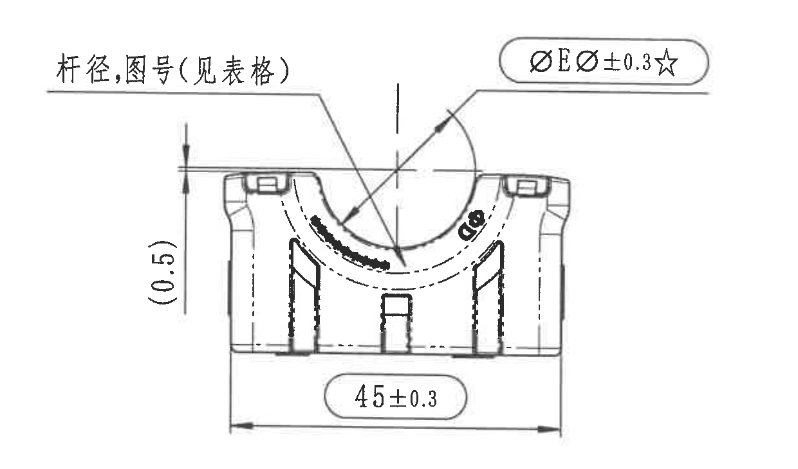

原图位置/视图名称：第 1 页左中部主视图，bbox `[410, 860, 1650, 1590]`。

| 提取项 | 原图数值或文本 | 含义说明 |
|---|---|---|
| 引线说明 | 杆径,图号(见表格) | 引线指向圆弧/杆径区域，表示杆径和图号需要参照 Variant 参数表。 |
| 关键尺寸 | ØEر0.3☆ | 带直径符号和星号的关键检验尺寸；ØE 对应参数表中的 Bushing diameter。星号按 NOTES 第 13 条为关键尺寸。 |
| 参考尺寸 | (0.5) | 括号尺寸为参考尺寸，位于主视图左侧竖向标注，表示局部高度/边距参考值，不作为直接制造公差控制尺寸。 |
| 总宽尺寸 | 45±0.3 | 主视图底部水平总宽尺寸，带 ±0.3 公差。 |
| 弧形标识 | 弧内有橡胶/材料标识图形 | 与 object_7 的型腔号/材料标识视图相呼应，主视图显示弧面标识区域。 |

边界归属说明：本裁切只提取主视图自身尺寸和引线。右侧相邻侧视图的 `Variant(见表格)` 不在本图内，不归入主视图；底部 45±0.3 的完整尺寸线、箭头和文字均包含在裁切内。

## object_4 - 侧视图及 A-A 剖切位置

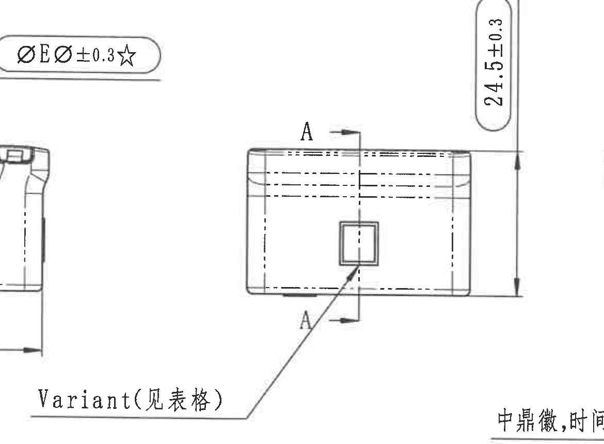

原图位置/视图名称：第 1 页中左部侧视图，bbox `[1200, 850, 2370, 1710]`。

| 提取项 | 原图数值或文本 | 含义说明 |
|---|---|---|
| 剖切标记 | A / A | 两处 A 标记和箭头定义 A-A 剖切位置，对应 object_5。 |
| 高度尺寸 | 24.5±0.3 | 侧视图右侧竖向总高度尺寸，带 ±0.3 公差。 |
| 引线说明 | Variant(见表格) | 引线指向侧面小方孔/变型特征，说明该特征随 Variant 参数表变化。 |
| 隐线 | 多条虚线 | 表示内部圆弧、孔槽或嵌件位置。 |

边界归属说明：裁切完整包含 A-A 剖切箭头、`24.5±0.3` 尺寸线和 `Variant(见表格)` 引线。左上角可见主视图 `ØEر0.3☆` 残留，右下角可见俯视图引线文字开头，均为相邻对象残留，不作为本侧视图提取项。

## object_5 - A-A 剖面视图

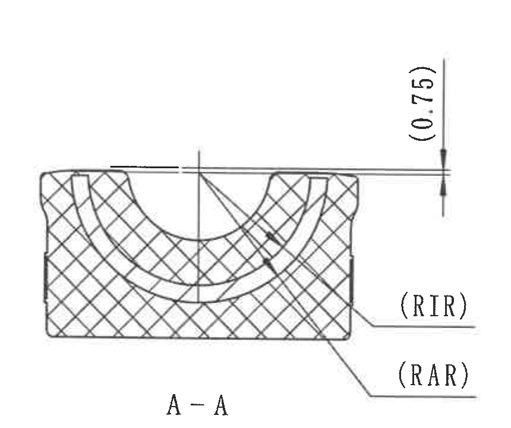

原图位置/视图名称：第 1 页中部 A-A 剖面，bbox `[2310, 860, 3170, 1580]`。

| 提取项 | 原图数值或文本 | 含义说明 |
|---|---|---|
| 剖面名称 | A-A | 与 object_4 中 A/A 剖切标记对应。 |
| 参考尺寸 | (0.75) | 括号内竖向参考尺寸，表示上缘与相关轮廓/层间位置的参考间距。 |
| 引线标识 | (RIR) | 指向剖面内部弧形/半径相关特征；RIR 为图中标识文本。 |
| 引线标识 | (RAR) | 指向另一剖面层/弧形特征；RAR 为图中标识文本。 |
| 剖面填充 | 交叉剖面线 | 表示剖切到的橡胶/实体材料区域。 |

边界归属说明：裁切包含 A-A 剖面完整外轮廓、剖面线、`(0.75)` 参考尺寸和 RIR/RAR 引线；未包含下方俯视图文字，未提取相邻 B-B 内容。

## object_6 - B-B 剖面视图

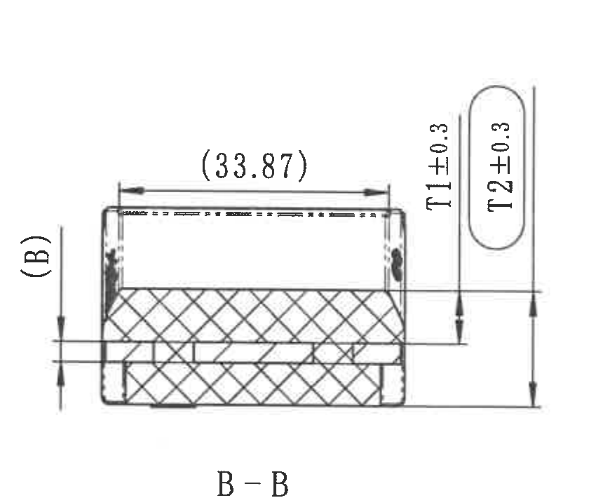

原图位置/视图名称：第 1 页中右部 B-B 剖面，bbox `[3150, 850, 4020, 1560]`。

| 提取项 | 原图数值或文本 | 含义说明 |
|---|---|---|
| 剖面名称 | B-B | 与 object_7 中 B/B 剖切标记对应。 |
| 参考尺寸 | (33.87) | 括号内水平参考尺寸，表示上部长度/开口相关参考值。 |
| 参考尺寸 | (B) | 左侧括号标注，指向参数表中的 Rate plate thickness B。 |
| 厚度尺寸 | T1±0.3 | 右侧竖向厚度尺寸，T1 对应参数表 Inner rubber thickness，带 ±0.3 公差。 |
| 厚度尺寸 | T2±0.3 | 右侧竖向厚度尺寸，T2 对应参数表 Rubber thickness，带 ±0.3 公差。 |
| 剖面填充 | 交叉剖面线 | 表示剖切到的橡胶/实体材料区域。 |

边界归属说明：裁切完整保留 B-B 剖面、`(33.87)`、`(B)`、T1/T2 尺寸线及箭头。左侧 A-A 的 RIR/RAR 引线和右侧材料标识视图文字已排除。

## object_7 - 右侧型腔号/材料标识视图

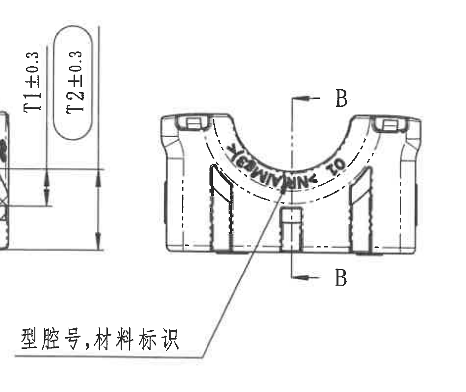

原图位置/视图名称：第 1 页右中部标识主视图，bbox `[3710, 920, 4660, 1720]`。

| 提取项 | 原图数值或文本 | 含义说明 |
|---|---|---|
| 剖切标记 | B / B | 两处 B 标记和箭头定义 B-B 剖切位置，对应 object_6。 |
| 引线说明 | 型腔号,材料标识 | 引线指向弧面文字/标识区域，说明该位置需要形成型腔号和材料标识。 |
| 弧形标识 | 弧面字符/标识，原图可见 | 弧面上有沿圆弧布置的材料/型腔标识字符；扫描质量下具体字符不稳定，按图示位置保留。 |
| 隐线 | 多条虚线 | 表示内部结构、圆弧或槽位。 |

边界归属说明：为完整保留 `型腔号,材料标识` 引线文字，左侧边缘带入了 object_6 的 T1/T2 尺寸残留；这些尺寸归属 B-B 剖面，不在本对象提取表中重复提取。本对象只提取 B/B 剖切标记和材料/型腔标识引线。

## object_8 - 底部俯视图

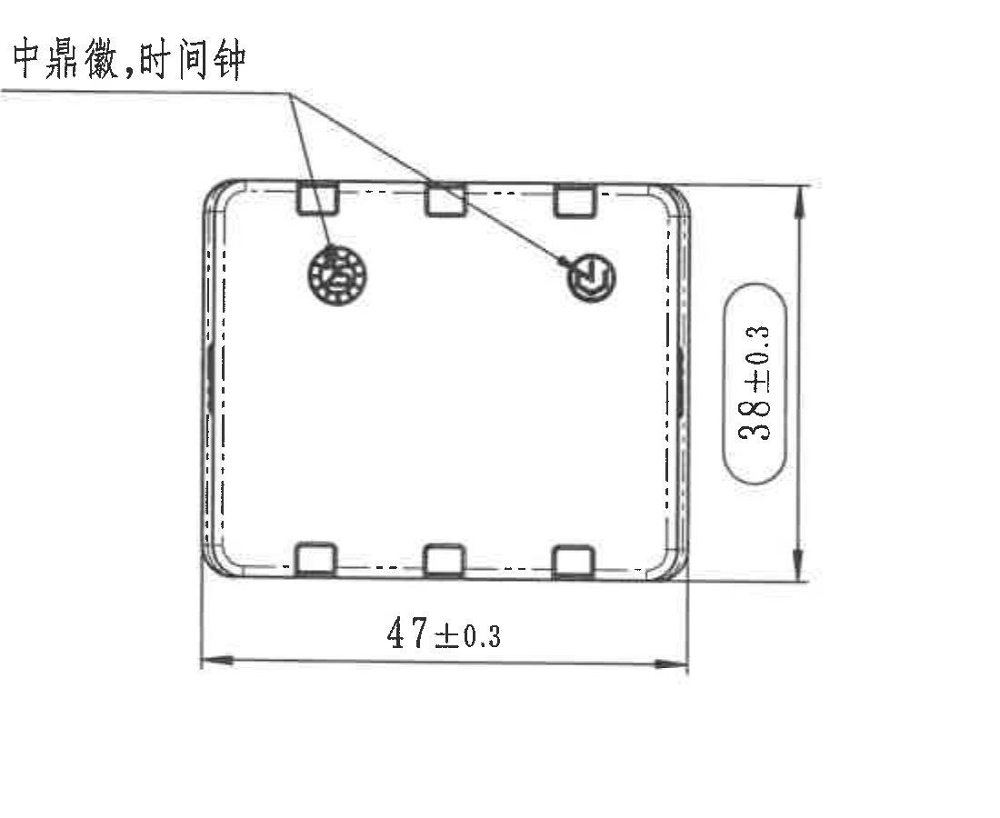

原图位置/视图名称：第 1 页中下部俯视图，bbox `[2150, 1600, 3250, 2500]`。

| 提取项 | 原图数值或文本 | 含义说明 |
|---|---|---|
| 引线说明 | 中鼎徽,时间钟 | 两条引线指向上侧圆形标识位置，表示需设置中鼎徽标和时间钟标识。 |
| 长度尺寸 | 47±0.3 | 底部水平总长尺寸，带 ±0.3 公差。 |
| 宽度尺寸 | 38±0.3 | 右侧竖向总宽尺寸，带 ±0.3 公差。 |
| 周边特征 | 多个矩形凸/凹位 | 俯视显示周边槽位/定位结构。 |
| 隐线 | 内侧虚线框 | 表示内轮廓或背面不可见边界。 |

边界归属说明：裁切完整包含俯视图外轮廓、`47±0.3`、`38±0.3` 尺寸线与 `中鼎徽,时间钟` 引线。未包含上方 A-A/B-B 剖面尺寸。

## object_9 - 局部 Z / 等轴辅助视图

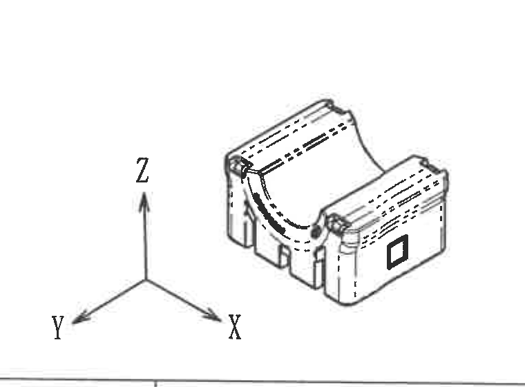

原图位置/视图名称：第 1 页右下部局部 Z/等轴视图，bbox `[4000, 1980, 4760, 2540]`。

| 提取项 | 原图数值或文本 | 含义说明 |
|---|---|---|
| 坐标轴 | X、Y、Z | 等轴/三维方向指示，说明零件方向。 |
| 局部视图 | 稳定杆衬套等轴外形 | 显示零件整体三维形状、弧形内腔、侧面方形标识位和底部结构。 |
| 尺寸标注 | 无独立尺寸文字 | 该局部图用于形状和方向说明，没有单独尺寸线。 |

边界归属说明：裁切保留 X/Y/Z 坐标轴和等轴视图；底部仅有标题栏上边框线残留，无标题栏字段文字，不提取为表格内容。

## object_10 - NOTES / 技术要求

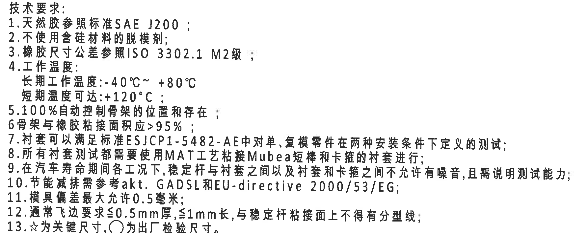

原图位置/视图名称：第 1 页左下部技术要求，bbox `[400, 1960, 2180, 2670]`。

原文还原：

1. 天然胶参照标准SAE J200；
2. 不使用含硅材料的脱模剂；
3. 橡胶尺寸公差参照ISO 3302.1 M2级；
4. 工作温度：长期工作温度:-40°C~ +80°C；短期温度可达:+120°C；
5. 100%自动控制骨架的位置和存在；
6. 骨架与橡胶粘接面积应>95%；
7. 衬套可以满足标准ESJCP1-5482-AE中对单、复模零件在两种安装条件下定义的测试；
8. 所有衬套测试都需要使用MAT工艺粘接Mubea短棒和卡箍的衬套进行；
9. 在汽车寿命期间各工况下，稳定杆与衬套之间以及衬套和卡箍之间不允许有噪音，且需说明测试能力；
10. 节能减排需参考aKt. GADSL和EU-directive 2000/53/EG；
11. 模具偏差最大允许0.5毫米；
12. 通常飞边要求≤0.5mm厚,≤1mm长,与稳定杆粘接面上不得有分型线；
13. ☆为关键尺寸,○为出厂检验尺寸。

| 提取项 | 原图数值或文本 | 含义说明 |
|---|---|---|
| 橡胶标准 | SAE J200 | 天然胶参照标准。 |
| 脱模剂限制 | 不使用含硅材料的脱模剂 | 工艺材料限制。 |
| 橡胶尺寸公差 | ISO 3302.1 M2级 | 橡胶尺寸默认公差等级。 |
| 工作温度 | -40°C~+80°C；短期 +120°C | 长期和短期温度要求。 |
| 骨架检测 | 100%自动控制骨架的位置和存在 | 骨架位置/存在性全检要求。 |
| 粘接面积 | >95% | 骨架与橡胶粘接面积要求。 |
| 测试标准 | ESJCP1-5482-AE | 衬套测试标准。 |
| 测试工艺 | MAT工艺粘接Mubea短棒和卡箍 | 测试样件/工艺要求。 |
| 噪音要求 | 不允许有噪音，需说明测试能力 | 寿命期间各工况 NVH 要求。 |
| 法规/清单 | aKt. GADSL和EU-directive 2000/53/EG | 节能减排和材料合规参考。 |
| 模具偏差 | 最大允许0.5毫米 | 模具偏差限制。 |
| 飞边要求 | ≤0.5mm厚,≤1mm长 | 飞边尺寸和粘接面分型线限制。 |
| 关键符号 | ☆为关键尺寸,○为出厂检验尺寸 | 解释主视图中的星号关键尺寸和圆圈检验尺寸。 |

边界归属说明：裁切只包含技术要求 1-13 条；下方 DIN ISO 3302-1 M2 class 表格已单独作为 object_11，不归入 NOTES。

## object_11 - DIN ISO 3302-1 M2 class 表

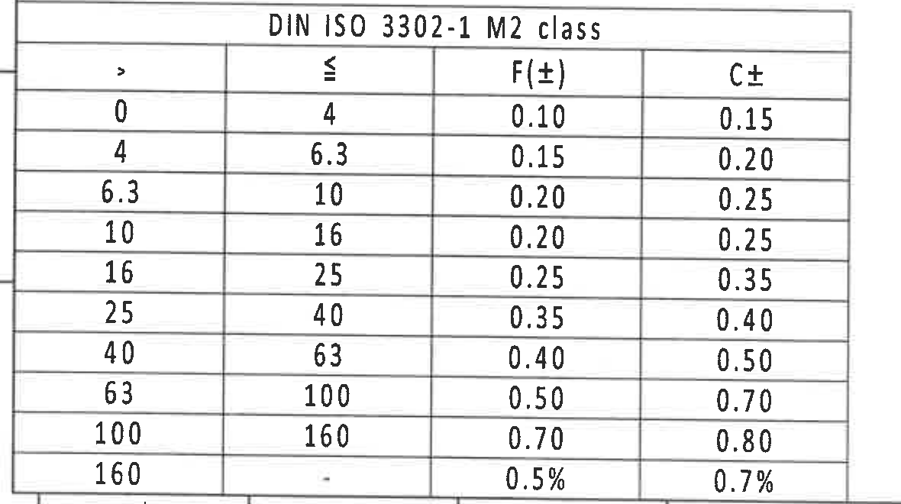

原图位置/视图名称：第 1 页左下角 DIN ISO 3302-1 M2 class 公差表，bbox `[350, 2700, 1530, 3360]`。

原表还原：

| DIN ISO 3302-1 M2 class |  |  |  |
|---|---|---|---|
| > | ≤ | F(±) | C± |
| 0 | 4 | 0.10 | 0.15 |
| 4 | 6.3 | 0.15 | 0.20 |
| 6.3 | 10 | 0.20 | 0.25 |
| 10 | 16 | 0.20 | 0.25 |
| 16 | 25 | 0.25 | 0.35 |
| 25 | 40 | 0.35 | 0.40 |
| 40 | 63 | 0.40 | 0.50 |
| 63 | 100 | 0.50 | 0.70 |
| 100 | 160 | 0.70 | 0.80 |
| 160 | - | 0.5% | 0.7% |

| 提取项 | 原图数值或文本 | 含义说明 |
|---|---|---|
| 表格标准 | DIN ISO 3302-1 M2 class | NOTES 第 3 条所引用的橡胶尺寸公差表。 |
| 列名 | >、≤、F(±)、C± | 尺寸区间和两类公差。 |
| 最小区间 | 0 到 4：F±0.10，C±0.15 | 小尺寸区间公差。 |
| 最大区间 | 160 以上：F±0.5%，C±0.7% | 大尺寸区间按百分比公差。 |

边界归属说明：裁切包含完整公差表标题、表头和 10 行数据；底部仅有少量图框线残留，未包含图框坐标数字。

## object_12 - Reference 参考标准

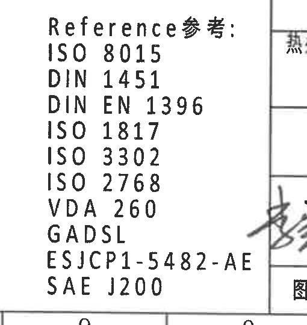

原图位置/视图名称：第 1 页下中部 Reference 参考标准块，bbox `[2310, 2850, 2820, 3390]`。

| 提取项 | 原图数值或文本 | 含义说明 |
|---|---|---|
| 标题 | Reference参考: | 标准引用列表标题。 |
| 参考标准 | ISO 8015 | 引用标准。 |
| 参考标准 | DIN 1451 | 引用标准。 |
| 参考标准 | DIN EN 1396 | 引用标准。 |
| 参考标准 | ISO 1817 | 引用标准。 |
| 参考标准 | ISO 3302 | 引用标准。 |
| 参考标准 | ISO 2768 | 引用标准。 |
| 参考标准 | VDA 260 | 引用标准。 |
| 参考标准 | GADSL | 引用清单/标准。 |
| 参考标准 | ESJCP1-5482-AE | 引用测试/客户标准。 |
| 参考标准 | SAE J200 | 橡胶材料相关标准。 |

边界归属说明：为保证 `ESJCP1-5482-AE` 完整，右侧保留了标题栏签字区边线和少量签字残影；这些残影属于 object_14 标题栏，不作为参考标准提取。

## object_13 - BOM / 组件明细表

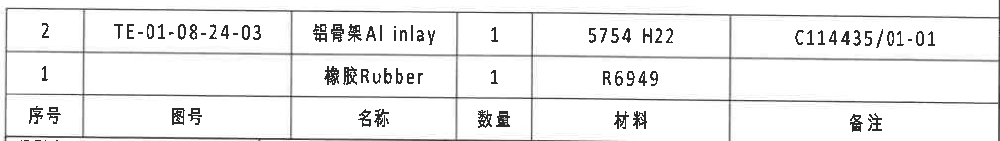

原图位置/视图名称：第 1 页右下标题栏上方 BOM/组件明细表，bbox `[2750, 2500, 4770, 2785]`。

原表还原：

| 序号 | 图号 | 名称 | 数量 | 材料 | 备注 |
|---|---|---|---|---|---|
| 2 | TE-01-08-24-03 | 铝骨架 Al inlay | 1 | 5754 H22 | C114435/01-01 |
| 1 |  | 橡胶 Rubber | 1 | R6949 |  |

| 提取项 | 原图数值或文本 | 含义说明 |
|---|---|---|
| 零件 2 图号 | TE-01-08-24-03 | 铝骨架零件号。 |
| 零件 2 名称 | 铝骨架 Al inlay | 金属嵌件/骨架。 |
| 零件 2 数量 | 1 | 装配数量。 |
| 零件 2 材料 | 5754 H22 | 铝材状态/材料。 |
| 零件 2 备注 | C114435/01-01 | 备注图号或关联编号。 |
| 零件 1 名称 | 橡胶 Rubber | 橡胶件。 |
| 零件 1 数量 | 1 | 装配数量。 |
| 零件 1 材料 | R6949 | 橡胶配方。 |

边界归属说明：裁切只包含 BOM 表头和两条物料行；下方投影法/比例/质量等标题栏字段已单独归入 object_14。

## object_14 - 标题栏

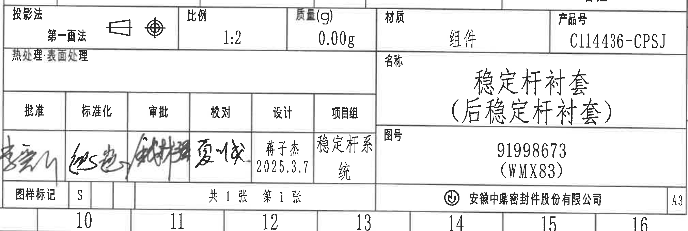

原图位置/视图名称：第 1 页右下角标题栏，bbox `[2750, 2760, 4770, 3440]`。

原表还原：

| 字段 | 原图文本 |
|---|---|
| 投影法 | 第一画法 |
| 比例 | 1:2 |
| 质量(g) | 0.00g |
| 材质 | 组件 |
| 产品号 | C114436-CPSJ |
| 热处理·表面处理 | 空白 |
| 名称 | 稳定杆衬套（后稳定杆衬套） |
| 图号 | 91998673 (WMX83) |
| 批准 | 手写签名，原图可见但无法稳定转录 |
| 标准化 | 手写签名，原图可见但无法稳定转录 |
| 审批 | 手写签名，原图可见但无法稳定转录 |
| 校对 | 手写签名，原图可见但无法稳定转录 |
| 设计 | 蒋子杰 2025.3.7 |
| 项目组 | 稳定杆系统 |
| 图样标记 | S |
| 页码 | 共 1 张 第 1 张 |
| 公司 | 安徽中鼎密封件股份有限公司 |
| 图幅 | A3 |

| 提取项 | 原图数值或文本 | 含义说明 |
|---|---|---|
| 产品名称 | 稳定杆衬套（后稳定杆衬套） | 图纸零件/组件名称。 |
| 图号 | 91998673 (WMX83) | 主图号/识别号。 |
| 产品号 | C114436-CPSJ | 产品号。 |
| 材质 | 组件 | 表示此图为组件。 |
| 比例 | 1:2 | 图样比例。 |
| 质量 | 0.00g | 标题栏质量字段。 |
| 投影法 | 第一画法 | 投影视图方法。 |
| 设计 | 蒋子杰 2025.3.7 | 设计者和日期。 |
| 项目组 | 稳定杆系统 | 归属项目组。 |
| 图样标记 | S | 图样状态/标记。 |
| 图幅 | A3 | 图纸幅面。 |

边界归属说明：裁切包含完整标题栏字段；上边缘有 BOM 表底线，底部有图框坐标 10-16 残留。BOM 明细已归入 object_13，不在本标题栏重复提取。

## 裁切检查记录

| 对象 | 图片路径 | 检查结果 | 边界归属检查 |
|---|---|---|---|
| page_1 | outputs/20C114436_assets/images/page_1.png | 整页渲染完整，4959 x 3505 px。 | 包含全部图框、视图、表格、NOTES 和标题栏。 |
| object_1 | outputs/20C114436_assets/images/object_1.png | 修订履历表头、数据行文字完整。 | 下边缘参数表残留已排除。 |
| object_2 | outputs/20C114436_assets/images/object_2.png | 参数表列头、5 行数据和跨行字段完整。 | 图框坐标字母残留已排除。 |
| object_3 | outputs/20C114436_assets/images/object_3.png | 主视图 `ØEر0.3☆`、`(0.5)`、`45±0.3` 尺寸线和文字完整。 | 未混入侧视图 Variant 引线。 |
| object_4 | outputs/20C114436_assets/images/object_4.png | 侧视图 A/A 标记、`24.5±0.3`、`Variant(见表格)` 引线完整。 | 左上/右下相邻残留已在对象说明中排除。 |
| object_5 | outputs/20C114436_assets/images/object_5.png | A-A 剖面、`(0.75)`、RIR/RAR 引线完整。 | 未混入俯视图文字。 |
| object_6 | outputs/20C114436_assets/images/object_6.png | B-B 剖面、`(33.87)`、`(B)`、T1/T2 尺寸线和文字完整。 | 未提取右侧标识视图文字。 |
| object_7 | outputs/20C114436_assets/images/object_7.png | B/B 剖切标记和 `型腔号,材料标识` 引线完整。 | 左侧 T1/T2 残留属于 object_6，已排除。 |
| object_8 | outputs/20C114436_assets/images/object_8.png | 俯视图 `47±0.3`、`38±0.3`、`中鼎徽,时间钟` 引线完整。 | 无其他视图尺寸混入。 |
| object_9 | outputs/20C114436_assets/images/object_9.png | 局部 Z/等轴图和 X/Y/Z 坐标轴完整。 | 底部标题栏线残留无文字，未提取。 |
| object_10 | outputs/20C114436_assets/images/object_10.png | 技术要求 1-13 条完整。 | 下方公差表已分离为 object_11。 |
| object_11 | outputs/20C114436_assets/images/object_11.png | DIN ISO 3302-1 M2 表头和 10 行数据完整。 | 底部图框线残留未提取。 |
| object_12 | outputs/20C114436_assets/images/object_12.png | Reference 标题和 10 条标准完整。 | 右侧标题栏残影已排除。 |
| object_13 | outputs/20C114436_assets/images/object_13.png | BOM 表头和两条物料行完整。 | 下方标题栏字段已分离为 object_14。 |
| object_14 | outputs/20C114436_assets/images/object_14.png | 标题栏字段完整，手写签名保持图像证据。 | 上方 BOM 底线和底部图框坐标残留已排除。 |
