# 20C114437 内容识别结果

源文件：`input/20C114437.pdf`  
整页渲染图：`20C114437_assets/images/page_1.png`  
整页像素：4959 x 3505

## object_14：右上修订履历表

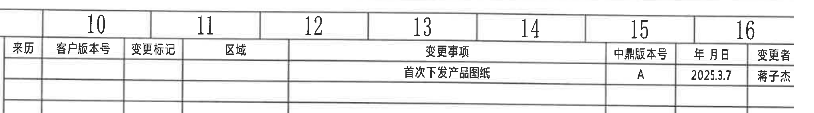

原图位置/视图名称：第 1 页右上修订履历表，bbox `[2770, 110, 4810, 395]`。

原表还原：

| 来历 | 客户版本号 | 变更标记 | 区域 | 变更事项 | 中鼎版本号 | 年月日 | 变更者 |
|---|---|---|---|---|---|---|---|
|  |  |  |  | 首次下发产品图纸 | A | 2025.3.7 | 蒋子杰 |
|  |  |  |  |  |  |  |  |
|  |  |  |  |  |  |  |  |

字段映射表：

| REV(中鼎版本号) | DESCRIPTION(变更事项) | LOC(区域) | BY(变更者) | DATE(年月日) | ECN NO | 说明 |
|---|---|---|---|---|---|---|
| A | 首次下发产品图纸 | 原图空白 | 蒋子杰 | 2025.3.7 | 原图无独立 ECN NO 列 | 初次下发产品图纸的修订记录 |

| 提取项 | 原图数值或文本 | 含义说明 |
|---|---|---|
| 修订版本 | A | 中鼎版本号/REV |
| 变更事项 | 首次下发产品图纸 | 本次变更说明 |
| 日期 | 2025.3.7 | 修订日期 |
| 变更者 | 蒋子杰 | 变更责任人 |

边界归属说明：该对象仅提取右上修订履历表；右侧图框坐标字母和下方参数表表头未归入本对象。

## object_1：Variant 参数总表

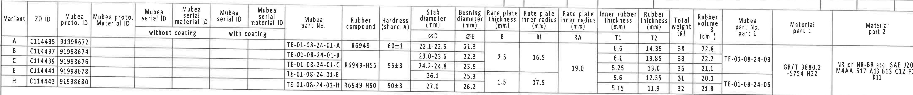

原图位置/视图名称：第 1 页上方 Variant/材料/尺寸参数总表，bbox `[375, 380, 4730, 835]`。

原表还原：

| Variant | ZD ID | Mubea proto. ID | Mubea proto. Material ID | Mubea serial ID without coating | Mubea serial material ID without coating | Mubea serial ID with coating | Mubea serial material ID with coating | Mubea part No. | Rubber compound | Hardness (shore A) | Stab diameter ØD (mm) | Bushing diameter ØE (mm) | Rate plate thickness B (mm) | Rate plate inner radius RI (mm) | Rate plate inner radius RA (mm) | Inner rubber thickness T1 (mm) | Rubber thickness T2 (mm) | Total weight (g) | Rubber volume (cm3) | Mubea part No. part 1 | Material part 1 | Material part 2 |
|---|---|---|---|---|---|---|---|---|---|---|---|---|---|---|---|---|---|---|---|---|---|---|
| A | C114435 | 91998672 |  |  |  |  |  | TE-01-08-24-01-A | R6949 | 60±3 | 22.1-22.5 | 21.3 |  |  |  | 6.6 | 14.35 | 38 | 22.8 |  |  |  |
| B | C114437 | 91998674 |  |  |  |  |  | TE-01-08-24-01-B | R6949-H55 | 55±3 | 23.0-23.6 | 22.3 | 2.5 | 16.5 |  | 6.1 | 13.85 | 38 | 22.2 | TE-01-08-24-03 |  |  |
| C | C114439 | 91998676 |  |  |  |  |  | TE-01-08-24-01-C | R6949-H55 | 55±3 | 24.2-24.8 | 23.5 | 2.5 | 16.5 | 19.0 | 5.25 | 13.0 | 36 | 21.1 | TE-01-08-24-03 | GB/T 3880.2 -5754-H22 | NR or NR-BR acc. SAE J200 M4AA 617 A13 B13 C12 F17 K11 |
| E | C114441 | 91998678 |  |  |  |  |  | TE-01-08-24-01-E | R6949-H55 | 55±3 | 26.1 | 25.3 | 1.5 | 17.5 | 19.0 | 5.6 | 12.35 | 31 | 20.1 | TE-01-08-24-05 | GB/T 3880.2 -5754-H22 | NR or NR-BR acc. SAE J200 M4AA 617 A13 B13 C12 F17 K11 |
| H | C114443 | 91998680 |  |  |  |  |  | TE-01-08-24-01-H | R6949-H50 | 50±3 | 27.0 | 26.2 | 1.5 | 17.5 |  | 5.15 | 11.9 | 32 | 21.8 | TE-01-08-24-05 |  |  |

| 提取项 | 原图数值或文本 | 含义说明 |
|---|---|---|
| Variant 行 | A, B, C, E, H | 不同变型对应不同 ZD ID、Mubea ID、胶料和尺寸 |
| ØD | A 22.1-22.5; B 23.0-23.6; C 24.2-24.8; E 26.1; H 27.0 | 稳定杆杆径/弧形内径相关尺寸，供右端面视图 `ØD` 和“杆径,图号(见表格)”引用 |
| ØE | A 21.3; B 22.3; C 23.5; E 25.3; H 26.2 | 衬套直径 E，供主视图关键尺寸 `ØE±0.3☆` 引用 |
| B | B/C 为 2.5; E/H 为 1.5 | Rate plate thickness，表内合并单元格值；B-B 剖视中以 `(B)` 标识引用 |
| RI | B/C 为 16.5; E/H 为 17.5 | Rate plate inner radius，A-A 剖视中 `RIR` 的表格来源 |
| RA | C/E 区域为 19.0 | Rate plate inner radius，A-A 剖视中 `RAR` 的表格来源 |
| T1 | A 6.6; B 6.1; C 5.25; E 5.6; H 5.15 | Inner rubber thickness，B-B 剖视 `T1±0.3` 的表格来源 |
| T2 | A 14.35; B 13.85; C 13.0; E 12.35; H 11.9 | Rubber thickness，B-B 剖视 `T2±0.3` 的表格来源 |
| Material part 1 | GB/T 3880.2 -5754-H22 | 铝骨架材料 |
| Material part 2 | NR or NR-BR acc. SAE J200 M4AA 617 A13 B13 C12 F17 K11 | 橡胶材料规范 |

边界归属说明：该对象只提取上方 Variant 参数表。右上修订履历表另列为 `object_14`；图框坐标字母未作为参数表内容提取。

## object_2：左侧主视图

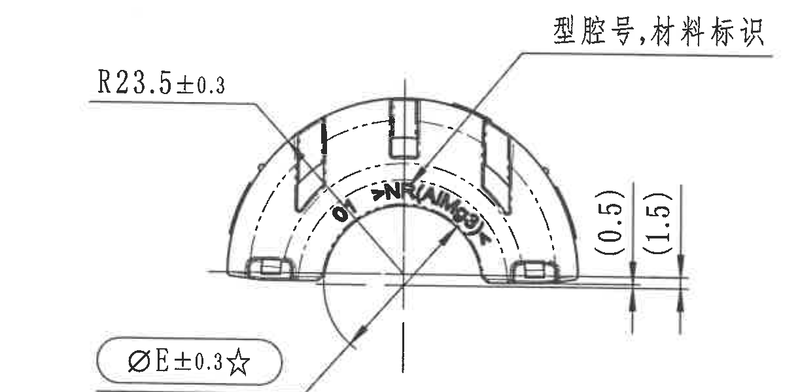

原图位置/视图名称：第 1 页中左主视图，bbox `[420, 1015, 1640, 1615]`。

| 提取项 | 原图数值或文本 | 含义说明 |
|---|---|---|
| 弧度/半径 | R23.5±0.3 | 主视图外弧半径，公差 ±0.3 |
| 关键直径 | ØE±0.3☆ | 直径 E，关键尺寸；E 的名义值见 `object_1` 参数表 ØE 列，星号含义见技术要求 13 |
| 参考尺寸 | (0.5) | 括号内参考尺寸，表示主视图右侧台阶/边缘相对位置，仅参考 |
| 参考尺寸 | (1.5) | 括号内参考尺寸，表示主视图右侧较大台阶/边缘相对位置，仅参考 |
| 标识说明 | 型腔号,材料标识 | 引出线指向上部标识区域，说明该处用于模腔号和材料标识 |
| 未见项目 | 角度、数量前缀、T 编号 | 当前主视图未标出角度、数量前缀或 T 编号 |

边界归属说明：`R23.5±0.3`、`ØE±0.3☆`、`(0.5)`、`(1.5)` 和“型腔号,材料标识”箭头均落在主视图；相邻侧视图的 `Variant(见表格)` 未归入本对象。

## object_3：侧视图 / A-A 剖切位置

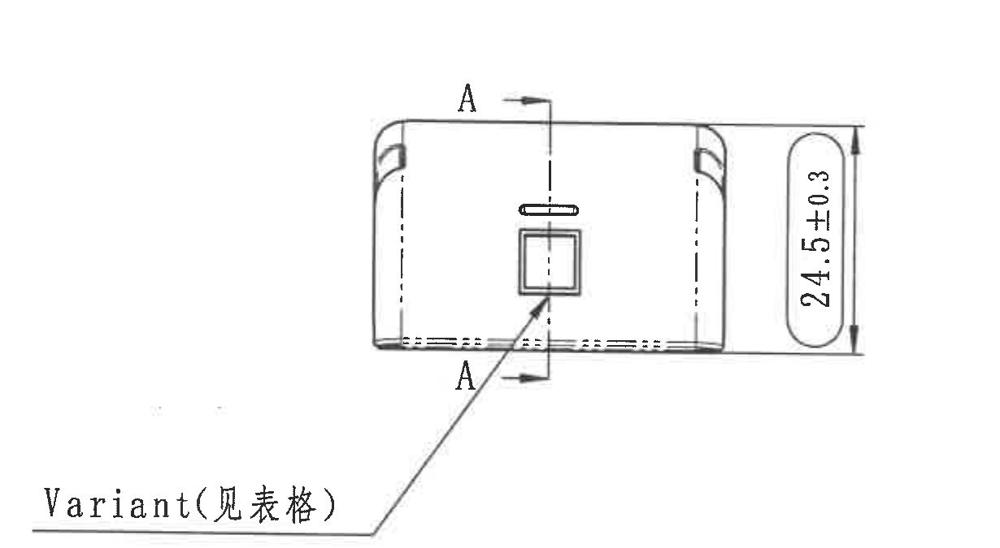

原图位置/视图名称：第 1 页中部侧视图，bbox `[1190, 1025, 2420, 1700]`。

| 提取项 | 原图数值或文本 | 含义说明 |
|---|---|---|
| 总高度 | 24.5±0.3 | 侧视图竖向总高度尺寸，公差 ±0.3 |
| 剖切基准字母 | A / A | 上下剖切箭头标识，定义 A-A 剖视位置 |
| 变型说明 | Variant(见表格) | 引出线指向侧视图方形窗口，说明变型信息从 `object_1` Variant 表读取 |
| 未见项目 | 角度、数量前缀、T 编号、弧长尺寸 | 当前侧视图未标出这些项目 |

边界归属说明：`Variant(见表格)` 的箭头落点在本侧视图方形窗口，因此归入本对象；左主视图参考尺寸和下方平面视图“中鼎徽,时间钟”说明不归入本对象。

## object_4：A-A 剖面视图

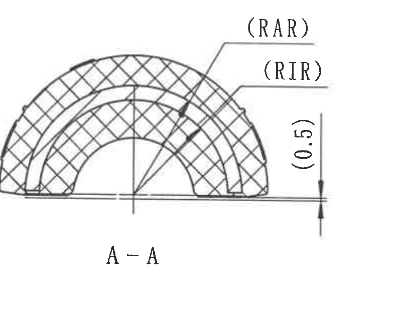

原图位置/视图名称：第 1 页中部 A-A 剖面视图，bbox `[2390, 1075, 3175, 1745]`。

| 提取项 | 原图数值或文本 | 含义说明 |
|---|---|---|
| 剖面名称 | A-A | 与侧视图 `A` 剖切箭头对应的剖视 |
| 弧度/半径标识 | (RAR) | 括号内参考标识，指向外侧弧形/半径相关位置；对应 `object_1` 表中 RA/RAR 相关参数 |
| 弧度/半径标识 | (RIR) | 括号内参考标识，指向内侧弧形/半径相关位置；对应 `object_1` 表中 RI/RIR 相关参数 |
| 参考尺寸 | (0.5) | 括号内参考尺寸，位于右下竖向小尺寸标注，仅参考 |
| 未见项目 | 角度、数量前缀、T 编号 | 当前 A-A 剖视未标出这些项目 |

边界归属说明：`(RAR)`、`(RIR)` 引出线均指向 A-A 剖面弧形区域；右侧 B-B 剖视和左侧侧视图尺寸未归入本对象。

## object_5：B-B 剖面视图

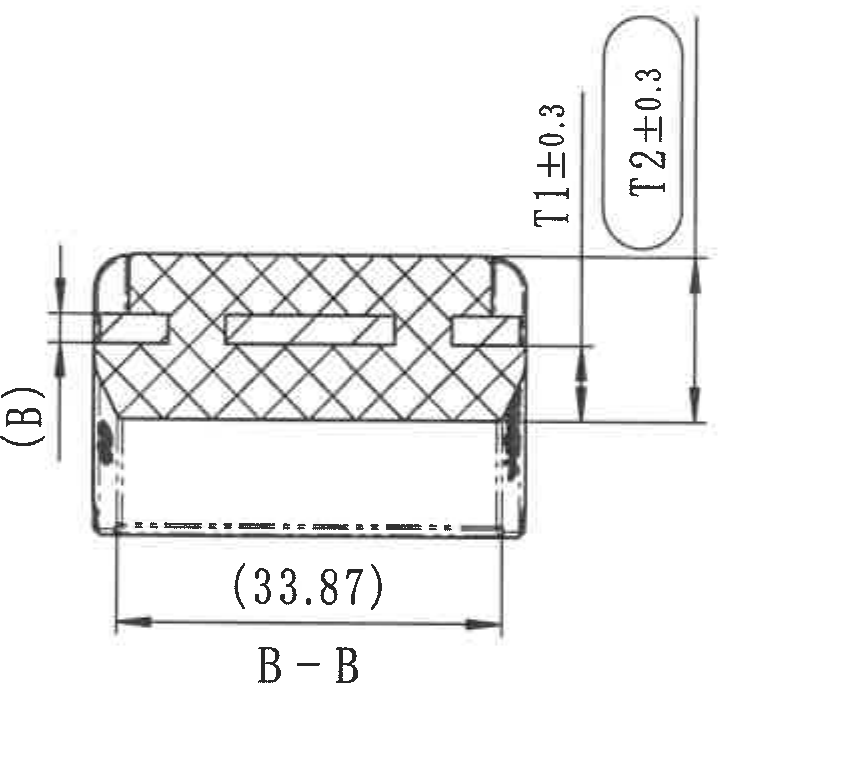

原图位置/视图名称：第 1 页中右 B-B 剖面视图，bbox `[3185, 940, 4035, 1720]`。

| 提取项 | 原图数值或文本 | 含义说明 |
|---|---|---|
| 剖面名称 | B-B | 与右端面视图 `B` 剖切箭头对应的剖视 |
| T 编号尺寸 | T1±0.3 | 内橡胶厚度尺寸，名义值见 `object_1` 表 T1 列，公差 ±0.3 |
| T 编号尺寸 | T2±0.3 | 橡胶厚度尺寸，名义值见 `object_1` 表 T2 列，公差 ±0.3 |
| 参考尺寸 | (33.87) | 括号内参考宽度尺寸，位于 B-B 剖视底部，仅参考 |
| 表格引用 | (B) | 左侧括号标识，引用 `object_1` 表中的 Rate plate thickness B |
| 未见项目 | 角度、数量前缀、直径符号 | 当前 B-B 剖视未标出这些项目 |

边界归属说明：`T1±0.3`、`T2±0.3`、`(33.87)` 和 `(B)` 均属于 B-B 剖面。右端面视图的“杆径,图号(见表格)”说明已排除。

## object_6：右侧端面视图 / B-B 剖切位置

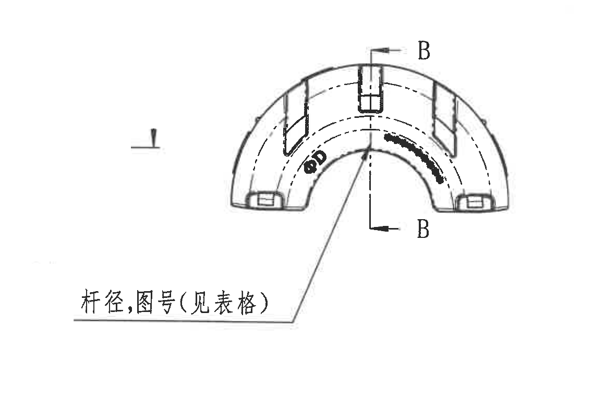

原图位置/视图名称：第 1 页右侧端面视图，bbox `[3585, 1080, 4745, 1885]`。

| 提取项 | 原图数值或文本 | 含义说明 |
|---|---|---|
| 剖切基准字母 | B / B | 上下剖切箭头标识，定义 B-B 剖视位置 |
| 直径标识 | ØD | 稳定杆杆径/直径 D，名义值见 `object_1` 表 ØD 列 |
| 表格引用 | 杆径,图号(见表格) | 引出线指向端面视图内弧区域，说明杆径和图号由参数表给出 |
| 未见项目 | 角度、数量前缀、T 编号、独立公差 | 当前端面视图未直接标出这些项目；ØD 数值由表格给出 |

边界归属说明：`ØD` 和“杆径,图号(见表格)”箭头落在右端面视图；左侧 B-B 剖视的 T2 尺寸残片未归入本对象。

## object_7：下方平面视图

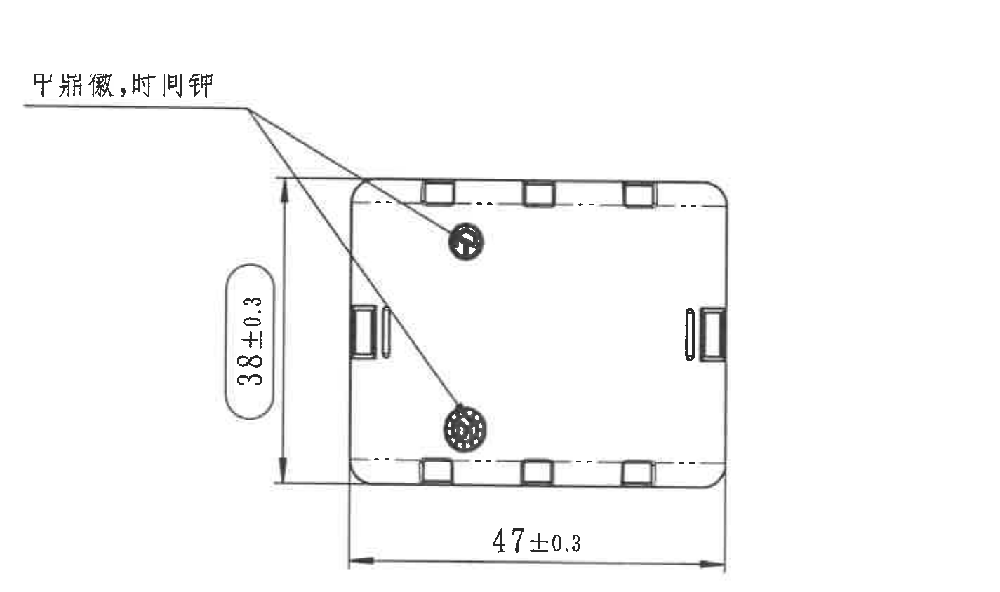

原图位置/视图名称：第 1 页中下平面视图，bbox `[1885, 1540, 3310, 2385]`。

| 提取项 | 原图数值或文本 | 含义说明 |
|---|---|---|
| 总宽度 | 47±0.3 | 平面视图水平外形尺寸，公差 ±0.3 |
| 总高度 | 38±0.3 | 平面视图竖向外形尺寸，公差 ±0.3 |
| 标识说明 | 中鼎徽,时间钟 | 引出线指向两个圆形标记，表示中鼎徽标和时间钟位置 |
| 未见项目 | 角度、数量前缀、T 编号、弧度/半径 | 当前平面视图未标出这些项目 |

边界归属说明：`38±0.3`、`47±0.3` 和“中鼎徽,时间钟”均属于平面视图；上方 A-A 剖视标签和左下技术要求文字未归入本对象。

## object_8：右下等轴测局部视图

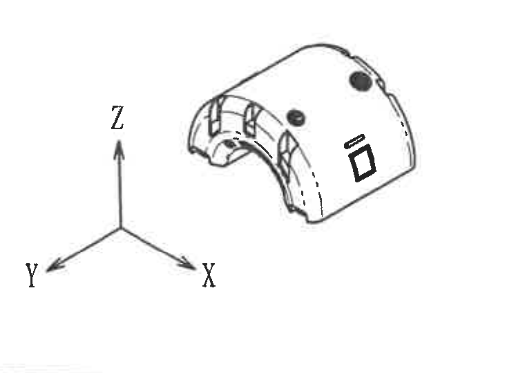

原图位置/视图名称：第 1 页右下等轴测局部视图，bbox `[3930, 1970, 4690, 2510]`。

| 提取项 | 原图数值或文本 | 含义说明 |
|---|---|---|
| 坐标轴 | X / Y / Z | 等轴测视图方向说明 |
| 局部外观 | 三维弧形衬套外观 | 显示端部、孔位、矩形凸台/标识等外观关系 |
| 未见项目 | 尺寸、角度、数量前缀、T 编号、公差 | 当前等轴测局部视图未标出尺寸数值 |

边界归属说明：坐标轴和等轴测图同属该局部视图；下方 BOM/标题栏表格未归入本对象。

## object_9：技术要求 NOTES

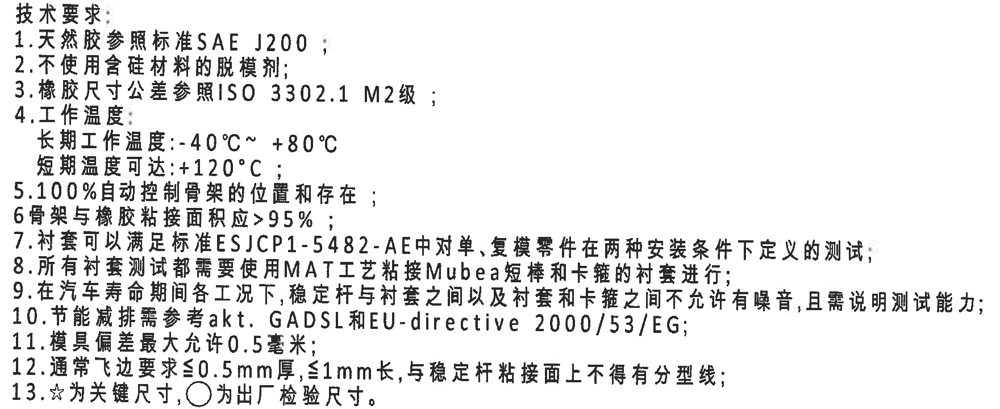

原图位置/视图名称：第 1 页左下技术要求，bbox `[405, 1930, 2165, 2650]`。

文本还原：

1. 天然胶参照标准 SAE J200；
2. 不使用含硅材料的脱模剂；
3. 橡胶尺寸公差参照 ISO 3302.1 M2级；
4. 工作温度：长期工作温度：-40℃~ +80℃；短期温度可达：+120℃；
5. 100%自动控制骨架的位置和存在；
6. 骨架与橡胶粘接面积应>95%；
7. 衬套可以满足标准 ESJCP1-5482-AE中对单、复模零件在两种安装条件下定义的测试；
8. 所有衬套测试都需要使用MAT工艺粘接Mubea短棒和卡箍的衬套进行；
9. 在汽车寿命期间各工况下，稳定杆与衬套之间以及衬套和卡箍之间不允许有噪音，且需说明测试能力；
10. 节能减排需参考akt. GADSL和EU-directive 2000/53/EG；
11. 模具偏差最大允许0.5毫米；
12. 通常飞边要求≤0.5mm厚，≤1mm长，与稳定杆粘接面上不得有分型线；
13. ☆为关键尺寸，○为出厂检验尺寸。

| 提取项 | 原图数值或文本 | 含义说明 |
|---|---|---|
| 关键尺寸符号 | ☆ | 技术要求 13：星号为关键尺寸；用于主视图 `ØE±0.3☆` |
| 出厂检验符号 | ○ | 技术要求 13：圆圈为出厂检验尺寸 |
| 橡胶尺寸公差 | ISO 3302.1 M2级 | 与 `object_10` DIN ISO 3302-1 M2 class 表对应 |
| 工作温度 | -40℃~ +80℃; +120℃ | 长期和短期温度范围 |
| 粘接面积 | >95% | 骨架与橡胶粘接面积要求 |
| 飞边要求 | ≤0.5mm 厚，≤1mm 长 | 外观/工艺限制 |

边界归属说明：该对象只包含技术要求 1-13；下方 DIN ISO 3302-1 M2 class 表格另列为 `object_10`。

## object_10：DIN ISO 3302-1 M2 class 公差表

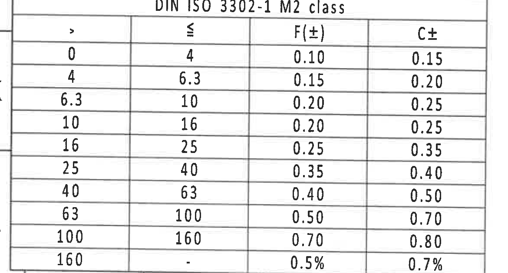

原图位置/视图名称：第 1 页左下 DIN ISO 3302-1 M2 class 表，bbox `[335, 2725, 1505, 3355]`。

原表还原：

| DIN ISO 3302-1 M2 class |  |  |  |
|---|---|---|---|
| > | ≤ | F(±) | C± |
| 0 | 4 | 0.10 | 0.15 |
| 4 | 6.3 | 0.15 | 0.20 |
| 6.3 | 10 | 0.20 | 0.25 |
| 10 | 16 | 0.20 | 0.25 |
| 16 | 25 | 0.25 | 0.35 |
| 25 | 40 | 0.35 | 0.40 |
| 40 | 63 | 0.40 | 0.50 |
| 63 | 100 | 0.50 | 0.70 |
| 100 | 160 | 0.70 | 0.80 |
| 160 | - | 0.5% | 0.7% |

| 提取项 | 原图数值或文本 | 含义说明 |
|---|---|---|
| 标准名称 | DIN ISO 3302-1 M2 class | 橡胶制品尺寸公差等级表 |
| F(±) | 0.10 至 0.70，末行 0.5% | F 类公差 |
| C± | 0.15 至 0.80，末行 0.7% | C 类公差 |

边界归属说明：左侧外框线为裁切余量，不作为表格字段；底部图框坐标编号未归入本对象。

## object_11：Reference 参考标准清单

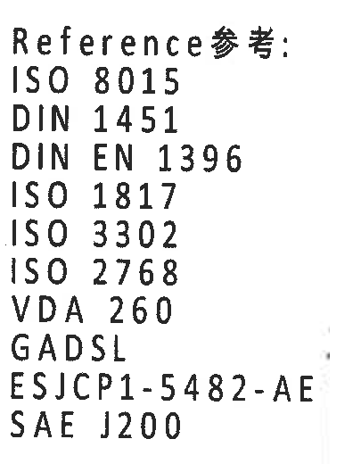

原图位置/视图名称：第 1 页下方参考标准清单，bbox `[2375, 2840, 2780, 3360]`。

文本还原：

| Reference参考 |
|---|
| ISO 8015 |
| DIN 1451 |
| DIN EN 1396 |
| ISO 1817 |
| ISO 3302 |
| ISO 2768 |
| VDA 260 |
| GADSL |
| ESJCP1-5482-AE |
| SAE J200 |

| 提取项 | 原图数值或文本 | 含义说明 |
|---|---|---|
| 参考标准 | ISO 8015; DIN 1451; DIN EN 1396; ISO 1817; ISO 3302; ISO 2768; VDA 260; GADSL; ESJCP1-5482-AE; SAE J200 | 图纸引用标准清单 |

边界归属说明：该对象只提取 Reference 参考清单；右侧标题栏签字栏未归入本对象。

## object_12：零件明细及产品属性表

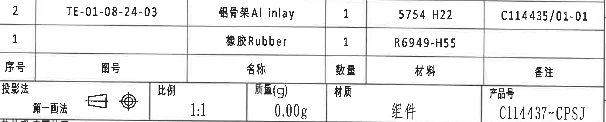

原图位置/视图名称：第 1 页右下零件明细及产品属性表，bbox `[2775, 2515, 4770, 2918]`。

明细表还原：

| 序号 | 图号 | 名称 | 数量 | 材料 | 备注 |
|---|---|---|---|---|---|
| 2 | TE-01-08-24-03 | 铝骨架 Al inlay | 1 | 5754 H22 | C114435/01-01 |
| 1 |  | 橡胶 Rubber | 1 | R6949-H55 |  |

产品属性行还原：

| 投影法 | 第一画法 | 比例 | 质量(g) | 材质 | 产品号 |
|---|---|---|---|---|---|
| 投影法图示 | 第一画法 | 1:1 | 0.00g | 组件 | C114437-CPSJ |

| 提取项 | 原图数值或文本 | 含义说明 |
|---|---|---|
| 铝骨架 | TE-01-08-24-03 / 铝骨架 Al inlay / 1 / 5754 H22 / C114435/01-01 | 零件 2，铝骨架明细 |
| 橡胶 | 橡胶 Rubber / 1 / R6949-H55 | 零件 1，橡胶明细 |
| 投影法 | 第一画法 | 图纸采用第一角法 |
| 比例 | 1:1 | 图纸比例 |
| 质量 | 0.00g | 图纸质量字段 |
| 材质 | 组件 | 产品材质/类型字段 |
| 产品号 | C114437-CPSJ | 产品号 |

边界归属说明：该对象还原右下明细表及其紧接的产品属性行。下方标题栏主体另列为 `object_13`；两者在原图中为连续表格结构。

## object_13：标题栏

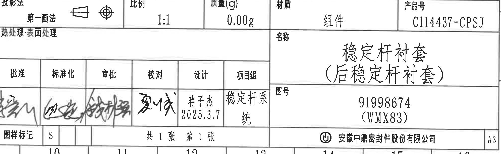

原图位置/视图名称：第 1 页右下标题栏主体，bbox `[2775, 2800, 4770, 3415]`。

标题栏还原：

| 字段 | 原图数值或文本 |
|---|---|
| 投影法 | 第一画法 |
| 比例 | 1:1 |
| 质量(g) | 0.00g |
| 材质 | 组件 |
| 产品号 | C114437-CPSJ |
| 热处理/表面处理 | 热处理:表面处理 |
| 名称 | 稳定杆衬套（后稳定杆衬套） |
| 图号 | 91998674（WMX83） |
| 批准 | 签名 |
| 标准化 | 签名 |
| 审批 | 签名 |
| 校对 | 签名 |
| 设计 | 蒋子杰 2025.3.7 |
| 项目组 | 稳定杆系统 |
| 图样标记 | S |
| 张数 | 共 1 张 第 1 张 |
| 公司 | 安徽中鼎密封件股份有限公司 |
| 图幅 | A3 |

| 提取项 | 原图数值或文本 | 含义说明 |
|---|---|---|
| 图纸名称 | 稳定杆衬套（后稳定杆衬套） | 零件名称 |
| 图号 | 91998674（WMX83） | 图纸编号/内部编号 |
| 产品号 | C114437-CPSJ | 产品号 |
| 设计 | 蒋子杰 2025.3.7 | 设计人员和日期 |
| 项目组 | 稳定杆系统 | 所属项目组 |
| 公司 | 安徽中鼎密封件股份有限公司 | 出图单位 |

边界归属说明：该对象为标题栏主体；左侧 Reference 清单和上方零件明细表分别归入 `object_11`、`object_12`。

## 裁切检查记录

| 对象 | 检查结果 | 处理记录 |
|---|---|---|
| page_1.png | 完整 | PDF 已整页渲染为 4959 x 3505 PNG |
| object_14 | 完整 | 修订表行列和文字完整；右侧图框坐标残片已排除 |
| object_1 | 完整 | Variant 参数表表头、跨行单元格、全部行完整；修订履历另裁 |
| object_2 | 完整 | 主视图尺寸线、箭头、`R23.5±0.3`、`ØE±0.3☆`、参考尺寸和引出说明完整；未混入侧视图标签 |
| object_3 | 完整 | 侧视图 `24.5±0.3`、A-A 剖切箭头和 `Variant(见表格)` 完整；相邻主视图/平面视图残片已排除 |
| object_4 | 完整 | A-A 剖面、`(RAR)`、`(RIR)`、`(0.5)` 完整 |
| object_5 | 完整 | B-B 剖面、`T1±0.3`、`T2±0.3`、`(33.87)`、`(B)` 完整；右端面说明未归入 |
| object_6 | 完整 | 右端面视图、`ØD`、B 剖切箭头和“杆径,图号(见表格)”完整；B-B 尺寸残片已排除 |
| object_7 | 完整 | 平面视图、`38±0.3`、`47±0.3` 和“中鼎徽,时间钟”完整；技术要求残字已排除 |
| object_8 | 完整 | 等轴测局部视图和 X/Y/Z 坐标轴完整；未带入下方 BOM 表格 |
| object_9 | 完整 | 技术要求 1-13 完整；未带入平面视图尺寸或下方公差表 |
| object_10 | 完整 | DIN ISO 3302-1 M2 class 表头、行列和底行完整；图框坐标编号未归入 |
| object_11 | 完整 | Reference 标准清单完整；右侧标题栏签字栏未归入 |
| object_12 | 完整 | 明细表和产品属性行完整；与标题栏连续处按对象边界分别提取 |
| object_13 | 完整 | 标题栏主体字段、签字栏、图名、图号、公司和 A3 图幅完整 |
