# 20C114438.pdf 内容识别

整页渲染图：

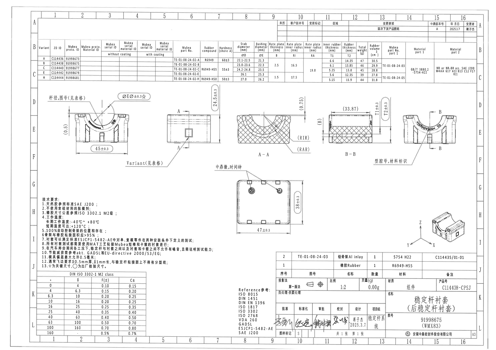

页面信息：1 页，整页 PNG 尺寸 4959 x 3505 px，PDF 原始页面 A3，渲染分辨率 300 dpi。

## object_1 - 修订履历表

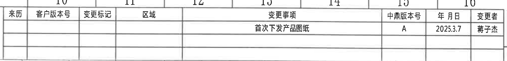

原图位置/视图名称：页 1 顶部右侧修订履历表，bbox = [2760, 175, 4780, 420]。

原表还原：

| 来历 | 客户版本号 | 变更标记 | 区域 | 变更事项 | 中鼎版本号 | 年月日 | 变更者 |
|---|---|---|---|---|---|---|---|
|  |  |  |  | 首次下发产品图纸 | A | 2025.3.7 | 蒋子杰 |
|  |  |  |  |  |  |  |  |
|  |  |  |  |  |  |  |  |

提取表格：

| 提取项 | 原图数值或文本 | 含义说明 |
|---|---|---|
| 变更事项 | 首次下发产品图纸 | 当前版本的变更说明。 |
| 中鼎版本号 | A | 中鼎内部版本号。 |
| 年月日 | 2025.3.7 | 修订日期。 |
| 变更者 | 蒋子杰 | 修订人员。 |

边界归属说明：裁切仅覆盖顶部右侧修订履历表；上侧保留表格列号 10-16 的局部边框以保证表头完整，未提取为修订内容。

## object_2 - 顶部变体参数表

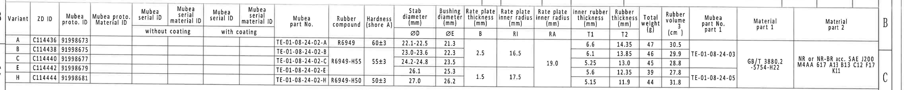

原图位置/视图名称：页 1 顶部主参数表，bbox = [350, 385, 4930, 840]。

原表还原：

| Variant | ZD ID | Mubea proto. ID | Mubea proto. Material ID | Mubea serial ID without coating | Mubea serial material ID without coating | Mubea serial ID with coating | Mubea serial material ID with coating | Mubea part No. | Rubber compound | Hardness (shore A) | Stab diameter ØD (mm) | Bushing diameter ØE (mm) | Rate plate thickness B (mm) | Rate plate inner radius RI (mm) | Rate plate inner radius RA (mm) | Inner rubber thickness T1 (mm) | Rubber thickness T2 (mm) | Total weight (g) | Rubber volume (cm³) | Mubea part No. part 1 | Material part 1 | Material part 2 |
|---|---|---|---|---|---|---|---|---|---|---|---|---|---|---|---|---|---|---|---|---|---|---|
| A | C114436 | 91998673 |  |  |  |  |  | TE-01-08-24-02-A | R6949 | 60±3 | 22.1-22.5 | 21.3 |  |  |  | 6.6 | 14.35 | 47 | 30.5 |  |  |  |
| B | C114438 | 91998675 |  |  |  |  |  | TE-01-08-24-02-B | R6949-H55 | 55±3 | 23.0-23.6 | 22.3 | 2.5 | 16.5 | 19.0 | 6.1 | 13.85 | 46 | 29.9 | TE-01-08-24-03 | GB/T 3880.2 -5754-H22 | NR or NR-BR acc. SAE J200 M4AA 617 A13 B13 C12 F17 K11 |
| C | C114440 | 91998677 |  |  |  |  |  | TE-01-08-24-02-C | R6949-H55 | 55±3 | 24.2-24.8 | 23.5 | 2.5 | 16.5 | 19.0 | 5.25 | 13.0 | 45 | 28.8 | TE-01-08-24-03 | GB/T 3880.2 -5754-H22 | NR or NR-BR acc. SAE J200 M4AA 617 A13 B13 C12 F17 K11 |
| E | C114442 | 91998679 |  |  |  |  |  | TE-01-08-24-02-E | R6949-H55 | 55±3 | 26.1 | 25.3 | 1.5 | 17.5 |  | 5.6 | 12.35 | 39 | 27.8 | TE-01-08-24-03 | GB/T 3880.2 -5754-H22 | NR or NR-BR acc. SAE J200 M4AA 617 A13 B13 C12 F17 K11 |
| H | C114444 | 91998681 |  |  |  |  |  | TE-01-08-24-02-H | R6949-H50 | 50±3 | 27.0 | 26.2 | 1.5 | 17.5 |  | 5.15 | 11.9 | 44 | 31.8 | TE-01-08-24-05 | GB/T 3880.2 -5754-H22 | NR or NR-BR acc. SAE J200 M4AA 617 A13 B13 C12 F17 K11 |

提取表格：

| 提取项 | 原图数值或文本 | 含义说明 |
|---|---|---|
| Variant A | ZD ID C114436；Mubea proto. ID 91998673；Mubea part No. TE-01-08-24-02-A | 变体 A 的识别号和 Mubea 零件号。 |
| Variant A 尺寸 | ØD 22.1-22.5；ØE 21.3；T1 6.6；T2 14.35；重量 47 g；体积 30.5 cm³ | 表格给出的杆径、衬套直径、厚度和质量/体积。 |
| Variant B | ZD ID C114438；Mubea proto. ID 91998675；Mubea part No. TE-01-08-24-02-B | 变体 B 的识别号和 Mubea 零件号。 |
| Variant B 尺寸 | ØD 23.0-23.6；ØE 22.3；B 2.5；RI 16.5；RA 19.0；T1 6.1；T2 13.85；重量 46 g；体积 29.9 cm³ | 表格给出的杆径、衬套直径、压板厚度、内半径和橡胶厚度。 |
| Variant C | ZD ID C114440；Mubea proto. ID 91998677；Mubea part No. TE-01-08-24-02-C | 变体 C 的识别号和 Mubea 零件号。 |
| Variant C 尺寸 | ØD 24.2-24.8；ØE 23.5；B 2.5；RI 16.5；RA 19.0；T1 5.25；T2 13.0；重量 45 g；体积 28.8 cm³ | 表格给出的杆径、衬套直径、压板厚度、内半径和橡胶厚度。 |
| Variant E | ZD ID C114442；Mubea proto. ID 91998679；Mubea part No. TE-01-08-24-02-E | 变体 E 的识别号和 Mubea 零件号。 |
| Variant E 尺寸 | ØD 26.1；ØE 25.3；B 1.5；RI 17.5；T1 5.6；T2 12.35；重量 39 g；体积 27.8 cm³ | 表格给出的杆径、衬套直径、压板厚度、内半径和橡胶厚度。 |
| Variant H | ZD ID C114444；Mubea proto. ID 91998681；Mubea part No. TE-01-08-24-02-H | 变体 H 的识别号和 Mubea 零件号。 |
| Variant H 尺寸 | ØD 27.0；ØE 26.2；B 1.5；RI 17.5；T1 5.15；T2 11.9；重量 44 g；体积 31.8 cm³ | 表格给出的杆径、衬套直径、压板厚度、内半径和橡胶厚度。 |
| Rubber compound | A: R6949；B/C/E: R6949-H55；H: R6949-H50 | 橡胶配方按变体区分。 |
| Hardness | A: 60±3；B/C/E: 55±3；H: 50±3 | 邵氏 A 硬度。 |
| Material part 1 | GB/T 3880.2 -5754-H22 | 铝骨架材料规范。 |
| Material part 2 | NR or NR-BR acc. SAE J200 M4AA 617 A13 B13 C12 F17 K11 | 橡胶材料规范。 |

边界归属说明：该裁切覆盖完整顶部参数表，右侧 Material part 2 已重裁纳入；下方视图不在本对象中。表格中合并单元格在 Markdown 中按相关变体展开，原图为跨行合并显示。

## object_3 - 左侧主前视图

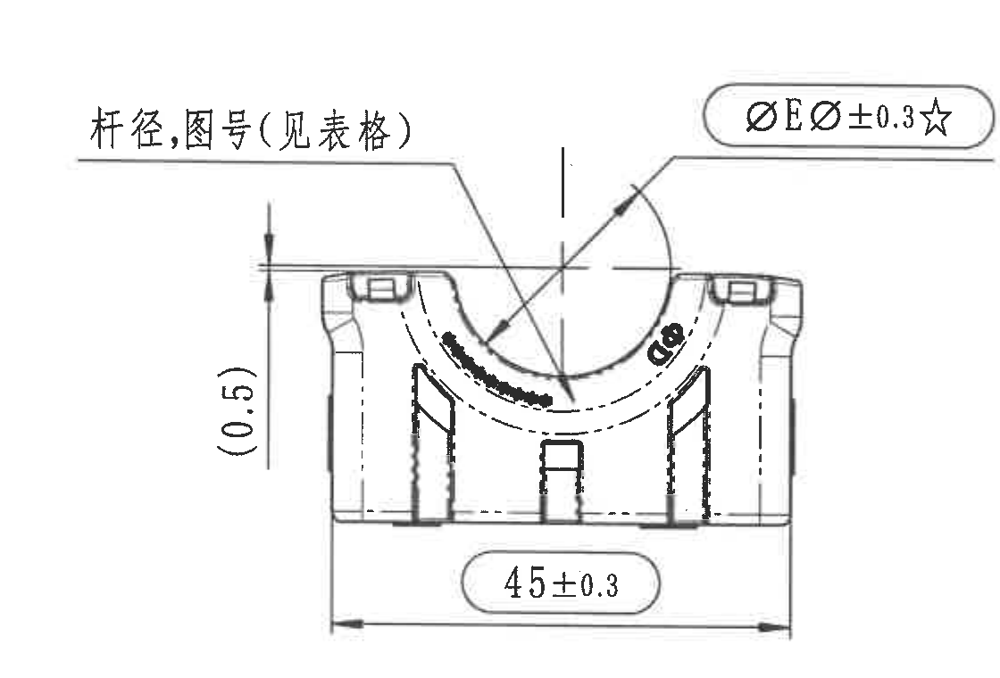

原图位置/视图名称：页 1 中部左侧主前视图，bbox = [390, 835, 1510, 1595]。

提取表格：

| 提取项 | 原图数值或文本 | 含义说明 |
|---|---|---|
| 宽度尺寸 | 45±0.3 | 主前视图底部总宽度，带双向尺寸线。 |
| 参考尺寸 | (0.5) | 左侧竖向括号参考尺寸，用括号表示参考尺寸，不作为直接公差控制尺寸。 |
| 表格引用 | 杆径,图号(见表格) | 指向内弧/杆径相关位置；具体杆径 ØD 和图号按顶部变体参数表读取。 |
| 关键检验尺寸 | ØE ر0.3☆ | 指向内弧/衬套直径位置；ØE 值按顶部表格变体读取，±0.3 为公差，☆表示关键尺寸。 |

边界归属说明：该裁切只包含左侧主前视图和与其连接的尺寸/引出说明；右下方跨到侧视图的 `Variant(见表格)` 引出文字未归入本对象，另见 object_16。

## object_4 - 侧视图 / A-A 剖切位置

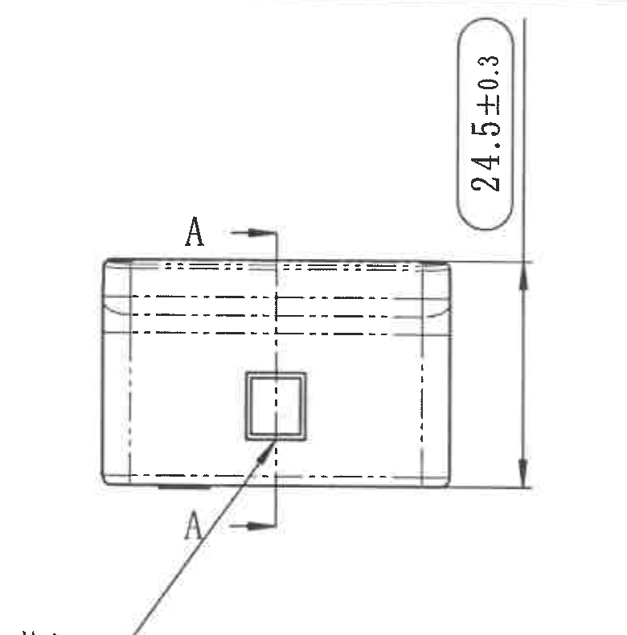

原图位置/视图名称：页 1 中部偏左侧视图，bbox = [1545, 825, 2325, 1615]。

提取表格：

| 提取项 | 原图数值或文本 | 含义说明 |
|---|---|---|
| 高度尺寸 | 24.5±0.3 | 侧视图右侧竖向总高度尺寸。 |
| 剖切标记 | A / A | 标识 A-A 剖切位置和方向，对应 object_5 的 A-A 剖视图。 |
| 中心/隐藏线 | 虚线、点划线 | 表示内部轮廓与中心位置。 |
| 方形特征 | 中部小方框 | 侧面局部结构/标记，未附数值尺寸。 |

边界归属说明：右侧 A-A 剖面图未带入；左下跨界的 `Variant(见表格)` 引出说明独立裁为 object_16，避免混入主前视图和侧视图。

## object_16 - Variant 引出说明

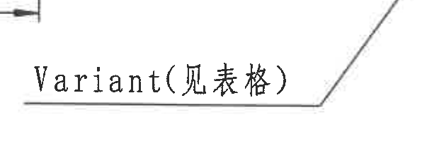

原图位置/视图名称：页 1 中部偏左，侧视图下方跨界局部注释，bbox = [1220, 1520, 1840, 1730]。

提取表格：

| 提取项 | 原图数值或文本 | 含义说明 |
|---|---|---|
| 引出文字 | Variant(见表格) | 表示对应侧视图/产品变体需按顶部参数表读取。 |
| 引出线 | 水平线转斜线 | 指向侧视图中部方形特征附近。 |

边界归属说明：该对象为跨界注释裁切；左上角保留极小尺寸线残端以避免裁掉 `Variant` 文字开头，该残端不作为本对象提取内容。

## object_5 - A-A 剖视图

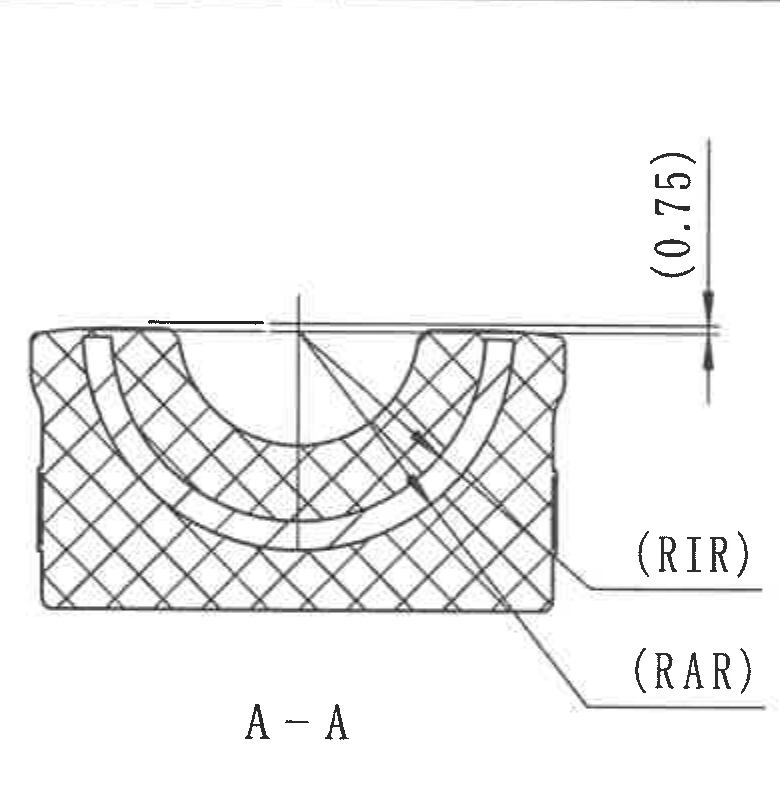

原图位置/视图名称：页 1 中部 A-A 剖视图，bbox = [2340, 825, 3120, 1625]。

提取表格：

| 提取项 | 原图数值或文本 | 含义说明 |
|---|---|---|
| 视图名 | A-A | 与 object_4 中的 A 剖切标记对应。 |
| 参考尺寸 | (0.75) | 顶部竖向括号参考尺寸，表示剖面上缘附近的参考间距/高度。 |
| 半径标记 | (RIR) | 指向内侧弧线；按顶部表格 RI/相关半径值读取，括号表示参考/说明性标注。 |
| 半径标记 | (RAR) | 指向外侧弧线；按顶部表格 RA/相关半径值读取，括号表示参考/说明性标注。 |
| 剖面线 | 交叉剖面线 | 表示该视图为剖切后的材料区域。 |

边界归属说明：右侧 B-B 剖面未纳入；(0.75)、(RIR)、(RAR) 的文字、箭头和引出线均完整保留。

## object_6 - B-B 剖视图

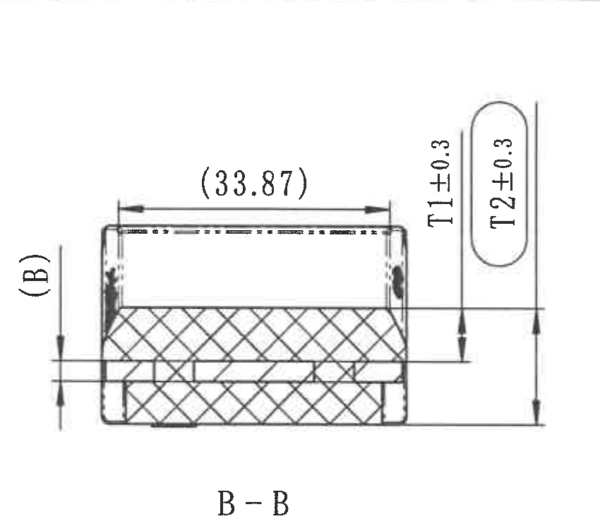

原图位置/视图名称：页 1 中部 B-B 剖视图，bbox = [3145, 830, 3995, 1575]。

提取表格：

| 提取项 | 原图数值或文本 | 含义说明 |
|---|---|---|
| 视图名 | B-B | 与 object_7 中 B 剖切标记对应。 |
| 参考宽度 | (33.87) | 顶部横向括号参考尺寸，表示剖视图上部参考宽度。 |
| 参考厚度 | (B) | 左侧竖向括号标记，对应顶部参数表中的 Rate plate thickness B。 |
| 厚度尺寸 | T1±0.3 | 右侧内层/局部竖向厚度；T1 数值按顶部表格变体读取，公差 ±0.3。 |
| 厚度尺寸 | T2±0.3 | 右侧总/外层竖向厚度；T2 数值按顶部表格变体读取，公差 ±0.3。 |
| 剖面线 | 交叉剖面线 | 表示剖切后的橡胶/嵌件区域。 |

边界归属说明：右前视图和下方文字说明均已排除；(B)、(33.87)、T1/T2 的尺寸线、箭头和文字完整。

## object_7 - 右侧前视图 / B-B 剖切位置

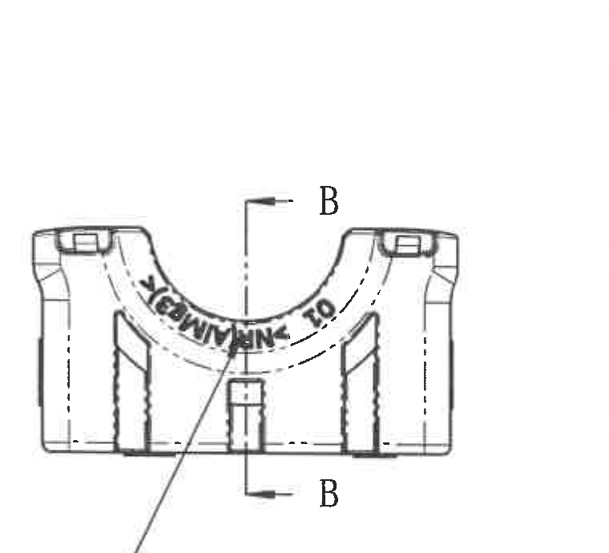

原图位置/视图名称：页 1 中部右侧前视图，bbox = [3990, 870, 4750, 1560]。

提取表格：

| 提取项 | 原图数值或文本 | 含义说明 |
|---|---|---|
| 剖切标记 | B / B | 标识 B-B 剖切位置和方向，对应 object_6 的 B-B 剖视图。 |
| 弧面标识 | 弧面上的黑色字符/标记 | 标示型腔号和材料标识所在区域，文字说明见 object_15。 |
| 轮廓线 | 虚线、点划线、中心线 | 表示内部轮廓、中心位置和剖切方向。 |

边界归属说明：左侧 B-B 剖视图的 T1/T2 尺寸区未纳入；该视图仅提取 B-B 剖切标记和右侧前视图自身信息。

## object_15 - 型腔号、材料标识注释

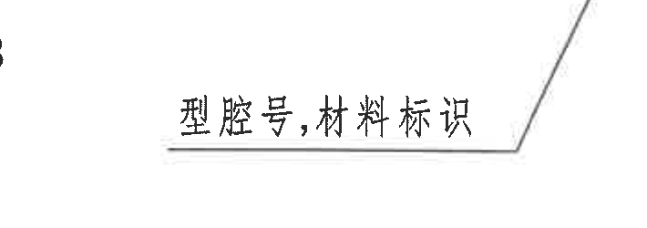

原图位置/视图名称：页 1 中部右侧前视图下方局部注释，bbox = [3550, 1485, 4260, 1735]。

提取表格：

| 提取项 | 原图数值或文本 | 含义说明 |
|---|---|---|
| 引出文字 | 型腔号,材料标识 | 指向 object_7 弧面上的标识字符区域。 |
| 引出线 | 水平线转斜线 | 与右侧前视图的弧面标识关联。 |

边界归属说明：该裁切只保留注释文字和引出线终端，未归入 B-B 剖视图尺寸。

## object_8 - 底部俯视图

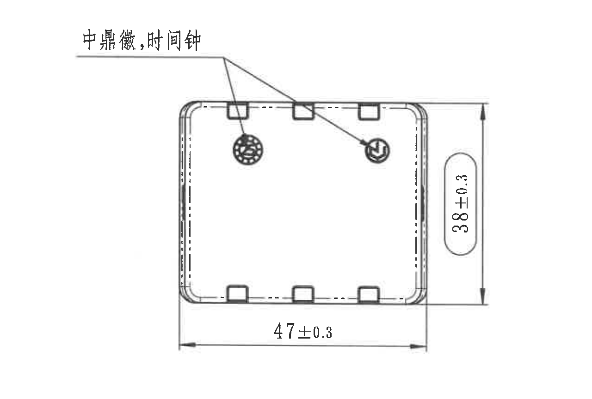

原图位置/视图名称：页 1 中下部俯视图，bbox = [1980, 1585, 3260, 2450]。

提取表格：

| 提取项 | 原图数值或文本 | 含义说明 |
|---|---|---|
| 横向尺寸 | 47±0.3 | 俯视图底部总长度尺寸。 |
| 竖向尺寸 | 38±0.3 | 俯视图右侧总宽度/高度方向尺寸。 |
| 标识注释 | 中鼎徽,时间钟 | 两条引出线分别指向中鼎徽标和时间钟标记。 |
| 局部特征 | 上下边若干方形槽/凸台 | 俯视方向可见的边缘特征，未附单独数值尺寸。 |

边界归属说明：上方 A-A/B-B 视图未纳入；47±0.3、38±0.3 和“中鼎徽,时间钟”引出线均完整。

## object_9 - 等轴测图与坐标轴

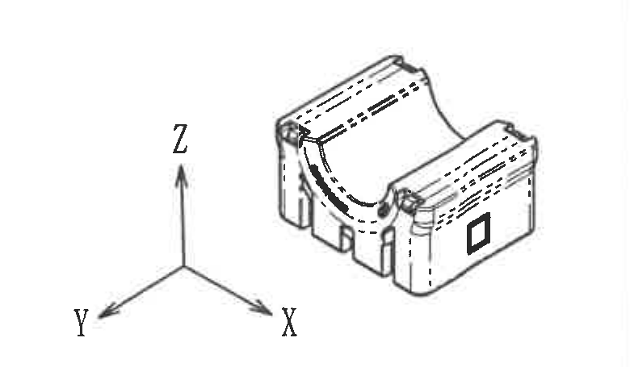

原图位置/视图名称：页 1 右下部等轴测示意和坐标轴，bbox = [3980, 2055, 4760, 2510]。

提取表格：

| 提取项 | 原图数值或文本 | 含义说明 |
|---|---|---|
| 坐标轴 | X, Y, Z | 表示产品三维方向。 |
| 等轴测图 | 产品三维示意 | 显示衬套槽形、侧面方形标记和上部弧槽方向。 |

边界归属说明：下方标题栏图号文本已排除；坐标轴 X/Y/Z 和等轴测产品轮廓完整。

## object_10 - 技术要求 NOTES

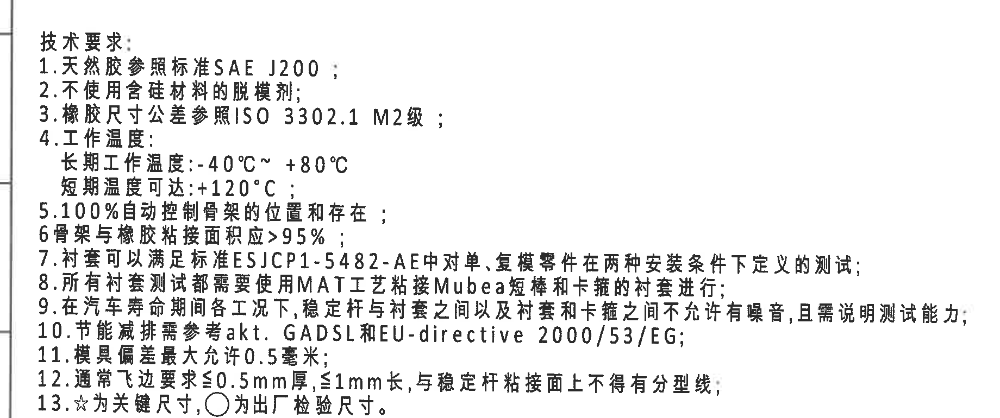

原图位置/视图名称：页 1 左下技术要求，bbox = [350, 1920, 2190, 2690]。

原文还原：

1. 天然胶参照标准SAE J200；
2. 不使用含硅材料的脱模剂；
3. 橡胶尺寸公差参照ISO 3302.1 M2级；
4. 工作温度：长期工作温度：-40°C~ +80°C；短期温度可达：+120°C；
5. 100%自动控制骨架的位置和存在；
6. 骨架与橡胶粘接面积应>95%；
7. 衬套可以满足标准ESJCP1-5482-AE中对单、复模零件在两种安装条件下定义的测试；
8. 所有衬套测试都需要使用MAT工艺粘接Mubea短棒和卡箍的衬套进行；
9. 在汽车寿命期间各工况下，稳定杆与衬套之间以及衬套和卡箍之间不允许有噪音，且需说明测试能力；
10. 节能减排需参考akt. GADSL和EU-directive 2000/53/EG；
11. 模具偏差最大允许0.5毫米；
12. 通常飞边要求≤0.5mm厚，≤1mm长，与稳定杆粘接面上不得有分型线；
13. ☆为关键尺寸，○为出厂检验尺寸。

提取表格：

| 提取项 | 原图数值或文本 | 含义说明 |
|---|---|---|
| 材料标准 | SAE J200 | 天然胶参照标准。 |
| 脱模剂限制 | 不使用含硅材料的脱模剂 | 制造工艺限制。 |
| 公差标准 | ISO 3302.1 M2级 | 橡胶尺寸公差等级。 |
| 长期工作温度 | -40°C~ +80°C | 长期使用温度范围。 |
| 短期温度 | +120°C | 短期可达温度。 |
| 粘接面积 | >95% | 骨架与橡胶粘接面积要求。 |
| 模具偏差 | 最大允许0.5毫米 | 模具偏差上限。 |
| 飞边要求 | ≤0.5mm厚，≤1mm长 | 通常飞边尺寸限制。 |
| 关键/检验符号 | ☆为关键尺寸，○为出厂检验尺寸 | 图中星号和圆圈符号含义。 |

边界归属说明：裁切仅包含技术要求文字，未带入下方 DIN ISO 3302-1 公差表。

## object_11 - DIN ISO 3302-1 M2 class 公差表

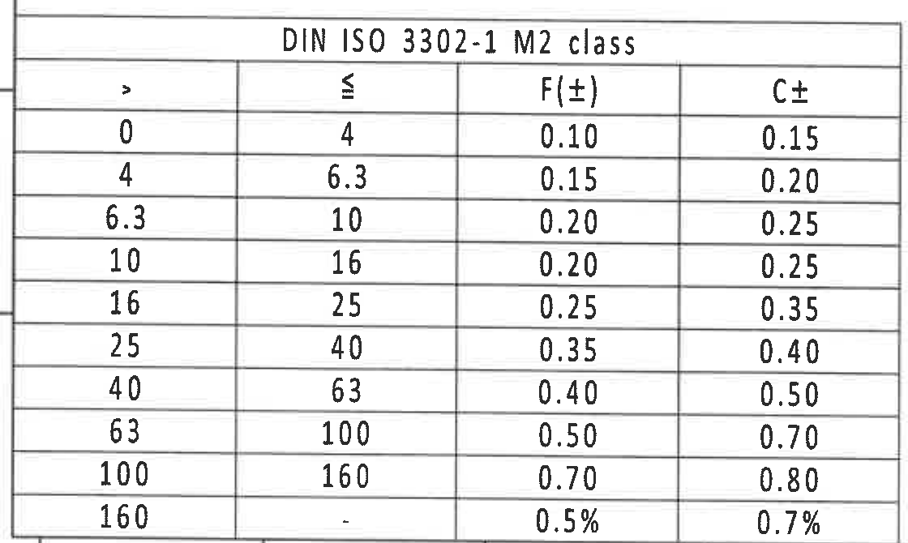

原图位置/视图名称：页 1 左下 DIN ISO 3302-1 M2 class 公差表，bbox = [350, 2695, 1470, 3365]。

原表还原：

| > | ≤ | F(±) | C± |
|---:|---:|---:|---:|
| 0 | 4 | 0.10 | 0.15 |
| 4 | 6.3 | 0.15 | 0.20 |
| 6.3 | 10 | 0.20 | 0.25 |
| 10 | 16 | 0.20 | 0.25 |
| 16 | 25 | 0.25 | 0.35 |
| 25 | 40 | 0.35 | 0.40 |
| 40 | 63 | 0.40 | 0.50 |
| 63 | 100 | 0.50 | 0.70 |
| 100 | 160 | 0.70 | 0.80 |
| 160 | - | 0.5% | 0.7% |

提取表格：

| 提取项 | 原图数值或文本 | 含义说明 |
|---|---|---|
| 表名 | DIN ISO 3302-1 M2 class | 橡胶尺寸公差等级表。 |
| 列 | >、≤、F(±)、C± | 尺寸范围下限、上限及 F/C 两类公差。 |
| 末行 | 160, -, 0.5%, 0.7% | 大于 160 的尺寸使用百分比公差。 |

边界归属说明：裁切完整包含公差表外框、表头和全部数据行；未纳入上方技术要求正文。

## object_12 - Reference 参考

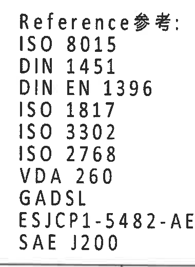

原图位置/视图名称：页 1 下部中间参考标准列表，bbox = [2350, 2860, 2730, 3380]。

提取表格：

| 提取项 | 原图数值或文本 | 含义说明 |
|---|---|---|
| 标题 | Reference参考: | 参考标准列表标题。 |
| 标准 | ISO 8015 | 参考标准。 |
| 标准 | DIN 1451 | 参考标准。 |
| 标准 | DIN EN 1396 | 参考标准。 |
| 标准 | ISO 1817 | 参考标准。 |
| 标准 | ISO 3302 | 参考标准。 |
| 标准 | ISO 2768 | 参考标准。 |
| 标准 | VDA 260 | 参考标准。 |
| 标准 | GADSL | 参考标准。 |
| 标准 | ESJCP1-5482-AE | 参考标准。 |
| 标准 | SAE J200 | 参考标准。 |

边界归属说明：裁切只包含参考标准列表，右侧标题栏边框已排除。

## object_13 - BOM / 材料明细表

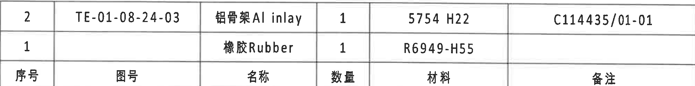

原图位置/视图名称：页 1 右下标题栏上方 BOM 表，bbox = [2760, 2520, 4760, 2770]。

原表还原：

| 序号 | 图号 | 名称 | 数量 | 材料 | 备注 |
|---|---|---|---:|---|---|
| 2 | TE-01-08-24-03 | 铝骨架 Al inlay | 1 | 5754 H22 | C114435/01-01 |
| 1 |  | 橡胶 Rubber | 1 | R6949-H55 |  |

提取表格：

| 提取项 | 原图数值或文本 | 含义说明 |
|---|---|---|
| 序号 2 | TE-01-08-24-03；铝骨架 Al inlay；数量 1；材料 5754 H22；备注 C114435/01-01 | 铝骨架物料行。 |
| 序号 1 | 橡胶 Rubber；数量 1；材料 R6949-H55 | 橡胶物料行。 |
| 表头 | 序号、图号、名称、数量、材料、备注 | BOM 字段。 |

边界归属说明：裁切只包含 BOM 表头和两行物料，已排除下方标题栏字段。

## object_14 - 标题栏

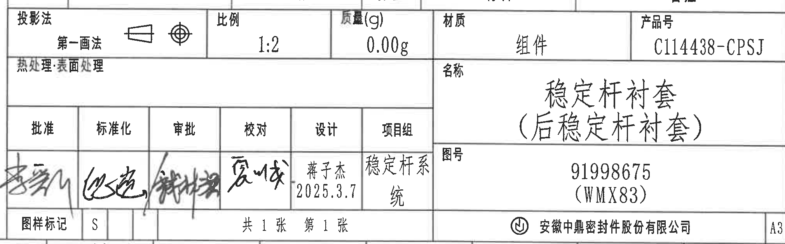

原图位置/视图名称：页 1 右下标题栏，bbox = [2740, 2760, 4760, 3390]。

原表还原：

| 字段 | 原图数值或文本 |
|---|---|
| 投影法 | 第一画法 |
| 比例 | 1:2 |
| 质量(g) | 0.00g |
| 材质 | 组件 |
| 产品号 | C114438-CPSJ |
| 热处理:表面处理 |  |
| 名称 | 稳定杆衬套（后稳定杆衬套） |
| 图号 | 91998675（WMX83） |
| 批准 | 签名 |
| 标准化 | 签名 |
| 审批 | 签名 |
| 校对 | 签名 |
| 设计 | 蒋子杰 2025.3.7 |
| 项目组 | 稳定杆系统 |
| 图样标记 | S |
| 页数 | 共1张 第1张 |
| 公司 | 安徽中鼎密封件股份有限公司 |
| 图幅 | A3 |

提取表格：

| 提取项 | 原图数值或文本 | 含义说明 |
|---|---|---|
| 产品名称 | 稳定杆衬套（后稳定杆衬套） | 图纸标题/产品名称。 |
| 图号 | 91998675（WMX83） | 产品图号。 |
| 产品号 | C114438-CPSJ | 标题栏产品号。 |
| 材质 | 组件 | 标题栏材质字段。 |
| 比例 | 1:2 | 图纸比例。 |
| 质量 | 0.00g | 标题栏质量字段。 |
| 设计 | 蒋子杰 2025.3.7 | 设计人员和日期。 |
| 项目组 | 稳定杆系统 | 项目组名称。 |
| 公司 | 安徽中鼎密封件股份有限公司 | 出图公司。 |

边界归属说明：裁切包含标题栏主体信息、签名区、公司名、图幅 A3；上方 BOM 为 object_13，未重复提取。

## 裁切检查记录

| 对象 | 检查结果 | 边界与完整性说明 |
|---|---|---|
| object_1 | 通过 | 修订表表头、已填写记录和空白行完整；上方坐标编号只作为边框背景，不提取。 |
| object_2 | 通过 | 顶部参数表列头、所有变体行和右侧材料字段完整；未带入下方视图。 |
| object_3 | 通过 | 主前视图、45±0.3、(0.5)、表格引用和星标尺寸完整；未带入侧视图 Variant 注释。 |
| object_4 | 通过 | 侧视图、24.5±0.3 和 A-A 剖切标记完整；未带入 A-A 剖面图。 |
| object_16 | 有说明通过 | Variant 文字和引线完整；左上极小尺寸线残端因紧邻文字保留，不提取为本对象内容。 |
| object_5 | 通过 | A-A 剖面、(0.75)、(RIR)、(RAR) 及引出线完整；未带入 B-B 剖面。 |
| object_6 | 通过 | B-B 剖面、(33.87)、(B)、T1±0.3、T2±0.3 和视图名完整；未带入右前视图。 |
| object_7 | 通过 | 右前视图和 B/B 剖切标记完整；左侧 B-B 尺寸区已排除。 |
| object_15 | 通过 | “型腔号,材料标识”注释和引出线完整；未带入 B-B 尺寸。 |
| object_8 | 通过 | 俯视图、47±0.3、38±0.3 和“中鼎徽,时间钟”完整；未带入上方剖视图名称。 |
| object_9 | 通过 | 等轴测图和 X/Y/Z 坐标轴完整；未带入标题栏文字。 |
| object_10 | 通过 | 技术要求 1-13 条完整；未带入下方公差表。 |
| object_11 | 通过 | DIN ISO 3302-1 M2 class 公差表完整，含全部行列。 |
| object_12 | 通过 | Reference 参考列表完整；右侧标题栏边框已排除。 |
| object_13 | 通过 | BOM 表头和两行物料完整；下方标题栏字段已排除。 |
| object_14 | 通过 | 标题栏投影法、比例、质量、材质、产品号、名称、图号、签名区、公司和 A3 完整。 |
