# 20C114439 PDF 内容识别与裁切提取

源文件：`input/20C114439.pdf`

整页渲染图：`outputs/20C114439_assets/images/page_1.png`，尺寸 `4959 x 3505 px`。以下 bbox 均为整页 PNG 像素坐标 `[x0, y0, x1, y1]`。

## object_1 顶部右侧变更履历表

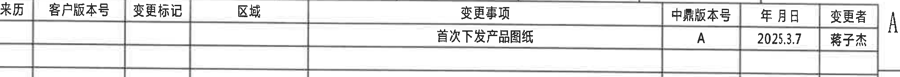

原图位置/视图名称：页面 A 区域右上角，bbox `[2805, 205, 4830, 380]`。

原表还原：

| 来历 | 客户版本号 | 变更标记 | 区域 | 变更事项 | 中鼎版本号 | 年月日 | 变更者 |
|---|---|---|---|---|---|---|---|
|  |  |  |  | 首次下发产品图纸 | A | 2025.3.7 | 蒋子杰 |

提取表格：

| 提取项 | 原图数值或文本 | 含义说明 |
|---|---|---|
| 变更事项 | 首次下发产品图纸 | 图纸首次发布/下发记录。 |
| 中鼎版本号 | A | 内部版本为 A。 |
| 年月日 | 2025.3.7 | 变更/发布日期。 |
| 变更者 | 蒋子杰 | 记录责任人。 |

边界归属说明：裁切只包含变更履历表；下方产品参数表不归属本对象。

## object_2 顶部产品参数/Variant 对照表

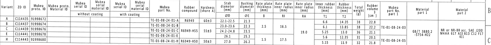

原图位置/视图名称：页面 B-C 区域顶部整宽参数表，bbox `[385, 405, 4830, 820]`。

原表还原：

| Variant | ZD ID | Mubea proto. ID | Mubea proto. Material ID | Mubea serial ID without coating | Mubea serial material ID without coating | Mubea serial ID with coating | Mubea serial material ID with coating | Mubea part No. | Rubber compound | Hardness (shore A) | Stab diameter ØD (mm) | Bushing diameter ØE (mm) | Rate plate thickness B (mm) | Rate plate inner radius RI (mm) | Rate plate inner radius RA (mm) | Inner rubber thickness T1 (mm) | Rubber thickness T2 (mm) | Total weight (g) | Rubber volume (cm^3) | Mubea part No. part 1 | Material part 1 | Material part 2 |
|---|---|---|---|---|---|---|---|---|---|---|---|---|---|---|---|---|---|---|---|---|---|---|
| A | C114435 | 91998672 |  |  |  |  |  | TE-01-08-24-01-A | R6949 | 60±3 | 22.1-22.5 | 21.3 |  |  |  | 6.6 | 14.35 | 38 | 22.8 | TE-01-08-24-03 | GB/T 3880.2 -5754-H22 | NR or NR-BR acc. SAE J200 M4AA 617 A13 B13 C12 F17 K11 |
| B | C114437 | 91998674 |  |  |  |  |  | TE-01-08-24-01-B | R6949-H55 | 55±3 | 23.0-23.6 | 22.3 | 2.5 | 16.5 | 19.0 | 6.1 | 13.85 | 38 | 22.2 | TE-01-08-24-03 | GB/T 3880.2 -5754-H22 | NR or NR-BR acc. SAE J200 M4AA 617 A13 B13 C12 F17 K11 |
| C | C114439 | 91998676 |  |  |  |  |  | TE-01-08-24-01-C | R6949-H55 | 55±3 | 24.2-24.8 | 23.5 | 2.5 | 16.5 | 19.0 | 5.25 | 13.0 | 36 | 21.1 | TE-01-08-24-03 | GB/T 3880.2 -5754-H22 | NR or NR-BR acc. SAE J200 M4AA 617 A13 B13 C12 F17 K11 |
| E | C114441 | 91998678 |  |  |  |  |  | TE-01-08-24-01-E | R6949-H55 | 55±3 | 26.1 | 25.3 | 1.5 | 17.5 | 19.0 | 5.6 | 12.35 | 31 | 20.1 | TE-01-08-24-05 | GB/T 3880.2 -5754-H22 | NR or NR-BR acc. SAE J200 M4AA 617 A13 B13 C12 F17 K11 |
| H | C114443 | 91998680 |  |  |  |  |  | TE-01-08-24-01-H | R6949-H50 | 50±3 | 27.0 | 26.2 | 1.5 | 17.5 | 19.0 | 5.15 | 11.9 | 32 | 21.8 | TE-01-08-24-05 | GB/T 3880.2 -5754-H22 | NR or NR-BR acc. SAE J200 M4AA 617 A13 B13 C12 F17 K11 |

提取表格：

| 提取项 | 原图数值或文本 | 含义说明 |
|---|---|---|
| Variant | A / B / C / E / H | 变体代号；侧视图中的 `Variant(见表格)` 指向此列。 |
| ØD | 22.1-22.5 / 23.0-23.6 / 24.2-24.8 / 26.1 / 27.0 | 稳定杆直径，右侧端视图以 `ØD` 标注。 |
| ØE | 21.3 / 22.3 / 23.5 / 25.3 / 26.2 | 衬套孔径/套筒直径，主视图以 `ØE±0.3☆` 标注。 |
| B | B、C 为 2.5；E、H 为 1.5 | 速率片厚度/字母尺寸，B-B 剖面以 `(B)` 参考。 |
| RI | B、C 为 16.5；E、H 为 17.5 | 速率片内半径，A-A 剖面参考半径含义来源。 |
| RA | 19.0 | 速率片内半径/弧向参考值，表内为合并单元格。 |
| T1 | 6.6 / 6.1 / 5.25 / 5.6 / 5.15 | 内橡胶厚度，B-B 剖面以 `T1±0.3` 标注。 |
| T2 | 14.35 / 13.85 / 13.0 / 12.35 / 11.9 | 橡胶厚度，B-B 剖面以 `T2±0.3` 标注。 |
| Rubber compound | R6949 / R6949-H55 / R6949-H50 | 橡胶材料配方。 |
| Hardness | 60±3 / 55±3 / 50±3 | 橡胶硬度，单位 shore A。 |
| part 1 material | GB/T 3880.2 -5754-H22 | 铝骨架材料标准/牌号。 |
| part 2 material | NR or NR-BR acc. SAE J200 M4AA 617 A13 B13 C12 F17 K11 | 橡胶材料标准说明。 |

边界归属说明：上缘与修订表相邻；裁切保留完整产品参数表表头，仅提取本表内行列。合并单元格已按跨行含义在表内重复显示。

## object_3 左侧主视图/端面加工视图

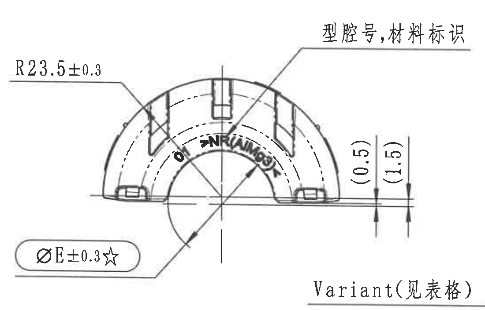

原图位置/视图名称：页面 D-F 区域左侧主视图，bbox `[540, 985, 1640, 1690]`。

提取表格：

| 提取项 | 原图数值或文本 | 含义说明 |
|---|---|---|
| 半径尺寸 | R23.5±0.3 | 外圆弧半径控制尺寸，箭头指向半圆外轮廓。 |
| 关键直径尺寸 | ØE±0.3☆ | 衬套孔径/套筒直径；`☆` 表示关键尺寸，具体 ØE 名义值见 object_2。 |
| 参考尺寸 | (0.5) | 右侧下缘局部高度/间隙参考尺寸；括号表示参考。 |
| 参考尺寸 | (1.5) | 右侧下缘局部高度/间隙参考尺寸；括号表示参考。 |
| 标识说明 | 型腔号,材料标识 | 引线指向零件表面模腔号和材料标识位置。 |

边界归属说明：底部 `Variant(见表格)` 标注与侧视图引线位置重叠，归 object_4；本对象只提取主视图的 R、ØE、(0.5)、(1.5) 和型腔/材料标识。

## object_4 中上侧视图/剖切 A-A 指示视图

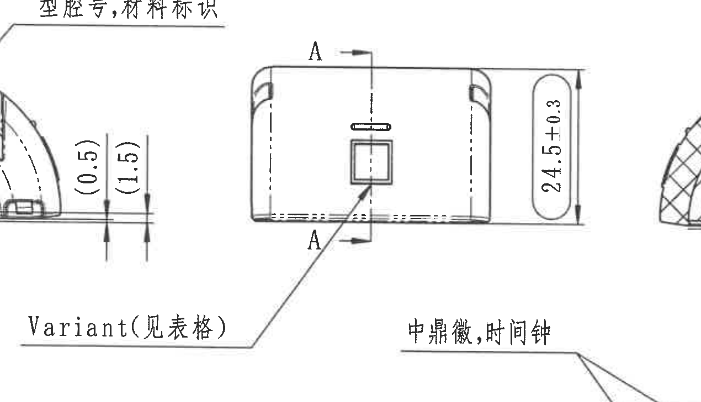

原图位置/视图名称：页面 E-F 区域中上侧视图，bbox `[1200, 1050, 2470, 1780]`。

提取表格：

| 提取项 | 原图数值或文本 | 含义说明 |
|---|---|---|
| 总高度 | 24.5±0.3 | 侧视图右侧竖向总高度尺寸。 |
| 剖切标识 | A / A | 上下箭头定义 A-A 剖切方向，剖面见 object_5。 |
| 变体标识 | Variant(见表格) | 引线指向侧视图中央方形特征；对应 object_2 的 Variant 行。 |

边界归属说明：左侧可见主视图 `(0.5)/(1.5)` 残片，底部可见俯视图 `中鼎徽,时间钟` 引线文字；两者均不归本侧视图，不在本对象提取。

## object_5 剖面 A-A

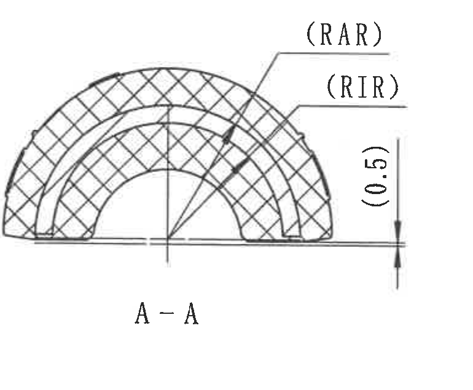

原图位置/视图名称：页面 E-F 区域中部剖面 A-A，bbox `[2390, 1070, 3160, 1705]`。

提取表格：

| 提取项 | 原图数值或文本 | 含义说明 |
|---|---|---|
| 参考弧向尺寸 | (RAR) | 参考弧/半径标识，括号表示参考含义；与表中 RA 类字母尺寸相关。 |
| 参考弧向尺寸 | (RIR) | 参考弧/半径标识，括号表示参考含义；与表中 RI 类字母尺寸相关。 |
| 参考尺寸 | (0.5) | 剖面右侧底部参考高度/间隙尺寸。 |
| 剖面名称 | A-A | 对应 object_4 中 A-A 剖切指示。 |

边界归属说明：裁切完整包含剖面轮廓、剖面线、参考半径引线和右侧参考尺寸线；未带入相邻视图内容。

## object_6 剖面 B-B

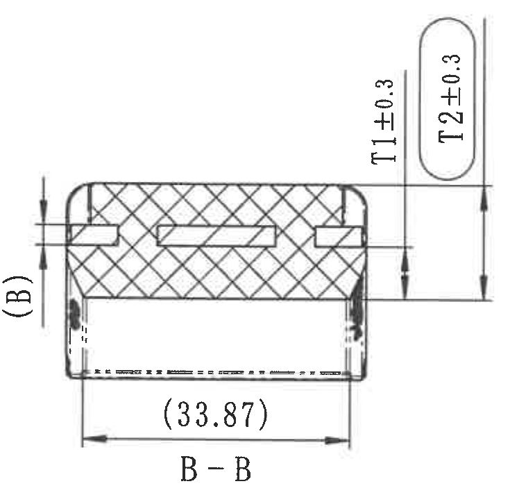

原图位置/视图名称：页面 D-F 区域右中剖面 B-B，bbox `[3190, 925, 3925, 1625]`。

提取表格：

| 提取项 | 原图数值或文本 | 含义说明 |
|---|---|---|
| 字母参考尺寸 | (B) | 左侧括号字母尺寸，表中 Rate plate thickness B 的参考标识。 |
| 厚度尺寸 | T1±0.3 | 内橡胶厚度控制尺寸，T1 名义值见 object_2。 |
| 厚度尺寸 | T2±0.3 | 橡胶厚度控制尺寸，T2 名义值见 object_2。 |
| 参考总宽 | (33.87) | 底部水平参考尺寸，括号表示参考。 |
| 剖面名称 | B-B | 对应 object_7 中 B-B 剖切指示。 |

边界归属说明：裁切保留完整 T1/T2 尺寸线、箭头、底部参考尺寸和 B-B 名称；未把右侧端视图的杆径标注纳入本对象。

## object_7 右侧端视图/B-B 剖切指示视图

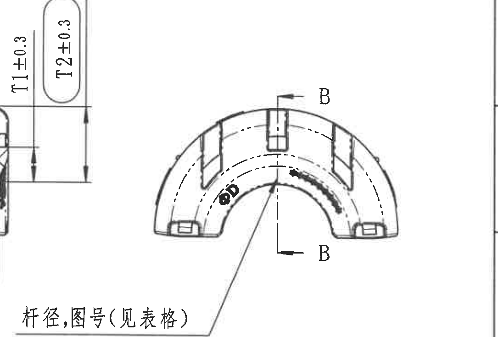

原图位置/视图名称：页面 D-F 区域右侧端视图，bbox `[3700, 960, 4785, 1695]`。

提取表格：

| 提取项 | 原图数值或文本 | 含义说明 |
|---|---|---|
| 字母直径 | ØD | 稳定杆直径，具体数值见 object_2 的 `Stab diameter ØD` 列。 |
| 剖切标识 | B / B | 上下箭头定义 B-B 剖切方向，剖面见 object_6。 |
| 引线说明 | 杆径,图号(见表格) | 杆径和图号按顶部产品参数表查取。 |

边界归属说明：为保留完整 `杆径,图号(见表格)` 引线，左侧带入 B-B 剖面的 T1/T2 尺寸线残片；这些残片归 object_6，不在本对象提取。

## object_8 下方俯视图/平面加工视图

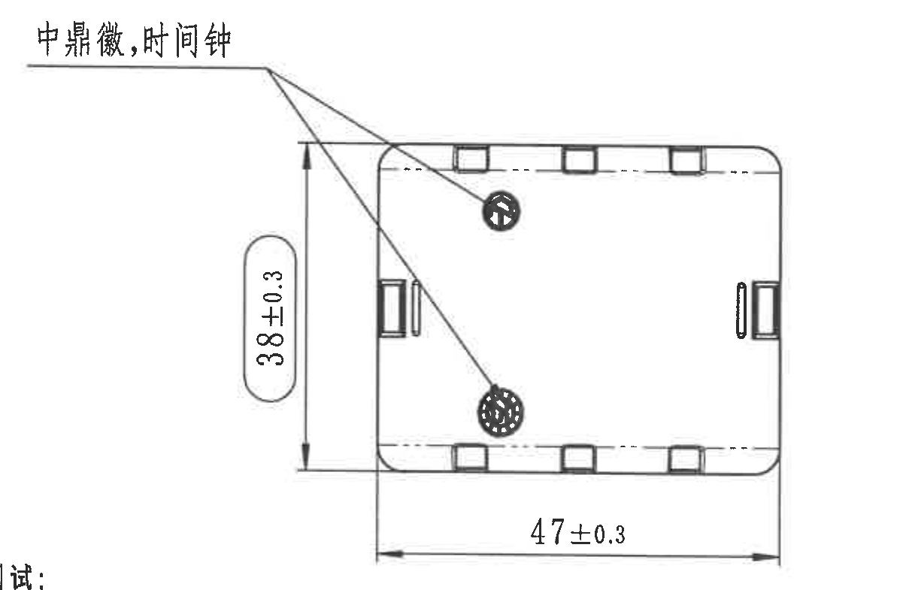

原图位置/视图名称：页面 G-H 区域中部俯视图，bbox `[1890, 1600, 3095, 2385]`。

提取表格：

| 提取项 | 原图数值或文本 | 含义说明 |
|---|---|---|
| 标识位置 | 中鼎徽,时间钟 | 两条引线分别指向俯视图中的两个圆形标识位置。 |
| 总宽/高度 | 38±0.3 | 俯视图左侧竖向总尺寸。 |
| 总长 | 47±0.3 | 俯视图底部横向总尺寸。 |

边界归属说明：左下角有技术要求行尾残字，归 object_10；本对象只提取俯视图尺寸和 `中鼎徽,时间钟` 引线内容。

## object_9 右下轴测/方向示意图

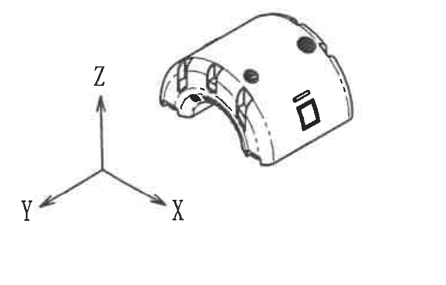

原图位置/视图名称：页面 H-I 区域右侧轴测示意，bbox `[3940, 2005, 4700, 2490]`。

提取表格：

| 提取项 | 原图数值或文本 | 含义说明 |
|---|---|---|
| 坐标方向 | X / Y / Z | 零件三维方向示意。 |
| 外形示意 | 轴测零件外形 | 显示开口、槽位、圆形标识和侧面标识的大致空间位置。 |
| 尺寸 | 无尺寸值 | 本对象为示意图，不含加工尺寸。 |

边界归属说明：裁切完整包含轴测图和 X/Y/Z 坐标轴，未带入标题栏或其他视图。

## object_10 技术要求 NOTES

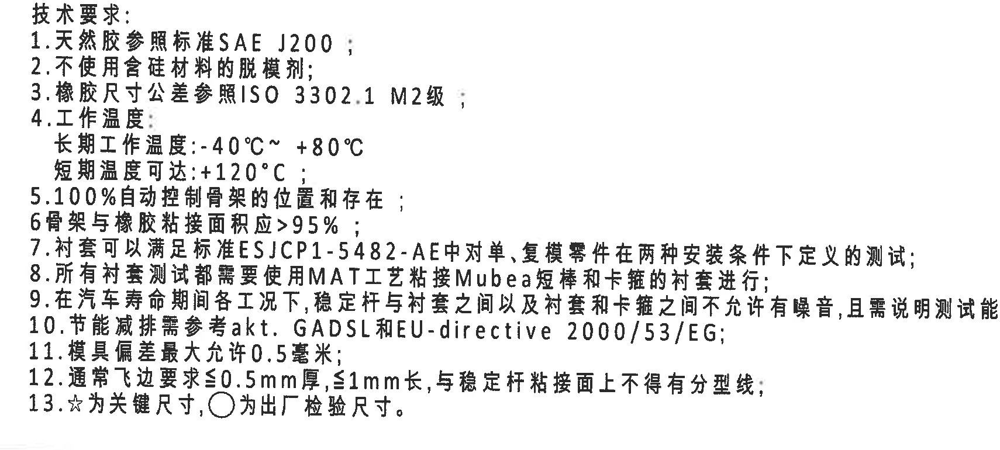

原图位置/视图名称：页面 G-J 区域左侧技术要求，bbox `[385, 1930, 2095, 2700]`。

提取表格：

| 提取项 | 原图数值或文本 | 含义说明 |
|---|---|---|
| 1 | 天然胶参照标准 SAE J200； | 天然胶材料标准。 |
| 2 | 不使用含硅材料的脱模剂； | 脱模剂限制。 |
| 3 | 橡胶尺寸公差参照 ISO 3302.1 M2级； | 橡胶件尺寸公差依据，见 object_11。 |
| 4 | 工作温度：长期工作温度 -40°C~+80°C；短期温度可达 +120°C； | 使用温度范围。 |
| 5 | 100%自动控制骨架的位置和存在； | 骨架位置/存在性全检控制。 |
| 6 | 骨架与橡胶粘接面积应>95%； | 粘接面积要求。 |
| 7 | 衬套可以满足标准 ESJCP1-5482-AE 中对单、复模零件在两种安装条件下定义的测试； | 衬套测试标准要求。 |
| 8 | 所有衬套测试都需要使用 MATT 工艺粘接 Mubea 短棒和卡箍的衬套进行； | 测试样件/工艺要求。 |
| 9 | 在汽车寿命期间各工况下，稳定杆与衬套之间以及衬套和卡箍之间不允许有噪音，且需说明测试能力； | NVH/噪音与测试能力要求。 |
| 10 | 节能减排需参考 akt. GADSL 和 EU-directive 2000/53/EG； | 环保法规/清单要求。 |
| 11 | 模具偏差最大允许 0.5 毫米； | 模具偏差限值。 |
| 12 | 通常飞边要求≤0.5mm厚，≤1mm长，与稳定杆粘接面上不得有分型线； | 飞边与分型线要求。 |
| 13 | ☆为关键尺寸，○为出厂检验尺寸。 | 符号说明；主视图的 `ØE±0.3☆` 是关键尺寸。 |

边界归属说明：裁切完整包含 13 条技术要求；未带入右侧 Reference 列表。

## object_11 DIN ISO 3302-1 M2 class 公差表

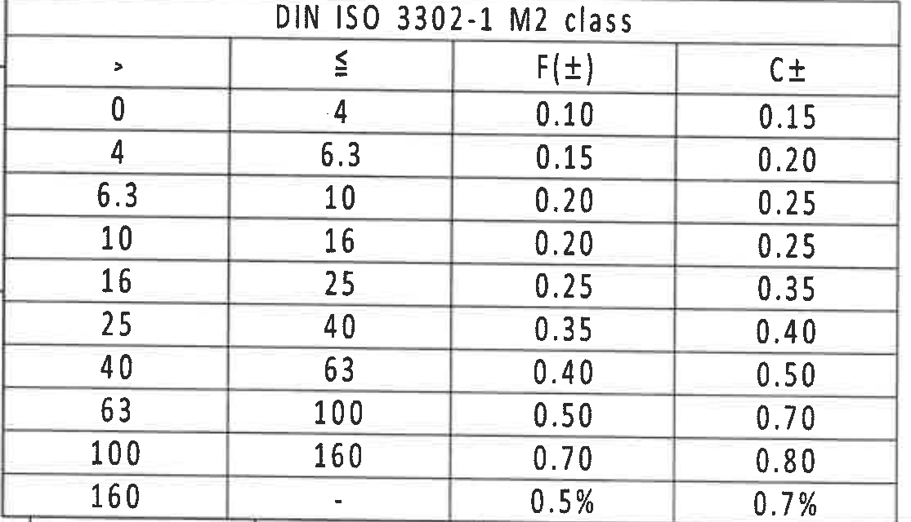

原图位置/视图名称：页面 J-L 区域左下公差表，bbox `[365, 2715, 1480, 3355]`。

原表还原：

| DIN ISO 3302-1 M2 class |  |  |  |
|---|---|---|---|
| > | ≤ | F(±) | C± |
| 0 | .4 | 0.10 | 0.15 |
| 4 | 6.3 | 0.15 | 0.20 |
| 6.3 | 10 | 0.20 | 0.25 |
| 10 | 16 | 0.20 | 0.25 |
| 16 | 25 | 0.25 | 0.35 |
| 25 | 40 | 0.35 | 0.40 |
| 40 | 63 | 0.40 | 0.50 |
| 63 | 100 | 0.50 | 0.70 |
| 100 | 160 | 0.70 | 0.80 |
| 160 | - | 0.5% | 0.7% |

提取表格：

| 提取项 | 原图数值或文本 | 含义说明 |
|---|---|---|
| 标准/等级 | DIN ISO 3302-1 M2 class | 技术要求第 3 条引用的橡胶尺寸公差表。 |
| F(±) | 0.10 至 0.70，末行 0.5% | F 类公差列。 |
| C± | 0.15 至 0.80，末行 0.7% | C 类公差列。 |

边界归属说明：裁切完整包含表头和所有公差行，下方图框坐标未纳入。

## object_12 Reference 参考标准列表

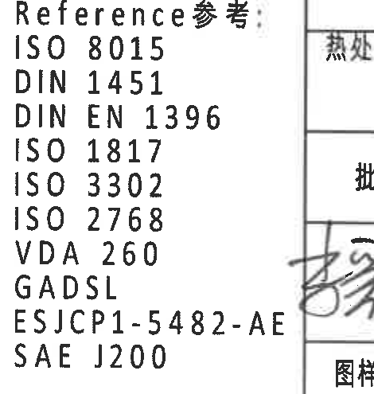

原图位置/视图名称：页面 K-L 区域中下参考标准列表，bbox `[2380, 2865, 2850, 3360]`。

提取表格：

| 提取项 | 原图数值或文本 | 含义说明 |
|---|---|---|
| Reference参考 | ISO 8015 | 参考标准。 |
| Reference参考 | DIN 1451 | 参考标准。 |
| Reference参考 | DIN EN 1396 | 参考标准。 |
| Reference参考 | ISO 1817 | 参考标准。 |
| Reference参考 | ISO 3302 | 参考标准。 |
| Reference参考 | ISO 2768 | 参考标准。 |
| Reference参考 | VDA 260 | 参考标准。 |
| Reference参考 | GADSL | 参考标准。 |
| Reference参考 | ESJCP1-5482-AE | 参考标准。 |
| Reference参考 | SAE J200 | 参考标准。 |

边界归属说明：右侧与标题栏相邻，裁切中可见少量标题栏边线/文字残片；本对象只提取 Reference 标准列表。

## object_13 右下明细/BOM 表

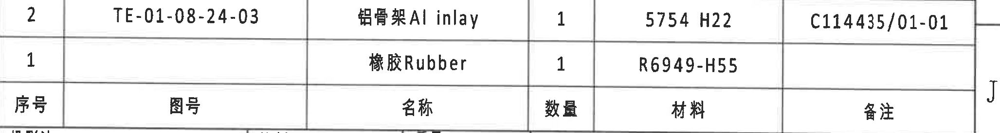

原图位置/视图名称：页面 I-J 区域右下明细表，bbox `[2770, 2515, 4825, 2790]`。

原表还原：

| 序号 | 图号 | 名称 | 数量 | 材料 | 备注 |
|---|---|---|---|---|---|
| 2 | TE-01-08-24-03 | 铝骨架 Al inlay | 1 | 5754 H22 | C114435/01-01 |
| 1 |  | 橡胶 Rubber | 1 | R6949-H55 |  |

提取表格：

| 提取项 | 原图数值或文本 | 含义说明 |
|---|---|---|
| 明细 2 | TE-01-08-24-03 / 铝骨架 Al inlay / 1 / 5754 H22 / C114435/01-01 | 铝骨架零件记录。 |
| 明细 1 | 橡胶 Rubber / 1 / R6949-H55 | 橡胶件记录。 |

边界归属说明：裁切完整包含 BOM 两行和表头；下方标题栏字段未纳入。

## object_14 右下标题栏/签字栏

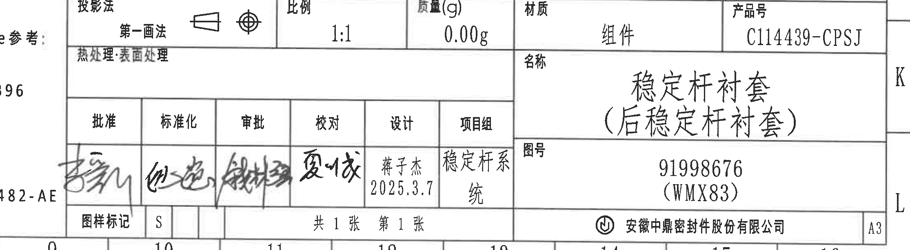

原图位置/视图名称：页面 J-L 区域右下标题栏，bbox `[2600, 2790, 4830, 3405]`。

提取表格：

| 提取项 | 原图数值或文本 | 含义说明 |
|---|---|---|
| 投影法 | 第一画法 | 使用第一角投影符号。 |
| 比例 | 1:1 | 图纸比例。 |
| 质量(g) | 0.00g | 标题栏质量字段。 |
| 材质 | 组件 | 装配/组件属性。 |
| 产品号 | C114439-CPSJ | 产品编号。 |
| 热处理/表面处理 | 热处理:表面处理 | 字段存在，内容栏为空。 |
| 名称 | 稳定杆衬套（后稳定杆衬套） | 图纸名称。 |
| 图号 | 91998676 (WMX83) | 图号/代号。 |
| 批准 | 手写签名 | 标题栏签批字段。 |
| 标准化 | 手写签名 | 标题栏签批字段。 |
| 审批 | 手写签名 | 标题栏签批字段。 |
| 校对 | 手写签名 | 标题栏签批字段。 |
| 设计 | 蒋子杰 2025.3.7 | 设计者和日期。 |
| 项目组 | 稳定杆系统 | 项目组字段。 |
| 图样标记 | S | 图样标记。 |
| 页数 | 共 1 张 第 1 张 | 总页数和当前页。 |
| 公司 | 安徽中鼎密封件股份有限公司 | 出图单位。 |
| 幅面 | A3 | 图幅。 |

边界归属说明：为完整保留左侧签字栏手写内容，裁切左边缘带入 Reference 列表残字；该残字归 object_12，不作为标题栏提取内容。

## 裁切检查记录

| 对象 | 图片 | bbox | 检查结果 |
|---|---|---|---|
| object_1 | outputs/20C114439_assets/images/object_1.png | [2805, 205, 4830, 380] | 完整包含变更履历表表头和记录；未包含下方产品表表头。 |
| object_2 | outputs/20C114439_assets/images/object_2.png | [385, 405, 4830, 820] | 完整包含产品参数表表头、5 个 Variant 行、合并单元格和材料字段。 |
| object_3 | outputs/20C114439_assets/images/object_3.png | [540, 985, 1640, 1690] | 完整包含主视图尺寸线、箭头、R/ØE 标注和参考尺寸；底部 Variant 残片已归属 object_4。 |
| object_4 | outputs/20C114439_assets/images/object_4.png | [1200, 1050, 2470, 1780] | 完整包含侧视图、24.5±0.3、A-A 标识和 Variant 引线；混入的主视图/俯视图残片已排除。 |
| object_5 | outputs/20C114439_assets/images/object_5.png | [2390, 1070, 3160, 1705] | 完整包含 A-A 剖面、(RAR)、(RIR)、(0.5) 和剖面名称。 |
| object_6 | outputs/20C114439_assets/images/object_6.png | [3190, 925, 3925, 1625] | 完整包含 B-B 剖面、(B)、T1/T2、(33.87) 和剖面名称。 |
| object_7 | outputs/20C114439_assets/images/object_7.png | [3700, 960, 4785, 1695] | 完整包含右侧端视图、ØD、B-B 标识和杆径/图号引线；左侧 T1/T2 残片归 object_6。 |
| object_8 | outputs/20C114439_assets/images/object_8.png | [1890, 1600, 3095, 2385] | 完整包含俯视图、38±0.3、47±0.3 和中鼎徽/时间钟引线；左下 NOTES 残字归 object_10。 |
| object_9 | outputs/20C114439_assets/images/object_9.png | [3940, 2005, 4700, 2490] | 完整包含轴测图和 X/Y/Z 坐标轴，无尺寸线。 |
| object_10 | outputs/20C114439_assets/images/object_10.png | [385, 1930, 2095, 2700] | 完整包含 13 条技术要求，未截断右侧长句。 |
| object_11 | outputs/20C114439_assets/images/object_11.png | [365, 2715, 1480, 3355] | 完整包含 DIN ISO 3302-1 M2 公差表表头和所有行。 |
| object_12 | outputs/20C114439_assets/images/object_12.png | [2380, 2865, 2850, 3360] | 完整包含 Reference 列表；右侧标题栏残片已排除。 |
| object_13 | outputs/20C114439_assets/images/object_13.png | [2770, 2515, 4825, 2790] | 完整包含 BOM 两行和表头，底部标题栏未纳入。 |
| object_14 | outputs/20C114439_assets/images/object_14.png | [2600, 2790, 4830, 3405] | 完整包含标题栏、签字栏、名称、图号和公司信息；左侧 Reference 残字已排除。 |
