# 20C114440 PDF 内容识别

## 整页渲染

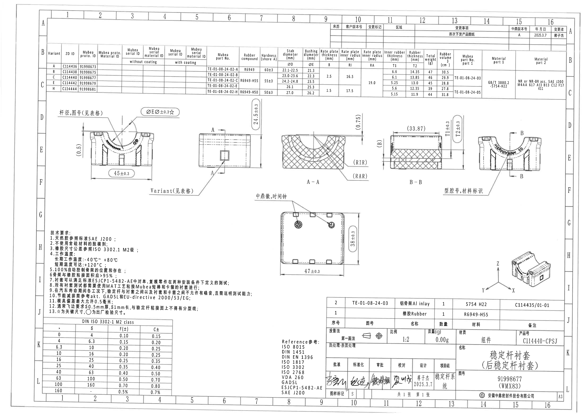

- 原图位置/视图名称：第 1 页整页，渲染 PNG 尺寸 4959 x 3505 px。
- 结构说明：上方为变更履历表和 Variant 参数表；中部为主视图、侧视图、A-A/B-B 剖面和局部标注；下方为俯视图、技术要求、DIN 公差表、参考标准、BOM、标题栏和轴测参考图。

## object_1 右上角变更履历表

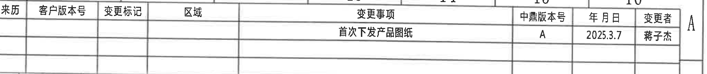

- 原图位置/视图名称：第 1 页右上角，第 13-16 列、A 行附近。

### 原表还原

| 来历 | 客户版本号 | 变更标记 | 区域 | 变更事项 | 中鼎版本号 | 年月日 | 变更者 |
| --- | --- | --- | --- | --- | --- | --- | --- |
|  |  |  |  | 首次下发产品图纸 | A | 2025.3.7 | 蒋子杰 |

### 提取表格

| 提取项 | 原图数值或文本 | 含义说明 |
| --- | --- | --- |
| 变更事项 | 首次下发产品图纸 | 首次发布/下发该产品图纸。 |
| 中鼎版本号 | A | 中鼎内部版本号为 A。 |
| 年月日 | 2025.3.7 | 变更/发布日期。 |
| 变更者 | 蒋子杰 | 图纸变更人员。 |

- 边界归属说明：裁切收在履历表下边线处；下方参数表不属于本对象。

## object_2 顶部 Variant 参数表

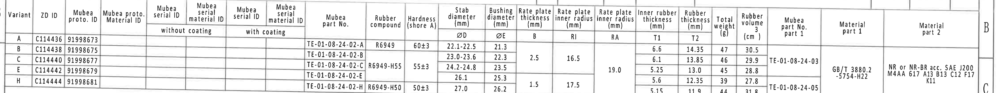

- 原图位置/视图名称：第 1 页顶部 B-C 行主参数表。

### 原表还原

| Variant | ZD ID | Mubea proto.ID | Mubea proto.Material ID | Mubea serial ID without coating | Mubea serial material ID without coating | Mubea serial ID with coating | Mubea serial material ID with coating | Mubea part No. | Rubber compound | Hardness (shore A) | Stab diameter ØD (mm) | Bushing diameter ØE (mm) | Rate plate thickness B (mm) | Rate plate inner radius RI (mm) | Rate plate inner radius RA (mm) | Inner rubber thickness T1 (mm) | Rubber thickness T2 (mm) | Total weight (g) | Rubber volume (cm3) | Mubea part No. part 1 | Material part 1 | Material part 2 |
| --- | --- | --- | --- | --- | --- | --- | --- | --- | --- | --- | --- | --- | --- | --- | --- | --- | --- | --- | --- | --- | --- | --- |
| A | C114436 | 91998673 |  |  |  |  |  | TE-01-08-24-02-A | R6949 | 60±3 | 22.1-22.5 | 21.3 | (合并: 2.5 适用 A/B/C) | (合并: 16.5 适用 A/B/C) | 19.0 | 6.6 | 14.35 | 47 | 30.5 | TE-01-08-24-03 | GB/T 3880.2-5754-H22 | NR or NR-BR acc. SAE J200 M4AA 617 A13 B13 C12 F17 K11 |
| B | C114438 | 91998675 |  |  |  |  |  | TE-01-08-24-02-B | R6949-H55 | 55±3 | 23.0-23.6 | 22.3 | 2.5 | 16.5 | 19.0 | 6.1 | 13.85 | 46 | 29.9 | TE-01-08-24-03 | GB/T 3880.2-5754-H22 | NR or NR-BR acc. SAE J200 M4AA 617 A13 B13 C12 F17 K11 |
| C | C114440 | 91998677 |  |  |  |  |  | TE-01-08-24-02-C | R6949-H55 | 55±3 | 24.2-24.8 | 23.5 | 2.5 | 16.5 | 19.0 | 5.25 | 13.0 | 45 | 28.8 | TE-01-08-24-03 | GB/T 3880.2-5754-H22 | NR or NR-BR acc. SAE J200 M4AA 617 A13 B13 C12 F17 K11 |
| E | C114442 | 91998679 |  |  |  |  |  | TE-01-08-24-02-E | R6949-H55 | 55±3 | 26.1 | 25.3 | 1.5 | 17.5 | 19.0 | 5.6 | 12.35 | 39 | 27.8 | TE-01-08-24-05 | GB/T 3880.2-5754-H22 | NR or NR-BR acc. SAE J200 M4AA 617 A13 B13 C12 F17 K11 |
| H | C114444 | 91998681 |  |  |  |  |  | TE-01-08-24-02-H | R6949-H50 | 50±3 | 27.0 | 26.2 | 1.5 | 17.5 | 19.0 | 5.15 | 11.9 | 44 | 31.8 | TE-01-08-24-05 | GB/T 3880.2-5754-H22 | NR or NR-BR acc. SAE J200 M4AA 617 A13 B13 C12 F17 K11 |

### 提取表格

| 提取项 | 原图数值或文本 | 含义说明 |
| --- | --- | --- |
| Variant | A/B/C/E/H | 零件变型代码，用于选择对应尺寸、材料和件号。 |
| ZD ID | C114436, C114438, C114440, C114442, C114444 | 中鼎内部变型编号。 |
| Mubea proto.ID | 91998673, 91998675, 91998677, 91998679, 91998681 | Mubea 原型/图号 ID。 |
| Mubea part No. | TE-01-08-24-02-A/B/C/E/H | 各 Variant 的 Mubea 零件号。 |
| Rubber compound | R6949; R6949-H55; R6949-H50 | 橡胶配方/材料牌号。 |
| Hardness (shore A) | 60±3; 55±3; 50±3 | 橡胶硬度公差。 |
| ØD | 22.1-22.5, 23.0-23.6, 24.2-24.8, 26.1, 27.0 | 稳定杆直径/杆径字段，供视图“杆径,图号(见表格)”引用。 |
| ØE | 21.3, 22.3, 23.5, 25.3, 26.2 | 衬套/孔径直径字段，供主视图 ØE 标注引用。 |
| B | 2.5 或 1.5 | Rate plate thickness，板厚；合并单元格按适用 Variant 展开。 |
| RI | 16.5 或 17.5 | Rate plate inner radius，内半径；合并单元格按适用 Variant 展开。 |
| RA | 19.0 | Rate plate inner radius/外侧相关半径字段，所有 Variant 共用。 |
| T1/T2 | T1: 6.6/6.1/5.25/5.6/5.15; T2: 14.35/13.85/13.0/12.35/11.9 | B-B 剖面 T1±0.3、T2±0.3 的表格数值来源。 |
| Total weight / Rubber volume | 47/30.5, 46/29.9, 45/28.8, 39/27.8, 44/31.8 | 各 Variant 重量(g)和橡胶体积(cm3)。 |
| Material part 1 | GB/T 3880.2-5754-H22 | 铝骨架材料。 |
| Material part 2 | NR or NR-BR acc. SAE J200 M4AA 617 A13 B13 C12 F17 K11 | 橡胶材料规范。 |

- 边界归属说明：裁切只包含参数表，底部视图尺寸未纳入。表内合并单元格在还原表中以“合并”说明标明适用范围。

## object_3 左侧主视图/正视图

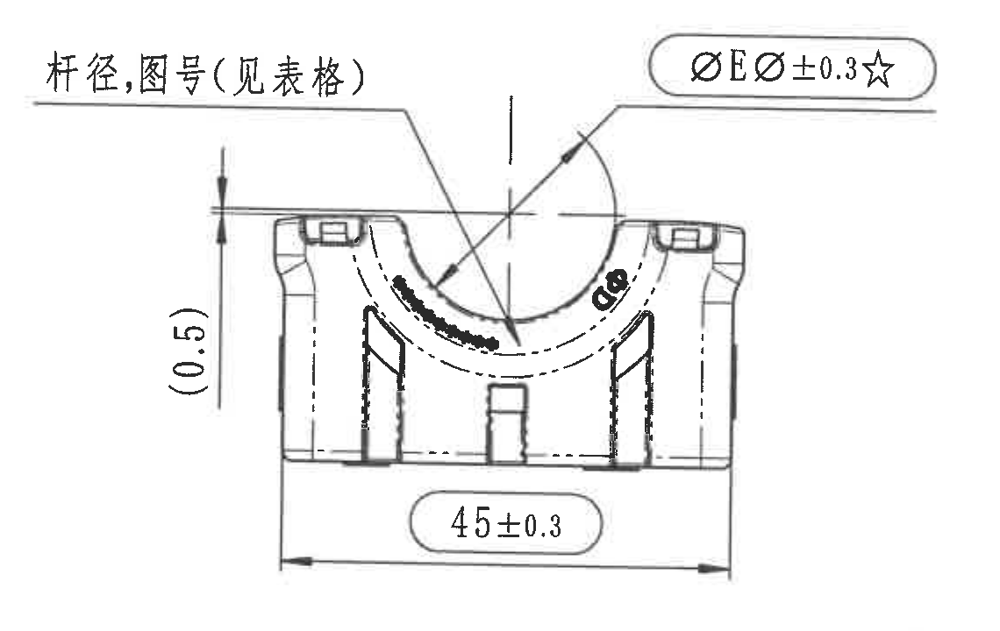

- 原图位置/视图名称：第 1 页中部左侧主视图。

| 提取项 | 原图数值或文本 | 含义说明 |
| --- | --- | --- |
| 引出说明 | 杆径,图号(见表格) | 杆径和图号不在本视图给定固定值，需按顶部 Variant 参数表选择 ØD 与相关图号。 |
| 关键直径标注 | ØEر0.3☆ | 与表格中的 Bushing diameter ØE 关联；±0.3 为该标注公差；☆按技术要求第13条表示关键尺寸。 |
| 参考尺寸 | (0.5) | 括号内参考尺寸，位于左侧竖向方向，仅作参考说明，不作为独立控制尺寸。 |
| 总宽尺寸 | 45±0.3 | 底部横向总宽尺寸，公差 ±0.3。 |

- 边界归属说明：左侧参考尺寸、上方直径引出线和底部 45±0.3 的箭头/尺寸线均完整；中间侧视图和 A-A/B-B 剖面尺寸不归入本视图。

## object_4 中间侧视图/剖切 A-A 来源视图

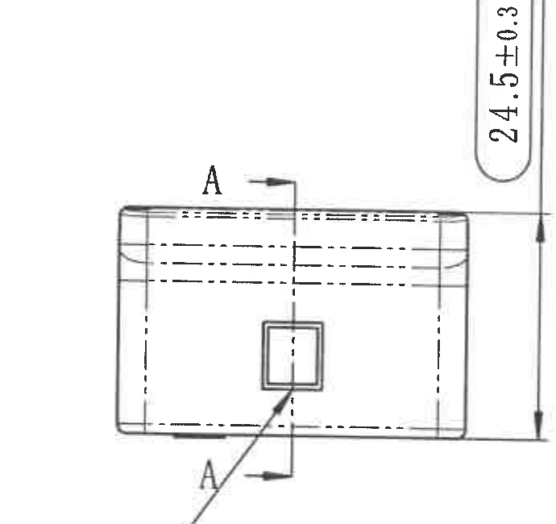

- 原图位置/视图名称：第 1 页中部，左主视图右侧。

| 提取项 | 原图数值或文本 | 含义说明 |
| --- | --- | --- |
| 剖切标识 | A / A | A-A 剖面来源位置，箭头标明剖视方向。 |
| 侧向高度 | 24.5±0.3 | 该侧视图竖向高度/厚度方向控制尺寸，公差 ±0.3。 |
| 关联局部标注 | 见 object_15: Variant(见表格) | 该标注归属于本侧视图，表示变型参数由顶部表格确定。 |

- 边界归属说明：本裁切只保留侧视图本体、A-A 剖切标识和 24.5±0.3；左下跨区 Variant 引出说明单独作为 object_15 记录。

## object_5 A-A 剖面视图

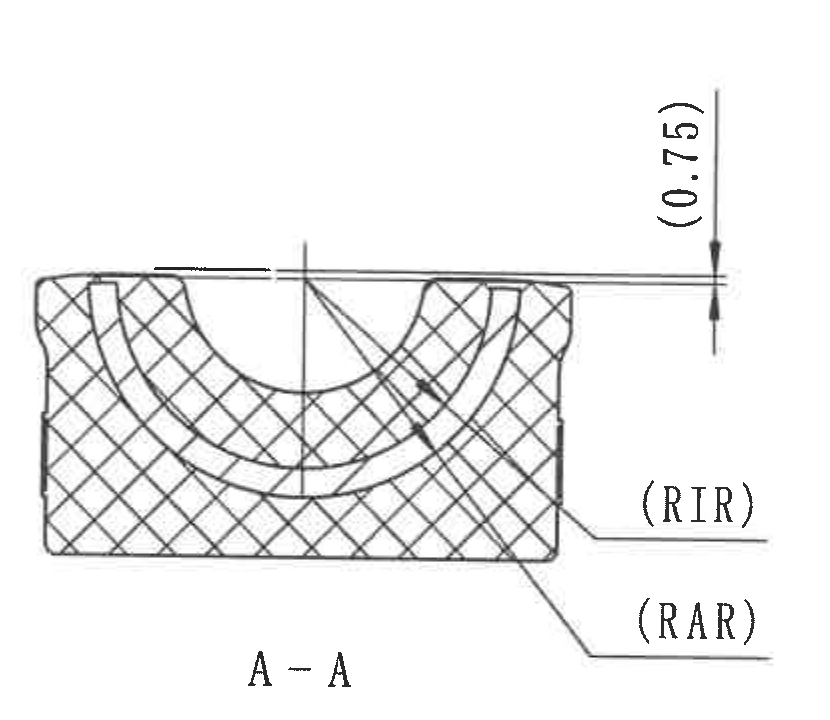

- 原图位置/视图名称：第 1 页中部，A-A 剖面。

| 提取项 | 原图数值或文本 | 含义说明 |
| --- | --- | --- |
| 剖面名称 | A-A | 对应 object_4 中 A-A 剖切线。 |
| 参考尺寸 | (0.75) | 括号内参考尺寸，位于剖面右上方，说明上缘局部厚度/间隙参考。 |
| 弧/半径参考标识 | (RIR) | 括号内参考标识，指向剖面中内侧弧线/半径位置。 |
| 弧/半径参考标识 | (RAR) | 括号内参考标识，指向剖面中外侧弧线/半径位置。 |

- 边界归属说明：裁切完整包含 A-A 剖面图形、剖面名、(0.75)、(RIR)、(RAR) 引线；右侧 B-B 剖面文字未纳入。

## object_6 B-B 剖面视图

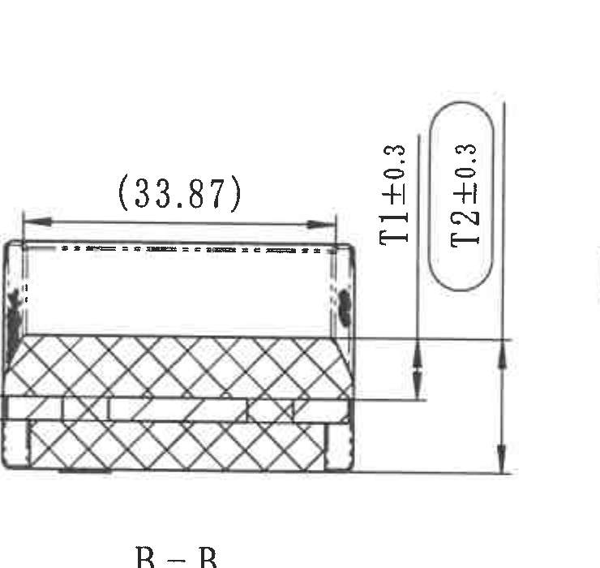

- 原图位置/视图名称：第 1 页中部，B-B 剖面。

| 提取项 | 原图数值或文本 | 含义说明 |
| --- | --- | --- |
| 剖面名称 | B-B | 对应 object_7 中 B-B 剖切线。 |
| 参考尺寸 | (33.87) | 括号内参考尺寸，位于上方横向尺寸线，表示该横向间距/宽度仅供参考。 |
| 厚度尺寸 | T1±0.3 | T1 为内橡胶厚度，具体值按顶部 Variant 参数表。 |
| 厚度尺寸 | T2±0.3 | T2 为橡胶总厚度/相关层厚，具体值按顶部 Variant 参数表。 |

- 边界归属说明：裁切完整包含 B-B 剖面、(33.87)、T1±0.3、T2±0.3 及箭头；右侧主视图的材料标识引出文字不在本对象中提取。

## object_7 右侧主视图/剖切 B-B 来源视图

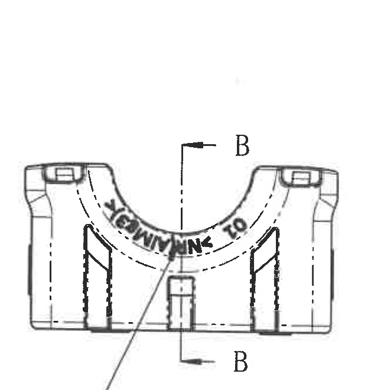

- 原图位置/视图名称：第 1 页中部右侧主视图。

| 提取项 | 原图数值或文本 | 含义说明 |
| --- | --- | --- |
| 剖切标识 | B / B | B-B 剖面来源位置，箭头标明剖视方向。 |
| 槽内模刻字符 | 图像可见，未作为尺寸转写 | 该字符属于模刻/标识内容，不作为尺寸或公差。 |
| 关联局部标注 | 见 object_16: 型腔号,材料标识 | 该引出说明归属于本视图，指向槽内标识位置。 |

- 边界归属说明：本对象只提取右侧主视图的 B-B 剖切标识；object_16 单独记录跨区引出说明，B-B 剖面尺寸不归入本视图。

## object_8 下方俯视图/底视图

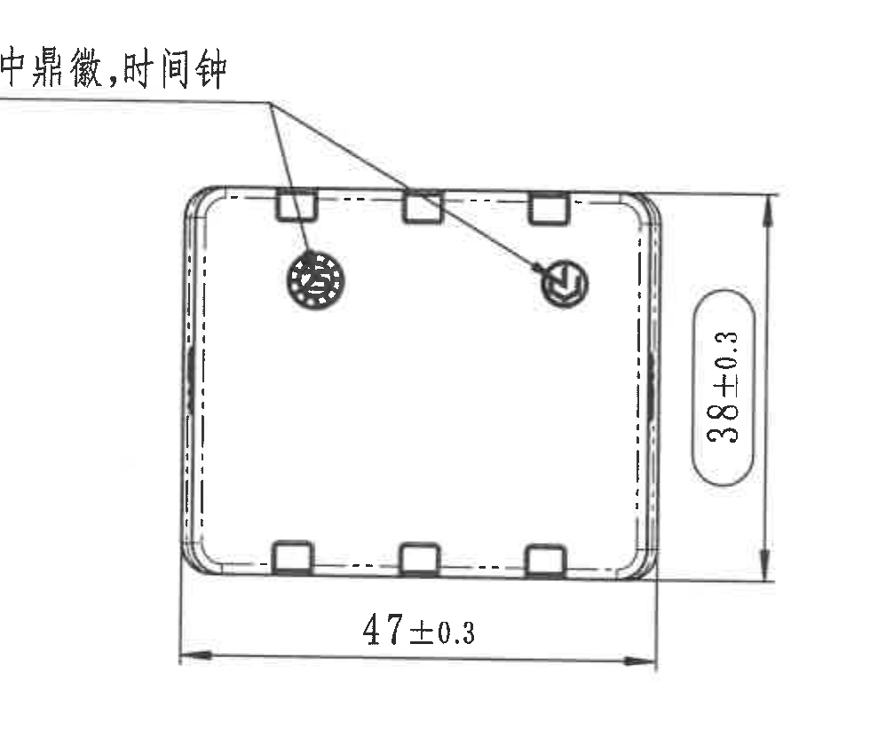

- 原图位置/视图名称：第 1 页中下方俯视图。

| 提取项 | 原图数值或文本 | 含义说明 |
| --- | --- | --- |
| 引出说明 | 中鼎徽,时间钟 | 指向俯视图内两个圆形标识位置，分别表示中鼎标识和时间钟/日期钟。 |
| 横向总长 | 47±0.3 | 底部横向尺寸，公差 ±0.3。 |
| 纵向总宽/高度 | 38±0.3 | 右侧竖向尺寸，公差 ±0.3。 |

- 边界归属说明：尺寸线、箭头和引出线完整；没有纳入左侧技术要求文字或右下标题栏内容。

## object_9 右下轴测参考视图

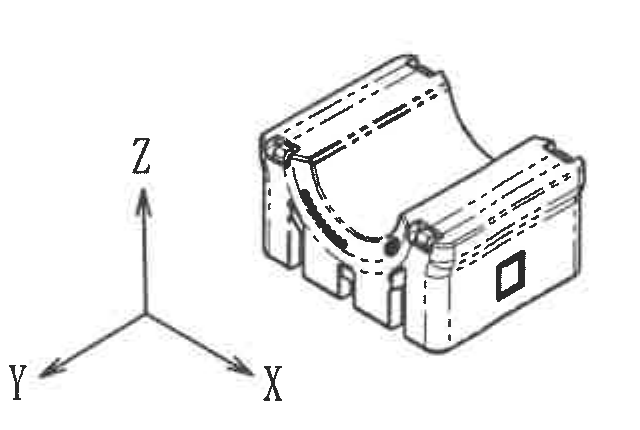

- 原图位置/视图名称：第 1 页右下角上方轴测图。

| 提取项 | 原图数值或文本 | 含义说明 |
| --- | --- | --- |
| 坐标方向 | X, Y, Z | 标明轴测图方向。 |
| 轴测图 | 零件三维外观 | 用于理解零件外形、槽口、侧面方形标识和圆弧槽结构；无尺寸。 |

- 边界归属说明：裁切包含完整 X/Y/Z 坐标箭头和轴测零件，不包含下方 BOM 表格数据。

## object_10 技术要求 NOTES

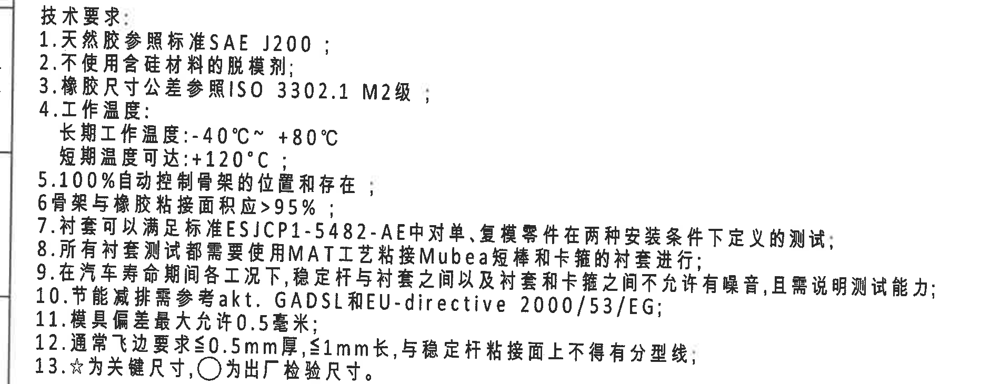

- 原图位置/视图名称：第 1 页左下 NOTES 区域。

| 序号 | 原图文本 | 含义说明 |
| --- | --- | --- |
| 1 | 天然胶参照标准SAE J200 | 橡胶材料标准引用 SAE J200。 |
| 2 | 不使用含硅材料的脱模剂 | 制造过程禁用含硅脱模剂。 |
| 3 | 橡胶尺寸公差参照ISO 3302.1 M2级 | 橡胶尺寸一般公差按 ISO 3302.1 M2。 |
| 4 | 工作温度: 长期工作温度:-40℃~ +80℃; 短期温度可达:+120℃ | 规定长期和短期温度范围。 |
| 5 | 100%自动控制骨架的位置和存在 | 骨架位置和存在性需 100% 自动检测/控制。 |
| 6 | 骨架与橡胶粘接面积应>95% | 骨架与橡胶粘接覆盖率要求。 |
| 7 | 衬套可以满足标准ESJCP1-5482-AE中对单、复模零件在两种安装条件下定义的测试 | 衬套测试标准和安装条件要求。 |
| 8 | 所有衬套测试都需要使用MAT工艺粘接Mubea短棒和卡箍的衬套进行 | 测试样件和工艺要求。 |
| 9 | 在汽车寿命期间各工况下，稳定杆与衬套之间以及衬套和卡箍之间不允许有噪音，且需说明测试能力 | NVH/噪声和测试能力说明要求。 |
| 10 | 节能减排需参考akt. GADSL和EU-directive 2000/53/EG | 环保/法规参考。 |
| 11 | 模具偏差最大允许0.5毫米 | 模具偏差上限。 |
| 12 | 通常飞边要求≤0.5mm厚，≤1mm长，与稳定杆粘接面上不得有分型线 | 飞边和粘接面分型线要求。 |
| 13 | ☆为关键尺寸，○为出厂检验尺寸 | 符号含义说明；星号标注的尺寸为关键尺寸。 |

- 边界归属说明：裁切包含 NOTES 全部 1-13 条，不包含下方 DIN 表。

## object_11 DIN ISO 3302-1 M2 class 公差表

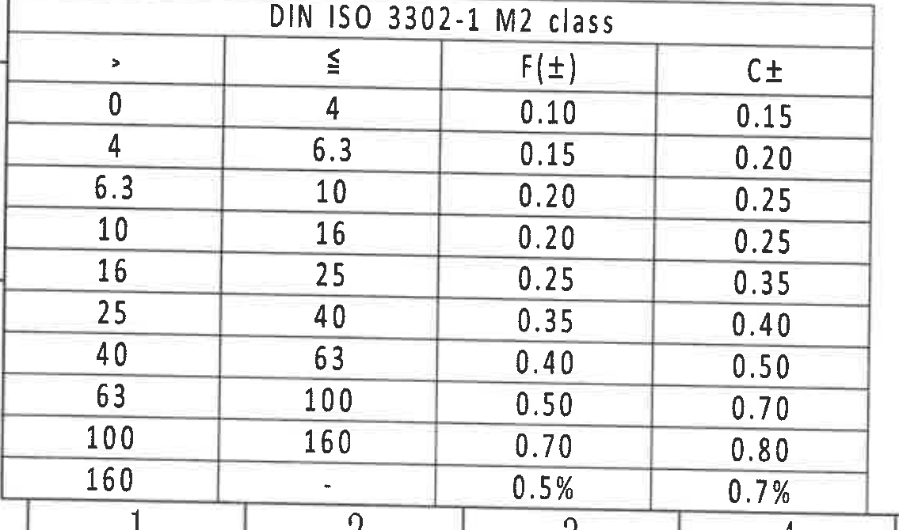

- 原图位置/视图名称：第 1 页左下，技术要求下方。

### 原表还原

| > | ≤ | F(±) | C± |
| --- | --- | --- | --- |
| 0 | 4 | 0.10 | 0.15 |
| 4 | 6.3 | 0.15 | 0.20 |
| 6.3 | 10 | 0.20 | 0.25 |
| 10 | 16 | 0.20 | 0.25 |
| 16 | 25 | 0.25 | 0.35 |
| 25 | 40 | 0.35 | 0.40 |
| 40 | 63 | 0.40 | 0.50 |
| 63 | 100 | 0.50 | 0.70 |
| 100 | 160 | 0.70 | 0.80 |
| 160 | - | 0.5% | 0.7% |

### 提取表格

| 提取项 | 原图数值或文本 | 含义说明 |
| --- | --- | --- |
| 表题 | DIN ISO 3302-1 M2 class | 橡胶件尺寸公差等级表。 |
| F(±) | 0.10 至 0.70，末行 0.5% | F 类公差列。 |
| C± | 0.15 至 0.80，末行 0.7% | C 类公差列。 |

- 边界归属说明：表格外框完整；左侧图框坐标字母和底部图框编号不作为表格字段提取。

## object_12 Reference 参考标准列表

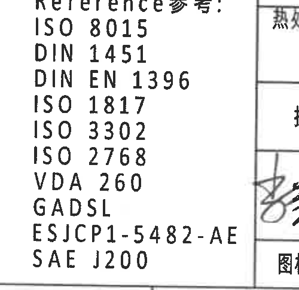

- 原图位置/视图名称：第 1 页底部中左参考标准区。

| 提取项 | 原图数值或文本 | 含义说明 |
| --- | --- | --- |
| 标题 | Reference参考 | 参考标准列表标题。 |
| 标准 | ISO 8015 | 参考标准。 |
| 标准 | DIN 1451 | 参考标准。 |
| 标准 | DIN EN 1396 | 参考标准。 |
| 标准 | ISO 1817 | 参考标准。 |
| 标准 | ISO 3302 | 参考标准。 |
| 标准 | ISO 2768 | 参考标准。 |
| 标准 | VDA 260 | 参考标准。 |
| 标准 | GADSL | 参考标准。 |
| 标准 | ESJCP1-5482-AE | 参考标准。 |
| 标准 | SAE J200 | 参考标准。 |

- 边界归属说明：右侧签字格边线因原图相邻可见，但提取内容仅限 Reference 列表。

## object_13 右下 BOM/明细表

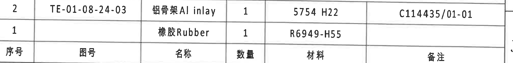

- 原图位置/视图名称：第 1 页右下，标题栏上方。

### 原表还原

| 序号 | 图号 | 名称 | 数量 | 材料 | 备注 |
| --- | --- | --- | --- | --- | --- |
| 2 | TE-01-08-24-03 | 铝骨架 Al inlay | 1 | 5754 H22 | C114435/01-01 |
| 1 |  | 橡胶 Rubber | 1 | R6949-H55 |  |

### 提取表格

| 提取项 | 原图数值或文本 | 含义说明 |
| --- | --- | --- |
| 序号 2 | TE-01-08-24-03 / 铝骨架 Al inlay / 1 / 5754 H22 / C114435/01-01 | 铝骨架明细。 |
| 序号 1 | 空白图号 / 橡胶 Rubber / 1 / R6949-H55 / 空白备注 | 橡胶明细。 |

- 边界归属说明：表头位于表格底行，零件行位于上方；下方标题栏字段不纳入 BOM。

## object_14 右下标题栏

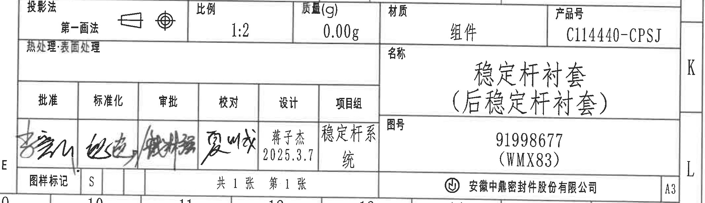

- 原图位置/视图名称：第 1 页右下标题栏。

| 字段 | 原图数值或文本 | 含义说明 |
| --- | --- | --- |
| 投影法 | 第一画法 | 第一角投影法，旁边有投影符号。 |
| 比例 | 1:2 | 图纸比例。 |
| 质量(g) | 0.00g | 图纸标题栏质量字段。 |
| 材质 | 组件 | 对象为组件。 |
| 产品号 | C114440-CPSJ | 产品号。 |
| 热处理·表面处理 | 空白 | 标题栏中未填写具体处理。 |
| 名称 | 稳定杆衬套（后稳定杆衬套） | 零件/组件名称。 |
| 图号 | 91998677 (WMX83) | 图号/识别号。 |
| 批准 | 手写签名 | 手写签名，未臆测姓名。 |
| 标准化 | 手写签名 | 手写签名，未臆测姓名。 |
| 审批 | 手写签名 | 手写签名，未臆测姓名。 |
| 校对 | 手写签名 | 手写签名，未臆测姓名。 |
| 设计 | 蒋子杰 2025.3.7 | 设计人员和日期。 |
| 项目组 | 稳定杆系统 | 项目组名称。 |
| 图样标记 | S | 图样标记字段。 |
| 页数 | 共 1 张 第 1 张 | 总页数和当前页。 |
| 公司 | 安徽中鼎密封件股份有限公司 | 出图单位。 |
| 图幅 | A3 | 图纸幅面。 |

- 边界归属说明：裁切保留标题栏全部主要字段和签字格；上方 BOM 明细行不作为标题栏内容。

## object_15 Variant(见表格) 局部引出标注

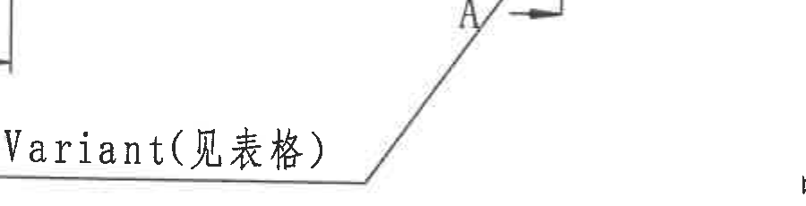

- 原图位置/视图名称：第 1 页中部左下，归属于 object_4 中间侧视图。

| 提取项 | 原图数值或文本 | 含义说明 |
| --- | --- | --- |
| 局部引出说明 | Variant(见表格) | 本侧视图的变型参数需查顶部 Variant 参数表。 |

- 边界归属说明：为保留完整引出线，裁切中可见少量相邻图形线段；只提取 Variant 引出说明，不把相邻线段作为独立尺寸。

## object_16 型腔号,材料标识 局部引出标注

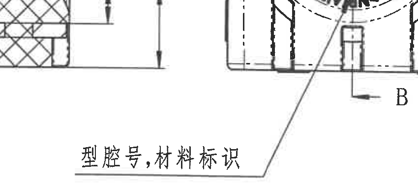

- 原图位置/视图名称：第 1 页中部右下，归属于 object_7 右侧主视图。

| 提取项 | 原图数值或文本 | 含义说明 |
| --- | --- | --- |
| 局部引出说明 | 型腔号,材料标识 | 指向右侧主视图槽内模刻/材料标识位置。 |

- 边界归属说明：该引出线跨越 B-B 剖面与右侧主视图之间；只提取“型腔号,材料标识”，不把左侧剖面片段归入本局部标注。

## 裁切检查记录

| 图片 | 检查结论 | 说明 |
| --- | --- | --- |
| page_1.png | 完整 | 整页渲染，页面边框和所有对象可见。 |
| object_1.png | 完整 | 变更履历表文字完整；底部参数表未作为本对象提取。 |
| object_2.png | 完整 | 参数表表头、行列和底线完整；下方视图尺寸未纳入。 |
| object_3.png | 完整 | 45±0.3、(0.5)、ØEر0.3☆、引出线完整。 |
| object_4.png | 完整 | 24.5±0.3 和 A-A 剖切标识完整；Variant 跨区标注见 object_15。 |
| object_5.png | 完整 | A-A、(0.75)、(RIR)、(RAR) 和引线完整。 |
| object_6.png | 完整 | B-B、(33.87)、T1±0.3、T2±0.3 和箭头完整。 |
| object_7.png | 完整 | B-B 剖切标识完整；材料标识跨区引出见 object_16。 |
| object_8.png | 完整 | 47±0.3、38±0.3、“中鼎徽,时间钟”引出线完整。 |
| object_9.png | 完整 | X/Y/Z 坐标和轴测图完整；未带入 BOM 字段。 |
| object_10.png | 完整 | 技术要求 1-13 完整；未带入 DIN 表。 |
| object_11.png | 完整 | DIN 公差表标题、表头和全部行完整。 |
| object_12.png | 完整 | Reference 参考列表完整；右侧相邻表线不提取。 |
| object_13.png | 完整 | BOM 表头和两行明细完整；标题栏字段不提取。 |
| object_14.png | 完整 | 标题栏主要字段、签字格、图号、公司和 A3 栏完整。 |
| object_15.png | 完整 | Variant 引出文字和引出线完整；相邻线段不提取。 |
| object_16.png | 完整 | 型腔号/材料标识文字和引出线完整；相邻剖面片段不提取。 |
