# 20C114441 图纸内容识别与裁切提取

整页 PNG：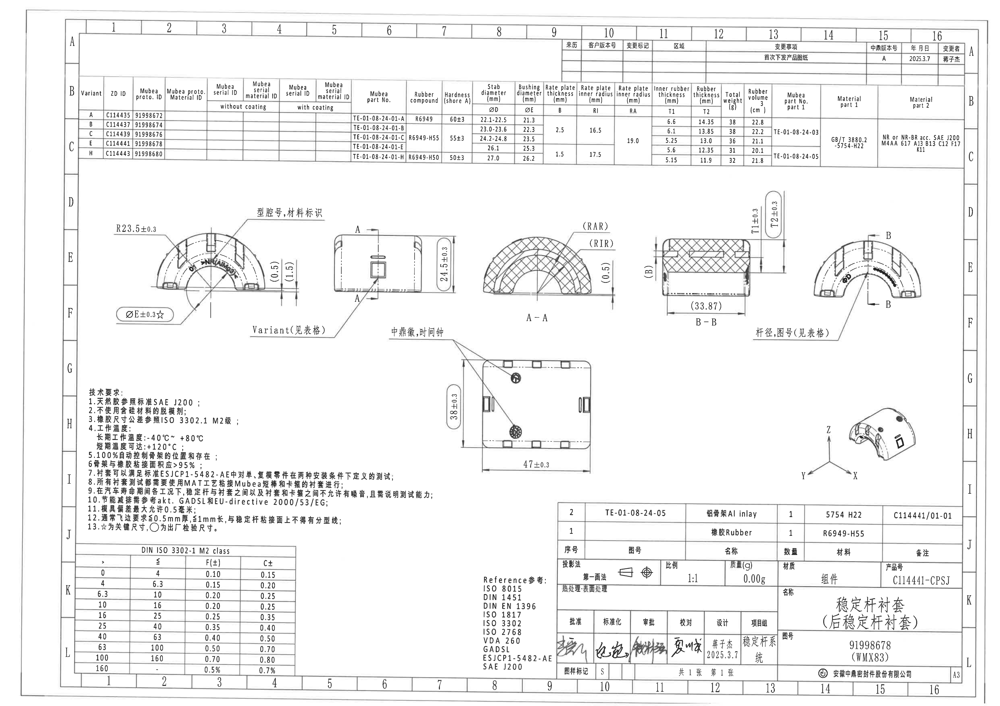

说明：bbox 使用 `[x, y, width, height]`，坐标基于整页 PNG `outputs/20C114441_assets/images/page_1.png`，尺寸为 4959×3505 px。以下按原图对象分区排列，不对原图结构做主观合并。

## object_1 - 主视图/前视图：半圆橡胶衬套端面

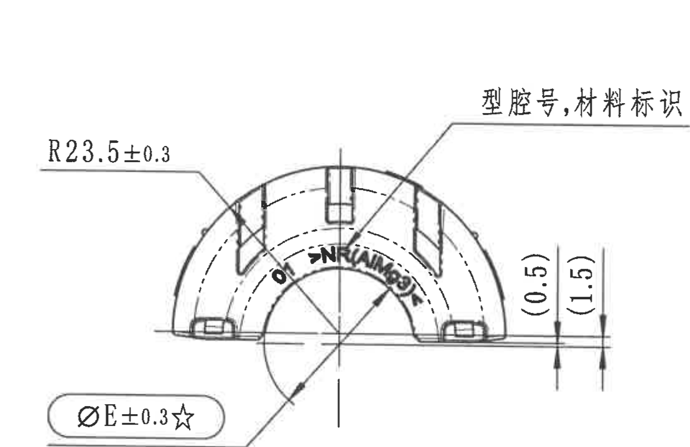

- 原图位置/视图名称：主视图/前视图：半圆橡胶衬套端面；page 1；bbox `[500, 890, 1110, 720]`。
| 提取项 | 原图数值或文本 | 含义说明 |
| --- | --- | --- |
| 圆弧半径 | R23.5±0.3 | 主视图左上外圆弧半径，公差 ±0.3。 |
| 关键直径 | ØE±0.3☆ | 主视图左下关键尺寸；ØE 的具体数值由参数表按 Variant 取值；☆见技术要求第13条，为关键尺寸。 |
| 参考尺寸 | (0.5) | 主视图右侧底部参考尺寸，括号表示参考。 |
| 参考尺寸 | (1.5) | 主视图右侧底部参考尺寸，括号表示参考。 |
| 标识说明 | 型腔号,材料标识 | 引线指向上部型腔号和材料标识区域。 |

边界归属说明：位置约在图纸 E-F/2-5 区。主视图显示半圆拱形外形、内外圆弧和底部结构；R23.5±0.3 为左上外圆弧半径；ØE±0.3☆ 为内孔/衬套直径 E，星号表示关键尺寸，具体 ØE 数值按参数表各 Variant；(0.5) 与 (1.5) 为右侧底部参考尺寸，括号表示参考尺寸；“型腔号,材料标识”指向上部标识/型腔号位置。边界归属：右侧相邻侧视图已排除，仅保留主视图尺寸线、箭头、引线和文字；下方未纳入 Variant 引线文字，该标注属于侧视图。

## object_2 - 侧视图：A-A 剖切位置与高度

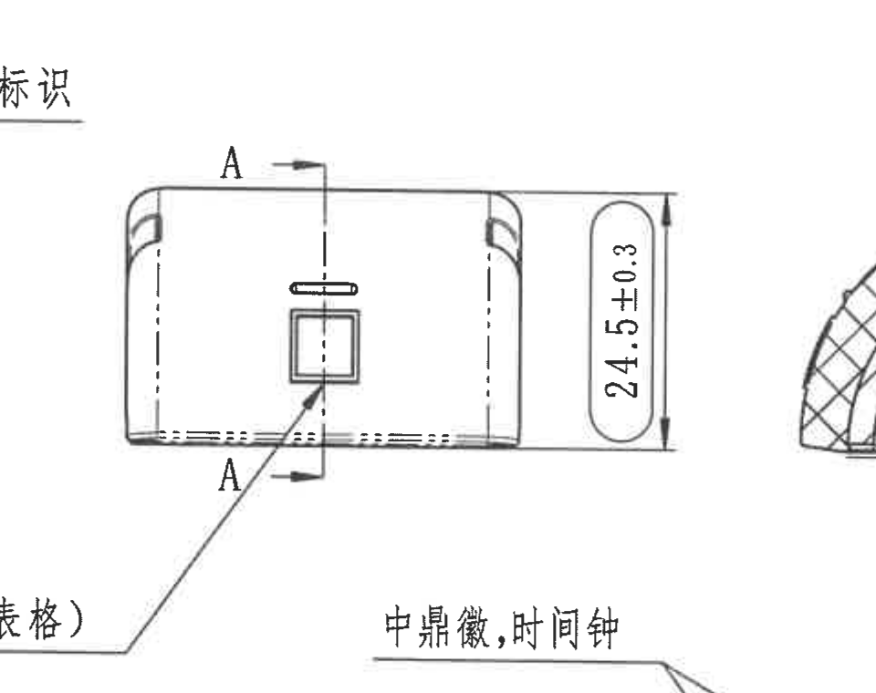

- 原图位置/视图名称：侧视图：A-A 剖切位置与高度；page 1；bbox `[1520, 960, 960, 760]`。
| 提取项 | 原图数值或文本 | 含义说明 |
| --- | --- | --- |
| 剖切标记 | A-A | 侧视图中部剖切线和箭头，指向 A-A 剖面。 |
| 总高度 | 24.5±0.3 | 侧视图右侧垂直高度尺寸，公差 ±0.3。 |
| 变体标识 | Variant(见表格) | 该位置变体信息需要按参数表读取。 |
| 标识说明 | 中鼎徽,时间钟 | 引线指向侧面标识/时间钟位置。 |

边界归属说明：位置约在图纸 E-F/5-8 区。侧视图显示零件侧面矩形轮廓、圆角、槽孔和方形标记；A-A 为剖切方向/剖切线，指向 A-A 剖面；24.5±0.3 为侧视总高度；Variant(见表格) 指该位置的变体信息按参数表选择；“中鼎徽,时间钟”引线指示侧面标识位置。边界归属：右侧可见 A-A 剖面极少量边缘，仅作为相邻视图残留，不提取为侧视图内容；左侧主视图尺寸不归入本对象。

## object_3 - A-A 剖面：径向结构和内半径

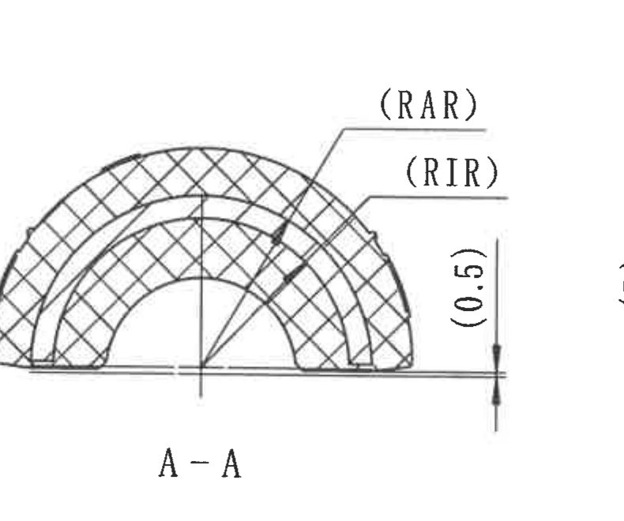

- 原图位置/视图名称：A-A 剖面：径向结构和内半径；page 1；bbox `[2410, 990, 790, 660]`。
| 提取项 | 原图数值或文本 | 含义说明 |
| --- | --- | --- |
| 剖面名称 | A-A | 与侧视图 A-A 剖切线对应。 |
| 弧向/半径参考 | (RAR) | Rate plate inner radius RA 的参考引出，具体 RA 见参数表。 |
| 弧向/半径参考 | (RIR) | Rate plate inner radius RI 的参考引出，具体 RI 见参数表。 |
| 参考尺寸 | (0.5) | 右侧垂直参考尺寸，括号表示参考。 |

边界归属说明：位置约在图纸 E-F/8-10 区。A-A 剖面显示橡胶剖切填充、内外弧形结构和径向引线；(RAR) 为 Rate plate inner radius RA 的参考引出，具体数值按参数表；(RIR) 为 Rate plate inner radius RI 的参考引出，具体数值按参数表；(0.5) 为右侧垂直参考尺寸，括号表示参考。边界归属：右边 B-B 剖面已通过重裁排除；本对象只提取 A-A 剖面内的剖面线、弧向/半径引线和参考尺寸。

## object_4 - B-B 剖面：厚度和宽度参考

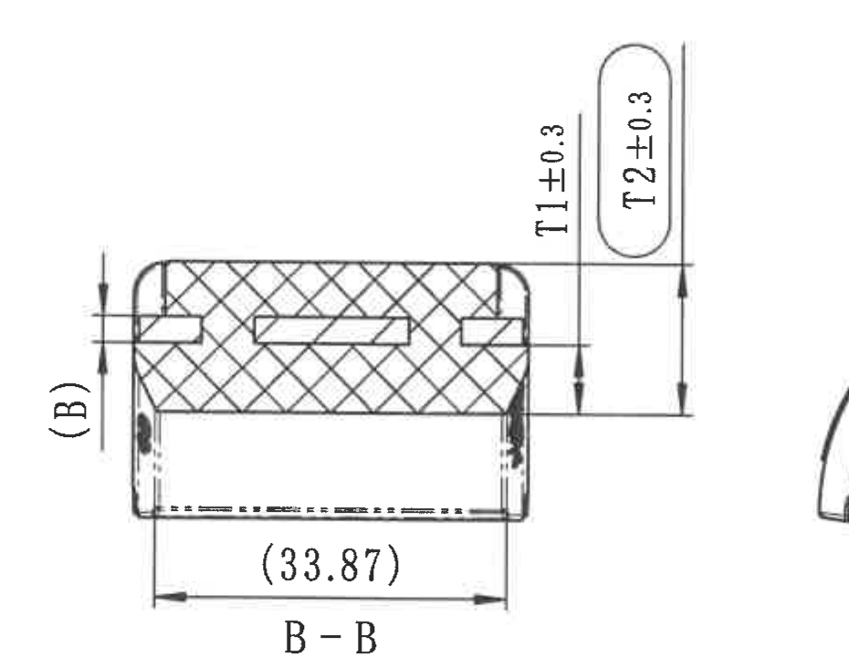

- 原图位置/视图名称：B-B 剖面：厚度和宽度参考；page 1；bbox `[3140, 900, 930, 720]`。
| 提取项 | 原图数值或文本 | 含义说明 |
| --- | --- | --- |
| 剖面名称 | B-B | 与右端视图 B-B 剖切线对应。 |
| 参考尺寸 | (B) | 左侧参考尺寸，B 具体值见参数表。 |
| 厚度尺寸 | T1±0.3 | 内橡胶厚度 T1，公差 ±0.3；具体 T1 见参数表。 |
| 厚度尺寸 | T2±0.3 | 橡胶厚度 T2，公差 ±0.3；具体 T2 见参数表。 |
| 参考宽度 | (33.87) | 底部宽度参考尺寸，括号表示参考。 |

边界归属说明：位置约在图纸 D-F/11-13 区。B-B 剖面显示横向剖切结构、橡胶剖面填充和内部骨架；T1±0.3 为内橡胶厚度 T1；T2±0.3 为橡胶厚度 T2；(B) 为左侧参考厚度/位置；(33.87) 为底部宽度参考尺寸，括号表示参考。边界归属：右侧出现少量相邻端视图边缘，不作为 B-B 内容；左侧 (B) 尺寸线已完整保留。

## object_5 - 右端视图：杆径与 B-B 剖切位置

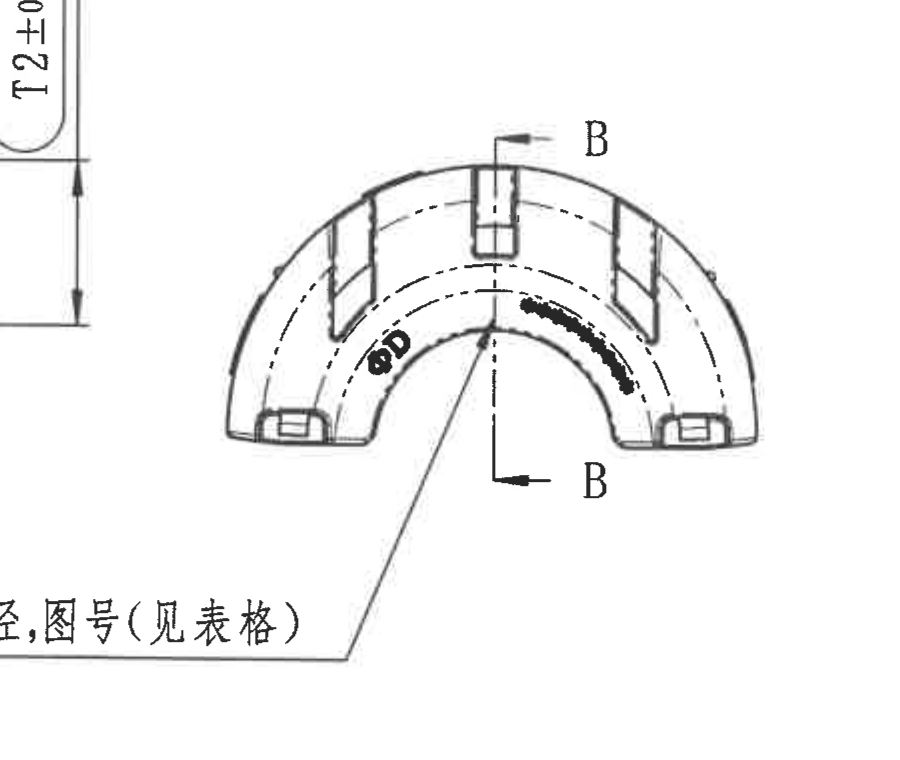

- 原图位置/视图名称：右端视图：杆径与 B-B 剖切位置；page 1；bbox `[3810, 1030, 900, 760]`。
| 提取项 | 原图数值或文本 | 含义说明 |
| --- | --- | --- |
| 直径代号 | ØD | 杆径/Stable diameter，具体 ØD 按参数表 Variant 取值。 |
| 剖切标记 | B-B | 右端视图中部剖切线和方向，指向 B-B 剖面。 |
| 引出说明 | 杆径,图号(见表格) | 杆径与图号均按参数表对应变体读取。 |

边界归属说明：位置约在图纸 E-F/13-16 区。右端视图显示半圆端面、内外弧和剖切线；ØD 为 Stab diameter/杆径，对应参数表 ØD 列；B-B 剖切标记给出 B-B 剖面方向；“杆径,图号(见表格)”说明 ØD 和图号/零件号按参数表对应变体读取。边界归属：左上角带入 B-B 的 T2 尺寸片段，因完整保留本视图引出文字而不可避免，未归入本对象提取；右侧图框坐标已排除。

## object_6 - 俯视图：总体长宽和标记位置

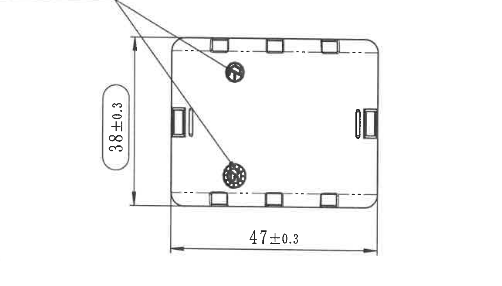

- 原图位置/视图名称：俯视图：总体长宽和标记位置；page 1；bbox `[1950, 1690, 1300, 740]`。
| 提取项 | 原图数值或文本 | 含义说明 |
| --- | --- | --- |
| 总宽/高度 | 38±0.3 | 俯视图左侧垂直总尺寸，公差 ±0.3。 |
| 总长度 | 47±0.3 | 俯视图底部水平总尺寸，公差 ±0.3。 |
| 标识位置 | 中鼎徽,时间钟引线 | 两条引线指向平面上的圆形标识位置；文字完整见侧视图对象。 |

边界归属说明：位置约在图纸 G-H/7-10 区。俯视图显示矩形平面轮廓、圆角、侧槽、上下小槽和两处圆形标记；38±0.3 为俯视宽度/高度方向总尺寸；47±0.3 为长度方向总尺寸；两条引线指向中鼎徽和时间钟位置。边界归属：为避免混入上方 A-A 标题和下方明细表，裁切只保留引线主体、尺寸线和视图本体；“中鼎徽,时间钟”文字完整见相邻侧视图对象。

## object_7 - 局部轴测视图：三维方向示意

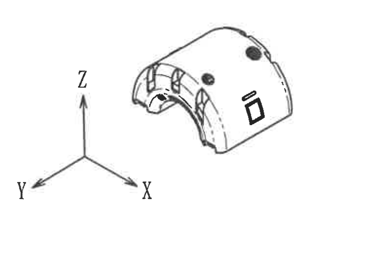

- 原图位置/视图名称：局部轴测视图：三维方向示意；page 1；bbox `[3940, 1970, 780, 520]`。
| 提取项 | 原图数值或文本 | 含义说明 |
| --- | --- | --- |
| 坐标轴 | Z、Y、X | 轴测方向示意。 |
| 三维外观 | 零件轴测图 | 用于展示槽、孔、标记在三维外观上的位置，无独立尺寸数值。 |

边界归属说明：位置约在图纸 H-I/14-16 区。局部轴测图展示零件外形、槽、孔/标记位置以及坐标方向；没有独立尺寸数值。边界归属：右侧图框坐标和下方标题栏/BOM 片段已通过重裁排除，仅提取三维视图和 XYZ 坐标轴。

## object_8 - 修订履历表/变更记录

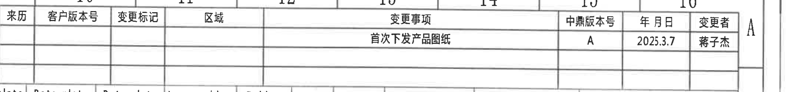

- 原图位置/视图名称：修订履历表/变更记录；page 1；bbox `[2790, 180, 2130, 250]`。
| 来历 | 客户版本号 | 变更标记 | 区域 | 变更事项 | 中鼎版本号 | 年月日 | 变更者 |
| --- | --- | --- | --- | --- | --- | --- | --- |
|  |  |  |  | 首次下发产品图纸 | A | 2025.3.7 | 蒋子杰 |

| 提取项 | 原图数值或文本 | 含义说明 |
| --- | --- | --- |
| 修订记录 | 首次下发产品图纸 / A / 2025.3.7 / 蒋子杰 | 首次发布该产品图纸；原图无 ECN NO 列。 |

边界归属说明：位置在图纸上方 A 区/10-16 列。该对象是修订履历表，按原表列还原；原图未显示 ECN NO 列。边界归属：上缘靠近图框列号，底部靠近参数表上边框，仅提取修订履历表内字段。

## object_9 - Variant 参数表/材料与尺寸参数表

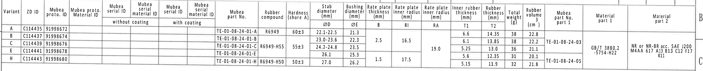

- 原图位置/视图名称：Variant 参数表/材料与尺寸参数表；page 1；bbox `[380, 390, 4450, 450]`。
| Variant | ZD ID | Mubea proto.ID | Mubea proto. Material ID | Mubea serial ID without coating | Mubea serial material ID without coating | Mubea serial ID with coating | Mubea serial material ID with coating | Mubea part No. | Rubber compound | Hardness (shore A) | ØD | ØE | B | RI | RA | T1 | T2 | Total weight (g) | Rubber volume (cm^3) | Mubea part No. part 1 | Material part 1 | Material part 2 |
| --- | --- | --- | --- | --- | --- | --- | --- | --- | --- | --- | --- | --- | --- | --- | --- | --- | --- | --- | --- | --- | --- | --- |
| A | C114435 | 91998672 |  |  |  |  |  | TE-01-08-24-01-A | R6949 | 60±3 | 22.1-22.5 | 21.3 |  |  |  | 6.6 | 14.35 | 38 | 22.8 |  |  |  |
| B | C114437 | 91998674 |  |  |  |  |  | TE-01-08-24-01-B |  |  | 23.0-23.6 | 22.3 | 2.5 | 16.5 |  | 6.1 | 13.85 | 38 | 22.2 |  |  |  |
| C | C114439 | 91998676 |  |  |  |  |  | TE-01-08-24-01-C | R6949-H55 | 55±3 | 24.2-24.8 | 23.5 |  |  | 19.0 | 5.25 | 13.0 | 36 | 21.1 | TE-01-08-24-03 | GB/T 3880.2 -5754-H22 | NR or NR-BR acc. SAE J200 M4AA 617 A13 B13 C12 F17 K11 |
| E | C114441 | 91998678 |  |  |  |  |  | TE-01-08-24-01-E |  |  | 26.1 | 25.3 |  |  |  | 5.6 | 12.35 | 31 | 20.1 |  |  |  |
| H | C114443 | 91998680 |  |  |  |  |  | TE-01-08-24-01-H | R6949-H50 | 50±3 | 27.0 | 26.2 | 1.5 | 17.5 |  | 5.15 | 11.9 | 32 | 21.8 | TE-01-08-24-05 |  |  |

| 提取项 | 原图数值或文本 | 含义说明 |
| --- | --- | --- |
| ØD/ØE | 按 Variant 行取值 | 用于主视图/右端视图中的直径代号。 |
| B、RI、RA、T1、T2 | 按 Variant 行取值 | 用于 B-B、A-A 剖面中的厚度、内半径和参考尺寸。 |
| Rubber compound/Hardness | R6949、R6949-H55、R6949-H50；60±3、55±3、50±3 | 橡胶配方与硬度。 |
| Material part 1/2 | GB/T 3880.2 -5754-H22；NR or NR-BR acc. SAE J200 M4AA 617 A13 B13 C12 F17 K11 | 材料规范。 |

边界归属说明：位置在图纸上方 B-C 区/1-16 列。参数表定义各 Variant 的零件号、材料、硬度、直径、厚度、半径、重量和体积；视图中的 ØD、ØE、B、RI/RIR、RA/RAR、T1、T2 等代号均由此表取值。边界归属：右边图框坐标 B/C 靠近表格外框，未作为表格字段提取；空白单元格按空值还原。

## object_10 - NOTES/技术要求

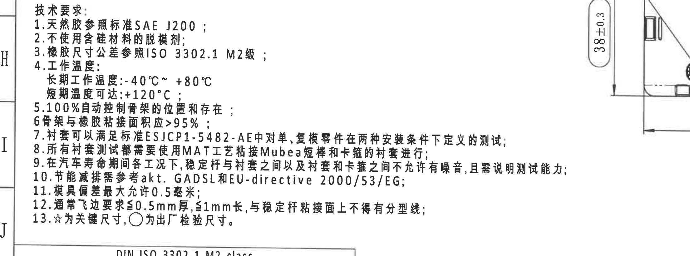

- 原图位置/视图名称：NOTES/技术要求；page 1；bbox `[330, 1915, 2210, 820]`。
| 提取项 | 原图数值或文本 | 含义说明 |
| --- | --- | --- |
| 1 | 天然胶参照标准 SAE J200 | 材料标准要求。 |
| 2 | 不使用含硅材料的脱模剂 | 脱模剂限制。 |
| 3 | 橡胶尺寸公差参照 ISO 3302.1 M2级 | 橡胶尺寸公差等级。 |
| 4 | 长期工作温度 -40℃~+80℃；短期温度可达 +120℃ | 工作温度范围。 |
| 5 | 100%自动控制骨架的位置和存在 | 骨架位置/存在性检测要求。 |
| 6 | 骨架与橡胶粘接面积应>95% | 粘接面积要求。 |
| 7 | 衬套可以满足标准 ESJCP1-5482-AE 中对单、复模零件在两种安装条件下定义的测试 | 测试标准要求。 |
| 8 | 所有衬套测试都需要使用 MAT 工艺粘接 Mubea 短棒和卡箍的衬套进行 | 测试件工艺要求。 |
| 9 | 在汽车寿命期间各工况下，稳定杆与衬套之间以及衬套和卡箍之间不允许有噪音，且需说明测试能力 | 寿命期噪音和测试能力要求。 |
| 10 | 节能减排需参考 akt、GADSL 和 EU-directive 2000/53/EG | 法规/环保参考。 |
| 11 | 模具偏差最大允许 0.5 毫米 | 模具偏差限制。 |
| 12 | 通常飞边要求 ≤0.5mm 厚，≤1mm 长，与稳定杆粘接面上不得有分型线 | 飞边和分型线要求。 |
| 13 | ☆为关键尺寸，○为出厂检验尺寸 | 图纸符号含义。 |

边界归属说明：位置在图纸左下 H-J 区/1-8 列。NOTES 是技术要求文本，定义材料、脱模剂、公差、温度、粘接、测试、法规、模具偏差、飞边和符号含义。边界归属：右侧扩宽是为了完整保留第 7-10 条长句，画面右侧可见俯视图 38±0.3 的局部，不作为 NOTES 内容；底部公差表表头不归入本对象。

## object_11 - DIN ISO 3302-1 M2 class 公差表

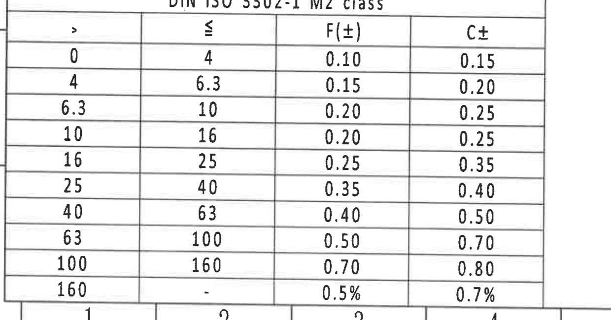

- 原图位置/视图名称：DIN ISO 3302-1 M2 class 公差表；page 1；bbox `[360, 2730, 1240, 650]`。
| > | ≤ | F(±) | C± |
| --- | --- | --- | --- |
| 0 | 4 | 0.10 | 0.15 |
| 4 | 6.3 | 0.15 | 0.20 |
| 6.3 | 10 | 0.20 | 0.25 |
| 10 | 16 | 0.20 | 0.25 |
| 16 | 25 | 0.25 | 0.35 |
| 25 | 40 | 0.35 | 0.40 |
| 40 | 63 | 0.40 | 0.50 |
| 63 | 100 | 0.50 | 0.70 |
| 100 | 160 | 0.70 | 0.80 |
| 160 | - | 0.5% | 0.7% |

| 提取项 | 原图数值或文本 | 含义说明 |
| --- | --- | --- |
| 标准/等级 | DIN ISO 3302-1 M2 class | 橡胶尺寸通用公差表。 |

边界归属说明：位置在图纸左下 J-L 区/1-4 列。该表给出 ISO 3302-1 M2 等级下不同尺寸范围的 F、C 类橡胶尺寸公差。边界归属：上下左右表格边框完整；底部图框坐标不作为表格数据。

## object_12 - Reference 参考标准列表

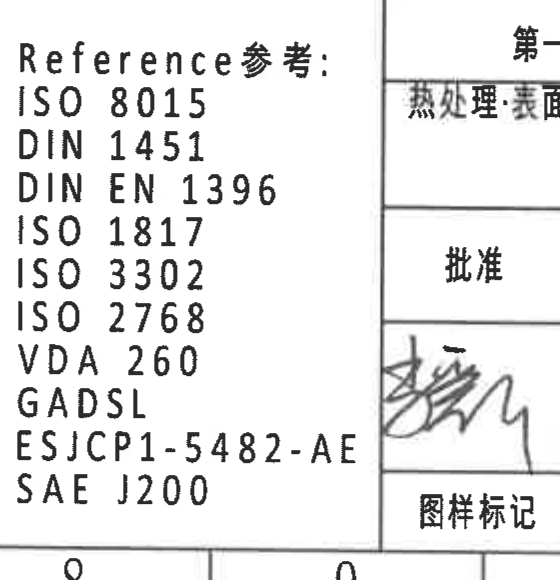

- 原图位置/视图名称：Reference 参考标准列表；page 1；bbox `[2380, 2820, 560, 580]`。
| 提取项 | 原图数值或文本 | 含义说明 |
| --- | --- | --- |
| 1 | ISO 8015 | 参考标准/规范编号 |
| 2 | DIN 1451 | 参考标准/规范编号 |
| 3 | DIN EN 1396 | 参考标准/规范编号 |
| 4 | ISO 1817 | 参考标准/规范编号 |
| 5 | ISO 3302 | 参考标准/规范编号 |
| 6 | ISO 2768 | 参考标准/规范编号 |
| 7 | VDA 260 | 参考标准/规范编号 |
| 8 | GADSL | 参考标准/规范编号 |
| 9 | ESJCP1-5482-AE | 参考标准/规范编号 |
| 10 | SAE J200 | 参考标准/规范编号 |

| 序号 | 原图文本 | 含义说明 |
| --- | --- | --- |
| 1 | ISO 8015 | 参考标准/规范编号 |
| 2 | DIN 1451 | 参考标准/规范编号 |
| 3 | DIN EN 1396 | 参考标准/规范编号 |
| 4 | ISO 1817 | 参考标准/规范编号 |
| 5 | ISO 3302 | 参考标准/规范编号 |
| 6 | ISO 2768 | 参考标准/规范编号 |
| 7 | VDA 260 | 参考标准/规范编号 |
| 8 | GADSL | 参考标准/规范编号 |
| 9 | ESJCP1-5482-AE | 参考标准/规范编号 |
| 10 | SAE J200 | 参考标准/规范编号 |

边界归属说明：位置在图纸下方 K-L 区/8-10 列。参考标准列表给出图纸适用或参考的规范编号。边界归属：右侧可见标题栏签署区边缘，未作为参考标准提取；标准列表完整。

## object_13 - 明细表/BOM

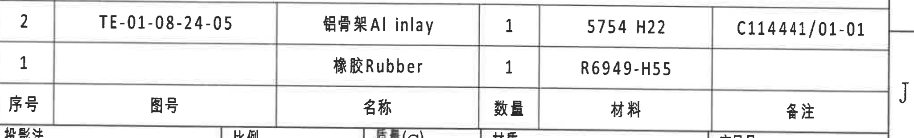

- 原图位置/视图名称：明细表/BOM；page 1；bbox `[2780, 2495, 2050, 310]`。
| 序号 | 图号 | 名称 | 数量 | 材料 | 备注 |
| --- | --- | --- | --- | --- | --- |
| 2 | TE-01-08-24-05 | 铝骨架 Al inlay | 1 | 5754 H22 | C114441/01-01 |
| 1 |  | 橡胶 Rubber | 1 | R6949-H55 |  |

| 提取项 | 原图数值或文本 | 含义说明 |
| --- | --- | --- |
| BOM | 2 项 | 组件由铝骨架和橡胶组成。 |

边界归属说明：位置在图纸右下 J 区/10-16 列。BOM 列出组件包含铝骨架和橡胶两项材料。边界归属：底部与标题栏相接，裁切保留 BOM 表头和两条记录；下方投影法/比例/质量等属于标题栏对象，不在本对象提取。

## object_14 - 标题栏/图纸信息栏

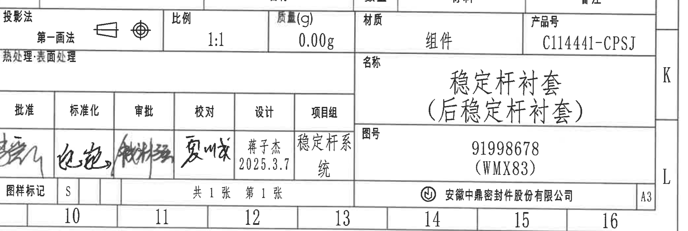

- 原图位置/视图名称：标题栏/图纸信息栏；page 1；bbox `[2780, 2750, 2090, 705]`。
| 字段 | 原图数值或文本 | 含义说明 |
| --- | --- | --- |
| 投影法 | 第一画法 | 图纸投影方法。 |
| 比例 | 1:1 | 绘图比例。 |
| 质量(g) | 0.00g | 标题栏质量字段。 |
| 材质 | 组件 | 产品形式/材质栏。 |
| 产品号 | C114441-CPSJ | 产品号。 |
| 名称 | 稳定杆衬套（后稳定杆衬套） | 零件名称。 |
| 图号 | 91998678 (WMX83) | 图纸编号/括号内客户或项目代号。 |
| 设计 | 蒋子杰 2025.3.7 | 设计人和日期。 |
| 项目组 | 稳定杆系统 | 项目组。 |
| 图样标记 | S | 图样标记。 |
| 页数 | 共1张 第1张 | 页码。 |
| 公司 | 安徽中鼎密封件股份有限公司 | 出图单位。 |
| 图幅 | A3 | 图纸幅面。 |

边界归属说明：位置在图纸右下 K-L 区/10-16 列。标题栏给出投影法、比例、质量、产品号、名称、图号、签署/设计信息、页码、公司和图幅。边界归属：上边缘与 BOM 表头/底边相接，已尽量从投影法行开始；右侧图框坐标 K/L 属页面索引，不作为标题栏业务字段。

## 裁切检查记录

| 对象 | 检查对象 | 检查结果 |
| --- | --- | --- |
| object_1 | 主视图 | 完整包含 R23.5±0.3、ØE±0.3☆、(0.5)、(1.5) 和材料标识引线；已重裁排除侧视图主体。 |
| object_2 | 侧视图 | 完整包含 A-A 剖切标记、24.5±0.3 和引出文字；右侧少量 A-A 剖面边缘不提取。 |
| object_3 | A-A 剖面 | 完整包含 (RAR)、(RIR)、(0.5) 和 A-A 标题；已重裁排除 B-B 片段。 |
| object_4 | B-B 剖面 | 完整包含 (B)、T1±0.3、T2±0.3、(33.87) 和 B-B 标题；右侧少量端视图边缘不提取。 |
| object_5 | 右端视图 | 完整包含 ØD、B-B 剖切标记和引出文字；左上 T2 片段来自 B-B，不提取。 |
| object_6 | 俯视图 | 完整包含 38±0.3、47±0.3、视图轮廓和引线；未带入下方 BOM。 |
| object_7 | 轴测局部 | 完整包含三维视图和 X/Y/Z 坐标轴；已排除图框和标题栏片段。 |
| object_8 | 修订履历表 | 完整包含表头和首发记录；无 ECN NO 列。 |
| object_9 | 参数表 | 完整包含参数表表头和 A/B/C/E/H 行；右侧图框坐标不提取。 |
| object_10 | 技术要求 | 完整包含 1-13 条文本；右侧俯视图尺寸局部不提取。 |
| object_11 | 公差表 | 完整包含 DIN ISO 3302-1 M2 class 表头和全部行。 |
| object_12 | 参考标准 | 完整包含 Reference 标准列表；右侧签署栏边缘不提取。 |
| object_13 | 明细表 | 完整包含 BOM 表头和两条记录；下方标题栏字段不提取。 |
| object_14 | 标题栏 | 完整包含投影法、比例、质量、产品号、名称、图号、签署、页数、公司和 A3 图幅；上边缘与 BOM 分界处有最小重叠。 |
