# 20C114442 PDF内容识别与裁切提取

整页PNG：`outputs/20C114442_assets/images/page_1.png` ；页面尺寸：4959 x 3505 px。

说明：PDF无可抽取文本层，以下内容基于300dpi整页PNG和局部放大核对转写。括号内尺寸按参考尺寸记录，星号按技术要求第13条解释为关键尺寸。

## object_1 - 顶部修订履历/变更记录表

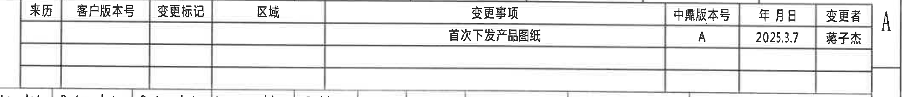

- 原图位置/视图名称：顶部修订履历/变更记录表，bbox=[2735, 205, 4850, 435]。

- 边界归属说明：底部贴近下方参数表上边线；仅提取修订表行列，不提取下方参数表内容。

原表还原：

| 来历 | 客户版本号 | 变更标记 | 区域 | 变更事项 | 中鼎版本号 | 年月日 | 变更者 |
| --- | --- | --- | --- | --- | --- | --- | --- |
|  |  |  |  | 首次下发产品图纸 | A | 2025.3.7 | 蒋子杰 |

提取表格：

| 提取项 | 原图数值或文本 | 含义说明 |
| --- | --- | --- |
| 原图位置/视图名称 | 顶部右侧修订履历/变更记录表 | 位于主参数表上方，记录本图纸版本变更。 |
| 来历 | 空 | 原表该格未填写。 |
| 客户版本号 | 空 | 原表该格未填写。 |
| 变更标记 | 空 | 原表该格未填写。 |
| 区域 | 空 | 原表该格未填写。 |
| 变更事项 | 首次下发产品图纸 | 说明本版为首次下发产品图纸。 |
| 中鼎版本号 | A | 当前中鼎版本为A。 |
| 年月日 | 2025.3.7 | 变更日期。 |
| 变更者 | 蒋子杰 | 变更责任人。 |

## object_2 - 顶部 Variant 参数总表

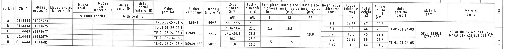

- 原图位置/视图名称：顶部 Variant 参数总表，bbox=[375, 398, 4885, 836]。

- 边界归属说明：右侧可见图框字母B/C边缘，非表格字段；参数表主体行列完整。

原表还原：

| Variant | ZD ID | Mubea proto. ID | Mubea proto. Material ID | Mubea serial ID without coating | Mubea serial material ID without coating | Mubea serial ID with coating | Mubea serial material ID with coating | Mubea part No. | Rubber compound | Hardness (shore A) | Stab diameter ØD (mm) | Bushing diameter ØE (mm) | Rate plate thickness B (mm) | Rate plate inner radius RI (mm) | Rate plate inner radius RA (mm) | Inner rubber thickness T1 (mm) | Rubber thickness T2 (mm) | Total weight (g) | Rubber volume (cm^3) | Mubea part No. part 1 | Material part 1 | Material part 2 |
| --- | --- | --- | --- | --- | --- | --- | --- | --- | --- | --- | --- | --- | --- | --- | --- | --- | --- | --- | --- | --- | --- | --- |
| A | C114436 | 91998673 |  |  |  |  |  | TE-01-08-24-02-A | R6949 | 60±3 | 22.1-22.5 | 21.3 |  |  |  | 6.6 | 14.35 | 47 | 30.5 |  |  |  |
| B | C114438 | 91998675 |  |  |  |  |  | TE-01-08-24-02-B |  |  | 23.0-23.6 | 22.3 | 2.5 | 16.5 |  | 6.1 | 13.85 | 46 | 29.9 | TE-01-08-24-03 |  |  |
| C | C114440 | 91998677 |  |  |  |  |  | TE-01-08-24-02-C | R6949-H55 | 55±3 | 24.2-24.8 | 23.5 | 2.5 | 16.5 | 19.0 | 5.25 | 13.0 | 45 | 28.8 |  | GB/T 3880.2 -5754-H22 | NR or NR-BR acc. SAE J200 M4AA 617 A13 B13 C12 F17 K11 |
| E | C114442 | 91998679 |  |  |  |  |  | TE-01-08-24-02-E |  |  | 26.1 | 25.3 | 1.5 | 17.5 | 19.0 | 5.6 | 12.35 | 39 | 27.8 |  |  |  |
| H | C114444 | 91998681 |  |  |  |  |  | TE-01-08-24-02-H | R6949-H50 | 50±3 | 27.0 | 26.2 | 1.5 | 17.5 | 19.0 | 5.15 | 11.9 | 44 | 31.8 | TE-01-08-24-05 |  |  |

提取表格：

| 提取项 | 原图数值或文本 | 含义说明 |
| --- | --- | --- |
| 原图位置/视图名称 | 顶部Variant参数总表 | 全图尺寸代号、材料、重量和体积的索引表。 |
| Variant A | C114436 / 91998673 / TE-01-08-24-02-A | A变型基础识别。 |
| Variant A 尺寸 | R6949; 60±3; ØD 22.1-22.5; ØE 21.3; T1 6.6; T2 14.35; 47g; 30.5cm^3 | 对应视图中杆径、衬套直径、厚度和质量体积。 |
| Variant B | C114438 / 91998675 / TE-01-08-24-02-B | B变型基础识别。 |
| Variant B 尺寸 | ØD 23.0-23.6; ØE 22.3; B 2.5; RI 16.5; T1 6.1; T2 13.85; 46g; 29.9cm^3 | B、RI、T1、T2为剖视图代号尺寸。 |
| Variant C | C114440 / 91998677 / TE-01-08-24-02-C / R6949-H55 / 55±3 | C变型基础识别与橡胶硬度。 |
| Variant C 尺寸 | ØD 24.2-24.8; ØE 23.5; B 2.5; RI 16.5; RA 19.0; T1 5.25; T2 13.0; 45g; 28.8cm^3 | RA为A-A中RAR/RIR相关半径表值。 |
| Variant C 材料 | Material part 1: GB/T 3880.2 -5754-H22; Material part 2: NR or NR-BR acc. SAE J200 M4AA 617 A13 B13 C12 F17 K11 | 材料跨列合并，按原表归属C/E附近合并格。 |
| Variant E | C114442 / 91998679 / TE-01-08-24-02-E | 本图标题栏图号91998679对应E行。 |
| Variant E 尺寸 | ØD 26.1; ØE 25.3; B 1.5; RI 17.5; RA 19.0; T1 5.6; T2 12.35; 39g; 27.8cm^3 | 本产品C114442的关键参数。 |
| Variant H | C114444 / 91998681 / TE-01-08-24-02-H / R6949-H50 / 50±3 | H变型基础识别与橡胶硬度。 |
| Variant H 尺寸 | ØD 27.0; ØE 26.2; B 1.5; RI 17.5; RA 19.0; T1 5.15; T2 11.9; 44g; 31.8cm^3 | H变型参数。 |
| Mubea part No. part 1 | TE-01-08-24-03 / TE-01-08-24-05 | 表中part 1的两个跨行料号。 |

## object_3 - 左侧主视图/正视图

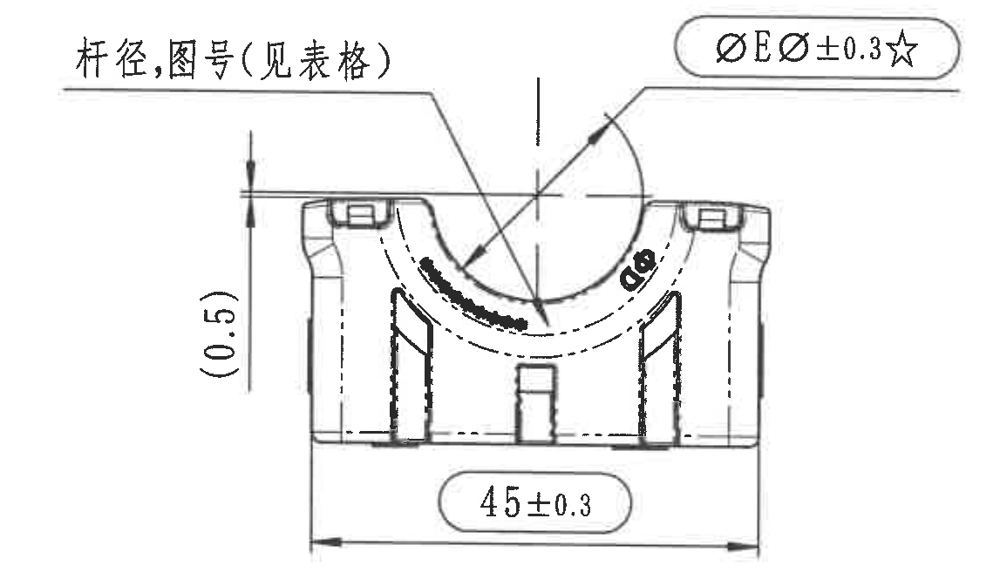

- 原图位置/视图名称：左侧主视图/正视图，bbox=[411, 908, 1558, 1573]。

- 边界归属说明：裁切仅覆盖主视图及其尺寸；右侧相邻Variant标注已排除。

提取表格：

| 提取项 | 原图数值或文本 | 含义说明 |
| --- | --- | --- |
| 原图位置/视图名称 | 左侧主视图/正视图 | D-F区域，显示衬套正面开口与底宽。 |
| 杆径,图号(见表格) | 引线标注 | 杆径和图号需查顶部Variant参数总表。 |
| ØEر0.3☆ | 关键尺寸标注 | 与参数表Bushing diameter ØE对应，星号表示关键尺寸，按技术要求第13条。 |
| (0.5) | 参考尺寸 | 括号表示参考尺寸，位于主视图左侧竖向局部。 |
| 45±0.3 | 底部总宽 | 主视图水平外形宽度，带±0.3公差。 |
| 弧形喷码/标识 | 低清不可完整确认 | 位于开口弧面附近，仅说明存在，不强行转写。 |

## object_4 - 中左侧右视图/剖切A-A指示视图

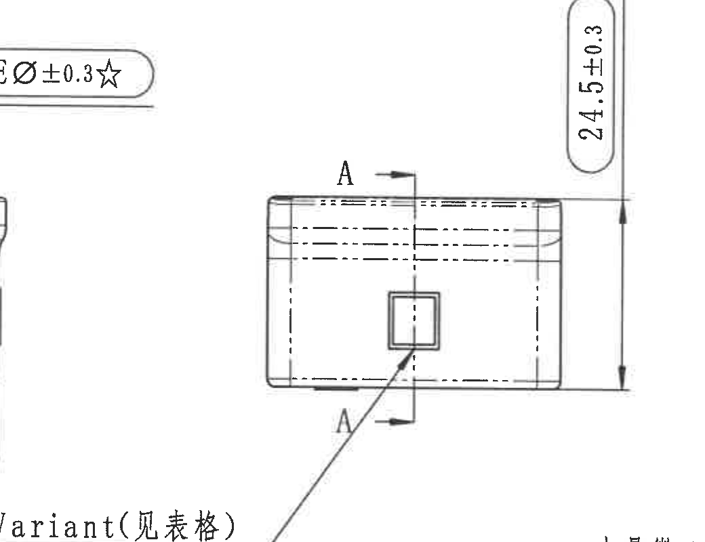

- 原图位置/视图名称：中左侧右视图/剖切A-A指示视图，bbox=[1285, 855, 2325, 1655]。

- 边界归属说明：为保留完整Variant(见表格)引线，左侧可能带入主视图边缘/关键尺寸尾部；本区域只提取A剖切、24.5±0.3和Variant标注。

提取表格：

| 提取项 | 原图数值或文本 | 含义说明 |
| --- | --- | --- |
| 原图位置/视图名称 | 中左侧右视图/剖切A-A指示视图 | 主视图右侧，A-A剖切来源视图。 |
| A | 两处剖切标记 | 定义A-A剖视方向和剖切位置。 |
| 24.5±0.3 | 竖向高度尺寸 | 本侧向视图的总高度/端面高度尺寸，带±0.3公差。 |
| Variant(见表格) | 引线标注 | 该方孔/变型识别信息由Variant表确定。 |

## object_5 - A-A剖视图

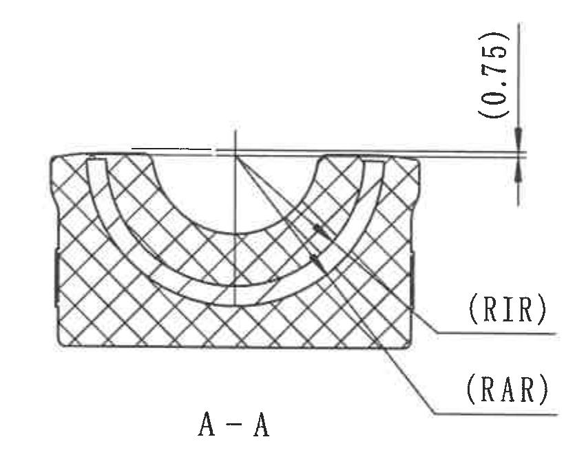

- 原图位置/视图名称：A-A剖视图，bbox=[2305, 930, 3140, 1610]。

- 边界归属说明：右边界已避开B-B剖视图尺寸；RIR/RAR完整。

提取表格：

| 提取项 | 原图数值或文本 | 含义说明 |
| --- | --- | --- |
| 原图位置/视图名称 | A-A剖视图 | 中部剖面，显示半圆槽和剖面填充。 |
| A-A | 剖视图名称 | 来源于object_4的A剖切标记。 |
| (0.75) | 参考尺寸 | 括号内参考尺寸，位于剖视图顶部外缘间隙。 |
| (RIR) | 半径代号 | Rate plate/inner radius相关代号，数值查参数表RI列。 |
| (RAR) | 半径代号 | Rate plate inner radius RA相关代号，数值查参数表RA列。 |

## object_6 - B-B剖视图

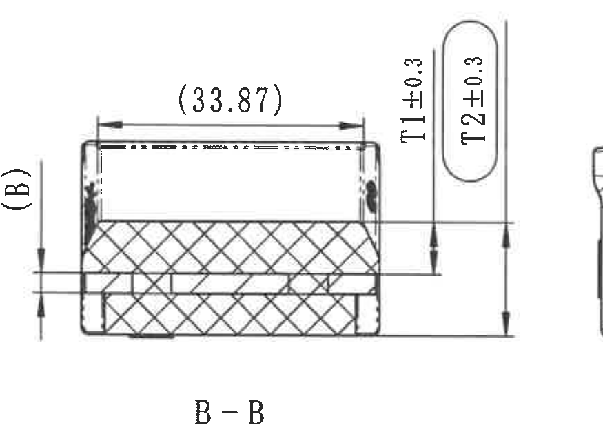

- 原图位置/视图名称：B-B剖视图，bbox=[3180, 945, 4055, 1575]。

- 边界归属说明：包含(B)、(33.87)、T1±0.3、T2±0.3完整尺寸线；右侧少量相邻标识视图边缘不提取。

提取表格：

| 提取项 | 原图数值或文本 | 含义说明 |
| --- | --- | --- |
| 原图位置/视图名称 | B-B剖视图 | 中右剖面，显示层厚和顶部宽度。 |
| B-B | 剖视图名称 | 来源于object_7的B剖切标记。 |
| (B) | 参考/代号尺寸 | 左侧括号代号，数值查参数表Rate plate thickness B。 |
| (33.87) | 参考尺寸 | 顶部水平括号尺寸，参考宽度。 |
| T1±0.3 | 内橡胶厚度 | 与参数表Inner rubber thickness T1对应，带±0.3公差。 |
| T2±0.3 | 橡胶厚度 | 与参数表Rubber thickness T2对应，带±0.3公差。 |

## object_7 - 右侧标识视图/ B-B剖切指示局部

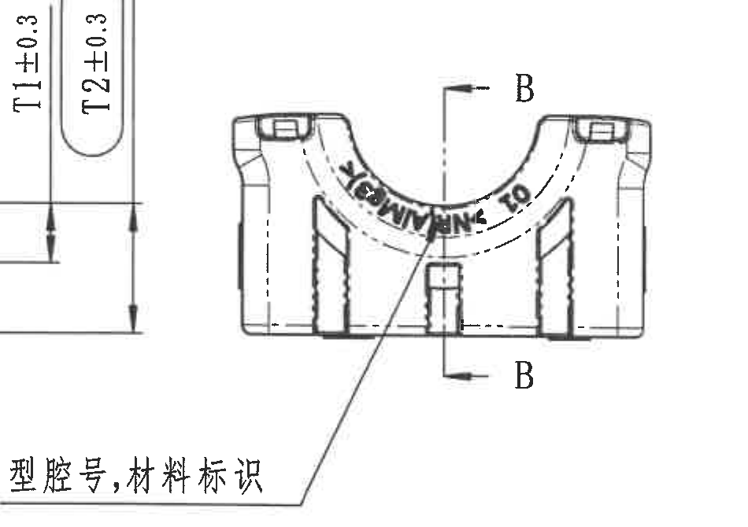

- 原图位置/视图名称：右侧标识视图/ B-B剖切指示局部，bbox=[3745, 1010, 4695, 1680]。

- 边界归属说明：左侧可见B-B的T1/T2尺寸残留，归object_6；本对象只提取B剖切和型腔号/材料标识。

提取表格：

| 提取项 | 原图数值或文本 | 含义说明 |
| --- | --- | --- |
| 原图位置/视图名称 | 右侧标识视图/ B-B剖切指示局部 | 右中部，显示B-B剖切位置和标识区域。 |
| B | 两处剖切标记 | 定义B-B剖面方向和剖切位置。 |
| 型腔号,材料标识 | 中文引线标注 | 指向弧形区域，说明该处为型腔号与材料标识。 |
| 弧形凸/印字标识 | 低清不可完整转写 | 可见沿弧分布的字符，但扫描质量不足，未作为确定文本。 |

## object_8 - 底部平面视图/底视图

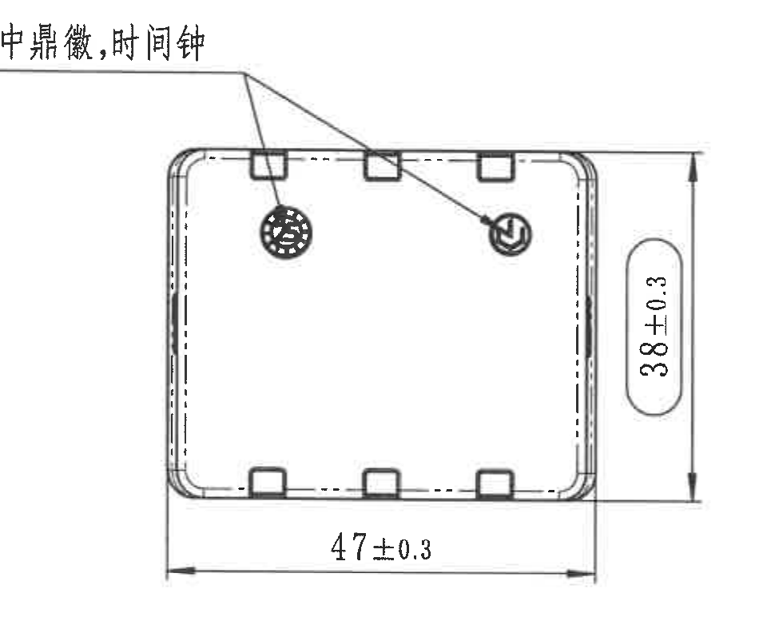

- 原图位置/视图名称：底部平面视图/底视图，bbox=[2165, 1618, 3135, 2390]。

- 边界归属说明：底视图尺寸线和文字完整，未混入相邻视图。

提取表格：

| 提取项 | 原图数值或文本 | 含义说明 |
| --- | --- | --- |
| 原图位置/视图名称 | 底部平面视图/底视图 | 页面中下部，显示矩形底面和角部圆角。 |
| 中鼎徽,时间钟 | 引线标注 | 指向两个圆形标记，分别为中鼎徽与时间钟。 |
| 47±0.3 | 水平总长 | 底视图水平方向外形总长。 |
| 38±0.3 | 竖向总高 | 底视图竖向外形总高。 |

## object_9 - 技术要求/NOTES

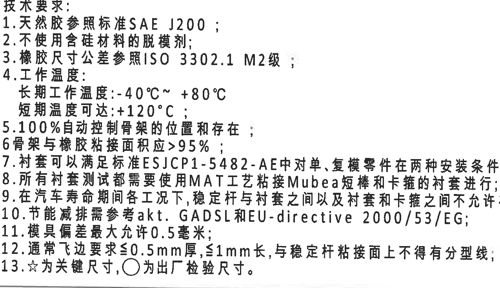

- 原图位置/视图名称：技术要求/NOTES，bbox=[420, 1980, 1695, 2715]。

- 边界归属说明：技术要求1-13完整，无公差表内容。

提取表格：

| 提取项 | 原图数值或文本 | 含义说明 |
| --- | --- | --- |
| 原图位置/视图名称 | 技术要求/NOTES | 左下部文字说明区域。 |
| 技术要求1 | 天然胶参照标准SAE J200； | 按原图序号转写。 |
| 技术要求2 | 不使用含硅材料的脱模剂； | 按原图序号转写。 |
| 技术要求3 | 橡胶尺寸公差参照ISO 3302.1 M2级； | 按原图序号转写。 |
| 技术要求4 | 工作温度：长期工作温度:-40℃~+80℃；短期温度可达:+120℃； | 按原图序号转写。 |
| 技术要求5 | 100%自动控制骨架的位置和存在； | 按原图序号转写。 |
| 技术要求6 | 骨架与橡胶粘接面积应>95%； | 按原图序号转写。 |
| 技术要求7 | 衬套可以满足标准ESJCP1-5482-AE中对单、复模零件在两种安装条件下定义的测试； | 按原图序号转写。 |
| 技术要求8 | 所有衬套测试都需要使用MAT工艺粘接Mubea短棒和卡箍的衬套进行； | 按原图序号转写。 |
| 技术要求9 | 在汽车寿命期间各工况下，稳定杆与衬套之间以及衬套和卡箍之间不允许有噪音，且需说明测试能力； | 按原图序号转写。 |
| 技术要求10 | 节能减排需参考akt. GADSL和EU-directive 2000/53/EG； | 按原图序号转写。 |
| 技术要求11 | 模具偏差最大允许0.5毫米； | 按原图序号转写。 |
| 技术要求12 | 通常飞边要求≤0.5mm厚,≤1mm长,与稳定杆粘接面上不得有分型线； | 按原图序号转写。 |
| 技术要求13 | ☆为关键尺寸，○为出厂检验尺寸。 | 按原图序号转写。 |

## object_10 - DIN ISO 3302-1 M2 class 橡胶尺寸公差表

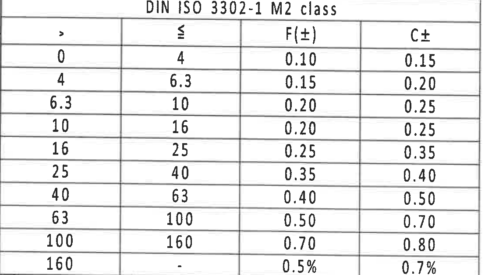

- 原图位置/视图名称：DIN ISO 3302-1 M2 class 橡胶尺寸公差表，bbox=[370, 2725, 1493, 3355]。

- 边界归属说明：公差表标题、列头和所有行完整；底部靠近图框坐标线但不提取为表格。

原表还原：

| > | ≤ | F(±) | C± |
| --- | --- | --- | --- |
| 0 | 4 | 0.10 | 0.15 |
| 4 | 6.3 | 0.15 | 0.20 |
| 6.3 | 10 | 0.20 | 0.25 |
| 10 | 16 | 0.20 | 0.25 |
| 16 | 25 | 0.25 | 0.35 |
| 25 | 40 | 0.35 | 0.40 |
| 40 | 63 | 0.40 | 0.50 |
| 63 | 100 | 0.50 | 0.70 |
| 100 | 160 | 0.70 | 0.80 |
| 160 | - | 0.5% | 0.7% |

提取表格：

| 提取项 | 原图数值或文本 | 含义说明 |
| --- | --- | --- |
| 原图位置/视图名称 | DIN ISO 3302-1 M2 class 公差表 | 技术要求下方。 |
| 表题 | DIN ISO 3302-1 M2 class | 橡胶尺寸公差等级。 |
| 列含义 | > / ≤ / F(±) / C± | 按尺寸范围给出F与C公差。 |

## object_11 - Reference参考标准列表

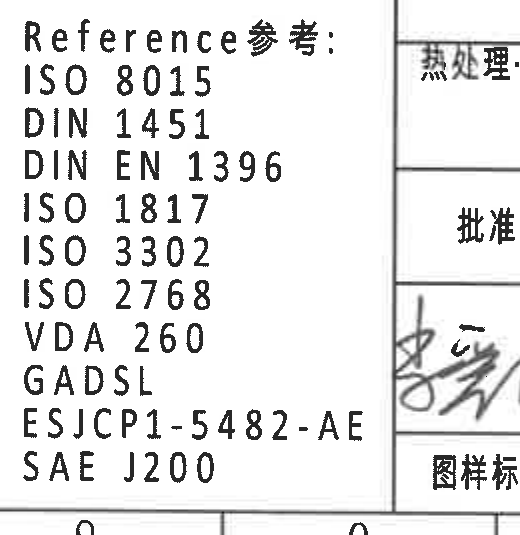

- 原图位置/视图名称：Reference参考标准列表，bbox=[2370, 2865, 2890, 3400]。

- 边界归属说明：Reference列表完整；右侧标题栏边缘不属于本对象。

提取表格：

| 提取项 | 原图数值或文本 | 含义说明 |
| --- | --- | --- |
| 原图位置/视图名称 | Reference参考标准列表 | 标题栏左侧。 |
| 参考标准 | ISO 8015 | 原图Reference参考列表逐项转写。 |
| 参考标准 | DIN 1451 | 原图Reference参考列表逐项转写。 |
| 参考标准 | DIN EN 1396 | 原图Reference参考列表逐项转写。 |
| 参考标准 | ISO 1817 | 原图Reference参考列表逐项转写。 |
| 参考标准 | ISO 3302 | 原图Reference参考列表逐项转写。 |
| 参考标准 | ISO 2768 | 原图Reference参考列表逐项转写。 |
| 参考标准 | VDA 260 | 原图Reference参考列表逐项转写。 |
| 参考标准 | GADSL | 原图Reference参考列表逐项转写。 |
| 参考标准 | ESJCP1-5482-AE | 原图Reference参考列表逐项转写。 |
| 参考标准 | SAE J200 | 原图Reference参考列表逐项转写。 |

## object_12 - 右下等轴测示意图

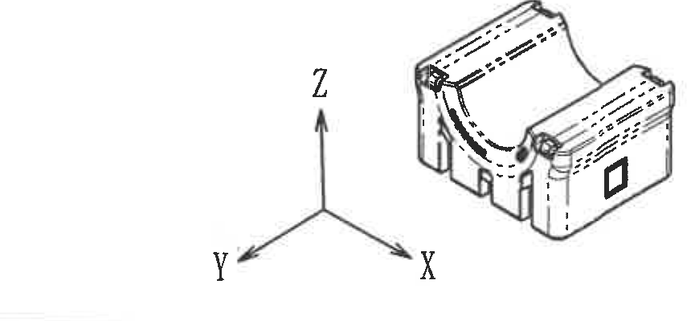

- 原图位置/视图名称：右下等轴测示意图，bbox=[3815, 2125, 4675, 2525]。

- 边界归属说明：等轴测图和X/Y/Z坐标完整，无相邻尺寸。

提取表格：

| 提取项 | 原图数值或文本 | 含义说明 |
| --- | --- | --- |
| 原图位置/视图名称 | 右下等轴测示意图 | BOM上方。 |
| X/Y/Z | 坐标轴 | 说明零件等轴测方向。 |
| 零件等轴测外观 | 无尺寸数值 | 仅示意外形和方向。 |

## object_13 - 物料明细/BOM表

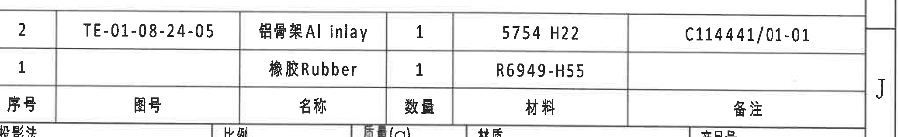

- 原图位置/视图名称：物料明细/BOM表，bbox=[2795, 2500, 4850, 2815]。

- 边界归属说明：BOM行列完整；下方标题栏上边线不属于BOM内容。

原表还原：

| 序号 | 图号 | 名称 | 数量 | 材料 | 备注 |
| --- | --- | --- | --- | --- | --- |
| 2 | TE-01-08-24-05 | 铝骨架Al inlay | 1 | 5754 H22 | C114441/01-01 |
| 1 |  | 橡胶Rubber | 1 | R6949-H55 |  |

提取表格：

| 提取项 | 原图数值或文本 | 含义说明 |
| --- | --- | --- |
| 原图位置/视图名称 | 物料明细/BOM表 | 右下标题栏上方。 |
| 序号2 | TE-01-08-24-05 / 铝骨架Al inlay / 1 / 5754 H22 / C114441/01-01 | 铝骨架物料。 |
| 序号1 | 图号空 / 橡胶Rubber / 1 / R6949-H55 / 备注空 | 橡胶物料。 |

## object_14 - 右下标题栏

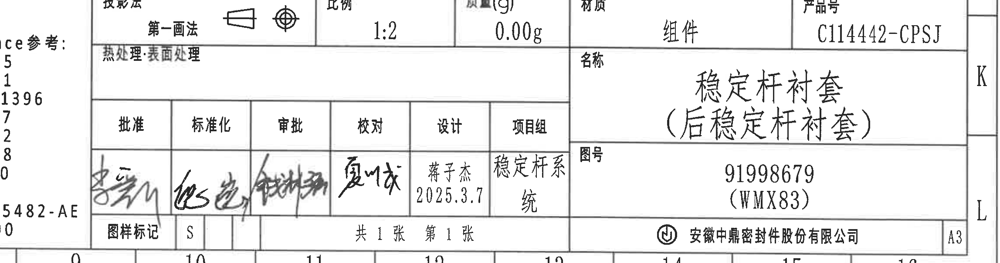

- 原图位置/视图名称：右下标题栏，bbox=[2555, 2805, 4850, 3410]。

- 边界归属说明：标题栏字段完整；左侧Reference列表边缘不属于标题栏。

标题栏结构化还原：

| 字段 | 原图数值或文本 |
| --- | --- |
| 投影法 | 第一角法 |
| 比例 | 1:2 |
| 质量(g) | 0.00g |
| 材质 | 组件 |
| 产品号 | C114442-CPSJ |
| 热处理:表面处理 | 空 |
| 名称 | 稳定杆衬套（后稳定杆衬套） |
| 图号 | 91998679（WMX83） |
| 批准 | 签名，低清未转写姓名 |
| 标准化 | 签名，低清未转写姓名 |
| 审批 | 签名，低清未转写姓名 |
| 校对 | 签名，低清未转写姓名 |
| 设计 | 蒋子杰 2025.3.7 |
| 项目组 | 稳定杆系统 |
| 图样标记 | S |
| 张数 | 共1张 第1张 |
| 公司 | 安徽中鼎密封件股份有限公司 |
| 图幅 | A3 |

提取表格：

| 提取项 | 原图数值或文本 | 含义说明 |
| --- | --- | --- |
| 原图位置/视图名称 | 右下标题栏 | 图纸右下角。 |
| 投影法 | 第一角法 | 投影视图方法。 |
| 比例 | 1:2 | 图纸比例。 |
| 质量(g) | 0.00g | 标题栏质量。 |
| 材质 | 组件 | 标题栏材质。 |
| 产品号 | C114442-CPSJ | 产品编号。 |
| 名称 | 稳定杆衬套(后稳定杆衬套) | 零件名称。 |
| 图号 | 91998679(WMX83) | 图纸编号。 |
| 设计 | 蒋子杰 2025.3.7 | 设计责任和日期。 |
| 项目组 | 稳定杆系统 | 项目组字段。 |
| 图样标记 | S | 图样标记字段。 |
| 张数 | 共1张 第1张 | 页次信息。 |
| 公司 | 安徽中鼎密封件股份有限公司 | 出图公司。 |
| 图幅 | A3 | 图幅。 |

## 裁切检查记录

| 裁切对象 | 检查结论 | 逐张说明 |
| --- | --- | --- |
| object_1 | 完整 | 列头与版本A记录完整；底部有参数表上边线，未提取为本对象。 |
| object_2 | 完整 | 参数表全部列与A/B/C/E/H行完整；右侧图框字母不作为内容。 |
| object_3 | 完整 | ØEر0.3☆、(0.5)、45±0.3尺寸线和文字完整；无相邻标注。 |
| object_4 | 可用，边界说明限定归属 | 24.5±0.3、A剖切和Variant标注完整；左侧不可避免带少量主视图片段，已排除提取。 |
| object_5 | 完整 | (0.75)、RIR、RAR和A-A标题完整。 |
| object_6 | 完整 | (B)、(33.87)、T1±0.3、T2±0.3和B-B标题完整；右侧相邻边缘不提取。 |
| object_7 | 可用，边界说明限定归属 | 型腔号,材料标识与B剖切完整；左侧T1/T2残留归object_6。 |
| object_8 | 完整 | 47±0.3、38±0.3和中鼎徽/时间钟引线完整。 |
| object_9 | 完整 | 技术要求1-13完整。 |
| object_10 | 完整 | 公差表标题、列头、全部范围行完整。 |
| object_11 | 完整 | Reference参考列表完整；右侧标题栏边缘排除。 |
| object_12 | 完整 | 等轴测图与X/Y/Z坐标完整。 |
| object_13 | 完整 | BOM表头和两行物料完整；下方标题栏线排除。 |
| object_14 | 完整 | 标题栏字段完整；左侧Reference边缘排除。 |

