# 20C114443 PDF 内容识别

整页渲染图：`outputs/20C114443_assets/images/page_1.png`  
页面尺寸：4959 x 3505 px，bbox `[0, 0, 4959, 3505]`

## object_1 - 顶部修订履历表

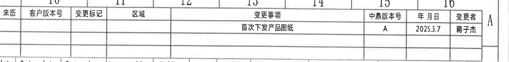

原图位置/视图名称：第 1 页顶部右侧修订履历表，bbox `[2790, 170, 4890, 430]`

| 来历 | 客户版本号 | 变更标记 | 区域 | 变更事项 | 中鼎版本号 | 年月日 | 变更者 |
|---|---|---|---|---|---|---|---|
|  |  |  |  | 首次下发产品图纸 | A | 2025.3.7 | 蒋子杰 |
|  |  |  |  |  |  |  |  |
|  |  |  |  |  |  |  |  |

| 提取项 | 原图数值或文本 | 含义说明 |
|---|---|---|
| 变更事项 | 首次下发产品图纸 | 该版本为首次发布产品图纸。 |
| 中鼎版本号 | A | 当前图纸版本号。 |
| 年月日 | 2025.3.7 | 修订/发布日期。 |
| 变更者 | 蒋子杰 | 修订或发布责任人。 |

边界归属说明：裁切对象只提取顶部修订履历表内容。下方参数表与该对象贴近，最终裁切仅保留修订表行列，不将下方参数表字段归入本对象。

## object_2 - 顶部 Variant/参数表

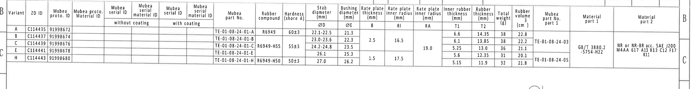

原图位置/视图名称：第 1 页顶部横向 Variant 与零件参数总表，bbox `[340, 380, 4860, 970]`

| Variant | ZD ID | Mubea proto. ID | Mubea proto. Material ID | Mubea serial ID without coating | Mubea serial material ID without coating | Mubea serial ID with coating | Mubea serial material ID with coating | Mubea part No. | Rubber compound | Hardness (shore A) | Stab diameter ØD (mm) | Bushing diameter ØE (mm) | Rate plate thickness B (mm) | Rate plate inner radius RI (mm) | Rate plate inner radius RA (mm) | Inner rubber thickness T1 (mm) | Rubber thickness T2 (mm) | Total weight (g) | Rubber volume (cm^3) | Mubea part No. part 1 | Material part 1 | Material part 2 |
|---|---|---|---|---|---|---|---|---|---|---|---|---|---|---|---|---|---|---|---|---|---|---|
| A | C114435 | 91998672 |  |  |  |  |  | TE-01-08-24-01-A | R6949 | 60±3 | 22.1-22.5 | 21.3 |  |  |  | 6.6 | 14.35 | 38 | 22.8 |  |  |  |
| B | C114437 | 91998674 |  |  |  |  |  | TE-01-08-24-01-B |  |  | 23.0-23.6 | 22.3 | 2.5 | 16.5 |  | 6.1 | 13.85 | 38 | 22.2 | TE-01-08-24-03 |  |  |
| C | C114439 | 91998676 |  |  |  |  |  | TE-01-08-24-01-C | R6949-H55 | 55±3 | 24.2-24.8 | 23.5 |  |  | 19.0 | 5.25 | 13.0 | 36 | 21.1 |  | GB/T 3880.2 -5754-H22 | NR or NR-BR acc. SAE J200 M4AA 617 A13 B13 C12 F17 K11 |
| E | C114441 | 91998678 |  |  |  |  |  | TE-01-08-24-01-E |  |  | 26.1 | 25.3 |  |  |  | 5.6 | 12.35 | 31 | 20.1 |  |  |  |
| H | C114443 | 91998680 |  |  |  |  |  | TE-01-08-24-01-H | R6949-H50 | 50±3 | 27.0 | 26.2 | 1.5 | 17.5 |  | 5.15 | 11.9 | 32 | 21.8 | TE-01-08-24-05 |  |  |

| 提取项 | 原图数值或文本 | 含义说明 |
|---|---|---|
| Variant | A, B, C, E, H | 图纸主视图和右主视图中的 “Variant(见表格)” 引线引用此表；不同变体对应不同 ØD、ØE、材料、厚度和重量体积。 |
| ØD | 22.1-22.5 / 23.0-23.6 / 24.2-24.8 / 26.1 / 27.0 | Stab diameter，稳定杆直径或杆径，按变体选择。 |
| ØE | 21.3 / 22.3 / 23.5 / 25.3 / 26.2 | Bushing diameter，衬套孔径或配合孔直径，主视图中带星号的 ØE±0.3 指向此类出厂检验尺寸。 |
| B | 2.5, 1.5 | Rate plate thickness，率板厚度；跨行空白处按原表保留，不补填。 |
| RI | 16.5, 17.5 | Rate plate inner radius，率板内半径。 |
| RA | 19.0 | Rate plate inner radius，另一内半径标识。 |
| T1 | 6.6 / 6.1 / 5.25 / 5.6 / 5.15 | Inner rubber thickness，内橡胶厚度；B-B 剖面中 T1±0.3 引用该列。 |
| T2 | 14.35 / 13.85 / 13.0 / 12.35 / 11.9 | Rubber thickness，橡胶厚度；B-B 剖面中 T2±0.3 引用该列。 |
| Material part 1 | GB/T 3880.2 -5754-H22 | 铝骨架/嵌件材料标准和牌号。 |
| Material part 2 | NR or NR-BR acc. SAE J200 M4AA 617 A13 B13 C12 F17 K11 | 橡胶材料按 SAE J200 的材料要求。 |

边界归属说明：该对象为顶部总表，主图中的 “Variant(见表格)”、“杆径,图号(见表格)” 均指向本表。对象下方空白与视图区域相邻，未提取下方视图尺寸。

## object_3 - 左侧主视图

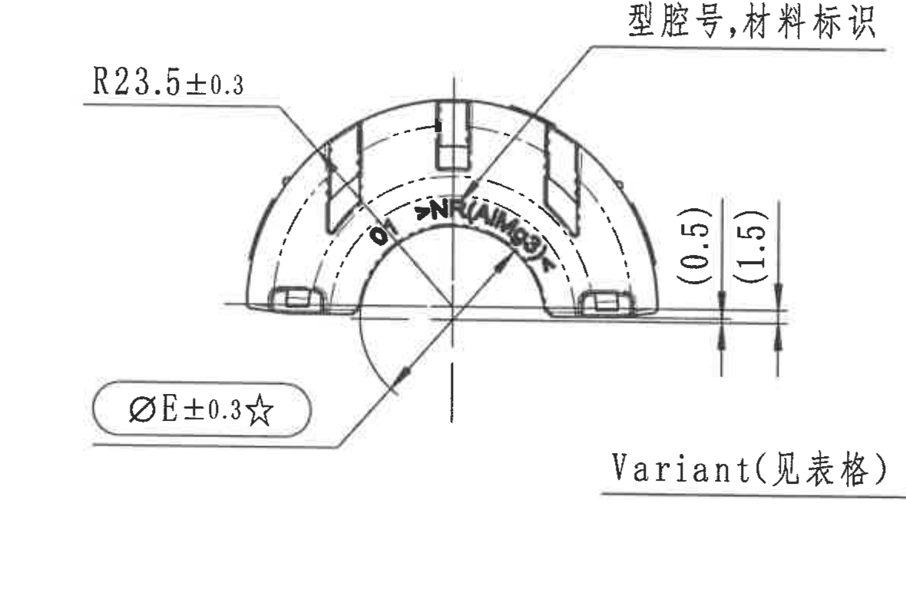

原图位置/视图名称：第 1 页中左部半圆形主视图，bbox `[450, 1030, 1630, 1810]`

| 提取项 | 原图数值或文本 | 含义说明 |
|---|---|---|
| 外圆弧半径 | R23.5±0.3 | 外轮廓圆弧半径，公差 ±0.3。 |
| 衬套孔径/出厂检验尺寸 | ØE±0.3☆ | 直径符号 Ø，E 值引用顶部 Variant 表；星号表示关键尺寸。NOTES 13 说明 ☆ 为关键尺寸。 |
| 参考高度 1 | (0.5) | 括号内参考尺寸，表示下边缘附近局部台阶/间隙的参考高度，不作为直接加工控制尺寸。 |
| 参考高度 2 | (1.5) | 括号内参考尺寸，表示另一局部高度参考值。 |
| 文字标注 | 型腔号,材料标识 | 指向主视图上方/内弧处标记区域，说明该处应有型腔号与材料标识。 |
| 变体引用 | Variant(见表格) | 指向顶部 Variant 表，说明具体 ØD、ØE、材料和 T/B/R 等值按表格变体确定。 |
| 内部标识 | NR / NBR 类字样 | 主视图内弧上可见橡胶材料标识，归入型腔号/材料标识说明。 |

边界归属说明：右侧边缘有相邻侧视图极小局部残边，因 “Variant(见表格)” 引线延伸到该区域，为保留完整引线未进一步裁掉；该残边不归入本主视图提取内容。

## object_4 - 侧视图与 A-A 剖切位置

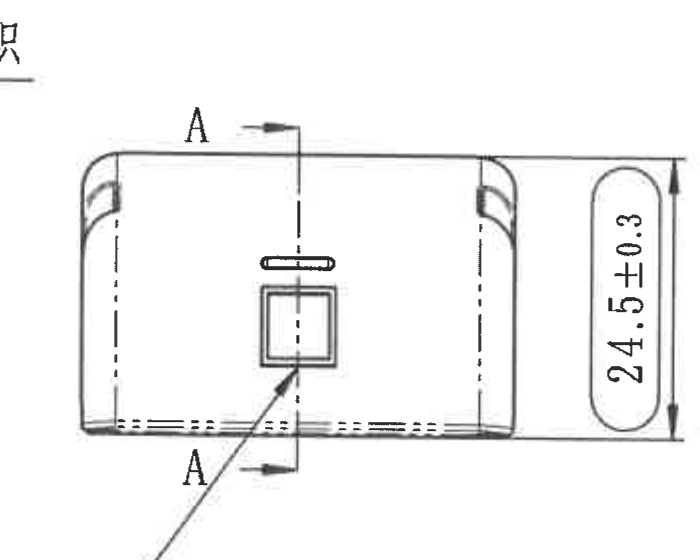

原图位置/视图名称：第 1 页中部侧视图，带 A-A 剖切箭头，bbox `[1570, 1015, 2270, 1575]`

| 提取项 | 原图数值或文本 | 含义说明 |
|---|---|---|
| 总高度 | 24.5±0.3 | 侧视图竖向总高度，公差 ±0.3。 |
| 剖切标记 | A / A | 指示 A-A 剖面位置和观察方向。 |
| 中部矩形特征 | 方形窗口/槽 | 中央矩形开口或标识区域，A-A 剖切线穿过该区域。 |
| 顶部小槽 | 狭长槽 | 位于中心线上方的长圆槽/狭槽特征。 |

边界归属说明：左侧边缘可见来自主视图说明文字的残笔，底部已重裁排除俯视图中文引线；仅提取本侧视图尺寸与 A-A 剖切标记。

## object_5 - A-A 剖面视图

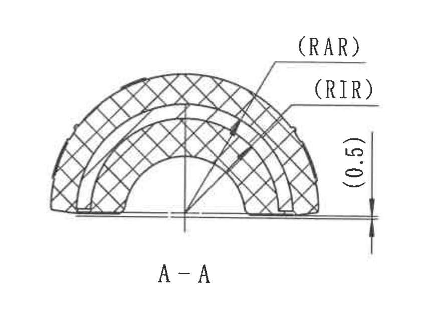

原图位置/视图名称：第 1 页中部 A-A 剖面，bbox `[2290, 1030, 3130, 1670]`

| 提取项 | 原图数值或文本 | 含义说明 |
|---|---|---|
| 剖面名称 | A-A | 对应侧视图中的 A/A 剖切位置。 |
| 内弧/外弧标注 | (RAR), (RIR) | 括号内参考或表格引用的弧半径标识，分别指向剖面内不同弧线；数值需结合顶部 Variant 表中 RA/RI 列解释。 |
| 参考高度 | (0.5) | 括号内参考尺寸，位于右侧底边附近，说明局部高度/台阶间隙参考值。 |
| 剖面填充 | 交叉剖面线 | 表示被剖切橡胶/主体材料区域。 |

边界归属说明：底部靠近俯视图上边缘，裁切保留 A-A 标题、弧线和尺寸箭头；不提取下方俯视图局部作为 A-A 内容。

## object_6 - B-B 剖面视图

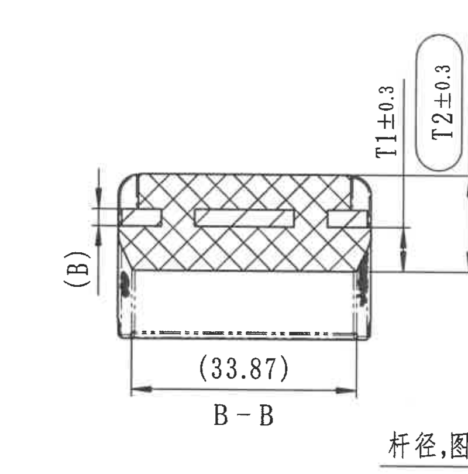

原图位置/视图名称：第 1 页中右部 B-B 剖面，bbox `[3080, 890, 3880, 1700]`

| 提取项 | 原图数值或文本 | 含义说明 |
|---|---|---|
| 剖面名称 | B-B | 对应右侧主视图中的 B/B 剖切位置。 |
| 参考宽度 | (33.87) | 括号内参考尺寸，为剖面底部横向宽度参考值。 |
| 内橡胶厚度 | T1±0.3 | T1 值引用顶部 Variant 表，公差 ±0.3。 |
| 橡胶厚度 | T2±0.3 | T2 值引用顶部 Variant 表，公差 ±0.3。 |
| 局部剖切标记 | (B) | 左侧竖向尺寸旁的剖切/位置参考标记，属于 B-B 相关标识。 |
| 剖面填充 | 交叉剖面线 | 表示剖切材料区域。 |

边界归属说明：右下角因 B-B 与右主视图标注距离很近，可见 “杆径,图...” 邻近文字残片；不归入 B-B 提取项。左侧有极小相邻剖面/标记残边，为保留 B-B 左侧箭头线完整而保留。

## object_7 - 右侧主视图与 B-B 剖切位置

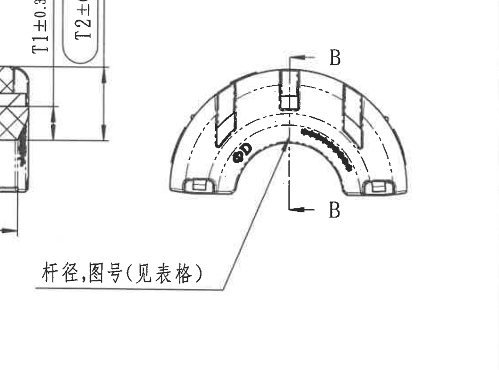

原图位置/视图名称：第 1 页右部半圆形主视图，带 B-B 剖切箭头，bbox `[3650, 1040, 4770, 1870]`

| 提取项 | 原图数值或文本 | 含义说明 |
|---|---|---|
| 杆径/图号引用 | 杆径,图号(见表格) | 指向顶部 Variant/参数表，杆径对应 ØD，图号对应 Mubea part No./ZD ID 等表格字段。 |
| 剖切标记 | B / B | 指示 B-B 剖面位置和观察方向。 |
| 直径标识 | ØD | 稳定杆直径或杆径，数值引用顶部 Variant 表。 |
| 局部黑色弧形标记 | 内弧区域涂黑/标识 | 位于内弧右侧，表示局部标识或材料/工艺可见区域，未给出单独数值。 |

边界归属说明：左边缘可见 B-B 剖面尺寸线片段，因两对象相邻且标注距离很近；本对象只提取右侧主视图中的 B/B、ØD 和“杆径,图号(见表格)”。

## object_8 - 下方俯视图

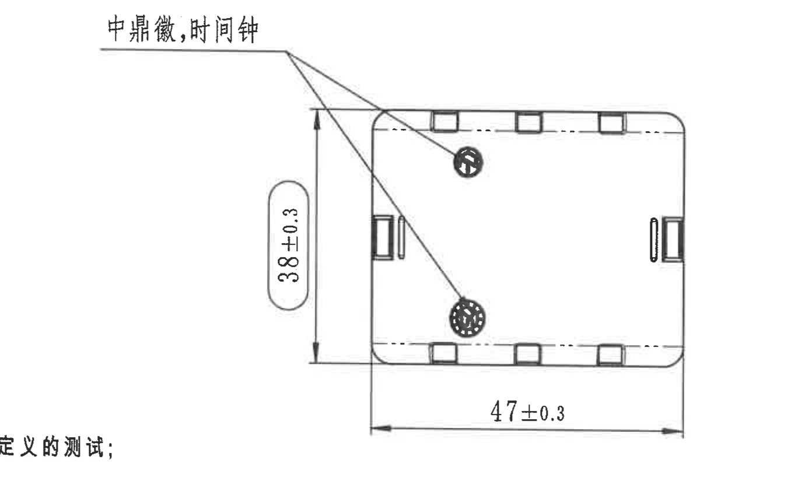

原图位置/视图名称：第 1 页中下部俯视图，bbox `[1750, 1600, 3130, 2420]`

| 提取项 | 原图数值或文本 | 含义说明 |
|---|---|---|
| 总宽度 | 47±0.3 | 俯视图底部横向总尺寸，公差 ±0.3。 |
| 总高度 | 38±0.3 | 俯视图左侧竖向总尺寸，公差 ±0.3。 |
| 文字标注 | 中鼎徽,时间钟 | 两条引线分别指向俯视图中两个圆形标识，说明该处为中鼎徽标和时间钟标识。 |
| 圆形标识 1 | 上部小圆 | 与“中鼎徽,时间钟”引线相连。 |
| 圆形标识 2 | 下部大圆 | 与“中鼎徽,时间钟”引线相连。 |

边界归属说明：上方可见 A-A 文字残边，左下角可见 NOTES 长行残字，底部接近 BOM 表上边界；本对象只提取俯视图的 47±0.3、38±0.3 和徽标/时间钟标注。

## object_9 - 轴测视图

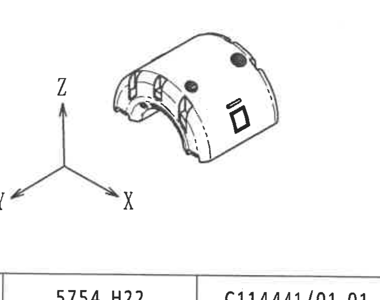

原图位置/视图名称：第 1 页右下部小轴测视图，bbox `[3980, 1960, 4740, 2560]`

| 提取项 | 原图数值或文本 | 含义说明 |
|---|---|---|
| 坐标轴 | X, Y, Z | 表示零件轴测方向和空间参考方向。 |
| 轴测零件 | 小型三维示意 | 展示衬套整体外形、开口、槽和侧面矩形标记。 |

边界归属说明：该裁切含轴测图和坐标轴，不含独立尺寸数值；底部靠近 BOM 表但未提取 BOM 内容。

## object_10 - NOTES/技术要求

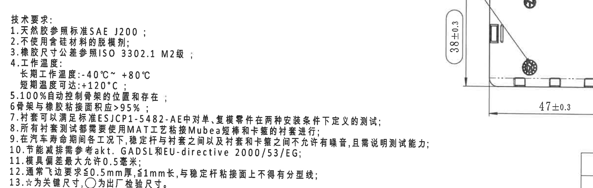

原图位置/视图名称：第 1 页左下技术要求，bbox `[390, 1870, 2810, 2640]`

| 序号 | 原图文本 |
|---|---|
| 标题 | 技术要求: |
| 1 | 天然胶参照标准 SAE J200； |
| 2 | 不使用含硅材料的脱模剂； |
| 3 | 橡胶尺寸公差参照 ISO 3302.1 M2级； |
| 4 | 工作温度：长期工作温度:-40°C~ +80°C；短期温度可达:+120°C； |
| 5 | 100%自动控制骨架的位置和存在； |
| 6 | 骨架与橡胶粘接面积应>95%； |
| 7 | 衬套可以满足标准 ESJCP1-5482-AE 中对单、复模零件在两种安装条件下定义的测试； |
| 8 | 所有衬套测试都需要使用 MAT 工艺粘接 Mubea 短棒和卡箍的衬套进行； |
| 9 | 在汽车寿命期间各工况下，稳定杆与衬套之间以及衬套和卡箍之间不允许有噪音，且需说明测试能力； |
| 10 | 节能减排需参考 akt. GADSL 和 EU-directive 2000/53/EG； |
| 11 | 模具偏差最大允许 0.5 毫米； |
| 12 | 通常飞边要求 ≤0.5mm 厚，≤1mm 长，与稳定杆粘接面上不得有分型线； |
| 13 | ☆为关键尺寸，○为出厂检验尺寸。 |

| 提取项 | 原图数值或文本 | 含义说明 |
|---|---|---|
| 橡胶公差标准 | ISO 3302.1 M2级 | 尺寸公差适用标准；底部另有 DIN ISO 3302-1 M2 class 表。 |
| 工作温度 | -40°C~ +80°C；+120°C | 长期与短期温度能力要求。 |
| 粘接面积 | >95% | 骨架与橡胶粘接面积要求。 |
| 模具偏差 | 最大允许 0.5 毫米 | 模具偏差限制。 |
| 飞边要求 | ≤0.5mm 厚，≤1mm 长 | 飞边厚度和长度限制。 |
| 关键/检验符号 | ☆、○ | ☆ 表示关键尺寸，○ 表示出厂检验尺寸。 |

边界归属说明：右侧可见俯视图局部尺寸和图形，因为 NOTES 长行与俯视图区域靠近；表格中只还原左侧技术要求文字，不将右侧俯视图尺寸归入 NOTES。

## object_11 - DIN ISO 3302-1 M2 公差表

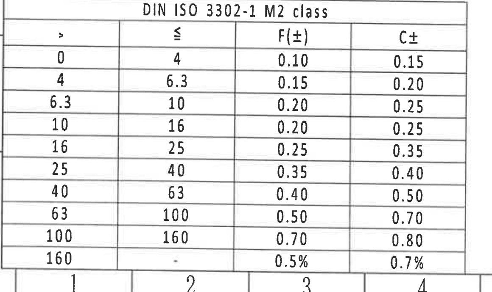

原图位置/视图名称：第 1 页左下 DIN ISO 3302-1 M2 class 表，bbox `[360, 2710, 1520, 3400]`

| DIN ISO 3302-1 M2 class |  |  |  |
|---|---|---|---|
| > | ≤ | F(±) | C± |
| 0 | 4 | 0.10 | 0.15 |
| 4 | 6.3 | 0.15 | 0.20 |
| 6.3 | 10 | 0.20 | 0.25 |
| 10 | 16 | 0.20 | 0.25 |
| 16 | 25 | 0.25 | 0.35 |
| 25 | 40 | 0.35 | 0.40 |
| 40 | 63 | 0.40 | 0.50 |
| 63 | 100 | 0.50 | 0.70 |
| 100 | 160 | 0.70 | 0.80 |
| 160 | - | 0.5% | 0.7% |

| 提取项 | 原图数值或文本 | 含义说明 |
|---|---|---|
| 表名 | DIN ISO 3302-1 M2 class | 橡胶件尺寸公差等级表，与 NOTES 第 3 条对应。 |
| F(±) | 0.10 至 0.70，160 以上为 0.5% | F 类尺寸公差。 |
| C± | 0.15 至 0.80，160 以上为 0.7% | C 类尺寸公差。 |

边界归属说明：表格底部贴近图框编号行，裁切保留完整表格行列和底部图框编号，不提取相邻 Reference 文本。

## object_12 - Reference 参考标准

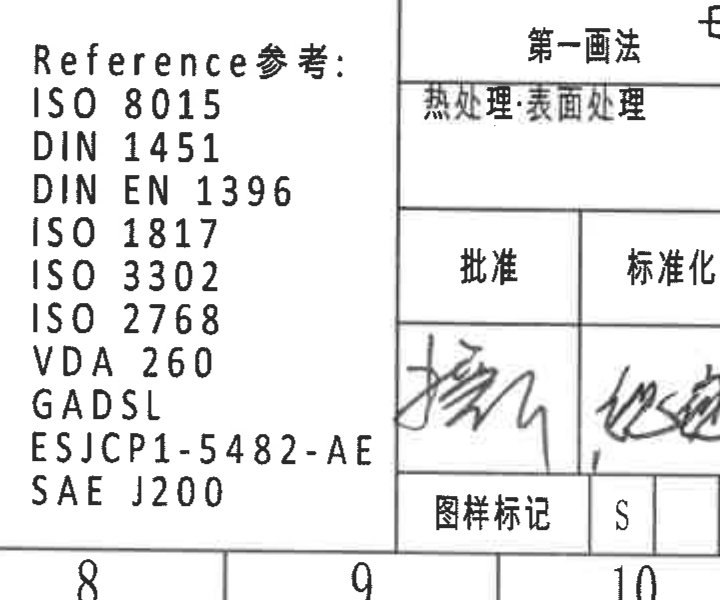

原图位置/视图名称：第 1 页底部中左 Reference 参考标准清单，bbox `[2360, 2820, 3080, 3420]`

| 行 | 原图文本 |
|---|---|
| 标题 | Reference参考: |
| 1 | ISO 8015 |
| 2 | DIN 1451 |
| 3 | DIN EN 1396 |
| 4 | ISO 1817 |
| 5 | ISO 3302 |
| 6 | ISO 2768 |
| 7 | VDA 260 |
| 8 | GADSL |
| 9 | ESJCP1-5482-AE |
| 10 | SAE J200 |

| 提取项 | 原图数值或文本 | 含义说明 |
|---|---|---|
| 标准清单 | ISO 8015; DIN 1451; DIN EN 1396; ISO 1817; ISO 3302; ISO 2768; VDA 260; GADSL; ESJCP1-5482-AE; SAE J200 | 图纸引用标准和客户/行业规范列表。 |

边界归属说明：右侧与签审标题栏相邻，裁切仅提取 Reference 清单；右侧表格线和签字栏不归入本对象。

## object_13 - BOM/明细表

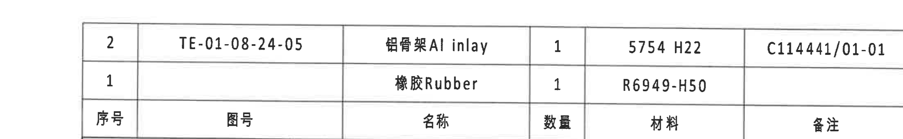

原图位置/视图名称：第 1 页右下明细表，bbox `[2560, 2440, 4760, 2780]`

| 序号 | 图号 | 名称 | 数量 | 材料 | 备注 |
|---|---|---|---|---|---|
| 2 | TE-01-08-24-05 | 铝骨架 Al inlay | 1 | 5754 H22 | C114441/01-01 |
| 1 |  | 橡胶 Rubber | 1 | R6949-H50 |  |

| 提取项 | 原图数值或文本 | 含义说明 |
|---|---|---|
| 铝骨架 | TE-01-08-24-05 / 铝骨架 Al inlay / 1 / 5754 H22 / C114441/01-01 | 组件中的铝嵌件明细。 |
| 橡胶 | 橡胶 Rubber / 1 / R6949-H50 | 组件中的橡胶材料明细。 |

边界归属说明：对象只截取明细表上部 BOM 行列；下方投影法、比例、质量、材质、产品号等标题栏字段另归 object_14。

## object_14 - 标题栏/签审栏

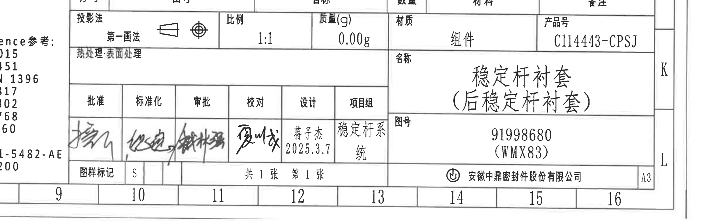

原图位置/视图名称：第 1 页右下标题栏、投影法、签审和图号信息，bbox `[2520, 2740, 4959, 3500]`

| 字段 | 原图数值或文本 |
|---|---|
| 投影法 | 第一画法 |
| 投影符号 | 第一角法投影符号 |
| 比例 | 1:1 |
| 质量(g) | 0.00g |
| 材质 | 组件 |
| 产品号 | C114443-CPSJ |
| 名称 | 稳定杆衬套（后稳定杆衬套） |
| 图号 | 91998680 (WMX83) |
| 热处理/表面处理 | 空白 |
| 批准 | 签名 |
| 标准化 | 签名 |
| 审批 | 签名 |
| 校对 | 签名 |
| 设计 | 蒋子杰 2025.3.7 |
| 项目组 | 稳定杆系统 |
| 图样标记 | S |
| 页数 | 共 1 张 第 1 张 |
| 公司 | 安徽中鼎密封件股份有限公司 |
| 图幅 | A3 |

| 提取项 | 原图数值或文本 | 含义说明 |
|---|---|---|
| 零件/组件名称 | 稳定杆衬套（后稳定杆衬套） | 图纸对象名称。 |
| 图号 | 91998680 (WMX83) | 主图号/内部识别号。 |
| 产品号 | C114443-CPSJ | 产品编号。 |
| 比例 | 1:1 | 图纸比例。 |
| 质量 | 0.00g | 标题栏质量字段原图值。 |
| 设计 | 蒋子杰 2025.3.7 | 设计责任人与日期。 |

边界归属说明：左侧边缘可见 Reference 清单残字，属于 object_12；本对象只提取标题栏、签审、投影法和图号字段。

## 裁切检查记录

| 对象 | 检查结果 |
|---|---|
| object_1 | 完整包含修订履历表表头和实际修订行；下方参数表仅有贴近边线残迹，未作为本对象提取。 |
| object_2 | 完整包含 Variant/参数表表头、跨行合并单元格和 A/B/C/E/H 五行数据。 |
| object_3 | 完整包含 R23.5±0.3、ØE±0.3☆、(0.5)、(1.5)、型腔号/材料标识和 Variant 引线；右侧相邻侧视图残边已排除为非本对象内容。 |
| object_4 | 完整包含侧视图外形、A/A 剖切箭头和 24.5±0.3 尺寸线；底部相邻俯视图文字已重裁排除。 |
| object_5 | 完整包含 A-A 剖面、(RAR)、(RIR)、(0.5) 和剖面标题；未提取下方俯视图内容。 |
| object_6 | 完整包含 B-B 剖面、T1±0.3、T2±0.3、(33.87) 和 B-B 标题；右下邻近文字残片不归入本对象。 |
| object_7 | 完整包含右主视图、B/B 剖切箭头、ØD 和“杆径,图号(见表格)”引线；左侧 B-B 残片不归入本对象。 |
| object_8 | 完整包含俯视图、38±0.3、47±0.3 和“中鼎徽,时间钟”引线；底部 BOM 未纳入提取。 |
| object_9 | 完整包含轴测图和 X/Y/Z 坐标轴；无独立尺寸线。 |
| object_10 | 完整包含 NOTES 1-13 条文本；右侧俯视图局部不归入 NOTES。 |
| object_11 | 完整包含 DIN ISO 3302-1 M2 class 表的表头和全部 10 行范围。 |
| object_12 | 完整包含 Reference 标准清单；右侧签审栏残边不归入本对象。 |
| object_13 | 完整包含 BOM 表头与两条明细行；标题栏字段另在 object_14 提取。 |
| object_14 | 完整包含标题栏、投影法、签审栏、名称、图号、产品号、公司和 A3 图幅；左侧 Reference 残字不归入本对象。 |
