# 20C114444 内容识别与裁切提取

整页渲染图：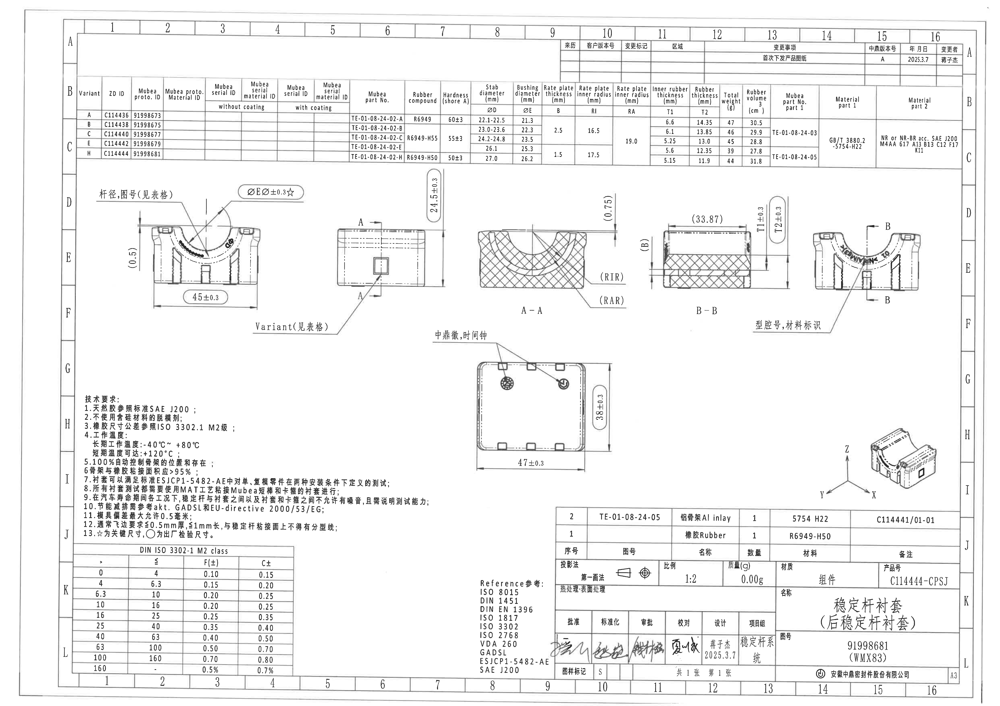

## object_1 上方修订履历表

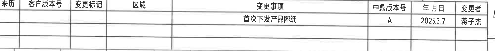

原图位置/视图名称：第1页上方右侧，修订履历表。

| 来历 | 客户版本号 | 变更标记 | 区域 | 变更事项 | 中鼎版本号 | 年月日 | 变更者 |
|---|---|---|---|---|---|---|---|
|  |  |  |  | 首次下发产品图纸 | A | 2025.3.7 | 蒋子杰 |
|  |  |  |  |  |  |  |  |
|  |  |  |  |  |  |  |  |

| 提取项 | 原图数值或文本 | 含义说明 |
|---|---|---|
| 变更事项 | 首次下发产品图纸 | 表示该版本为首次下发产品图纸。 |
| 中鼎版本号 | A | 中鼎内部版本号。 |
| 年月日 | 2025.3.7 | 修订记录日期。 |
| 变更者 | 蒋子杰 | 本次变更人员。 |

边界归属说明：仅提取修订履历表；下方 Variant/参数表不归入本对象。右侧邻接的图框字母 A 不作为表格字段。

## object_2 上方 Variant/参数表

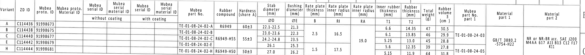

原图位置/视图名称：第1页上方横向参数表，图框行 B-C。

| Variant | ZD ID | Mubea proto. ID | Mubea proto. Material ID | Mubea serial ID without coating | Mubea serial material ID without coating | Mubea serial ID with coating | Mubea serial material ID with coating | Mubea part No. | Rubber compound | Hardness (shore A) | Stab diameter ØD (mm) | Bushing diameter ØE (mm) | Rate plate thickness B (mm) | Rate plate inner radius RI (mm) | Rate plate inner radius RA (mm) | Inner rubber thickness T1 (mm) | Rubber thickness T2 (mm) | Total weight (g) | Rubber volume (cm^3) | Mubea part No. part 1 | Material part 1 | Material part 2 |
|---|---|---|---|---|---|---|---|---|---|---|---|---|---|---|---|---|---|---|---|---|---|---|
| A | C114436 | 91998673 |  |  |  |  |  | TE-01-08-24-02-A | R6949 | 60±3 | 22.1-22.5 | 21.3 |  |  |  | 6.6 | 14.35 | 47 | 30.5 |  |  |  |
| B | C114438 | 91998675 |  |  |  |  |  | TE-01-08-24-02-B |  |  | 23.0-23.6 | 22.3 | 2.5 | 16.5 |  | 6.1 | 13.85 | 46 | 29.9 | TE-01-08-24-03 |  |  |
| C | C114440 | 91998677 |  |  |  |  |  | TE-01-08-24-02-C | R6949-H55 | 55±3 | 24.2-24.8 | 23.5 |  |  | 19.0 | 5.25 | 13.0 | 45 | 28.8 |  |  |  |
| E | C114442 | 91998679 |  |  |  |  |  | TE-01-08-24-02-E |  |  | 26.1 | 25.3 |  |  |  | 5.6 | 12.35 | 39 | 27.8 |  | GB/T 3880.2 -5754-H22 | NR or NR-BR acc. SAE J200 M4AA 617 A13 B13 C12 F17 K11 |
| H | C114444 | 91998681 |  |  |  |  |  | TE-01-08-24-02-H | R6949-H50 | 50±3 | 27.0 | 26.2 | 1.5 | 17.5 |  | 5.15 | 11.9 | 44 | 31.8 | TE-01-08-24-05 |  |  |

| 提取项 | 原图数值或文本 | 含义说明 |
|---|---|---|
| ØD | 22.1-22.5 / 23.0-23.6 / 24.2-24.8 / 26.1 / 27.0 | Stab diameter，稳定杆直径参数，按 Variant 选择。 |
| ØE | 21.3 / 22.3 / 23.5 / 25.3 / 26.2 | Bushing diameter，衬套直径参数，供前视图关键尺寸 ØEر0.3☆调用。 |
| B | 2.5 或 1.5 | Rate plate thickness，速率片厚度参数；B-B 剖面有 (B) 参考标注。 |
| RI | 16.5 或 17.5 | Rate plate inner radius RI，A-A 剖面以 (RIR) 标注其位置。 |
| RA | 19.0 | Rate plate inner radius RA，A-A 剖面以 (RAR) 标注其位置。 |
| T1 | 6.6 / 6.1 / 5.25 / 5.6 / 5.15 | Inner rubber thickness，B-B 剖面以 T1±0.3 控制。 |
| T2 | 14.35 / 13.85 / 13.0 / 12.35 / 11.9 | Rubber thickness，B-B 剖面以 T2±0.3 控制。 |
| Rubber compound | R6949 / R6949-H55 / R6949-H50 | 橡胶配方/硬度组合信息。 |
| Material part 1 | GB/T 3880.2 -5754-H22 | 铝骨架材料标准与牌号。 |
| Material part 2 | NR or NR-BR acc. SAE J200 M4AA 617 A13 B13 C12 F17 K11 | 橡胶材料标准要求。 |

边界归属说明：该表仅提取表内字段与数据；图框行列字母和相邻图框线不作为表格内容。

## object_3 左侧前视图

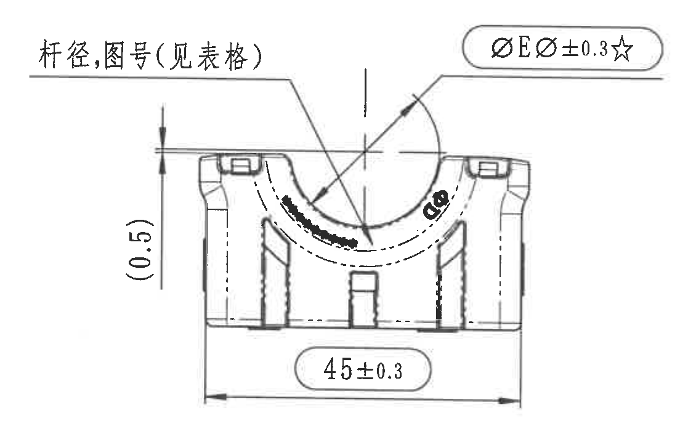

原图位置/视图名称：第1页左中部，左侧前视图。

| 提取项 | 原图数值或文本 | 含义说明 |
|---|---|---|
| 文本标注 | 杆径,图号(见表格) | 引线指向弧形区域，杆径与图号按上方参数表选择。 |
| 总宽尺寸 | 45±0.3 | 前视图底部水平总宽尺寸，公差 ±0.3。 |
| 参考尺寸 | (0.5) | 括号内参考尺寸，位于左侧竖向尺寸线上，用于说明局部高度/边距参考。 |
| 关键尺寸 | ØEر0.3☆ | 带直径符号和星号的关键尺寸；ØE 来自参数表 Bushing diameter ØE，±0.3 为公差，☆按技术要求第13项表示关键尺寸。 |

边界归属说明：45±0.3、(0.5)、ØEر0.3☆均位于前视图尺寸线范围内，归属本视图；侧视图 Variant 引线未归入本对象。

## object_4 中间侧视图及 A-A 剖切指示

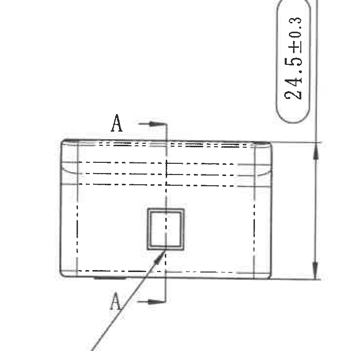

原图位置/视图名称：第1页中部偏左，侧视图。

| 提取项 | 原图数值或文本 | 含义说明 |
|---|---|---|
| 剖切标识 | A / A | 指定 A-A 剖面的切割位置和方向。 |
| 竖向尺寸 | 24.5±0.3 | 侧视图高度/厚度方向外形尺寸，公差 ±0.3。 |
| 方形特征 | 中央方框 | 侧面开口/标识位置，与其他视图中的方形特征对应。 |

边界归属说明：24.5±0.3 的完整尺寸线和箭头位于本侧视图右侧，归属本视图；Variant 文字作为 object_5 单独记录。

## object_5 Variant 标注局部

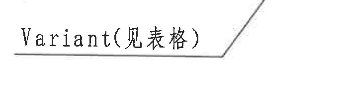

原图位置/视图名称：第1页中部偏左下，侧视图外部引线局部。

| 提取项 | 原图数值或文本 | 含义说明 |
|---|---|---|
| 引线说明 | Variant(见表格) | 指示该处特征按上方 Variant/参数表选择。 |

边界归属说明：该局部引线归属中间侧视图，不归属左侧前视图；裁切仅保留文字和引线端部。

## object_6 剖面 A-A

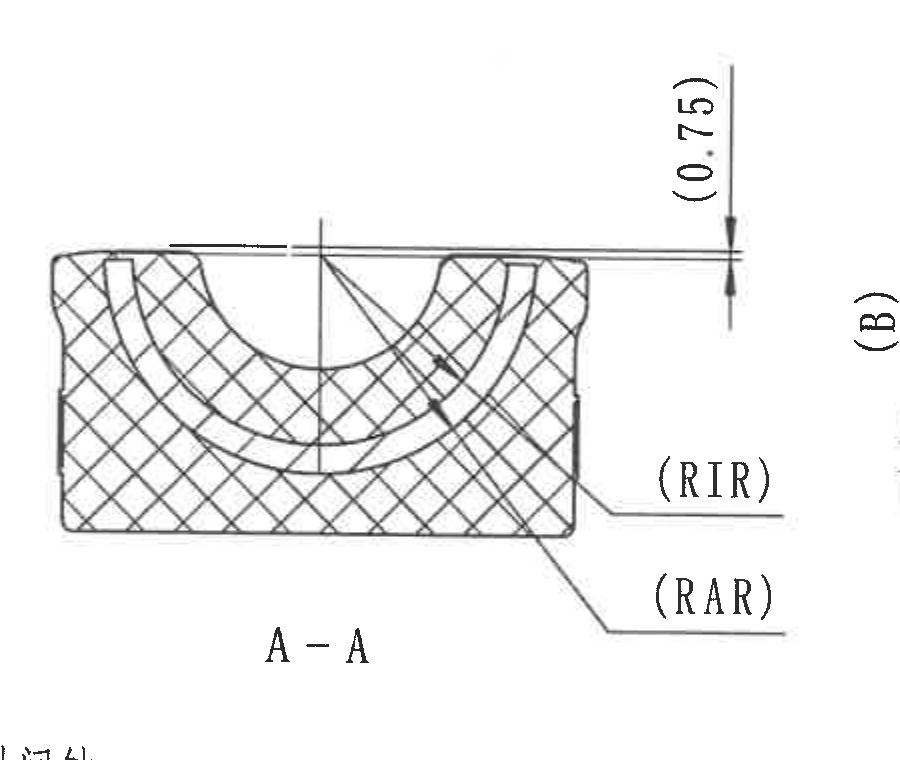

原图位置/视图名称：第1页中部，剖面 A-A。

| 提取项 | 原图数值或文本 | 含义说明 |
|---|---|---|
| 剖面名称 | A-A | 与 object_4 中 A-A 剖切指示对应。 |
| 参考尺寸 | (0.75) | 括号参考尺寸，位于剖面右上竖向尺寸处，表示局部间隙/边距参考。 |
| 参考半径 | (RIR) | 括号参考标注，指向内弧半径位置，对应参数表 RI。 |
| 参考半径 | (RAR) | 括号参考标注，指向另一内弧半径位置，对应参数表 RA。 |
| 剖面填充 | 交叉剖面线 | 表示剖切实体材料区域。 |

边界归属说明：(0.75)、(RIR)、(RAR) 的引线和文字完整属于 A-A 剖面；右侧 B-B 的 (B) 标注不归入本对象。

## object_7 剖面 B-B

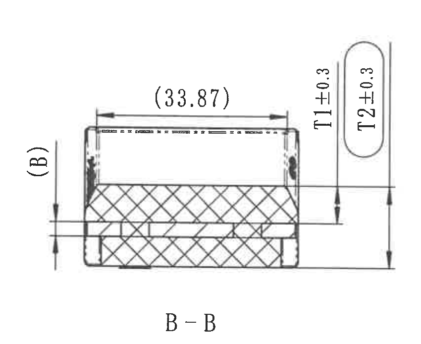

原图位置/视图名称：第1页中部偏右，剖面 B-B。

| 提取项 | 原图数值或文本 | 含义说明 |
|---|---|---|
| 剖面名称 | B-B | 与 object_8 中 B-B 剖切指示对应。 |
| 参考横向尺寸 | (33.87) | 括号内参考尺寸，表示剖面上方水平距离参考。 |
| 参考参数 | (B) | 括号参考标注，指向速率片厚度/参数 B 的相关位置，对应参数表 B。 |
| 厚度尺寸 | T1±0.3 | Inner rubber thickness T1，剖面厚度控制，公差 ±0.3。 |
| 厚度尺寸 | T2±0.3 | Rubber thickness T2，剖面总厚度控制，公差 ±0.3。 |

边界归属说明：(33.87)、(B)、T1±0.3、T2±0.3 的文字、尺寸线与箭头均归属 B-B 剖面；下方“型腔号,材料标识”说明另列 object_9。

## object_8 右侧标识前视图

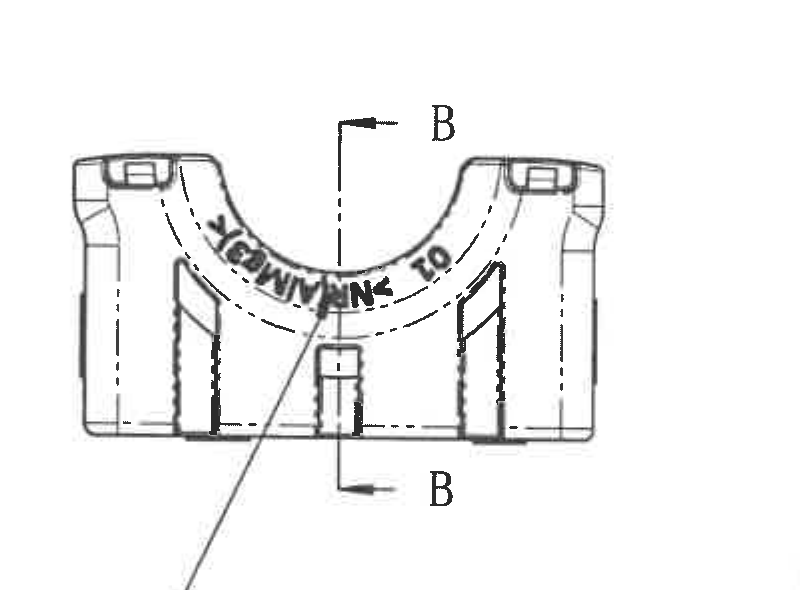

原图位置/视图名称：第1页右中部，右侧标识前视图。

| 提取项 | 原图数值或文本 | 含义说明 |
|---|---|---|
| 剖切标识 | B / B | 指定 B-B 剖面的切割位置和方向。 |
| 弧面标识 | CAMINA_TO | 位于弧形区域的成型/标识文字。 |
| 方形特征 | 下方中央方框 | 与侧视图和等轴测图中的方形特征对应。 |

边界归属说明：B/B 剖切标识归属本视图并对应 object_7；外部“型腔号,材料标识”引线说明作为 object_9 单独记录。

## object_9 型腔号、材料标识局部

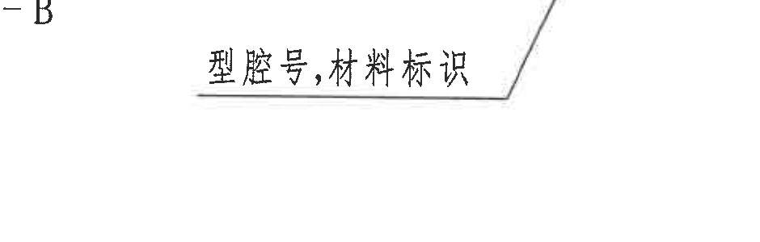

原图位置/视图名称：第1页右中部下方，右侧标识前视图外部说明。

| 提取项 | 原图数值或文本 | 含义说明 |
|---|---|---|
| 引线说明 | 型腔号,材料标识 | 指示右侧标识视图中弧面/正面区域应有型腔号和材料标识。 |

边界归属说明：该局部归属右侧标识前视图，不归属 B-B 剖面；裁切避开 B-B 尺寸，仅保留引线说明。

## object_10 下方平面视图

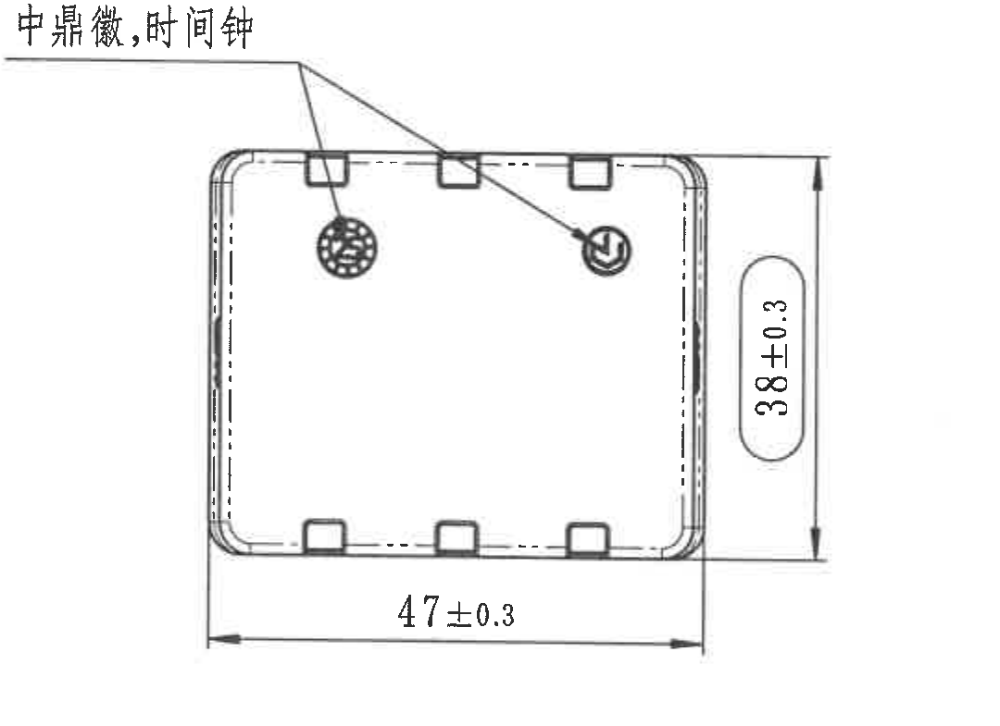

原图位置/视图名称：第1页下中部，平面视图。

| 提取项 | 原图数值或文本 | 含义说明 |
|---|---|---|
| 引线说明 | 中鼎徽,时间钟 | 指示平面视图顶部两个圆形标识位置。 |
| 水平总宽 | 47±0.3 | 平面视图底部水平总宽尺寸，公差 ±0.3。 |
| 竖向总高 | 38±0.3 | 平面视图右侧竖向总高尺寸，公差 ±0.3。 |

边界归属说明：47±0.3 和 38±0.3 的尺寸线、箭头和文字完整属于平面视图；标题栏不归入本对象。

## object_11 右下等轴测视图

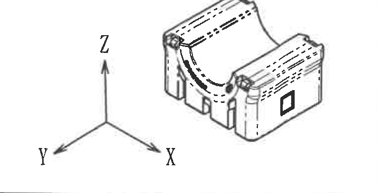

原图位置/视图名称：第1页右下方，等轴测视图。

| 提取项 | 原图数值或文本 | 含义说明 |
|---|---|---|
| 坐标轴 | X, Y, Z | 表示三维方向。 |
| 等轴测外形 | 零件立体图 | 展示零件整体形状、弧形槽、侧面方形特征和凸台/槽位。 |

边界归属说明：本对象无尺寸数值；仅包含三维方向和外形，不提取标题栏字段。

## object_12 技术要求 NOTES

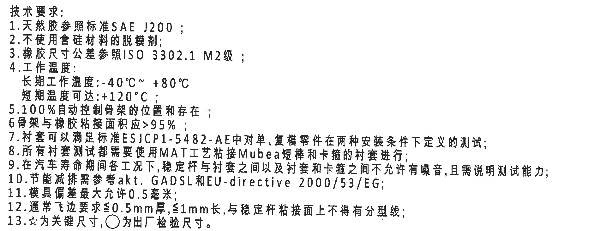

原图位置/视图名称：第1页左下方，技术要求区。

| 提取项 | 原图数值或文本 | 含义说明 |
|---|---|---|
| 1 | 天然胶参照标准SAE J200； | 天然胶材料标准。 |
| 2 | 不使用含硅材料的脱模剂； | 脱模剂禁用要求。 |
| 3 | 橡胶尺寸公差参照ISO 3302.1 M2级； | 橡胶尺寸公差等级要求。 |
| 4 | 工作温度：长期工作温度:-40°C~ +80°C；短期温度可达:+120°C； | 工作温度范围。 |
| 5 | 100%自动控制骨架的位置和存在； | 骨架位置/存在检测要求。 |
| 6 | 骨架与橡胶粘接面积应>95%； | 粘接面积要求。 |
| 7 | 衬套可以满足标准ESJCP1-5482-AE中对单、复模零件在两种安装条件下定义的测试； | 衬套测试标准要求。 |
| 8 | 所有衬套测试都需要使用MAT工艺粘接Mubea短棒和卡箍的衬套进行； | 测试样件/工艺要求。 |
| 9 | 在汽车寿命期间各工况下，稳定杆与衬套之间以及衬套和卡箍之间不允许有噪音，且需说明测试能力； | NVH/噪音与测试能力要求。 |
| 10 | 节能减排需参考akt. GADSL和EU-directive 2000/53/EG； | 环保法规/清单参考。 |
| 11 | 模具偏差最大允许0.5毫米； | 模具偏差限制。 |
| 12 | 通常飞边要求≤0.5mm厚,≤1mm长,与稳定杆粘接面上不得有分型线； | 飞边和分型线要求。 |
| 13 | ☆为关键尺寸,○为出厂检验尺寸。 | 图纸符号说明。 |

边界归属说明：仅提取技术要求 1-13；右侧平面视图和下方公差表均不归入本对象。

## object_13 DIN ISO 3302-1 M2 class 公差表

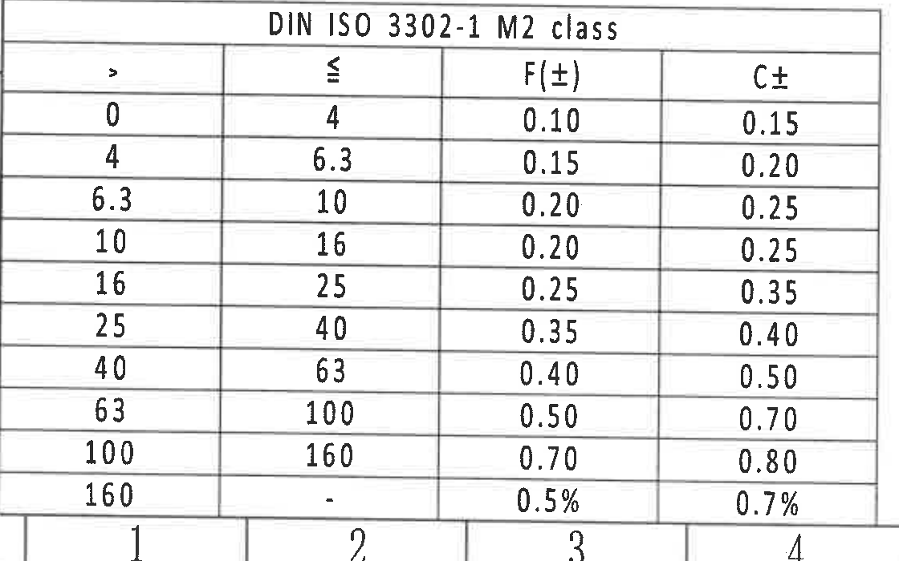

原图位置/视图名称：第1页左下方，技术要求下方公差表。

| DIN ISO 3302-1 M2 class |  |  |  |
|---|---|---|---|
| > | ≤ | F(±) | C± |
| 0 | 4 | 0.10 | 0.15 |
| 4 | 6.3 | 0.15 | 0.20 |
| 6.3 | 10 | 0.20 | 0.25 |
| 10 | 16 | 0.20 | 0.25 |
| 16 | 25 | 0.25 | 0.35 |
| 25 | 40 | 0.35 | 0.40 |
| 40 | 63 | 0.40 | 0.50 |
| 63 | 100 | 0.50 | 0.70 |
| 100 | 160 | 0.70 | 0.80 |
| 160 | - | 0.5% | 0.7% |

| 提取项 | 原图数值或文本 | 含义说明 |
|---|---|---|
| 标题 | DIN ISO 3302-1 M2 class | 橡胶尺寸公差等级表。 |
| F(±) | 0.10 到 0.70，最后一行为 0.5% | F 类公差值。 |
| C± | 0.15 到 0.80，最后一行为 0.7% | C 类公差值。 |

边界归属说明：最后一行 `160 - 0.5% 0.7%` 已完整保留；底部图框坐标数字为邻接外框，不作为表格内容。

## object_14 Reference 参考标准

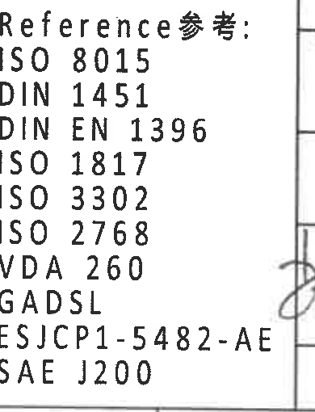

原图位置/视图名称：第1页下中偏左，Reference 参考标准列表。

| 提取项 | 原图数值或文本 | 含义说明 |
|---|---|---|
| Reference | ISO 8015 | 参考标准。 |
| Reference | DIN 1451 | 参考标准。 |
| Reference | DIN EN 1396 | 参考标准。 |
| Reference | ISO 1817 | 参考标准。 |
| Reference | ISO 3302 | 参考标准。 |
| Reference | ISO 2768 | 参考标准。 |
| Reference | VDA 260 | 参考标准。 |
| Reference | GADSL | 参考标准。 |
| Reference | ESJCP1-5482-AE | 参考标准。 |
| Reference | SAE J200 | 参考标准。 |

边界归属说明：仅提取 Reference 列表；右侧标题栏签署线/竖线为邻接区域，不作为参考标准内容。

## object_15 右下标题栏/BOM/签署栏

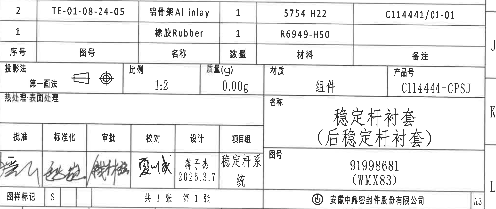

原图位置/视图名称：第1页右下标题栏。

| 序号 | 图号 | 名称 | 数量 | 材料 | 备注 |
|---|---|---|---|---|---|
| 2 | TE-01-08-24-05 | 铝骨架Al inlay | 1 | 5754 H22 | C114441/01-01 |
| 1 |  | 橡胶Rubber | 1 | R6949-H50 |  |

| 标题栏字段 | 原图数值或文本 | 含义说明 |
|---|---|---|
| 投影法 | 第一画法 | 投影方法。 |
| 比例 | 1:2 | 图纸比例。 |
| 质量(g) | 0.00g | 组件质量栏。 |
| 材质 | 组件 | 材质/对象类型为组件。 |
| 产品号 | C114444-CPSJ | 产品号。 |
| 热处理/表面处理 | 空 | 原图该栏无填写值。 |
| 名称 | 稳定杆衬套（后稳定杆衬套） | 产品名称。 |
| 图号 | 91998681 (WMX83) | 图纸/零件编号。 |
| 批准 | 签名 | 签署栏。 |
| 标准化 | 签名 | 签署栏。 |
| 审批 | 签名 | 签署栏。 |
| 校对 | 签名 | 签署栏。 |
| 设计 | 蒋子杰 2025.3.7 | 设计人员与日期。 |
| 项目组 | 稳定杆系统 | 项目组。 |
| 图样标记 | S | 图样标记。 |
| 页数 | 共1张 第1张 | 图纸页数。 |
| 公司 | 安徽中鼎密封件股份有限公司 | 出图公司。 |
| 图幅 | A3 | 图幅规格。 |

边界归属说明：BOM、标题栏字段、签署栏、公司信息均归属本对象；右侧 J/K/L 为图框坐标邻接标记，不作为标题栏字段，A3 作为图幅字段记录。

## 裁切检查记录

| 对象 | 检查结果 |
|---|---|
| page_1.png | 整页 PNG 渲染完整，尺寸 4959×3505。 |
| object_1.png | 修订履历表表头和记录完整；未提取下方参数表。右侧图框 A 为邻接标记。 |
| object_2.png | Variant/参数表表头、各 Variant 行和材料列完整；图框字母不作为数据。 |
| object_3.png | 前视图尺寸线、箭头和文字 45±0.3、(0.5)、ØEر0.3☆ 完整；未混入 Variant 说明。 |
| object_4.png | 侧视图、A-A 剖切符号和 24.5±0.3 完整；外部 Variant 说明另裁。 |
| object_5.png | Variant(见表格) 文字和引线端完整；仅作为侧视图局部说明。 |
| object_6.png | A-A 剖面、(0.75)、(RIR)、(RAR) 完整；右侧 B-B 标注不提取。 |
| object_7.png | B-B 剖面、(33.87)、(B)、T1±0.3、T2±0.3 完整；下方标识说明另裁。 |
| object_8.png | 右侧标识前视图和 B/B 剖切标识完整；外部说明另裁。 |
| object_9.png | “型腔号,材料标识”文字和引线完整；未提取 B-B 尺寸。 |
| object_10.png | 平面视图、47±0.3、38±0.3 和“中鼎徽,时间钟”完整；未混入标题栏。 |
| object_11.png | 等轴测图和 X/Y/Z 坐标轴完整；标题栏文字已排除。 |
| object_12.png | 技术要求 1-13 完整；右侧视图片段已排除。 |
| object_13.png | 公差表标题、表头和所有行完整；底部图框坐标数字为邻接外框，不作为表格内容。 |
| object_14.png | Reference 参考列表完整；右侧标题栏线为邻接边界，不作为内容。 |
| object_15.png | 标题栏、BOM、签署栏和公司信息完整；右侧 J/K/L 为图框坐标邻接标记。 |
