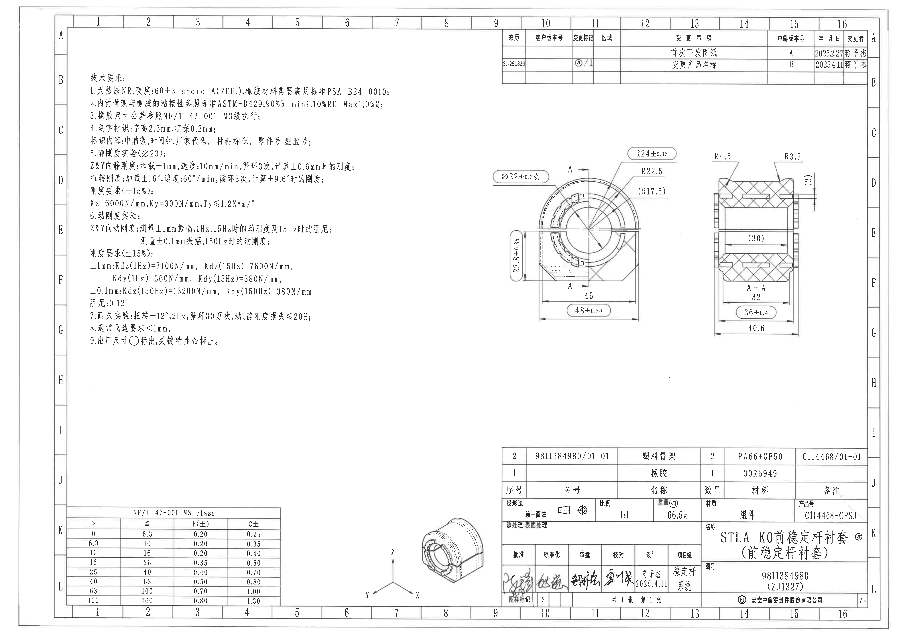
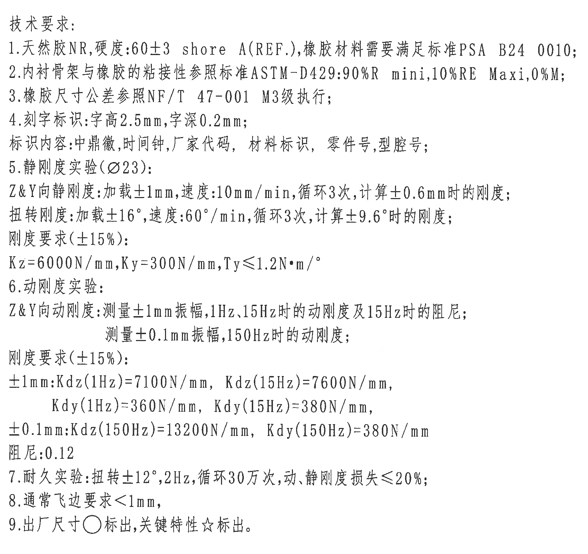
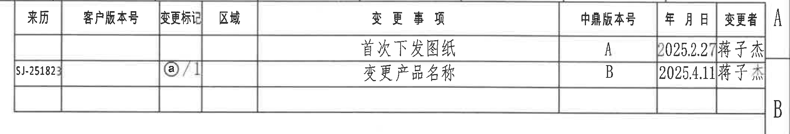
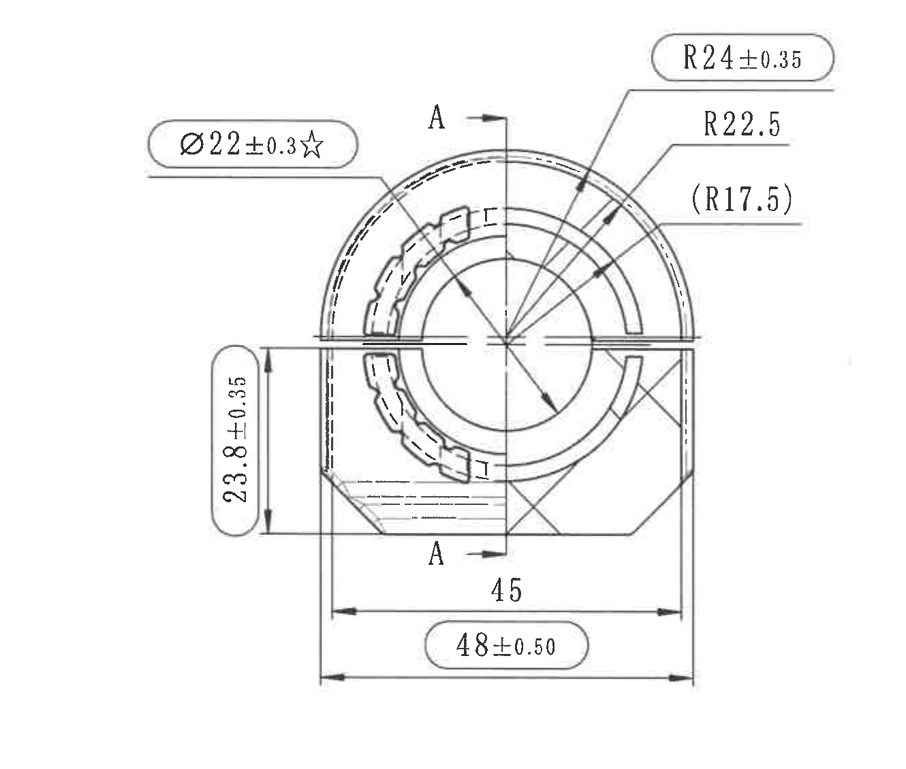
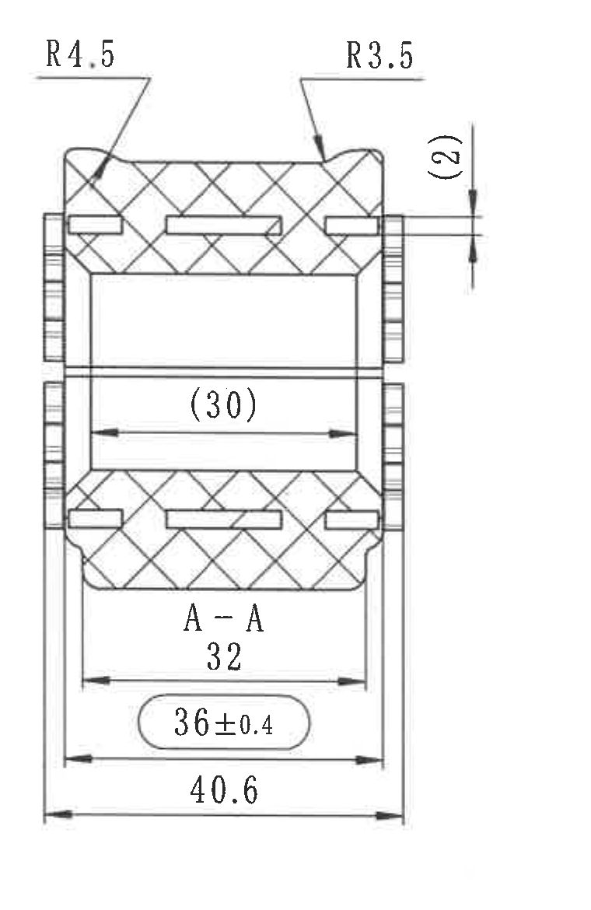
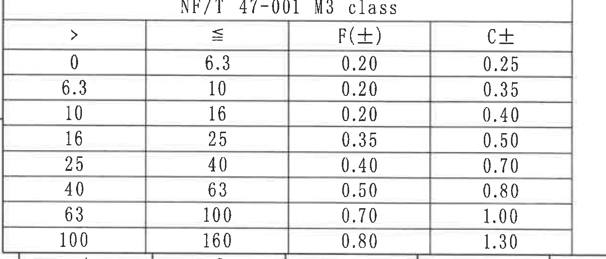
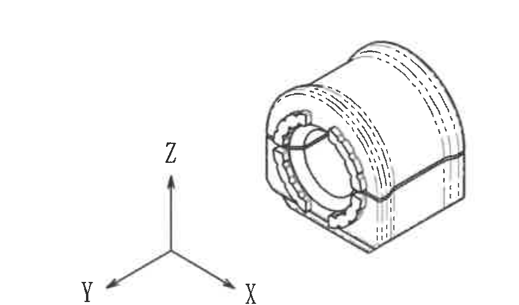
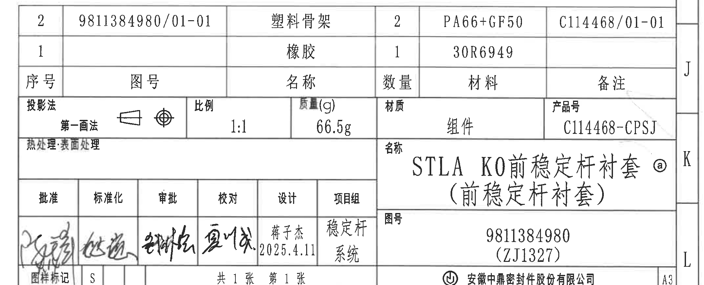

# 20C114468.pdf 内容识别结果

## 整页渲染

| 项目 | 内容 |
|---|---|
| PDF | `input/20C114468.pdf` |
| 页码 | 1 |
| 整页 PNG | `outputs/20C114468_assets/images/page_1.png` |
| 像素尺寸 | 4959 x 3505 |

## object_1 - NOTES / 技术要求

| 项目 | 内容 |
|---|---|
| 原图位置/视图名称 | 左上技术要求区，约位于图框 B-G / 1-6 |
| bbox | `[470, 360, 2170, 1960]` |

| 提取项 | 原图数值或文本 | 含义说明 |
|---|---|---|
| 标题 | 技术要求 | 本区域为整张图纸的 NOTES/技术要求，不属于任一加工视图。 |
| 1 | 天然胶NR,硬度:60±3 shore A(REF.),橡胶材料需要满足标准PSA B24 0010; | 规定橡胶材料为天然胶 NR；硬度 60±3 Shore A 为参考要求；材料需满足 PSA B24 0010。 |
| 2 | 内衬骨架与橡胶的粘接性参照标准ASTM-D429:90%R mini,10%RE Maxi,0%M; | 规定内衬骨架与橡胶粘接性验收标准：R 最小 90%，RE 最大 10%，M 为 0%。 |
| 3 | 橡胶尺寸公差参照NF/T 47-001 M3级执行; | 未单独标注的橡胶尺寸公差按 NF/T 47-001 M3 级执行。 |
| 4 | 刻字标识:字高2.5mm,字深0.2mm; 标识内容:中鼎徽,时间钟,厂家代码,材料标识,零件号,型腔号; | 规定刻字高度、深度及刻字内容。 |
| 5 | 静刚度实验(Ø23): Z&Y向静刚度:加载±1mm,速度:10mm/min,循环3次,计算±0.6mm时的刚度; 扭转刚度:加载±16°,速度:60°/min,循环3次,计算±9.6°时的刚度; 刚度要求(±15%): Kz=6000N/mm,Ky=300N/mm,Ty≤1.2N·m/° | 静刚度试验条件和目标刚度；Ø23 为试验/测量相关尺寸，±0.6mm 与 ±9.6°为计算刚度位置。 |
| 6 | 动刚度实验: Z&Y向动刚度:测量±1mm振幅,1Hz,15Hz时的动刚度及15Hz时的阻尼; 测量±0.1mm振幅,150Hz时的动刚度; 刚度要求(±15%): ±1mm:Kdz(1Hz)=7100N/mm,Kdz(15Hz)=7600N/mm,Kdy(1Hz)=360N/mm,Kdy(15Hz)=380N/mm; ±0.1mm:Kdz(150Hz)=13200N/mm,Kdy(150Hz)=380N/mm; 阻尼:0.12 | 动刚度试验条件、频率、振幅、刚度目标和阻尼要求。 |
| 7 | 耐久实验:扭转±12°,2Hz,循环30万次,动、静刚度损失≤20%; | 耐久试验为扭转载荷；循环后动、静刚度损失上限为 20%。 |
| 8 | 通常飞边要求<1mm, | 飞边高度/宽度通常要求小于 1mm。 |
| 9 | 出厂尺寸○标出,关键特性☆标出。 | 圆圈表示出厂尺寸；星号表示关键特性。主视图中的 `Ø22±0.3☆` 即关键特性。 |

| 边界归属说明 |
|---|
| 裁切区域只覆盖左上 NOTES 文本，未包含主视图、剖视图或表格。全部提取项均归属于整张图纸技术要求。 |

## object_2 - 修订履历表

| 项目 | 内容 |
|---|---|
| 原图位置/视图名称 | 右上修订履历表，约位于图框 A-B / 10-16 |
| bbox | `[2720, 160, 4830, 520]` |

| 来历 | 客户版本号 | 变更标记 | 区域 | 变更事项 | 中鼎版本号 | 年月日 | 变更者 |
|---|---|---|---|---|---|---|---|
|  |  |  |  | 首次下发图纸 | A | 2025.2.27 | 蒋子杰 |
| SJ-251823 |  | ⓐ/1 |  | 变更产品名称 | B | 2025.4.11 | 蒋子杰 |
|  |  |  |  |  |  |  |  |

| 提取项 | 原图数值或文本 | 含义说明 |
|---|---|---|
| 版本 A | 首次下发图纸 / 2025.2.27 / 蒋子杰 | 首次下发图纸的记录，中鼎版本号为 A。 |
| 版本 B | 变更产品名称 / 2025.4.11 / 蒋子杰 | 第二条变更记录，中鼎版本号为 B。 |
| 来历 | SJ-251823 | 第二条记录的来历编号；末位靠近表格竖线，按可见字符记录。 |
| 变更标记 | ⓐ/1 | 第二条记录的变更标记，与标题栏名称旁的 ⓐ 对应。 |

| 边界归属说明 |
|---|
| 裁切区域完整包含修订履历表的表头、两条记录和空白行。右侧为保证“变更者”列右边框完整，带入少量图框分区字母 A/B；这些字母不作为修订表数据提取。 |

## object_3 - 主视图

| 项目 | 内容 |
|---|---|
| 原图位置/视图名称 | 右中主视图，约位于图框 D-G / 10-13 |
| bbox | `[2490, 760, 3820, 1890]` |

| 提取项 | 原图数值或文本 | 含义说明 |
|---|---|---|
| 直径关键尺寸 | Ø22±0.3☆ | 主视图中的直径尺寸，带星号，按 NOTES 第 9 条为关键特性。 |
| 半径尺寸 | R24±0.35 | 上部外圆弧半径尺寸，带 ±0.35 公差。 |
| 半径尺寸 | R22.5 | 上部内侧圆弧/槽相关半径，未单独标注公差，按图纸通用公差或相关标准执行。 |
| 参考半径 | (R17.5) | 括号内参考尺寸，位于主视图右上半径标注组；用于说明几何关系，不作为独立制造验收尺寸。 |
| 垂直尺寸 | 23.8±0.35 | 主视图左侧竖向尺寸，带 ±0.35 公差。 |
| 水平尺寸 | 45 | 主视图下部两内侧竖向边之间的水平尺寸，未单独标注公差。 |
| 总宽尺寸 | 48±0.50 | 主视图底部外侧总宽，带 ±0.50 公差；标注框为出厂尺寸标识样式。 |
| 剖切标记 | A-A，上下各 A，箭头指向右侧 | 主视图中剖切位置和观察方向，对应 object_4 的 A-A 剖视图。 |
| T 标记 | T，两处可见 | 主视图环形局部附近的 T 标记，属于主视图内的局部标识/特征标注；未附带数值公差。 |
| 数量前缀 | 未见数量前缀 | 本主视图尺寸标注中未见 `2X`、`4X` 等数量前缀。 |

| 边界归属说明 |
|---|
| 裁切区域完整包含主视图的尺寸线、箭头、引线、半径文字、直径文字、A-A 剖切线和底部总宽尺寸。右边界在 A-A 剖视图之前，未把剖视图的 R4.5、R3.5、(2)、(30)、32、36±0.4、40.6 归入主视图。 |

## object_4 - A-A 剖视图

| 项目 | 内容 |
|---|---|
| 原图位置/视图名称 | 右中 A-A 剖视图，约位于图框 D-G / 14-15 |
| bbox | `[3865, 790, 4625, 1960]` |

| 提取项 | 原图数值或文本 | 含义说明 |
|---|---|---|
| 剖视图名称 | A-A | 与主视图中的 A-A 剖切线对应。 |
| 半径尺寸 | R4.5 | 剖视图左上外形圆角/过渡半径。 |
| 半径尺寸 | R3.5 | 剖视图右上外形圆角/过渡半径。 |
| 参考尺寸 | (2) | 剖视图右上竖向参考尺寸，括号表示参考用途；尺寸线和箭头完整保留。 |
| 参考尺寸 | (30) | 剖视图中部内腔水平参考尺寸，括号表示参考用途。 |
| 水平尺寸 | 32 | 剖视图下部第一层水平宽度尺寸，未单独标注公差。 |
| 水平尺寸 | 36±0.4 | 剖视图下部带框尺寸，带 ±0.4 公差。 |
| 总宽尺寸 | 40.6 | 剖视图最下方整体宽度尺寸，未单独标注公差。 |
| 剖面线 | 交叉剖面线 | 表示该视图为剖切后材料截面表达。 |

| 边界归属说明 |
|---|
| 裁切区域只覆盖 A-A 剖视图及其外侧尺寸标注。右侧收边后未包含图框竖线；左侧未包含主视图片段。主视图中的 R24±0.35、R22.5、(R17.5)、Ø22±0.3☆ 不归入本剖视图。 |

## object_5 - NF/T 47-001 M3 公差表

| 项目 | 内容 |
|---|---|
| 原图位置/视图名称 | 左下公差表，约位于图框 K-L / 1-4 |
| bbox | `[360, 2808, 1610, 3343]` |

| > | ≤ | F(±) | C± |
|---|---|---|---|
| 0 | 6.3 | 0.20 | 0.25 |
| 6.3 | 10 | 0.20 | 0.35 |
| 10 | 16 | 0.20 | 0.40 |
| 16 | 25 | 0.35 | 0.50 |
| 25 | 40 | 0.40 | 0.70 |
| 40 | 63 | 0.50 | 0.80 |
| 63 | 100 | 0.70 | 1.00 |
| 100 | 160 | 0.80 | 1.30 |

| 提取项 | 原图数值或文本 | 含义说明 |
|---|---|---|
| 表题 | NF/T 47-001 M3 class | 与 NOTES 第 3 条对应，用于橡胶尺寸公差。 |
| 列 `>` / `≤` | 0-6.3, 6.3-10, 10-16, 16-25, 25-40, 40-63, 63-100, 100-160 | 尺寸范围分段。 |
| F(±) | 0.20, 0.20, 0.20, 0.35, 0.40, 0.50, 0.70, 0.80 | F 类对应的双向公差。 |
| C± | 0.25, 0.35, 0.40, 0.50, 0.70, 0.80, 1.00, 1.30 | C 类对应的双向公差。 |

| 边界归属说明 |
|---|
| 裁切区域完整包含表题、表头、8 行数据和底部表线。底部未纳入图框坐标数字，表格右侧和左侧未带入其他视图内容。 |

## object_6 - 轴测图

| 项目 | 内容 |
|---|---|
| 原图位置/视图名称 | 底部中间轴测图，约位于图框 K-L / 7-9 |
| bbox | `[1870, 2780, 2745, 3295]` |

| 提取项 | 原图数值或文本 | 含义说明 |
|---|---|---|
| 轴测模型 | 零件三维轴测外形 | 用于表达零件整体形状、前端环形结构、上部弧形外轮廓和底座形态。 |
| 方向标 | X, Y, Z | 表示轴测图方向。 |
| 尺寸/公差 | 未见尺寸、公差、参考尺寸或数量前缀 | 本裁切对象为形状参考视图，不承担尺寸标注。 |

| 边界归属说明 |
|---|
| 裁切区域仅包含轴测模型和 XYZ 方向标。右侧标题栏、底部图框坐标行和签署栏均已排除。 |

## object_7 - 标题栏 / BOM / 签署栏

| 项目 | 内容 |
|---|---|
| 原图位置/视图名称 | 右下标题栏与明细栏，约位于图框 I-L / 9-16 |
| bbox | `[2700, 2445, 4850, 3320]` |

### 明细栏原表还原

| 序号 | 图号 | 名称 | 数量 | 材料 | 备注 |
|---|---|---|---|---|---|
| 2 | 9811384980/01-01 | 塑料骨架 | 2 | PA66+GF50 | C114468/01-01 |
| 1 |  | 橡胶 | 1 | 30R6949 |  |

### 标题栏字段还原

| 提取项 | 原图数值或文本 | 含义说明 |
|---|---|---|
| 投影法 | 第一画法 | 图纸采用第一角法投影，旁有投影符号。 |
| 比例 | 1:1 | 图样比例。 |
| 质量(g) | 66.5g | 产品质量。 |
| 材质 | 组件 | 标题栏材质字段，表示总成/组件。 |
| 产品号 | C114468-CPSJ | 产品号。 |
| 名称 | STLA K0前稳定杆衬套 ⓐ (前稳定杆衬套) | 产品名称；ⓐ 与修订履历中的变更标记对应。 |
| 图号 | 9811384980 (ZJ1327) | 标题栏图号。 |
| 热处理·表面处理 | 空白 | 图中该栏未填写具体内容。 |
| 图样标记 | S | 图样标记字段。 |
| 页数 | 共1张 第1张 | 图纸总页数和当前页。 |
| 公司 | 安徽中鼎密封件股份有限公司 | 图纸所属公司。 |
| 幅面 | A3 | 图纸幅面。 |

### 签署栏原表还原

| 批准 | 标准化 | 审批 | 校对 | 设计 | 项目组 |
|---|---|---|---|---|---|
| 手写签名，无法可靠辨读 | 手写签名，无法可靠辨读 | 手写签名，无法可靠辨读 | 手写签名，无法可靠辨读 | 蒋子杰 / 2025.4.11 | 稳定杆 / 系统 |

| 边界归属说明 |
|---|
| 裁切区域完整包含右下标题栏、明细栏、签署栏、产品号、名称、图号、公司名和 A3 幅面格。右侧图框分区字母 J/K/L 随标题栏外框进入裁切范围，但不作为标题栏字段提取；左侧未包含轴测图本体。 |

## 裁切检查记录

| 对象 | 图片路径 | 检查结果 |
|---|---|---|
| page_1 | `outputs/20C114468_assets/images/page_1.png` | 整页 PNG 已由 PDF 渲染生成，像素尺寸 4959 x 3505。 |
| object_1 | `outputs/20C114468_assets/images/object_1.png` | NOTES 文本完整；无尺寸线；未带入视图或表格。 |
| object_2 | `outputs/20C114468_assets/images/object_2.png` | 修订表表头、两条记录、空白行和表格线完整；`SJ-251823` 末位靠近表格竖线但未被裁掉；右侧少量图框 A/B 字母不作为数据。 |
| object_3 | `outputs/20C114468_assets/images/object_3.png` | 主视图尺寸线、箭头、引线、`Ø22±0.3☆`、`R24±0.35`、`R22.5`、`(R17.5)`、`23.8±0.35`、`45`、`48±0.50` 和 A-A 剖切标记完整；未包含 A-A 剖视图尺寸。 |
| object_4 | `outputs/20C114468_assets/images/object_4.png` | A-A 剖视图尺寸线和文字完整，包含 `R4.5`、`R3.5`、`(2)`、`(30)`、`32`、`36±0.4`、`40.6`；未带入主视图或图框线。 |
| object_5 | `outputs/20C114468_assets/images/object_5.png` | 公差表标题、表头、8 行数据和底线完整；未带入底部图框坐标数字。 |
| object_6 | `outputs/20C114468_assets/images/object_6.png` | 轴测模型和 X/Y/Z 方向标完整；右侧标题栏和底部图框坐标行已排除。 |
| object_7 | `outputs/20C114468_assets/images/object_7.png` | 标题栏、明细栏、签署栏、产品号、名称、图号、公司名和 A3 格完整；右侧图框分区字母仅作为边界背景，不作为字段。 |
