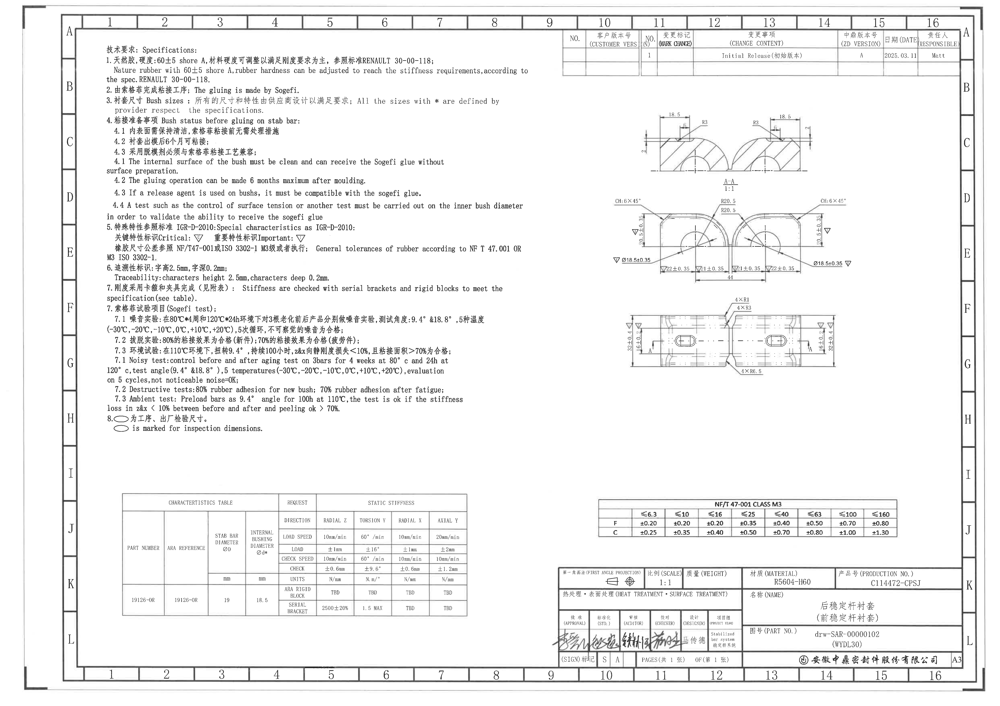
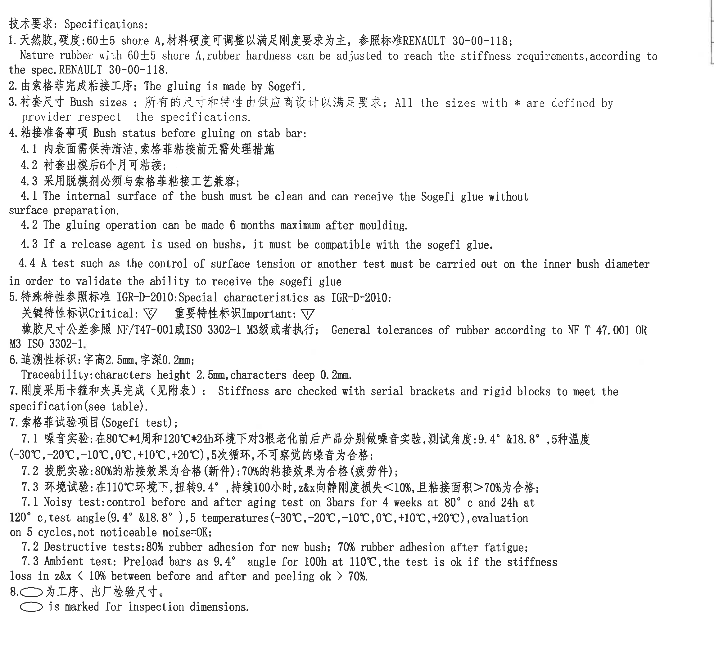
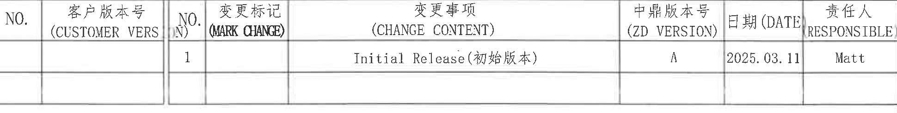
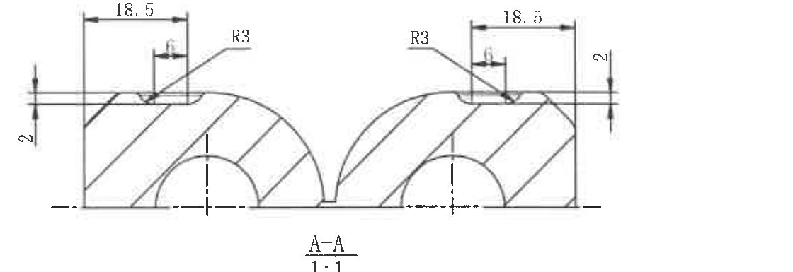
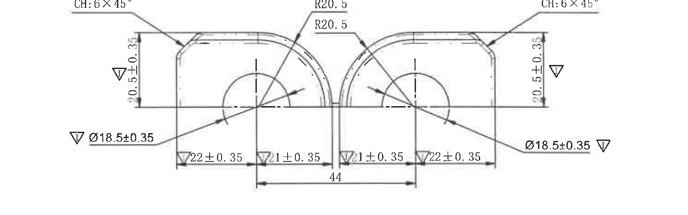
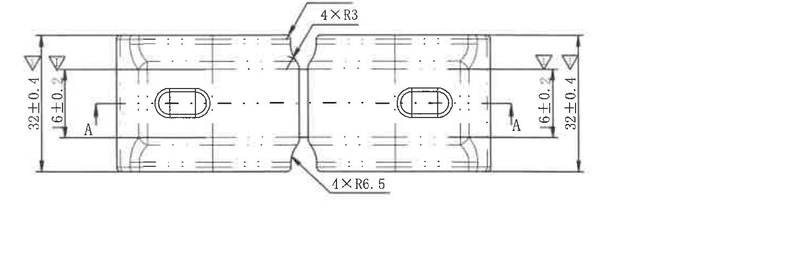
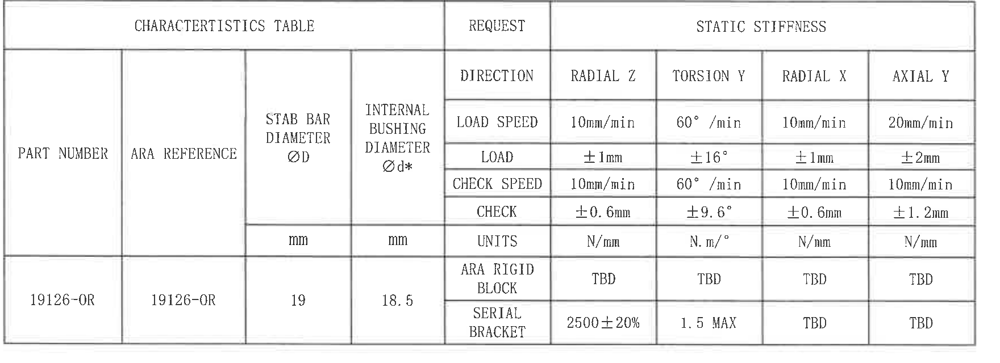
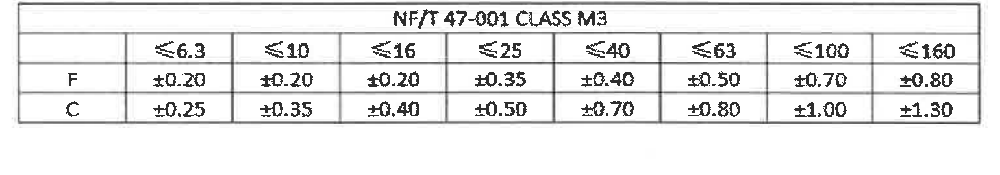
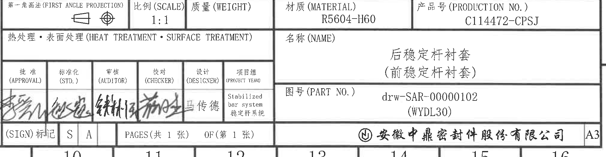

# 20C114472 内容识别结果

整页渲染图：

页面信息：1 页；整页 PNG：`outputs/20C114472_assets/images/page_1.png`；像素尺寸：4959 x 3505。

## object_1 - NOTES / 技术要求

| 项目 | 内容 |
|---|---|
| 原图位置/视图名称 | 第 1 页左上至左中区域，图框约 B-H 行、1-9 列；NOTES / 技术要求 |
| object_kind | notes |
| bbox | [500, 170, 2800, 2250] |
| 边界归属说明 | 裁切范围覆盖 NOTES 全部文本、检验尺寸椭圆符号及第 8 条说明。右边界有一小段相邻修订表竖线残留，但无相邻表格文字或尺寸被纳入提取。 |

| 提取项 | 原图数值或文本 | 含义说明 |
|---|---|---|
| 标题 | 技术要求: Specifications: | 本区域为技术要求/说明文本。 |
| 1 | 天然胶,硬度:60±5 shore A,材料硬度可调整以满足刚度要求为主,参照标准 RENAULT 30-00-118; | 材料为天然橡胶，硬度要求 60±5 Shore A，可按刚度要求调整；参考 RENAULT 30-00-118。 |
| 1 English | Nature rubber with 60±5 shore A,rubber hardness can be adjusted to reach the stiffness requirements,according to the spec.RENAULT 30-00-118. | 对第 1 条的英文说明。 |
| 2 | 由索格菲完成粘接工序; The gluing is made by Sogefi. | 粘接工序由 Sogefi 完成。 |
| 3 | 衬套尺寸 Bush sizes: 所有的尺寸和特性由供应商设计以满足要求; All the sizes with * are defined by provider respect the specifications. | 衬套尺寸及带 `*` 的尺寸/特性由供应商按规范定义；与特性表中的 `Ød*` 对应。 |
| 4 | 粘接准备事项 Bush status before gluing on stab bar: | 粘接前衬套状态要求。 |
| 4.1 | 内表面需保持清洁,索格菲粘接前无需处理措施 | 衬套内表面需清洁，Sogefi 粘接前无需额外表面处理。 |
| 4.2 | 衬套出模后6个月可粘接; | 出模后最多 6 个月内可进行粘接。 |
| 4.3 | 采用脱模剂必须与索格菲粘接工艺兼容; | 脱模剂必须与 Sogefi 粘接工艺兼容。 |
| 4.1 English | The internal surface of the bush must be clean and can receive the Sogefi glue without surface preparation. | 对中文 4.1 的英文说明。 |
| 4.2 English | The gluing operation can be made 6 months maximum after moulding. | 对中文 4.2 的英文说明。 |
| 4.3 English | If a release agent is used on bushs, it must be compatible with the sogefi glue. | 对中文 4.3 的英文说明。 |
| 4.4 English | A test such as the control of surface tension or another test must be carried out on the inner bush diameter in order to validate the ability to receive the sogefi glue | 需通过表面张力控制或其他测试验证内孔接收 Sogefi 胶水的能力。 |
| 5 | 特殊特性参照标准 IGR-D-2010: Special characteristics as IGR-D-2010: | 特殊特性标识按 IGR-D-2010。 |
| 5 标识 | 关键特性标识 Critical: 倒三角 C；重要特性标识 Important: 倒三角 I | 图中倒三角标识用于标记关键/重要特性。 |
| 5 公差标准 | 橡胶尺寸公差参照 NF/T47-001 或 ISO 3302-1 M3 级或者执行; General tolerances of rubber according to NF T 47.001 OR M3 ISO 3302-1. | 橡胶尺寸通用公差按 NF/T 47-001 或 ISO 3302-1 M3。 |
| 6 | 追溯性标识: 字高2.5mm, 字深0.2mm; Traceability:characters height 2.5mm,characters deep 0.2mm. | 追溯字符高度 2.5 mm、深度 0.2 mm。 |
| 7 | 刚度采用卡箍和夹具完成（见附表）: Stiffness are checked with serial brackets and rigid blocks to meet the specification(see table). | 刚度检测使用串联卡箍和刚性块；对应特性表。 |
| 7 Sogefi test | 索格菲试验项目(Sogefi test); | Sogefi 试验项目标题。 |
| 7.1 中文 | 噪音实验:在80°C*4周和120°C*24h环境下对3根老化前后产品分别做噪音实验,测试角度:9.4° &18.8°,5种温度(-30°C,-20°C,-10°C,0°C,+10°C,+20°C),5次循环,不可察觉的噪音为合格; | 噪音试验条件、角度、温度循环及合格判定。括号内温度为试验温度组；`9.4° &18.8°` 为试验角度。 |
| 7.2 中文 | 按脱实验:80%的粘接效果为合格(新件);70%的粘接效果为合格(疲劳件); | 粘接剥离/破坏试验合格标准：新件 80%，疲劳件 70%。 |
| 7.3 中文 | 环境试验:在110°C环境下,扭转9.4°,持续100小时,z&x向静刚度损失<10%,且粘接面积>70%为合格; | 环境试验条件和判定：110°C、9.4°、100 h，Z/X 静刚度损失小于 10%，粘接面积大于 70%。 |
| 7.1 English | Noisy test:control before and after aging test on 3bars for 4 weeks at 80°c and 24h at 120°c,test angle(9.4° &18.8°),5 temperatures(-30°C,-20°C,-10°C,0°C,+10°C,+20°C),evaluation on 5 cycles,not noticeable noise=OK; | 英文噪音试验说明；括号内内容为试验角度和温度条件。 |
| 7.2 English | Destructive tests:80% rubber adhesion for new bush; 70% rubber adhesion after fatigue; | 英文破坏试验说明。 |
| 7.3 English | Ambient test: Preload bars as 9.4° angle for 100h at 110°C,the test is ok if the stiffness loss in z&x < 10% between before and after and peeling ok > 70%. | 英文环境试验说明。 |
| 8 | 椭圆符号 为工序、出厂检验尺寸。 / 椭圆符号 is marked for inspection dimensions. | 椭圆标记代表工序或出厂检验尺寸。 |

## object_2 - 修订履历表

| 项目 | 内容 |
|---|---|
| 原图位置/视图名称 | 第 1 页右上区域，图框约 A-B 行、10-16 列；修订履历表 |
| object_kind | table |
| bbox | [2815, 150, 4755, 395] |
| 边界归属说明 | 裁切范围仅包含修订履历表本体；右侧图框字母 A 已排除。左侧第一组客户版本列为空白，仍按原表结构保留。 |

原表还原：

| NO. | 客户版本号 (CUSTOMER VERS N) | NO. | 变更标记 (MARK CHANGE) | 变更事项 (CHANGE CONTENT) | 中鼎版本号 (ZD VERSION) | 日期 (DATE) | 责任人 RESPONSIBLE |
|---|---|---|---|---|---|---|---|
|  |  | 1 |  | Initial Release(初始版本) | A | 2025.03.11 | Matt |
|  |  |  |  |  |  |  |  |

| 提取项 | 原图数值或文本 | 含义说明 |
|---|---|---|
| 修订记录 | NO.=1; CHANGE CONTENT=Initial Release(初始版本); ZD VERSION=A; DATE=2025.03.11; RESPONSIBLE=Matt | 初始版本发布记录。 |
| 空白字段 | CUSTOMER VERS N、MARK CHANGE、底部空白行 | 原图保留空白，无记录内容。 |

## object_3 - A-A 剖面视图

| 项目 | 内容 |
|---|---|
| 原图位置/视图名称 | 第 1 页右中上区域，图框约 C-D 行、11-14 列；剖面 A-A |
| object_kind | section |
| bbox | [3155, 555, 4275, 940] |
| 边界归属说明 | 裁切范围只包含 A-A 剖面、剖面名和比例。底边在 A-A 比例后结束，未纳入下方正视图的 R20.5 或 CH 标注。左右边缘完整包含竖向尺寸 `2` 及其尺寸线。 |

| 提取项 | 原图数值或文本 | 含义说明 |
|---|---|---|
| 剖面标识 | A-A | 表示该剖面由主长视图中两处 A 剖切位置得到。 |
| 比例 | 1:1 | 剖面视图比例。 |
| 左上横向尺寸 | 18.5 | 左侧剖面顶部宽度/定位尺寸。 |
| 右上横向尺寸 | 18.5 | 右侧剖面顶部宽度/定位尺寸。 |
| 左上局部尺寸 | 6 | 左侧顶部槽/台阶的局部宽度尺寸。 |
| 右上局部尺寸 | 6 | 右侧顶部槽/台阶的局部宽度尺寸。 |
| 左侧圆角 | R3 | 左侧顶部槽过渡圆角半径 3。 |
| 右侧圆角 | R3 | 右侧顶部槽过渡圆角半径 3。 |
| 左侧竖向尺寸 | 2 | 左侧端部台阶/边缘高度尺寸。 |
| 右侧竖向尺寸 | 2 | 右侧端部台阶/边缘高度尺寸。 |

## object_4 - 上方正视图 / 端部轮廓视图

| 项目 | 内容 |
|---|---|
| 原图位置/视图名称 | 第 1 页右中区域，图框约 D-E 行、10-15 列；上方正视图/端部轮廓视图 |
| object_kind | view |
| bbox | [2890, 990, 4390, 1460] |
| 边界归属说明 | 本裁切完整包含两侧端部轮廓、中心线、左右直径标注、下方分段尺寸和总尺寸 `44`。底部未纳入下方主长视图的 `4×R1/4×R3` 标注；图中所有箭头指向本正视图轮廓，因此归属本对象。 |

| 提取项 | 原图数值或文本 | 含义说明 |
|---|---|---|
| 左侧倒角 | CH:6×45° | 左端上角倒角，数量前缀 6X，倒角角度 45°。 |
| 右侧倒角 | CH:6×45° | 右端上角倒角，数量前缀 6X，倒角角度 45°。 |
| 左侧外弧半径 | R20.5 | 左半件上部弧形轮廓半径。 |
| 右侧外弧半径 | R20.5 | 右半件上部弧形轮廓半径。 |
| 左侧竖向尺寸 | 20.5±0.35 | 左侧从基准/中心线到上部轮廓的高度尺寸，公差 ±0.35；旁有倒三角特殊特性标识。 |
| 右侧竖向尺寸 | 20.5±0.35 | 右侧从基准/中心线到上部轮廓的高度尺寸，公差 ±0.35；旁有倒三角特殊特性标识。 |
| 左侧孔/衬套内径 | Ø18.5±0.35 | 左侧圆弧孔径/内径尺寸，直径符号 Ø，公差 ±0.35；旁有倒三角特殊特性标识。 |
| 右侧孔/衬套内径 | Ø18.5±0.35 | 右侧圆弧孔径/内径尺寸，直径符号 Ø，公差 ±0.35；旁有倒三角特殊特性标识。 |
| 左外底部分段 | 22±0.35 | 左外侧到底部中心/基准位置的分段尺寸，公差 ±0.35；带检验/特殊标识。 |
| 左内底部分段 | 21±0.35 | 左内侧到底部中心间隙的分段尺寸，公差 ±0.35；带检验/特殊标识。 |
| 右内底部分段 | 21±0.35 | 右内侧到底部中心间隙的分段尺寸，公差 ±0.35；带检验/特殊标识。 |
| 右外底部分段 | 22±0.35 | 右外侧到底部基准位置的分段尺寸，公差 ±0.35；带检验/特殊标识。 |
| 总宽/中心距 | 44 | 下方跨左右中心线的总尺寸。 |

## object_5 - 主长视图

| 项目 | 内容 |
|---|---|
| 原图位置/视图名称 | 第 1 页右中下区域，图框约 F-G 行、10-15 列；主长视图 |
| object_kind | view |
| bbox | [3060, 1500, 4520, 2020] |
| 边界归属说明 | 本裁切完整包含主长视图两端高度尺寸、剖切字母 A、椭圆孔、中心线和中部断开符号。顶部 `4×R3` 与底部 `4×R6.5` 箭头均指向主长视图中部过渡轮廓，归属本对象；未纳入上方正视图底部尺寸。 |

| 提取项 | 原图数值或文本 | 含义说明 |
|---|---|---|
| 顶部局部圆角 | 4×R3 | 中部上方过渡处 4 处 R3 圆角，数量前缀 4X。 |
| 底部局部圆角 | 4×R6.5 | 中部下方过渡处 4 处 R6.5 圆角，数量前缀 4X。 |
| 左侧总高度 | 32±0.4 | 主长视图左端整体高度，公差 ±0.4；旁有倒三角特殊特性标识。 |
| 左侧内高度 | 16±0.4 | 主长视图左端内侧高度/槽高，公差 ±0.4；旁有倒三角特殊特性标识。 |
| 右侧内高度 | 16±0.4 | 主长视图右端内侧高度/槽高，公差 ±0.4；旁有倒三角特殊特性标识。 |
| 右侧总高度 | 32±0.4 | 主长视图右端整体高度，公差 ±0.4；旁有倒三角特殊特性标识。 |
| 左剖切标识 | A | 左侧剖切位置；对应 object_3 的 A-A 剖面。 |
| 右剖切标识 | A | 右侧剖切位置；对应 object_3 的 A-A 剖面。 |
| 中心线 | 点划线贯穿左右 | 表示零件纵向基准/对称中心线。 |

## object_6 - CHARACTERISTICS TABLE

| 项目 | 内容 |
|---|---|
| 原图位置/视图名称 | 第 1 页左下区域，图框约 I-K 行、2-8 列；CHARACTERISTICS TABLE |
| object_kind | table |
| bbox | [600, 2450, 2360, 3090] |
| 边界归属说明 | 表格外框、表头、单位行和数据行完整。该表独立于右侧公差表和标题栏，无相邻对象混入。 |

原表还原：

| PART NUMBER | ARA REFERENCE | STAB BAR DIAMETER ØD | INTERNAL BUSHING DIAMETER Ød* | REQUEST | RADIAL Z | TORSION Y | RADIAL X | AXIAL Y |
|---|---|---|---|---|---|---|---|---|
|  |  |  |  | DIRECTION | RADIAL Z | TORSION Y | RADIAL X | AXIAL Y |
|  |  |  |  | LOAD SPEED | 10mm/min | 60°/min | 10mm/min | 20mm/min |
|  |  |  |  | LOAD | ±1mm | ±16° | ±1mm | ±2mm |
|  |  |  |  | CHECK SPEED | 10mm/min | 60°/min | 10mm/min | 10mm/min |
|  |  |  |  | CHECK | ±0.6mm | ±9.6° | ±0.6mm | ±1.2mm |
|  |  | mm | mm | UNITS | N/mm | N.m/° | N/mm | N/mm |
| 19126-OR | 19126-OR | 19 | 18.5 | ARA RIGID BLOCK | TBD | TBD | TBD | TBD |
| 19126-OR | 19126-OR | 19 | 18.5 | SERIAL BRACKET | 2500±20% | 1.5 MAX | TBD | TBD |

| 提取项 | 原图数值或文本 | 含义说明 |
|---|---|---|
| PART NUMBER | 19126-OR | 零件号/部件号。 |
| ARA REFERENCE | 19126-OR | ARA 参考号。 |
| STAB BAR DIAMETER ØD | 19 mm | 稳定杆直径；直径符号 Ø；单位 mm。 |
| INTERNAL BUSHING DIAMETER Ød* | 18.5 mm | 衬套内径；带 `*`，按 NOTES 第 3 条为供应商定义尺寸。 |
| RADIAL Z | 10mm/min; ±1mm; 10mm/min; ±0.6mm; N/mm; ARA RIGID BLOCK=TBD; SERIAL BRACKET=2500±20% | Z 向径向静刚度检测条件、检测范围、单位和结果要求。 |
| TORSION Y | 60°/min; ±16°; 60°/min; ±9.6°; N.m/°; ARA RIGID BLOCK=TBD; SERIAL BRACKET=1.5 MAX | Y 向扭转静刚度检测条件、角度、公差和最大值要求。 |
| RADIAL X | 10mm/min; ±1mm; 10mm/min; ±0.6mm; N/mm; ARA RIGID BLOCK=TBD; SERIAL BRACKET=TBD | X 向径向静刚度检测条件。 |
| AXIAL Y | 20mm/min; ±2mm; 10mm/min; ±1.2mm; N/mm; ARA RIGID BLOCK=TBD; SERIAL BRACKET=TBD | Y 向轴向静刚度检测条件。 |

## object_7 - NF/T 47-001 CLASS M3 公差表

| 项目 | 内容 |
|---|---|
| 原图位置/视图名称 | 第 1 页右下中区域，图框约 I-J 行、10-15 列；NF/T 47-001 CLASS M3 公差表 |
| object_kind | table |
| bbox | [2940, 2475, 4480, 2745] |
| 边界归属说明 | 公差表完整包含标题、F/C 两行和全部列。裁切未包含下方标题栏。 |

原表还原：

| NF/T 47-001 CLASS M3 | ≤6.3 | ≤10 | ≤16 | ≤25 | ≤40 | ≤63 | ≤100 | ≤160 |
|---|---|---|---|---|---|---|---|---|
| F | ±0.20 | ±0.20 | ±0.20 | ±0.35 | ±0.40 | ±0.50 | ±0.70 | ±0.80 |
| C | ±0.25 | ±0.35 | ±0.40 | ±0.50 | ±0.70 | ±0.80 | ±1.00 | ±1.30 |

| 提取项 | 原图数值或文本 | 含义说明 |
|---|---|---|
| 标准等级 | NF/T 47-001 CLASS M3 | 橡胶尺寸通用公差等级，对应 NOTES 第 5 条。 |
| F 行 | ±0.20, ±0.20, ±0.20, ±0.35, ±0.40, ±0.50, ±0.70, ±0.80 | F 类公差随名义尺寸范围变化。 |
| C 行 | ±0.25, ±0.35, ±0.40, ±0.50, ±0.70, ±0.80, ±1.00, ±1.30 | C 类公差随名义尺寸范围变化。 |

## object_8 - 标题栏

| 项目 | 内容 |
|---|---|
| 原图位置/视图名称 | 第 1 页右下角，图框约 K-L 行、10-16 列；标题栏 |
| object_kind | title_block |
| bbox | [2765, 2825, 4790, 3350] |
| 边界归属说明 | 裁切包含标题栏本体、签名栏、页码栏、公司名和 A3 栏。右侧图框 K/L 坐标因与标题栏外框相邻有少量残留，不纳入标题栏字段提取。 |

标题栏表格还原：

| 字段 | 原图文本 |
|---|---|
| 第一角画法 (FIRST ANGLE PROJECTION) | 第一角画法符号 |
| 比例 (SCALE) | 1:1 |
| 质量 (WEIGHT) | 空白 |
| 材质 (MATERIAL) | R5604-H60 |
| 产品号 (PRODUCTION NO.) | C114472-CPSJ |
| 热处理·表面处理 (HEAT TREATMENT · SURFACE TREATMENT) | 空白 |
| 名称 (NAME) | 后稳定杆衬套 / (前稳定杆衬套) |
| 图号 (PART NO.) | drw-SAR-00000102 / (WYDL30) |
| 批准 (APPROVAL) | 手写签名 |
| 标准化 (STD.) | 手写签名 |
| 审核 (AUDITOR) | 手写签名 |
| 校对 (CHECKER) | 手写签名 |
| 设计 (DESIGNER) | 王传德 |
| 项目组 (PROJECT TEAM) | Stabilized bar system / 稳定杆系统 |
| (SIGN) 标记 | S / A |
| PAGES | 共 1 张 |
| OF | 第 1 张 |
| 公司 | 安徽中鼎密封件股份有限公司 |
| 图纸幅面 | A3 |

| 提取项 | 原图数值或文本 | 含义说明 |
|---|---|---|
| 投影法 | 第一角画法 (FIRST ANGLE PROJECTION) | 图纸采用第一角投影。 |
| 比例 | 1:1 | 图纸视图比例。 |
| 材料 | R5604-H60 | 材料牌号。 |
| 产品号 | C114472-CPSJ | 产品编号。 |
| 名称 | 后稳定杆衬套 / (前稳定杆衬套) | 零件名称；括号内为参考/关联名称。 |
| 图号 | drw-SAR-00000102 / (WYDL30) | 图纸/零件图号；括号内为关联编号。 |
| 页数 | PAGES(共 1 张) / OF(第 1 张) | 当前图纸共 1 张，第 1 张。 |
| 签核 | APPROVAL, STD., AUDITOR, CHECKER 为手写签名；DESIGNER=王传德 | 设计和审核流程信息。 |
| 项目组 | Stabilized bar system / 稳定杆系统 | 所属项目组。 |
| 公司 | 安徽中鼎密封件股份有限公司 | 出图/责任公司。 |
| 幅面 | A3 | 图纸幅面。 |

## 裁切检查记录

| object_id | 文件 | 检查结果 | 完整性与归属说明 |
|---|---|---|---|
| object_1 | outputs/20C114472_assets/images/object_1.png | 通过 | NOTES 全部文字、第 8 条椭圆符号和说明完整。右侧仅残留相邻表格竖线，无文字或尺寸归属。 |
| object_2 | outputs/20C114472_assets/images/object_2.png | 通过 | 修订表表头、数据行、空白行完整；未包含右侧图框字母 A。 |
| object_3 | outputs/20C114472_assets/images/object_3.png | 通过 | A-A 剖面尺寸线、箭头、文字 `18.5`、`6`、`R3`、`2`、`A-A`、`1:1` 完整；未混入下方正视图标注。 |
| object_4 | outputs/20C114472_assets/images/object_4.png | 通过 | 正视图尺寸线、箭头、左右 CH、R20.5、Ø18.5±0.35、20.5±0.35、底部分段和总宽 44 完整；未混入主长视图。 |
| object_5 | outputs/20C114472_assets/images/object_5.png | 通过 | 主长视图两侧高度、剖切 A、`4×R3`、`4×R6.5`、中心线和孔位图形完整；未混入上方正视图底部尺寸。 |
| object_6 | outputs/20C114472_assets/images/object_6.png | 通过 | 特性表外框、表头、单位行、数据行完整，无相邻对象混入。 |
| object_7 | outputs/20C114472_assets/images/object_7.png | 通过 | 公差表标题和 F/C 两行完整，无边缘文字截断。 |
| object_8 | outputs/20C114472_assets/images/object_8.png | 通过 | 标题栏本体、签名栏、页码、公司名和 A3 完整；右侧 K/L 图框坐标残留不属于标题栏提取内容。 |
