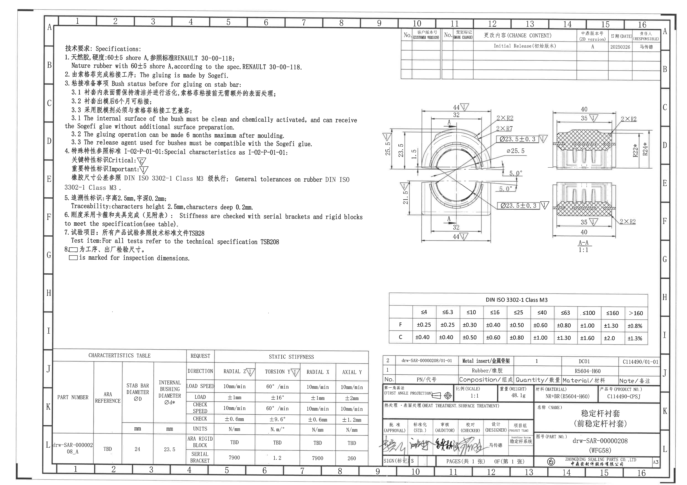
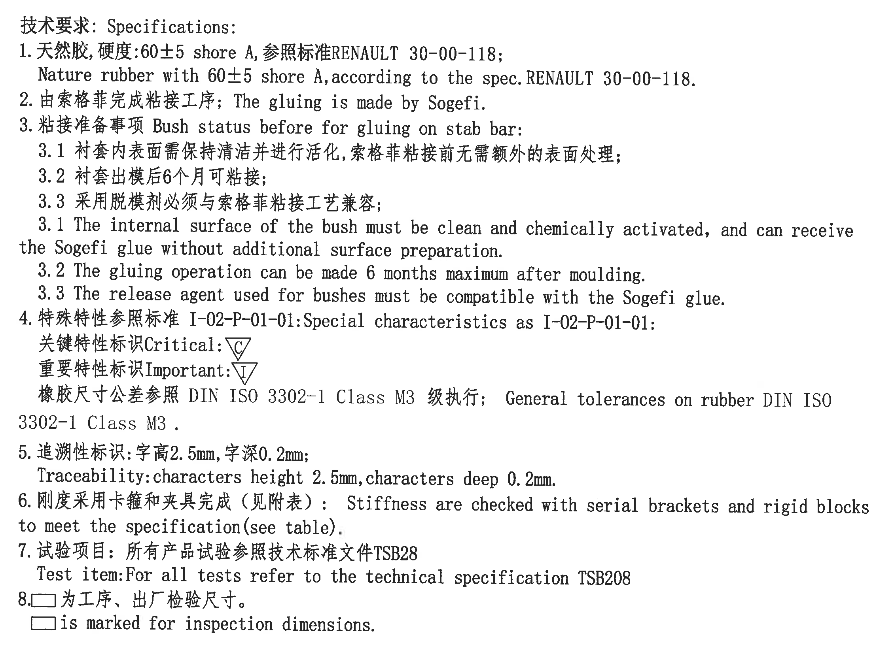
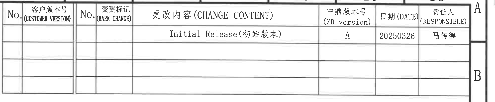
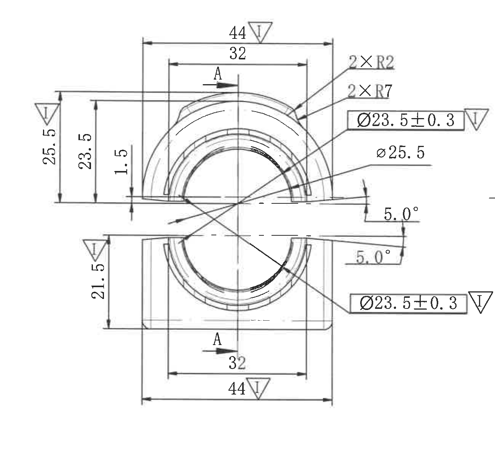
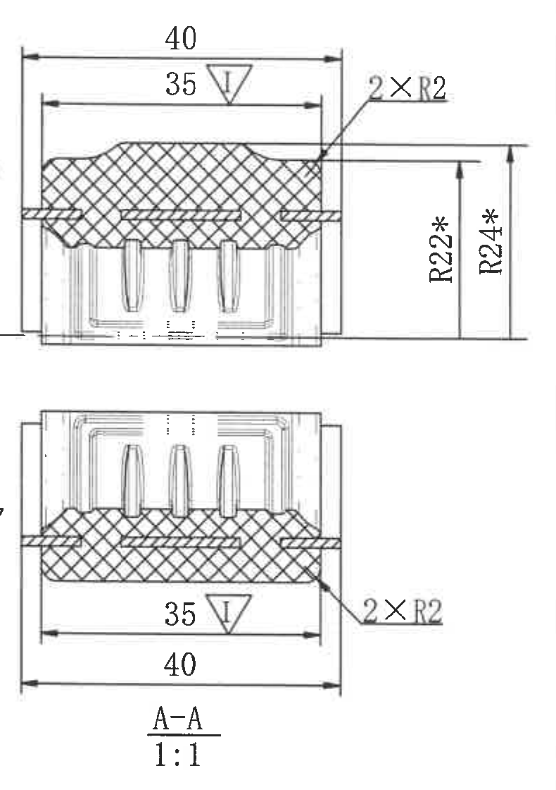
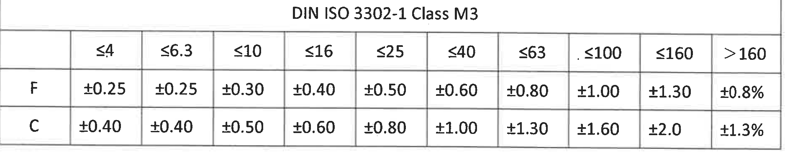
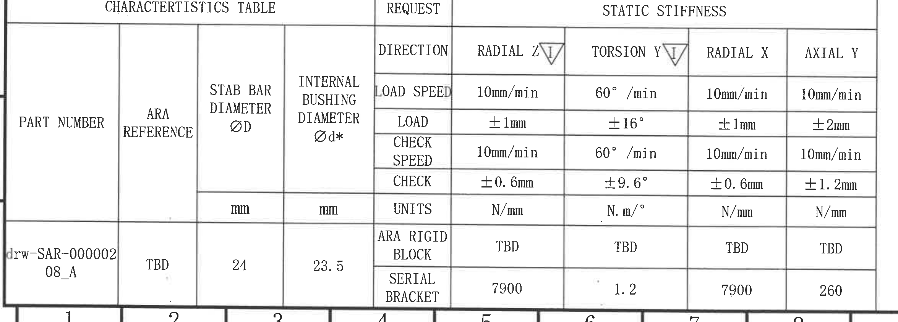
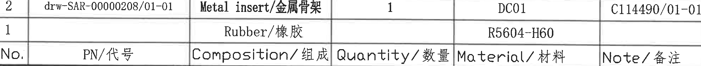
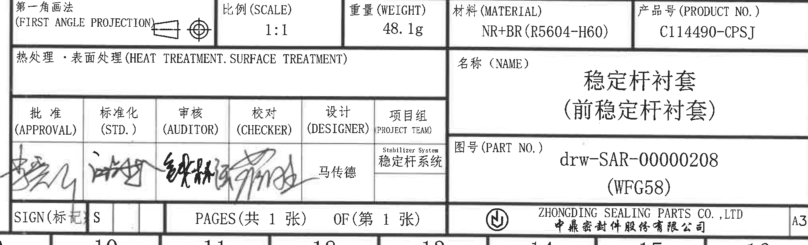

# 20C114490 PDF 内容识别

## 整页渲染

| 项目 | 内容 |
|---|---|
| PDF | input/20C114490.pdf |
| 页数 | 1 |
| 整页 PNG | outputs/20C114490_assets/images/page_1.png |
| 整页尺寸 | 4959 x 3505 px |
| 坐标说明 | bbox 为整页 PNG 像素坐标 `[x0, y0, x1, y1]`。 |

## object_1 - NOTES / 技术要求

| 项目 | 内容 |
|---|---|
| 原图位置/视图名称 | 左上 NOTES / 技术要求区域 |
| object_kind | notes |
| bbox | [420, 285, 2680, 1945] |

| 提取项 | 原图数值或文本 | 含义说明 |
|---|---|---|
| 标题 | 技术要求: Specifications: | 图纸通用技术要求。 |
| 1 | 天然胶, 硬度:60±5 shore A, 参照标准RENAULT 30-00-118; | 零件橡胶材料硬度要求，硬度公差为 60±5 Shore A，参考 RENAULT 30-00-118。 |
| 1 英文 | Nature rubber with 60±5 shore A, according to the spec.RENAULT 30-00-118. | 与中文第 1 条对应。 |
| 2 | 由索格菲完成粘接工序; The gluing is made by Sogefi. | 粘接工序由 Sogefi 完成。 |
| 3 | 粘接准备事项 Bush status before for gluing on stab bar: | 稳定杆粘接前衬套状态要求。 |
| 3.1 中文 | 衬套内表面需保持清洁并进行活化, 索格菲粘接前无需额外的表面处理; | 内表面需清洁、化学活化，Sogefi 粘接前不需额外表面处理。 |
| 3.2 中文 | 衬套出模后6个月可粘接; | 出模后最长 6 个月内可进行粘接。 |
| 3.3 中文 | 采用脱模剂必须与索格菲粘接工艺兼容; | 脱模剂需与 Sogefi 粘接工艺兼容。 |
| 3.1 英文 | The internal surface of the bush must be clean and chemically activated, and can receive the Sogefi glue without additional surface preparation. | 与中文 3.1 对应。 |
| 3.2 英文 | The gluing operation can be made 6 months maximum after moulding. | 与中文 3.2 对应。 |
| 3.3 英文 | The release agent used for bushes must be compatible with the Sogefi glue. | 与中文 3.3 对应。 |
| 4 | 特殊特性参照标准 I-02-P-01-01: Special characteristics as I-02-P-01-01: | 特殊特性标识按 I-02-P-01-01。 |
| 关键特性标识 | Critical: △C | 原图以三角形内 C 表示关键特性。 |
| 重要特性标识 | Important: △I | 原图以三角形内 I 表示重要特性；主视图、剖面视图和刚度表中多处出现。 |
| 橡胶尺寸公差 | 橡胶尺寸公差参照 DIN ISO 3302-1 Class M3 级执行; General tolerances on rubber DIN ISO 3302-1 Class M3. | 橡胶尺寸采用 DIN ISO 3302-1 Class M3 公差，详见 object_5。 |
| 5 | 追溯性标识:字高2.5mm,字深0.2mm; | 追溯字符尺寸要求。 |
| 5 英文 | Traceability:characters height 2.5mm,characters deep 0.2mm. | 与中文第 5 条对应。 |
| 6 | 刚度采用卡箍和夹具完成（见附表）: Stiffness are checked with serial brackets and rigid blocks to meet the specification(see table). | 刚度按附表条件，用卡箍和刚性块检查。 |
| 7 中文 | 试验项目: 所有产品试验参照技术标准文件TSB28 | 产品试验参考技术标准文件；英文行给出 TSB208。 |
| 7 英文 | Test item:For all tests refer to the technical specification TSB208 | 与中文第 7 条对应，原图英文为 TSB208。 |
| 8 中文 | □为工序、出厂检验尺寸。 | 空方框标识用于工序/出厂检验尺寸。 |
| 8 英文 | □ is marked for inspection dimensions. | 与中文第 8 条对应。 |

边界归属说明：该裁切只包含左上 NOTES 文字区域；右侧主视图尺寸线和图形未纳入该对象，NOTES 中只提取技术要求、标识说明和通用公差说明。

## object_2 - 修订履历表

| 项目 | 内容 |
|---|---|
| 原图位置/视图名称 | 右上修订履历表 |
| object_kind | table |
| bbox | [2885, 195, 4870, 605] |

原表还原：

| No. | 客户版本号 (CUSTOMER VERSION) | No. | 变更标记 (MARK CHANGE) | 更改内容 (CHANGE CONTENT) | 中鼎版本号 (ZD version) | 日期 (DATE) | 责任人 (RESPONSIBLE) |
|---|---|---|---|---|---|---|---|
|  |  |  |  | Initial Release(初始版本) | A | 20250326 | 马传德 |

| 提取项 | 原图数值或文本 | 含义说明 |
|---|---|---|
| 更改内容 | Initial Release(初始版本) | 初始发布记录。 |
| 中鼎版本号 | A | 图纸中鼎版本为 A。 |
| 日期 | 20250326 | 修订记录日期。 |
| 责任人 | 马传德 | 本次记录责任人。 |
| 空白行 | 表格下方多行空白 | 原图保留后续修订记录空行，无新增记录。 |

边界归属说明：右侧边框旁可见图框坐标字母 A/B，不属于修订履历表字段；表内只提取表格行列和唯一修订记录。

## object_3 - 主加工视图

| 项目 | 内容 |
|---|---|
| 原图位置/视图名称 | 中右主加工视图 |
| object_kind | view |
| bbox | [2670, 690, 3970, 1890] |

| 提取项 | 原图数值或文本 | 含义说明 |
|---|---|---|
| 上部总宽 | 44 △I | 上半部外侧水平宽度；带重要特性标识 △I。 |
| 上部内宽 | 32 | 上半部内侧水平距离。 |
| 下部总宽 | 44 △I | 下半部外侧水平宽度；带重要特性标识 △I。 |
| 下部内宽 | 32 | 下半部内侧水平距离。 |
| 左侧上部高度 | 25.5 △I | 上半部外形到分界基线的高度；带重要特性标识 △I。 |
| 左侧上部内高 | 23.5 | 上半部内侧高度尺寸。 |
| 中间台阶/间隙 | 1.5 | 上半部底部附近的垂向小尺寸。 |
| 左侧下部高度 | 21.5 △I | 下半部外形到分界基线的高度；带重要特性标识 △I。 |
| 圆角 | 2×R2 | 两处 R2 圆角，标注在上半部右上侧。 |
| 弧度/半径 | 2×R7 | 两处 R7 圆弧/半径，标注在上半部右侧弧面。 |
| 内孔关键直径，上半部 | Ø23.5±0.3 △I | 带方框的直径尺寸及公差，箭头指向上半部内圆弧；带重要特性标识 △I。 |
| 内孔关键直径，下半部 | Ø23.5±0.3 △I | 同一关键直径和公差重复标注在下半部内圆弧；带重要特性标识 △I。 |
| 参考/关联直径 | Ø25.5 | 指向主视图内侧圆弧的直径标注，未带公差框。 |
| 角度，上开口 | 5.0° | 右侧上方斜线开口角度。 |
| 角度，下开口 | 5.0° | 右侧下方斜线开口角度。 |
| 剖切位置 | A / A | 两处 A 剖切箭头，指向 A-A 剖面视图的位置和方向。 |
| 基准字母 | 未见独立基准字母 | 原图中的 A 为剖切标识，不是 GD&T datum 基准框。 |
| T 编号 | 未见 | 主视图中未见 T 编号。 |
| 括号参考尺寸 | 未见 | 主视图未见括号内参考尺寸；所有可见尺寸均已逐项列出。 |
| 总高度 | 未见单一总高度标注 | 原图未给出一个整体总高度尺寸；只给出 25.5、23.5、1.5、21.5 等局部垂向尺寸。 |

边界归属说明：右边界为完整保留两个 `Ø23.5±0.3 △I` 关键尺寸框和三角标识而外扩，右侧极少量相邻 A-A 剖面外缘线不作为主视图提取内容；所有列出的尺寸均依据主视图内完整尺寸线、箭头和文字归属。

## object_4 - A-A 剖面视图

| 项目 | 内容 |
|---|---|
| 原图位置/视图名称 | 主视图右侧 A-A 剖面视图 |
| object_kind | section |
| bbox | [3960, 735, 4750, 1855] |

| 提取项 | 原图数值或文本 | 含义说明 |
|---|---|---|
| 视图名称 | A-A | 对应主视图中的 A-A 剖切位置。 |
| 比例 | 1:1 | 剖面视图比例。 |
| 上部外宽 | 40 | 上方剖面外侧水平宽度。 |
| 上部内宽 | 35 △I | 上方剖面内侧水平宽度；带重要特性标识 △I。 |
| 下部外宽 | 40 | 下方剖面外侧水平宽度。 |
| 下部内宽 | 35 △I | 下方剖面内侧水平宽度；带重要特性标识 △I。 |
| 圆角，上部 | 2×R2 | 上方剖面右侧两处 R2 圆角。 |
| 圆角，下部 | 2×R2 | 下方剖面右侧两处 R2 圆角。 |
| 星号半径 | R22* | 右侧垂向半径尺寸，带星号，按原图视为需特别关注的半径尺寸。 |
| 星号半径 | R24* | 右侧垂向半径尺寸，带星号，按原图视为需特别关注的半径尺寸。 |
| 剖面线 | 交叉剖面线 | 表示被剖切材料区域。 |
| 基准字母 | 未见独立基准字母 | A-A 是剖面名称，不是独立基准框。 |
| T 编号 | 未见 | 剖面视图中未见 T 编号。 |
| 括号参考尺寸 | 未见 | 剖面视图未见括号内参考尺寸。 |

边界归属说明：左侧边缘保留 A-A 自身 40/35 尺寸线端点，因此可见一小段主视图三角标识残边；该残边不属于 A-A 剖面提取内容。A-A 提取仅包含剖面图中的 40、35、2×R2、R22*、R24*、A-A、1:1。

## object_5 - DIN ISO 3302-1 Class M3 公差表

| 项目 | 内容 |
|---|---|
| 原图位置/视图名称 | 中下 DIN ISO 3302-1 Class M3 公差表 |
| object_kind | table |
| bbox | [2810, 2135, 4710, 2515] |

原表还原：

|  | ≤4 | ≤6.3 | ≤10 | ≤16 | ≤25 | ≤40 | ≤63 | ≤100 | ≤160 | >160 |
|---|---|---|---|---|---|---|---|---|---|---|
| F | ±0.25 | ±0.25 | ±0.30 | ±0.40 | ±0.50 | ±0.60 | ±0.80 | ±1.00 | ±1.30 | ±0.8% |
| C | ±0.40 | ±0.40 | ±0.50 | ±0.60 | ±0.80 | ±1.00 | ±1.30 | ±1.60 | ±2.0 | ±1.3% |

| 提取项 | 原图数值或文本 | 含义说明 |
|---|---|---|
| 表标题 | DIN ISO 3302-1 Class M3 | 橡胶尺寸通用公差等级，与 NOTES 第 4 条对应。 |
| F 行 | ±0.25 至 ±1.30、>160 为 ±0.8% | F 级公差随尺寸范围变化。 |
| C 行 | ±0.40 至 ±2.0、>160 为 ±1.3% | C 级公差随尺寸范围变化。 |

边界归属说明：该裁切只包含 DIN ISO 3302-1 Class M3 表格；上下左右边界均完整包含表头、行名和所有公差单元格。

## object_6 - CHARACTERISTICS TABLE / STATIC STIFFNESS

| 项目 | 内容 |
|---|---|
| 原图位置/视图名称 | 左下 CHARACTERISTICS TABLE / STATIC STIFFNESS |
| object_kind | table |
| bbox | [365, 2550, 2715, 3395] |

原表还原：

| PART NUMBER | ARA REFERENCE | STAB BAR DIAMETER ØD | INTERNAL BUSHING DIAMETER Ød* | REQUEST | RADIAL Z △I | TORSION Y △I | RADIAL X | AXIAL Y |
|---|---|---|---|---|---|---|---|---|
|  |  |  |  | LOAD SPEED | 10mm/min | 60°/min | 10mm/min | 10mm/min |
|  |  |  |  | LOAD | ±1mm | ±16° | ±1mm | ±2mm |
|  |  |  |  | CHECK SPEED | 10mm/min | 60°/min | 10mm/min | 10mm/min |
|  |  |  |  | CHECK | ±0.6mm | ±9.6° | ±0.6mm | ±1.2mm |
|  |  | mm | mm | UNITS | N/mm | N.m/° | N/mm | N/mm |
| drw-SAR-00000208_A | TBD | 24 | 23.5 | ARA RIGID BLOCK | TBD | TBD | TBD | TBD |
| drw-SAR-00000208_A | TBD | 24 | 23.5 | SERIAL BRACKET | 7900 | 1.2 | 7900 | 260 |

| 提取项 | 原图数值或文本 | 含义说明 |
|---|---|---|
| 表标题 | CHARACTERISTICS TABLE / REQUEST / STATIC STIFFNESS | 刚度特性要求表。 |
| PART NUMBER | drw-SAR-00000208_A | 特性表对应零件号。 |
| ARA REFERENCE | TBD | ARA 参考值待定。 |
| STAB BAR DIAMETER ØD | 24 mm | 稳定杆直径。 |
| INTERNAL BUSHING DIAMETER Ød* | 23.5 mm | 衬套内径，带星号，需特别关注。 |
| RADIAL Z | △I | 径向 Z 刚度方向带重要特性标识。 |
| TORSION Y | △I | 扭转 Y 刚度方向带重要特性标识。 |
| RADIAL X | RADIAL X | 径向 X 刚度方向。 |
| AXIAL Y | AXIAL Y | 轴向 Y 刚度方向。 |
| LOAD SPEED | RADIAL Z 10mm/min; TORSION Y 60°/min; RADIAL X 10mm/min; AXIAL Y 10mm/min | 加载速度条件。 |
| LOAD | RADIAL Z ±1mm; TORSION Y ±16°; RADIAL X ±1mm; AXIAL Y ±2mm | 加载位移/角度条件。 |
| CHECK SPEED | RADIAL Z 10mm/min; TORSION Y 60°/min; RADIAL X 10mm/min; AXIAL Y 10mm/min | 检查速度条件。 |
| CHECK | RADIAL Z ±0.6mm; TORSION Y ±9.6°; RADIAL X ±0.6mm; AXIAL Y ±1.2mm | 检查位移/角度条件。 |
| UNITS | N/mm; N.m/°; N/mm; N/mm | 刚度单位。 |
| ARA RIGID BLOCK | TBD / TBD / TBD / TBD | 刚性块要求待定。 |
| SERIAL BRACKET | 7900 / 1.2 / 7900 / 260 | 串联卡箍对应刚度结果或要求值。 |

边界归属说明：该裁切只提取左下特性表。底部图框坐标数字轻微进入裁切下缘，不属于特性表字段；表格主体、行列、单位和数值完整。

## object_7 - BOM / 物料组成表

| 项目 | 内容 |
|---|---|
| 原图位置/视图名称 | 右下物料组成表，位于标题栏上方 |
| object_kind | table |
| bbox | [2775, 2588, 4750, 2776] |

原表还原：

| No. | PN/代号 | Composition/组成 | Quantity/数量 | Material/材料 | Note/备注 |
|---|---|---|---|---|---|
| 2 | drw-SAR-00000208/01-01 | Metal insert/金属骨架 | 1 | DC01 | C114490/01-01 |
| 1 |  | Rubber/橡胶 |  | R5604-H60 |  |

| 提取项 | 原图数值或文本 | 含义说明 |
|---|---|---|
| 表头 | No.; PN/代号; Composition/组成; Quantity/数量; Material/材料; Note/备注 | BOM 行列字段。 |
| 物料 2 | drw-SAR-00000208/01-01; Metal insert/金属骨架; 1; DC01; C114490/01-01 | 金属骨架物料记录。 |
| 物料 1 | Rubber/橡胶; R5604-H60 | 橡胶物料记录，PN、数量、备注单元格为空。 |

边界归属说明：该裁切只包含 BOM 两条物料行及表头；下方标题栏的比例、重量、材料、产品号字段不归入 BOM，已在 object_8 单独提取。

## object_8 - 标题栏

| 项目 | 内容 |
|---|---|
| 原图位置/视图名称 | 右下标题栏 |
| object_kind | title_block |
| bbox | [2735, 2785, 4755, 3400] |

| 提取项 | 原图数值或文本 | 含义说明 |
|---|---|---|
| 第一角画法 | 第一角画法 (FIRST ANGLE PROJECTION) | 投影视角方法，旁有第一角投影符号。 |
| 比例 | 1:1 | 图纸比例。 |
| 重量 | 48.1g | 零件重量。 |
| 材料 | NR+BR(R5604-H60) | 标题栏材料字段；括号内为材料牌号/规格。 |
| 产品号 | C114490-CPSJ | 产品编号。 |
| 热处理/表面处理 | 热处理・表面处理 (HEAT TREATMENT.SURFACE TREATMENT) | 字段存在，内容区未见填写值。 |
| 名称 | 稳定杆衬套 (前稳定杆衬套) | 零件名称；括号内为前稳定杆衬套说明。 |
| 图号 | drw-SAR-00000208 (WFG58) | 图纸/零件号；括号内为 WFG58。 |
| APPROVAL | 签名 | 批准签名格。 |
| STD. | 签名 | 标准化签名格。 |
| AUDITOR | 签名 | 审核签名格。 |
| CHECKER | 签名 | 校对签名格。 |
| DESIGNER | 马传德 | 设计人员。 |
| PROJECT TEAM | Stabilizer System / 稳定杆系统 | 项目组。 |
| SIGN(标记) | S | 标记字段。 |
| PAGES | PAGES(共 1 张) OF(第 1 张) | 共 1 张，第 1 张。 |
| 公司 | ZHONGDING SEALING PARTS CO., LTD / 中鼎密封件股份有限公司 | 出图公司。 |
| 图幅 | A3 | 图幅规格。 |

边界归属说明：标题栏与上方 BOM 共用水平边线。该裁切从标题栏顶部字段开始，包含比例、重量、材料、产品号、名称、图号、签名、页码、公司和 A3；BOM 的物料记录不在本对象提取。

## 裁切检查记录

| 图片 | bbox | 检查结论 | 归属处理 |
|---|---|---|---|
| page_1.png | [0, 0, 4959, 3505] | 整页渲染完整，方向为图纸正向阅读。 | 作为所有裁切的坐标基准。 |
| object_1.png | [420, 285, 2680, 1945] | NOTES 文字完整，无边缘文字被裁掉。 | 右侧主视图未纳入提取。 |
| object_2.png | [2885, 195, 4870, 605] | 修订表表头和记录完整。 | 右侧图框坐标字母 A/B 不作为表格字段。 |
| object_3.png | [2670, 690, 3970, 1890] | 主视图所有尺寸线、箭头、文字和两个 `Ø23.5±0.3 △I` 框选标注完整。 | 右侧少量相邻剖面外缘线不提取；尺寸按主视图尺寸线归属。 |
| object_4.png | [3960, 735, 4750, 1855] | A-A 剖面尺寸线、文字、R22*、R24*、A-A 和 1:1 完整。 | 左缘保留尺寸线端点导致主视图符号残边进入，已排除不提取。 |
| object_5.png | [2810, 2135, 4710, 2515] | 公差表表头、F/C 行和所有单元格完整。 | 不含其他视图。 |
| object_6.png | [365, 2550, 2715, 3395] | 特性表主体、行列、单位和数值完整；零件号可完整读取。 | 下缘图框坐标数字不作为表格字段。 |
| object_7.png | [2775, 2588, 4750, 2776] | BOM 两条物料记录和表头完整。 | 下方标题栏字段已单独裁切，不并入 BOM。 |
| object_8.png | [2735, 2785, 4755, 3400] | 标题栏顶部字段、名称、图号、签名区、页码、公司和 A3 完整。 | 与 BOM 共用边线，BOM 记录不归入标题栏。 |
