# 20C114502 内容识别与裁切提取

## 识别说明
- PDF 已先渲染为整页 PNG：`outputs/20C114502_assets/images/page_1.png`，整页尺寸 4959 x 3505 px。
- 本文件按原图对象位置还原：顶部表格、主视图、剖面视图、局部视图、表1/表2/表3、技术要求、零部件明细表、标题栏。
- 图纸为扫描图像，无可复制文字层；个别顶部淡化小表表头无法可靠识别，已在对应对象中标注，不做主观补字。
- 图中椭圆框尺寸按技术要求第10条解释为“工序、出厂检验尺寸”。本图未见星号关键尺寸、T编号或直径符号。

## object_11：顶部左侧淡化小表

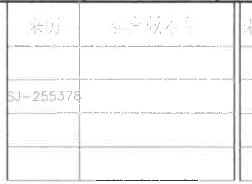

**原图位置/视图名称**：page 1 上方，修订履历表左侧；bbox `[2700, 170, 505, 370]`。

**原表还原**

| 左列表头 | 右列表头 |
|---|---|
| 未能可靠识别 | 未能可靠识别 |
| SJ-255378 | 未能可靠识别 |
| 未能可靠识别 | 未能可靠识别 |
| 未能可靠识别 | 未能可靠识别 |

| 提取项 | 原图数值或文本 | 含义说明 |
|---|---|---|
| 表格性质 | 顶部淡化小表 | 位于修订履历左侧，与修订履历不是同一表格对象。 |
| 可辨文本 | SJ-255378 | 左下单元格可辨识文本。 |
| 不可靠文本 | 未能可靠识别 | 表头和多数单元格扫描过淡，未作主观补字。 |

**边界归属说明**：右侧与修订履历共用相邻边框，裁切已收紧到不包含修订履历中的数字；本对象不提取修订履历内容。

## object_4：修订履历表

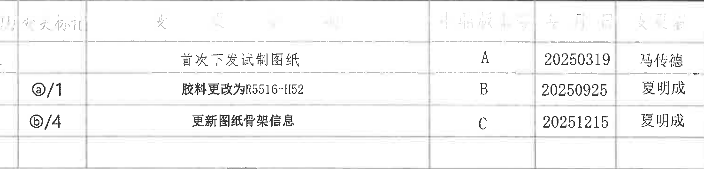

**原图位置/视图名称**：page 1 上方右侧；bbox `[3220, 175, 1500, 360]`。

**原表还原**

| 序号 | 变更标记 | 变更内容 | 版本 | 日期 | 更改者 |
|---|---|---|---|---|---|
| 1 |  | 首次下发试制图纸 | A | 20250319 | 冯传德 |
|  | ⓐ/1 | 胶料更改为R5516-H52 | B | 20250925 | 夏明成 |
|  | ⓑ/4 | 更新图纸骨架信息 | C | 20251215 | 夏明成 |

| 提取项 | 原图数值或文本 | 含义说明 |
|---|---|---|
| 表头 | 序号、变更标记、变更内容、版本、日期、更改者 | 原图表头较淡，按可辨识列义还原；未见独立 ECN NO 列。 |
| A版记录 | 首次下发试制图纸 / A / 20250319 / 冯传德 | 首次试制图纸下发记录。 |
| B版记录 | ⓐ/1 / 胶料更改为R5516-H52 / B / 20250925 / 夏明成 | 胶料从原状态变更为 R5516-H52，对应变更标记 ⓐ/1。 |
| C版记录 | ⓑ/4 / 更新图纸骨架信息 / C / 20251215 / 夏明成 | 更新骨架信息，对应变更标记 ⓑ/4。 |

**边界归属说明**：左侧淡化小表归 object_11；本对象只提取修订履历表中的行列数据。

## object_1：主视图/正视加工视图

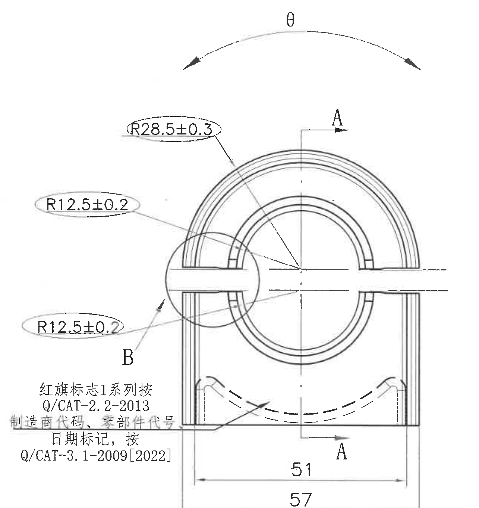

**原图位置/视图名称**：page 1 左中部主视图；bbox `[450, 405, 1285, 1360]`。

| 提取项 | 原图数值或文本 | 含义说明 |
|---|---|---|
| 弧向/扭转方向 | θ | 主视图上方弧形箭头，表示扭转或弧向方向，与表1中的 θ(扭转)方向有关。 |
| 外圆弧半径 | R28.5±0.3 | 外侧上部大圆弧半径，带 ±0.3 公差。 |
| 左上局部圆弧半径 | R12.5±0.2 | 左侧上部局部圆弧半径，带 ±0.2 公差。 |
| 左下局部圆弧半径 | R12.5±0.2 | 左侧下部局部圆弧半径，带 ±0.2 公差。 |
| 底部宽度 | 51 | 主视图底部内侧宽度尺寸。 |
| 总宽 | 57 | 主视图底部外侧总宽尺寸。 |
| 剖切标识 | A / A | 上下 A 箭头指示 A-A 剖面位置，对应 object_2。 |
| 局部标识 | B | 圆形局部区域对应 B 局部放大视图 object_3。 |
| 标识说明 | 红旗标志1系列按 Q/CAT-2.2-2013 | 主视图左下方标识规则说明。 |
| 标识说明 | 制造商代码、零部件代号、日期标记，按 Q/CAT-3.1-2009[2022] | 主视图左下方代码和日期标记规则说明。 |
| 直径/数量/T编号/星号关键尺寸 | 未见 | 本主视图内未发现直径符号、数量前缀、T编号或星号关键尺寸。 |

**边界归属说明**：右侧 A-A 剖面的 Z 方向尺寸不归入主视图；底部技术要求标题不归入主视图。B 圆形区域仅作为局部索引，B 内详细尺寸归 object_3。

## object_2：A-A 剖面视图

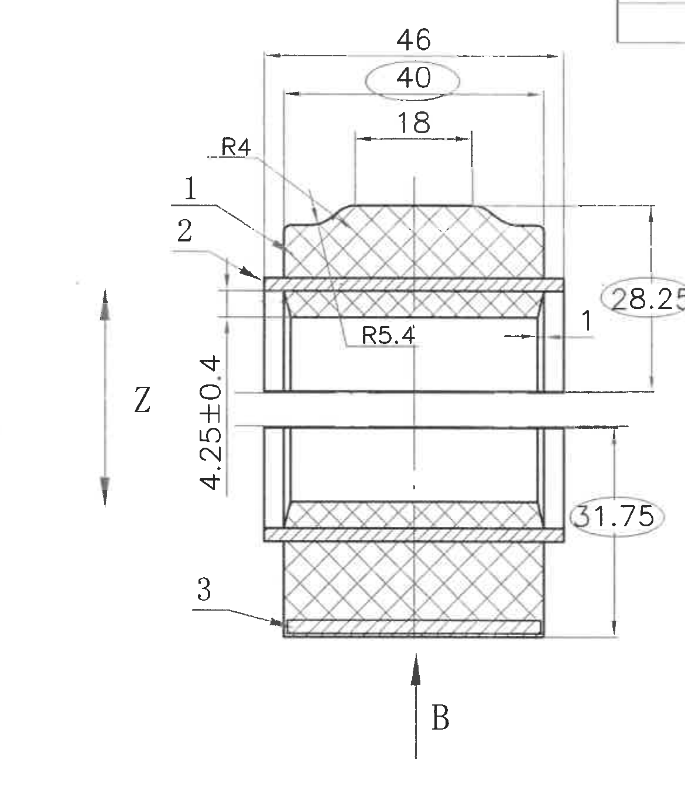

**原图位置/视图名称**：page 1 中部 A-A 剖面；bbox `[1660, 460, 1170, 1360]`。

| 提取项 | 原图数值或文本 | 含义说明 |
|---|---|---|
| 顶部外宽 | 46 | A-A 剖面上方外侧宽度尺寸。 |
| 工序/出厂检验尺寸 | 40（椭圆框） | 椭圆框尺寸，按技术要求第10条为工序、出厂检验尺寸。 |
| 顶部凸台宽 | 18 | 上部凸台或平直段宽度尺寸。 |
| 圆角半径 | R4 | 上部过渡圆角半径。 |
| 内侧圆弧半径 | R5.4 | 剖面内侧圆弧半径。 |
| 竖向尺寸 | 4.25±0.4 | 左侧竖向厚度/高度尺寸，带 ±0.4 公差。 |
| 工序/出厂检验尺寸 | 28.25（椭圆框） | 右侧竖向检验尺寸，椭圆框含义同技术要求第10条。 |
| 工序/出厂检验尺寸 | 31.75（椭圆框） | 右侧竖向检验尺寸，椭圆框含义同技术要求第10条。 |
| 零件/层号标注 | 1、2、3 | 与剖面中不同材料/层次对应；可与明细表中橡胶体、塑料骨架、塑料底座对应理解。 |
| 方向标识 | Z | 剖面左侧方向箭头。 |
| 局部/方向标识 | B | 剖面下方 B 箭头，关联 B 局部位置。 |
| 直径/数量/T编号/星号关键尺寸 | 未见 | 本剖面内未发现直径符号、数量前缀、T编号或星号关键尺寸。 |

**边界归属说明**：为完整包含 28.25 和 31.75 的尺寸线与文字，右边界接近 B 局部视图；右缘相邻的 0.5/2.05 属于 object_3，不作为 A-A 提取项。上右角相邻小表边线不作为 A-A 内容。

## object_3：B 局部放大视图 2:1

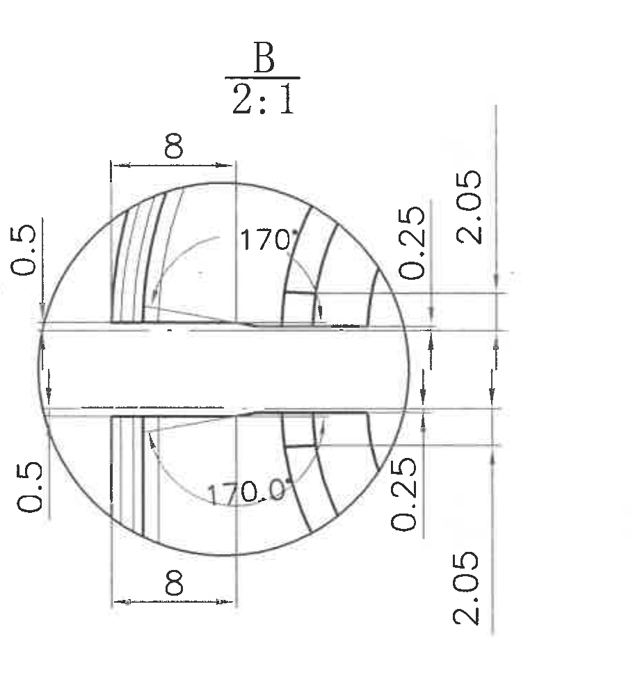

**原图位置/视图名称**：page 1 中右部 B 局部放大视图；bbox `[2850, 555, 910, 980]`。

| 提取项 | 原图数值或文本 | 含义说明 |
|---|---|---|
| 视图比例 | B / 2:1 | B 局部放大图，比例为 2:1。 |
| 上部水平尺寸 | 8 | 上部局部结构宽度。 |
| 下部水平尺寸 | 8 | 下部局部结构宽度。 |
| 左上竖向尺寸 | 0.5 | 左侧上部间隙/厚度尺寸。 |
| 左下竖向尺寸 | 0.5 | 左侧下部间隙/厚度尺寸。 |
| 右上局部尺寸 | 0.25 | 右侧上部局部厚度/间隙尺寸。 |
| 右下局部尺寸 | 0.25 | 右侧下部局部厚度/间隙尺寸。 |
| 右上总高/间距 | 2.05 | 右侧上部整体间距尺寸。 |
| 右下总高/间距 | 2.05 | 右侧下部整体间距尺寸。 |
| 上部角度 | 170° | 上半部斜面/弧段角度。 |
| 下部角度 | 170.0° | 下半部斜面/弧段角度。 |
| 直径/数量/T编号/星号关键尺寸 | 未见 | 本局部视图内未发现直径符号、数量前缀、T编号或星号关键尺寸。 |

**边界归属说明**：A-A 剖面右侧的 28.25/31.75 已排除，不归入 B 局部图；本对象只提取 B 圆形局部及其直接尺寸线。

## object_5：表3 公差标准

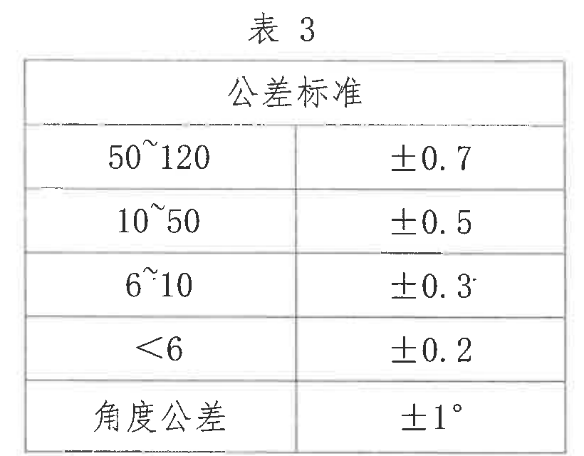

**原图位置/视图名称**：page 1 右上部，表3；bbox `[3815, 555, 820, 640]`。

**原表还原**

| 尺寸范围 | 公差标准 |
|---|---|
| 50~120 | ±0.7 |
| 10~50 | ±0.5 |
| 6~10 | ±0.3 |
| <6 | ±0.2 |
| 角度公差 | ±1° |

| 提取项 | 原图数值或文本 | 含义说明 |
|---|---|---|
| 线性尺寸公差 | 50~120：±0.7；10~50：±0.5；6~10：±0.3；<6：±0.2 | 对未注线性尺寸的默认公差规定。 |
| 角度公差 | ±1° | 对未注角度尺寸的默认公差规定。 |

**边界归属说明**：表3下方的表2不归入本对象；本裁切只还原表3边框内内容。

## object_6：表2 噪音试验条件

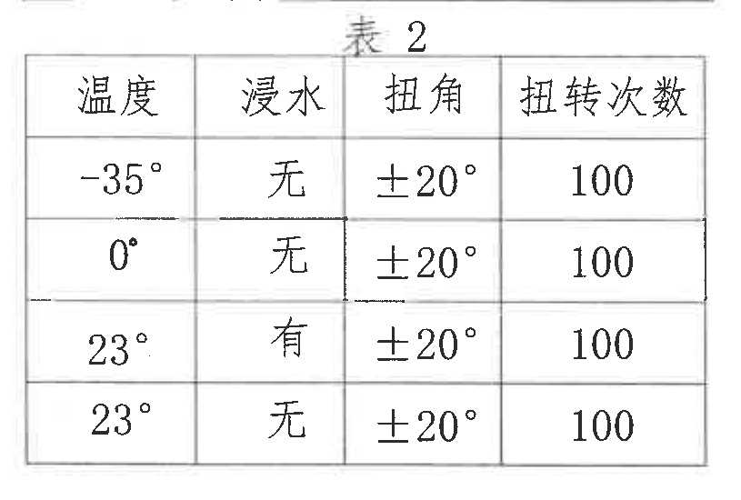

**原图位置/视图名称**：page 1 右上偏下，表2；bbox `[3825, 1190, 815, 550]`。

**原表还原**

| 温度 | 浸水 | 扭角 | 扭转次数 |
|---|---|---|---|
| -35° | 无 | ±20° | 100 |
| 0° | 无 | ±20° | 100 |
| 23° | 有 | ±20° | 100 |
| 23° | 无 | ±20° | 100 |

| 提取项 | 原图数值或文本 | 含义说明 |
|---|---|---|
| 噪音试验环境 | -35°/0°/23° | 技术要求第4条引用本表作为噪音试验条件。 |
| 浸水状态 | 无、无、有、无 | 表示对应温度条件下是否浸水。 |
| 扭角 | ±20° | 每组条件的扭转角度。 |
| 扭转次数 | 100 | 每组条件的扭转次数。 |

**边界归属说明**：顶部可见表3下边缘残线，未作为表2内容读取；表2数据从“表2”和表头“温度/浸水/扭角/扭转次数”开始。

## object_7：表1 刚度试验

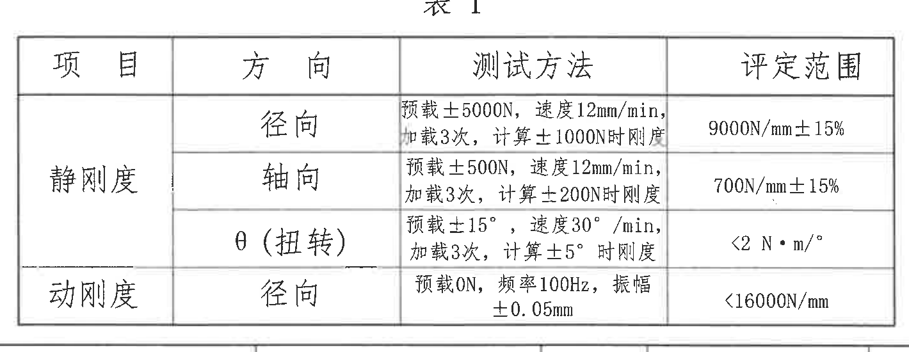

**原图位置/视图名称**：page 1 右下中部，表1；bbox `[2985, 1810, 1420, 550]`。

**原表还原**

| 项目 | 方向 | 测试方法 | 评定范围 |
|---|---|---|---|
| 静刚度 | 径向 | 预载±5000N，速度12mm/min，加载3次，计算±1000N时刚度 | 9000N/mm±15% |
| 静刚度 | 轴向 | 预载±500N，速度12mm/min，加载3次，计算±200N时刚度 | 700N/mm±15% |
| 静刚度 | θ（扭转） | 预载±15°，速度30°/min，加载3次，计算±5°时刚度 | <2 N·m/° |
| 动刚度 | 径向 | 预载0N，频率100Hz，振幅±0.05mm | <16000N/mm |

| 提取项 | 原图数值或文本 | 含义说明 |
|---|---|---|
| 静刚度径向 | 9000N/mm±15% | 径向静刚度评定范围。 |
| 静刚度轴向 | 700N/mm±15% | 轴向静刚度评定范围。 |
| 静刚度 θ（扭转） | <2 N·m/° | 扭转静刚度上限。 |
| 动刚度径向 | <16000N/mm | 径向动刚度上限。 |

**边界归属说明**：表1底部边框下方为零部件明细表区域，不归入表1；本对象只提取表1行列。

## object_8：技术要求 / NOTES

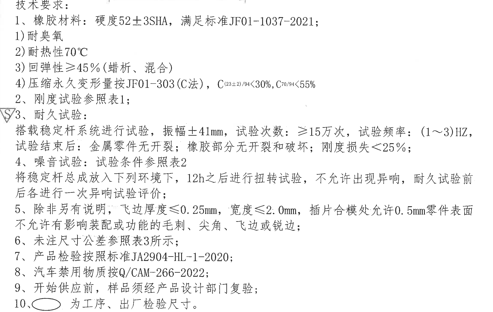

**原图位置/视图名称**：page 1 左下部技术要求；bbox `[430, 1775, 2300, 1460]`。

| 提取项 | 原图数值或文本 | 含义说明 |
|---|---|---|
| 1 橡胶材料 | 硬度52±3SHA，满足标准JF01-1037-2021 | 规定橡胶材料硬度和执行标准。 |
| 1-1 | 耐臭氧 | 材料性能要求。 |
| 1-2 | 耐热性70℃ | 材料耐热要求。 |
| 1-3 | 回弹性≥45%（蜡析、混合） | 材料回弹性能要求。 |
| 1-4 | 压缩永久变形量按JF01-303(C法)，C(23±2)/94<30%，C70/94<55% | 压缩永久变形试验方法和限值。 |
| 2 | 刚度试验参照表1 | 刚度试验条件归 object_7。 |
| 3 | 耐久试验：搭载稳定杆系统进行试验，振幅±41mm，试验次数≥15万次，试验频率(1~3)HZ | 耐久试验工况。 |
| 3 试验结束后 | 金属零件无开裂；橡胶部分无开裂和破坏；刚度损失<25% | 耐久试验后判定标准。 |
| 4 | 噪音试验：试验条件参照表2 | 噪音试验条件归 object_6。 |
| 4 环境放置 | 将稳定杆总成放入下列环境下，12h之后进行扭转试验，不允许出现异响，耐久试验前后各进行一次异响试验评价 | 噪音评价流程。 |
| 5 | 除非另有说明，飞边厚度≤0.25mm，宽度≤2.0mm，插件合模处允许0.5mm | 外观/飞边尺寸限制。 |
| 5 表面要求 | 零件表面不允许有影响装配或功能的毛刺、尖角、飞边或锐边 | 零件表面质量要求。 |
| 6 | 未注尺寸公差参照表3所示 | 未注公差归 object_5。 |
| 7 | 产品检验按照标准JA2904-HL-1-2020 | 产品检验标准。 |
| 8 | 汽车禁用物质按Q/CAM-266-2022 | 禁用物质标准。 |
| 9 | 开始供应前，样品须经产品设计部门复验 | 供应前复验要求。 |
| 10 | 椭圆框为工序、出厂检验尺寸 | 解释主视图和剖面中椭圆框尺寸含义。 |

**边界归属说明**：裁切从“技术要求”标题开始，上方主视图 51/57 尺寸线不归入 NOTES；左侧三角 S 标识随原图保留但不作为技术条款正文。

## object_9：零部件明细表 / BOM

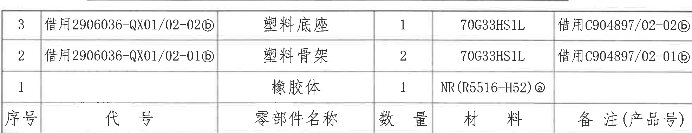

**原图位置/视图名称**：page 1 右下部标题栏上方；bbox `[2765, 2318, 1970, 380]`。

**原表还原**

| 序号 | 代号 | 零部件名称 | 数量 | 材料 | 备注（产品号） |
|---|---|---|---|---|---|
| 3 | 借用2906036-QX01/02-02ⓑ | 塑料底座 | 1 | 70G33HS1L | 借用C904897/02-02ⓑ |
| 2 | 借用2906036-QX01/02-01ⓑ | 塑料骨架 | 2 | 70G33HS1L | 借用C904897/02-01ⓑ |
| 1 |  | 橡胶体 | 1 | NR(R5516-H52)ⓐ |  |

| 提取项 | 原图数值或文本 | 含义说明 |
|---|---|---|
| 序号3 | 塑料底座 / 1 / 70G33HS1L | 底座件，代号和产品号借用，带 ⓑ 变更标记。 |
| 序号2 | 塑料骨架 / 2 / 70G33HS1L | 骨架件，数量2，代号和产品号借用，带 ⓑ 变更标记。 |
| 序号1 | 橡胶体 / 1 / NR(R5516-H52)ⓐ | 橡胶体材料，与修订履历中的 ⓐ 胶料变更对应。 |

**边界归属说明**：上方表1不归入明细表；下方标题栏归 object_10。

## object_10：标题栏

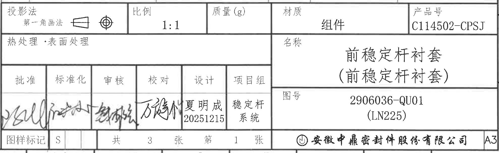

**原图位置/视图名称**：page 1 右下角标题栏；bbox `[2765, 2690, 1980, 610]`。

**标题栏字段还原**

| 字段 | 原图数值或文本 |
|---|---|
| 投影法 | 第一角画法 |
| 比例 | 1:1 |
| 质量(g) | 空白 |
| 材质 | 组件 |
| 产品号 | C114502-CPSJ |
| 热处理·表面处理 | 空白 |
| 名称 | 前稳定杆衬套（前稳定杆衬套） |
| 图号 | 2906036-QU01 (LN225) |
| 批准 | 签名 |
| 标准化 | 签名 |
| 审核 | 签名 |
| 校对 | 签名 |
| 设计 | 夏明成 / 20251215 |
| 项目组 | 稳定杆系统 |
| 图样标记 | S |
| 张数 | 共3张，第1张 |
| 公司 | 安徽中鼎密封件股份有限公司 |
| 幅面 | A3 |

| 提取项 | 原图数值或文本 | 含义说明 |
|---|---|---|
| 产品识别 | C114502-CPSJ；2906036-QU01 (LN225) | 产品号和图号/平台号。 |
| 图名 | 前稳定杆衬套（前稳定杆衬套） | 零件/组件名称。 |
| 设计信息 | 夏明成 20251215；项目组 稳定杆系统 | 设计者、日期和项目组。 |
| 图纸属性 | 第一角画法；比例1:1；A3；共3张第1张 | 标题栏基本图纸属性。 |

**边界归属说明**：裁切底边收紧到标题栏下框，未包含外框坐标数字 10~16；上方零部件明细表归 object_9。

## 裁切检查记录

| 对象 | 检查结果 | 是否完整包含尺寸线/文字 | 边界归属处理 |
|---|---|---|---|
| page_1 | 整页 PNG 已渲染，4959 x 3505 px | 是 | 全页图，不做对象归属提取。 |
| object_11 | 顶部淡化小表边框完整；文字极淡 | 可辨文字完整；多数文字不可可靠识别 | 右侧修订表数字已排除，不并入修订表。 |
| object_4 | 修订履历表行列完整 | 是 | 左侧小表归 object_11。 |
| object_1 | 主视图 R、51、57、A、B、θ 标注完整 | 是 | 未混入 A-A 的 Z 尺寸和下方技术要求。 |
| object_2 | A-A 剖面主体、46/40/18/R4/R5.4/4.25±0.4/28.25/31.75 完整 | 是 | 右缘相邻 B 局部 0.5/2.05 不提取；上右角小表边线不提取。 |
| object_3 | B 局部 8、0.5、0.25、2.05、170° 完整 | 是 | A-A 的 28.25/31.75 不归入本对象。 |
| object_5 | 表3标题、边框、行列完整 | 是 | 下方表2不归入本对象。 |
| object_6 | 表2标题、表头、四行数据完整 | 是 | 顶部残线属于表3下框，不作为表2数据。 |
| object_7 | 表1标题、表头、四行数据完整 | 是 | 下方明细表不归入本对象。 |
| object_8 | 技术要求1-10条完整 | 是 | 上方主视图尺寸不归入 NOTES。 |
| object_9 | 零部件明细表表头和三行完整 | 是 | 上方表1、下方标题栏不归入本对象。 |
| object_10 | 标题栏字段、公司名、A3完整 | 是 | 底部外框坐标数字未纳入。 |
