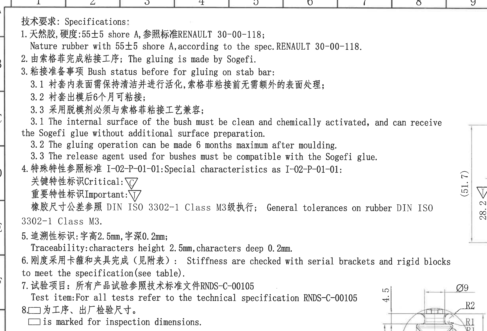
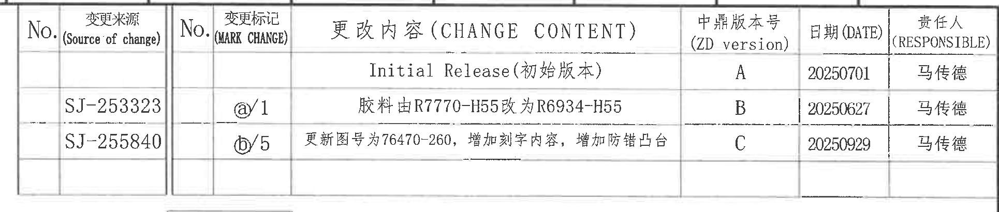
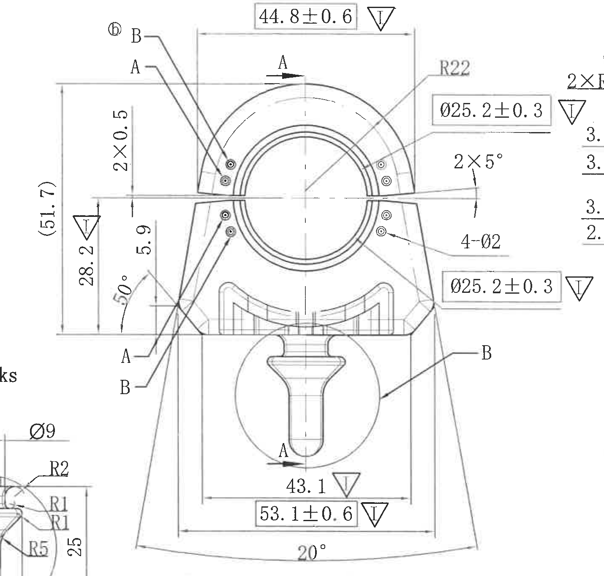
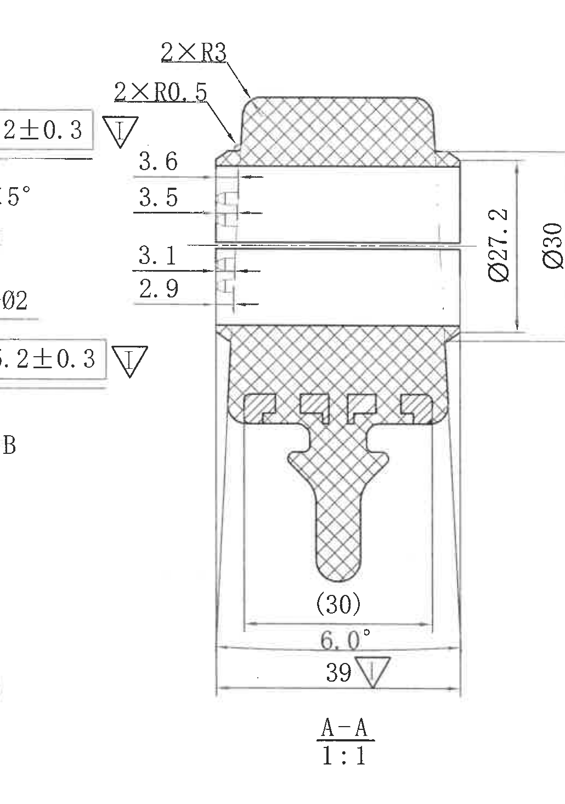
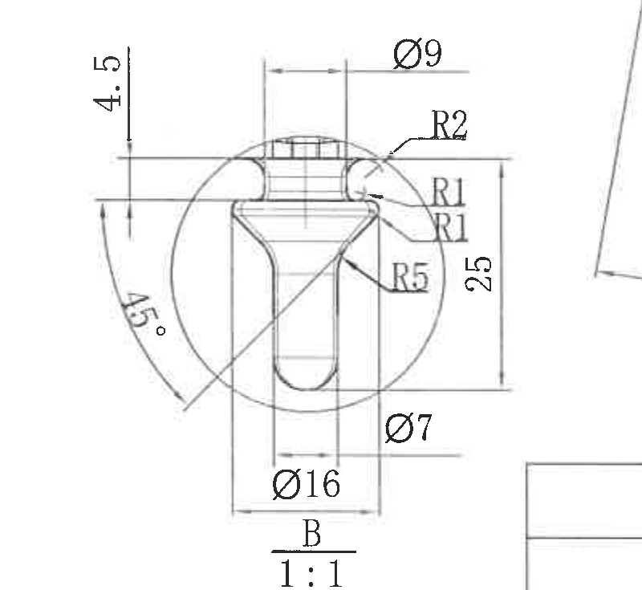
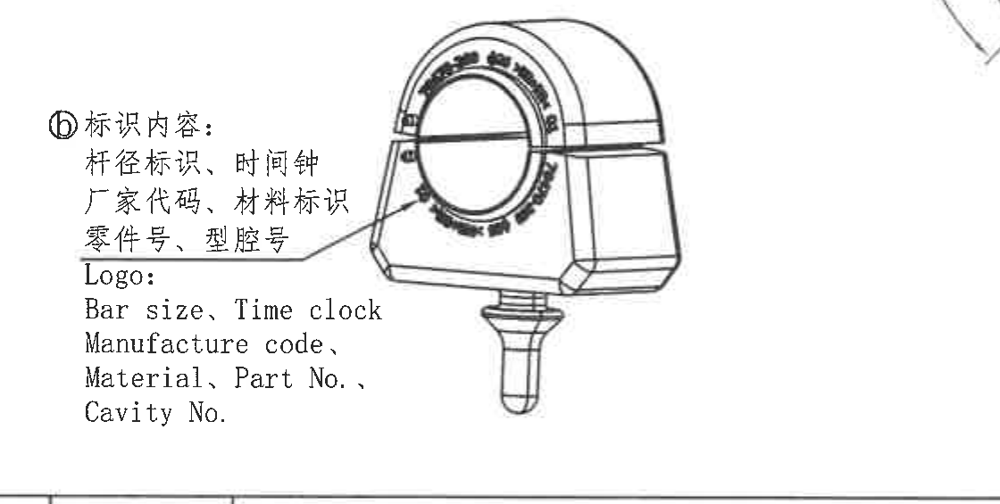
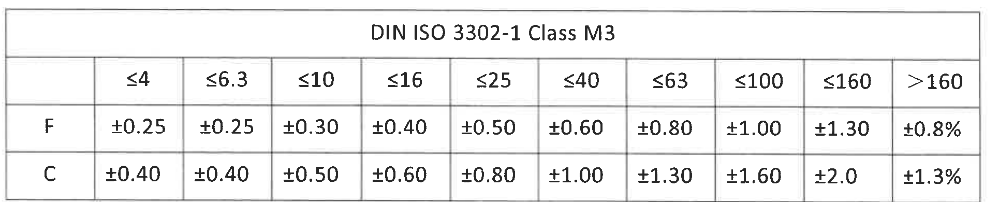
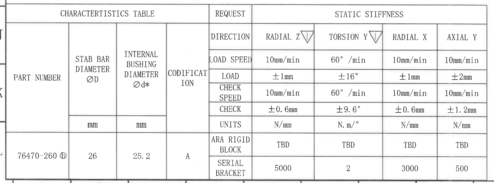
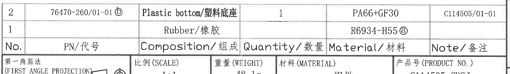
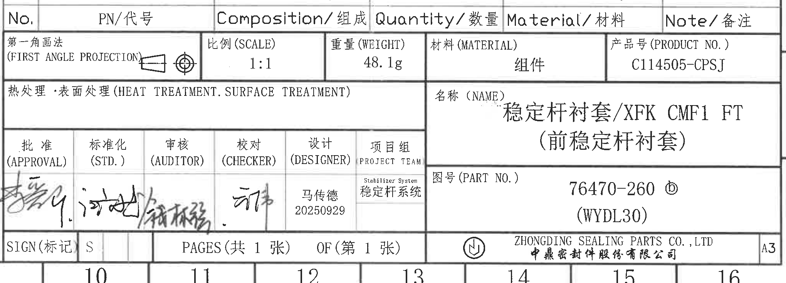

# 20C114505 内容识别与裁切提取

整页渲染图：`outputs/20C114505_assets/images/page_1.png`  
页面尺寸：4959 x 3505 px。坐标 bbox 均为 `[x0, y0, x1, y1]`，原点在整页 PNG 左上角。

## object_1 - NOTES / 技术要求

原图位置/视图名称：左上技术要求区，bbox `[350, 150, 2810, 1825]`。

| 提取项 | 原图数值或文本 | 含义说明 |
|---|---|---|
| 标题 | 技术要求: Specifications: | 本区为技术要求/NOTES。 |
| 1 | 天然胶, 硬度:55±5 shore A, 参照标准RENAULT 30-00-118; | 材料为天然橡胶，硬度 55±5 Shore A，按 RENAULT 30-00-118。 |
| 1 英文 | Nature rubber with 55±5 shore A, according to the spec. RENAULT 30-00-118. | 与中文第 1 条对应。 |
| 2 | 由索格菲完成粘接工序; The gluing is made by Sogefi. | 粘接工序由 Sogefi 完成。 |
| 3 | 粘接准备事项 Bush status before for gluing on stab bar: | 稳定杆粘接前的衬套状态要求。 |
| 3.1 中文 | 衬套内表面需保持清洁并进行活化, 索格菲粘接前无需额外的表面处理; | 衬套内表面清洁和化学活化要求。 |
| 3.2 中文 | 衬套出模后6个月可粘接; | 出模后最多 6 个月内可执行粘接。 |
| 3.3 中文 | 采用脱模剂必须与索格菲粘接工艺兼容; | 脱模剂需与 Sogefi 粘接工艺兼容。 |
| 3.1 英文 | The internal surface of the bush must be clean and chemically activated, and can receive the Sogefi glue without additional surface preparation. | 与中文 3.1 对应。 |
| 3.2 英文 | The gluing operation can be made 6 months maximum after moulding. | 与中文 3.2 对应。 |
| 3.3 英文 | The release agent used for bushes must be compatible with the Sogefi glue. | 与中文 3.3 对应。 |
| 4 | 特殊特性参照标准 I-02-P-01-01: Special characteristics as I-02-P-01-01: | 特殊特性符号按 I-02-P-01-01。 |
| 关键特性符号 | 关键特性标识 Critical: 三角形内 C | 表示关键特性标识。 |
| 重要特性符号 | 重要特性标识 Important: 三角形内 I | 表示重要特性标识。 |
| 橡胶尺寸公差 | 橡胶尺寸公差参照 DIN ISO 3302-1 Class M3 级执行; General tolerances on rubber DIN ISO 3302-1 Class M3. | 橡胶件一般尺寸公差采用 DIN ISO 3302-1 Class M3。 |
| 5 | 追溯性标识: 字高2.5mm, 字深0.2mm; | 刻字/追溯标识字符高度和深度要求。 |
| 5 英文 | Traceability: characters height 2.5mm, characters deep 0.2mm. | 与中文第 5 条对应。 |
| 6 | 刚度采用卡箍和夹具完成(见附表): Stiffness are checked with serial brackets and rigid blocks to meet the specification (see table). | 刚度检查需使用串联卡箍和刚性块，数据见特性/刚度表。 |
| 7 | 试验项目: 所有产品试验参照技术标准文件RNDS-C-00105 | 产品试验引用 RNDS-C-00105。 |
| 7 英文 | Test item: For all tests refer to the technical specification RNDS-C-00105 | 与中文第 7 条对应。 |
| 8 | □ 为工序、出厂检验尺寸。 | 方框标识为工序和出厂检验尺寸。 |
| 8 英文 | □ is marked for inspection dimensions. | 与中文第 8 条对应。 |

边界归属说明：右侧可见主视图左边缘尺寸线和 B 局部图上缘，这是为了完整保留 NOTES 长英文行和第 8 条文字而带入的邻接内容；右侧 `(51.7)`、`28.2`、`Ø9`、`R2` 等尺寸不属于 NOTES，已在主视图或 B 局部图对象中提取。

## object_2 - 修订履历表

原图位置/视图名称：右上修订履历表，bbox `[2865, 185, 4795, 595]`。

原表还原：

| No. | 变更来源 (Source of change) | No. | 变更标记 (MARK CHANGE) | 更改内容 (CHANGE CONTENT) | 中鼎版本号 (ZD version) | 日期 (DATE) | 责任人 (RESPONSIBLE) |
|---|---|---|---|---|---|---|---|
|  |  |  |  | Initial Release (初始版本) | A | 20250701 | 马传德 |
|  | SJ-253323 |  | ⓐ/1 | 胶料由R7770-H55改为R6934-H55 | B | 20250627 | 马传德 |
|  | SJ-255840 |  | ⓑ/5 | 更新图号为76470-260，增加刻字内容，增加防错凸台 | C | 20250929 | 马传德 |

| 提取项 | 原图数值或文本 | 含义说明 |
|---|---|---|
| 表头 | No.; 变更来源; No.; 变更标记; 更改内容; 中鼎版本号; 日期; 责任人 | 修订履历的列定义。 |
| 初始版本 | Initial Release (初始版本), ZD version A, 20250701, 马传德 | 初始发布记录。 |
| 变更 B | SJ-253323, ⓐ/1, 胶料由R7770-H55改为R6934-H55, ZD version B, 20250627, 马传德 | 版本 B 的材料变更记录。 |
| 变更 C | SJ-255840, ⓑ/5, 更新图号为76470-260，增加刻字内容，增加防错凸台, ZD version C, 20250929, 马传德 | 版本 C 的图号、刻字内容和防错凸台变更记录。 |

边界归属说明：裁切区域仅保留修订履历表主体；表上边缘有图框坐标栏残线，不作为表格内容提取。

## object_3 - 主视图 / Front View

原图位置/视图名称：右中主视图，bbox `[2585, 585, 4015, 1950]`。

| 提取项 | 原图数值或文本 | 含义说明 |
|---|---|---|
| 视图标识 | A-A 剖切箭头；B 局部引出；ⓑ 变更标记 | 主视图中标出 A-A 剖切方向、B 局部位置和 ⓑ 修订标记。 |
| 顶部水平尺寸 | 44.8±0.6，三角形 I | 主视图上部横向宽度/跨度，带重要特性标识 I，公差 ±0.6。 |
| 左侧参考高度 | (51.7) | 括号内参考尺寸，表示主视图左侧总高度/派生高度，仅供参考，不作为直接控制尺寸。 |
| 左侧垂直尺寸 | 28.2，三角形 I | 左侧由底部基准至中部特征的高度，带重要特性标识 I。 |
| 局部偏置 | 2×0.5 | 两处 0.5 的局部台阶/间隙尺寸，位于左上分型/接口附近。 |
| 左侧垂直尺寸 | 5.9 | 左侧中部局部高度尺寸。 |
| 左下角角度 | 50° | 左下支撑/斜面处角度尺寸。 |
| 上部圆弧 | R22 | 上部外圆弧半径。 |
| 内孔/衬套直径上侧 | Ø25.2±0.3，三角形 I | 主视图右上引出到内圆/衬套区域的直径，带重要特性标识 I，公差 ±0.3。 |
| 内孔/衬套直径下侧 | Ø25.2±0.3，三角形 I | 主视图右下引出到内圆/衬套区域的同值直径，带重要特性标识 I，公差 ±0.3。 |
| 分型/接口角度 | 2×5° | 两处 5° 角，位于左右分型或接口斜面处。 |
| 小孔 | 4-Ø2 | 四个直径 2 的小孔/圆点特征。 |
| 下部横向尺寸 | 43.1，三角形 I | 下部内侧横向尺寸，带重要特性标识 I。 |
| 底部横向尺寸 | 53.1±0.6，三角形 I | 底部外侧横向跨度/宽度，带重要特性标识 I，公差 ±0.6。 |
| 底部角度 | 20° | 底边弧向/夹角标注，表示底部外形开角。 |
| 基准/剖切字母 | A、B | A 用于 A-A 剖视，B 用于局部图 B。 |

边界归属说明：右边界附近可见 A-A 剖视图的少量尺寸文字边缘，如 `2×R...`、`3...` 等，不属于主视图，未在本区提取；左下角可见 B 局部图的 `Ø9/R2/R1/R5/25` 等局部尺寸边缘，归属 object_5。

## object_4 - A-A 剖视图 / Section A-A

原图位置/视图名称：右中 A-A 剖视图，bbox `[3720, 610, 4750, 2075]`。

| 提取项 | 原图数值或文本 | 含义说明 |
|---|---|---|
| 视图名称 | A-A, 1:1 | A-A 剖视图，比例 1:1。 |
| 顶部圆角 | 2×R3 | 顶部两处 R3 圆角。 |
| 肩部小圆角 | 2×R0.5 | 肩部两处 R0.5 小圆角。 |
| 左侧局部尺寸 | 3.6 | 剖面左侧上部局部台阶/槽尺寸。 |
| 左侧局部尺寸 | 3.5 | 剖面左侧上部相邻局部台阶/槽尺寸。 |
| 左侧局部尺寸 | 3.1 | 剖面左侧下部局部台阶/槽尺寸。 |
| 左侧局部尺寸 | 2.9 | 剖面左侧下部相邻局部台阶/槽尺寸。 |
| 右侧直径 | Ø27.2 | 剖面中部内侧/金属或装配相关直径。 |
| 右侧外径 | Ø30 | 剖面外侧总直径。 |
| 参考尺寸 | (30) | 括号内参考尺寸，位于剖面下部中心特征附近，用于提示派生宽度/位置。 |
| 下部角度 | 6.0° | 剖面下部两侧斜面的夹角/角度标注。 |
| 底部宽度 | 39，三角形 I | 剖面底部横向尺寸，带重要特性标识 I。 |
| 剖面线 | 交叉剖面线 | 表示剖切材料区域。 |

边界归属说明：左边缘可见主视图的 `Ø25.2±0.3`、`2×5°`、`4-Ø2` 等标注残边，这些归属 object_3；本区只提取 A-A 剖面内的半径、直径、角度、参考尺寸和底部尺寸。

## object_5 - B 局部图 / Detail B

原图位置/视图名称：中下 B 局部视图，bbox `[2165, 1540, 2965, 2275]`。

| 提取项 | 原图数值或文本 | 含义说明 |
|---|---|---|
| 视图名称 | B, 1:1 | B 局部图，比例 1:1。 |
| 上部高度 | 4.5 | 局部上端到参考线的高度尺寸。 |
| 上部直径 | Ø9 | 上部柱/帽状特征直径。 |
| 顶部圆角 | R2 | 顶部外侧圆角半径。 |
| 局部圆角 | R1, R1 | 两处 R1 圆角，位于上部凹槽/肩部附近。 |
| 内部圆角 | R5 | 内部过渡圆角半径。 |
| 总局部高度 | 25 | B 局部图右侧垂直高度尺寸。 |
| 下部直径 | Ø7 | 局部下部柱状特征直径。 |
| 底部直径 | Ø16 | 局部底部外径。 |
| 角度 | 45° | 左侧弧向/斜向标注的角度尺寸。 |

边界归属说明：右侧可见主视图外形线和右下表格边缘片段，不属于 B 局部图；本区仅提取圆圈内 B 局部特征及其完整尺寸线和文字。

## object_6 - 标识内容示意图 / Marking View

原图位置/视图名称：中下标识内容示意，bbox `[1290, 1980, 2410, 2545]`。

| 提取项 | 原图数值或文本 | 含义说明 |
|---|---|---|
| 变更标记 | ⓑ | 与修订履历中 ⓑ/5 对应，表示该标识内容受到版本 C 变更影响。 |
| 中文标题 | 标识内容: | 说明本图为衬套标识内容示意。 |
| 中文内容 | 杆径标识、时间钟、厂家代码、材料标识、零件号、型腔号 | 标识需包含杆径、时间钟、厂家代码、材料、零件号、型腔号。 |
| 英文标题 | Logo: | 英文说明。 |
| 英文内容 | Bar size, Time clock; Manufacture code; Material, Part No.; Cavity No. | 与中文标识内容对应。 |
| 示意图 | 圆周刻字和引出箭头 | 指示标识在零件圆周/外表面附近的位置。 |

边界归属说明：右上角可见 B 局部图的极少量边缘线，未作为本对象提取；底部裁切停在特性表上边界之前，未提取特性表内容。

## object_7 - DIN ISO 3302-1 Class M3 公差表

原图位置/视图名称：右下 DIN ISO 3302-1 Class M3 公差表，bbox `[2810, 2100, 4740, 2490]`。

原表还原：

| DIN ISO 3302-1 Class M3 | ≤4 | ≤6.3 | ≤10 | ≤16 | ≤25 | ≤40 | ≤63 | ≤100 | ≤160 | >160 |
|---|---|---|---|---|---|---|---|---|---|---|
| F | ±0.25 | ±0.25 | ±0.30 | ±0.40 | ±0.50 | ±0.60 | ±0.80 | ±1.00 | ±1.30 | ±0.8% |
| C | ±0.40 | ±0.40 | ±0.50 | ±0.60 | ±0.80 | ±1.00 | ±1.30 | ±1.60 | ±2.0 | ±1.3% |

| 提取项 | 原图数值或文本 | 含义说明 |
|---|---|---|
| 标题 | DIN ISO 3302-1 Class M3 | 橡胶尺寸一般公差表，与 NOTES 第 4 条对应。 |
| F 行 | ±0.25 至 ±1.30, >160 为 ±0.8% | F 级公差。 |
| C 行 | ±0.40 至 ±2.0, >160 为 ±1.3% | C 级公差。 |

边界归属说明：裁切完整包含表题、全部列头、F/C 两行和外框；未混入相邻视图尺寸。

## object_8 - CHARACTERISTICS TABLE / STATIC STIFFNESS

原图位置/视图名称：左下特性和静刚度表，bbox `[350, 2515, 2705, 3390]`。

原表还原：

| CHARACTERISTICS TABLE |  |  |  | REQUEST | STATIC STIFFNESS |  |  |  |
|---|---|---|---|---|---|---|---|---|
| PART NUMBER | STAB BAR DIAMETER ØD | INTERNAL BUSHING DIAMETER Ød* | CODIFICATION | DIRECTION | RADIAL Z △I | TORSION Y △I | RADIAL X | AXIAL Y |
|  | mm | mm |  | LOAD SPEED | 10mm/min | 60°/min | 10mm/min | 10mm/min |
|  |  |  |  | LOAD | ±1mm | ±16° | ±1mm | ±2mm |
|  |  |  |  | CHECK SPEED | 10mm/min | 60°/min | 10mm/min | 10mm/min |
|  |  |  |  | CHECK | ±0.6mm | ±9.6° | ±0.6mm | ±1.2mm |
|  |  |  |  | UNITS | N/mm | N.m/° | N/mm | N/mm |
| 76470-260 ⓑ | 26 | 25.2 | A | ARA RIGID BLOCK | TBD | TBD | TBD | TBD |
| 76470-260 ⓑ | 26 | 25.2 | A | SERIAL BRACKET | 5000 | 2 | 3000 | 500 |

| 提取项 | 原图数值或文本 | 含义说明 |
|---|---|---|
| 零件号 | 76470-260 ⓑ | 与标题栏图号一致，带 ⓑ 变更标记。 |
| 稳定杆直径 | ØD = 26 mm | 稳定杆直径。 |
| 衬套内径关键尺寸 | Ød* = 25.2 mm | 带星号的内衬套直径，属于关键/重点控制尺寸；与主视图 `Ø25.2±0.3` 对应。 |
| 编码 | A | Codification。 |
| RADIAL Z | 方向带三角形 I；速度 10mm/min；加载 ±1mm；检查速度 10mm/min；检查 ±0.6mm；单位 N/mm | 静刚度径向 Z 方向，带重要特性标识。 |
| TORSION Y | 方向带三角形 I；速度 60°/min；加载 ±16°；检查速度 60°/min；检查 ±9.6°；单位 N.m/° | 静刚度扭转 Y 方向，带重要特性标识。 |
| RADIAL X | 速度 10mm/min；加载 ±1mm；检查速度 10mm/min；检查 ±0.6mm；单位 N/mm | 静刚度径向 X 方向。 |
| AXIAL Y | 速度 10mm/min；加载 ±2mm；检查速度 10mm/min；检查 ±1.2mm；单位 N/mm | 静刚度轴向 Y 方向。 |
| ARA RIGID BLOCK | TBD, TBD, TBD, TBD | 刚性块工况的静刚度数值待定。 |
| SERIAL BRACKET | 5000, 2, 3000, 500 | 串联卡箍工况下四个方向的静刚度数值。 |

边界归属说明：裁切完整包含左下表格外框、表头、单位行、工况行和数据行；底部接近图框坐标线但未裁掉表格文字。

## object_9 - BOM / Composition 表

原图位置/视图名称：右下 BOM/组成表，bbox `[2770, 2560, 4810, 2860]`。

原表还原：

| No. | PN/代号 | Composition/组成 | Quantity/数量 | Material/材料 | Note/备注 |
|---|---|---|---|---|---|
| 2 | 76470-260/01-01 ⓑ | Plastic bottom/塑料底座 | 1 | PA66+GF30 | C114505/01-01 |
| 1 |  | Rubber/橡胶 |  | R6934-H55 ⓐ |  |

| 提取项 | 原图数值或文本 | 含义说明 |
|---|---|---|
| 表头 | No.; PN/代号; Composition/组成; Quantity/数量; Material/材料; Note/备注 | BOM 列定义。 |
| 物料 2 | PN 76470-260/01-01 ⓑ; Plastic bottom/塑料底座; Quantity 1; PA66+GF30; Note C114505/01-01 | 塑料底座物料，带 ⓑ 变更标记。 |
| 物料 1 | Rubber/橡胶; Material R6934-H55 ⓐ | 橡胶物料，材料带 ⓐ 变更标记；PN、数量和备注栏未填写。 |

边界归属说明：BOM 与标题栏共享下边界；裁切保留 BOM 表头和两条物料行。下方第一角画法、比例、重量等属于 object_10 标题栏。

## object_10 - 标题栏 / Title Block

原图位置/视图名称：右下标题栏，bbox `[2770, 2700, 4810, 3435]`。

| 提取项 | 原图数值或文本 | 含义说明 |
|---|---|---|
| 投影视图 | 第一角画法 (FIRST ANGLE PROJECTION) | 图纸采用第一角画法，旁有投影符号。 |
| 比例 | 1:1 | 图纸比例。 |
| 重量 | 48.1g | 产品重量。 |
| 材料 | 组件 | 标题栏材料项。 |
| 产品号 | C114505-CPSJ | 产品号。 |
| 热处理/表面处理 | 热处理·表面处理 (HEAT TREATMENT. SURFACE TREATMENT)，内容空白 | 未填写具体处理内容。 |
| 名称 | 稳定杆衬套/XFK CMF1 FT (前稳定杆衬套) | 零件名称。 |
| 图号 | 76470-260 ⓑ (WYDL30) | 零件图号，带 ⓑ 变更标记。 |
| 批准 | APPROVAL，手写签名 | 批准签署栏。 |
| 标准化 | STD.，手写签名 | 标准化签署栏。 |
| 审核 | AUDITOR，手写签名 | 审核签署栏。 |
| 校对 | CHECKER，手写签名 | 校对签署栏。 |
| 设计 | DESIGNER: 马传德, 20250929 | 设计人及日期。 |
| 项目组 | PROJECT TEAM; Stabilizer System; 稳定杆系统 | 项目组信息。 |
| 标记 | SIGN(标记): S | 标记栏。 |
| 页码 | PAGES(共 1 张); OF(第 1 张) | 共 1 张，第 1 张。 |
| 公司 | ZHONGDING SEALING PARTS CO., LTD; 中鼎密封件股份有限公司 | 出图公司。 |
| 图幅 | A3 | 图纸幅面。 |

边界归属说明：上边界包含 BOM 表头的少量共享边缘；标题栏提取从第一角画法、比例、重量、材料、产品号等标题栏字段开始，未把 BOM 物料行归入标题栏。

## 裁切检查记录

| object_id | 裁切对象 | 图片路径 | 检查结果 |
|---|---|---|---|
| object_1 | NOTES / 技术要求 | outputs/20C114505_assets/images/object_1.png | NOTES 第 1-8 条文字完整；右侧邻接主视图/B 局部图尺寸线只作边界残留，未提取为 NOTES。 |
| object_2 | 修订履历表 | outputs/20C114505_assets/images/object_2.png | 表头、三条记录、日期和责任人完整；顶部坐标残线不作为表格内容。 |
| object_3 | 主视图 | outputs/20C114505_assets/images/object_3.png | 主视图尺寸线、箭头、文字完整；右侧剖视图残字和左下 B 局部图残边已排除。 |
| object_4 | A-A 剖视图 | outputs/20C114505_assets/images/object_4.png | A-A 剖面、剖面线、直径、半径、角度、参考尺寸和底部标注完整；左侧主视图残边已排除。 |
| object_5 | B 局部图 | outputs/20C114505_assets/images/object_5.png | B 局部尺寸线、箭头和 `B 1:1` 完整；右侧主视图线段已排除。 |
| object_6 | 标识内容示意图 | outputs/20C114505_assets/images/object_6.png | 标识文字和示意图完整；底部未裁入特性表内容。 |
| object_7 | DIN 公差表 | outputs/20C114505_assets/images/object_7.png | 表题、全部列头、F/C 两行和外框完整，无其他视图混入。 |
| object_8 | 特性/静刚度表 | outputs/20C114505_assets/images/object_8.png | 表头、单位、要求、工况和数据行完整；底部未裁掉文字。 |
| object_9 | BOM/组成表 | outputs/20C114505_assets/images/object_9.png | BOM 表头和两条物料行完整；下方标题栏字段不在本区提取。 |
| object_10 | 标题栏 | outputs/20C114505_assets/images/object_10.png | 标题栏主要字段、签署栏、图号、公司和 A3 幅面完整；上方 BOM 共享边缘未作为标题栏字段提取。 |
