# 20C114506.pdf 内容识别

整页渲染图：`outputs/20C114506_assets/images/page_1.png`  
页面：1；整页 PNG 尺寸：4959 x 3505 px。

## object_1：表1 橡胶材料试验

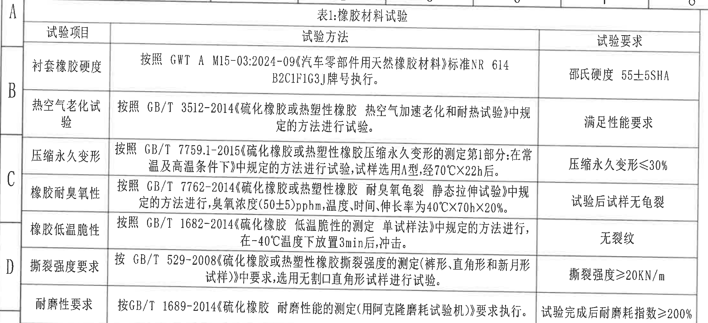

原图位置/视图名称：第 1 页左上区域，表1：橡胶材料试验。

### 原表还原

| 试验项目 | 试验方法 | 试验要求 |
|---|---|---|
| 衬套橡胶硬度 | 按照 GWT A M15-03:2024-09《汽车零部件用天然橡胶材料》标准 NR 614 B2C1F1G3J 牌号执行。 | 邵氏硬度 55±5SHA |
| 热空气老化试验 | 按照 GB/T 3512-2014《硫化橡胶或热塑性橡胶 热空气加速老化和耐热试验》中规定的方法进行试验。 | 满足性能要求 |
| 压缩永久变形 | 按照 GB/T 7759.1-2015《硫化橡胶或热塑性橡胶压缩永久变形的测定第1部分:在常温及高温条件下》中规定的方法进行试验，试样选用A型，经70℃X22h后。 | 压缩永久变形≤30% |
| 橡胶耐臭氧性 | 按照 GB/T 7762-2014《硫化橡胶或热塑性橡胶 耐臭氧龟裂 静态拉伸试验》中规定的方法进行，臭氧浓度(50±5)pphm，温度、时间、伸长率为40℃X70hX20%。 | 试验后试样无龟裂 |
| 橡胶低温脆性 | 按照 GB/T 1682-2014《硫化橡胶 低温脆性的测定 单试样法》中规定的方法进行，在-40℃温度下放置3min后，冲击。 | 无裂纹 |
| 撕裂强度要求 | 按 GB/T 529-2008《硫化橡胶或热塑性橡胶撕裂强度的测定(裤形、直角形和新月形试样)》中要求，选用无割口直角形试样进行试验。 | 撕裂强度≥20KN/m |
| 耐磨性要求 | 按 GB/T 1689-2014《硫化橡胶 耐磨性能的测定(用阿克隆磨耗试验机)》要求执行。 | 试验完成后耐磨耗指数≥200% |

### 提取表格

| 提取项 | 原图数值或文本 | 含义说明 |
|---|---|---|
| 表名 | 表1:橡胶材料试验 | 橡胶材料验证项目总表。 |
| 橡胶硬度要求 | 邵氏硬度 55±5SHA | 衬套橡胶硬度按 NR 614 B2C1F1G3J 牌号执行。 |
| 老化要求 | 满足性能要求 | 热空气老化后需满足性能要求。 |
| 压缩永久变形 | ≤30% | 压缩永久变形上限。 |
| 耐臭氧性 | 试验后试样无龟裂 | 臭氧龟裂静态拉伸试验后的外观要求。 |
| 低温脆性 | 无裂纹 | -40℃放置后冲击不得裂纹。 |
| 撕裂强度 | ≥20KN/m | 撕裂强度下限。 |
| 耐磨性 | 耐磨耗指数≥200% | 试验完成后的耐磨指标。 |

边界归属说明：裁切覆盖表1完整表头、三列和七行试验记录；左侧少量图框坐标字母属于图纸坐标框，不作为表格字段提取。

## object_2：表2 产品性能试验

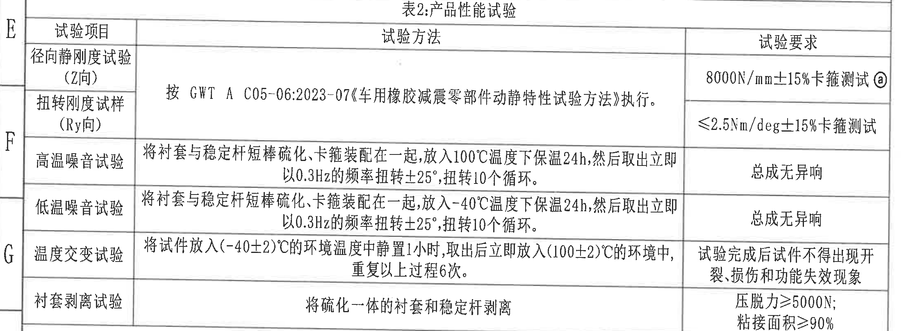

原图位置/视图名称：第 1 页左中区域，表2：产品性能试验。

### 原表还原

| 试验项目 | 试验方法 | 试验要求 |
|---|---|---|
| 径向静刚度试验(Z向) | 按 GWT A C05-06:2023-07《车用橡胶减震零部件动静特性试验方法》执行。 | 8000N/mm±15%卡箍测试ⓐ |
| 扭转刚度试样(Ry向) | 按 GWT A C05-06:2023-07《车用橡胶减震零部件动静特性试验方法》执行。 | ≤2.5Nm/deg±15%卡箍测试 |
| 高温噪音试验 | 将衬套与稳定杆短棒硫化、卡箍装配在一起，放入100℃温度下保温24h，然后取出立即以0.3Hz的频率扭转±25°，扭转10个循环。 | 总成无异响 |
| 低温噪音试验 | 将衬套与稳定杆短棒硫化、卡箍装配在一起，放入-40℃温度下保温24h，然后取出立即以0.3Hz的频率扭转±25°，扭转10个循环。 | 总成无异响 |
| 温度交变试验 | 将试件放入(-40±2)℃的环境温度中静置1小时，取出后立即放入(100±2)℃的环境中，重复以上过程6次。 | 试验完成后试件不得出现开裂、损伤和功能失效现象 |
| 衬套剥离试验 | 将硫化一体的衬套和稳定杆剥离 | 压脱力≥5000N；粘接面积≥90% |

### 提取表格

| 提取项 | 原图数值或文本 | 含义说明 |
|---|---|---|
| 表名 | 表2:产品性能试验 | 产品总成性能验证项目。 |
| 径向静刚度 | 8000N/mm±15%卡箍测试ⓐ | Z向刚度要求，带变更标记ⓐ。 |
| 扭转刚度 | ≤2.5Nm/deg±15%卡箍测试 | Ry向扭转刚度上限及公差。 |
| 高温噪音 | 100℃，24h，0.3Hz，±25°，10个循环；总成无异响 | 高温环境后的噪音评价。 |
| 低温噪音 | -40℃，24h，0.3Hz，±25°，10个循环；总成无异响 | 低温环境后的噪音评价。 |
| 温度交变 | (-40±2)℃ 与 (100±2)℃，6次 | 温变后不得开裂、损伤或功能失效。 |
| 衬套剥离 | 压脱力≥5000N；粘接面积≥90% | 硫化一体衬套与稳定杆的剥离要求。 |

边界归属说明：裁切覆盖表2完整三列表格和六项试验记录；左侧图框坐标字母不属于表格内容。

## object_3：修订履历表

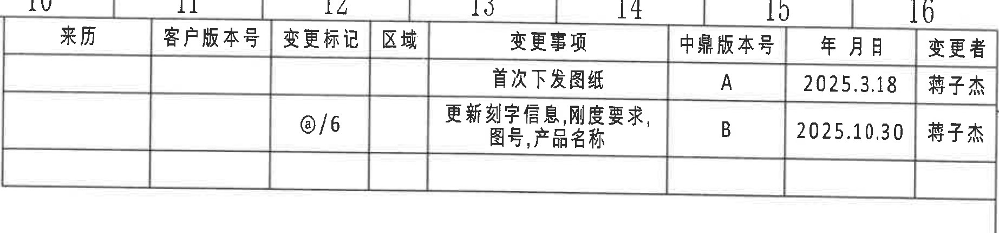

原图位置/视图名称：第 1 页右上区域，变更/修订履历表。

### 原表还原

| 来历 | 客户版本号 | 变更标记 | 区域 | 变更事项 | 中鼎版本号 | 年月日 | 变更者 |
|---|---|---|---|---|---|---|---|
|  |  |  |  | 首次下发图纸 | A | 2025.3.18 | 蒋子杰 |
|  |  | ⓐ/6 |  | 更新刻字信息,刚度要求,图号,产品名称 | B | 2025.10.30 | 蒋子杰 |

### 提取表格

| 提取项 | 原图数值或文本 | 含义说明 |
|---|---|---|
| 首次下发 | 中鼎版本号 A；2025.3.18；蒋子杰 | 初版图纸下发记录。 |
| 变更记录 | 变更标记 ⓐ/6；中鼎版本号 B；2025.10.30；蒋子杰 | 对刻字信息、刚度要求、图号、产品名称进行更新。 |

边界归属说明：裁切覆盖完整修订履历表；上方坐标栏数字 10-16 为图框坐标，不作为履历表字段提取。

## object_4：主视图

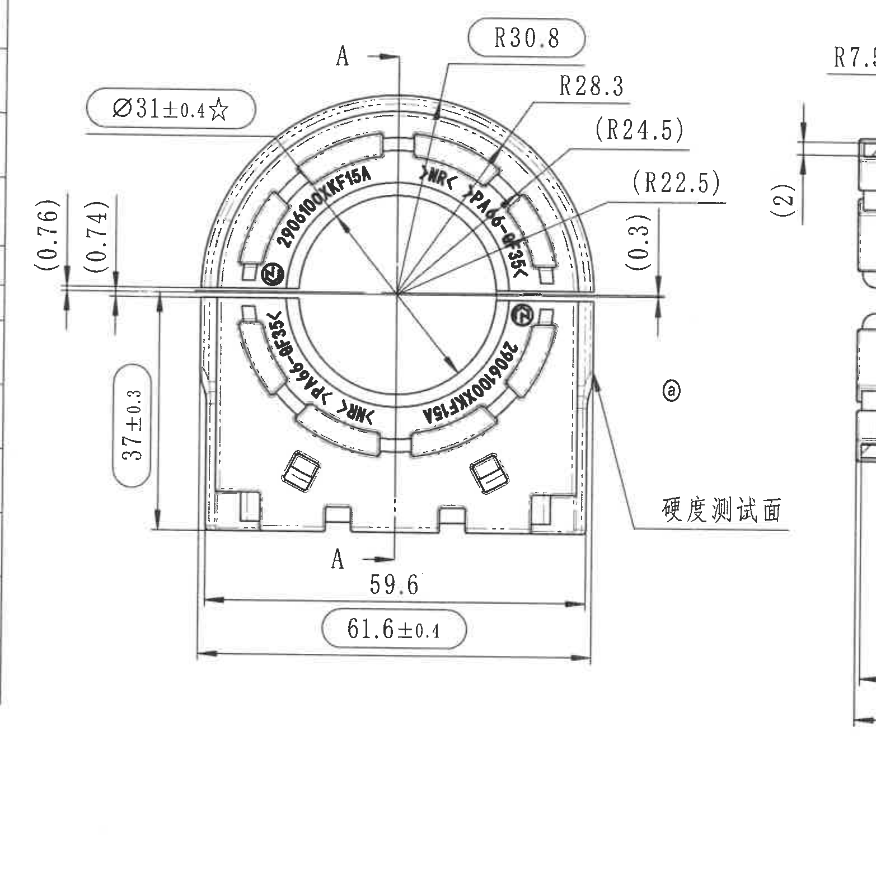

原图位置/视图名称：第 1 页右中偏左，零件主视图/正视加工视图。

### 提取表格

| 提取项 | 原图数值或文本 | 含义说明 |
|---|---|---|
| 外径/孔径标注 | Ø31±0.4☆ | 直径尺寸，公差 ±0.4；星号表示关键尺寸。 |
| 外圆弧半径 | R30.8 | 主视图顶部外圆弧半径；标注在圆角框内，为重点/检验标注。 |
| 圆弧半径 | R28.3 | 主视图右上弧向半径。 |
| 参考圆弧半径 | (R24.5) | 括号内参考尺寸，说明相应圆弧半径仅供参考/由3D数模或关联结构确定。 |
| 参考圆弧半径 | (R22.5) | 括号内参考尺寸，说明相应内侧圆弧半径仅供参考。 |
| 参考竖向尺寸 | (0.76) | 左侧上方参考竖向距离，靠近水平分型/边界线。 |
| 参考竖向尺寸 | (0.74) | 左侧上方第二个参考竖向距离，靠近水平分型/边界线。 |
| 参考竖向尺寸 | (0.3) | 右侧水平边界附近参考距离。 |
| 高度/竖向尺寸 | 37±0.3 | 主视图左侧从水平界线至底部的竖向尺寸，带公差 ±0.3。 |
| 宽度尺寸 | 59.6 | 主视图底部内侧宽度尺寸。 |
| 总宽度/关键检验尺寸 | 61.6±0.4 | 主视图底部外侧总宽，公差 ±0.4；标注在圆角框内。 |
| 剖切基准 | A-A | 主视图中竖向剖切线和上下 A 标记，指向 object_5 的 A-A 剖视图。 |
| 表面标识 | 硬度测试面 | 引线指向右侧立面，说明硬度测试位置。 |
| 变更标记 | ⓐ | 主视图右侧带变更标记，关联修订履历中 B 版更新。 |
| 刻字/产品标识 | 2906100XKF15A；MR < PA66-GF35 < | 视图内刻字信息及材料方向/材料标识。 |

边界归属说明：裁切完整保留主视图所有尺寸线、箭头、文字和“硬度测试面”引线。右侧可见少量 A-A 剖视图边缘和 R7.5 文字片段，仅作为邻近视图残留，不归入主视图提取项；A-A 剖视尺寸单独归入 object_5。

## object_5：A-A 剖视图

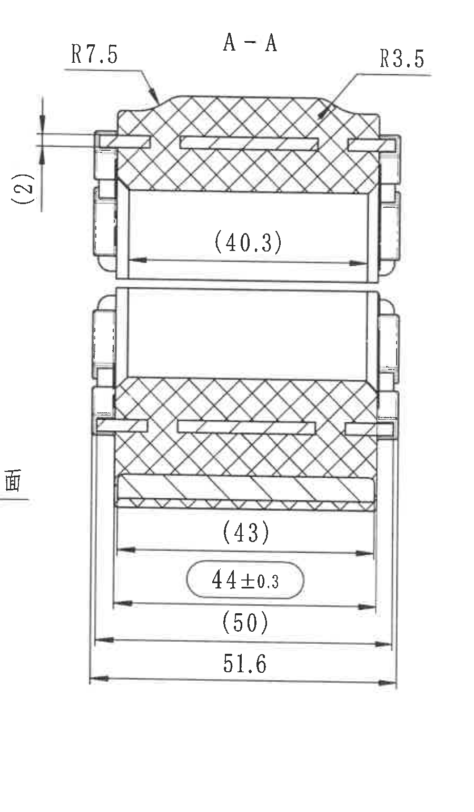

原图位置/视图名称：第 1 页右中区域，A-A 剖面视图。

### 提取表格

| 提取项 | 原图数值或文本 | 含义说明 |
|---|---|---|
| 剖视名称 | A-A | 由主视图 A-A 剖切线生成的剖面视图。 |
| 圆角半径 | R7.5 | 剖面左上过渡圆角半径。 |
| 圆角半径 | R3.5 | 剖面右上过渡圆角半径。 |
| 参考竖向尺寸 | (2) | 左侧竖向参考尺寸，括号表示参考值。 |
| 参考内部宽度 | (40.3) | 上部开口内宽参考尺寸，括号表示参考值。 |
| 参考宽度 | (43) | 下部内侧宽度参考尺寸，括号表示参考值。 |
| 宽度尺寸 | 44±0.3 | 下部宽度尺寸，公差 ±0.3，标注在圆角框内。 |
| 参考宽度 | (50) | 下部外侧参考宽度，括号表示参考值。 |
| 总宽度 | 51.6 | 剖面最外侧总宽。 |

边界归属说明：裁切完整包含 A-A 剖视图的剖面线、尺寸线和箭头。左下边缘残留“面”字来自主视图“硬度测试面”标注，不归入剖视图；主视图尺寸不在本对象提取。

## object_6：技术要求 / NOTES

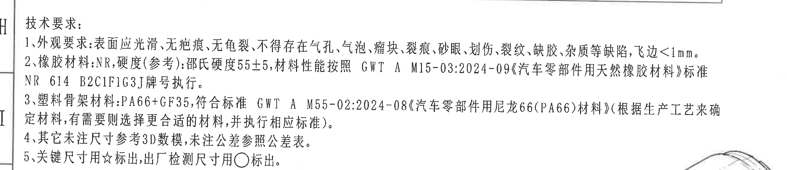

原图位置/视图名称：第 1 页左中下区域，技术要求。

### 提取表格

| 提取项 | 原图数值或文本 | 含义说明 |
|---|---|---|
| 标题 | 技术要求 | NOTES 区域标题。 |
| 1 外观要求 | 表面应光滑、无疤痕、无龟裂、不得存在气孔、气泡、瘤块、裂痕、砂眼、划伤、裂纹、缺胶、杂质等缺陷，飞边<1mm。 | 成品外观缺陷控制要求。 |
| 2 橡胶材料 | NR，硬度(参考):邵氏硬度55±5，材料性能按照 GWT A M15-03:2024-09《汽车零部件用天然橡胶材料》标准 NR 614 B2C1F1G3J 牌号执行。 | 橡胶材质、参考硬度和执行标准。 |
| 3 塑料骨架材料 | PA66+GF35，符合标准 GWT A M55-02:2024-08《汽车零部件用尼龙66(PA66)材料》(根据生产工艺来确定材料，有需要则选择更合适的材料，并执行相应标准)。 | 塑料骨架材料和标准。 |
| 4 未注尺寸/公差 | 其它未注尺寸参考3D数模，未注公差参照公差表。 | 未标注尺寸按3D模型，未注公差按 object_7。 |
| 5 关键尺寸/出厂检测 | 关键尺寸用☆标出，出厂检测尺寸用○标出。 | 说明图中星号和圆圈/圆角框尺寸标识的含义。 |

边界归属说明：裁切覆盖技术要求 1-5 条完整文字；右下角紧邻等轴测图，裁切以文字完整为优先，若边缘出现极少轮廓不参与 NOTES 内容提取。

## object_7：未注公差表

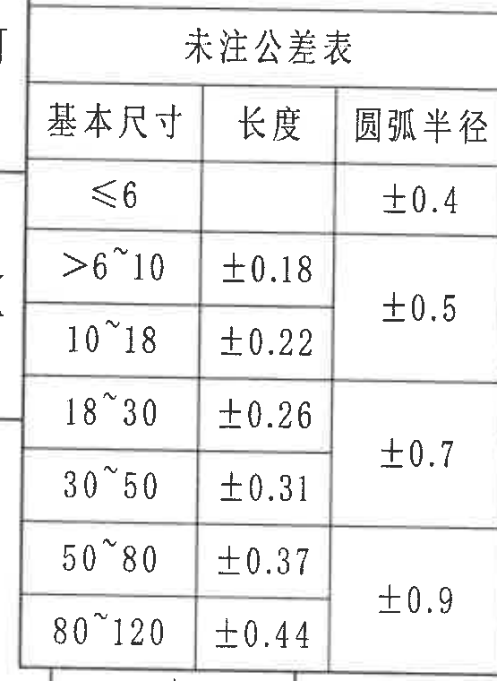

原图位置/视图名称：第 1 页左下区域，未注公差表。

### 原表还原

| 基本尺寸 | 长度 | 圆弧半径 |
|---|---|---|
| ≤6 |  | ±0.4 |
| >6~10 | ±0.18 | ±0.5 |
| 10~18 | ±0.22 | ±0.5 |
| 18~30 | ±0.26 | ±0.7 |
| 30~50 | ±0.31 | ±0.7 |
| 50~80 | ±0.37 | ±0.9 |
| 80~120 | ±0.44 | ±0.9 |

### 提取表格

| 提取项 | 原图数值或文本 | 含义说明 |
|---|---|---|
| 表名 | 未注公差表 | 技术要求第4条引用的未注公差。 |
| 基本尺寸≤6 | 圆弧半径 ±0.4 | ≤6 范围的圆弧半径未注公差。 |
| >6~10 | 长度 ±0.18；圆弧半径 ±0.5 | 长度和圆弧半径未注公差。 |
| 10~18 | 长度 ±0.22；圆弧半径 ±0.5 | 长度和圆弧半径未注公差。 |
| 18~30 | 长度 ±0.26；圆弧半径 ±0.7 | 长度和圆弧半径未注公差。 |
| 30~50 | 长度 ±0.31；圆弧半径 ±0.7 | 长度和圆弧半径未注公差。 |
| 50~80 | 长度 ±0.37；圆弧半径 ±0.9 | 长度和圆弧半径未注公差。 |
| 80~120 | 长度 ±0.44；圆弧半径 ±0.9 | 长度和圆弧半径未注公差。 |

边界归属说明：裁切包含未注公差表完整外框、表头和所有行；左侧少量图框坐标边缘不作为表格字段。

## object_8：表3 产品信息

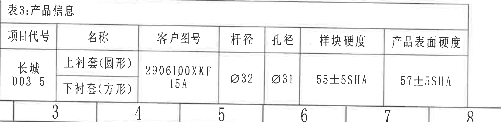

原图位置/视图名称：第 1 页底部偏左，表3：产品信息。

### 原表还原

| 项目代号 | 名称 | 客户图号 | 杆径 | 孔径 | 样块硬度 | 产品表面硬度 |
|---|---|---|---|---|---|---|
| 长城 D03-5 | 上衬套(圆形) / 下衬套(方形) | 2906100XKF15A | Ø32 | Ø31 | 55±5SHA | 57±5SHA |

### 提取表格

| 提取项 | 原图数值或文本 | 含义说明 |
|---|---|---|
| 表名 | 表3:产品信息 | 产品基础信息表。 |
| 项目代号 | 长城 D03-5 | 对应项目/车型平台代号。 |
| 名称 | 上衬套(圆形)；下衬套(方形) | 产品包含的上下衬套形式。 |
| 客户图号 | 2906100XKF15A | 客户图号/零件图号。 |
| 杆径 | Ø32 | 稳定杆配合直径。 |
| 孔径 | Ø31 | 衬套孔径。 |
| 样块硬度 | 55±5SHA | 样块邵氏硬度。 |
| 产品表面硬度 | 57±5SHA | 产品表面硬度要求。 |

边界归属说明：裁切收在表3外框内，完整保留表名、表头和数据行；上方等轴测坐标和左侧未注公差表已排除。

## object_9：等轴测图 / 局部三维视图

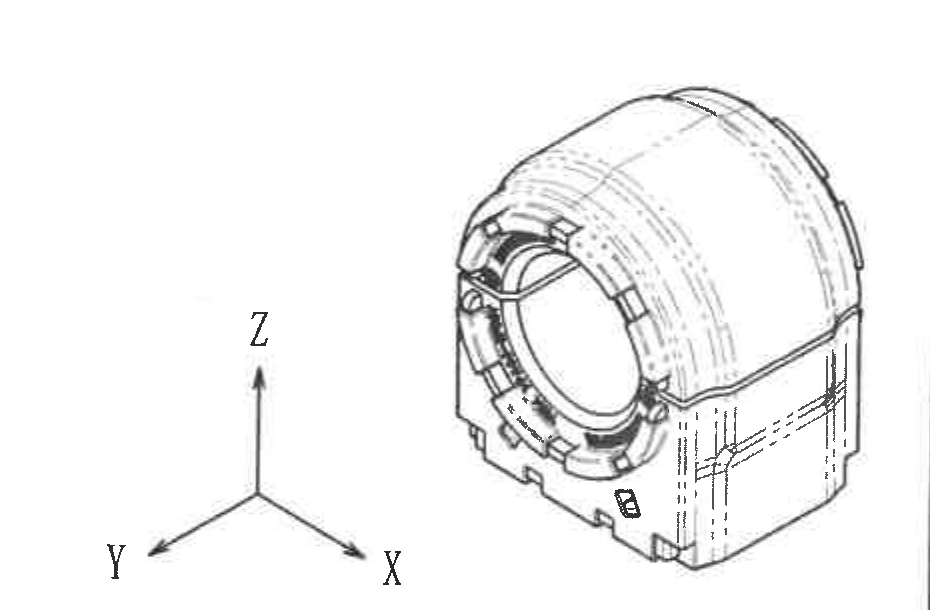

原图位置/视图名称：第 1 页下中区域，等轴测图和 X/Y/Z 方向标。

### 提取表格

| 提取项 | 原图数值或文本 | 含义说明 |
|---|---|---|
| 视图类型 | 等轴测图 | 展示零件三维外形，用于辅助理解主视图和剖视图。 |
| 坐标方向 | X、Y、Z | 图中给出三维方向标。 |
| 尺寸标注 | 无新增尺寸 | 本裁切对象未出现单独尺寸、公差、角度、半径或 T 编号。 |
| 结构信息 | 前端环形衬套、外侧塑料/橡胶复合结构、下部卡槽特征 | 三维视图用于表达整体外形，不替代主视图和剖视尺寸。 |

边界归属说明：裁切仅包含等轴测零件和 X/Y/Z 方向标，未混入右侧标题栏/明细表；无尺寸线需提取。

## object_10：明细表 / BOM

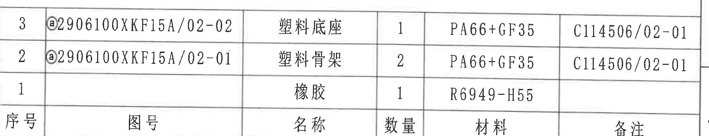

原图位置/视图名称：第 1 页右下区域上部，明细表。

### 原表还原

| 序号 | 图号 | 名称 | 数量 | 材料 | 备注 |
|---|---|---|---|---|---|
| 3 | ⓐ2906100XKF15A/02-02 | 塑料底座 | 1 | PA66+GF35 | C114506/02-01 |
| 2 | ⓐ2906100XKF15A/02-01 | 塑料骨架 | 2 | PA66+GF35 | C114506/02-01 |
| 1 |  | 橡胶 | 1 | R6949-H55 |  |

### 提取表格

| 提取项 | 原图数值或文本 | 含义说明 |
|---|---|---|
| 表头 | 序号、图号、名称、数量、材料、备注 | 明细表列名。 |
| 序号3 | ⓐ2906100XKF15A/02-02；塑料底座；1；PA66+GF35；C114506/02-01 | 塑料底座零件明细，带变更标记ⓐ。 |
| 序号2 | ⓐ2906100XKF15A/02-01；塑料骨架；2；PA66+GF35；C114506/02-01 | 塑料骨架零件明细，带变更标记ⓐ。 |
| 序号1 | 橡胶；1；R6949-H55 | 橡胶材料明细。 |

边界归属说明：裁切仅覆盖明细表本体；下方投影、比例、质量和产品号等标题栏字段已归入 object_11。

## object_11：标题栏

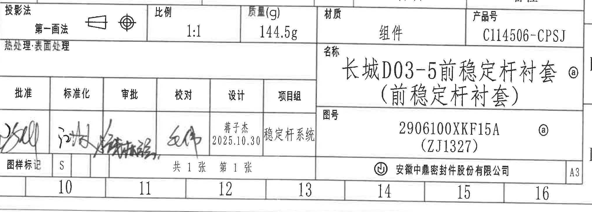

原图位置/视图名称：第 1 页右下区域，标题栏/签署栏。

### 提取表格

| 提取项 | 原图数值或文本 | 含义说明 |
|---|---|---|
| 投影法 | 第一画法 | 图纸投影方式。 |
| 比例 | 1:1 | 图纸比例。 |
| 质量(g) | 144.5g | 产品质量。 |
| 材质 | 组件 | 总成材质/对象类型。 |
| 产品号 | C114506-CPSJ | 产品号。 |
| 热处理/表面处理 | 热处理:表面处理 | 标题栏左侧处理栏文字；未见单独填写值。 |
| 名称 | 长城D03-5前稳定杆衬套（前稳定杆衬套）ⓐ | 产品名称，带变更标记ⓐ。 |
| 图号 | 2906100XKF15A ⓐ (ZJ1327) | 图号/客户图号，带变更标记ⓐ。 |
| 签署栏 | 批准、标准化、审批、校对、设计、项目组 | 签署栏字段。 |
| 设计 | 蒋子杰 2025.10.30 | 设计栏可辨识文本。 |
| 项目组 | 稳定杆系统 | 项目组栏可辨识文本。 |
| 图样标记 | S | 图样标记字段。 |
| 页码 | 共1张 第1张 | 图纸页数信息。 |
| 公司 | 安徽中鼎密封件股份有限公司 | 出图公司。 |
| 幅面 | A3 | 图纸幅面。 |

边界归属说明：裁切覆盖标题栏与签署栏，顶部保留与标题栏相连的投影法、比例、质量、材质、产品号区域；上方明细表物料行归入 object_10，不在本对象重复提取。

## 裁切检查记录

| 对象 | 图片路径 | 检查结果 |
|---|---|---|
| page_1 | outputs/20C114506_assets/images/page_1.png | 整页 PNG 渲染完整，尺寸 4959 x 3505 px。 |
| object_1 | outputs/20C114506_assets/images/object_1.png | 表1表头、列线、七行记录完整；左侧图框坐标不提取。 |
| object_2 | outputs/20C114506_assets/images/object_2.png | 表2表头、列线、六行记录完整；左侧图框坐标不提取。 |
| object_3 | outputs/20C114506_assets/images/object_3.png | 修订履历表列和两条记录完整；顶部坐标栏不提取。 |
| object_4 | outputs/20C114506_assets/images/object_4.png | 主视图尺寸线、箭头、A-A 标记、硬度测试面文字完整；右侧邻近剖视残片不归入主视图。 |
| object_5 | outputs/20C114506_assets/images/object_5.png | A-A 剖视图尺寸线、箭头、剖面线和半径文字完整；左边缘残字来自主视图，已排除归属。 |
| object_6 | outputs/20C114506_assets/images/object_6.png | 技术要求 1-5 条文字完整；右下邻近等轴测边缘不作为 NOTES 内容。 |
| object_7 | outputs/20C114506_assets/images/object_7.png | 未注公差表外框、表头和所有行完整。 |
| object_8 | outputs/20C114506_assets/images/object_8.png | 表3外框、表头和数据行完整，未混入邻近表格。 |
| object_9 | outputs/20C114506_assets/images/object_9.png | 等轴测图和 X/Y/Z 方向标完整，无外来表格片段。 |
| object_10 | outputs/20C114506_assets/images/object_10.png | 明细表/BOM 三行和表头完整；标题栏字段已排除。 |
| object_11 | outputs/20C114506_assets/images/object_11.png | 标题栏、签署栏、名称、图号、公司和幅面信息完整；上方明细物料行不归入本对象。 |
