# 20C114507 PDF内容识别

整页PNG: `outputs/20C114507_assets/images/page_1.png`。原PDF为1页A3扫描图,整页渲染尺寸4959 x 3505 px。以下对象均按整页PNG像素坐标裁切。

## object_1: 表1:橡胶材料试验

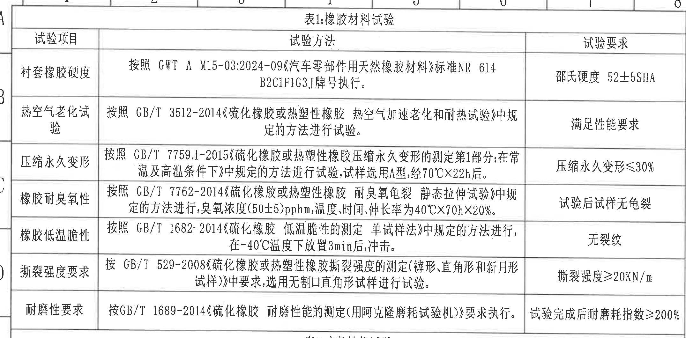

- 原图位置/视图名称: page 1, bbox `[360, 125, 2510, 1185]`, 表1:橡胶材料试验
- object_kind: `table`

表1:橡胶材料试验
|试验项目|试验方法|试验要求|
|---|---|---|
|衬套橡胶硬度|按照 GWT A M15-03:2024-09《汽车零部件用天然橡胶材料》标准 NR 614 B2C1F1G3J 牌号执行。|邵氏硬度 52±5SHA|
|热空气老化试验|按照 GB/T 3512-2014《硫化橡胶或热塑性橡胶 热空气加速老化和耐热试验》中规定的方法进行试验。|满足性能要求|
|压缩永久变形|按照 GB/T 7759.1-2015《硫化橡胶或热塑性橡胶压缩永久变形的测定第1部分:在常温及高温条件下》中规定的方法进行试验,试样选用A型,经70℃×22h后。|压缩永久变形≤30%|
|橡胶耐臭氧性|按照 GB/T 7762-2014《硫化橡胶或热塑性橡胶 耐臭氧龟裂 静态拉伸试验》中规定的方法进行,臭氧浓度(50±5)pphm,温度、时间、伸长率为40℃×70h×20%。|试验后试样无龟裂|
|橡胶低温脆性|按照 GB/T 1682-2014《硫化橡胶 低温脆性的测定 单试样法》中规定的方法进行,在-40℃温度下放置3min后,冲击。|无裂纹|
|撕裂强度要求|按 GB/T 529-2008《硫化橡胶或热塑性橡胶撕裂强度的测定(裤形、直角形和新月形试样)》中要求,选用无割口直角形试样进行试验。|撕裂强度≥20KN/m|
|耐磨性要求|按GB/T 1689-2014《硫化橡胶 耐磨性能的测定(用阿克隆磨耗试验机)》要求执行。|试验完成后耐磨耗指数≥200%|

边界归属说明: 位于页面左上 A-D 区域。裁切包含表1完整表头、三列表格和全部7项橡胶材料试验要求；顶部/左侧少量图框坐标不是表格内容。

## object_2: 表2:产品性能试验

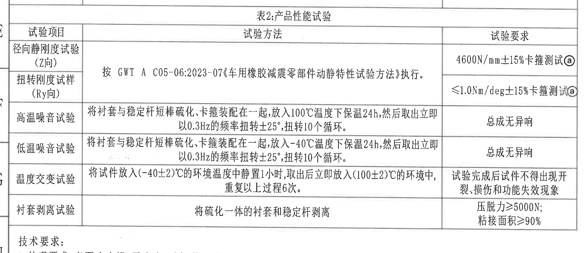

- 原图位置/视图名称: page 1, bbox `[360, 1140, 2545, 2080]`, 表2:产品性能试验
- object_kind: `table`

表2:产品性能试验
|试验项目|试验方法|试验要求|
|---|---|---|
|径向静刚度试验(Z向)|按 GWT A C05-06:2023-07《车用橡胶减震零部件动静特性试验方法》执行。|4600N/mm±15%卡箍测试@|
|扭转刚度试样(Ry向)|按 GWT A C05-06:2023-07《车用橡胶减震零部件动静特性试验方法》执行。|≤1.0Nm/deg±15%卡箍测试@|
|高温噪音试验|将衬套与稳定杆短棒硫化、卡箍装配在一起,放入100℃温度下保温24h,然后取出立即以0.3Hz的频率扭转±25°,扭转10个循环。|总成无异响|
|低温噪音试验|将衬套与稳定杆短棒硫化、卡箍装配在一起,放入-40℃温度下保温24h,然后取出立即以0.3Hz的频率扭转±25°,扭转10个循环。|总成无异响|
|温度交变试验|将试件放入(-40±2)℃的环境温度中静置1小时,取出后立即放入(100±2)℃的环境中,重复以上过程6次。|试验完成后试件不得出现开裂、损伤和功能失效现象|
|衬套剥离试验|将硫化一体的衬套和稳定杆剥离|压脱力≥5000N; 粘接面积≥90%|

边界归属说明: 位于页面左中 E-G 区域。表2下方紧邻技术要求，裁切只提取表格主体；试验要求列中的@为图面圈注标识，关联图中圈a/变更标记。

## object_3: 技术要求

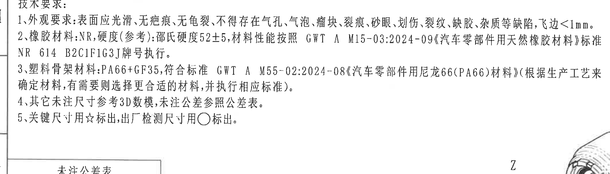

- 原图位置/视图名称: page 1, bbox `[365, 2025, 2495, 2635]`, 技术要求
- object_kind: `notes`

技术要求:
1、外观要求:表面应光滑,无疤痕、无龟裂,不得存在气孔、气泡、瘤块、裂痕、砂眼、划伤、裂纹、缺胶、杂质等缺陷,飞边<1mm。
2、橡胶材料:NR,硬度(参考):邵氏硬度52±5,材料性能按照 GWT A M15-03:2024-09《汽车零部件用天然橡胶材料》标准 NR 614 B2C1F1G3J牌号执行。
3、塑料骨架材料:PA66+GF35,符合标准 GWT A M55-02:2024-08《汽车零部件用尼龙66(PA66)材料》(根据生产工艺来确定材料,有需要则选择更合适的材料,并执行相应标准)。
4、其它未注尺寸参考3D数模,未注公差参照公差表。
5、关键尺寸用☆标出,出厂检测尺寸用○标出。

边界归属说明: 位于页面左中 H-I 区域。技术要求是连续文本对象；右下角邻近三维参考图，裁切未按该角落提取三维内容。

## object_4: 未注公差表

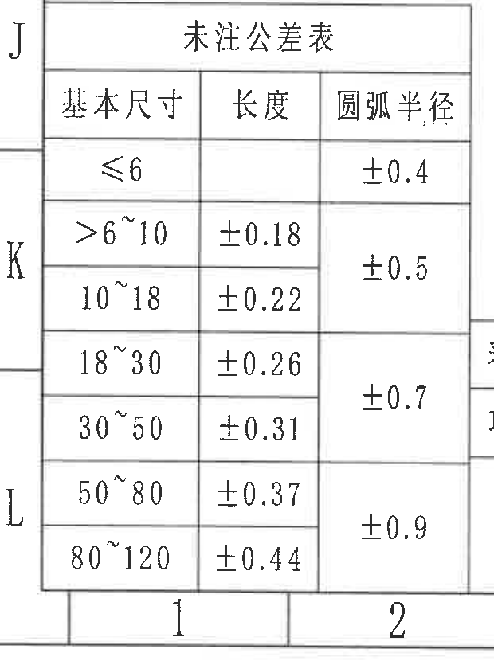

- 原图位置/视图名称: page 1, bbox `[335, 2580, 955, 3410]`, 未注公差表
- object_kind: `table`

未注公差表
|基本尺寸|长度|圆弧半径|
|---|---|---|
|≤6||±0.4|
|>6~10|±0.18|±0.5|
|10~18|±0.22|±0.5|
|18~30|±0.26|±0.7|
|30~50|±0.31|±0.7|
|50~80|±0.37|±0.9|
|80~120|±0.44|±0.9|

边界归属说明: 位于页面左下 J-L 区域。表内圆弧半径公差为合并单元: ≤6对应±0.4, >6~18对应±0.5, 18~50对应±0.7, 50~120对应±0.9；左侧J/K/L和底部1/2为图框坐标。

## object_5: 表3:产品信息

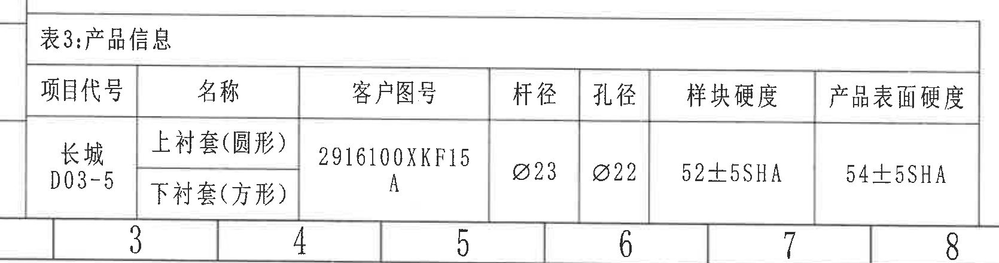

- 原图位置/视图名称: page 1, bbox `[880, 2960, 2550, 3400]`, 表3:产品信息
- object_kind: `table`

表3:产品信息
|项目代号|名称|客户图号|杆径|孔径|样块硬度|产品表面硬度|
|---|---|---|---|---|---|---|
|长城 D03-5|上衬套(圆形) / 下衬套(方形)|2916100XXF15 A|Ø23|Ø22|52±5SHA|54±5SHA|

边界归属说明: 位于页面底部左中 L 区域。该表给出产品项目、客户图号、杆径/孔径和硬度信息；底部图框数字3-8不是表格字段。

## object_6: 修订/变更履历表

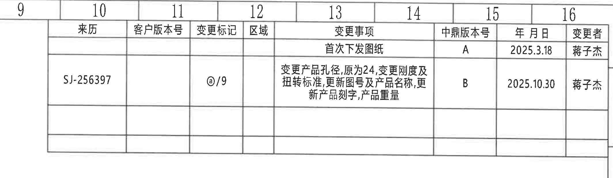

- 原图位置/视图名称: page 1, bbox `[2685, 95, 4815, 715]`, 修订/变更履历表
- object_kind: `table`

修订/变更履历表
|来历|客户版本号|变更标记|区域|变更事项|中鼎版本号|年 月 日|变更者|
|---|---|---|---|---|---|---|---|
|||||首次下发图纸|A|2025.3.18|蒋子杰|
|SJ-256397||@/9||变更产品孔径,原为24,变更刚度及扭转标准,更新图号及产品名称,更新产品刻字,产品重量|B|2025.10.30|蒋子杰|

边界归属说明: 位于页面右上 A-B 区域。裁切完整包含来历、客户版本号、变更标记、区域、变更事项、中鼎版本号、年月日、变更者列；顶部9-16为图框列坐标。

## object_7: 主加工视图/正视图

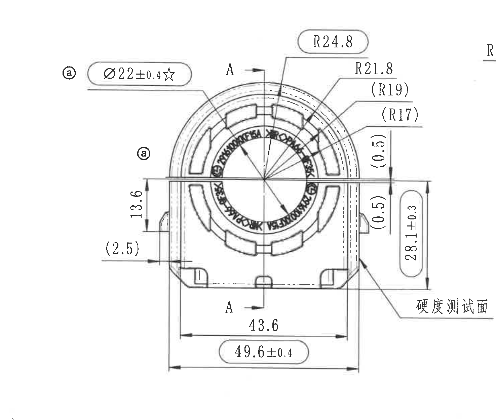

- 原图位置/视图名称: page 1, bbox `[2530, 820, 4005, 2070]`, 主加工视图/正视图
- object_kind: `view`

主加工视图/正视图尺寸与标注:
|提取项|原图数值或文本|含义说明|
|---|---|---|
|圈注标识|@ / 圈a|与变更标记、卡箍测试标识相关的图面标记。|
|孔径关键尺寸|Ø22±0.4☆|孔径直径22,公差±0.4; ☆表示关键尺寸。|
|剖切位置|A-A / A|A-A剖面切线位置,上下A箭头表示剖视方向。|
|外圆弧半径|R24.8|外侧圆弧半径。|
|圆弧半径|R21.8|内侧/中间圆弧半径。|
|参考圆弧半径|(R19)|括号内参考尺寸,用于说明对应弧线的参考半径。|
|参考圆弧半径|(R17)|括号内参考尺寸,用于说明对应弧线的参考半径。|
|局部台阶参考尺寸|(0.5)|右侧上方局部台阶/间隙参考尺寸。|
|局部台阶参考尺寸|(0.5)|右侧下方局部台阶/间隙参考尺寸。|
|左侧高度尺寸|13.6|左侧局部高度/台阶间距尺寸。|
|左下参考尺寸|(2.5)|括号内参考尺寸,表示左下局部壁厚/间距参考值。|
|总高度/侧向高度|28.1±0.3|主视图右侧竖向高度尺寸,公差±0.3。|
|内宽尺寸|43.6|底部内侧宽度尺寸。|
|外宽尺寸|49.6±0.4|底部外侧宽度尺寸,公差±0.4。|
|检测面标注|硬度测试面|箭头指向右下侧外表面,说明硬度测试位置。|

边界归属说明: 位于页面右中 D-G 区域。只提取主视图自身尺寸、圈注和A-A剖切标识；右边缘残留的相邻剖面R标注片段不归入主视图。所有括号尺寸按参考尺寸记录。

## object_8: A-A剖面视图

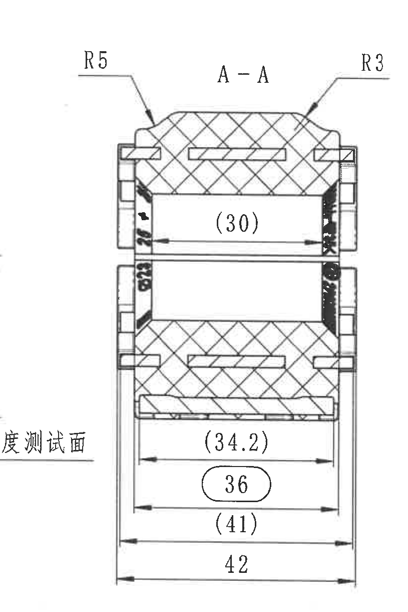

- 原图位置/视图名称: page 1, bbox `[3810, 850, 4625, 2070]`, A-A剖面视图
- object_kind: `section`

A-A剖面视图尺寸与标注:
|提取项|原图数值或文本|含义说明|
|---|---|---|
|剖面名称|A-A|对应主视图中A-A剖切位置。|
|左上圆角半径|R5|剖面左上外轮廓圆角半径。|
|右上圆角半径|R3|剖面右上外轮廓圆角半径。|
|参考内腔宽度|(30)|括号内参考尺寸,表示剖面上部内腔/通道宽度参考值。|
|参考宽度|(34.2)|括号内参考尺寸,表示底部区域内侧参考宽度。|
|宽度尺寸|36|椭圆框标出,表示剖面底部中间宽度,与出厂检测/重点控制标识相关。|
|参考宽度|(41)|括号内参考尺寸,表示较外侧参考宽度。|
|总宽度|42|最外侧总宽度尺寸。|

边界归属说明: 位于页面右中 D-G 区域,在主视图右侧。只提取A-A剖面内的剖面线、半径和宽度尺寸；左边缘可见的主视图“硬度测试面”等片段不归入剖面。所有括号尺寸按参考尺寸记录。

## object_9: 三维参考/坐标方向局部视图

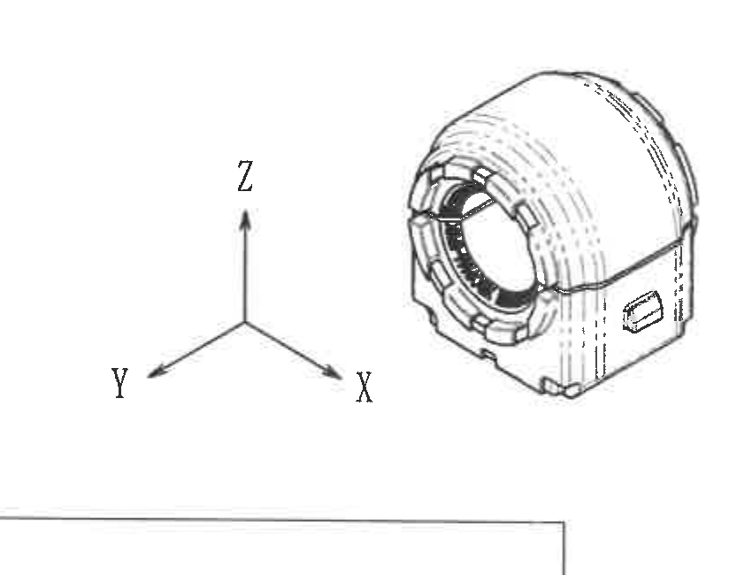

- 原图位置/视图名称: page 1, bbox `[1880, 2405, 2730, 3055]`, 三维参考/坐标方向局部视图
- object_kind: `detail`

三维参考/坐标方向局部视图
|提取项|原图数值或文本|含义说明|
|---|---|---|
|坐标轴|X、Y、Z|表示三维模型方向。|
|局部模型|衬套三维外形|用于表达零件立体形状和开口/卡槽外观,未在该局部图中给出尺寸数值。|

边界归属说明: 位于页面下中 J-K 区域。该局部视图是三维参考图,底部带入一小段标题栏上边框,不作为局部视图内容提取。

## object_10: 明细/BOM表

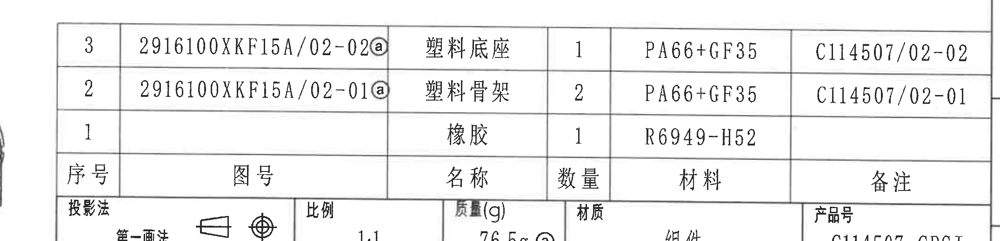

- 原图位置/视图名称: page 1, bbox `[2660, 2320, 4810, 2840]`, 明细/BOM表
- object_kind: `table`

明细/BOM表
|序号|图号|名称|数量|材料|备注|
|---|---|---|---|---|---|
|3|2916100XXF15A/02-02@|塑料底座|1|PA66+GF35|C114507/02-02|
|2|2916100XXF15A/02-01@|塑料骨架|2|PA66+GF35|C114507/02-01|
|1||橡胶|1|R6949-H52||

边界归属说明: 位于页面右下 I-J 区域。裁切上半部分为BOM明细,下方进入标题栏；本对象只提取序号、图号、名称、数量、材料、备注。图号后的@为图面圈注/变更相关标识。

## object_11: 标题栏

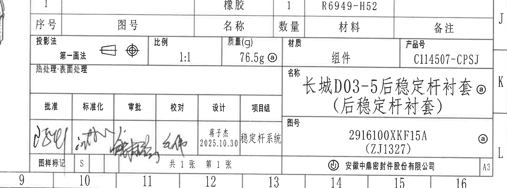

- 原图位置/视图名称: page 1, bbox `[2650, 2590, 4850, 3410]`, 标题栏
- object_kind: `title_block`

标题栏
|字段|原图文本|含义说明|
|---|---|---|
|投影法|第一画法|图样投影方法。|
|比例|1:1|绘图比例。|
|质量(g)|76.5g @|产品质量,带圈注标识。|
|材质|组件|总成/组件材质栏。|
|产品号|C114507-CPSJ|产品编号。|
|热处理/表面处理|空白|图面未填写具体处理内容。|
|名称|长城D03-5后稳定杆衬套@(后稳定杆衬套)|产品名称; @为圈注/变更标识。|
|图号|2916100XXF15A (ZJ1327) @|图样编号及括号内编号,带圈注标识。|
|批准/标准化/审批/校对|签名|图面有手写签署。|
|设计|蒋子杰 2025.10.30|设计人员及日期。|
|项目组|稳定杆系统|项目组/系统名称。|
|图样标记|S|图样标记字段。|
|页码|共1张 第1张|总页数和当前页。|
|公司|安徽中鼎密封件股份有限公司|出图公司。|
|幅面|A3|图纸幅面。|

边界归属说明: 位于页面右下 J-L 区域。裁切包含标题栏字段和签署栏；上方BOM最后一行边界可见,但BOM明细不在本对象重复提取。

## 裁切检查记录

|对象|名称|检查结果|
|---|---|---|
|object_1|表1:橡胶材料试验|完整包含表头、三列表格、7行试验项目及右侧试验要求；顶部/左侧图框坐标为边缘背景,不作为表格内容。|
|object_2|表2:产品性能试验|完整包含表头、三列表格、6行试验项目及右侧@标识；下方技术要求另裁为object_3。|
|object_3|技术要求|完整包含1-5条技术要求文字；右下邻近三维图边缘不提取为NOTES内容。|
|object_4|未注公差表|完整包含表题、表头和所有公差行；左侧J/K/L及底部1/2为图框坐标,不属于表格。|
|object_5|表3:产品信息|完整包含表3标题、字段和值；底部图框数字不作为表格字段。|
|object_6|修订/变更履历表|完整包含表头、A/B两条变更记录及变更者列；顶部9-16为图框坐标。|
|object_7|主加工视图/正视图|完整包含主视图尺寸线、箭头、文字、A-A剖切线和硬度测试面；右边缘残缺R为A-A剖面标注片段,未提取到主视图。|
|object_8|A-A剖面视图|完整包含A-A剖面尺寸线、箭头、文字、R5/R3及底部宽度尺寸；左边缘硬度测试面片段属主视图,未提取到剖面。|
|object_9|三维参考/坐标方向局部视图|完整包含X/Y/Z坐标和三维模型轮廓；底部标题栏边框不作为局部视图内容。|
|object_10|明细/BOM表|完整包含序号、图号、名称、数量、材料、备注列和三条明细；下方标题栏另裁为object_11。|
|object_11|标题栏|完整包含投影法、比例、质量、材质、产品号、名称、图号、签署栏、页码、公司和幅面。|
