# 20C114518 PDF 内容识别

源文件：`input/20C114518.pdf`  
整页渲染图：`outputs/20C114518_assets/images/page_1.png`  
页面：1，整页 PNG 尺寸：4959 x 3505 px。本文所有 bbox 坐标采用 `[x, y, width, height]`，基于整页 PNG 像素坐标。

## object_1 - 完全代用品信息表

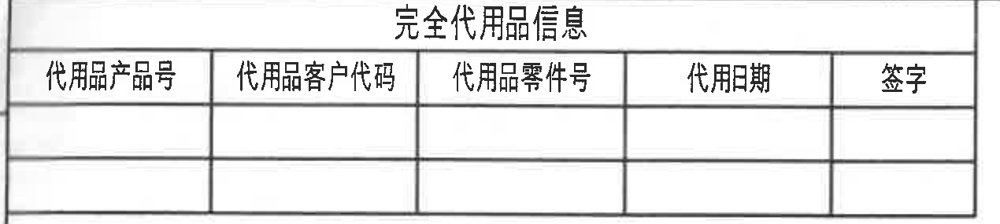

原图位置/视图名称：页面左上，完全代用品信息表；bbox `[320, 165, 1270, 285]`；object_kind `table`。

原表格还原：

| 代用品产品号 | 代用品客户代码 | 代用品零件号 | 代用日期 | 签字 |
|---|---|---|---|---|
|  |  |  |  |  |
|  |  |  |  |  |

提取表格：

| 提取项 | 原图数值或文本 | 含义说明 |
|---|---|---|
| 表题 | 完全代用品信息 | 用于记录可完全代用产品的信息。 |
| 列名 | 代用品产品号、代用品客户代码、代用品零件号、代用日期、签字 | 表格字段。 |
| 数据行 | 2 行空白 | 原图未填写代用品记录。 |

边界归属说明：裁切只包含左上代用品表外框、表题、列头和两行空白记录；上方图框坐标编号未纳入表格内容。

## object_2 - 变更履历表

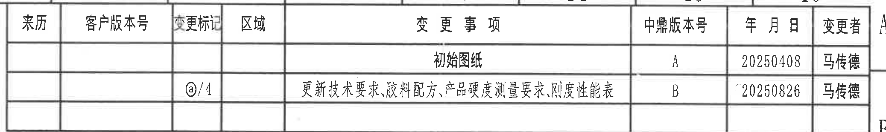

原图位置/视图名称：页面右上，变更履历/变更事项表；bbox `[2705, 160, 2075, 310]`；object_kind `table`。

原表格还原：

| 来历 | 客户版本号 | 变更标记 | 区域 | 变更事项 | 中鼎版本号 | 年月日 | 变更者 |
|---|---|---|---|---|---|---|---|
|  |  |  |  | 初始图纸 | A | 20250408 | 马传德 |
|  |  | @/4 |  | 更新技术要求、胶料配方、产品硬度测量要求、刚度性能表 | B | 20250826 | 马传德 |
|  |  |  |  |  |  |  |  |

提取表格：

| 提取项 | 原图数值或文本 | 含义说明 |
|---|---|---|
| 表头 | 来历、客户版本号、变更标记、区域、变更事项、中鼎版本号、年月日、变更者 | 修订履历字段。 |
| A 版记录 | 初始图纸；中鼎版本号 A；20250408；马传德 | 初始发布记录。 |
| B 版记录 | 变更标记 @/4；更新技术要求、胶料配方、产品硬度测量要求、刚度性能表；中鼎版本号 B；20250826；马传德 | 后续变更记录，@/4 对应技术要求标注位置。 |

边界归属说明：裁切只包含变更履历表内部行列；右侧图框字母和顶部坐标编号不作为表格字段提取。

## object_3 - 硬度测量位置局部示意

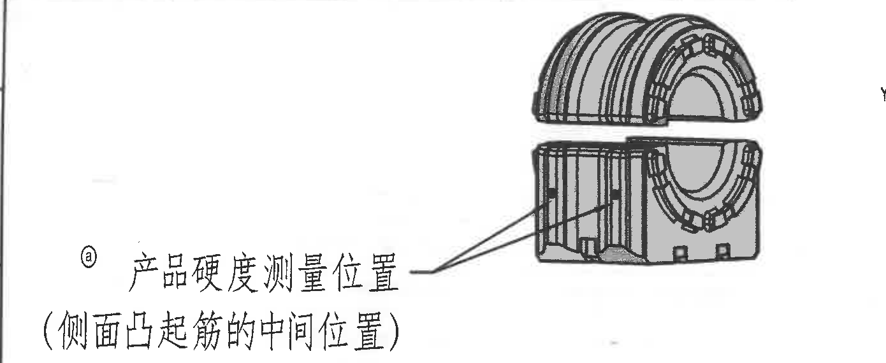

原图位置/视图名称：页面左上偏中，产品硬度测量位置局部示意；bbox `[320, 445, 1390, 570]`；object_kind `detail`。

提取表格：

| 提取项 | 原图数值或文本 | 含义说明 |
|---|---|---|
| 技术标记 | @ | 与技术要求和修订履历中的 @ 标记对应。 |
| 说明文字 | 产品硬度测量位置 | 指出硬度测量的取点位置。 |
| 位置说明 | （侧面凸起筋的中间位置） | 硬度测量应在侧面凸起筋的中间位置进行。 |
| 局部图形 | 衬套侧面凸起筋示意，箭头指向侧面筋位 | 该示意图不包含尺寸线，仅用于测量位置定位。 |

边界归属说明：裁切完整包含局部示意图、箭头和两行说明文字；未把下方主视图尺寸归入本局部示意。

## object_4 - 三维外观视图

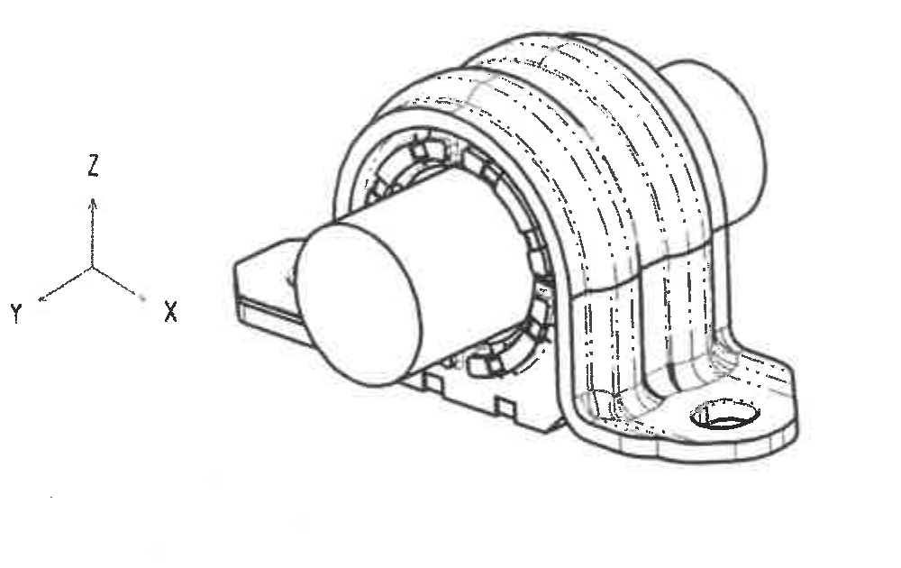

原图位置/视图名称：页面上中，三维外观视图；bbox `[1690, 245, 1000, 630]`；object_kind `view`。

提取表格：

| 提取项 | 原图数值或文本 | 含义说明 |
|---|---|---|
| 视图类型 | 三维外观视图 | 显示衬套装配外形、底座脚位、中心杆/杆径方向和橡胶衬套轮廓。 |
| 坐标方向 | X、Y、Z | 图中给出三维方向参考；无数值尺寸。 |
| 可见结构 | 弧形橡胶衬套、侧向凸起筋、底座脚孔、中心圆柱杆示意 | 用于辅助理解加工视图中的前后、上下和杆向关系。 |

边界归属说明：裁切完整包含三维产品图和 X/Y/Z 坐标轴；未带入右侧 NOTES 正文。

## object_5 - 主剖视图 / 正面加工视图

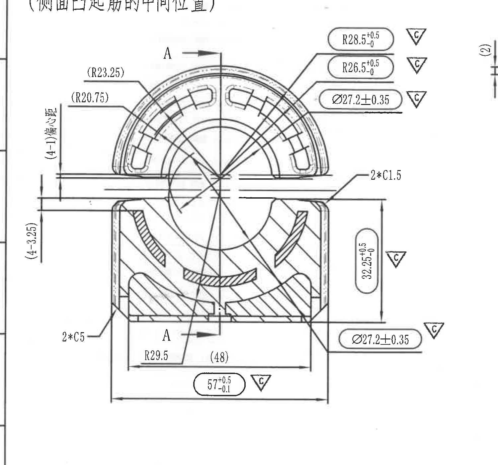

原图位置/视图名称：页面左中主剖视图，含 A-A 剖切指示；bbox `[300, 960, 1500, 1400]`；object_kind `section`。

提取表格：

| 提取项 | 原图数值或文本 | 含义说明 |
|---|---|---|
| 参考半径 | (R23.25) | 括号内参考尺寸，位于上半圆左上外侧弧线，用于说明外侧弧形轮廓半径。 |
| 参考半径 | (R20.75) | 括号内参考尺寸，位于上半圆左侧内侧弧线，用于说明内侧弧形轮廓半径。 |
| 半径关键尺寸 | R28.5 +0.5/-0，旁有 C 三角标记 | 上部外弧/胶套弧面半径，关键特性尺寸。 |
| 半径关键尺寸 | R26.5 +0.5/-0，旁有 C 三角标记 | 上部内弧/相邻弧面半径，关键特性尺寸。 |
| 直径关键尺寸 | Ø27.2±0.35，旁有 C 三角标记 | 上部圆弧/孔径相关直径尺寸，关键特性尺寸。 |
| 倒角数量尺寸 | 2*C1.5 | 右上平台处 2 处 C1.5 倒角。 |
| 偏心/高度参考 | (4-1) 偏心量 | 左侧上部竖向参考标注，表示上部两水平基准之间的偏心量/相对间距；括号表示参考含义。 |
| 参考高度 | (4-3.25) | 左侧下部竖向参考标注，表示相邻水平线之间的参考高度/差值。 |
| 高度关键尺寸 | 32.25 +0.5/-0，旁有 C 三角标记 | 右侧竖向高度尺寸，从上平台附近到下基准线，关键特性尺寸。 |
| 直径关键尺寸 | Ø27.2±0.35，旁有 C 三角标记 | 下部右侧重复标注的圆孔/杆径相关直径尺寸，关键特性尺寸。 |
| 倒角数量尺寸 | 2*C5 | 左下角处 2 处 C5 倒角。 |
| 半径 | R29.5 | 下部内侧圆弧/过渡弧半径。 |
| 参考宽度 | (48) | 括号内参考宽度，位于下方内侧两竖向界线之间。 |
| 总宽关键尺寸 | 57 +0.5/-0.1，旁有 C 三角标记 | 底部整体宽度/外侧宽度，关键特性尺寸。 |
| 剖切标识 | A、A | 两处 A 箭头标识剖切位置和方向，对应下方/右侧剖面视图。 |

边界归属说明：裁切包含主剖视图全部尺寸线、箭头、C 关键特性三角标记和 A 剖切标识；右侧相邻剖面图中的 `(2)` 标注虽在边界附近，已按尺寸线归属剔除，不归入主视图。

## object_6 - 上方横向剖面视图

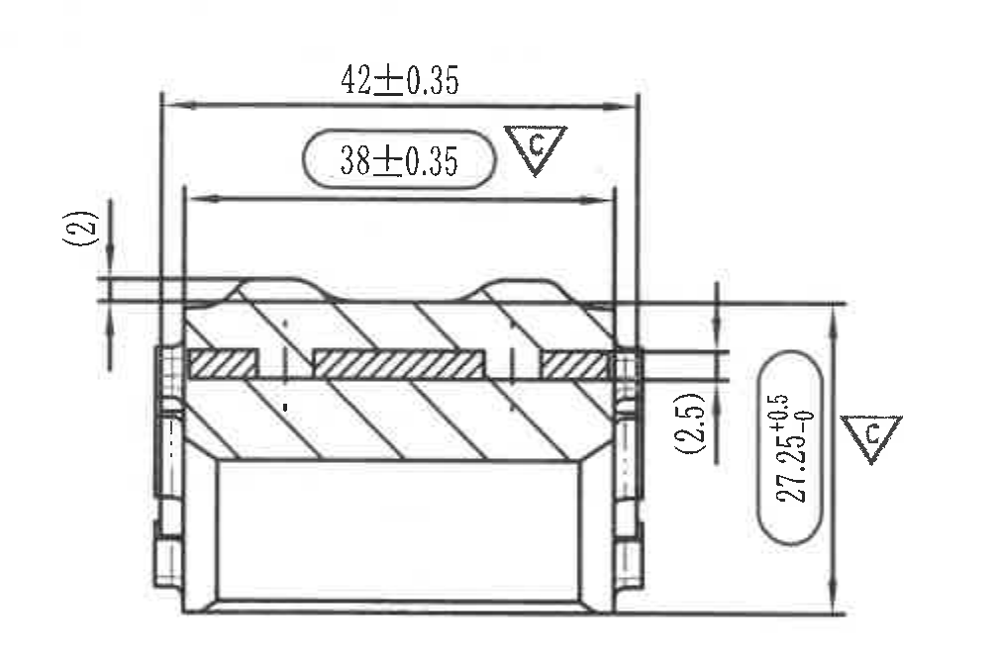

原图位置/视图名称：页面中部右侧，上方横向剖面视图；bbox `[1680, 880, 1010, 665]`；object_kind `section`。

提取表格：

| 提取项 | 原图数值或文本 | 含义说明 |
|---|---|---|
| 外宽尺寸 | 42±0.35 | 上方总宽/外侧宽度尺寸。 |
| 内宽关键尺寸 | 38±0.35，旁有 C 三角标记 | 内侧宽度或装配控制宽度，关键特性尺寸。 |
| 参考厚度 | (2) | 左侧竖向括号参考尺寸，表示局部薄层/间隙厚度。 |
| 参考厚度 | (2.5) | 右侧竖向括号参考尺寸，表示局部薄层/间隙厚度。 |
| 竖向关键尺寸 | 27.25 +0.5/-0，旁有 C 三角标记 | 右侧总高度/剖面高度，关键特性尺寸。 |
| 剖面信息 | 斜线剖面填充和内部嵌件/橡胶层 | 表示剖切后材料层和内部结构关系。 |

边界归属说明：裁切右边界止于 C 三角标记外侧，未带入右侧技术要求正文；左侧 `(2)` 的尺寸线和箭头完整保留。

## object_7 - 下方 A-A 剖面视图

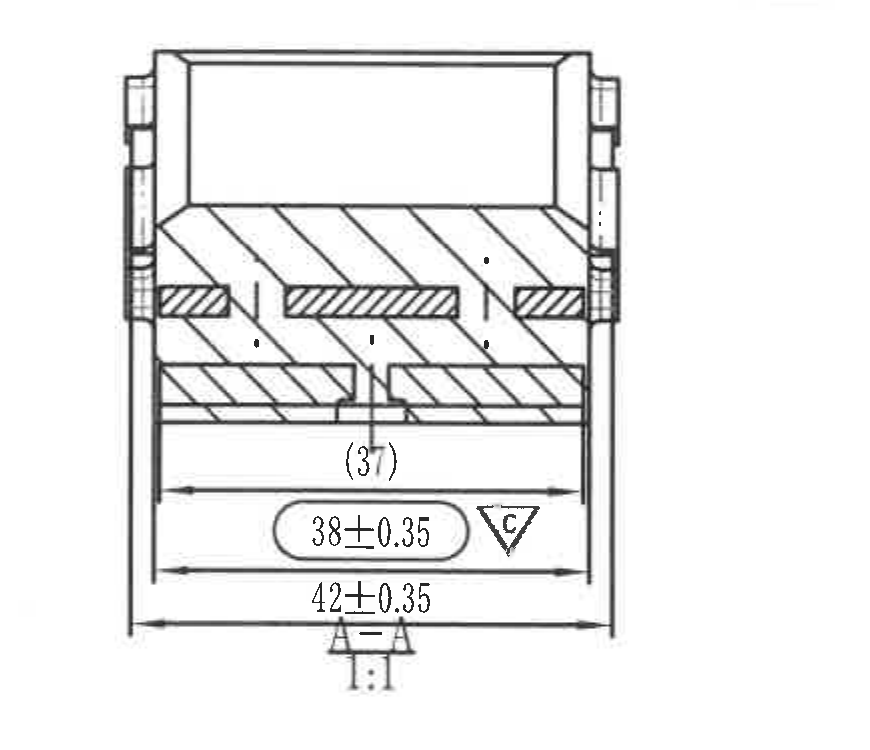

原图位置/视图名称：页面中部右侧，下方 A-A 剖面视图；bbox `[1710, 1510, 870, 750]`；object_kind `section`。

提取表格：

| 提取项 | 原图数值或文本 | 含义说明 |
|---|---|---|
| 参考宽度 | (37) | 括号内参考尺寸，位于内部水平尺寸线附近，表示内侧参考宽度。 |
| 内宽关键尺寸 | 38±0.35，旁有 C 三角标记 | 内侧宽度或装配控制宽度，关键特性尺寸。 |
| 外宽尺寸 | 42±0.35 | 下方外侧宽度/总宽度尺寸。 |
| 剖面标识 | A-A，1:1 | A-A 剖面，比例 1:1。 |
| 剖面信息 | 斜线剖面填充、中心缺口和底部层状结构 | 表示下方剖面结构和材料分布。 |

边界归属说明：裁切去除了右侧 NOTES 行号和 C 标记片段，只保留本 A-A 剖面及其尺寸；底部 A-A 与 1:1 标识完整可见。

## object_8 - NOTES / 技术要求

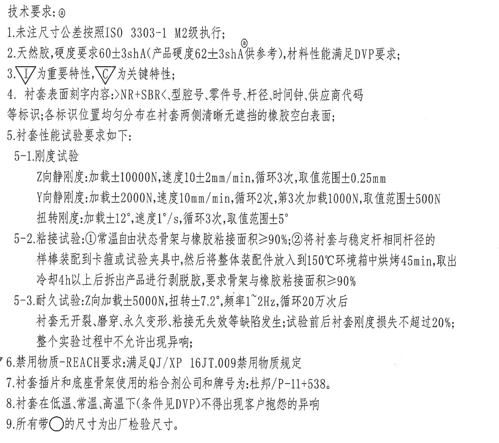

原图位置/视图名称：页面右中，技术要求文本区；bbox `[2690, 570, 1960, 1740]`；object_kind `notes`。

提取表格：

| 提取项 | 原图数值或文本 | 含义说明 |
|---|---|---|
| 标题 | 技术要求：@ | 技术要求区域，@ 与修订履历/硬度测量局部标注对应。 |
| 1 | 未注尺寸公差按照 ISO 3303-1 M2级执行； | 未单独标注的尺寸公差按该标准和等级执行。 |
| 2 | 天然胶，硬度要求 60±3shA（产品硬度 62±3shA 供参考），材料性能满足 DVP 要求； | 材料硬度要求；括号内产品硬度为参考值。 |
| 3 | 三角 I 为重要特性，三角 C 为关键特性； | 解释图中三角标记含义。 |
| 4 | 衬套表面刻字内容：>NR+SBR<、型腔号、零件号、杆径、时间钟、供应商代码等标识；各标识位置均匀分布在衬套两侧清晰无遮拦的橡胶空白表面； | 衬套表面标识内容和布置要求。 |
| 5 | 衬套性能试验要求如下： | 后续刚度、粘接、耐久试验的总引导项。 |
| 5-1 Z向静刚度 | 加载±10000N，速度10±2mm/min，循环3次，取值范围±0.25mm | Z 向静刚度试验条件和取值范围。 |
| 5-1 Y向静刚度 | 加载±2000N，速度10mm/min，循环2次，第3次加载1000N，取值范围±500N | Y 向静刚度试验条件和取值范围。 |
| 5-1 扭转刚度 | 加载±12°，速度1°/s，循环3次，取值范围±5° | 扭转刚度试验条件和取值范围。 |
| 5-2 粘接试验 ① | 常温自由状态骨架与橡胶粘接面积≥90% | 常温粘接面积要求。 |
| 5-2 粘接试验 ② | 将衬套与稳定杆相同杆径的样棒装配到卡箍或试验夹具中，然后将整体装配件放入到150℃环境箱中烘烤45min，取出冷却4h以上后拆出产品进行剥脱胶，要求骨架与橡胶粘接面积≥90% | 热处理后剥脱胶粘接面积要求。 |
| 5-3 耐久试验 | Z向加载±5000N，扭转±7.2°，频率1~2Hz，循环20万次后衬套无开裂、磨穿、永久变形、粘接无失效等缺陷发生；试验前后衬套刚度损失不超过20%；整个实验过程中不允许出现异响； | 耐久载荷、扭转、频率、循环次数和失效判定要求。 |
| 6 | 禁用物质-REACH要求：满足 QJ/XP 16JT.009 禁用物质规定 | 禁用物质合规要求。 |
| 7 | 衬套插片和底座骨架使用的粘合剂公司和牌号为：杜邦/P-11+538。 | 粘合剂供应商和牌号要求。 |
| 8 | 衬套在低温、常温、高温下（条件见DVP）不得出现客户抱怨的异响 | 环境条件下异响要求。 |
| 9 | 所有带○的尺寸为出厂检验尺寸。 | 圆圈标注尺寸为出厂检验尺寸。 |

边界归属说明：裁切只包含技术要求正文，未纳入中间剖面图尺寸；左下边缘有扫描阴影，但第 9 条文字完整。

## object_9 - 刚度性能试验表

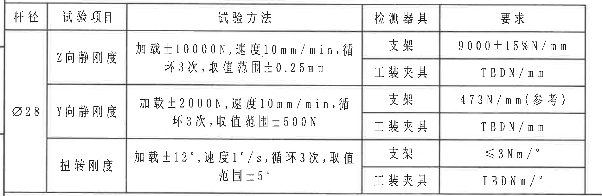

原图位置/视图名称：页面左下，刚度性能试验表；bbox `[300, 2370, 1900, 620]`；object_kind `table`。

原表格还原（原图存在合并单元格，Markdown 中按行展开，保留原字段和行序）：

| 杆径 | 试验项目 | 试验方法 | 检测器具 | 要求 |
|---|---|---|---|---|
| Ø28 | Z向静刚度 | 加载±10000N，速度10mm/min，循环3次，取值范围±0.25mm | 支架 | 9000±15%N/mm |
| Ø28 | Z向静刚度 | 同上 | 工装夹具 | TBDN/mm |
| Ø28 | Y向静刚度 | 加载±2000N，速度10mm/min，循环3次，取值范围±500N | 支架 | 473N/mm（参考） |
| Ø28 | Y向静刚度 | 同上 | 工装夹具 | TBDN/mm |
| Ø28 | 扭转刚度 | 加载±12°，速度1°/s，循环3次，取值范围±5° | 支架 | ≤3Nm/° |
| Ø28 | 扭转刚度 | 同上 | 工装夹具 | TBDNm/° |

提取表格：

| 提取项 | 原图数值或文本 | 含义说明 |
|---|---|---|
| 杆径 | Ø28 | 试验对应杆径。 |
| Z向静刚度要求 | 9000±15%N/mm（支架）；TBDN/mm（工装夹具） | Z 向静刚度判定要求。 |
| Y向静刚度要求 | 473N/mm（参考）（支架）；TBDN/mm（工装夹具） | Y 向静刚度判定要求；473N/mm 为参考值。 |
| 扭转刚度要求 | ≤3Nm/°（支架）；TBDNm/°（工装夹具） | 扭转刚度判定要求。 |

边界归属说明：裁切包含完整表头、合并单元格和表格边框；未包含下方 DIN ISO 公差表。

## object_10 - DIN ISO 3302-1 Class M2 公差表

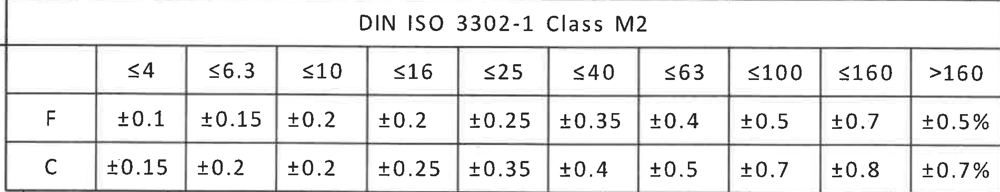

原图位置/视图名称：页面左下，DIN ISO 3302-1 Class M2 公差表；bbox `[300, 2985, 1900, 365]`；object_kind `table`。

原表格还原：

|  | ≤4 | ≤6.3 | ≤10 | ≤16 | ≤25 | ≤40 | ≤63 | ≤100 | ≤160 | >160 |
|---|---|---|---|---|---|---|---|---|---|---|
| F | ±0.1 | ±0.15 | ±0.2 | ±0.2 | ±0.25 | ±0.35 | ±0.4 | ±0.5 | ±0.7 | ±0.5% |
| C | ±0.15 | ±0.2 | ±0.2 | ±0.25 | ±0.35 | ±0.4 | ±0.5 | ±0.7 | ±0.8 | ±0.7% |

提取表格：

| 提取项 | 原图数值或文本 | 含义说明 |
|---|---|---|
| 标准表题 | DIN ISO 3302-1 Class M2 | 橡胶制品未注尺寸公差等级表。 |
| F 行 | ±0.1、±0.15、±0.2、±0.2、±0.25、±0.35、±0.4、±0.5、±0.7、±0.5% | F 类尺寸对应各尺寸段公差。 |
| C 行 | ±0.15、±0.2、±0.2、±0.25、±0.35、±0.4、±0.5、±0.7、±0.8、±0.7% | C 类尺寸对应各尺寸段公差。 |

边界归属说明：裁切只包含公差表；底部图框坐标编号未作为表格内容提取。

## object_11 - 零件明细表

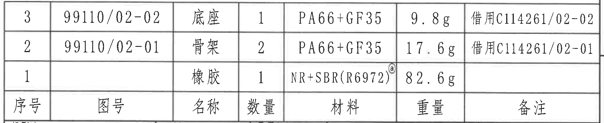

原图位置/视图名称：页面右下上部，零件明细表；bbox `[2700, 2345, 2050, 420]`；object_kind `table`。

原表格还原（原图行序为 3、2、1，表头位于下方；Markdown 表格使用原表头并保留原行序）：

| 序号 | 图号 | 名称 | 数量 | 材料 | 重量 | 备注 |
|---|---|---|---|---|---|---|
| 3 | 99110/02-02 | 底座 | 1 | PA66+GF35 | 9.8g | 借用C114261/02-02 |
| 2 | 99110/02-01 | 骨架 | 2 | PA66+GF35 | 17.6g | 借用C114261/02-01 |
| 1 |  | 橡胶 | 1 | NR+SBR(R6972)@ | 82.6g |  |

提取表格：

| 提取项 | 原图数值或文本 | 含义说明 |
|---|---|---|
| 表头 | 序号、图号、名称、数量、材料、重量、备注 | 零件明细字段。 |
| 序号 3 | 图号 99110/02-02；底座；数量 1；PA66+GF35；9.8g；借用C114261/02-02 | 底座零件明细。 |
| 序号 2 | 图号 99110/02-01；骨架；数量 2；PA66+GF35；17.6g；借用C114261/02-01 | 骨架零件明细。 |
| 序号 1 | 橡胶；数量 1；NR+SBR(R6972)@；82.6g | 橡胶零件明细，@ 对应技术要求标注。 |

边界归属说明：裁切完整包含明细表行列和下方表头；未带入标题栏投影法、比例、名称等字段。

## object_12 - 标题栏

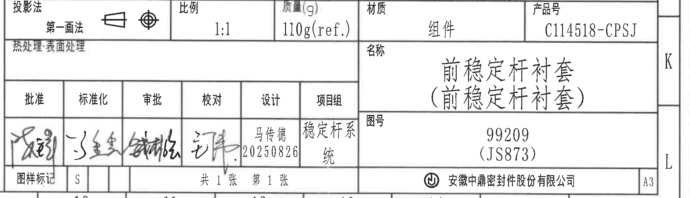

原图位置/视图名称：页面右下标题栏；bbox `[2700, 2760, 2135, 615]`；object_kind `title_block`。

提取表格：

| 提取项 | 原图数值或文本 | 含义说明 |
|---|---|---|
| 投影法 | 第一画法；含投影符号 | 工程图投影方法。 |
| 比例 | 1:1 | 图样比例。 |
| 质量(g) | 110g(ref.) | 组件质量，括号 ref. 表示参考质量。 |
| 材质 | 组件 | 标题栏材质/对象类型字段。 |
| 产品号 | C114518-CPSJ | 产品编号。 |
| 热处理·表面处理 | 空白 | 原图未填写热处理或表面处理内容。 |
| 名称 | 前稳定杆衬套（前稳定杆衬套） | 产品名称，括号内重复名称为原图括注。 |
| 图号 | 99209 (JS873) | 图样编号。 |
| 批准 | 签名 | 批准栏签名，手写内容未完全可判读。 |
| 标准化 | 签名 | 标准化栏签名，手写内容未完全可判读。 |
| 审批 | 签名 | 审批栏签名，手写内容未完全可判读。 |
| 校对 | 签名 | 校对栏签名，手写内容未完全可判读。 |
| 设计 | 马传德 20250826 | 设计者与日期。 |
| 项目组 | 稳定杆系统 | 项目组名称。 |
| 图样标记 | S | 图样标记。 |
| 张数 | 共1张 第1张 | 总张数和当前张。 |
| 公司 | 安徽中鼎密封件股份有限公司 | 出图单位。 |
| 幅面 | A3 | 图纸幅面。 |

边界归属说明：裁切完整包含标题栏字段、签字栏、公司栏和 A3 幅面格；右侧可见 K/L 为图框坐标字母，不作为标题栏字段提取。

## 裁切检查记录

| 对象 | 图片路径 | 检查结果 |
|---|---|---|
| object_1 | outputs/20C114518_assets/images/object_1.png | 完整包含表题、列头和空白行；无文字被裁；未提取上方图框坐标编号。 |
| object_2 | outputs/20C114518_assets/images/object_2.png | 完整包含修订履历表行列；右侧图框字母和顶部坐标编号不作为表格内容；无表格文字裁断。 |
| object_3 | outputs/20C114518_assets/images/object_3.png | 完整包含硬度测量局部图、箭头和说明文字；未混入主视图尺寸。 |
| object_4 | outputs/20C114518_assets/images/object_4.png | 完整包含三维图和 X/Y/Z 坐标轴；未混入 NOTES 正文。 |
| object_5 | outputs/20C114518_assets/images/object_5.png | 完整包含主剖视图尺寸线、箭头、文字、A 剖切标识和 C 标记；边缘相邻剖面尺寸未归入主视图。 |
| object_6 | outputs/20C114518_assets/images/object_6.png | 完整包含 42±0.35、38±0.35、(2)、(2.5)、27.25 +0.5/-0 及 C 标记；未混入右侧 NOTES。 |
| object_7 | outputs/20C114518_assets/images/object_7.png | 完整包含 (37)、38±0.35、42±0.35、A-A 和 1:1；未混入右侧 NOTES 行号或其他视图片段。 |
| object_8 | outputs/20C114518_assets/images/object_8.png | 完整包含技术要求 1-9；未混入中间剖面图尺寸；左边缘扫描阴影不影响文字。 |
| object_9 | outputs/20C114518_assets/images/object_9.png | 完整包含刚度性能表表头、合并单元格、全部行和要求列；未混入下方公差表。 |
| object_10 | outputs/20C114518_assets/images/object_10.png | 完整包含 DIN ISO 3302-1 Class M2 公差表；底部图框坐标编号未作为表格内容。 |
| object_11 | outputs/20C114518_assets/images/object_11.png | 完整包含明细表 3、2、1 行及底部表头；未混入标题栏字段。 |
| object_12 | outputs/20C114518_assets/images/object_12.png | 完整包含标题栏字段和 A3 幅面格；右侧 K/L 为图框坐标残留，已说明不归属标题栏字段。 |
