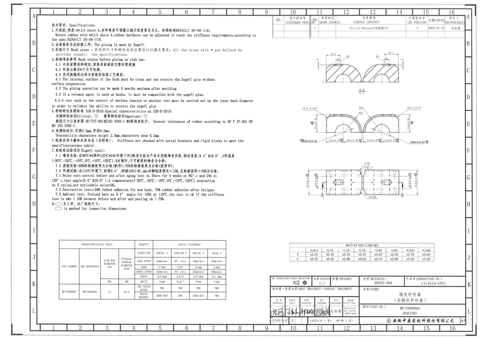
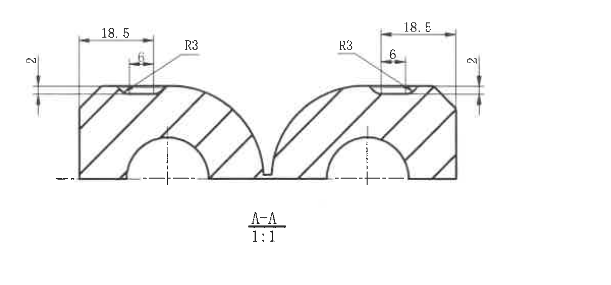
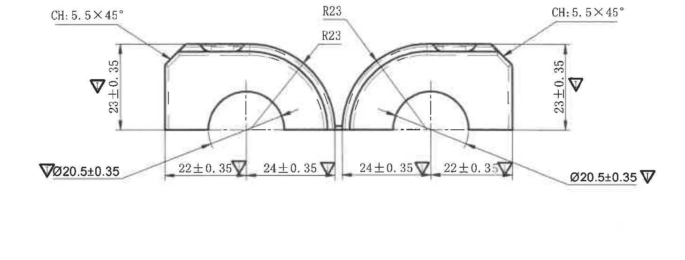
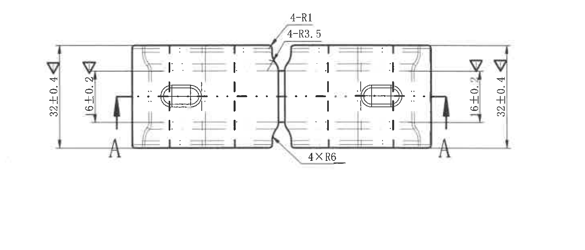
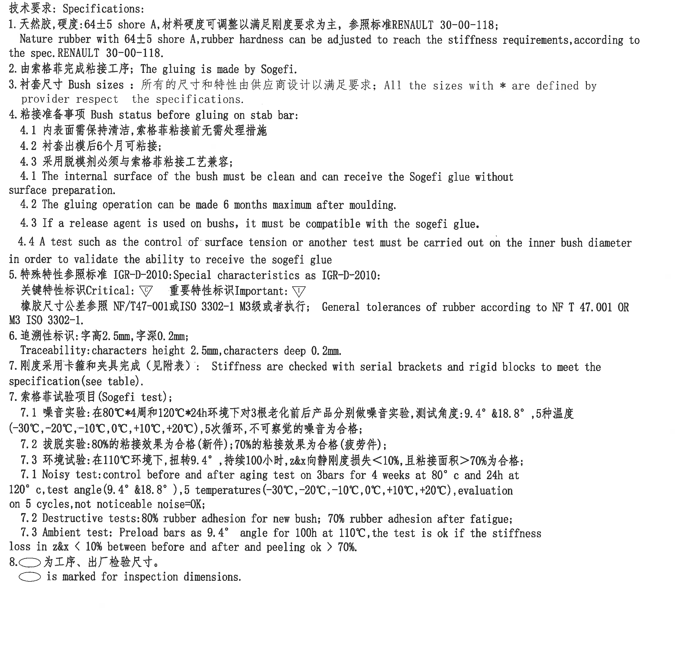
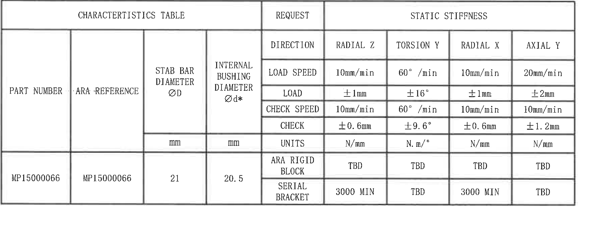
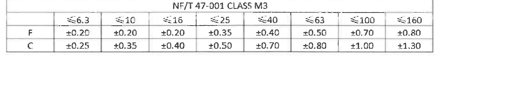
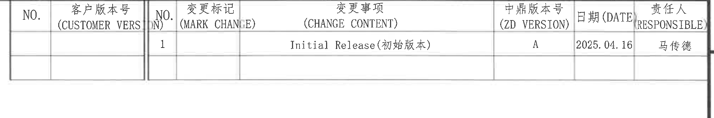
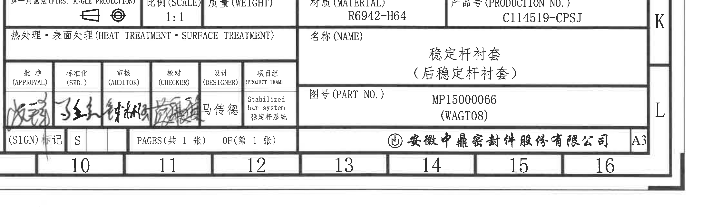

# 20C114519.pdf 内容识别结果

## 整页渲染

| 项目 | 内容 |
|---|---|
| PDF | input/20C114519.pdf |
| 页数 | 1 |
| 整页 PNG | outputs/20C114519_assets/images/page_1.png |
| PNG 尺寸 | 4959 x 3505 px |
| 页面 bbox | [0, 0, 4959, 3505] |

## object_1 - 剖面视图 A-A

| 项目 | 内容 |
|---|---|
| 原图位置/视图名称 | 右上部 C-D 区域，剖面视图 A-A，比例 1:1 |
| object_kind | section |
| bbox | [3180, 490, 4380, 1050] |
| 边界归属说明 | 仅包含剖面 A-A 的剖切轮廓、剖面线、中心线和顶部槽/圆角尺寸；未包含下方主视图。顶部 18.5、6、R3 和侧向 2 均属于剖面 A-A。 |

| 提取项 | 原图数值或文本 | 含义说明 |
|---|---|---|
| 视图标识 | A-A | 俯视图中 A 剖切位置对应的剖面视图。 |
| 比例 | 1:1 | 剖面视图绘图比例。 |
| 左顶部平台长度 | 18.5 | 左半剖面顶部水平平台/台阶段长度。 |
| 左顶部槽宽 | 6 | 左半剖面顶部局部槽或台阶宽度。 |
| 左顶部圆角 | R3 | 左半剖面顶部过渡圆角半径。 |
| 左侧局部高度/厚度 | 2 | 左侧顶部局部竖向尺寸。 |
| 右顶部平台长度 | 18.5 | 右半剖面顶部水平平台/台阶段长度。 |
| 右顶部槽宽 | 6 | 右半剖面顶部局部槽或台阶宽度。 |
| 右顶部圆角 | R3 | 右半剖面顶部过渡圆角半径。 |
| 右侧局部高度/厚度 | 2 | 右侧顶部局部竖向尺寸。 |

## object_2 - 主加工视图

| 项目 | 内容 |
|---|---|
| 原图位置/视图名称 | 右中部 E-F 区域，正视/主加工视图 |
| object_kind | view |
| bbox | [2985, 1080, 4445, 1635] |
| 边界归属说明 | 下边界已收紧，未包含下方俯视图的 4-R1、4-R3.5、4×R6 标注；左右 Ø20.5±0.35 的引出线与文字完整保留，因此归属于本主视图。 |

| 提取项 | 原图数值或文本 | 含义说明 |
|---|---|---|
| 左上倒角 | CH:5.5X45° | 左上外角倒角，倒角长度 5.5，角度 45°。 |
| 右上倒角 | CH:5.5X45° | 右上外角倒角，倒角长度 5.5，角度 45°。 |
| 左内侧上圆弧 | R23 | 左半件上部内侧大圆弧半径。 |
| 右内侧上圆弧 | R23 | 右半件上部内侧大圆弧半径。 |
| 左侧高度 | 23±0.35 | 左半件竖向高度尺寸，带三角检验标识。 |
| 右侧高度 | 23±0.35 | 右半件竖向高度尺寸，带三角检验标识。 |
| 左内孔直径 | Ø20.5±0.35 | 左侧衬套内孔/圆弧孔直径，带三角检验标识。 |
| 右内孔直径 | Ø20.5±0.35 | 右侧衬套内孔/圆弧孔直径，带三角检验标识。 |
| 左外侧水平段 | 22±0.35 | 底部左外侧水平分段尺寸，带检验三角标识。 |
| 左中水平段 | 24±0.35 | 底部左中分段尺寸，带检验三角标识。 |
| 右中水平段 | 24±0.35 | 底部右中分段尺寸，带检验三角标识。 |
| 右外侧水平段 | 22±0.35 | 底部右外侧水平分段尺寸，带检验三角标识。 |
| 特殊特性标识 | 三角符号 | NOTES 第5条说明三角 C/I 为 Critical/Important 特殊特性标识；本视图三角符号标在尺寸旁，表示相关特性需重点控制。NOTES 第8条的椭圆标记另指工序、出厂检验尺寸。 |

## object_3 - 俯视加工视图

| 项目 | 内容 |
|---|---|
| 原图位置/视图名称 | 右下中部 G-H 区域，俯视加工视图，含 A-A 剖切位置 |
| object_kind | view |
| bbox | [3010, 1630, 4460, 2250] |
| 边界归属说明 | 顶部 4-R1、4-R3.5 和底部 4×R6 的引出线均指向俯视图中间连接/过渡处；两侧 32±0.4、16±0.2 和 A 剖切标识均属于该俯视图。上方主视图的底部尺寸未纳入该对象。 |

| 提取项 | 原图数值或文本 | 含义说明 |
|---|---|---|
| 上中部小圆角 | 4-R1 | 俯视图上部中间连接处 4 处 R1 圆角。 |
| 上中部过渡圆角 | 4-R3.5 | 俯视图上部中间连接处 4 处 R3.5 圆角。 |
| 下中部过渡圆角 | 4×R6 | 俯视图下部中间连接处 4 处 R6 圆角。 |
| 左端总高度 | 32±0.4 | 左端整体竖向尺寸，带三角检验标识。 |
| 右端总高度 | 32±0.4 | 右端整体竖向尺寸，带三角检验标识。 |
| 左端局部高度 | 16±0.2 | 左端内槽/局部特征竖向尺寸，带三角检验标识。 |
| 右端局部高度 | 16±0.2 | 右端内槽/局部特征竖向尺寸，带三角检验标识。 |
| 剖切位置 | A、A | 左右两端剖切箭头，指示 A-A 剖面的位置和观察方向。 |
| 两处长圆孔 | 图形轮廓和中心线 | 俯视图中左右各一处长圆孔，图中未在该视图内给出独立长圆孔尺寸。 |

## object_4 - 技术要求 / Specifications

| 项目 | 内容 |
|---|---|
| 原图位置/视图名称 | 左上至左中部 A-H 区域，技术要求 / Specifications |
| object_kind | notes |
| bbox | [500, 230, 2780, 2370] |
| 边界归属说明 | 裁切边界不跨入右侧加工视图和顶部修订表；少数长英文行根据整页图像可见文本补全，但不把右侧视图图形归入该对象。 |

| 提取项 | 原图数值或文本 | 含义说明 |
|---|---|---|
| 标题 | 技术要求: Specifications: | 图纸技术说明区标题。 |
| 1 | 天然胶, 硬度:64±5 shore A, 材料硬度可调整以满足刚度要求为主, 参照标准 RENAULT 30-00-118; | 材料为天然橡胶；硬度为 64±5 Shore A；允许调整材料硬度以满足刚度要求；参考 RENAULT 30-00-118。 |
| 1 英文 | Nature rubber with 64±5 shore A, rubber hardness can be adjusted to reach the stiffness requirements, according to the spec. RENAULT 30-00-118. | 中文第1条英文说明。 |
| 2 | 由索格菲完成粘接工序; The gluing is made by Sogefi. | 粘接工序由 Sogefi 完成。 |
| 3 | 衬套尺寸 Bush sizes: 所有的尺寸和特性由供应商设计以满足要求; All the sizes with * are defined by provider respect the specifications. | 带星号的尺寸由供应商按规范定义；例如特性表中的 Ød*。 |
| 4 | 粘接准备事项 Bush status before gluing on stab bar: | 稳定杆粘接前衬套状态要求。 |
| 4.1 中文 | 内表面需保持清洁, 索格菲粘接前无需处理措施 | 内表面清洁要求。 |
| 4.2 中文 | 衬套出模后6个月可粘接; | 出模后最长 6 个月内可粘接。 |
| 4.3 中文 | 采用脱模剂必须与索格菲粘接工艺兼容; | 脱模剂必须兼容 Sogefi 粘接工艺。 |
| 4.1 英文 | The internal surface of the bush must be clean and can receive the Sogefi glue without surface preparation. | 内表面清洁且无需额外表面处理即可接收胶水。 |
| 4.2 英文 | The gluing operation can be made 6 months maximum after moulding. | 粘接应在成型后最长 6 个月内进行。 |
| 4.3 英文 | If a release agent is used on bushs, it must be compatible with the sogefi glue. | 使用脱模剂时必须与 Sogefi 胶兼容。 |
| 4.4 英文 | A test such as the control of surface tension or another test must be carried out on the inner bush diameter in order to validate the ability to receive the sogefi glue | 需对衬套内径进行表面张力控制或其他试验，以验证可接收胶水能力。 |
| 5 | 特殊特性参照标准 IGR-D-2010: Special characteristics as IGR-D-2010: | 特殊特性标准引用。 |
| 5 标识 | Critical: 三角 C；Important: 三角 I | 关键特性和重要特性符号说明。 |
| 5 公差 | 橡胶尺寸公差参照 NF/T47-001 或 ISO 3302-1 M3级或者执行; General tolerances of rubber according to NF T 47.001 OR M3 ISO 3302-1. | 橡胶尺寸一般公差标准。 |
| 6 | 追溯性标识: 字高2.5mm, 字深0.2mm; Traceability: characters height 2.5mm, characters deep 0.2mm. | 标识字高和字深要求。 |
| 7 刚度 | 刚度采用卡箍和夹具完成（见附表）; Stiffness are checked with serial brackets and rigid blocks to meet the specification (see table). | 刚度检查方法和参考附表。 |
| 7 试验项目 | 索格菲试验项目 (Sogefi test); | 试验项目分组标题。 |
| 7.1 中文 | 噪音实验: 在80°C*4周和120°C*24h环境下对3根老化前后产品分别做噪音实验, 测试角度:9.4° &18.8°, 5种温度(-30°C,-20°C,-10°C,0°C,+10°C,+20°C), 5次循环, 不可察觉的噪音为合格; | 噪音试验老化条件、角度、温度和判定。原图写“5种温度”但列出 6 个温度点，按原图还原。 |
| 7.2 中文 | 拔脱实验:80%的粘接效果为合格(新件);70%的粘接效果为合格(疲劳件); | 新件和疲劳件粘接合格比例。 |
| 7.3 中文 | 环境试验:在110°C环境下, 扭转9.4°, 持续100小时, z&x向静刚度损失<10%, 且粘接面积>70%为合格; | 环境试验条件和合格标准。 |
| 7.1 英文 | Noisy test: control before and after aging test on 3bars for 4 weeks at 80°C and 24h at 120°C, test angle(9.4° &18.8°), 5 temperatures(-30°C,-20°C,-10°C,0°C,+10°C,+20°C), evaluation on 5 cycles, not noticeable noise=OK; | 中文 7.1 对应英文说明。 |
| 7.2 英文 | Destructive tests:80% rubber adhesion for new bush; 70% rubber adhesion after fatigue; | 中文 7.2 对应英文说明。 |
| 7.3 英文 | Ambient test: Preload bars as 9.4° angle for 100h at 110°C, the test is ok if the stiffness loss in z&x < 10% between before and after and peeling ok > 70%. | 中文 7.3 对应英文说明。 |
| 8 | 椭圆标记 为工序、出厂检验尺寸。Oval mark is marked for inspection dimensions. | 椭圆标记表示工序和出厂检验尺寸。 |

## object_5 - CHARACTERISTICS TABLE

| 项目 | 内容 |
|---|---|
| 原图位置/视图名称 | 左下部 J-K 区域，CHARACTERISTICS TABLE / REQUEST / STATIC STIFFNESS |
| object_kind | table |
| bbox | [600, 2460, 2400, 3180] |
| 边界归属说明 | 完整包含外框、列头、单位和数据行。Ød* 中星号表示该内部衬套直径由 NOTES 第3条所述供应商定义尺寸范围约束；21 与 20.5 为表格中的直径值，不归入右侧加工视图。 |

| PART NUMBER | ARA REFERENCE | STAB BAR DIAMETER ØD (mm) | INTERNAL BUSHING DIAMETER Ød* (mm) | REQUEST | RADIAL Z | TORSION Y | RADIAL X | AXIAL Y |
|---|---|---:|---:|---|---|---|---|---|
|  |  |  |  | DIRECTION | RADIAL Z | TORSION Y | RADIAL X | AXIAL Y |
|  |  |  |  | LOAD SPEED | 10mm/min | 60°/min | 10mm/min | 20mm/min |
|  |  |  |  | LOAD | ±1mm | ±16° | ±1mm | ±2mm |
|  |  |  |  | CHECK SPEED | 10mm/min | 60°/min | 10mm/min | 10mm/min |
|  |  |  |  | CHECK | ±0.6mm | ±9.6° | ±0.6mm | ±1.2mm |
|  |  |  |  | UNITS | N/mm | N.m/° | N/mm | N/mm |
| MP15000066 | MP15000066 | 21 | 20.5 | ARA RIGID BLOCK | TBD | TBD | TBD | TBD |
| MP15000066 | MP15000066 | 21 | 20.5 | SERIAL BRACKET | 3000 MIN | TBD | 3000 MIN | TBD |

| 提取项 | 原图数值或文本 | 含义说明 |
|---|---|---|
| PART NUMBER | MP15000066 | 零件号。 |
| ARA REFERENCE | MP15000066 | ARA 参考号。 |
| STAB BAR DIAMETER ØD | 21 mm | 稳定杆直径。 |
| INTERNAL BUSHING DIAMETER Ød* | 20.5 mm | 衬套内径；带 *，按 NOTES 第3条由供应商定义并满足规范。 |
| RADIAL Z | LOAD SPEED 10mm/min; LOAD ±1mm; CHECK SPEED 10mm/min; CHECK ±0.6mm; UNITS N/mm | 径向 Z 静刚度测试条件。 |
| TORSION Y | LOAD SPEED 60°/min; LOAD ±16°; CHECK SPEED 60°/min; CHECK ±9.6°; UNITS N.m/° | 扭转 Y 静刚度测试条件。 |
| RADIAL X | LOAD SPEED 10mm/min; LOAD ±1mm; CHECK SPEED 10mm/min; CHECK ±0.6mm; UNITS N/mm | 径向 X 静刚度测试条件。 |
| AXIAL Y | LOAD SPEED 20mm/min; LOAD ±2mm; CHECK SPEED 10mm/min; CHECK ±1.2mm; UNITS N/mm | 轴向 Y 静刚度测试条件。 |
| ARA RIGID BLOCK | TBD / TBD / TBD / TBD | 刚性块工装下四个方向静刚度待定。 |
| SERIAL BRACKET | 3000 MIN / TBD / 3000 MIN / TBD | 串联支架工装下 Radial Z、Radial X 最小 3000；Torsion Y、Axial Y 待定。 |

## object_6 - NF/T 47-001 CLASS M3 公差表

| 项目 | 内容 |
|---|---|
| 原图位置/视图名称 | 右下部 J 区域，NF/T 47-001 CLASS M3 橡胶尺寸公差表 |
| object_kind | table |
| bbox | [2940, 2495, 4700, 2795] |
| 边界归属说明 | 完整包含表题、尺寸范围列、F/C 两行。其数值解释图中橡胶尺寸的一般公差等级 M3；表格不属于任何单一加工视图。 |

| NF/T 47-001 CLASS M3 | ≤6.3 | ≤10 | ≤16 | ≤25 | ≤40 | ≤63 | ≤100 | ≤160 |
|---|---:|---:|---:|---:|---:|---:|---:|---:|
| F | ±0.20 | ±0.20 | ±0.20 | ±0.35 | ±0.40 | ±0.50 | ±0.70 | ±0.80 |
| C | ±0.25 | ±0.35 | ±0.40 | ±0.50 | ±0.70 | ±0.80 | ±1.00 | ±1.30 |

| 提取项 | 原图数值或文本 | 含义说明 |
|---|---|---|
| 表题 | NF/T 47-001 CLASS M3 | 橡胶尺寸公差等级表。 |
| 尺寸范围 | ≤6.3, ≤10, ≤16, ≤25, ≤40, ≤63, ≤100, ≤160 | 公差适用的名义尺寸范围列。 |
| F 行 | ±0.20, ±0.20, ±0.20, ±0.35, ±0.40, ±0.50, ±0.70, ±0.80 | F 类尺寸的 M3 公差。 |
| C 行 | ±0.25, ±0.35, ±0.40, ±0.50, ±0.70, ±0.80, ±1.00, ±1.30 | C 类尺寸的 M3 公差。 |

## object_7 - 修订履历表

| 项目 | 内容 |
|---|---|
| 原图位置/视图名称 | 右上部 A-B 区域，修订履历表 |
| object_kind | table |
| bbox | [2760, 160, 4770, 495] |
| 边界归属说明 | 裁切仅包含表格本体和紧贴外框的边线，不包含下方剖面视图；右侧图框坐标 A/B 已排除。 |

| NO. | CUSTOMER VERSION | NO. | MARK CHANGE | CHANGE CONTENT | ZD VERSION | DATE | RESPONSIBLE |
|---|---|---:|---|---|---|---|---|
|  |  | 1 |  | Initial Release(初始版本) | A | 2025.04.16 | 马传德 |

| 提取项 | 原图数值或文本 | 含义说明 |
|---|---|---|
| NO. / CUSTOMER VERSION | 空白 | 客户版本号未填。 |
| NO. | 1 | 第 1 条修订记录。 |
| MARK CHANGE | 空白 | 未填写更改标记位置/标识。 |
| CHANGE CONTENT | Initial Release(初始版本) | 初始发布。 |
| ZD VERSION | A | 中鼎版本号 A。 |
| DATE | 2025.04.16 | 修订日期。 |
| RESPONSIBLE | 马传德 | 责任人。 |

## object_8 - 标题栏

| 项目 | 内容 |
|---|---|
| 原图位置/视图名称 | 右下角 K-L 区域，标题栏/签核栏 |
| object_kind | title_block |
| bbox | [2750, 2850, 4959, 3500] |
| 边界归属说明 | 裁切包含标题栏主要字段和右侧 A3 幅面标识；底部 10-16 和右侧 K/L 是图框坐标，保留为边界参照，不作为标题栏字段值。 |

| 字段 | 原图数值或文本 | 含义说明 |
|---|---|---|
| 投影法 | 第一角画法 (FIRST ANGLE PROJECTION) | 图纸投影法，图中带第一角法符号。 |
| SCALE | 1:1 | 图纸比例。 |
| WEIGHT | 空白 | 质量字段未填写。 |
| MATERIAL | R6942-H64 | 材料牌号/材料字段。 |
| PRODUCTION NO. | C114519-CPSJ | 产品号。 |
| HEAT TREATMENT / SURFACE TREATMENT | 空白 | 热处理/表面处理字段未填写。 |
| NAME | 稳定杆衬套（后稳定杆衬套） | 零件名称。 |
| PART NO. | MP15000066 (WAGT08) | 图号/零件号。 |
| APPROVAL | 签名 | 批准栏，有手写签名。 |
| STD. | 签名 | 标准化栏，有手写签名。 |
| AUDITOR | 签名 | 审核栏，有手写签名。 |
| CHECKER | 签名 | 校对栏，有手写签名。 |
| DESIGNER | 马传德 | 设计者。 |
| PROJECT TEAM | Stabilized bar system / 稳定杆系统 | 项目组。 |
| SIGN | 标记 S | 标记字段。 |
| PAGES | 共 1 张 | 总页数。 |
| OF | 第 1 张 | 当前页。 |
| 公司 | 安徽中鼎密封件股份有限公司 | 出图/公司名称。 |
| 图幅 | A3 | 图纸幅面。 |

## 裁切检查记录

| 对象 | 图片路径 | 检查结论 |
|---|---|---|
| page_1 | outputs/20C114519_assets/images/page_1.png | 整页 PNG，完整包含图框、坐标、全部视图、表格、NOTES 和标题栏。 |
| object_1 | outputs/20C114519_assets/images/object_1.png | 剖面 A-A 尺寸线、箭头、文字、剖面线和 A-A/1:1 标识完整；未带入下方主视图。 |
| object_2 | outputs/20C114519_assets/images/object_2.png | 主视图 CH、R23、23±0.35、Ø20.5±0.35、22±0.35、24±0.35 尺寸线和文字完整；重裁后未带入俯视图的 4-R1/4-R3.5/4×R6。 |
| object_3 | outputs/20C114519_assets/images/object_3.png | 俯视图 4-R1、4-R3.5、4×R6、32±0.4、16±0.2、A 剖切标识和箭头完整；未纳入上方主视图底部尺寸。 |
| object_4 | outputs/20C114519_assets/images/object_4.png | NOTES 文本主体完整；为避免混入右侧视图，裁切右边界控制在 NOTES 区域内，长英文行按整页图像识别补全文本，不把右侧视图归入该对象。 |
| object_5 | outputs/20C114519_assets/images/object_5.png | 特性表外框、第一行表头、列头、单位、数据行完整；重裁后未截掉 CHARACTERISTICS TABLE / REQUEST / STATIC STIFFNESS 表头。 |
| object_6 | outputs/20C114519_assets/images/object_6.png | NF/T 47-001 CLASS M3 表题、尺寸范围列、F/C 行完整；重裁后未带入下方标题栏。 |
| object_7 | outputs/20C114519_assets/images/object_7.png | 修订履历表列头和记录行完整；重裁后未带入下方剖面视图，右侧图框坐标基本排除。 |
| object_8 | outputs/20C114519_assets/images/object_8.png | 标题栏主要字段、签核栏、页码、公司名和 A3 标识完整；底部/右侧图框坐标仅作为边界参照。 |
