# 20C114525 PDF 内容识别

整页渲染图：`outputs/20C114525_assets/images/page_1.png`  
原 PDF：`input/20C114525.pdf`  
页数：1 页；整页 PNG 尺寸：4959 x 3505 px

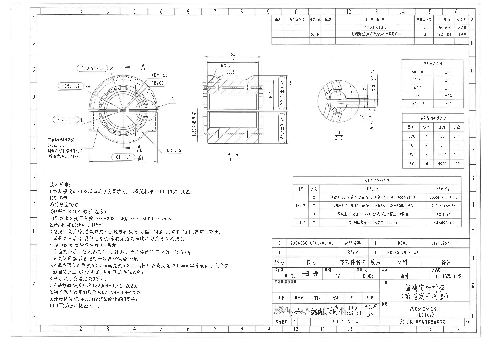

## object_1 - 主视图

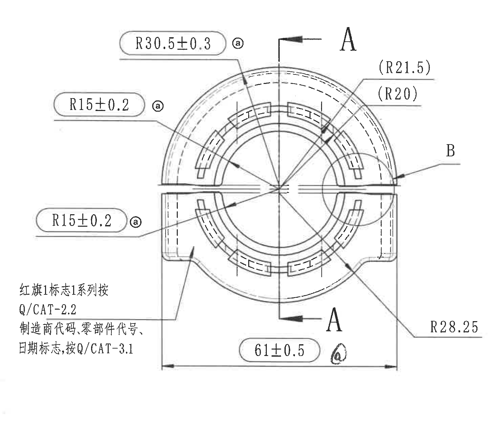

原图位置/视图名称：第 1 页左上部主视图，bbox `[430, 570, 1880, 1820]`。

| 提取项 | 原图数值或文本 | 含义说明 |
|---|---|---|
| 外圆弧半径 | R30.5±0.3，旁有变更标记ⓐ | 主视图上方外侧圆弧半径尺寸，公差为 ±0.3；ⓐ为修订标记，归属当前主视图。 |
| 上侧内圆弧半径 | R15±0.2，旁有变更标记ⓐ | 主视图左上引线指向上侧内圆弧，公差为 ±0.2。 |
| 下侧内圆弧半径 | R15±0.2，旁有变更标记ⓐ | 主视图左下引线指向下侧内圆弧，公差为 ±0.2。 |
| 参考半径 | (R21.5) | 括号内参考尺寸，位于主视图右上，表示对应圆弧的参考半径，不作为带公差控制尺寸。 |
| 参考半径 | (R20) | 括号内参考尺寸，位于主视图右上，表示另一处相邻圆弧参考半径。 |
| 右下圆弧半径 | R28.25 | 主视图右下外侧圆弧半径尺寸，未单独标注公差，按未注公差表处理。 |
| 底部总宽 | 61±0.5，旁有出厂/变更标记 | 主视图底部水平总宽尺寸，公差为 ±0.5；尺寸线和箭头完整归属主视图。 |
| 剖切位置 | A / A，箭头方向指示 A-A | 主视图中竖向剖切线及上下箭头，定义中间 A-A 剖面视图。 |
| 局部视图索引 | B | 右侧圆形局部范围和引线标注 B，指向右侧放大局部视图 object_3。 |
| 标识文字 | 红旗1标志1系列按 Q/CAT-2.2；制造商代码、零部件代号、日期标志，按 Q/CAT-3.1 | 标识/刻印要求文字，位于主视图左下，归属主视图。 |

边界归属说明：裁切包含主视图完整外形、尺寸文字、尺寸线、箭头、A-A 剖切标记和 B 局部索引。右侧只包含 B 局部索引引线及局部范围圆，不包含右侧 B 放大视图本体；中间 A-A 剖面尺寸未归入本对象。

## object_2 - A-A 剖面视图

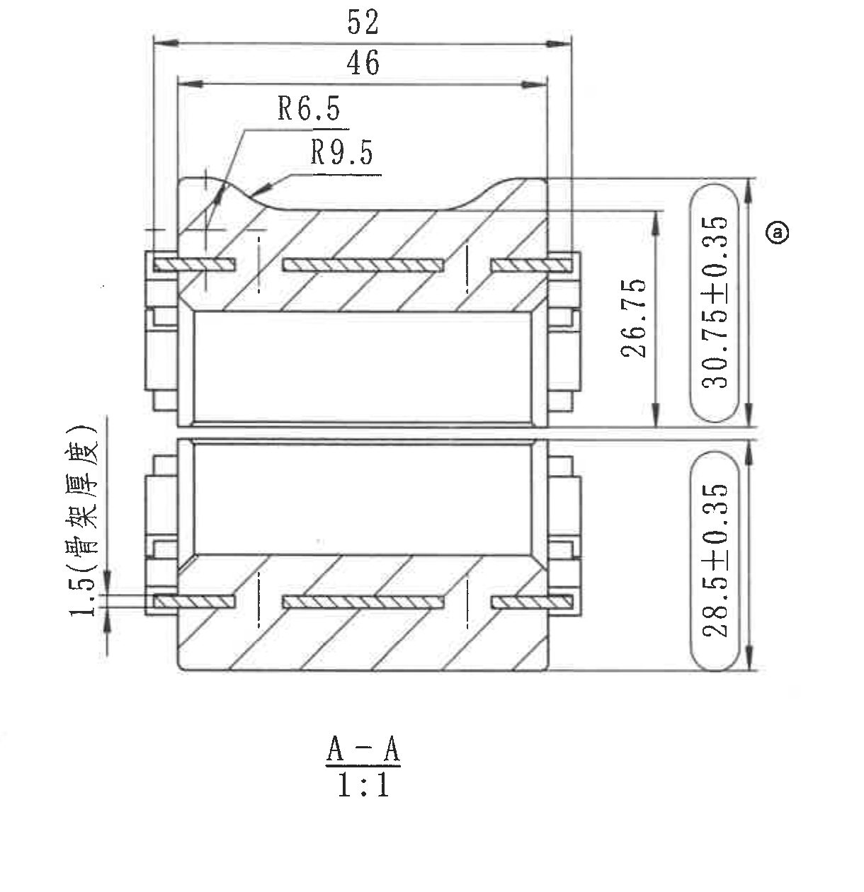

原图位置/视图名称：第 1 页中部 A-A 剖面，bbox `[1860, 520, 3080, 1780]`。

| 提取项 | 原图数值或文本 | 含义说明 |
|---|---|---|
| 剖面名称与比例 | A-A；1:1 | 由主视图 A-A 剖切线生成的剖面视图，比例 1:1。 |
| 上方总宽 | 52 | 剖面上方外侧水平尺寸，表示外边界宽度。 |
| 上方内宽 | 46 | 剖面上方内侧水平尺寸，表示内侧约束宽度。 |
| 圆角/沟槽半径 | R6.5 | 剖面上方左侧引线指向局部圆角或沟槽过渡半径。 |
| 圆角/沟槽半径 | R9.5 | 剖面上方引线指向另一处较大圆弧过渡半径。 |
| 右侧内高 | 26.75 | 剖面右侧竖向尺寸，标注在上半件内侧高度范围。 |
| 右侧上半总高 | 30.75±0.35，旁有变更标记ⓐ | 上半件竖向控制尺寸，公差为 ±0.35；ⓐ为修订标记。 |
| 右侧下半总高 | 28.5±0.35 | 下半件竖向控制尺寸，公差为 ±0.35。 |
| 左侧骨架厚度 | 1.5（骨架厚度） | 剖面左侧竖排标注，表示金属骨架厚度或骨架边距相关厚度要求。 |
| 剖面构造 | 斜线剖面、内部骨架/金属件轮廓 | 斜线区域表示被剖切材料，内部细长件表示金属骨架或嵌件位置。 |

边界归属说明：该裁切经过重裁，左侧完整保留 `1.5（骨架厚度）` 的文字、尺寸线和箭头；右侧未包含 B 局部视图片段；左下未包含主视图的 R28.25 标注。

## object_3 - B 局部视图

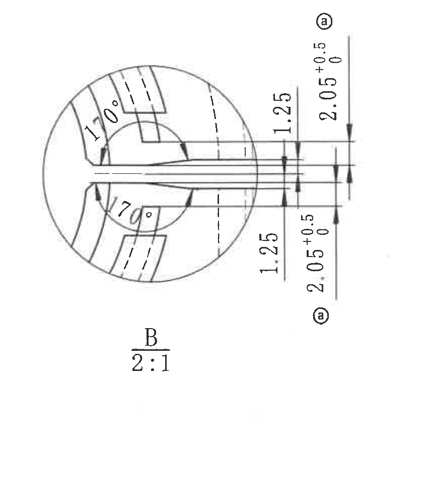

原图位置/视图名称：第 1 页右中部局部视图 B，bbox `[3150, 690, 4000, 1690]`。

| 提取项 | 原图数值或文本 | 含义说明 |
|---|---|---|
| 局部视图名称与比例 | B；2:1 | 由主视图 B 索引放大的局部视图，比例 2:1。 |
| 上侧弧角 | 170° | 局部上方弧向角度尺寸，箭头指向弧形开口区域。 |
| 下侧弧角 | 170° | 局部下方弧向角度尺寸，箭头指向下侧弧形开口区域。 |
| 上侧局部厚度/间距 | 1.25 | 位于中心槽上侧的竖向尺寸，控制局部台阶或薄壁间距。 |
| 下侧局部厚度/间距 | 1.25 | 位于中心槽下侧的竖向尺寸，控制下侧对应间距。 |
| 上侧槽宽/间隙 | 2.05 +0.5 / 0，旁有变更标记ⓐ | 上侧竖向尺寸，基本尺寸 2.05，上偏差 +0.5，下偏差 0。 |
| 下侧槽宽/间隙 | 2.05 +0.5 / 0，旁有变更标记ⓐ | 下侧对应竖向尺寸，基本尺寸 2.05，上偏差 +0.5，下偏差 0。 |

边界归属说明：裁切仅包含 B 放大局部、其尺寸线、箭头和比例标注；未包含中间 A-A 剖面或右侧表格内容。B 的索引来源在 object_1 中说明，本对象只提取放大局部内的尺寸。

## object_4 - 顶部修订履历表

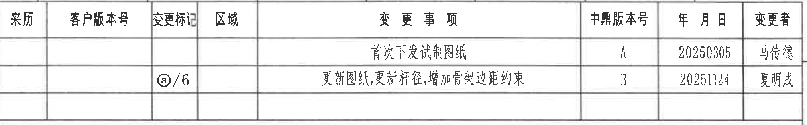

原图位置/视图名称：第 1 页顶部右侧修订履历表，bbox `[2775, 150, 4785, 465]`。

原表还原：

| 来历 | 客户版本号 | 变更标记 | 区域 | 变更事项 | 中鼎版本号 | 年月日 | 变更者 |
|---|---|---|---|---|---|---|---|
|  |  |  |  | 首次下发试制图纸 | A | 20250305 | 马传德 |
|  |  | ⓐ/6 |  | 更新图纸,更新杆径,增加骨架边距约束 | B | 20251124 | 夏明成 |
|  |  |  |  |  |  |  |  |

| 提取项 | 原图数值或文本 | 含义说明 |
|---|---|---|
| 表头 | 来历、客户版本号、变更标记、区域、变更事项、中鼎版本号、年月日、变更者 | 顶部修订履历表的列名。 |
| 版本 A | 首次下发试制图纸；中鼎版本号 A；年月日 20250305；变更者 马传德 | 图纸首次下发试制的修订记录。 |
| 版本 B | 变更标记 ⓐ/6；更新图纸,更新杆径,增加骨架边距约束；中鼎版本号 B；年月日 20251124；变更者 夏明成 | 图纸更新记录，ⓐ/6 表示图中 6 处使用 ⓐ 变更标记。 |

边界归属说明：裁切收紧到修订表外框，未提取右侧图框坐标字母 A/B；表格底部空行按原表保留为空白行。

## object_5 - 表3.公差标准

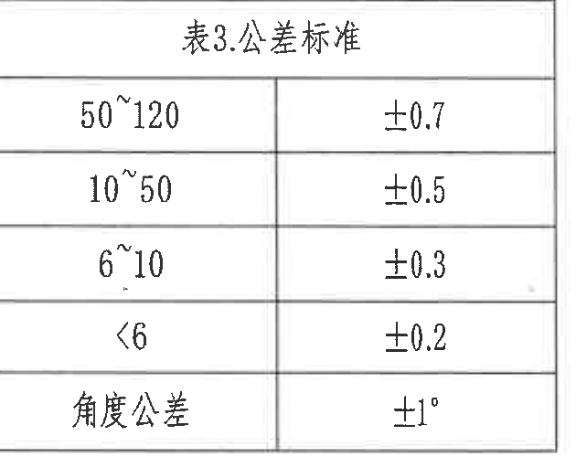

原图位置/视图名称：第 1 页右上部表3，bbox `[4110, 610, 4740, 1110]`。原图未给两列单独列名，以下按左右列还原。

原表还原：

| 原表左列 | 原表右列 |
|---|---|
| 表3.公差标准 |  |
| 50~120 | ±0.7 |
| 10~50 | ±0.5 |
| 6~10 | ±0.3 |
| <6 | ±0.2 |
| 角度公差 | ±1° |

| 提取项 | 原图数值或文本 | 含义说明 |
|---|---|---|
| 线性尺寸范围 | 50~120；±0.7 | 未注线性尺寸在 50 到 120 范围时，公差为 ±0.7。 |
| 线性尺寸范围 | 10~50；±0.5 | 未注线性尺寸在 10 到 50 范围时，公差为 ±0.5。 |
| 线性尺寸范围 | 6~10；±0.3 | 未注线性尺寸在 6 到 10 范围时，公差为 ±0.3。 |
| 线性尺寸范围 | <6；±0.2 | 未注线性尺寸小于 6 时，公差为 ±0.2。 |
| 角度公差 | ±1° | 未注角度尺寸按 ±1°。 |

边界归属说明：裁切包含表3标题、完整表框和全部五行公差信息；右侧图框线未作为表格字段提取。

## object_6 - 表2.异响实验要求

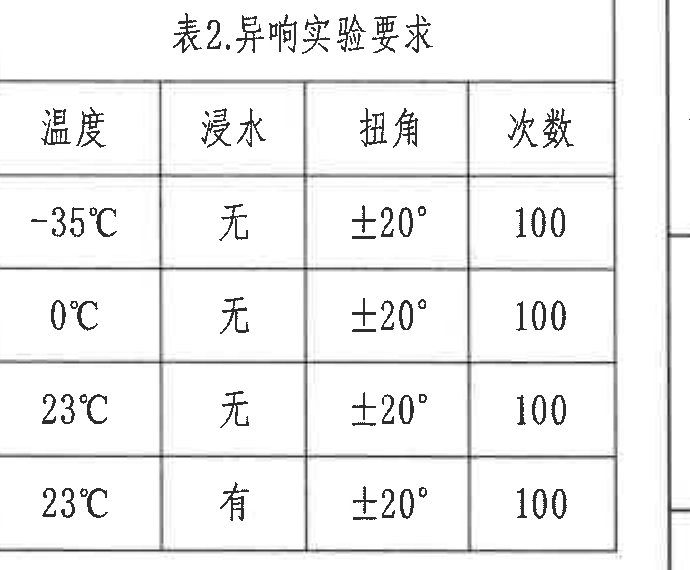

原图位置/视图名称：第 1 页右中部表2，bbox `[4110, 1170, 4800, 1740]`。

原表还原：

| 温度 | 浸水 | 扭角 | 次数 |
|---|---|---|---|
| -35℃ | 无 | ±20° | 100 |
| 0℃ | 无 | ±20° | 100 |
| 23℃ | 无 | ±20° | 100 |
| 23℃ | 有 | ±20° | 100 |

| 提取项 | 原图数值或文本 | 含义说明 |
|---|---|---|
| 低温异响条件 | -35℃；浸水无；扭角 ±20°；次数 100 | 在 -35℃ 且不浸水条件下进行 100 次 ±20° 扭转。 |
| 冰点异响条件 | 0℃；浸水无；扭角 ±20°；次数 100 | 在 0℃ 且不浸水条件下进行 100 次 ±20° 扭转。 |
| 常温干态异响条件 | 23℃；浸水无；扭角 ±20°；次数 100 | 在 23℃ 干态条件下进行 100 次 ±20° 扭转。 |
| 常温湿态异响条件 | 23℃；浸水有；扭角 ±20°；次数 100 | 在 23℃ 浸水条件下进行 100 次 ±20° 扭转。 |

边界归属说明：裁切包含表2标题、表头和四行数据；右侧图框坐标未作为表格字段提取。

## object_7 - 表1.刚度实验要求

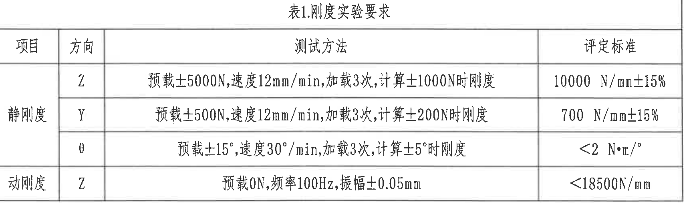

原图位置/视图名称：第 1 页中右下部表1，bbox `[2995, 1815, 4735, 2345]`。

原表还原：

| 项目 | 方向 | 测试方法 | 评定标准 |
|---|---|---|---|
| 静刚度 | Z | 预载±5000N,速度12mm/min,加载3次,计算±1000N时刚度 | 10000 N/mm±15% |
| 静刚度 | Y | 预载±500N,速度12mm/min,加载3次,计算±200N时刚度 | 700 N/mm±15% |
| 静刚度 | θ | 预载±15°,速度30°/min,加载3次,计算±5°时刚度 | <2 N·m/° |
| 动刚度 | Z | 预载0N,频率100Hz,振幅±0.05mm | <18500N/mm |

| 提取项 | 原图数值或文本 | 含义说明 |
|---|---|---|
| 静刚度 Z 向 | 预载±5000N,速度12mm/min,加载3次,计算±1000N时刚度；10000 N/mm±15% | Z 向静刚度测试和判定标准。 |
| 静刚度 Y 向 | 预载±500N,速度12mm/min,加载3次,计算±200N时刚度；700 N/mm±15% | Y 向静刚度测试和判定标准。 |
| 静刚度 θ 向 | 预载±15°,速度30°/min,加载3次,计算±5°时刚度；<2 N·m/° | 扭转方向静刚度测试和判定标准。 |
| 动刚度 Z 向 | 预载0N,频率100Hz,振幅±0.05mm；<18500N/mm | Z 向动刚度测试和判定标准。 |

边界归属说明：裁切收紧到表1外框，完整包含标题、表头、所有数据行和表格边线；右侧图框线未作为表格字段提取。

## object_8 - 技术要求 / NOTES

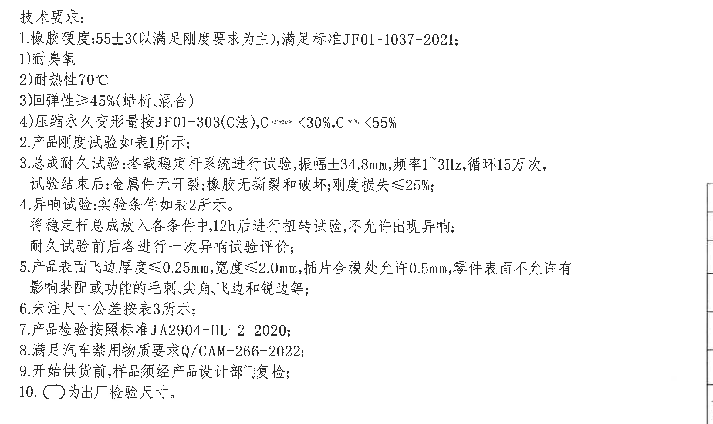

原图位置/视图名称：第 1 页左下部技术要求，bbox `[440, 1830, 2790, 3230]`。

| 提取项 | 原图数值或文本 | 含义说明 |
|---|---|---|
| 标题 | 技术要求: | 图纸 NOTES 区域标题。 |
| 1 | 橡胶硬度:55±3(以满足刚度要求为主),满足标准JF01-1037-2021; | 橡胶硬度要求为 55±3，并以满足刚度要求为主。 |
| 1-1 | 耐臭氧 | 橡胶性能要求之一。 |
| 1-2 | 耐热性70℃ | 橡胶耐热性要求。 |
| 1-3 | 回弹性≥45%(蜡析、混合) | 回弹性最低要求，括号内为原图附注。 |
| 1-4 | 压缩永久变形量按JF01-303(C法),C(23±2)/94 <30%,C70/94 <55% | 压缩永久变形要求；原图中 C 后温度/时间条件为小号上标样式。 |
| 2 | 产品刚度试验如表1所示; | 刚度试验条件和标准引用表1。 |
| 3 | 总成耐久试验:搭载稳定杆系统进行试验,振幅±34.8mm,频率1~3Hz,循环15万次,试验结束后:金属件无开裂;橡胶无撕裂和破坏;刚度损失≤25%; | 总成耐久试验条件、循环次数和试验后判定要求。 |
| 4 | 异响试验:实验条件如表2所示。将稳定杆总成放入各条件中,12h后进行扭转试验,不允许出现异响;耐久试验前后各进行一次异响试验评价; | 异响试验引用表2，并要求每种条件放置 12h 后扭转评价。 |
| 5 | 产品表面飞边厚度≤0.25mm,宽度≤2.0mm,插件合模处允许0.5mm,零件表面不允许有影响装配或功能的毛刺、尖角、飞边和锐边等; | 表面飞边、毛刺、尖角和锐边控制要求。 |
| 6 | 未注尺寸公差按表3所示; | 未注公差引用表3。 |
| 7 | 产品检验按照标准JA2904-HL-2-2020; | 产品检验标准。 |
| 8 | 满足汽车禁用物质要求Q/CAM-266-2022; | 禁用物质要求。 |
| 9 | 开始供货前,样品须经产品设计部门复检; | 供货前样品复检要求。 |
| 10 | ○ 为出厂检验尺寸。 | 图纸中空心椭圆/圆角框标识对应出厂检验尺寸。 |

边界归属说明：裁切完整包含左下 NOTES 全部 10 条技术要求；右侧仅带入相邻标题栏外框线，不提取为 NOTES 内容。

## object_9 - 明细表 / BOM

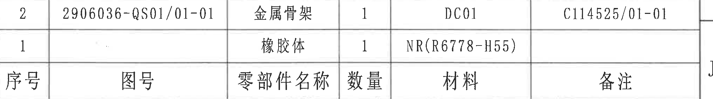

原图位置/视图名称：第 1 页右下部明细表，bbox `[2780, 2445, 4820, 2730]`。原图列头位于明细行下方，以下用列头作为 Markdown 表头，明细行按原图从上到下排列。

原表还原：

| 序号 | 图号 | 零部件名称 | 数量 | 材料 | 备注 |
|---|---|---|---|---|---|
| 2 | 2906036-QS01/01-01 | 金属骨架 | 1 | DC01 | C114525/01-01 |
| 1 |  | 橡胶体 | 1 | NR(R6778-H55) |  |

| 提取项 | 原图数值或文本 | 含义说明 |
|---|---|---|
| 表头 | 序号、图号、零部件名称、数量、材料、备注 | 明细表列名。 |
| 明细 2 | 序号 2；图号 2906036-QS01/01-01；零部件名称 金属骨架；数量 1；材料 DC01；备注 C114525/01-01 | 金属骨架零件明细。 |
| 明细 1 | 序号 1；图号空白；零部件名称 橡胶体；数量 1；材料 NR(R6778-H55)；备注空白 | 橡胶体零件明细。 |

边界归属说明：裁切只包含明细表两行数据和底部列头；下方标题栏字段已通过重裁排除，不归入 BOM 内容。

## object_10 - 标题栏

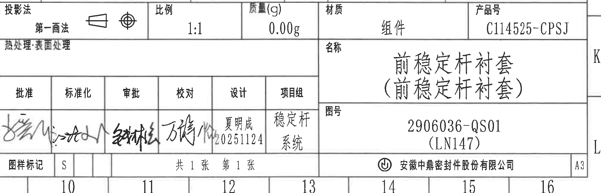

原图位置/视图名称：第 1 页右下角标题栏，bbox `[2780, 2725, 4830, 3385]`。

标题栏字段还原：

| 字段 | 原图值 |
|---|---|
| 投影法 | 第一画法，含投影符号 |
| 比例 | 1:1 |
| 质量(g) | 0.00g |
| 材质 | 组件 |
| 产品号 | C114525-CPSJ |
| 热处理·表面处理 | 空白 |
| 名称 | 前稳定杆衬套（前稳定杆衬套） |
| 图号 | 2906036-QS01（LN147） |
| 图样标记 | S |
| 张数 | 共1张 第1张 |
| 公司 | 安徽中鼎密封件股份有限公司 |
| 图幅 | A3 |

签审栏还原：

| 批准 | 标准化 | 审批 | 校对 | 设计 | 项目组 |
|---|---|---|---|---|---|
| 手写签名 | 手写签名 | 手写签名 | 手写签名 | 夏明成 20251124 | 稳定杆系统 |

| 提取项 | 原图数值或文本 | 含义说明 |
|---|---|---|
| 产品号 | C114525-CPSJ | 标题栏右上产品号字段。 |
| 名称 | 前稳定杆衬套（前稳定杆衬套） | 图纸名称字段。 |
| 图号 | 2906036-QS01（LN147） | 图纸编号及括号内代号。 |
| 比例 | 1:1 | 标题栏比例。 |
| 质量 | 0.00g | 标题栏质量字段。 |
| 材质 | 组件 | 标题栏材质字段。 |
| 设计 | 夏明成 20251124 | 设计签署字段。 |
| 项目组 | 稳定杆系统 | 项目组字段。 |
| 图样标记/页数/图幅 | S；共1张 第1张；A3 | 图样标记、页数和图幅信息。 |

边界归属说明：裁切包含标题栏完整字段、签审栏和公司栏；底部带入外图框坐标编号 10~16，但未作为标题栏字段提取。上方明细表 object_9 未并入本对象内容。

## 裁切检查记录

| 对象 | 图片路径 | 检查记录 |
|---|---|---|
| page_1 | outputs/20C114525_assets/images/page_1.png | 整页 PNG 渲染完成，尺寸 4959 x 3505 px，包含整张图纸。 |
| object_1 | outputs/20C114525_assets/images/object_1.png | 主视图尺寸文字、尺寸线、箭头、A-A 剖切标记、B 局部索引和左下标识文字完整；未混入 A-A 剖面或 B 放大视图。 |
| object_2 | outputs/20C114525_assets/images/object_2.png | 初裁左侧 1.5（骨架厚度）贴边，已重裁；最终完整包含尺寸线、箭头、文字和 A-A 1:1 标题，未混入主视图 R28.25 或 B 局部视图。 |
| object_3 | outputs/20C114525_assets/images/object_3.png | B 局部视图及所有 170°、1.25、2.05 +0.5/0 标注完整；未混入剖面或表格。 |
| object_4 | outputs/20C114525_assets/images/object_4.png | 修订表已收紧到表框，表头、版本 A/B 和空行完整；右侧图框坐标字母未提取。 |
| object_5 | outputs/20C114525_assets/images/object_5.png | 表3标题、全部公差行和边框完整；右侧图框线未作为表格字段提取。 |
| object_6 | outputs/20C114525_assets/images/object_6.png | 表2标题、表头和四行试验条件完整；右侧相邻图框坐标未提取。 |
| object_7 | outputs/20C114525_assets/images/object_7.png | 表1标题、表头、四行测试方法和评定标准完整；右侧图框线未提取。 |
| object_8 | outputs/20C114525_assets/images/object_8.png | NOTES 全部 10 条完整；右侧相邻标题栏边线仅为边界背景，不提取为文本。 |
| object_9 | outputs/20C114525_assets/images/object_9.png | 初裁下边界带入标题栏表头，已重裁；最终只包含 BOM 两行数据和列头。 |
| object_10 | outputs/20C114525_assets/images/object_10.png | 标题栏重裁后完整包含投影法、比例、质量、材质、产品号、名称、图号、签审栏、公司和 A3；底部外图框坐标 10~16 带入但不归属标题栏字段。 |
