# 20C114526 内容识别结果

整页渲染图：`20C114526_assets/images/page_1.png`  
页面尺寸：4959 x 3505 px。以下 `bbox` 均为基于整页 PNG 的 `[x0, y0, x1, y1]`。

## object_1 主加工视图

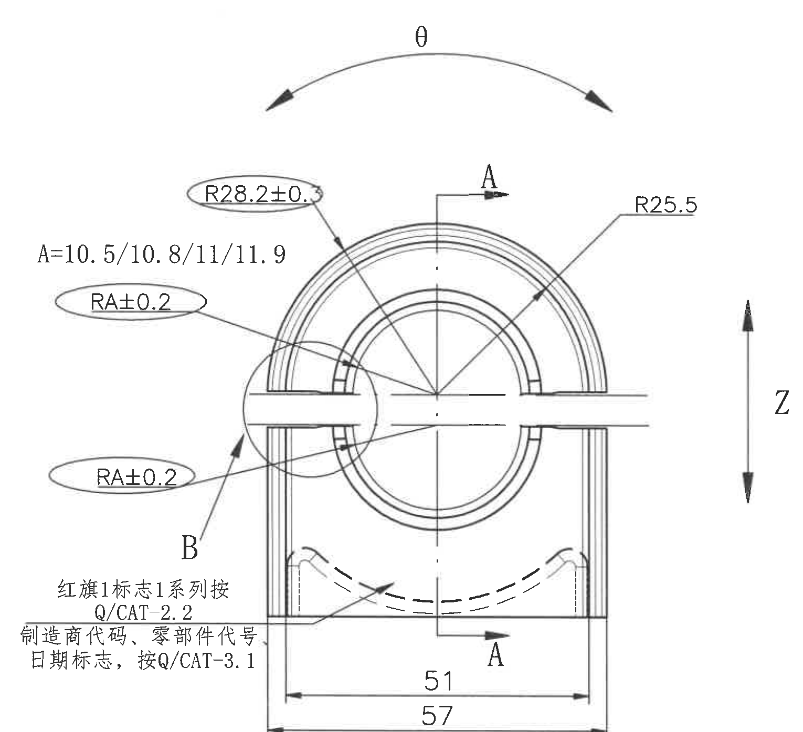

原图位置/视图名称：page 1，主加工视图，bbox `[385, 400, 1915, 1795]`。

| 提取项 | 原图数值或文本 | 含义说明 |
|---|---|---|
| 弧向角度/扭转方向 | θ | 视图上方弧形双箭头标注，表示该零件绕中心的扭转/角向方向；具体试验条件见表1中 θ（扭转）行。 |
| 圆弧半径 | R28.2±0.3 | 指向上部内侧圆弧，半径 28.2，公差 ±0.3；该值外有椭圆标识，按 NOTES 第10条为工序、出厂检验尺寸。 |
| 圆弧半径 | R25.5 | 指向右上外侧圆弧半径。 |
| A 值系列 | A=10.5/10.8/11/11.9 | 同一位置可选 A 尺寸系列，用于后续 RA 标注的取值来源。 |
| 圆弧半径/公差 | RA±0.2（上方一处） | 指向左侧上部小圆弧，按图面文字为 R A ±0.2，即以 A 值为圆弧半径并允许 ±0.2。 |
| 圆弧半径/公差 | RA±0.2（下方一处） | 指向左侧下部小圆弧，按图面文字为 R A ±0.2，即以 A 值为圆弧半径并允许 ±0.2。 |
| 剖切/视向标识 | A（上方箭头） | 指示 A-A 剖面方向，剖面内容在 object_2 中提取。 |
| 剖切/视向标识 | A（下方箭头） | 与上方 A 配对，限定 A-A 剖切位置。 |
| 局部视图引出 | B | 指向左侧局部区域，放大局部视图在 object_3 中提取。 |
| 方向标识 | Z | 右侧竖向双箭头，标识 Z 向。 |
| 水平宽度 | 51 | 底部内侧水平尺寸，两端箭头限定内侧宽度。 |
| 总宽度 | 57 | 底部外侧水平尺寸，两端箭头限定总宽度。 |
| 标识要求 | 红旗1标志1系列按 Q/CAT-2.2 | 左下文字说明对应标识规范。 |
| 标识要求 | 制造商代码、零部件代号、日期标志，按 Q/CAT-3.1 | 左下文字说明制造商代码、零部件代号和日期标志规范。 |
| 未见项目 | 直径符号、数量前缀、括号内参考尺寸、带星号关键尺寸、T 编号 | 当前主加工视图未见这些标注。 |

边界归属说明：本裁切只包含左侧主加工视图及其自身标注；A-A 剖面、B 放大图、表格和 NOTES 未纳入。本视图中的 B 仅作为局部视图引出标记，B 视图尺寸不归入主视图。底部 57 尺寸线和文字完整包含。

## object_2 A-A 剖面视图

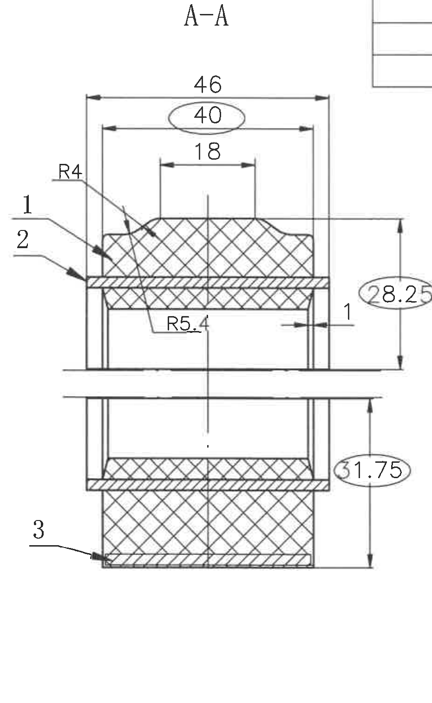

原图位置/视图名称：page 1，A-A 剖面视图，bbox `[1900, 360, 2830, 1870]`。

| 提取项 | 原图数值或文本 | 含义说明 |
|---|---|---|
| 剖面名称 | A-A | 与主视图 A-A 剖切方向对应。 |
| 总宽度 | 46 | 剖面上方最外侧水平尺寸。 |
| 工序/出厂检验尺寸 | 40 | 上方水平尺寸，文字外有椭圆标识，按 NOTES 第10条为工序、出厂检验尺寸。 |
| 局部宽度 | 18 | 上方中间凸起区域的局部水平尺寸。 |
| 圆角半径 | R4 | 左上过渡圆角半径。 |
| 内部圆弧半径 | R5.4 | 剖面内部下侧过渡圆弧半径。 |
| 局部尺寸 | 1 | 右侧水平小尺寸，指向侧壁/间隙位置。 |
| 竖向尺寸 | 0.5 | 右侧竖向局部厚度/间隙尺寸。 |
| 工序/出厂检验尺寸 | 28.25 | 右上竖向尺寸，文字外有椭圆标识，按 NOTES 第10条为工序、出厂检验尺寸。 |
| 工序/出厂检验尺寸 | 31.75 | 右下竖向尺寸，文字外有椭圆标识，按 NOTES 第10条为工序、出厂检验尺寸。 |
| 零件序号 | 1 | 左侧和右侧引线均指向序号 1 对应构件。 |
| 零件序号 | 2 | 左侧引线指向序号 2 对应构件。 |
| 零件序号 | 3 | 左下引线指向序号 3 对应构件。 |
| 剖面填充 | 交叉剖面线、斜剖面线 | 表示被剖切材料区域。 |
| 未见项目 | 直径符号、数量前缀、括号内参考尺寸、带星号关键尺寸、T 编号 | 当前 A-A 剖面未见这些标注。 |

边界归属说明：本裁切保留 A-A 剖面完整尺寸线、箭头、序号引线和文字；左侧主视图 Z 标记和右侧 B 视图尺寸未纳入。右上角有极小相邻表格线框残留，不含表格文字，不作为 A-A 内容提取。

## object_3 B 局部视图

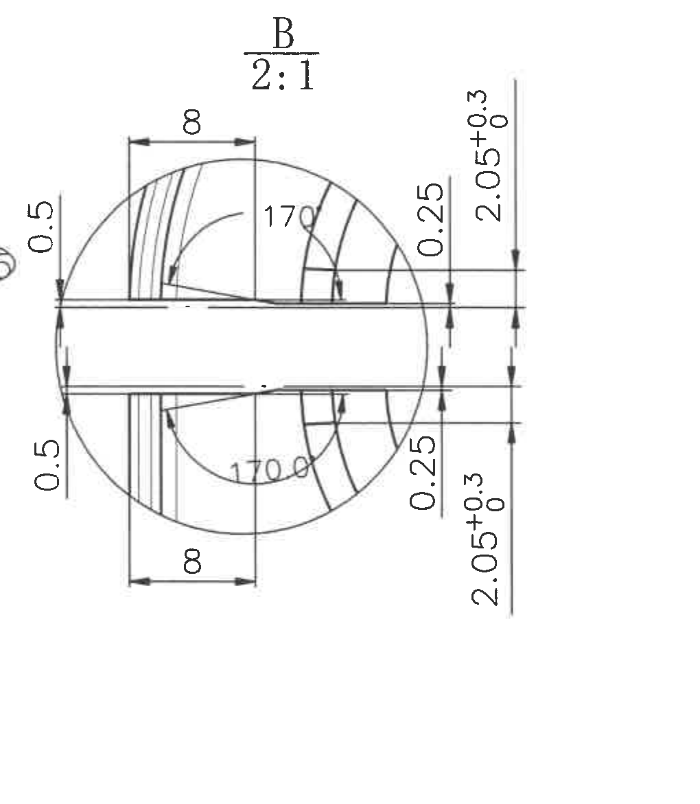

原图位置/视图名称：page 1，B 局部放大视图，比例 2:1，bbox `[2815, 605, 3835, 1775]`。

| 提取项 | 原图数值或文本 | 含义说明 |
|---|---|---|
| 局部视图名称 | B | 对应主视图中的 B 引出区域。 |
| 比例 | 2:1 | B 局部视图放大比例。 |
| 局部宽度 | 8（上方） | 上侧局部开口/肋宽度尺寸。 |
| 局部宽度 | 8（下方） | 下侧局部开口/肋宽度尺寸。 |
| 角度 | 170°（上方） | 上半圆区域角度尺寸。 |
| 角度 | 170°（下方） | 下半圆区域角度尺寸。 |
| 局部厚度 | 0.5（左上） | 左侧上部竖向局部厚度尺寸。 |
| 局部厚度 | 0.5（左下） | 左侧下部竖向局部厚度尺寸。 |
| 局部厚度 | 0.25（右上） | 右侧上部竖向局部厚度尺寸。 |
| 局部厚度 | 0.25（右下） | 右侧下部竖向局部厚度尺寸。 |
| 带公差尺寸 | 2.05+0.3/0（上方） | 右侧上部竖向尺寸，上偏差 +0.3，下偏差 0。 |
| 带公差尺寸 | 2.05+0.3/0（下方） | 右侧下部竖向尺寸，上偏差 +0.3，下偏差 0。 |
| 未见项目 | 直径符号、数量前缀、括号内参考尺寸、带星号关键尺寸、T 编号 | 当前 B 局部视图未见这些标注。 |

边界归属说明：本裁切只提取 B 局部视图内尺寸；左侧 A-A 剖面和右侧表格未纳入。靠近左边界的 0.5 尺寸线箭头和文字完整包含，归属于 B 局部视图。

## object_4 来历/客户版本号表

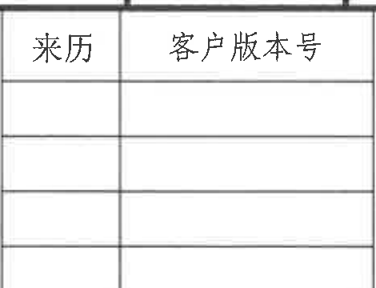

原图位置/视图名称：page 1，顶部来历/客户版本号表，bbox `[2700, 170, 3170, 530]`。

原表还原：

| 来历 | 客户版本号 |
|---|---|
|  |  |
|  |  |
|  |  |

| 提取项 | 原图数值或文本 | 含义说明 |
|---|---|---|
| 表头 | 来历 | 左列表头，当前未填写记录。 |
| 表头 | 客户版本号 | 右列表头，当前未填写记录。 |
| 数据行 | 空白 3 行 | 原图可见三行空白记录区。 |

边界归属说明：本裁切只包含顶部左侧来历/客户版本号空白表，不包含右侧修订履历表内容。

## object_5 修订履历表

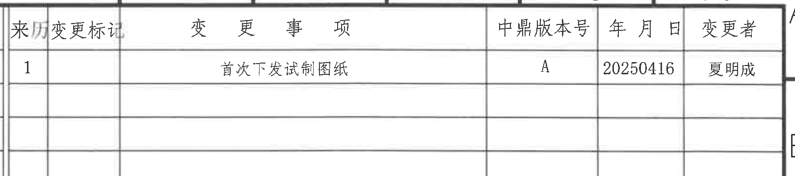

原图位置/视图名称：page 1，顶部修订履历表，bbox `[3160, 170, 4780, 530]`。

原表还原：

| 来历 | 变更标记 | 变更事项 | 中鼎版本号 | 年月日 | 变更者 |
|---|---|---|---|---|---|
| 1 |  | 首次下发试制图纸 | A | 20250416 | 夏明成 |
|  |  |  |  |  |  |
|  |  |  |  |  |  |
|  |  |  |  |  |  |

| 提取项 | 原图数值或文本 | 含义说明 |
|---|---|---|
| 修订记录 | 1 | 来历序号。 |
| 变更标记 | 空白 | 第一条记录未填写变更标记。 |
| 变更事项 | 首次下发试制图纸 | 说明本次变更内容。 |
| 中鼎版本号 | A | 图纸版本号。 |
| 年月日 | 20250416 | 变更日期。 |
| 变更者 | 夏明成 | 变更人员。 |

边界归属说明：本裁切只包含顶部右侧修订履历表；左侧来历/客户版本号表只保留极小边界线，不提取其内容。

## object_6 表3 公差标准

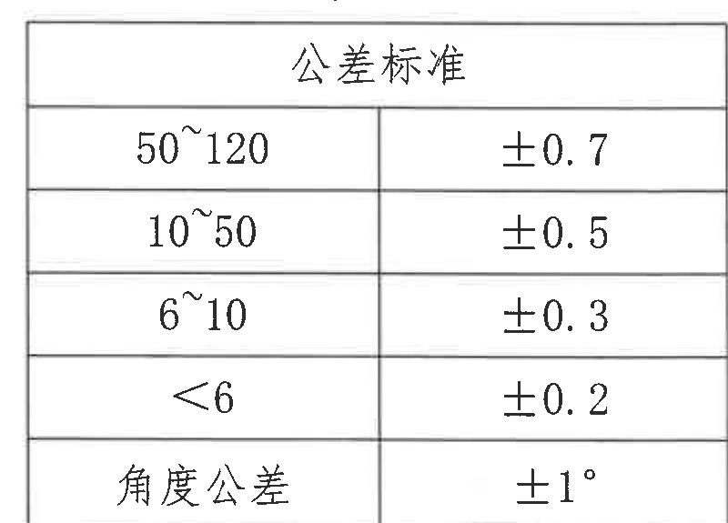

原图位置/视图名称：page 1，表3 公差标准，bbox `[3830, 630, 4630, 1205]`。

原表还原：

| 公差标准 |  |
|---|---|
| 50~120 | ±0.7 |
| 10~50 | ±0.5 |
| 6~10 | ±0.3 |
| <6 | ±0.2 |
| 角度公差 | ±1° |

| 提取项 | 原图数值或文本 | 含义说明 |
|---|---|---|
| 线性尺寸公差 | 50~120：±0.7 | 未注尺寸范围 50~120 的公差。 |
| 线性尺寸公差 | 10~50：±0.5 | 未注尺寸范围 10~50 的公差。 |
| 线性尺寸公差 | 6~10：±0.3 | 未注尺寸范围 6~10 的公差。 |
| 线性尺寸公差 | <6：±0.2 | 未注尺寸小于 6 的公差。 |
| 角度公差 | ±1° | 未注角度公差。 |

边界归属说明：本裁切仅包含表3外框、表题和所有行列；未包含下方表2或左侧 B 视图内容。

## object_7 表2 噪音试验条件

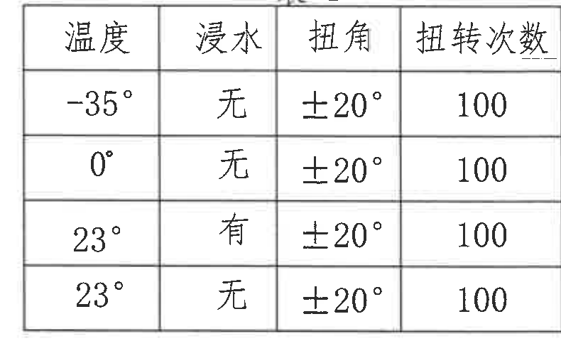

原图位置/视图名称：page 1，表2，bbox `[3830, 1270, 4620, 1750]`。

原表还原：

| 温度 | 浸水 | 扭角 | 扭转次数 |
|---|---|---|---|
| -35° | 无 | ±20° | 100 |
| 0° | 无 | ±20° | 100 |
| 23° | 有 | ±20° | 100 |
| 23° | 无 | ±20° | 100 |

| 提取项 | 原图数值或文本 | 含义说明 |
|---|---|---|
| 条件 1 | -35° / 无 / ±20° / 100 | 低温、无浸水条件下扭转 100 次。 |
| 条件 2 | 0° / 无 / ±20° / 100 | 0°、无浸水条件下扭转 100 次。 |
| 条件 3 | 23° / 有 / ±20° / 100 | 23°、浸水条件下扭转 100 次。 |
| 条件 4 | 23° / 无 / ±20° / 100 | 23°、无浸水条件下扭转 100 次。 |

边界归属说明：本裁切只包含表2；上方表3和下方表1未纳入。

## object_8 表1 刚度试验

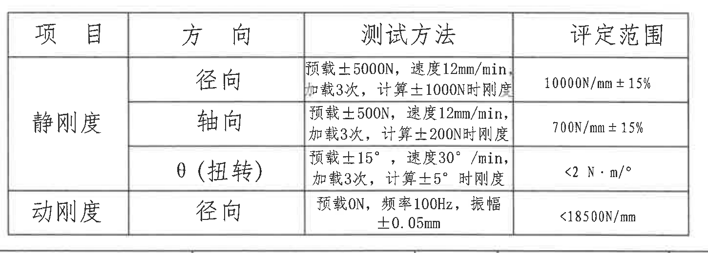

原图位置/视图名称：page 1，表1，bbox `[2990, 1880, 4440, 2400]`。

原表还原：

| 项目 | 方向 | 测试方法 | 评定范围 |
|---|---|---|---|
| 静刚度 | 径向 | 预载±5000N，速度12mm/min；加载3次，计算±1000N时刚度 | 10000N/mm±15% |
| 静刚度 | 轴向 | 预载±500N，速度12mm/min；加载3次，计算±200N时刚度 | 700N/mm±15% |
| 静刚度 | θ（扭转） | 预载±15°，速度30°/min；加载3次，计算±5°时刚度 | <2 N·m/° |
| 动刚度 | 径向 | 预载0N，频率100Hz，振幅±0.05mm | <18500N/mm |

| 提取项 | 原图数值或文本 | 含义说明 |
|---|---|---|
| 静刚度径向评定 | 10000N/mm±15% | 径向静刚度判定范围。 |
| 静刚度轴向评定 | 700N/mm±15% | 轴向静刚度判定范围。 |
| θ（扭转）评定 | <2 N·m/° | 扭转刚度判定范围，对应主视图 θ 弧向标识。 |
| 动刚度径向评定 | <18500N/mm | 径向动刚度判定范围。 |
| 测试参数 | ±5000N、12mm/min、±1000N、±500N、±200N、±15°、30°/min、±5°、0N、100Hz、±0.05mm | 表1各行测试方法中的载荷、速度、角度、频率和振幅参数。 |

边界归属说明：本裁切只包含表1完整外框、表题、表头和四行数据；未包含上方 B 视图或下方明细表。

## object_9 NOTES / 技术要求

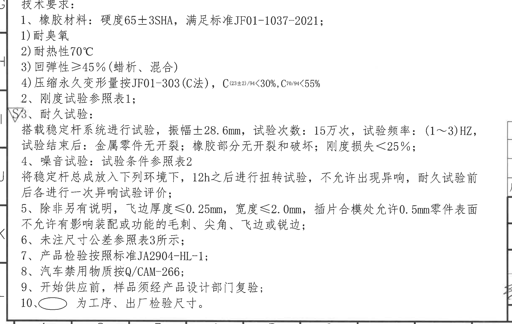

原图位置/视图名称：page 1，技术要求/NOTES，bbox `[340, 1815, 2780, 3360]`。

| 提取项 | 原图数值或文本 | 含义说明 |
|---|---|---|
| 标题 | 技术要求： | 技术要求文本区标题。 |
| 1 | 橡胶材料：硬度65±3SHA，满足标准JF01-1037-2021； | 橡胶材料硬度和适用标准。 |
| 1) | 耐臭氧 | 材料性能要求。 |
| 2) | 耐热性70°C | 材料耐热要求。 |
| 3) | 回弹性≥45%（蜡析、混合） | 材料回弹性要求。 |
| 4) | 压缩永久变形量按JF01-303(C法)，C(23±2)/94<30%，C70/94<55% | 压缩永久变形量及判定限值。 |
| 2 | 刚度试验参照表1； | 刚度试验引用表1。 |
| 3 | 耐久试验：搭载稳定杆系统进行试验，振幅±28.6mm，试验次数：15万次，试验频率：(1～3)HZ，试验结束后：金属零件无开裂；橡胶部分无开裂和破坏；刚度损失<25%； | 耐久试验条件和合格判定。 |
| 4 | 噪音试验：试验条件参照表2。将稳定杆总成放入下列环境下，12h之后进行扭转试验，不允许出现异响，耐久试验前后各进行一次异响试验评价； | 噪音试验条件及评价时机。 |
| 5 | 除非另有说明，飞边厚度≤0.25mm，宽度≤2.0mm，插片合模处允许0.5mm零件表面不允许有影响装配或功能的毛刺、尖角、飞边或锐边； | 飞边、合模处和表面缺陷要求。 |
| 6 | 未注尺寸公差参照表3所示； | 未注尺寸公差来源。 |
| 7 | 产品检验按照标准JA2904-HL-1； | 产品检验标准。 |
| 8 | 汽车禁用物质按Q/CAM-266； | 禁用物质标准。 |
| 9 | 开始供应前，样品须经产品设计部门复验； | 供样前复验要求。 |
| 10 | 椭圆符号为工序、出厂检验尺寸。 | 说明图中椭圆圈注尺寸的含义。 |
| 标记 | 第3条左侧三角形标记 | 原图在第3条旁有三角形标记，保留为文本区边界内标识。 |

边界归属说明：本裁切包含 NOTES 标题和第1至第10条完整文字；顶部主视图尺寸未纳入。左侧保留图框边线和第3条旁三角标记以避免裁断标识；右侧仅有空白和极少相邻线框边界，不提取为 NOTES 内容。

## object_10 零部件明细表

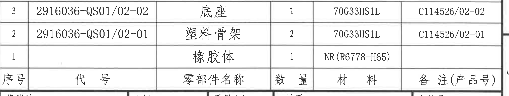

原图位置/视图名称：page 1，零部件明细表，bbox `[2760, 2390, 4790, 2775]`。

原表还原（原图表头位于表格底行，数据行在其上方）：

| 序号 | 代号 | 零部件名称 | 数量 | 材料 | 备注(产品号) |
|---|---|---|---|---|---|
| 3 | 2916036-QS01/02-02 | 底座 | 1 | 70G33HS1L | C114526/02-02 |
| 2 | 2916036-QS01/02-01 | 塑料骨架 | 2 | 70G33HS1L | C114526/02-01 |
| 1 |  | 橡胶体 | 1 | NR(R6778-H65) |  |

| 提取项 | 原图数值或文本 | 含义说明 |
|---|---|---|
| 序号3 | 2916036-QS01/02-02 / 底座 / 1 / 70G33HS1L / C114526/02-02 | 明细表第3项。 |
| 序号2 | 2916036-QS01/02-01 / 塑料骨架 / 2 / 70G33HS1L / C114526/02-01 | 明细表第2项。 |
| 序号1 | 橡胶体 / 1 / NR(R6778-H65) | 明细表第1项，代号和备注栏为空白。 |

边界归属说明：本裁切只包含零部件明细表行和底部表头；下方标题栏字段未纳入。

## object_11 标题栏

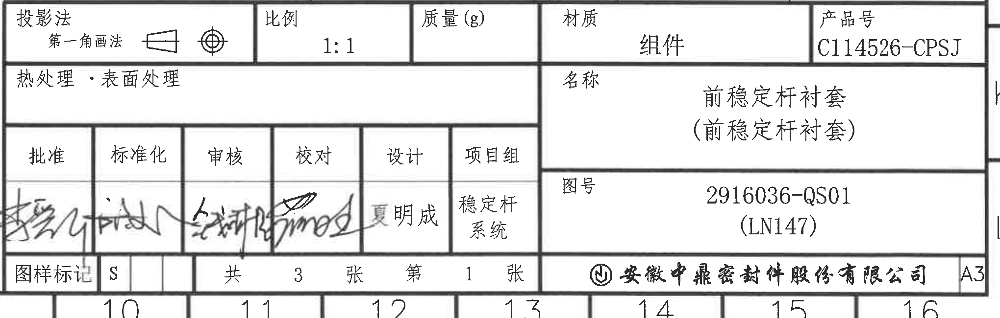

原图位置/视图名称：page 1，标题栏，bbox `[2750, 2750, 4790, 3400]`。

| 提取项 | 原图数值或文本 | 含义说明 |
|---|---|---|
| 投影法 | 第一角画法 | 标题栏左上投影法字段，含第一角画法符号。 |
| 比例 | 1:1 | 图样比例。 |
| 质量(g) | 空白 | 原图未填写质量。 |
| 材质 | 组件 | 标题栏材质栏文本。 |
| 产品号 | C114526-CPSJ | 产品号字段。 |
| 热处理・表面处理 | 空白 | 原图未填写处理方式。 |
| 名称 | 前稳定杆衬套（前稳定杆衬套） | 零件/组件名称。 |
| 图号 | 2916036-QS01 (LN147) | 图号及括号内参考/平台标识。 |
| 批准 | 手写签名 | 批准栏签名。 |
| 标准化 | 手写签名 | 标准化栏签名。 |
| 审核 | 手写签名 | 审核栏签名。 |
| 校对 | 手写签名 | 校对栏签名。 |
| 设计 | 夏明成 | 设计人员。 |
| 项目组 | 稳定杆系统 | 项目组字段。 |
| 图样标记 | S | 图样标记栏。 |
| 张数 | 共3张，第1张 | 图纸张数和当前张号。 |
| 公司 | 安徽中鼎密封件股份有限公司 | 标题栏底部公司名称。 |
| 幅面 | A3 | 图纸幅面。 |

边界归属说明：本裁切只包含标题栏，零部件明细表已单独作为 object_10 提取。图号中的 `(LN147)` 为括号内参考/平台标识，保留并说明。

## 裁切检查记录

| 对象 | 检查结果 |
|---|---|
| object_1 主加工视图 | 完整包含 θ、R28.2±0.3、R25.5、RA±0.2、A=10.5/10.8/11/11.9、A/A、B、Z、51、57；未带入 A-A 剖面、B 放大图、表格或 NOTES 文字。 |
| object_2 A-A 剖面视图 | 完整包含 A-A、46、40、18、R4、R5.4、1、0.5、28.25、31.75、序号1/2/3；去除了主视图 Z 和 B 视图片段，右上角仅有相邻表格线角残留且未提取。 |
| object_3 B 局部视图 | 完整包含 B、2:1、8、170°、0.5、0.25、2.05+0.3/0 等尺寸线和文字；未混入 A-A 剖面或表格内容。 |
| object_4 来历/客户版本号表 | 表头和三行空白记录区完整，未带入修订履历表文本。 |
| object_5 修订履历表 | 表头、记录行和空白行完整，边缘文字未裁断。 |
| object_6 表3 公差标准 | 表题、外框、所有行列和数值完整，未带入表2。 |
| object_7 表2 | 表题、表头和四行数据完整，未带入表3或表1。 |
| object_8 表1 | 表题、表头、四行测试方法和评定范围完整；右侧评价范围未裁断。 |
| object_9 NOTES/技术要求 | 第1至第10条完整；顶部不含主视图 57 尺寸；左侧三角标识完整保留。 |
| object_10 零部件明细表 | 三条明细和底部表头完整；未带入标题栏字段。 |
| object_11 标题栏 | 标题栏字段、签审栏、图号、产品号、公司名和 A3 幅面完整；未带入明细表行。 |
