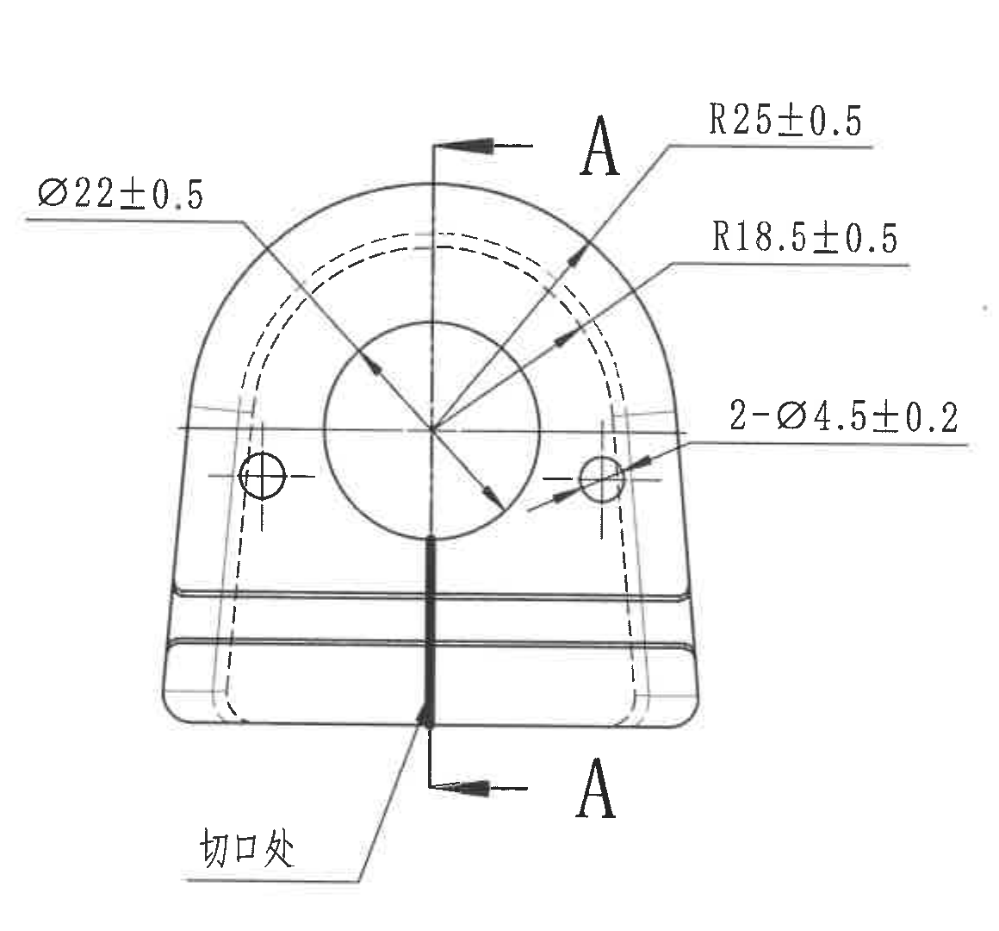
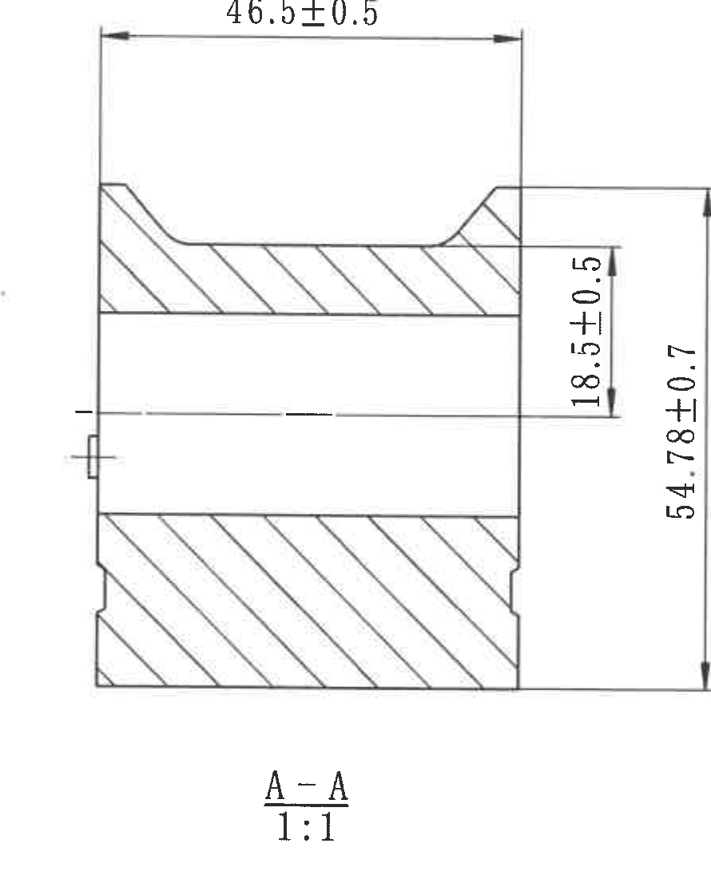
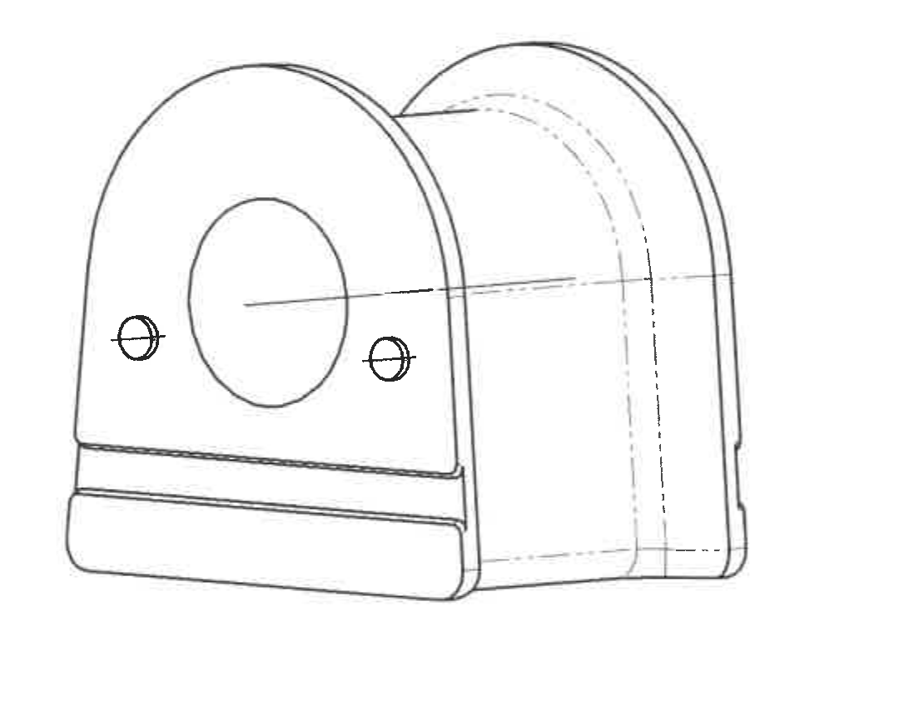
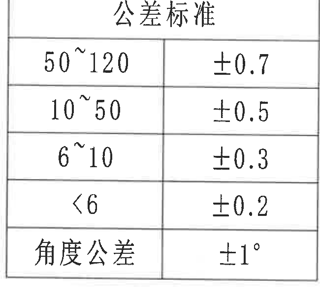
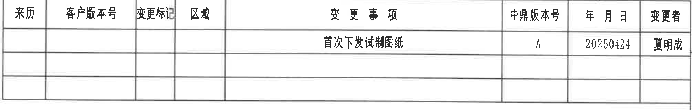
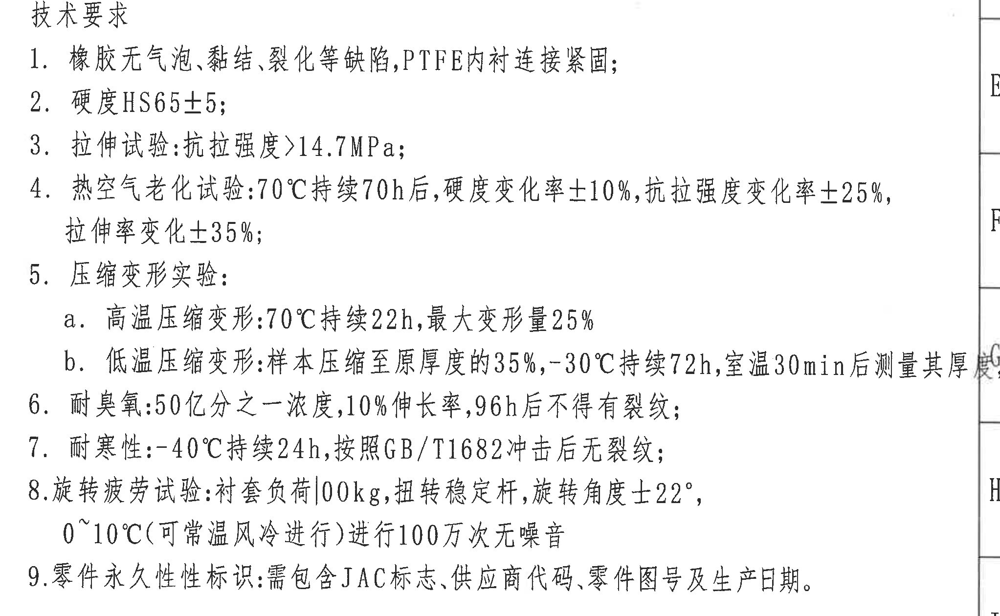
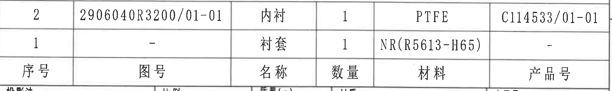
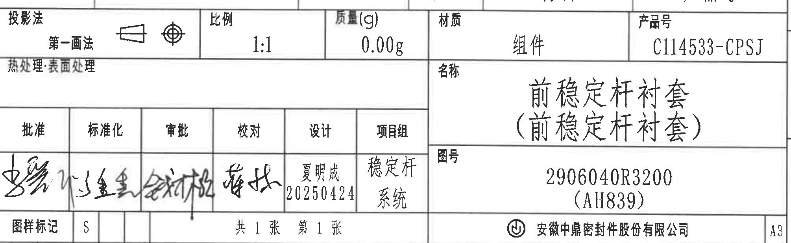

# 20C114533 PDF 内容识别与裁切提取

整页渲染图：`20C114533_assets/images/page_1.png`  
整页尺寸：4959 x 3505 px。以下 bbox 均按整页 PNG 坐标记录为 `[x, y, width, height]`。

## object_1 | 主视图

原图位置/视图名称：第 1 页左上主视图，bbox `[700, 690, 1160, 1080]`。

边界归属说明：裁切范围完整包含主视图轮廓、中心线、两处 A 剖切标识、全部尺寸引线、箭头和“切口处”文字；右侧尺寸 `2-Ø4.5±0.2` 的引线和文字均属于本主视图，未混入 A-A 剖面尺寸或技术要求文字。

| 提取项 | 原图数值或文本 | 含义说明 |
|---|---|---|
| 孔径尺寸 | `Ø22±0.5` | 主视图中心圆孔直径，公差为 ±0.5。 |
| 外圆弧半径 | `R25±0.5` | 顶部外侧圆弧半径，公差为 ±0.5。 |
| 内圆弧半径 | `R18.5±0.5` | 内侧虚线/内衬相关圆弧半径，公差为 ±0.5。 |
| 小孔数量和直径 | `2-Ø4.5±0.2` | 两个小孔，单孔直径 Ø4.5，公差 ±0.2；数量前缀 `2-` 属于该孔径标注。 |
| 剖切标识 | `A`、`A` | 上下两个 A 标识对应 A-A 剖面位置；这是剖切视图编号，不是几何基准框中的基准字母。 |
| 局部文字 | `切口处` | 指向下方中部切口位置的加工/结构提示。 |
| 参考尺寸/关键尺寸/T 编号 | 未见括号参考尺寸、未见星号关键尺寸、未见 T 编号 | 本裁切对象中没有括号尺寸、星号尺寸或 T 编号。 |

## object_2 | A-A 剖面视图

原图位置/视图名称：第 1 页中上 A-A 剖面视图，bbox `[1840, 680, 890, 1120]`。

边界归属说明：裁切范围完整包含剖面剖线、中心线、剖面标题 `A-A`、比例 `1:1` 和三个尺寸标注；右侧竖向尺寸 `18.5±0.5`、`54.78±0.7` 均归属于 A-A 剖面，不归入主视图。初裁带入右侧技术要求文字，已重裁去除。

| 提取项 | 原图数值或文本 | 含义说明 |
|---|---|---|
| 水平尺寸 | `46.5±0.5` | A-A 剖面上部水平方向尺寸，公差 ±0.5。 |
| 内部竖向尺寸 | `18.5±0.5` | 剖面右侧内部高度/中心线至上内轮廓相关尺寸，公差 ±0.5。 |
| 总高度 | `54.78±0.7` | A-A 剖面总高度，公差 ±0.7。 |
| 剖面名称 | `A-A` | 与主视图中的 A-A 剖切位置对应。 |
| 比例 | `1:1` | 该剖面按 1:1 比例绘制。 |
| 参考尺寸/关键尺寸/T 编号 | 未见括号参考尺寸、未见星号关键尺寸、未见 T 编号 | 本剖面未出现括号参考尺寸、星号关键尺寸或 T 编号。 |

## object_3 | 轴测加工视图

原图位置/视图名称：第 1 页下中轴测加工视图，bbox `[1530, 1930, 1080, 860]`。

边界归属说明：裁切范围完整包含轴测轮廓、中心圆孔、两个小孔、虚线内轮廓和底部结构；该视图没有独立尺寸标注，尺寸归属以主视图和 A-A 剖面为准。

| 提取项 | 原图数值或文本 | 含义说明 |
|---|---|---|
| 视图内容 | 轴测外形、中心圆孔、两个小孔、虚线内轮廓 | 用于表达零件三维结构和内衬/衬套形态。 |
| 独立尺寸 | 未见 | 该轴测图没有单独尺寸、公差、角度、弧度或弧向尺寸标注。 |
| 参考尺寸/关键尺寸/T 编号 | 未见括号参考尺寸、未见星号关键尺寸、未见 T 编号 | 本视图仅作形状表达，未出现这些标注。 |

## object_4 | 公差标准表

原图位置/视图名称：第 1 页左下公差标准表，bbox `[590, 2490, 650, 610]`。

边界归属说明：裁切范围完整包含表格外框、所有横竖线、表头和每一行公差文字；未混入周边视图或标题栏内容。

原表还原：

| 公差标准 | 公差 |
|---|---|
| `50~120` | `±0.7` |
| `10~50` | `±0.5` |
| `6~10` | `±0.3` |
| `<6` | `±0.2` |
| `角度公差` | `±1°` |

| 提取项 | 原图数值或文本 | 含义说明 |
|---|---|---|
| 线性尺寸范围 | `50~120` | 对应未单独标注公差的线性尺寸公差 `±0.7`。 |
| 线性尺寸范围 | `10~50` | 对应未单独标注公差的线性尺寸公差 `±0.5`。 |
| 线性尺寸范围 | `6~10` | 对应未单独标注公差的线性尺寸公差 `±0.3`。 |
| 线性尺寸范围 | `<6` | 对应未单独标注公差的线性尺寸公差 `±0.2`。 |
| 角度公差 | `±1°` | 对应角度类未注公差。 |

## object_5 | 变更履历表

原图位置/视图名称：第 1 页右上变更履历表，bbox `[2750, 180, 2010, 320]`。

边界归属说明：裁切范围完整包含变更履历表外框、列线、表头和三条记录行；顶部图框坐标和右侧图框字母已通过重裁排除。

原表还原：

| 来历 | 客户版本号 | 变更标记 | 区域 | 变更事项 | 中鼎版本号 | 年月日 | 变更者 |
|---|---|---|---|---|---|---|---|
|  |  |  |  | 首次下发试制图纸 | A | 20250424 | 夏明成 |
|  |  |  |  |  |  |  |  |
|  |  |  |  |  |  |  |  |

| 提取项 | 原图数值或文本 | 含义说明 |
|---|---|---|
| 表头 | `来历 / 客户版本号 / 变更标记 / 区域 / 变更事项 / 中鼎版本号 / 年月日 / 变更者` | 变更履历字段。 |
| 变更事项 | `首次下发试制图纸` | 该版本首次下发试制图纸。 |
| 中鼎版本号 | `A` | 中鼎内部版本号。 |
| 年月日 | `20250424` | 变更日期。 |
| 变更者 | `夏明成` | 变更人。 |

## object_6 | NOTES / 技术要求

原图位置/视图名称：第 1 页右侧 NOTES/技术要求区域，bbox `[2750, 1120, 2045, 1260]`。

边界归属说明：第 5b 行文字末端靠近右侧图框 G 区域线，为保留“测量其厚度；”完整文字，右边界略放宽，裁切图右缘带入少量图框线和区域字母；这些图框内容不归属于 NOTES，不作为技术要求提取。其他文字均完整，没有被边缘裁掉。

| 提取项 | 原图数值或文本 | 含义说明 |
|---|---|---|
| 标题 | `技术要求` | NOTES 区域标题。 |
| 1 | `橡胶无气泡、黏结、裂化等缺陷,PTFE内衬连接紧固;` | 外观和连接要求：橡胶不得有缺陷，PTFE 内衬连接需紧固。 |
| 2 | `硬度HS65±5;` | 硬度要求为 HS65，允许偏差 ±5。 |
| 3 | `拉伸试验:抗拉强度>14.7MPa;` | 拉伸试验抗拉强度需大于 14.7 MPa。 |
| 4 | `热空气老化试验:70℃持续70h后,硬度变化率±10%,抗拉强度变化率±25%,拉伸率变化±35%;` | 热空气老化后硬度、抗拉强度、拉伸率变化率要求。 |
| 5 | `压缩变形实验:` | 压缩变形试验总项。 |
| 5a | `高温压缩变形:70℃持续22h,最大变形量25%` | 高温压缩变形条件和最大变形量。 |
| 5b | `低温压缩变形:样本压缩至原厚度的35%,-30℃持续72h,室温30min后测量其厚度;` | 低温压缩变形条件，恢复到室温 30 min 后测厚。 |
| 6 | `耐臭氧:50亿分之一浓度,10%伸长率,96h后不得有裂纹;` | 臭氧耐受条件和判定要求。 |
| 7 | `耐寒性:-40℃持续24h,按照GB/T1682冲击后无裂纹;` | 低温耐寒冲击要求。 |
| 8 | `旋转疲劳试验:衬套负荷100kg,扭转稳定杆,旋转角度±22°,0~10℃(可常温风冷进行)进行100万次无噪音` | 旋转疲劳条件：负荷、旋转角、温度条件和次数要求。 |
| 9 | `零件永久性性标识:需包含JAC标志、供应商代码、零件图号及生产日期。` | 零件永久标识内容要求。 |

## object_7 | 明细/材料表

原图位置/视图名称：第 1 页右下明细/材料表，bbox `[2750, 2470, 2010, 300]`。

边界归属说明：裁切范围包含明细表两条物料记录、列线和表头；原图中表头行位于两条数据行下方。下边缘仅保留相邻标题栏上边线，不提取标题栏字段。

原表还原：

| 序号 | 图号 | 名称 | 数量 | 材料 | 产品号 |
|---|---|---|---|---|---|
| `2` | `2906040R3200/01-01` | `内衬` | `1` | `PTFE` | `C114533/01-01` |
| `1` | `-` | `衬套` | `1` | `NR(R5613-H65)` | `-` |

| 提取项 | 原图数值或文本 | 含义说明 |
|---|---|---|
| 表头 | `序号 / 图号 / 名称 / 数量 / 材料 / 产品号` | 明细/材料字段。 |
| 序号 2 | `2906040R3200/01-01 / 内衬 / 1 / PTFE / C114533/01-01` | 内衬零件，数量 1，材料 PTFE，产品号 C114533/01-01。 |
| 序号 1 | `- / 衬套 / 1 / NR(R5613-H65) / -` | 衬套零件，数量 1，材料 NR(R5613-H65)，图号和产品号为空/未给出。 |

## object_8 | 标题栏

原图位置/视图名称：第 1 页右下标题栏，bbox `[2750, 2730, 2010, 620]`。

边界归属说明：裁切范围包含标题栏字段、投影法、比例、质量、材质、产品号、名称、图号、签署栏、图样标记、页数、公司名和图幅 A3；顶部有明细表下边线残影，底部外图框坐标已重裁排除。

| 提取项 | 原图数值或文本 | 含义说明 |
|---|---|---|
| 投影法 | `第一画法` | 标题栏中显示第一画法投影符号。 |
| 比例 | `1:1` | 图纸比例。 |
| 质量(g) | `0.00g` | 组件质量。 |
| 材质 | `组件` | 标题栏材质/对象类型栏为组件。 |
| 产品号 | `C114533-CPSJ` | 标题栏产品号。 |
| 热处理/表面处理 | `热处理:表面处理` | 该栏未填写具体处理方式，仅显示字段文字。 |
| 名称 | `前稳定杆衬套 (前稳定杆衬套)` | 零件/组件名称，括号内为重复名称文本。 |
| 图号 | `2906040R3200 (AH839)` | 图纸编号及括号内代号。 |
| 批准 | 手写签名 | 签署栏，手写内容不可稳定辨认为标准文字。 |
| 标准化 | 手写签名 | 签署栏，手写内容不可稳定辨认为标准文字。 |
| 审批 | 手写签名 | 签署栏，手写内容不可稳定辨认为标准文字。 |
| 校对 | 手写签名 | 签署栏，手写内容不可稳定辨认为标准文字。 |
| 设计 | `夏明成 20250424` | 设计人和日期。 |
| 项目组 | `稳定杆 系统` | 项目组信息。 |
| 图样标记 | `S` | 图样标记。 |
| 页数 | `共 1 张 第 1 张` | 总页数和当前页。 |
| 公司 | `安徽中鼎密封件股份有限公司` | 出图单位。 |
| 图幅 | `A3` | 图纸幅面。 |

## 裁切检查记录

| 图片 | bbox | 检查结果 | 重裁/边界说明 |
|---|---:|---|---|
| `page_1.png` | `[0, 0, 4959, 3505]` | 整页 PNG 完整，包含外图框、全部视图、表格、NOTES 和标题栏。 | PDF 先渲染为整页 PNG 后再裁切。 |
| `object_1.png` | `[700, 690, 1160, 1080]` | 主视图完整，所有尺寸线、箭头、文字均完整。 | 未混入 A-A 剖面尺寸。 |
| `object_2.png` | `[1840, 680, 890, 1120]` | A-A 剖面完整，尺寸 `46.5±0.5`、`18.5±0.5`、`54.78±0.7` 和 `A-A 1:1` 均完整。 | 初裁带入技术要求文字，已重裁去除。 |
| `object_3.png` | `[1530, 1930, 1080, 860]` | 轴测视图完整，无尺寸文字被裁切。 | 该视图无独立尺寸标注。 |
| `object_4.png` | `[590, 2490, 650, 610]` | 公差表完整，表框、行列线和文字均完整。 | 无相邻对象混入。 |
| `object_5.png` | `[2750, 180, 2010, 320]` | 变更履历表完整，表头和记录行均完整。 | 初裁包含顶部图框坐标和右侧图框字母，已重裁排除。 |
| `object_6.png` | `[2750, 1120, 2045, 1260]` | 技术要求文字完整；第 5b 行末尾“测量其厚度；”完整保留。 | 为保留靠边文字，右缘带入少量图框线和区域字母，未作为 NOTES 内容提取。 |
| `object_7.png` | `[2750, 2470, 2010, 300]` | 明细/材料表文字完整，两条数据行和表头均完整。 | 初裁带入标题栏字段，已重裁；下边缘仅见相邻标题栏上边线。 |
| `object_8.png` | `[2750, 2730, 2010, 620]` | 标题栏字段完整，底部公司名和 A3 完整。 | 初裁顶部字段不完整且底部带入外图框坐标，已重裁。 |
