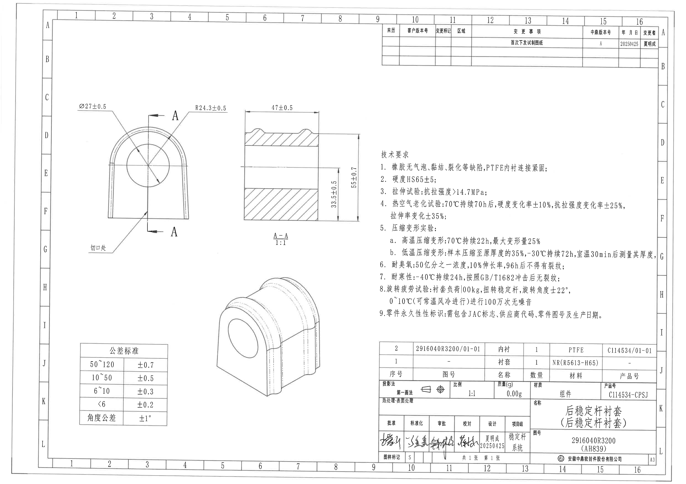
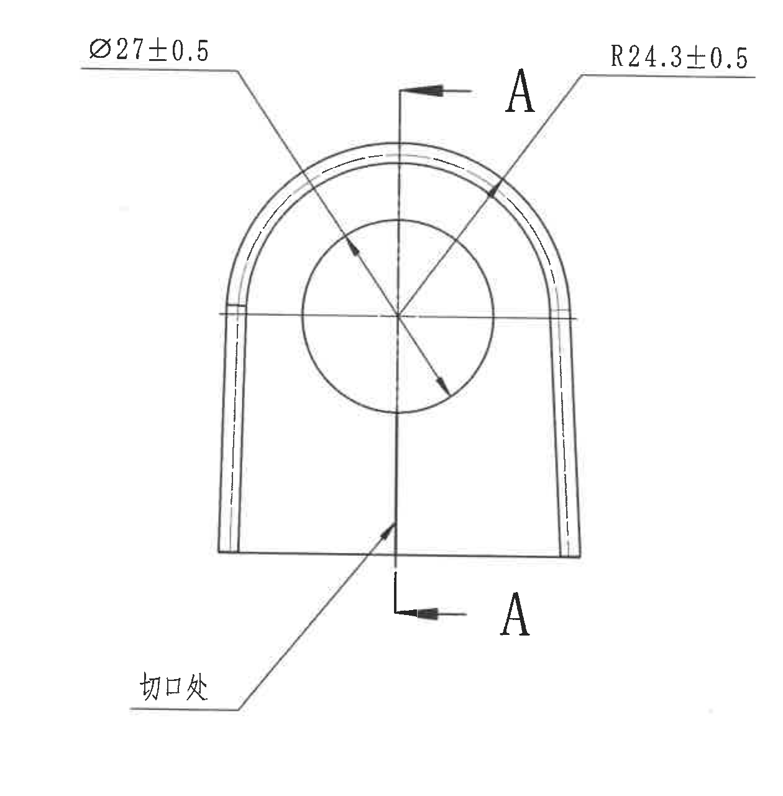
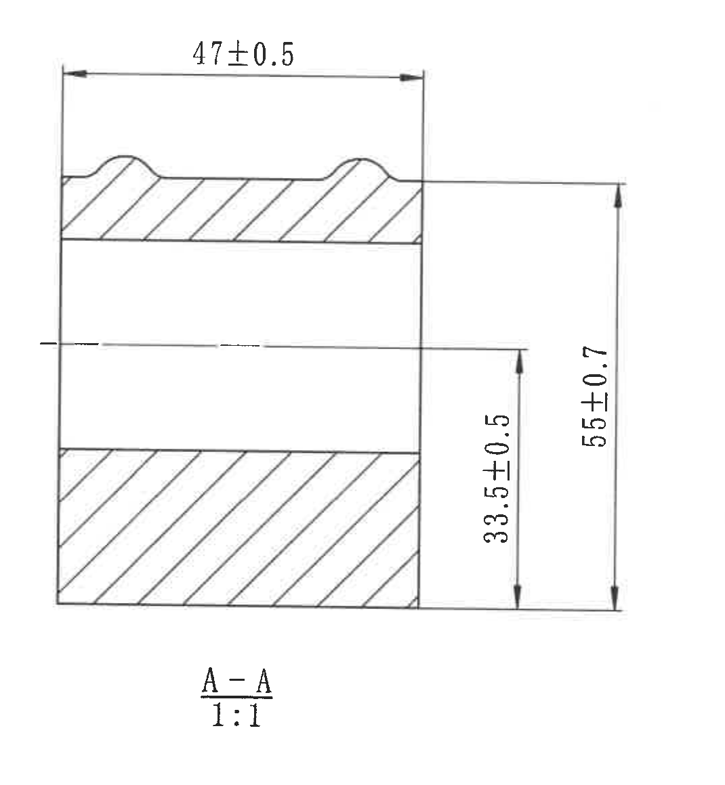
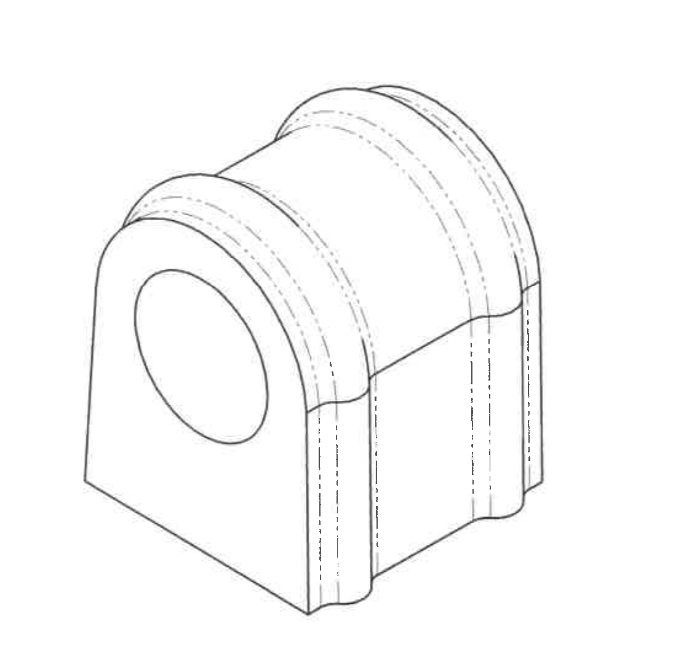
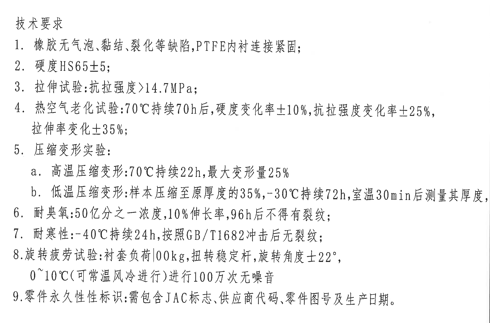
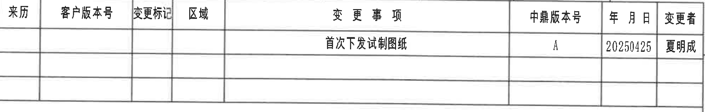
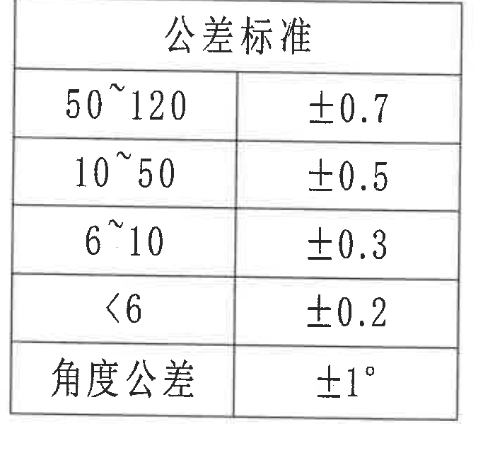
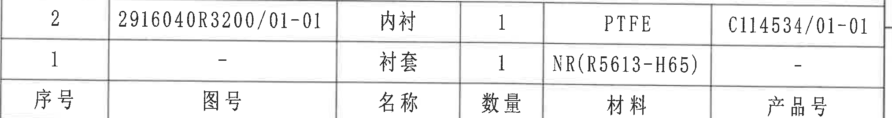
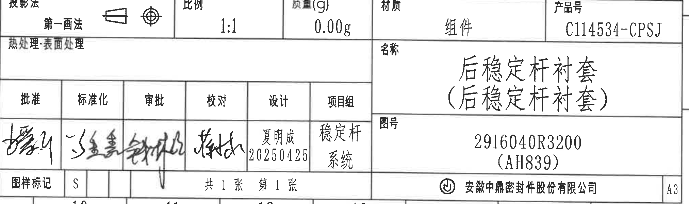

# 20C114534 内容识别

整页 PNG 渲染：`outputs/20C114534_assets/images/page_1.png`；原 PDF 共 1 页，300 DPI 渲染尺寸为 4959 x 3505 px。

## object_1：主视图 / 正面加工视图

原图位置/视图名称：第 1 页左上区域，主视图/正面加工视图，bbox `[430, 690, 1260, 1280]`。

| 提取项 | 原图数值或文本 | 含义说明 |
|---|---|---|
| 内孔直径 | `Ø27±0.5` | 指向中心圆孔，表示通孔直径为 27，允许偏差 ±0.5。 |
| 外圆弧半径 | `R24.3±0.5` | 指向顶部圆弧外轮廓，表示主视图顶部圆弧半径为 24.3，允许偏差 ±0.5。 |
| 剖切线 | `A` / `A` | 竖直剖切线穿过中心孔，箭头和字母 A 指示 A-A 剖面位置与观察方向。 |
| 局部标注 | `切口处` | 引出线指向主视图下部靠中心的切口/开口位置，用于说明该处为切口位置。 |
| 中心线 | 横向与竖向中心线 | 表示孔中心和圆弧中心的定位基准；尺寸 `Ø27±0.5` 与 `R24.3±0.5` 均围绕该中心表达。 |

边界归属说明：该裁切只包含主视图本体、主视图尺寸文字和 A-A 剖切标记；`47±0.5`、`33.5±0.5`、`55±0.7` 属于右侧 A-A 剖面图，未归入本主视图。

## object_2：A-A 剖面视图

原图位置/视图名称：第 1 页上中区域，A-A 剖面视图，bbox `[1680, 700, 1070, 1160]`。

| 提取项 | 原图数值或文本 | 含义说明 |
|---|---|---|
| 剖面名称 | `A-A` | 与主视图中的 A-A 剖切线对应，表示按 A-A 位置得到的剖面。 |
| 比例 | `1:1` | 该剖面按 1:1 比例绘制。 |
| 宽度/轴向长度 | `47±0.5` | 顶部水平尺寸，表示剖面方向上的总宽度/轴向长度为 47，允许偏差 ±0.5。 |
| 中心线至底部高度 | `33.5±0.5` | 右侧内侧竖向尺寸，从剖面中心线至底部外轮廓，允许偏差 ±0.5。 |
| 总高度 | `55±0.7` | 右侧外侧竖向尺寸，从顶部外轮廓至底部外轮廓的总高度，允许偏差 ±0.7。 |
| 剖面线 | 斜向剖面线 | 表示实体材料被剖切的区域；中间未剖区域为空腔/孔道。 |

边界归属说明：该裁切完整包含 A-A 剖面的尺寸线、箭头、剖面线、标题和比例；主视图中的 `Ø27±0.5`、`R24.3±0.5` 与“切口处”不属于此剖面对象。

## object_3：轴测视图 / 三维外形视图

原图位置/视图名称：第 1 页下中区域，轴测视图/三维外形视图，bbox `[1430, 1870, 1120, 1080]`。

| 提取项 | 原图数值或文本 | 含义说明 |
|---|---|---|
| 外形表达 | 无独立尺寸文字 | 用于展示零件的三维外形、通孔、圆弧外轮廓、侧向开口和内部虚线轮廓。 |
| 尺寸来源 | 参考主视图与 A-A 剖面 | 轴测视图不单独给出尺寸；孔径、圆弧、宽度和高度应以 object_1 与 object_2 的尺寸为准。 |
| 虚线/隐藏线 | 多条虚线 | 表示不可见边界或内部结构轮廓。 |

边界归属说明：该裁切只包含轴测外形图，不含主视图或 A-A 剖面的尺寸标注；未从该视图提取独立尺寸。

## object_4：NOTES / 技术要求

原图位置/视图名称：第 1 页右中区域，NOTES/技术要求，bbox `[2690, 1020, 2060, 1360]`。

| 提取项 | 原图数值或文本 | 含义说明 |
|---|---|---|
| 标题 | `技术要求` | 技术要求文本区标题。 |
| 1 | `橡胶无气泡、粘结、裂化等缺陷,PTFE内衬连接紧固;` | 对橡胶外观缺陷和 PTFE 内衬连接状态的要求。 |
| 2 | `硬度HS65±5;` | 硬度要求为 HS65，允许偏差 ±5。 |
| 3 | `拉伸试验:抗拉强度>14.7MPa;` | 拉伸试验中抗拉强度必须大于 14.7 MPa。 |
| 4 | `热空气老化试验:70℃持续70h后,硬度变化率±10%,抗拉强度变化率±25%,拉伸率变化±35%;` | 热空气老化条件与老化后硬度、抗拉强度、拉伸率变化率要求。 |
| 5 | `压缩变形实验:` | 压缩变形试验总项。 |
| 5a | `高温压缩变形:70℃持续22h,最大变形量25%` | 高温压缩变形条件和最大变形量要求。 |
| 5b | `低温压缩变形:样本压缩至原厚度的35%,-30℃持续72h,室温30min后测量其厚度,` | 低温压缩变形条件，包含压缩比例、温度、时间和室温放置后测量要求。 |
| 6 | `耐臭氧:50亿分之一浓度,10%伸长率,96h后不得有裂纹;` | 臭氧耐受条件和裂纹判定要求。 |
| 7 | `耐寒性:-40℃持续24h,按照GB/T1682冲击后无裂纹;` | 耐寒冲击试验条件与判定要求。 |
| 8 | `旋转疲劳试验:衬套负荷100kg,扭转稳定杆,旋转角度±22°,0~10℃(可常温风冷进行)进行100万次无噪音` | 旋转疲劳试验的负荷、扭转对象、角度、温度和循环次数要求。 |
| 9 | `零件永久性标识:需包含JAC标志、供应商代码、零件图号及生产日期。` | 零件永久性标识内容要求。 |

边界归属说明：该裁切只包含技术要求文本区，不包含右下标题栏、明细表或左侧加工视图；文本按原编号逐项还原。

## object_5：变更履历表 / 修订表

原图位置/视图名称：第 1 页右上区域，变更履历表/修订表，bbox `[2775, 185, 1990, 320]`。

| 来历 | 客户版本号 | 变更标记 | 区域 | 变更事项 | 中鼎版本号 | 年 月 日 | 变更者 |
|---|---|---|---|---|---|---|---|
|  |  |  |  | 首次下发试制图纸 | A | 20250425 | 夏明成 |
|  |  |  |  |  |  |  |  |
|  |  |  |  |  |  |  |  |

| 提取项 | 原图数值或文本 | 含义说明 |
|---|---|---|
| 修订记录 | `首次下发试制图纸` | 表示该图纸首次下发试制。 |
| 中鼎版本号 | `A` | 当前中鼎版本号为 A。 |
| 日期 | `20250425` | 变更日期为 2025-04-25。 |
| 变更者 | `夏明成` | 该次变更人员。 |

边界归属说明：该裁切只包含右上变更履历表本体；外部图框坐标字母和编号已排除。

## object_6：公差标准表

原图位置/视图名称：第 1 页左下区域，公差标准表，bbox `[560, 2490, 700, 640]`。

| 尺寸范围/项目 | 公差 |
|---|---|
| `50~120` | `±0.7` |
| `10~50` | `±0.5` |
| `6~10` | `±0.3` |
| `<6` | `±0.2` |
| `角度公差` | `±1°` |

| 提取项 | 原图数值或文本 | 含义说明 |
|---|---|---|
| 线性尺寸公差 | `50~120: ±0.7` | 对 50 至 120 范围的未注线性尺寸适用。 |
| 线性尺寸公差 | `10~50: ±0.5` | 对 10 至 50 范围的未注线性尺寸适用。 |
| 线性尺寸公差 | `6~10: ±0.3` | 对 6 至 10 范围的未注线性尺寸适用。 |
| 线性尺寸公差 | `<6: ±0.2` | 对小于 6 的未注线性尺寸适用。 |
| 角度公差 | `±1°` | 对未单独注明公差的角度尺寸适用。 |

边界归属说明：该裁切只包含左下公差标准表，不包含轴测视图或图纸外框坐标。

## object_7：明细表 / 物料表

原图位置/视图名称：第 1 页右下标题栏上方，明细表/物料表，bbox `[2740, 2480, 2025, 270]`。

| 序号 | 图号 | 名称 | 数量 | 材料 | 产品号 |
|---|---|---|---|---|---|
| `2` | `2916040R3200/01-01` | `内衬` | `1` | `PTFE` | `C114534/01-01` |
| `1` | `-` | `衬套` | `1` | `NR(R5613-H65)` | `-` |

| 提取项 | 原图数值或文本 | 含义说明 |
|---|---|---|
| 序号 2 | `2916040R3200/01-01 / 内衬 / 1 / PTFE / C114534/01-01` | PTFE 内衬，数量 1，对应产品号 C114534/01-01。 |
| 序号 1 | `- / 衬套 / 1 / NR(R5613-H65) / -` | NR 材料衬套，数量 1，材料括号内 `R5613-H65` 为材料牌号/硬度相关标识。 |

边界归属说明：该裁切只包含明细表表体和表头，不包含下方投影法、比例、质量等标题栏字段。

## object_8：标题栏

原图位置/视图名称：第 1 页右下区域，标题栏，bbox `[2740, 2772, 2025, 600]`。

| 字段 | 原图数值或文本 | 含义说明 |
|---|---|---|
| 投影法 | `第一画法` | 投影方法为第一画法，旁边带投影符号。 |
| 比例 | `1:1` | 图样比例为 1:1。 |
| 质量(g) | `0.00g` | 标题栏质量字段为 0.00 g。 |
| 材质 | `组件` | 标题栏材质字段填写为组件。 |
| 产品号 | `C114534-CPSJ` | 标题栏产品号。 |
| 热处理/表面处理 | `热处理:表面处理` | 字段存在，未见填写具体处理值。 |
| 名称 | `后稳定杆衬套 (后稳定杆衬套)` | 零件/组件名称；括号内为重复名称说明。 |
| 图号 | `2916040R3200 (AH839)` | 图号为 2916040R3200，括号内 AH839 为关联代号/参考代号。 |
| 批准 | 手写签名 | 批准栏为手写签名，未能稳定识别为标准文字。 |
| 标准化 | 手写签名 | 标准化栏为手写签名，未能稳定识别为标准文字。 |
| 审批 | 手写签名 | 审批栏为手写签名，未能稳定识别为标准文字。 |
| 校对 | 手写签名 | 校对栏为手写签名，未能稳定识别为标准文字。 |
| 设计 | `夏明成 20250425` | 设计人为夏明成，日期 2025-04-25。 |
| 项目组 | `稳定杆系统` | 项目组为稳定杆系统。 |
| 图样标记 | `S` | 图样标记为 S。 |
| 页数 | `共1张 第1张` | 图纸总 1 张，本页为第 1 张。 |
| 公司 | `安徽中鼎密封件股份有限公司` | 出图/公司名称。 |
| 图幅 | `A3` | 图幅规格为 A3。 |

边界归属说明：该裁切为右下标题栏整体，包含签署栏、投影法、比例、质量、材质、产品号、名称、图号、公司和图幅；上方明细表已单独裁切为 object_7，未把明细表条目归入标题栏。

## 裁切检查记录

| 对象 | 图片路径 | 检查结论 |
|---|---|---|
| page_1 | `outputs/20C114534_assets/images/page_1.png` | 整页渲染完整，包含图框、所有视图、表格、技术要求和标题栏。 |
| object_1 | `outputs/20C114534_assets/images/object_1.png` | 主视图尺寸线和文字完整；`Ø27±0.5`、`R24.3±0.5`、A-A 剖切箭头和“切口处”均未被裁断；未带入 A-A 剖面视图。 |
| object_2 | `outputs/20C114534_assets/images/object_2.png` | A-A 剖面尺寸线和文字完整；`47±0.5`、`33.5±0.5`、`55±0.7`、`A-A`、`1:1` 均完整；未混入主视图尺寸。 |
| object_3 | `outputs/20C114534_assets/images/object_3.png` | 轴测视图轮廓完整，未见独立尺寸文字；未混入其他视图。 |
| object_4 | `outputs/20C114534_assets/images/object_4.png` | 技术要求 1 至 9 条完整可见，文本未被边缘裁断；未混入标题栏或表格。 |
| object_5 | `outputs/20C114534_assets/images/object_5.png` | 变更履历表表头、记录行和空白行完整；外部图框坐标已排除。 |
| object_6 | `outputs/20C114534_assets/images/object_6.png` | 公差标准表外框、表头和全部行列完整；未混入轴测视图或图框坐标。 |
| object_7 | `outputs/20C114534_assets/images/object_7.png` | 明细表两条物料记录和表头完整；未把下方标题栏字段归入明细表。 |
| object_8 | `outputs/20C114534_assets/images/object_8.png` | 标题栏字段、签署栏、名称、图号、公司和 A3 图幅完整；未把上方明细表条目归入标题栏。 |
