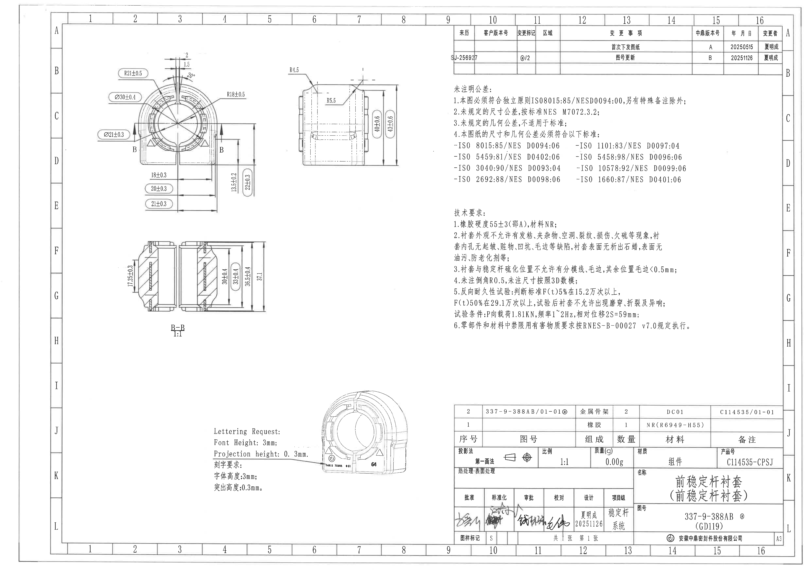
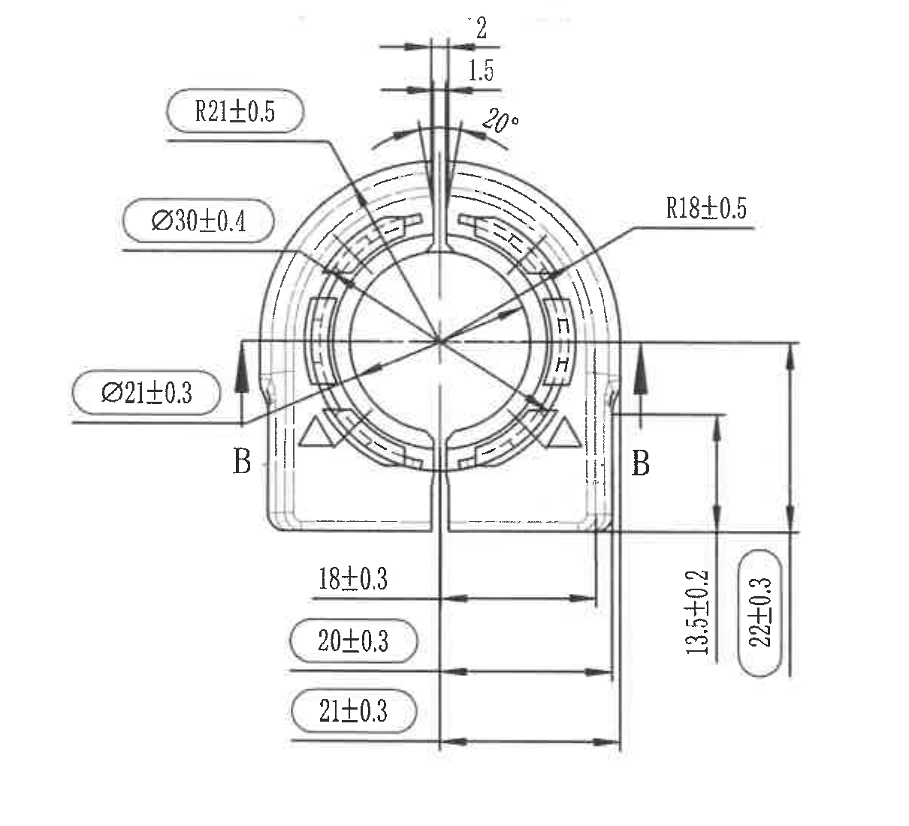
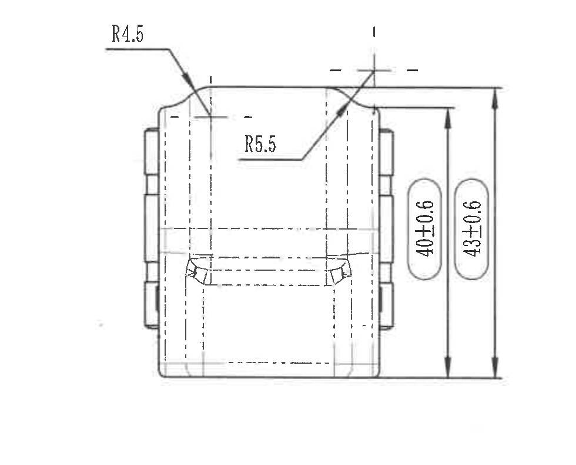
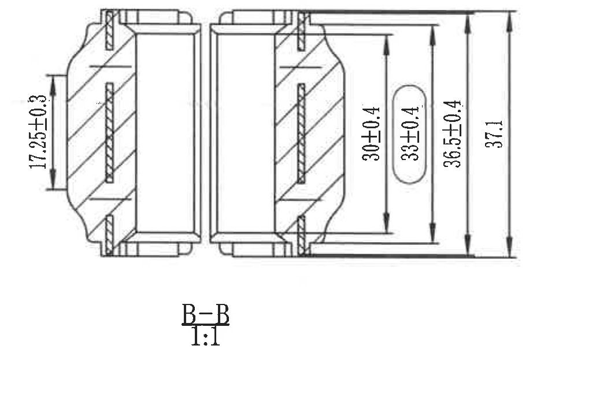
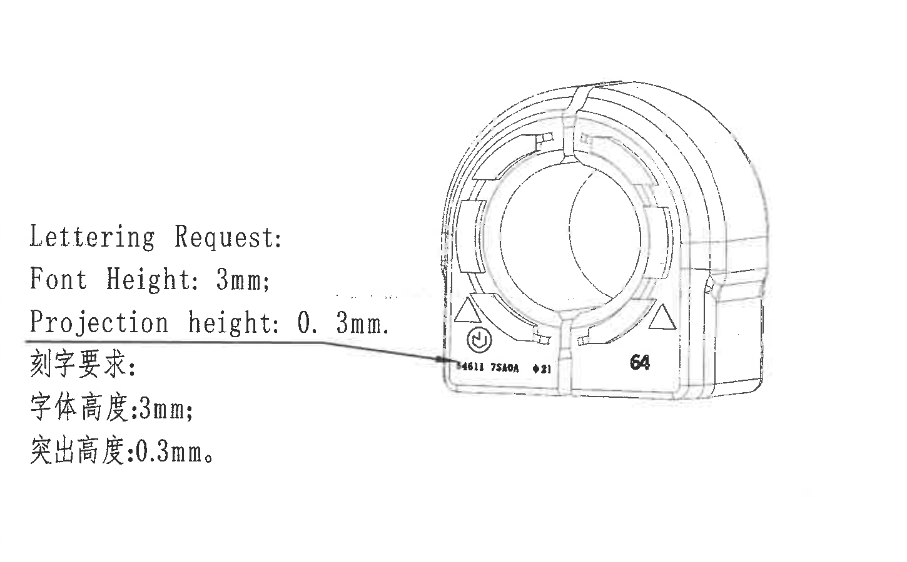
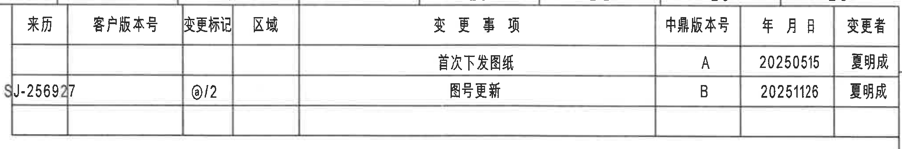
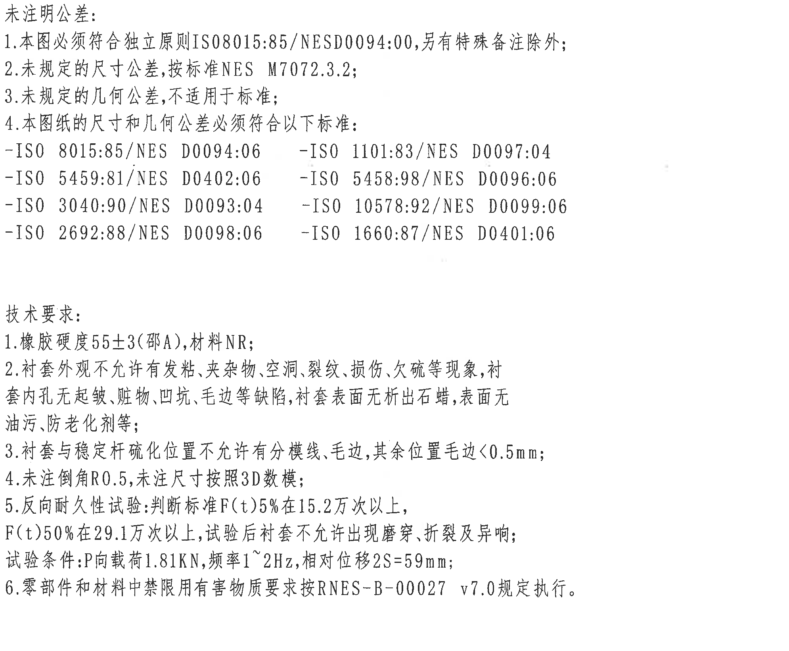
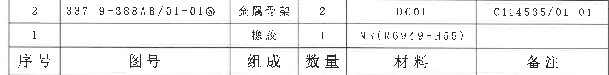
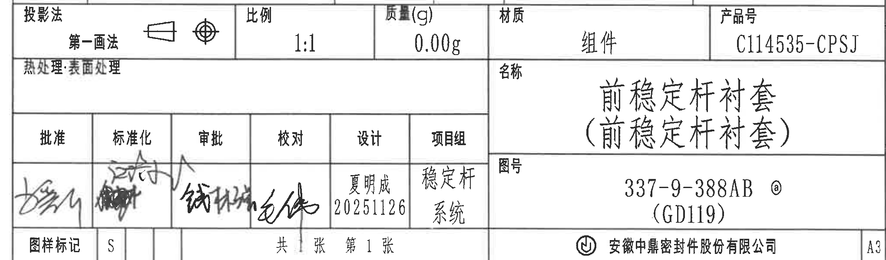

# 20C114535.pdf 内容识别与裁切

## 整页 PNG

| 提取项 | 原图数值或文本 | 含义说明 |
|---|---|---|
| 文件 | input/20C114535.pdf | 输入 PDF。 |
| 页数 | 1 | 单页工程图。 |
| 整页渲染图 | outputs/20C114535_assets/images/page_1.png | 先将 PDF 渲染为整页 PNG 后再裁切。 |
| 整页像素 | 4959 x 3505 | 300 dpi 渲染后的页面像素尺寸。 |
| 整页 bbox | [0, 0, 4959, 3505] | bbox 为整页 PNG 像素坐标。 |

边界归属说明：整页 PNG 仅作为页面基准图，具体尺寸、表格、NOTES、标题栏分别在下列裁切对象中提取。

## object_1 - 主视图 / B-B 剖切位置

原图位置/视图名称：第 1 页左上主视图，bbox [500, 300, 1710, 1400]。

| 提取项 | 原图数值或文本 | 含义说明 |
|---|---|---|
| 半径尺寸 | R21±0.5 | 主视图上方外圆弧/外轮廓半径标注，带 ±0.5 公差。 |
| 直径尺寸 | Ø30±0.4 | 主视图环形外侧圆/圆柱特征直径，带 ±0.4 公差。 |
| 直径尺寸 | Ø21±0.3 | 主视图内孔/内圆特征直径，带 ±0.3 公差。 |
| 半径尺寸 | R18±0.5 | 主视图右侧引出至内侧圆弧/内轮廓半径，带 ±0.5 公差。 |
| 顶部宽度 | 2 | 顶部开口/狭槽处外侧宽度标注。 |
| 顶部宽度 | 1.5 | 顶部开口/狭槽处内侧宽度标注。 |
| 角度 | 20° | 顶部开口两侧斜边/夹角标注。 |
| 剖切标识 | B、B | 主视图左右两侧剖切箭头与字母，指示 B-B 剖视位置。 |
| 水平尺寸 | 18±0.3 | 底部中心线至右侧特征的水平尺寸，带 ±0.3 公差。 |
| 水平尺寸 | 20±0.3 | 底部水平尺寸，标注在圆角框内，带 ±0.3 公差。 |
| 水平尺寸 | 21±0.3 | 底部较长水平尺寸，标注在圆角框内，带 ±0.3 公差。 |
| 垂直尺寸 | 13.5±0.2 | 右侧局部高度/台阶高度，竖排标注，带 ±0.2 公差。 |
| 垂直尺寸 | 22±0.3 | 右侧总高度/外侧高度，圆角框内竖排标注，带 ±0.3 公差。 |
| 参考尺寸/关键尺寸/T 编号 | 未见括号内参考尺寸、星号关键尺寸、T 编号 | 主视图内没有括号尺寸或星号尺寸；B 为剖切视图字母，不是基准 datum。 |

边界归属说明：此裁切完整包含主视图外轮廓、尺寸线、箭头、引出线和 B-B 剖切箭头。右侧的侧视图 R4.5、R5.5、40±0.6、43±0.6 不归入本对象；下方 B-B 剖面尺寸不归入本对象。

## object_2 - 右上侧视图

原图位置/视图名称：第 1 页左上区域右侧视图，bbox [1580, 370, 2560, 1160]。

| 提取项 | 原图数值或文本 | 含义说明 |
|---|---|---|
| 半径尺寸 | R4.5 | 侧视图左上圆角/外侧过渡圆弧半径。 |
| 半径尺寸 | R5.5 | 侧视图上部内侧圆角/凹槽过渡半径。 |
| 垂直尺寸 | 40±0.6 | 侧视图内侧高度尺寸，竖排圆角框标注，带 ±0.6 公差。 |
| 垂直尺寸 | 43±0.6 | 侧视图外侧总高度尺寸，竖排圆角框标注，带 ±0.6 公差。 |
| 隐藏线/中心线 | 虚线轮廓、中心线 | 表示内部结构和对称/中心位置，不是单独尺寸数值。 |
| 参考尺寸/关键尺寸/T 编号 | 未见括号内参考尺寸、星号关键尺寸、T 编号 | 本侧视图未出现括号参考尺寸、星号关键尺寸或 T 编号。 |

边界归属说明：此裁切经重裁后完整包含 R4.5 引出文字、R5.5 引出线以及 40±0.6、43±0.6 的完整尺寸线和箭头。左侧没有把主视图尺寸归入此对象；右侧只保留侧视图尺寸边界。

## object_3 - B-B 剖视图

原图位置/视图名称：第 1 页左中下 B-B 剖视图，bbox [730, 1460, 1780, 2180]。

| 提取项 | 原图数值或文本 | 含义说明 |
|---|---|---|
| 剖视标识 | B-B | 与主视图中的 B、B 剖切箭头对应。 |
| 比例 | 1:1 | B-B 剖视图比例。 |
| 垂直尺寸 | 17.25±0.3 | 剖视图左侧局部高度尺寸，带 ±0.3 公差。 |
| 垂直尺寸 | 30±0.4 | 剖视图右侧内侧高度尺寸，带 ±0.4 公差。 |
| 垂直尺寸 | 33±0.4 | 剖视图右侧中间高度尺寸，圆角框标注，带 ±0.4 公差。 |
| 垂直尺寸 | 36.5±0.4 | 剖视图右侧外侧高度尺寸，带 ±0.4 公差。 |
| 总高度 | 37.1 | 剖视图最外侧总高度标注，原图未给出显式公差。 |
| 剖面线 | 斜剖面线 | 表示剖切到的实体材料区域。 |
| 参考尺寸/关键尺寸/T 编号 | 未见括号内参考尺寸、星号关键尺寸、T 编号 | 本剖视图未出现括号参考尺寸、星号关键尺寸或 T 编号。 |

边界归属说明：此裁切只提取 B-B 剖视图及其尺寸，主视图中的 B 剖切箭头仅说明来源，不把主视图尺寸归入本剖面对象。

## object_4 - 局部外观视图与刻字要求

原图位置/视图名称：第 1 页下中局部外观视图及 Lettering Request，bbox [1260, 2260, 2710, 3160]。

| 提取项 | 原图数值或文本 | 含义说明 |
|---|---|---|
| 英文标题 | Lettering Request: | 刻字/标识要求的英文标题。 |
| 字体高度 | Font Height: 3mm; | 英文说明：刻字字体高度为 3 mm。 |
| 突出高度 | Projection height: 0.3mm. | 英文说明：刻字/标识突出高度为 0.3 mm。 |
| 中文标题 | 刻字要求: | 刻字/标识要求的中文标题。 |
| 中文字体高度 | 字体高度:3mm; | 中文说明：刻字字体高度为 3 mm。 |
| 中文突出高度 | 突出高度:0.3mm。 | 中文说明：刻字/标识突出高度为 0.3 mm。 |
| 局部标识 | 圆形方向/标识符号 | 局部外观图左下区域的圆形标记。 |
| 局部标识 | 4611 75A0A ♦21 | 按 600 dpi 放大图可辨识的局部刻字串；扫描件小字较糊，按图面可辨识内容记录。 |
| 局部标识 | 64 | 局部外观图右下区域的粗体数字标识。 |
| 局部外形 | 左右三角形标记、前部环形外观 | 展示标识位置和外观方向，不是尺寸数值。 |
| 参考尺寸/关键尺寸/T 编号 | 未见括号内参考尺寸、星号关键尺寸、T 编号 | 本局部视图没有括号参考尺寸、星号关键尺寸或 T 编号。 |

边界归属说明：此裁切经重裁后完整包含 Lettering Request 文本、中文刻字要求、引出线和局部外观视图上缘圆弧。只提取该局部外观图内的刻字/标识内容，不提取右下标题栏或左上剖视图信息。

## object_5 - 修订履历表

原图位置/视图名称：第 1 页右上修订履历表，bbox [2745, 145, 4785, 485]。

原表行列还原：

| 来历 | 客户版本号 | 变更标记 | 区域 | 变更事项 | 中鼎版本号 | 年月日 | 变更者 |
|---|---|---|---|---|---|---|---|
|  |  |  |  | 首次下发图纸 | A | 20250515 | 夏明成 |
| SJ-256927 |  | @/2 |  | 图号更新 | B | 20251126 | 夏明成 |

| 提取项 | 原图数值或文本 | 含义说明 |
|---|---|---|
| 表头 | 来历、客户版本号、变更标记、区域、变更事项、中鼎版本号、年月日、变更者 | 修订履历表列名。 |
| 修订记录 1 | 首次下发图纸 / A / 20250515 / 夏明成 | 首次下发记录；来历、客户版本号、变更标记、区域为空。 |
| 修订记录 2 | SJ-256927 / @/2 / 图号更新 / B / 20251126 / 夏明成 | 图号更新记录；客户版本号、区域为空。 |

边界归属说明：此裁切只包含右上修订履历表。右侧靠近图框的坐标字母不作为表格内容提取；NOTES 文本位于下方，未归入本表。

## object_6 - NOTES / 未注明公差 / 技术要求

原图位置/视图名称：第 1 页右侧 NOTES 与技术要求文本区，bbox [2760, 510, 4750, 2150]。

| 提取项 | 原图数值或文本 | 含义说明 |
|---|---|---|
| 标题 | 未注明公差: | 未注公差说明标题。 |
| 未注公差 1 | 1.本图必须符合独立原则ISO8015:85/NESD0094:00,另有特殊备注除外; | 图纸需符合独立原则标准，特殊备注除外。 |
| 未注公差 2 | 2.未规定的尺寸公差,按标准NES M7072.3.2; | 未规定尺寸公差按 NES M7072.3.2。 |
| 未注公差 3 | 3.未规定的几何公差,不适用于标准; | 未规定几何公差不适用于标准。 |
| 未注公差 4 | 4.本图纸的尺寸和几何公差必须符合以下标准: | 引出后续标准清单。 |
| 标准 | -ISO 8015:85/NES D0094:06 | 尺寸/几何公差相关标准。 |
| 标准 | -ISO 1101:83/NES D0097:04 | 尺寸/几何公差相关标准。 |
| 标准 | -ISO 5459:81/NES D0402:06 | 尺寸/几何公差相关标准。 |
| 标准 | -ISO 5458:98/NES D0096:06 | 尺寸/几何公差相关标准。 |
| 标准 | -ISO 3040:90/NES D0093:04 | 尺寸/几何公差相关标准。 |
| 标准 | -ISO 10578:92/NES D0099:06 | 尺寸/几何公差相关标准。 |
| 标准 | -ISO 2692:88/NES D0098:06 | 尺寸/几何公差相关标准。 |
| 标准 | -ISO 1660:87/NES D0401:06 | 尺寸/几何公差相关标准。 |
| 标题 | 技术要求: | 技术要求文本标题。 |
| 技术要求 1 | 1.橡胶硬度55±3(邵A),材料NR; | 橡胶硬度和材料要求。括号内“邵A”为硬度标尺说明。 |
| 技术要求 2 | 2.衬套外观不允许有发粘、夹杂物、空洞、裂纹、损伤、欠硫等现象,衬套内孔无起皱、脏物、凹坑、毛边等缺陷,衬套表面无析出石蜡,表面无油污、防老化剂等; | 外观、内孔和表面缺陷限制。 |
| 技术要求 3 | 3.衬套与稳定杆硫化位置不允许有分模线、毛边,其余位置毛边<0.5mm; | 硫化位置和毛边高度限制。 |
| 技术要求 4 | 4.未注倒角R0.5,未注尺寸按照3D数模; | 未注倒角半径为 R0.5，未注尺寸按 3D 数模。 |
| 技术要求 5 | 5.反向耐久性试验:判断标准F(t)5%在15.2万次以上,F(t)50%在29.1万次以上,试验后衬套不允许出现磨穿、折裂及异响;试验条件:P向载荷1.81KN,频率1~2Hz,相对位移2S=59mm; | 反向耐久性试验判定标准和试验条件。 |
| 技术要求 6 | 6.零部件和材料中禁限用有害物质要求按RNES-B-00027 v7.0规定执行。 | 有害物质禁限用要求。 |

边界归属说明：此裁切仅包含右侧 NOTES、未注明公差和技术要求，不包含右上修订履历表和右下标题栏。文本行未被边缘裁断。

## object_7 - 明细栏 / BOM 表

原图位置/视图名称：第 1 页右下明细栏/BOM 表，bbox [2745, 2480, 4785, 2732]。

原图自上而下行列还原：

| 原图行 | 第 1 列 | 第 2 列 | 第 3 列 | 第 4 列 | 第 5 列 | 第 6 列 |
|---|---|---|---|---|---|---|
| 数据行 | 2 | 337-9-388AB/01-01@ | 金属骨架 | 2 | DC01 | C114535/01-01 |
| 数据行 | 1 |  | 橡胶 | 1 | NR(R6949-H55) |  |
| 表头行 | 序号 | 图号 | 组成 | 数量 | 材料 | 备注 |

| 提取项 | 原图数值或文本 | 含义说明 |
|---|---|---|
| 表头 | 序号、图号、组成、数量、材料、备注 | 明细栏列名；原图表头位于该明细栏底行。 |
| 明细 2 | 序号 2；图号 337-9-388AB/01-01@；组成 金属骨架；数量 2；材料 DC01；备注 C114535/01-01 | 金属骨架部件明细。 |
| 明细 1 | 序号 1；图号空白；组成 橡胶；数量 1；材料 NR(R6949-H55)；备注空白 | 橡胶材料明细，括号内 R6949-H55 为 NR 材料牌号/硬度相关说明。 |

边界归属说明：此裁切只提取明细栏/BOM 表。下方投影法、比例、质量、名称、图号和签署栏属于 object_8 标题栏，不在此处提取。

## object_8 - 标题栏 / 签署栏

原图位置/视图名称：第 1 页右下标题栏与签署栏，bbox [2745, 2725, 4785, 3325]。

| 提取项 | 原图数值或文本 | 含义说明 |
|---|---|---|
| 投影法 | 第一画法 | 标题栏中投影法信息，旁有第一角法投影符号。 |
| 比例 | 1:1 | 图纸比例。 |
| 质量(g) | 0.00g | 标题栏质量字段。 |
| 材质 | 组件 | 标题栏材质字段。 |
| 产品号 | C114535-CPSJ | 产品号字段。 |
| 热处理/表面处理 | 热处理:表面处理 | 字段名存在，内容栏未见填写内容。 |
| 名称 | 前稳定杆衬套（前稳定杆衬套） | 零件/组件名称；括号内为原图名称重复说明。 |
| 图号 | 337-9-388AB @ (GD119) | 标题栏图号字段；含 @ 标记和括号内 GD119。 |
| 批准 | 签名 | 批准栏为手写签名，扫描件未提供可机读姓名。 |
| 标准化 | 签名/标记 | 标准化栏为手写签名/标记，扫描件未提供可机读姓名。 |
| 审批 | 签名 | 审批栏为手写签名，扫描件未提供可机读姓名。 |
| 校对 | 签名 | 校对栏为手写签名，扫描件未提供可机读姓名。 |
| 设计 | 夏明成 / 20251126 | 设计栏人员和日期。 |
| 项目组 | 稳定杆系统 | 项目组字段。 |
| 图样标记 | S | 图样标记字段。 |
| 张数 | 共 1 张 第 1 张 | 图纸页数信息。 |
| 公司 | 安徽中鼎密封件股份有限公司 | 标题栏底部公司名称。 |
| 图幅 | A3 | 标题栏右下图幅。 |

边界归属说明：此裁切只提取标题栏和签署栏字段；顶部明细栏的序号/图号/组成/数量/材料/备注由 object_7 提取。右下 A3 位于标题栏内，保留并提取。

## 裁切检查记录

| 对象 | 检查结果 | 边界处理记录 |
|---|---|---|
| page_1 | 完整 | 整页 PNG 为 4959 x 3505，包含完整图框。 |
| object_1 | 完整 | 主视图尺寸线、箭头、文字、B/B 剖切标识均完整；未混入侧视图和 B-B 剖视图尺寸。 |
| object_2 | 完整 | 初裁时 R4.5 左侧文字被切到，已向左扩边重裁；最终 R4.5、R5.5、40±0.6、43±0.6 均完整。 |
| object_3 | 完整 | B-B 剖视图、剖面线、17.25±0.3、30±0.4、33±0.4、36.5±0.4、37.1 和 B-B/1:1 标识完整。 |
| object_4 | 完整 | 初裁时局部外观上缘圆弧被切到，已上移扩边重裁；Lettering Request、中文刻字要求、引出线和局部标识完整。 |
| object_5 | 完整 | 修订履历表左侧 SJ-256927 经扩边后完整；右侧图框坐标字母不作为表格内容提取。 |
| object_6 | 完整 | 未注明公差和技术要求文本行完整，无边缘截断。 |
| object_7 | 完整 | 明细栏表格完整；为避免与标题栏混淆，只提取序号/图号/组成/数量/材料/备注。 |
| object_8 | 完整 | 标题栏和签署栏字段完整；与明细栏共享边框处按字段归属区分，不重复提取明细栏数据。 |
