# 20C114536 PDF 内容识别与裁切还原

整页渲染图：`outputs/20C114536_assets/images/page_1.png`  
页面尺寸：4959 × 3505 px，bbox `[0, 0, 4959, 3505]`。

## 对象 object_1：表1 橡胶材料试验

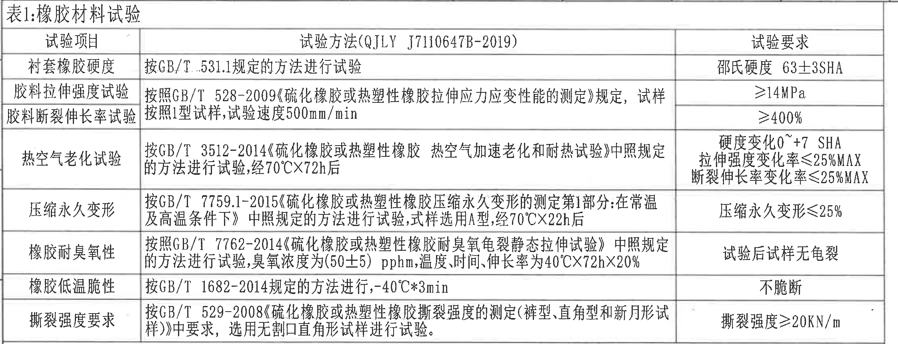

**原图位置/视图名称**：左上区域；bbox [370, 150, 2615, 1010]。

原表还原：

| 试验项目 | 试验方法(QJLY J7110647B-2019) | 试验要求 |
|---|---|---|
| 衬套橡胶硬度 | 按GB/T 531.1规定的方法进行试验 | 邵氏硬度 63±3SHA |
| 胶料拉伸强度试验 | 按照GB/T 528-2009《硫化橡胶或热塑性橡胶拉伸应力应变性能的测定》规定，试样按照1型试样，试验速度500mm/min | ≥14MPa |
| 胶料断裂伸长率试验 | 按照GB/T 528-2009《硫化橡胶或热塑性橡胶拉伸应力应变性能的测定》规定，试样按照1型试样，试验速度500mm/min | ≥400% |
| 热空气老化试验 | 按GB/T 3512-2014《硫化橡胶或热塑性橡胶 热空气加速老化和耐热试验》中照规定的方法进行试验，经70℃×72h后 | 硬度变化0~+7 SHA；拉伸强度变化率≤25%MAX；断裂伸长率变化率≤25%MAX |
| 压缩永久变形 | 按GB/T 7759.1-2015《硫化橡胶或热塑性橡胶压缩永久变形的测定第1部分:在常温及高温条件下》中照规定的方法进行试验，试样选用A型，经70℃×22h后 | 压缩永久变形≤25% |
| 橡胶耐臭氧性 | 按照GB/T 7762-2014《硫化橡胶或热塑性橡胶耐臭氧龟裂静态拉伸试验》中照规定的方法进行试验，臭氧浓度为(50±5)pphm，温度、时间、伸长率为40℃×72h×20% | 试验后试样无龟裂 |
| 橡胶低温脆性 | 按GB/T 1682-2014规定的方法进行，-40℃*3min | 不脆断 |
| 撕裂强度要求 | 按GB/T 529-2008《硫化橡胶或热塑性橡胶撕裂强度的测定(裤型、直角型和新月形试样)》中要求，选用无割口直角形试样进行试验。 | 撕裂强度≥20KN/m |

| 提取项 | 原图数值或文本 | 含义说明 |
|---|---|---|
| 表名 | 表1:橡胶材料试验 | 橡胶材料类试验汇总表。 |
| 试验方法总标识 | QJLY J7110647B-2019 | 表1试验方法栏引用的企业标准。 |
| 衬套橡胶硬度 | 邵氏硬度 63±3SHA | 橡胶硬度合格要求。 |
| 胶料拉伸强度试验 | ≥14MPa | 拉伸强度下限。 |
| 胶料断裂伸长率试验 | ≥400% | 断裂伸长率下限。 |
| 热空气老化试验 | 硬度变化0~+7 SHA；拉伸强度变化率≤25%MAX；断裂伸长率变化率≤25%MAX | 70℃×72h后老化性能要求。 |
| 压缩永久变形 | 压缩永久变形≤25% | 70℃×22h后压缩永久变形要求。 |
| 橡胶耐臭氧性 | 试验后试样无龟裂 | 臭氧浓度(50±5)pphm，40℃×72h×20%条件下外观要求。 |
| 橡胶低温脆性 | 不脆断 | -40℃*3min后不得脆断。 |
| 撕裂强度要求 | 撕裂强度≥20KN/m | 无割口直角形试样撕裂强度要求。 |

**边界归属说明**：裁切停在表1下边框，未包含下方表2标题；表内三列和所有行完整。

## 对象 object_2：表2 产品性能试验

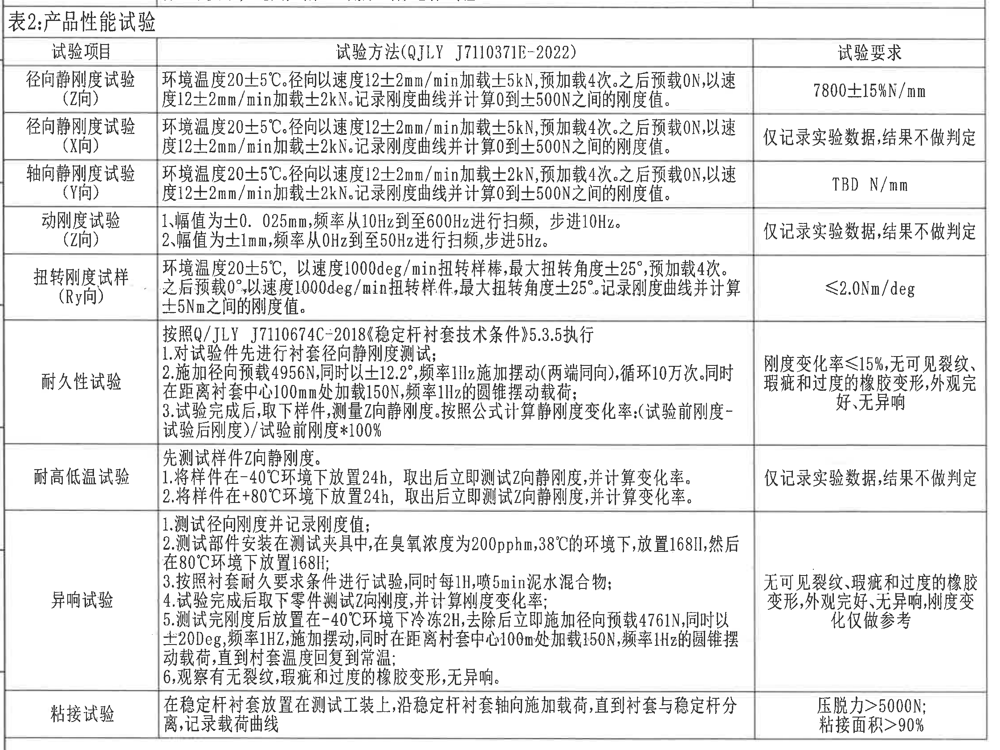

**原图位置/视图名称**：左中至左下区域；bbox [370, 990, 2615, 2675]。

原表还原：

| 试验项目 | 试验方法(QJLY J7110371E-2022) | 试验要求 |
|---|---|---|
| 径向静刚度试验(Z向) | 环境温度20±5℃。径向以速度12±2mm/min加载±5kN，预加载4次。之后预载0N，以速度12±2mm/min加载±2kN。记录刚度曲线并计算0到±500N之间的刚度值。 | 7800±15%N/mm |
| 径向静刚度试验(X向) | 环境温度20±5℃。径向以速度12±2mm/min加载±5kN，预加载4次。之后预载0N，以速度12±2mm/min加载±2kN。记录刚度曲线并计算0到±500N之间的刚度值。 | 仅记录实验数据，结果不做判定 |
| 轴向静刚度试验(Y向) | 环境温度20±5℃。径向以速度12±2mm/min加载±2kN，预加载4次。之后预载0N，以速度12±2mm/min加载±2kN。记录刚度曲线并计算0到±500N之间的刚度值。 | TBD N/mm |
| 动刚度试验(Z向) | 1、幅值为±0.025mm，频率从10Hz到至600Hz进行扫频，步进10Hz。2、幅值为±1mm，频率从0Hz到至50Hz进行扫频，步进5Hz。 | 仅记录实验数据，结果不做判定 |
| 扭转刚度试样(Ry向) | 环境温度20±5℃，以速度1000deg/min扭转样棒，最大扭转角度±25°，预加载4次。之后预载0°，以速度1000deg/min扭转样件，最大扭转角度±25°。记录刚度曲线并计算±5Nm之间的刚度值。 | ≤2.0Nm/deg |
| 耐久性试验 | 按照Q/JLY J7110674C-2018《稳定杆衬套技术条件》5.3.5执行。1.对试验件先进行衬套径向静刚度测试；2.施加径向预载4956N，同时以±12.2°，频率1Hz施加摆动(两端同向)，循环10万次。同时在距离衬套中心100mm处加载150N，频率1Hz的圆锥摆动载荷；3.试验完成后，取下样件，测量Z向静刚度。按照公式计算静刚度变化率:(试验前刚度-试验后刚度)/试验前刚度*100% | 刚度变化率≤15%，无可见裂纹、瑕疵和过度的橡胶变形，外观完好、无异响 |
| 耐高低温试验 | 先测试样件Z向静刚度。1.将样件在-40℃环境下放置24h，取出后立即测试Z向静刚度，并计算变化率。2.将样件在+80℃环境下放置24h，取出后立即测试Z向静刚度，并计算变化率。 | 仅记录实验数据，结果不做判定 |
| 异响试验 | 1.测试径向刚度并记录刚度值；2.测试部件安装在测试夹具中，在臭氧浓度为200pphm，38℃的环境下，放置168H，然后在80℃环境下放置168H；3.按照衬套耐久要求条件进行试验，同时每1H，喷5min泥水混合物；4.试验完成后取下零件测试Z向刚度，并计算刚度变化率；5.测试完刚度后放置在-40℃环境下冷冻2H，去除后立即施加径向预载4761N，同时以±20Deg，频率1Hz，施加摆动，同时在距离衬套中心100mm处加载150N，频率1Hz的圆锥摆动载荷，直到衬套温度回复到常温；6.观察有无裂纹、瑕疵和过度的橡胶变形，无异响。 | 无可见裂纹、瑕疵和过度的橡胶变形，外观完好、无异响，刚度变化仅做参考 |
| 粘接试验 | 在稳定杆衬套放置在测试工装上，沿稳定杆衬套轴向施加载荷，直到衬套与稳定杆分离，记录载荷曲线 | 压脱力>5000N；粘接面积>90% |

| 提取项 | 原图数值或文本 | 含义说明 |
|---|---|---|
| 表名 | 表2:产品性能试验 | 产品性能试验汇总表。 |
| Z向径向静刚度 | 7800±15%N/mm | Z向判定刚度要求。 |
| X向径向静刚度 | 仅记录实验数据，结果不做判定 | X向结果记录但不判定。 |
| Y向轴向静刚度 | TBD N/mm | Y向要求待定。 |
| Z向动刚度 | 仅记录实验数据，结果不做判定 | 两段扫频条件下只记录。 |
| Ry向扭转刚度 | ≤2.0Nm/deg | 扭转刚度上限。 |
| 耐久性试验 | 刚度变化率≤15%，无可见裂纹、瑕疵和过度的橡胶变形，外观完好、无异响 | 耐久后性能和外观要求。 |
| 耐高低温试验 | 仅记录实验数据，结果不做判定 | -40℃与+80℃暴露后只记录。 |
| 异响试验 | 无可见裂纹、瑕疵和过度的橡胶变形，外观完好、无异响，刚度变化仅做参考 | 异响试验后外观/异响要求。 |
| 粘接试验 | 压脱力>5000N；粘接面积>90% | 粘接强度和面积要求。 |

**边界归属说明**：裁切从表2标题行开始，包含粘接试验底边；未包含下方表3和右侧视图。

## 对象 object_3：修订履历表

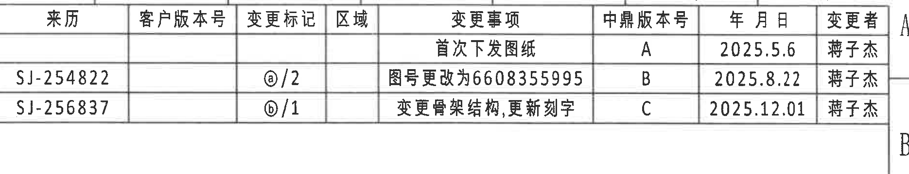

**原图位置/视图名称**：右上区域；bbox [2945, 145, 4815, 505]。

原表还原：

| 来历 | 客户版本号 | 变更标记 | 区域 | 变更事项 | 中鼎版本号 | 年月日 | 变更者 |
|---|---|---|---|---|---|---|---|
|  |  |  |  | 首次下发图纸 | A | 2025.5.6 | 蒋子杰 |
| SJ-254822 |  | @/2 |  | 图号更改为6608355995 | B | 2025.8.22 | 蒋子杰 |
| SJ-256837 |  | b/1 |  | 变更骨架结构,更新刻字 | C | 2025.12.01 | 蒋子杰 |

| 提取项 | 原图数值或文本 | 含义说明 |
|---|---|---|
| 首次下发图纸 | 版本A，2025.5.6，蒋子杰 | 初始发行记录。 |
| 图号更改 | SJ-254822，@/2，版本B，2025.8.22，蒋子杰 | 将图号更改为6608355995。 |
| 骨架结构与刻字变更 | SJ-256837，b/1，版本C，2025.12.01，蒋子杰 | 变更骨架结构并更新刻字。 |

**边界归属说明**：右侧可见图框坐标边界，不属于表格列；REV/DESCRIPTION等要求对应为中鼎版本号/变更事项等中文列，所有列已完整裁入。

## 对象 object_4：主加工视图/端面视图

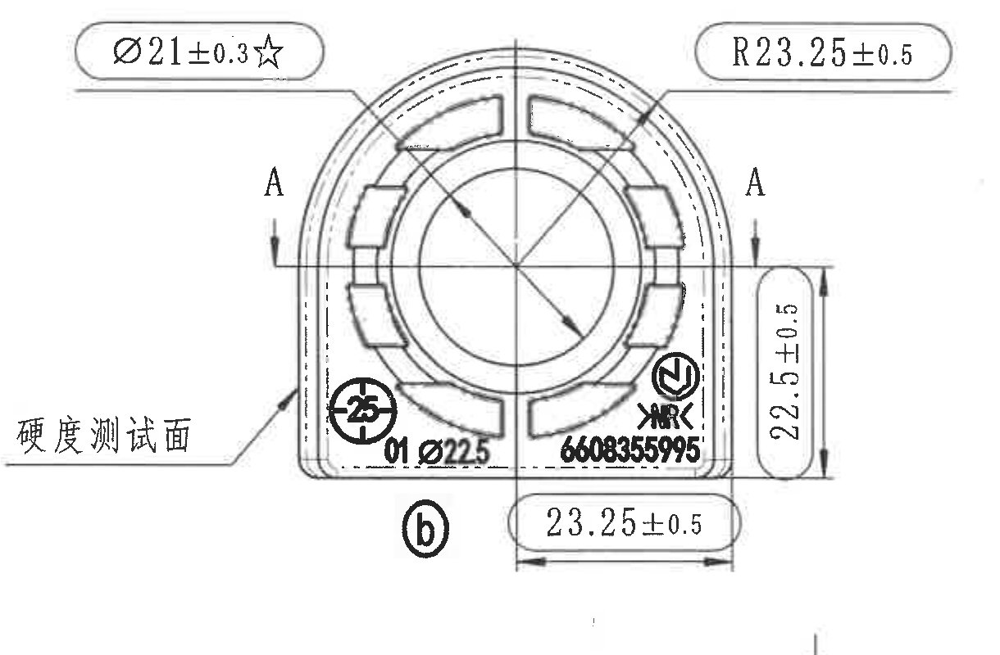

**原图位置/视图名称**：右上中部；bbox [3005, 535, 4225, 1335]。

| 提取项 | 原图数值或文本 | 含义说明 |
|---|---|---|
| 关键直径尺寸 | Ø21±0.3☆ | 端面内孔/相关圆特征尺寸；星号表示关键特性。 |
| 弧度/半径尺寸 | R23.25±0.5 | 端面外侧圆弧半径尺寸。 |
| 竖向尺寸 | 22.5±0.5 | 右侧竖向高度/边界尺寸，箭头和尺寸线属于主视图。 |
| 横向尺寸 | 23.25±0.5 | 底部横向宽度尺寸，箭头和尺寸线属于主视图。 |
| 剖面基准 | A-A | 剖切位置和箭头标出下方A-A剖面。 |
| 功能注释 | 硬度测试面 | 引出线指向主视图左下表面。 |
| 标识 | b | 底部变更/局部标识。 |
| 刻字/图号 | 6608355995 | 主视图下部刻字区域。 |
| 局部标识/尺寸 | 01 Ø22.5 | 主视图下部左侧标识，带直径符号。 |

**边界归属说明**：裁切包含完整引出线、箭头、尺寸线和文字；不把下方A-A剖面中的40±0.5、(31)归入主视图。

## 对象 object_5：A-A 剖面视图

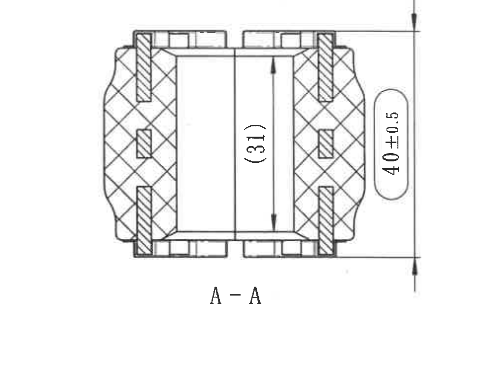

**原图位置/视图名称**：主视图下方；bbox [3160, 1315, 4160, 2075]。

| 提取项 | 原图数值或文本 | 含义说明 |
|---|---|---|
| 剖面名称 | A-A | 由主视图A-A剖切线生成的剖面。 |
| 总高度尺寸 | 40±0.5 | 右侧竖向总高度尺寸，带上下箭头和尺寸线。 |
| 参考尺寸 | (31) | 括号内参考尺寸，表示剖面内部高度/开口相关参考值；参考尺寸仍需记录但通常不作为制造验收主控尺寸。 |

**边界归属说明**：裁切包含剖面填充、上下轮廓、右侧总高尺寸和内部参考尺寸；不包含主视图端面尺寸。

## 对象 object_6：轴测/方向局部视图

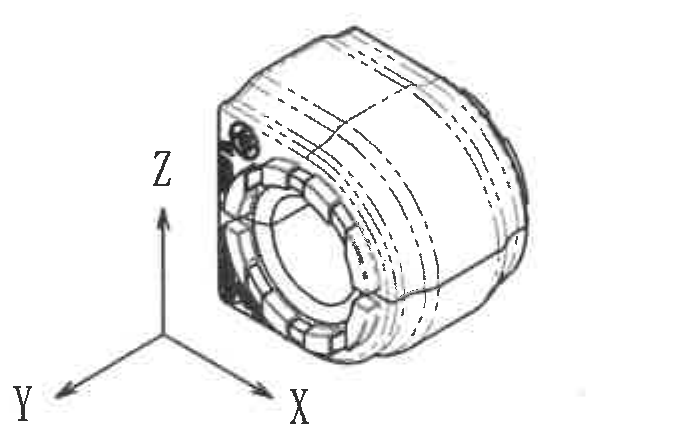

**原图位置/视图名称**：右中偏下；bbox [4020, 1845, 4720, 2275]。

| 提取项 | 原图数值或文本 | 含义说明 |
|---|---|---|
| 方向坐标 | X | 轴测图方向指示。 |
| 方向坐标 | Y | 轴测图方向指示。 |
| 方向坐标 | Z | 轴测图方向指示。 |
| 外观表达 | 虚线/轮廓线 | 显示零件三维外形和隐藏/背面轮廓；未给数值尺寸。 |

**边界归属说明**：裁切收紧到轴测图和X/Y/Z坐标，无技术要求文本和标题栏内容；该对象无数值尺寸。

## 对象 object_7：技术要求（1-5）

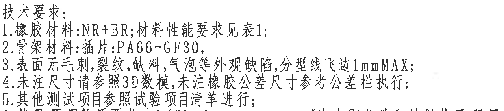

**原图位置/视图名称**：右下中部技术要求上半；bbox [2790, 2030, 4030, 2305]。

| 提取项 | 原图数值或文本 | 含义说明 |
|---|---|---|
| 1 | 橡胶材料:NR+BR;材料性能要求见表1; | 说明橡胶配方体系和性能引用表1。 |
| 2 | 骨架材料:插件:PA66-GF30, | 说明骨架插件材料。 |
| 3 | 表面无毛刺,裂纹,缺料,气泡等外观缺陷,分型线飞边1mmMAX; | 外观缺陷限制和飞边最大1mm。 |
| 4 | 未注尺寸请参照3D数模,未注橡胶公差尺寸参考公差栏执行; | 未注尺寸和未注橡胶公差的归属依据。 |
| 5 | 其他测试项目参照试验项目清单进行; | 其他试验按清单执行。 |

**边界归属说明**：该裁切只提取第1-5条；下边缘可见第6条极少笔画但第6条正文归入object_12。

## 对象 object_8：明细表/BOM

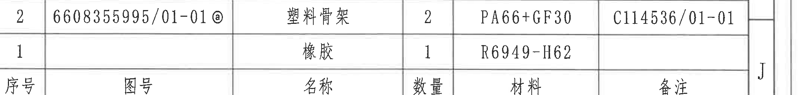

**原图位置/视图名称**：右下标题栏上方；bbox [2785, 2455, 4925, 2710]。

原表还原：

| 序号 | 图号 | 名称 | 数量 | 材料 | 备注 |
|---|---|---|---|---|---|
| 2 | 6608355995/01-01@ | 塑料骨架 | 2 | PA66+GF30 | C114536/01-01 |
| 1 |  | 橡胶 | 1 | R6949-H62 |  |

| 提取项 | 原图数值或文本 | 含义说明 |
|---|---|---|
| 物料2 | 6608355995/01-01@；塑料骨架；数量2；PA66+GF30；备注C114536/01-01 | 塑料骨架零件及材料。 |
| 物料1 | 橡胶；数量1；R6949-H62 | 橡胶件材料。 |

**边界归属说明**：裁切只含BOM表头和两条物料行；下方标题栏投影法/比例行不归入BOM。

## 对象 object_9：未注尺寸公差表

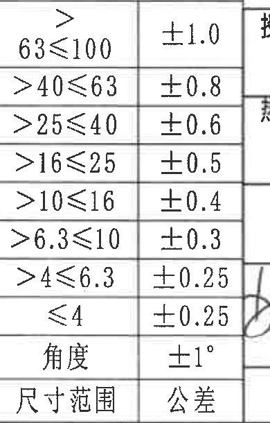

**原图位置/视图名称**：下方中间偏左；bbox [2420, 2720, 2810, 3330]。

原表还原：

| 尺寸范围 | 公差 |
|---|---|
| >63≤100 | ±1.0 |
| >40≤63 | ±0.8 |
| >25≤40 | ±0.6 |
| >16≤25 | ±0.5 |
| >10≤16 | ±0.4 |
| >6.3≤10 | ±0.3 |
| >4≤6.3 | ±0.25 |
| ≤4 | ±0.25 |
| 角度 | ±1° |

| 提取项 | 原图数值或文本 | 含义说明 |
|---|---|---|
| 线性尺寸公差 | >63≤100 ±1.0；>40≤63 ±0.8；>25≤40 ±0.6；>16≤25 ±0.5；>10≤16 ±0.4；>6.3≤10 ±0.3；>4≤6.3 ±0.25；≤4 ±0.25 | 未注线性尺寸的公差按尺寸范围取值。 |
| 角度公差 | ±1° | 未注角度公差。 |

**边界归属说明**：右侧紧邻标题栏边线，但公差表尺寸范围和公差列完整；不提取右侧标题栏字段。

## 对象 object_10：表3 产品信息

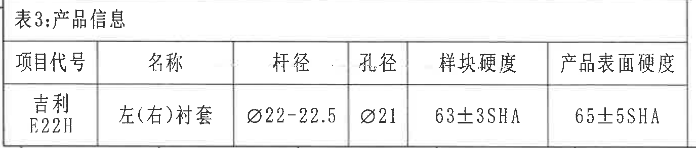

**原图位置/视图名称**：左下区域；bbox [375, 3035, 1750, 3330]。

原表还原：

| 项目代号 | 名称 | 杆径 | 孔径 | 样块硬度 | 产品表面硬度 |
|---|---|---|---|---|---|
| 吉利E22H | 左(右)衬套 | Ø22-22.5 | Ø21 | 63±3SHA | 65±5SHA |

| 提取项 | 原图数值或文本 | 含义说明 |
|---|---|---|
| 项目代号 | 吉利E22H | 产品项目代号。 |
| 名称 | 左(右)衬套 | 产品名称。 |
| 杆径 | Ø22-22.5 | 带直径符号的杆径范围。 |
| 孔径 | Ø21 | 孔径尺寸。 |
| 样块硬度 | 63±3SHA | 样块硬度要求。 |
| 产品表面硬度 | 65±5SHA | 产品表面硬度要求。 |

**边界归属说明**：裁切到表3外框；底部坐标数字属于图框坐标，不作为表3内容。

## 对象 object_11：标题栏

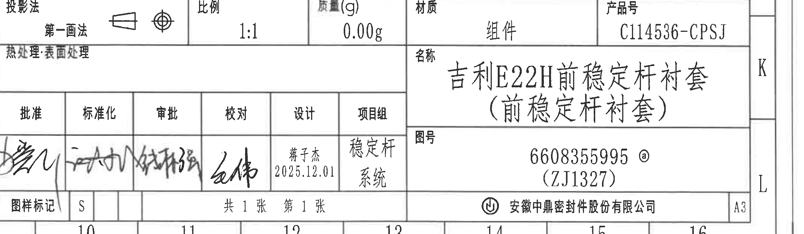

**原图位置/视图名称**：右下标题栏；bbox [2780, 2740, 4925, 3365]。

原表字段还原：

| 字段 | 内容 |
|---|---|
| 投影法 | 第一画法 |
| 比例 | 1:1 |
| 质量(g) | 0.00g |
| 材质 | 组件 |
| 产品号 | C114536-CPSJ |
| 热处理 | 表面处理 |
| 名称 | 吉利E22H前稳定杆衬套(前稳定杆衬套) |
| 图号 | 6608355995 @ (ZJ1327) |
| 批准 | 签名 |
| 标准化 | 签名 |
| 审批 | 签名 |
| 校对 | 签名 |
| 设计 | 蒋子杰 2025.12.01 |
| 项目组 | 稳定杆系统 |
| 图样标记 | S |
| 张数 | 共1张 第1张 |
| 公司 | 安徽中鼎密封件股份有限公司 |
| 图幅 | A3 |

| 提取项 | 原图数值或文本 | 含义说明 |
|---|---|---|
| 投影法 | 第一画法 | 图纸投影方法。 |
| 比例 | 1:1 | 图纸比例。 |
| 质量(g) | 0.00g | 标题栏质量。 |
| 材质 | 组件 | 标题栏材质/对象类型。 |
| 产品号 | C114536-CPSJ | 产品号。 |
| 热处理/表面处理 | 热处理:表面处理 | 表面处理栏文本。 |
| 名称 | 吉利E22H前稳定杆衬套(前稳定杆衬套) | 图纸名称。 |
| 图号 | 6608355995 @ (ZJ1327) | 图纸编号。 |
| 设计 | 蒋子杰 2025.12.01 | 设计人和日期。 |
| 项目组 | 稳定杆系统 | 项目组名称。 |
| 图样标记 | S | 图样标记。 |
| 页数 | 共1张 第1张 | 图纸页数。 |
| 公司 | 安徽中鼎密封件股份有限公司 | 出图单位。 |
| 图幅 | A3 | 图幅。 |

**边界归属说明**：裁切从投影法/比例/质量/材质/产品号行开始；上方明细表已归入object_8，不作为标题栏内容。

## 对象 object_12：技术要求（6-8）

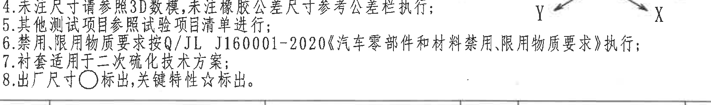

**原图位置/视图名称**：右下中部技术要求下半；bbox [2790, 2218, 4440, 2463]。

| 提取项 | 原图数值或文本 | 含义说明 |
|---|---|---|
| 6 | 禁用、限用物质要求按Q/JL J160001-2020《汽车零部件和材料禁用、限用物质要求》执行; | 禁限用物质合规要求。 |
| 7 | 衬套适用于二次硫化技术方案; | 工艺适用方案。 |
| 8 | 出厂尺寸○标出,关键特性☆标出。 | 圆圈标识出厂尺寸，星号标识关键特性。 |

**边界归属说明**：裁切提取第6-8条；顶部第4-5条残留仅作为连续文本边界参照，右上角极少轴测坐标边缘不归入NOTES文本。

## 裁切检查记录

| 对象 | 图片路径 | 完整性检查 | 归属检查 |
|---|---|---|---|
| object_1 | outputs/20C114536_assets/images/object_1.png | 完整包含表1标题、表头、8行内容和右侧要求文字。 | 未带入表2标题。 |
| object_2 | outputs/20C114536_assets/images/object_2.png | 完整包含表2标题、表头、9行内容和底部粘接试验行。 | 未带入右侧视图和下方表3。 |
| object_3 | outputs/20C114536_assets/images/object_3.png | 完整包含修订表所有列和3条记录。 | 右侧图框坐标字母不作为表格内容。 |
| object_4 | outputs/20C114536_assets/images/object_4.png | 完整包含Ø21±0.3☆、R23.25±0.5、22.5±0.5、23.25±0.5的文字、尺寸线、箭头和引出线。 | A-A剖面尺寸不归入主视图。 |
| object_5 | outputs/20C114536_assets/images/object_5.png | 完整包含A-A剖面、剖面填充、40±0.5和(31)。 | 不含主视图端面尺寸。 |
| object_6 | outputs/20C114536_assets/images/object_6.png | 完整包含轴测外形和X/Y/Z方向坐标。 | 无技术要求文本和图框字母残留。 |
| object_7 | outputs/20C114536_assets/images/object_7.png | 完整包含技术要求1-5条；第5条未裁断。 | 第6条正文不在本对象提取，归入object_12。 |
| object_8 | outputs/20C114536_assets/images/object_8.png | 完整包含BOM表头和两条物料记录。 | 下方标题栏不归入BOM。 |
| object_9 | outputs/20C114536_assets/images/object_9.png | 完整包含尺寸范围、公差列和角度行。 | 右侧标题栏边线不作为公差表内容。 |
| object_10 | outputs/20C114536_assets/images/object_10.png | 完整包含表3标题、表头和产品信息行。 | 底部图框坐标数字不作为表3内容。 |
| object_11 | outputs/20C114536_assets/images/object_11.png | 完整包含标题栏主要字段、签名栏、图号、公司和图幅。 | 上方明细表内容归入object_8。 |
| object_12 | outputs/20C114536_assets/images/object_12.png | 完整包含技术要求6-8条。 | 顶部重叠残留只作连续文本参照；右上角轴测坐标边缘不作为NOTES内容。 |
