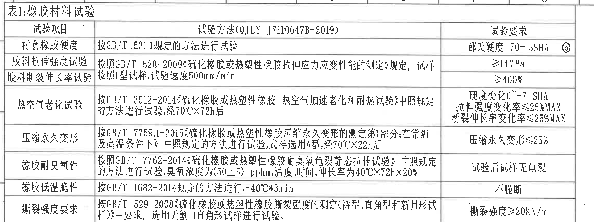
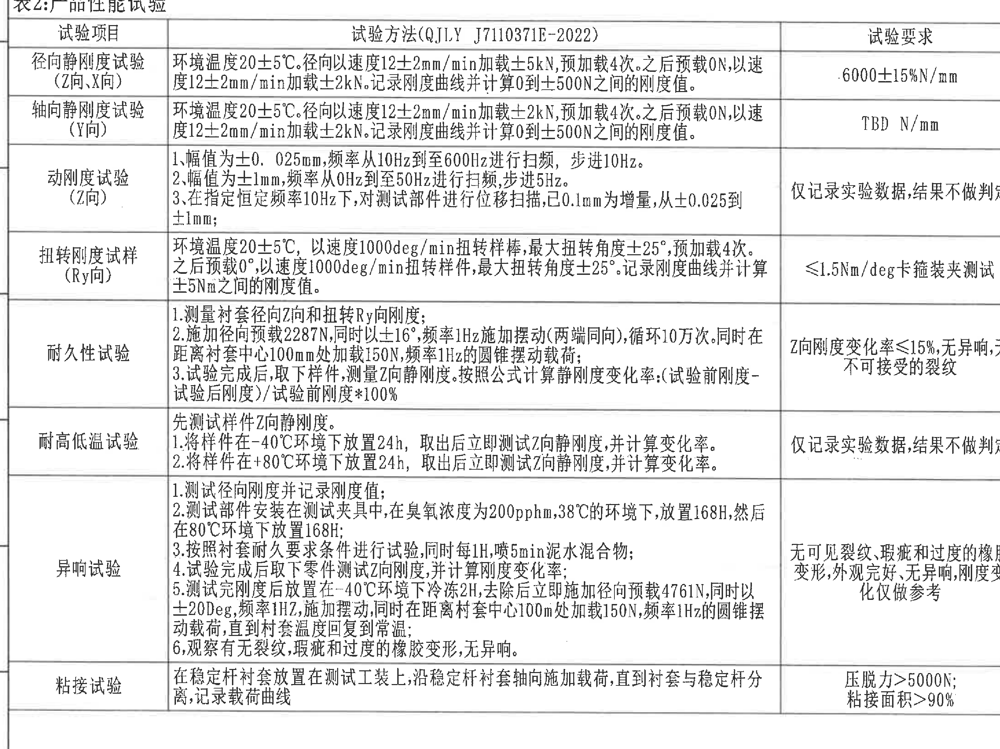
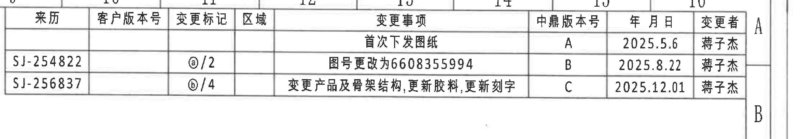
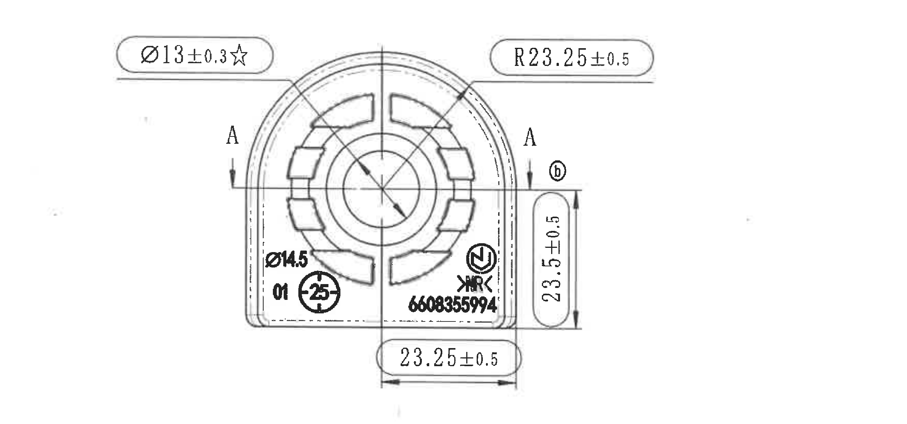
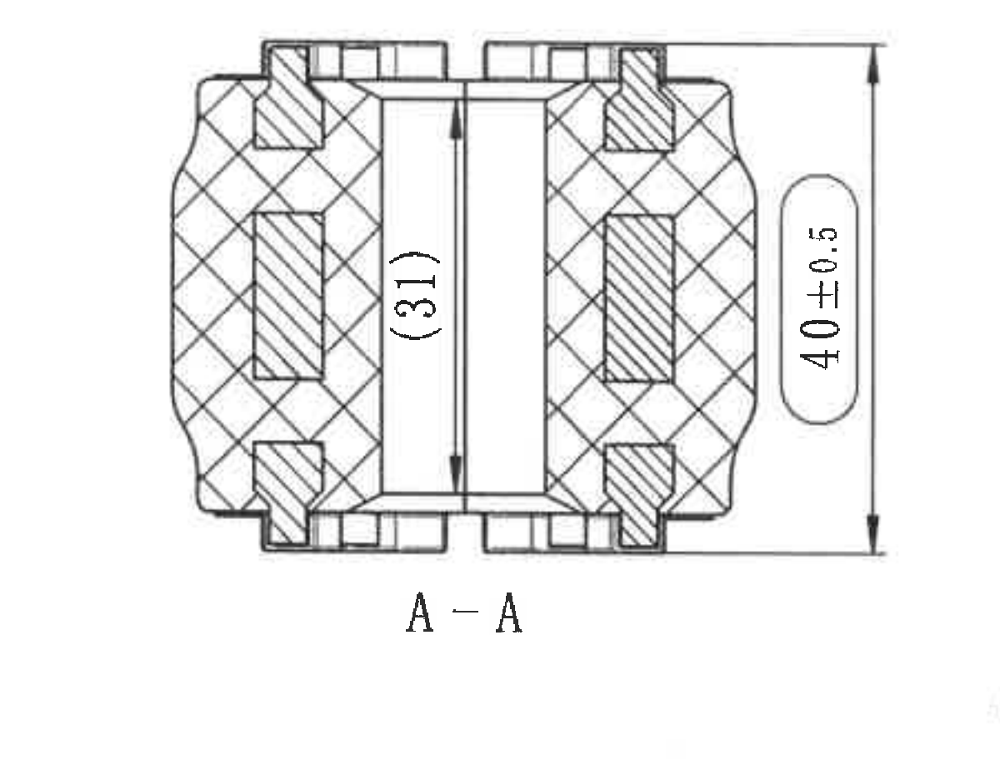
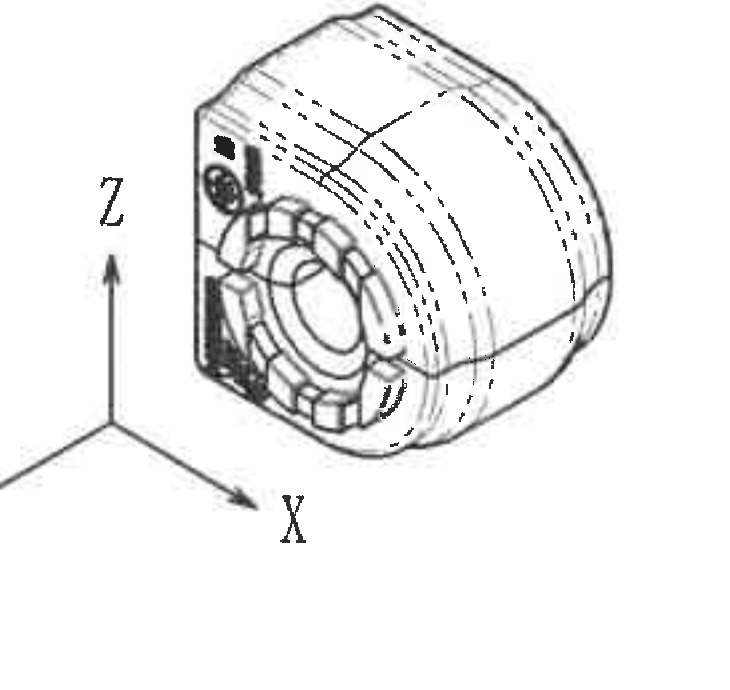
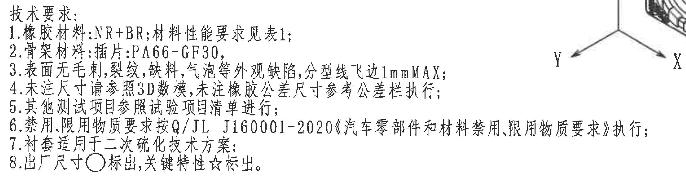
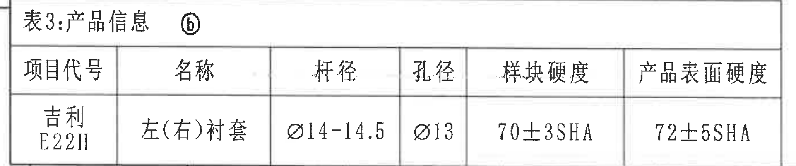
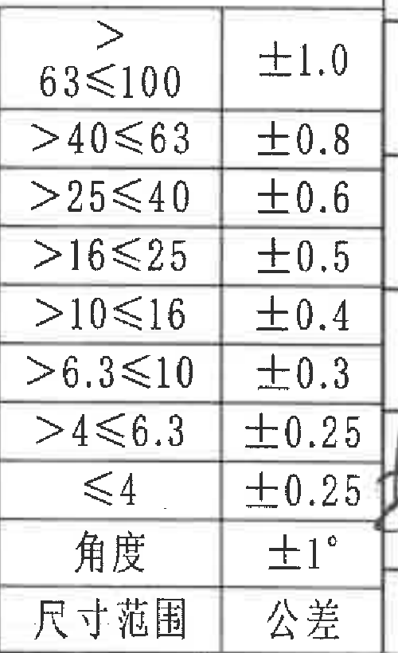
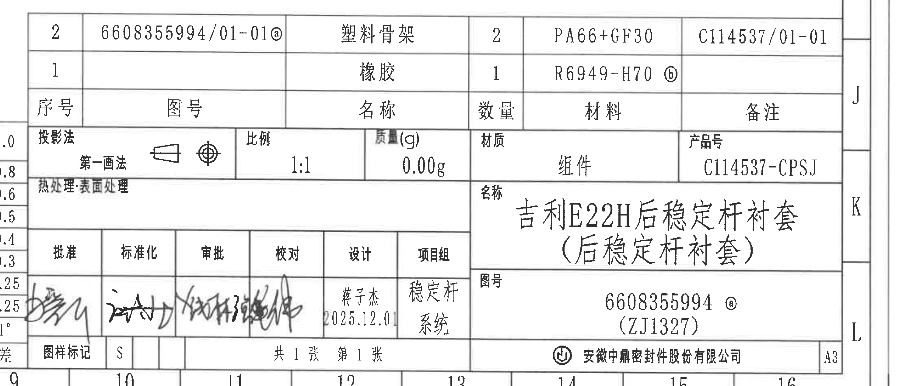

# 20C114537 内容识别

源文件：`input/20C114537.pdf`

整页渲染图：`outputs/20C114537_assets/images/page_1.png`

页面信息：第 1 页，整页 PNG 尺寸 6612 x 4673 px，原 PDF 为 A3 扫描图。

## object_1 - 表1：橡胶材料试验

原图位置/视图名称：第 1 页左上区域，表 1：橡胶材料试验。

| 试验项目 | 试验方法(QJLY J7110647B-2019) | 试验要求 |
|---|---|---|
| 衬套橡胶硬度 | 按 GB/T 531.1 规定的方法进行试验 | 邵氏硬度 70±3SHA，标记 b |
| 胶料拉伸强度试验 | 按照 GB/T 528-2009《硫化橡胶或热塑性橡胶拉伸应力应变性能的测定》规定，试样按照 1 型试样，试验速度 500mm/min | ≥14MPa |
| 胶料断裂伸长率试验 | 按照 GB/T 528-2009《硫化橡胶或热塑性橡胶拉伸应力应变性能的测定》规定，试样按照 1 型试样，试验速度 500mm/min | ≥400% |
| 热空气老化试验 | 按 GB/T 3512-2014《硫化橡胶或热塑性橡胶 热空气加速老化和耐热试验》中照规定的方法进行试验，经 70°C×72h 后 | 硬度变化 0~+7 SHA；拉伸强度变化率 ≤25%MAX；断裂伸长率变化率 ≤25%MAX |
| 压缩永久变形 | 按 GB/T 7759.1-2015《硫化橡胶或热塑性橡胶压缩永久变形的测定第 1 部分：在常温及高温条件下》中照规定的方法进行试验，试样选用 A 型，经 70°C×22h 后 | 压缩永久变形 ≤25% |
| 橡胶耐臭氧性 | 按照 GB/T 7762-2014《硫化橡胶或热塑性橡胶耐臭氧龟裂静态拉伸试验》中照规定的方法进行试验，臭氧浓度为(50±5) pphm，温度、时间、伸长率为 40°C×72h×20% | 试验后试样无龟裂 |
| 橡胶低温脆性 | 按 GB/T 1682-2014 规定的方法进行，-40°C*3min | 不脆断 |
| 撕裂强度要求 | 按 GB/T 529-2008《硫化橡胶或热塑性橡胶撕裂强度的测定(裤型、直角型和新月形试样)》中要求，选用无割口直角形试样进行试验。 | 撕裂强度 ≥20KN/m |

| 提取项 | 原图数值或文本 | 含义说明 |
|---|---|---|
| 材料硬度 | 邵氏硬度 70±3SHA，标记 b | 橡胶衬套材料硬度要求；b 与修订/标记系统关联。 |
| 拉伸强度 | ≥14MPa | 胶料拉伸强度下限。 |
| 断裂伸长率 | ≥400% | 胶料断裂伸长率下限。 |
| 老化后硬度变化 | 0~+7 SHA | 热空气老化后的硬度允许变化范围。 |
| 老化后拉伸强度变化率 | ≤25%MAX | 热空气老化后的拉伸强度变化上限。 |
| 老化后断裂伸长率变化率 | ≤25%MAX | 热空气老化后的断裂伸长率变化上限。 |
| 压缩永久变形 | ≤25% | 高温压缩后永久变形上限。 |
| 臭氧浓度 | (50±5) pphm | 臭氧龟裂试验浓度条件。 |
| 臭氧试验条件 | 40°C×72h×20% | 温度、时间和伸长率试验条件。 |
| 低温脆性条件 | -40°C*3min | 低温脆性试验条件。 |
| 撕裂强度 | ≥20KN/m | 撕裂强度下限。 |

边界归属说明：裁切仅包含表 1 外框及其标题、表头、8 个试验项目行，右侧 b 标记已完整包含。下方表 2 标题不归入本对象；右侧修订履历和图形视图不归入本对象。

## object_2 - 表2：产品性能试验

原图位置/视图名称：第 1 页左中区域，表 2：产品性能试验。

| 试验项目 | 试验方法(QJLY J7110371E-2022) | 试验要求 |
|---|---|---|
| 径向静刚度试验(Z向、X向) | 环境温度 20±5°C。径向以速度 12±2mm/min 加载 ±5kN，预加载 4 次。之后预载 0N，以速度 12±2mm/min 加载 ±2kN。记录刚度曲线并计算 0 到 ±500N 之间的刚度值。 | 6000±15%N/mm |
| 轴向静刚度试验(Y向) | 环境温度 20±5°C。径向以速度 12±2mm/min 加载 ±2kN，预加载 4 次。之后预载 0N，以速度 12±2mm/min 加载 ±2kN。记录刚度曲线并计算 0 到 ±500N 之间的刚度值。 | TBD N/mm |
| 动刚度试验(Z向) | 1. 幅值为 ±0.025mm，频率从 10Hz 到 600Hz 进行扫频，步进 10Hz。2. 幅值为 ±1mm，频率从 0Hz 到 50Hz 进行扫频，步进 5Hz。3. 在指定固定频率 10Hz 下，对测试部件进行位移扫描，已 0.1mm 为增量，从 ±0.025 到 ±1mm。 | 仅记录实验数据，结果不做判定 |
| 扭转刚度试样(Ry向) | 环境温度 20±5°C，以速度 1000deg/min 扭转样棒，最大扭转角度 ±25°，预加载 4 次。之后预载 0°，以速度 1000deg/min 扭转样件，最大扭转角度 ±25°。记录刚度曲线并计算 ±5Nm 之间的刚度值。 | ≤1.5Nm/deg 卡箍装夹测试 |
| 耐久性试验 | 1. 测量衬套径向 Z 向和扭转 Ry 向刚度；2. 施加径向预载 2287N，同时以 ±16°、频率 1Hz 施加摆动(两端同向)，循环 10 万次。同时在距离衬套中心 100mm 处加载 150N，频率 1Hz 的圆锥摆动载荷；3. 试验完成后，取下样件，测量 Z 向静刚度。按照公式计算静刚度变化率：(试验前刚度-试验后刚度)/试验前刚度*100%。 | Z 向刚度变化率 ≤15%，无异响，无不可接受的裂纹 |
| 耐高低温试验 | 先测试样件 Z 向静刚度。1. 将样件在 -40°C 环境下放置 24h，取出后立即测试 Z 向静刚度，并计算变化率。2. 将样件在 +80°C 环境下放置 24h，取出后立即测试 Z 向静刚度，并计算变化率。 | 仅记录实验数据，结果不做判定 |
| 异响试验 | 1. 测试径向刚度并记录刚度值；2. 测试部件安装在测试夹具中，在臭氧浓度为 200pphm，38°C 的环境下，放置 168H，然后在 80°C 环境下放置 168H；3. 按照衬套耐久要求条件进行试验，同时每 1H，喷 5min 泥水混合物；4. 试验完成后取下零件测试 Z 向刚度，并计算刚度变化率；5. 测试完刚度后放置在 -40°C 环境下冷冻 2H，去除后立即施加径向预载 4761N，同时以 ±20Deg，频率 1Hz，施加摆动，同时在距离衬套中心 100mm 处加载 150N，频率 1Hz 的圆锥摆动载荷，直到衬套温度回复到常温；6. 观察有无裂纹、瑕疵和过度的橡胶变形，无异响。 | 无可见裂纹、瑕疵和过度的橡胶变形，外观完好，无异响，刚度变化仅做参考 |
| 粘接试验 | 在稳定杆衬套放置在测试工装上，沿稳定杆衬套轴向施加载荷，直到衬套与稳定杆分离，记录载荷曲线。 | 压脱力 >5000N；粘接面积 >90% |

| 提取项 | 原图数值或文本 | 含义说明 |
|---|---|---|
| 径向静刚度 | 6000±15%N/mm | Z 向、X 向静刚度要求。 |
| 轴向静刚度 | TBD N/mm | Y 向刚度待定值。 |
| 动刚度幅值 1 | ±0.025mm | 动刚度扫频小幅值。 |
| 动刚度频率 1 | 10Hz 到 600Hz，步进 10Hz | 小幅值扫频范围。 |
| 动刚度幅值 2 | ±1mm | 动刚度扫频大幅值。 |
| 动刚度频率 2 | 0Hz 到 50Hz，步进 5Hz | 大幅值扫频范围。 |
| 指定频率 | 10Hz | 位移扫描固定频率。 |
| 位移扫描增量 | 0.1mm | 动刚度位移扫描增量。 |
| 位移扫描范围 | ±0.025 到 ±1mm | 动刚度位移扫描范围。 |
| 扭转速度 | 1000deg/min | 扭转刚度测试速度。 |
| 最大扭转角度 | ±25° | 扭转刚度预加载和测试角度。 |
| 扭转刚度计算范围 | ±5Nm | 计算刚度值的力矩范围。 |
| 扭转刚度要求 | ≤1.5Nm/deg | Ry 向扭转刚度上限，卡箍装夹测试。 |
| 耐久径向预载 | 2287N | 耐久试验径向预载。 |
| 摆动角度/频率/次数 | ±16°，1Hz，循环 10 万次 | 耐久摆动载荷条件。 |
| 附加载荷 | 100mm 处加载 150N，1Hz | 圆锥摆动载荷条件。 |
| 耐久后刚度变化率 | ≤15% | Z 向刚度变化率上限。 |
| 高低温条件 | -40°C 24h；+80°C 24h | 热冷环境放置条件。 |
| 异响试验臭氧条件 | 200pphm，38°C，168H；80°C，168H | 异响试验前环境处理。 |
| 泥水喷淋 | 每 1H 喷 5min | 异响试验过程条件。 |
| 冷冻条件 | -40°C 冷冻 2H | 异响试验低温处理。 |
| 异响试验径向预载 | 4761N | 异响试验低温后施加载荷。 |
| 异响试验摆动 | ±20Deg，1Hz | 异响试验摆动角和频率。 |
| 粘接压脱力 | >5000N | 粘接试验压脱力要求。 |
| 粘接面积 | >90% | 粘接面积要求。 |

边界归属说明：裁切包含表 2 标题、表头及全部 9 个试验项目行。表 1 的末行和右下公差表不归入本对象；底部空白和右侧图形区不作为表格内容提取。

## object_3 - 修订履历表

原图位置/视图名称：第 1 页右上区域，修订履历表。

| 来历 | 客户版本号 | 变更标记 | 区域 | 变更事项 | 中鼎版本号 | 年月日 | 变更者 |
|---|---|---|---|---|---|---|---|
|  |  |  |  | 首次下发图纸 | A | 2025.5.6 | 蒋子杰 |
| SJ-254822 |  | a/2 |  | 图号更改为 6608355994 | B | 2025.8.22 | 蒋子杰 |
| SJ-256837 |  | b/4 |  | 变更产品及骨架结构，更新胶料，更新刻字 | C | 2025.12.01 | 蒋子杰 |

| 提取项 | 原图数值或文本 | 含义说明 |
|---|---|---|
| 版本 A | 首次下发图纸，2025.5.6，蒋子杰 | 首版发布记录。 |
| 版本 B | SJ-254822，a/2，图号更改为 6608355994，2025.8.22，蒋子杰 | 图号变更记录。 |
| 版本 C | SJ-256837，b/4，变更产品及骨架结构，更新胶料，更新刻字，2025.12.01，蒋子杰 | 当前版本变更记录。 |

边界归属说明：裁切仅覆盖右上修订履历表。右侧图框坐标字母 A/B 属于图框坐标，不作为表格列内容提取；下方俯视图不归入本对象。

## object_4 - 俯视加工视图

原图位置/视图名称：第 1 页右中上区域，零件俯视加工视图。

| 提取项 | 原图数值或文本 | 含义说明 |
|---|---|---|
| 关键直径尺寸 | Ø13±0.3☆ | 带星号关键特性，表示出厂关键尺寸；指向中心孔/圆形特征。 |
| 外圆弧半径 | R23.25±0.5 | 右上引线指向外侧圆弧轮廓，为外圆弧半径尺寸。 |
| 右侧竖向尺寸 | 23.5±0.5 | 右侧带上下箭头的竖向尺寸，表示零件侧向高度/局部宽度。 |
| 底部横向尺寸 | 23.25±0.5 | 底部带左右箭头的横向尺寸，表示底部两边界之间的宽度。 |
| 小孔/刻字附近直径 | Ø4.5 | 左下区域标注，指向小圆孔或局部圆形特征。 |
| 剖切位置 | A、A，箭头向下 | 指示 A-A 剖切位置，剖视内容归 object_5，不归本视图。 |
| 修订标记 | b | 位于右侧尺寸线附近，表示与修订履历中 b/4 相关的变更标记。 |
| 标识文字 | 01、25、6608355994 | 视图内刻字/标识内容；6608355994 为图号相关标识。 |
| 符号 | 圆圈 N 状符号、X/R 类标识 | 视图内图形或刻印标识，按原图位置记录，不解释为尺寸。 |
| 未见项 | 未见独立 T 编号；未见独立角度尺寸或弧长尺寸 | 本视图弧形信息以 R23.25±0.5 半径尺寸表达；未另见弧长标注。 |

边界归属说明：该裁切完整包含俯视图内所有尺寸引线、箭头和文字，包括底部 23.25±0.5；未提取下方 A-A 剖视中的 `(31)` 和 `40±0.5`。右侧 `23.5±0.5` 靠近裁切边界，但尺寸线、箭头和文字完整，归属俯视图。

## object_5 - A-A 剖面视图

原图位置/视图名称：第 1 页右中区域，A-A 剖面视图。

| 提取项 | 原图数值或文本 | 含义说明 |
|---|---|---|
| 剖面名称 | A-A | 与俯视图中的 A 剖切箭头对应。 |
| 参考内高/内距 | (31) | 括号内尺寸，为参考尺寸；标注在剖视中心竖向尺寸线旁，仅用于参考，不作为直接检验控制尺寸。 |
| 总高度 | 40±0.5 | 右侧竖向总高度尺寸，带上下箭头和外侧尺寸线。 |
| 剖面材料表现 | 交叉剖面线、斜线插片 | 表示橡胶与骨架/插片在剖切后的结构关系。 |
| 未见项 | 未见独立 T 编号、角度尺寸或弧长尺寸 | 剖面图内仅见参考尺寸 (31) 和总高度 40±0.5。 |

边界归属说明：裁切仅覆盖 A-A 剖视及其两个尺寸 `(31)`、`40±0.5` 和剖面标识。右侧轴测局部视图和下方技术要求文字不归入本对象。

## object_6 - 轴测局部视图

原图位置/视图名称：第 1 页右下中区域，轴测局部视图。

| 提取项 | 原图数值或文本 | 含义说明 |
|---|---|---|
| 轴测方向标识 | X、Z | 视图中可见坐标方向标识；Y 方向箭头在相邻技术要求裁切中可见，但本裁切中未完整包含，不作为本对象提取值。 |
| 局部结构 | 前端孔、环形槽、侧面立面、圆弧外轮廓 | 展示零件三维结构和刻印/安装方向。 |
| 尺寸标注 | 无尺寸数值 | 该轴测局部视图不含独立尺寸、公差或参考尺寸。 |
| 未见项 | 未见独立 T 编号、角度尺寸或弧长尺寸 | 该局部视图仅用于三维结构和方向表达。 |

边界归属说明：该对象只用于三维外形/方向说明，不提取俯视图或 A-A 剖视尺寸。右侧图框坐标栏已排除；左下技术要求文字不归入本对象。

## object_7 - 技术要求（NOTES）

原图位置/视图名称：第 1 页右下中区域，技术要求/NOTES。

| 提取项 | 原图数值或文本 | 含义说明 |
|---|---|---|
| 1 | 橡胶材料：NR+BR；材料性能要求见表 1； | 橡胶材料体系和性能表引用。 |
| 2 | 骨架材料：插件：PA66-GF30； | 骨架/插件材料要求。 |
| 3 | 表面无毛刺，裂纹，缺料，气泡等外观缺陷，分型线飞边 1mm MAX； | 外观缺陷和飞边最大值要求。 |
| 4 | 未注尺寸请参照 3D 数模，未注橡胶公差尺寸参考公差栏执行； | 未注尺寸和未注橡胶公差的引用规则。 |
| 5 | 其他测试项目参照试验项目清单进行； | 测试项目依据。 |
| 6 | 禁用、限用物质要求按 Q/JL J160001-2020《汽车零部件和材料禁用、限用物质要求》执行； | 受限物质标准要求。 |
| 7 | 衬套适用于二次硫化技术方案； | 工艺方案说明。 |
| 8 | 出厂尺寸 ○ 标出，关键特性 ☆ 标出。 | 圆圈标识为出厂尺寸，星号标识为关键特性。 |

边界归属说明：裁切完整包含技术要求 1 到 8 条文字。右上角有相邻轴测坐标线/字母 X、Y 的局部片段，但其不属于技术要求内容，未作为本对象提取项；下方明细表未纳入裁切。

## object_8 - 表3：产品信息

原图位置/视图名称：第 1 页左下区域，表 3：产品信息。

| 项目代号 | 名称 | 杆径 | 孔径 | 样块硬度 | 产品表面硬度 |
|---|---|---|---|---|---|
| 吉利 E22H | 左(右)衬套 | Ø14-14.5 | Ø13 | 70±3SHA | 72±5SHA |

| 提取项 | 原图数值或文本 | 含义说明 |
|---|---|---|
| 项目代号 | 吉利 E22H | 产品项目/车型平台信息。 |
| 名称 | 左(右)衬套 | 零件名称，左右件通用或成对说明。 |
| 杆径 | Ø14-14.5 | 适配稳定杆杆径范围。 |
| 孔径 | Ø13 | 孔径尺寸，与俯视图关键直径 Ø13±0.3☆相关。 |
| 样块硬度 | 70±3SHA | 样块/材料硬度。 |
| 产品表面硬度 | 72±5SHA | 产品表面硬度要求。 |
| 标记 | b | 表题右侧修订/标记。 |

边界归属说明：裁切仅包含表 3 标题、表头和唯一数据行；下方图框坐标数字不归入表 3。

## object_9 - 未注公差/公差栏

原图位置/视图名称：第 1 页下中区域，未注尺寸公差栏。

| 尺寸范围 | 公差 |
|---|---|
| >63≤100 | ±1.0 |
| >40≤63 | ±0.8 |
| >25≤40 | ±0.6 |
| >16≤25 | ±0.5 |
| >10≤16 | ±0.4 |
| >6.3≤10 | ±0.3 |
| >4≤6.3 | ±0.25 |
| ≤4 | ±0.25 |
| 角度 | ±1° |
| 尺寸范围 | 公差 |

| 提取项 | 原图数值或文本 | 含义说明 |
|---|---|---|
| 线性尺寸未注公差 | >63≤100: ±1.0；>40≤63: ±0.8；>25≤40: ±0.6；>16≤25: ±0.5；>10≤16: ±0.4；>6.3≤10: ±0.3；>4≤6.3: ±0.25；≤4: ±0.25 | 未注线性尺寸按尺寸范围采用对应公差。 |
| 角度未注公差 | ±1° | 未注角度尺寸公差。 |

边界归属说明：裁切只包含下中部公差栏；左侧表 2、右侧标题栏内容不归入本对象。该公差栏用于技术要求第 4 条所述“未注橡胶公差尺寸参考公差栏执行”。

## object_10 - 标题栏/明细栏

原图位置/视图名称：第 1 页右下区域，标题栏、明细栏、签署栏。

| 序号 | 图号 | 名称 | 数量 | 材料 | 备注 |
|---|---|---|---|---|---|
| 2 | 6608355994/01-01 标记 a | 塑料骨架 | 2 | PA66+GF30 | C114537/01-01 |
| 1 |  | 橡胶 | 1 | R6949-H70 标记 b |  |

| 标题栏字段 | 原图数值或文本 | 含义说明 |
|---|---|---|
| 投影法 | 第一画法 | 图纸投影方式。 |
| 比例 | 1:1 | 绘图比例。 |
| 质量(g) | 0.00g | 图面记录质量。 |
| 材质 | 组件 | 总成材质/类别字段。 |
| 产品号 | C114537-CPSJ | 产品编号。 |
| 名称 | 吉利 E22H 后稳定杆衬套（后稳定杆衬套） | 图纸名称/产品名称。 |
| 图号 | 6608355994 标记 a；(ZJ1327) | 主图号及括号内编号。 |
| 热处理/表面处理 | 热处理：表面处理 | 字段存在，未见具体处理值。 |
| 批准/标准化/审批/校对 | 手写签名 | 签署栏为手写内容，未作姓名扩展。 |
| 设计 | 蒋子杰，2025.12.01 | 设计人员和日期。 |
| 项目组 | 稳定杆系统 | 项目组字段。 |
| 图样标记 | S | 图样标记。 |
| 张数 | 共 1 张，第 1 张 | 图纸页数。 |
| 公司 | 安徽中鼎密封件股份有限公司 | 出图单位。 |
| 幅面 | A3 | 图纸幅面。 |

边界归属说明：裁切覆盖右下标题栏和明细栏；左侧公差栏作为 object_9 单独提取，不在本对象重复提取。底部坐标数字属于图框坐标，不作为标题栏业务字段。

## 裁切检查记录

| 对象 | 图片路径 | 检查结果 |
|---|---|---|
| object_1 | outputs/20C114537_assets/images/object_1.png | 重裁后完整包含表 1 标题、表头、全部 8 行、右侧要求列和 b 标记；未包含表 2 内容。 |
| object_2 | outputs/20C114537_assets/images/object_2.png | 完整包含表 2 标题、表头、全部 9 行，包括粘接试验底行；无文字被裁断。 |
| object_3 | outputs/20C114537_assets/images/object_3.png | 完整包含修订履历表行列；右侧图框坐标字母仅作边界外参考，不提取为表格内容。 |
| object_4 | outputs/20C114537_assets/images/object_4.png | 完整包含俯视图尺寸线、箭头和文字，包括底部 23.25±0.5、右侧 23.5±0.5、Ø13±0.3☆、R23.25±0.5、Ø4.5。 |
| object_5 | outputs/20C114537_assets/images/object_5.png | 完整包含 A-A 剖视、(31)、40±0.5 和剖面标识；未混入轴测图。 |
| object_6 | outputs/20C114537_assets/images/object_6.png | 完整包含轴测局部主体及 X/Z 坐标标识；无尺寸文字。 |
| object_7 | outputs/20C114537_assets/images/object_7.png | 重裁后完整包含技术要求 1-8 条；右上相邻轴测坐标片段未作为本对象内容。 |
| object_8 | outputs/20C114537_assets/images/object_8.png | 完整包含表 3 标题、表头和数据行；下方坐标栏未提取。 |
| object_9 | outputs/20C114537_assets/images/object_9.png | 重裁后完整包含尺寸范围列和公差列，含角度 ±1°。 |
| object_10 | outputs/20C114537_assets/images/object_10.png | 重裁后完整包含明细栏、标题栏、签署栏、公司和幅面；左侧公差栏未归入本对象。 |
