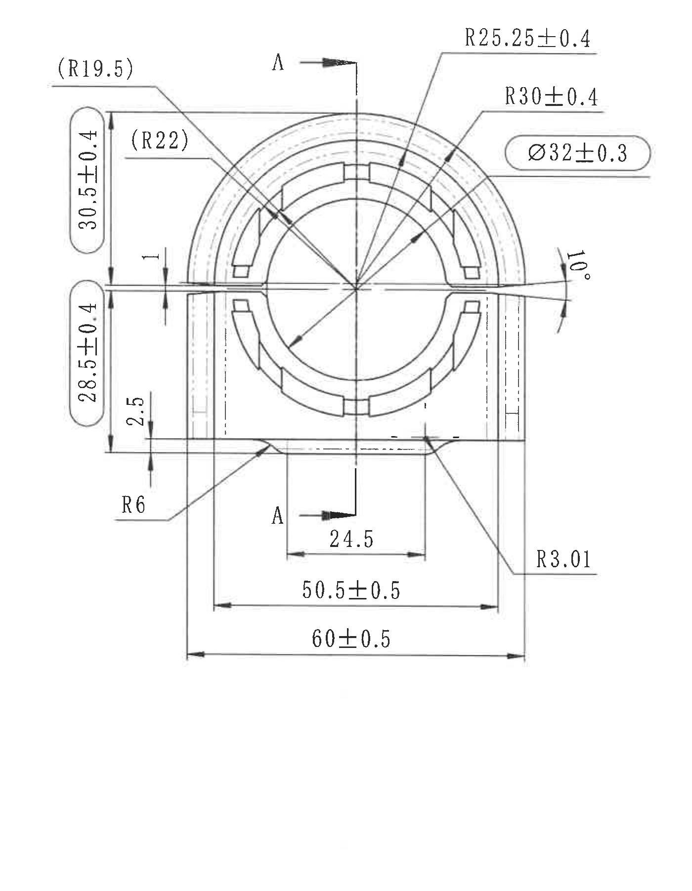
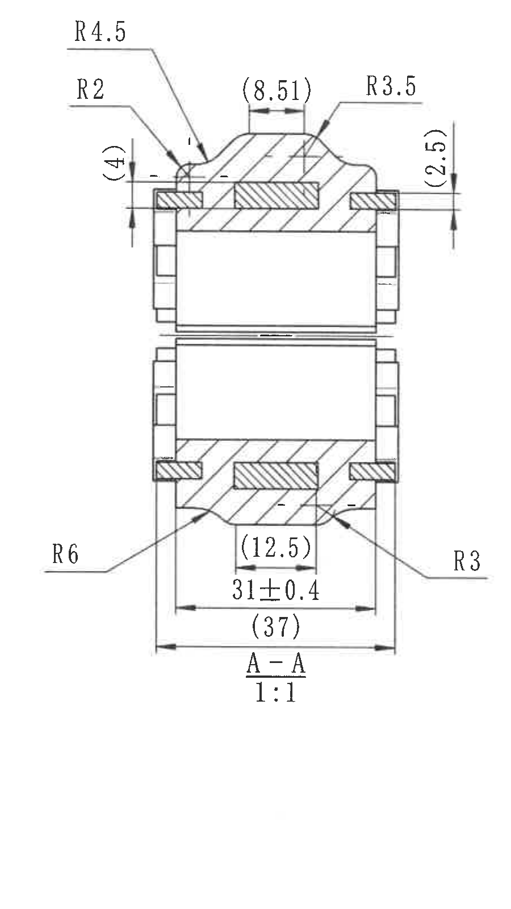
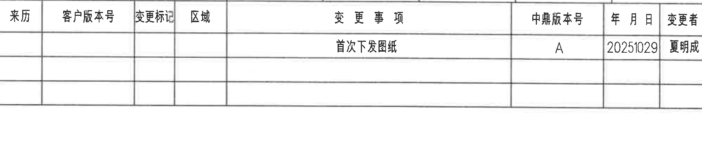
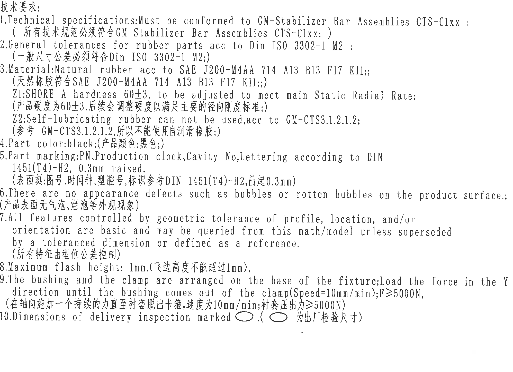
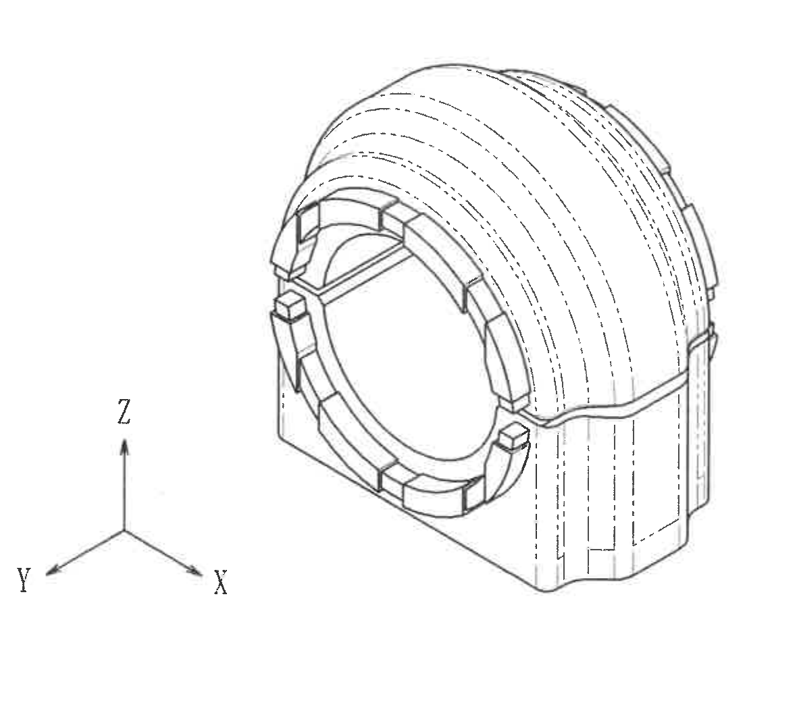
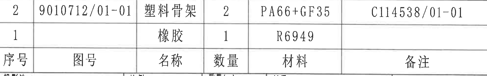
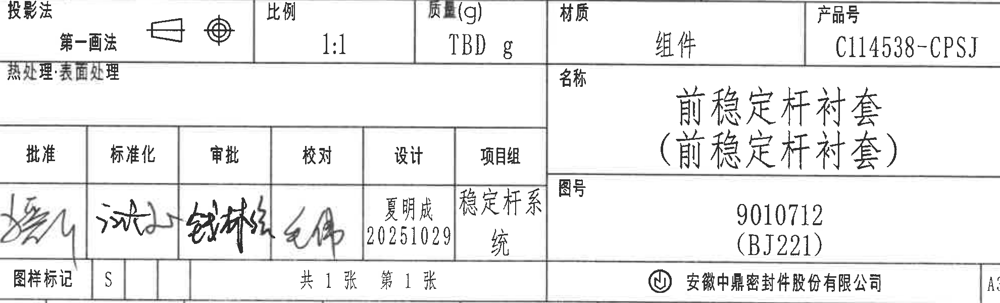

# 20C114538.pdf 内容识别

整页渲染图：`20C114538_assets/images/page_1.png`，页面尺寸 4959 x 3505 px。

## object_1 主加工视图

原图位置/视图名称：第 1 页，上左主加工视图，bbox `[430, 350, 1830, 2150]`。

| 提取项 | 原图数值或文本 | 含义说明 |
|---|---|---|
| 视图名称 | 主加工视图 | 零件端面/正向加工轮廓，包含圆弧、宽度、高度、剖切位置和角度。 |
| 剖切标记 | A、A | 上下两处箭头和竖向剖切线指示 A-A 剖面，剖面内容见 object_2。 |
| 参考半径 | (R19.5) | 括号内参考尺寸，指向左上外侧圆弧区域，仅作几何参考。 |
| 参考半径 | (R22) | 括号内参考尺寸，指向左上内侧弧/槽区域，仅作几何参考。 |
| 半径 | R25.25±0.4 | 指向上部外侧圆弧轮廓，带 ±0.4 公差。 |
| 半径 | R30±0.4 | 指向上部内侧/相邻弧形轮廓，带 ±0.4 公差。 |
| 直径 | Ø32±0.3 | 中央圆孔/内圆相关直径，外有圆角框，按 NOTES 第 10 条为出厂检验尺寸。 |
| 垂直尺寸 | 30.5±0.4 | 左侧上段高度尺寸，外有圆角框，按 NOTES 第 10 条为出厂检验尺寸。 |
| 垂直尺寸 | 28.5±0.4 | 左侧下段高度尺寸，外有圆角框，按 NOTES 第 10 条为出厂检验尺寸。 |
| 垂直尺寸 | 1 | 中间分型/间隙附近的小高度尺寸。 |
| 垂直尺寸 | 2.5 | 底部台阶附近的小高度尺寸。 |
| 半径 | R6 | 左下底部圆角/过渡圆弧半径。 |
| 半径 | R3.01 | 右下底部圆角/过渡圆弧半径。 |
| 角度 | 10° | 右侧开口/斜边处角度标注。 |
| 水平尺寸 | 24.5 | 下部中间局部宽度尺寸，位于 A-A 剖切标记下方。 |
| 水平尺寸 | 50.5±0.5 | 下部中间宽度尺寸，带 ±0.5 公差。 |
| 水平尺寸 | 60±0.5 | 下部总宽度尺寸，带 ±0.5 公差。 |

边界归属说明：该裁切仅包含主加工视图及其外伸尺寸线；右侧 A-A 剖面和 NOTES 均未纳入。靠近右侧的 `10°`、`Ø32±0.3`、`R3.01` 标注均由完整箭头/引线指回主视图，归属 object_1。

## object_2 A-A 剖面视图

原图位置/视图名称：第 1 页，上中 A-A 剖面视图，bbox `[1800, 350, 2700, 1950]`。

| 提取项 | 原图数值或文本 | 含义说明 |
|---|---|---|
| 视图名称 | A-A | 由 object_1 中 A-A 剖切标记生成的剖面视图。 |
| 比例 | 1:1 | 剖面视图比例。 |
| 半径 | R4.5 | 剖面上部左侧外形过渡圆角半径。 |
| 半径 | R2 | 剖面上部左侧小圆角半径。 |
| 参考尺寸 | (4) | 剖面上部左侧垂向参考尺寸，括号表示参考。 |
| 参考尺寸 | (8.51) | 剖面顶部中间水平参考尺寸，括号表示参考。 |
| 半径 | R3.5 | 剖面上部右侧外形圆角半径。 |
| 参考尺寸 | (2.5) | 剖面上部右侧垂向参考尺寸，括号表示参考。 |
| 半径 | R6 | 剖面下部左侧过渡圆角半径。 |
| 参考尺寸 | (12.5) | 剖面下部中间水平参考尺寸，括号表示参考。 |
| 水平尺寸 | 31±0.4 | 剖面下部水平尺寸，带 ±0.4 公差。 |
| 参考尺寸 | (37) | 剖面底部总宽度参考尺寸，括号表示参考。 |
| 半径 | R3 | 剖面下部右侧过渡圆角半径。 |

边界归属说明：该裁切已收在 A-A 剖面外伸尺寸范围内，右侧 NOTES 编号未纳入；左上 `R4.5`、`R2` 及下部 `R6`、`R3` 的引线均完整，均归属 A-A 剖面，不归入主视图。

## object_3 修订履历表

原图位置/视图名称：第 1 页，右上修订履历表，bbox `[2785, 175, 4775, 585]`。

| 来历 | 客户版本号 | 变更标记 | 区域 | 变更事项 | 中鼎版本号 | 年月日 | 变更者 |
|---|---|---|---|---|---|---|---|
|  |  |  |  | 首次下发图纸 | A | 20251029 | 夏明成 |
|  |  |  |  |  |  |  |  |
|  |  |  |  |  |  |  |  |

| 提取项 | 原图数值或文本 | 含义说明 |
|---|---|---|
| 表头 | 来历、客户版本号、变更标记、区域、变更事项、中鼎版本号、年月日、变更者 | 修订履历列名。 |
| 修订记录 | 首次下发图纸 / A / 20251029 / 夏明成 | 首次发布图纸记录；其余列为空。 |
| 空白记录行 | 2 行 | 原表保留的空白修订行。 |

边界归属说明：裁切按修订履历表外框截取，右侧图框坐标字母未作为表格内容提取；表内空白行按原图保留。

## object_4 NOTES / 技术要求

原图位置/视图名称：第 1 页，右侧 NOTES/技术要求文本区，bbox `[2770, 605, 4765, 2055]`。

| 提取项 | 原图数值或文本 | 含义说明 |
|---|---|---|
| 标题 | 技术要求: | 技术要求说明区标题。 |
| 1 | Technical specifications:Must be conformed to GM-Stabilizer Bar Assemblies CTS-C1xx;（所有技术规范必须符合GM-Stabilizer Bar Assemblies CTS-C1xx;） | 技术规范需符合 GM 稳定杆总成 CTS-C1xx。 |
| 2 | General tolerances for rubber parts acc to Din ISO 3302-1 M2;（一般尺寸公差必须符合Din ISO 3302-1 M2;） | 橡胶件一般尺寸公差依据 DIN ISO 3302-1 M2。 |
| 3 | Material:Natural rubber acc to SAE J200-M4AA 714 A13 B13 F17 K11;;（天然橡胶符合SAE J200-M4AA 714 A13 B13 F17 K11;;） | 材料为天然橡胶，等级/性能按 SAE J200-M4AA 714 A13 B13 F17 K11。 |
| Z1 | SHORE A hardness 60±3, to be adjusted to meet main Static Radial Rate;（产品硬度为60±3,后续会调整硬度以满足主要的径向刚度标准;） | 邵氏 A 硬度 60±3，并可为满足主要静态径向刚度调整。 |
| Z2 | Self-lubricating rubber can not be used,acc to GM-CTS3.1.2.1.2;（参考 GM-CTS3.1.2.1.2,所以不能使用自润滑橡胶;） | 禁止使用自润滑橡胶。 |
| 4 | Part color:black;（产品颜色:黑色;） | 产品颜色为黑色。 |
| 5 | Part marking:PN,Production clock,Cavity No,Lettering according to DIN 1451(T4)-H2, 0.3mm raised,（表面刻:图号,时间钟,型腔号,标识参考DIN 1451(T4)-H2,凸起0.3mm） | 表面标识包含图号、时间钟、型腔号；字体/标识按 DIN 1451(T4)-H2，凸起 0.3 mm。 |
| 6 | There are no appearance defects such as bubbles or rotten bubbles on the product surface,;（产品表面无气泡,烂泡等外观现象） | 产品表面不得有气泡、烂泡等外观缺陷。 |
| 7 | All features controlled by geometric tolerance of profile, location, and/or orientation are basic and may be queried from this math/model unless superseded by a toleranced dimension or defined as a reference.（所有特征由型位公差控制） | 型面、位置和/或方向的几何公差控制特征为基本尺寸，除非被带公差尺寸或参考定义取代。 |
| 8 | Maximum flash height: 1mm.（飞边高度不能超过1mm）, | 最大飞边高度 1 mm。 |
| 9 | The bushing and the clamp are arranged on the base of the fixture;Load the force in the Y direction until the bushing comes out of the clamp(Speed=10mm/min);F≥5000N,（在轴向施加一个持续的力直至衬套脱出卡箍,速度为10mm/min;衬套压出力≥5000N） | 压出试验：按 Y 方向加载，速度 10 mm/min，衬套压出力 F≥5000 N。 |
| 10 | Dimensions of delivery inspection marked ○.(○ 为出厂检验尺寸) | 图中用圆角框/椭圆圈出的尺寸为出厂检验尺寸。 |

边界归属说明：该裁切只提取 NOTES 文本内容；右侧图框线未作为 NOTES 内容解读。第 9 条长句在原图中分行显示，`Y direction`、`Speed=10mm/min`、`F≥5000N` 均完整归属 NOTES。

## object_5 轴测视图

原图位置/视图名称：第 1 页，下中轴测视图，bbox `[1530, 2190, 2710, 3240]`。

| 提取项 | 原图数值或文本 | 含义说明 |
|---|---|---|
| 视图名称 | 轴测视图 | 零件三维外观示意，用于表达整体形状和局部槽/筋结构。 |
| 坐标轴 | X、Y、Z | 方向基准示意；Z 向上，X/Y 在底部斜向展开。 |
| 可见结构 | 圆筒状衬套、前端分瓣结构、外侧纵向虚线/筋槽、右侧竖向结构 | 表达零件整体外形和可见/隐藏轮廓。 |
| 尺寸标注 | 无可见尺寸数值 | 该轴测图未给出尺寸、公差或半径；尺寸读取以 object_1 和 object_2 为准。 |

边界归属说明：右侧标题栏边线已排除，裁切只包含轴测模型和 X/Y/Z 坐标轴；无尺寸线靠近边界。

## object_6 明细表 / 物料表

原图位置/视图名称：第 1 页，右下明细表/物料表上段，bbox `[2785, 2460, 4765, 2770]`。原图中表头位于两条明细记录下方，以下 Markdown 表按原列名列出，并保持数据行自上而下为 `2`、`1`。

| 序号 | 图号 | 名称 | 数量 | 材料 | 备注 |
|---|---|---|---|---|---|
| 2 | 9010712/01-01 | 塑料骨架 | 2 | PA66+GF35 | C114538/01-01 |
| 1 |  | 橡胶 | 1 | R6949 |  |

| 提取项 | 原图数值或文本 | 含义说明 |
|---|---|---|
| 表头 | 序号、图号、名称、数量、材料、备注 | 明细表字段。 |
| 明细行 2 | 9010712/01-01 / 塑料骨架 / 数量 2 / PA66+GF35 / C114538/01-01 | 塑料骨架件，数量 2，材料 PA66+GF35，备注为 C114538/01-01。 |
| 明细行 1 | 橡胶 / 数量 1 / R6949 | 橡胶件，数量 1，材料 R6949，图号和备注栏为空。 |

边界归属说明：该对象只提取明细表上段，未把下方标题栏字段作为明细行；表格右边界保留，右侧图框坐标未作为内容提取。

## object_7 标题栏

原图位置/视图名称：第 1 页，右下标题栏，bbox `[2785, 2760, 4765, 3360]`。

| 提取项 | 原图数值或文本 | 含义说明 |
|---|---|---|
| 投影法 | 第一画法；带第一角法投影符号 | 图纸采用第一角法投影。 |
| 比例 | 1:1 | 图纸比例。 |
| 质量(g) | TBD g | 质量待定。 |
| 材质 | 组件 | 总成/组件材质栏。 |
| 产品号 | C114538-CPSJ | 产品编号。 |
| 热处理:表面处理 | 空白 | 原图该栏未填写具体处理要求。 |
| 名称 | 前稳定杆衬套（前稳定杆衬套） | 零件/组件名称。 |
| 图号 | 9010712（BJ221） | 图纸编号及括号内代号。 |
| 批准 | 手写签名，原图不可精确辨认 | 批准签署栏。 |
| 标准化 | 手写签名，原图不可精确辨认 | 标准化签署栏。 |
| 审批 | 手写签名，原图不可精确辨认 | 审批签署栏。 |
| 校对 | 手写签名，原图不可精确辨认 | 校对签署栏。 |
| 设计 | 夏明成 / 20251029 | 设计人员和日期。 |
| 项目组 | 稳定杆系统 | 项目组名称。 |
| 图样标记 | S | 图样标记。 |
| 页数 | 共 1 张 / 第 1 张 | 图纸总页数和当前页序。 |
| 公司 | 安徽中鼎密封件股份有限公司 | 出图/公司名称。 |
| 幅面 | A3 | 图幅规格。 |

边界归属说明：该裁切包含标题栏内的投影、比例、质量、名称、图号、签署、页数、公司和 A3 幅面字段；上方明细表已拆分为 object_6，不在本对象中作为明细行提取。

## 裁切检查记录

| 对象 | 图片 | 检查记录 |
|---|---|---|
| page_1 | `20C114538_assets/images/page_1.png` | PDF 已先渲染为整页 PNG，页面完整。 |
| object_1 | `20C114538_assets/images/object_1.png` | 主加工视图所有外伸尺寸线、箭头、`A` 剖切标记、`10°`、`Ø32±0.3`、底部宽度尺寸均完整；未带入 A-A 剖面或 NOTES。 |
| object_2 | `20C114538_assets/images/object_2.png` | A-A 剖面所有文字、箭头和尺寸线完整；右侧 NOTES 编号已排除，顶部未混入主视图尺寸。 |
| object_3 | `20C114538_assets/images/object_3.png` | 修订表表头、首行记录和空白行完整；右侧图框坐标不作为表格内容提取。 |
| object_4 | `20C114538_assets/images/object_4.png` | NOTES 第 1-10 条文字完整，第 9 条长句分行完整；无尺寸视图混入。 |
| object_5 | `20C114538_assets/images/object_5.png` | 轴测图和 X/Y/Z 坐标轴完整；无右侧标题栏残线。 |
| object_6 | `20C114538_assets/images/object_6.png` | 明细表两条数据行和表头字段完整；下方标题栏未作为明细内容提取。 |
| object_7 | `20C114538_assets/images/object_7.png` | 标题栏字段、签署栏、页数、公司和 A3 标记完整；手写签名因原图清晰度不足仅按不可精确辨认记录。 |
