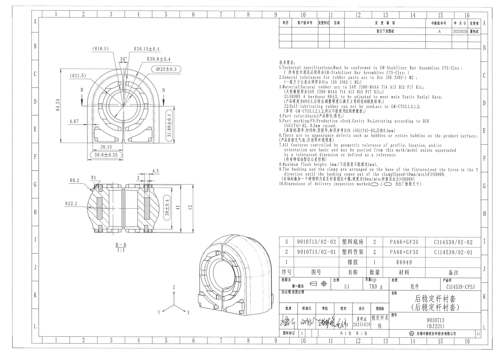
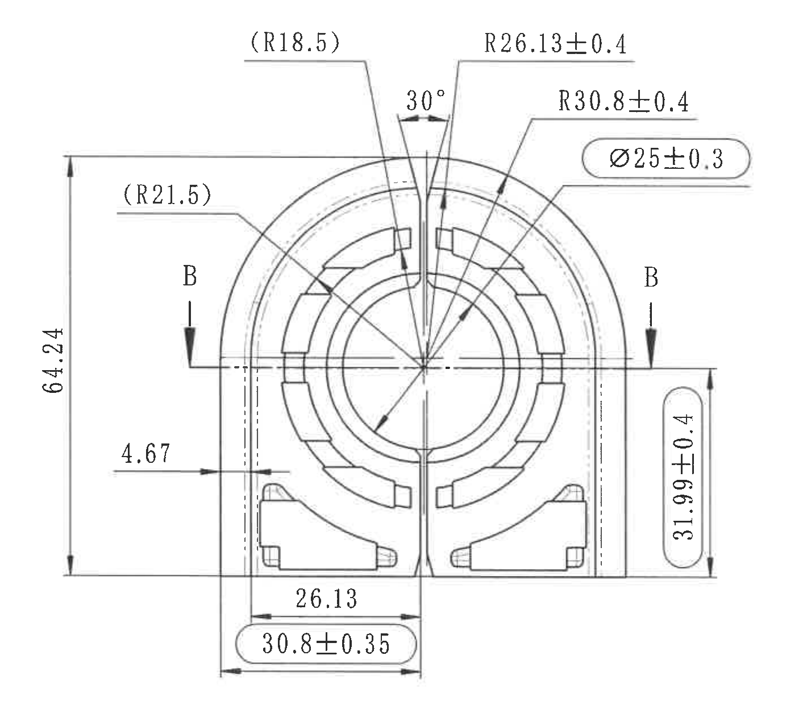
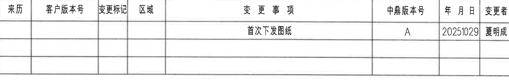
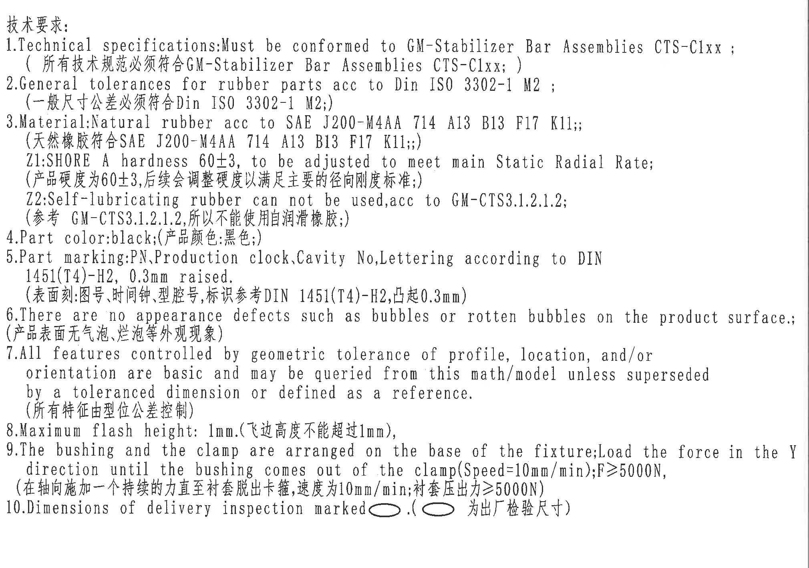
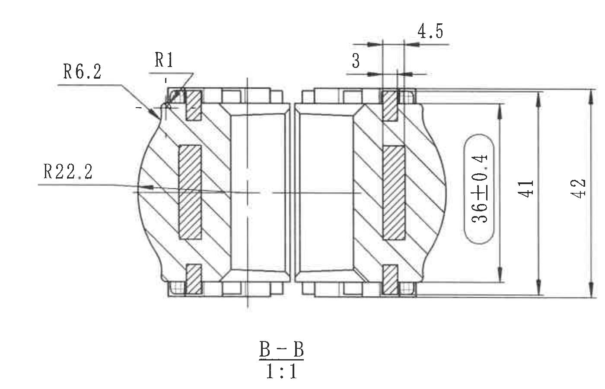
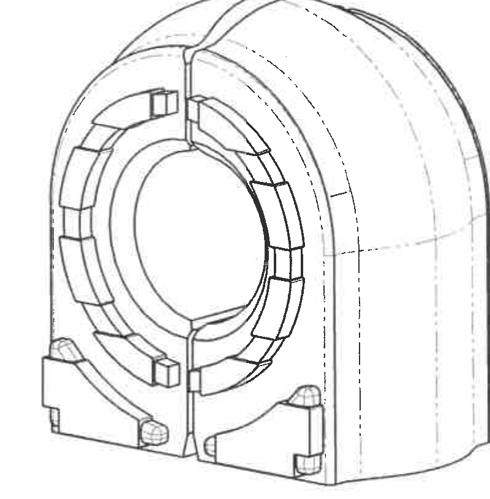
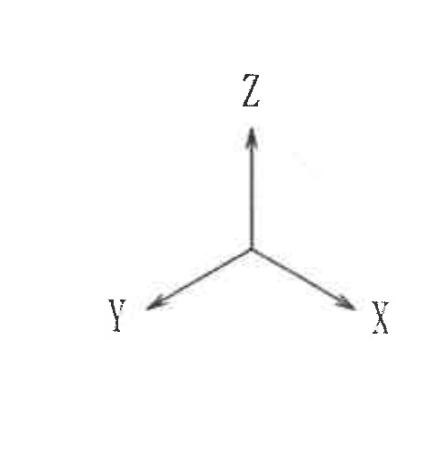
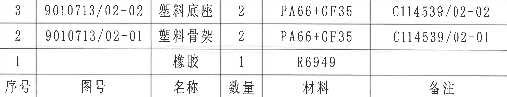
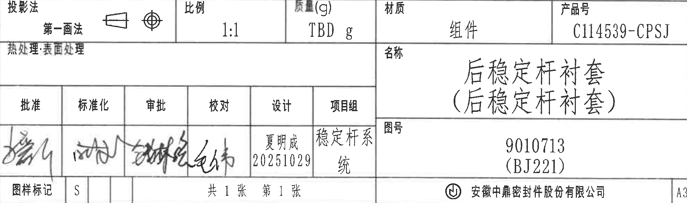

# 20C114539 内容识别

源文件：`input/20C114539.pdf`  
整页渲染图：`outputs/20C114539_assets/images/page_1.png`，像素尺寸 4959 x 3505。

## object_1：主加工视图

原图位置/视图名称：第 1 页左上主加工视图，bbox `[480, 410, 1900, 1650]`。

| 提取项 | 原图数值或文本 | 含义说明 |
|---|---|---|
| 参考圆弧半径 | `(R18.5)` | 括号内参考尺寸，位于主视图上方偏左，说明上部槽/圆弧相关参考半径；括号表示参考用，不作为直接公差控制尺寸。 |
| 圆弧半径 | `R26.13±0.4` | 主视图上方右侧引线指向内侧圆弧/轮廓，半径 26.13，公差 ±0.4。 |
| 角度 | `30°` | 顶部开口两侧斜边夹角，角度尺寸。 |
| 圆弧半径 | `R30.8±0.4` | 主视图上方右侧引线指向外侧圆弧，半径 30.8，公差 ±0.4。 |
| 出厂检验标记尺寸 | `Ø25±0.3` | 圆/孔类直径尺寸，带直径符号 Ø，公差 ±0.3；数值被椭圆/胶囊框标出，对应 NOTES 第 10 条的出厂检验尺寸标记。 |
| 参考圆弧半径 | `(R21.5)` | 括号内参考尺寸，位于主视图左上，指向左侧内圈圆弧，作为参考半径。 |
| 剖切标识 | `B`、`B` | 两侧剖切箭头标识剖面 B-B，箭头和字母属于主视图的剖切位置标注，不归入 B-B 剖面尺寸。 |
| 总高度 | `64.24` | 主视图左侧竖向尺寸，从底部基准线至上方水平尺寸线的整体高度。 |
| 水平局部尺寸 | `4.67` | 主视图左下水平尺寸，箭头指向左侧壁与内部虚线/台阶之间的距离。 |
| 出厂检验标记尺寸 | `31.99±0.4` | 主视图右侧竖向高度尺寸，公差 ±0.4，椭圆/胶囊框标出，为出厂检验尺寸。 |
| 底部水平尺寸 | `26.13` | 主视图下方内部水平距离，位于左下区域至中间分型/中心线之间。 |
| 出厂检验标记尺寸 | `30.8±0.35` | 主视图底部水平尺寸，公差 ±0.35，椭圆/胶囊框标出，为出厂检验尺寸。 |
| 星号关键尺寸 | 未见 `*` 标记 | 本主视图内未发现带星号关键尺寸。 |
| T 编号 | 未见 | 本主视图内未发现 T 编号。 |

边界归属说明：裁切保留主视图全部尺寸线、箭头、引线和文字；底部边界止于主视图底部尺寸线以下，未混入下方 B-B 剖面；两处 `B` 剖切箭头归属主视图，剖面本体尺寸不归入本对象。

## object_4：修订履历表

原图位置/视图名称：第 1 页右上修订履历表，bbox `[2778, 190, 4763, 510]`。

原表行列还原：

| 来历 | 客户版本号 | 变更标记 | 区域 | 变更事项 | 中鼎版本号 | 年月日 | 变更者 |
|---|---|---|---|---|---|---|---|
|  |  |  |  | 首次下发图纸 | A | 20251029 | 夏明成 |
|  |  |  |  |  |  |  |  |
|  |  |  |  |  |  |  |  |

| 提取项 | 原图数值或文本 | 含义说明 |
|---|---|---|
| 表头 | `来历 / 客户版本号 / 变更标记 / 区域 / 变更事项 / 中鼎版本号 / 年月日 / 变更者` | 修订履历列名。 |
| 修订记录 | `首次下发图纸` | 变更事项为首次下发图纸。 |
| 版本号 | `A` | 中鼎版本号为 A。 |
| 日期 | `20251029` | 修订/下发日期，格式为 YYYYMMDD。 |
| 变更者 | `夏明成` | 变更者姓名。 |

边界归属说明：裁切只包含修订履历表本体，顶部图框坐标数字和右侧图框字母已排除；表格左上边线紧贴裁切边界，但表头文字和所有行列线完整。

## object_5：NOTES / 技术要求

原图位置/视图名称：第 1 页右侧技术要求文字区，bbox `[2760, 560, 4780, 1980]`。

| 提取项 | 原图数值或文本 | 含义说明 |
|---|---|---|
| 标题 | `技术要求:` | 技术要求/NOTES 区标题。 |
| 1 | `Technical specifications:Must be conformed to GM-Stabilizer Bar Assemblies CTS-C1xx;` / `所有技术规范必须符合GM-Stabilizer Bar Assemblies CTS-C1xx;` | 技术规范需符合 GM-Stabilizer Bar Assemblies CTS-C1xx。 |
| 2 | `General tolerances for rubber parts acc to Din ISO 3302-1 M2;` / `一般尺寸公差必须符合Din ISO 3302-1 M2;` | 橡胶件一般尺寸公差按 DIN ISO 3302-1 M2。 |
| 3 | `Material:Natural rubber acc to SAE J200-M4AA 714 A13 B13 F17 K11;;` / `天然橡胶符合SAE J200-M4AA 714 A13 B13 F17 K11;;` | 材料为天然橡胶，按 SAE J200-M4AA 714 A13 B13 F17 K11。 |
| Z1 | `SHORE A hardness 60±3, to be adjusted to meet main Static Radial Rate;` / `产品硬度为60±3,后续会调整硬度以满足主要的径向刚度标准;` | 邵氏 A 硬度 60±3，并可为满足主要径向静刚度继续调整。 |
| Z2 | `Self-lubricating rubber can not be used,acc to GM-CTS3.1.2.1.2;` / `参考 GM-CTS3.1.2.1.2,所以不能使用自润滑橡胶;` | 禁止使用自润滑橡胶。 |
| 4 | `Part color:black;` / `产品颜色:黑色;` | 产品颜色为黑色。 |
| 5 | `Part marking:PN,Production clock,Cavity No,Lettering according to DIN 1451(T4)-H2, 0.3mm raised.` / `表面刻:图号,时间钟,型腔号,标识参考DIN 1451(T4)-H2,凸起0.3mm` | 产品表面标记包含 PN、生产时间钟、型腔号，字体按 DIN 1451(T4)-H2，凸起 0.3mm。 |
| 6 | `There are no appearance defects such as bubbles or rotten bubbles on the product surface.;` / `产品表面无气泡,烂泡等外观现象` | 产品表面不得有气泡、烂泡等外观缺陷。 |
| 7 | `All features controlled by geometric tolerance of profile, location, and/or orientation are basic and may be queried from this math/model unless superseded by a toleranced dimension or defined as a reference.` / `所有特征由型位公差控制` | 未由带公差尺寸或参考定义替代的轮廓、位置、方向等特征，由数学模型/型位公差控制。 |
| 8 | `Maximum flash height: 1mm.` / `飞边高度不能超过1mm` | 最大飞边高度 1mm。 |
| 9 | `The bushing and the clamp are arranged on the base of the fixture;Load the force in the Y direction until the bushing comes out of the clamp(Speed=10mm/min);F≥5000N,` / `在轴向施加一个持续的力直至衬套脱出卡箍,速度为10mm/min;衬套压出力≥5000N` | 试验/装配要求：沿 Y 方向加载，速度 10mm/min，衬套压出力不小于 5000N。 |
| 10 | `Dimensions of delivery inspection marked [oval]. ([oval] 为出厂检验尺寸)` | 椭圆/胶囊框标出的尺寸为出厂检验尺寸；主视图和 B-B 剖面中对应 `Ø25±0.3`、`31.99±0.4`、`30.8±0.35`、`36±0.4`。 |

边界归属说明：裁切完整包含 NOTES 第 1 至第 10 条和中英文说明；右边界收在图框坐标栏之前，未混入 C-G 分区字母；下方未进入右下表格。

## object_2：B-B 剖面视图

原图位置/视图名称：第 1 页左中 B-B 剖面视图，bbox `[550, 1630, 1950, 2530]`。

| 提取项 | 原图数值或文本 | 含义说明 |
|---|---|---|
| 圆弧半径 | `R6.2` | 剖面左上外轮廓圆角/圆弧半径。 |
| 圆角半径 | `R1` | 剖面左上小圆角半径。 |
| 圆弧半径 | `R22.2` | 剖面左侧外形圆弧半径，引线指向左侧弧面。 |
| 局部水平尺寸 | `3` | 剖面上方右侧窄台阶/夹持区域的水平尺寸。 |
| 局部水平尺寸 | `4.5` | 剖面上方右侧台阶宽度尺寸。 |
| 出厂检验标记尺寸 | `36±0.4` | 剖面右侧竖向尺寸，公差 ±0.4，椭圆/胶囊框标出，为出厂检验尺寸。 |
| 竖向尺寸 | `41` | 剖面右侧中间竖向高度尺寸。 |
| 总高度 | `42` | 剖面右侧最外竖向高度尺寸。 |
| 剖面名称 | `B-B` | 剖面视图名称，对应主视图中 B-B 剖切标识。 |
| 比例 | `1:1` | 剖面图比例。 |
| 星号关键尺寸 | 未见 `*` 标记 | 本剖面内未发现带星号关键尺寸。 |
| T 编号 | 未见 | 本剖面内未发现 T 编号。 |

边界归属说明：裁切完整包含剖面图、剖面名称 `B-B`、比例 `1:1` 和所有剖面尺寸线；上边界已避开主视图底部尺寸，底边未混入下方轴测图。

## object_3：轴测零件视图

原图位置/视图名称：第 1 页下中轴测零件视图，bbox `[1900, 2350, 2700, 3165]`。

| 提取项 | 原图数值或文本 | 含义说明 |
|---|---|---|
| 视图类型 | 轴测零件视图 | 展示零件三维外形、前侧环形结构、分型/开口、底部安装凸台及后侧隐藏轮廓线。 |
| 尺寸标注 | 未见尺寸数值 | 该轴测图仅用于形状表达，未给出独立尺寸、公差、角度或半径。 |
| 隐藏/参考轮廓 | 虚线轮廓 | 右侧和后侧虚线表示不可见或背面轮廓。 |
| 星号关键尺寸 | 未见 `*` 标记 | 本轴测图内未发现带星号关键尺寸。 |
| T 编号 | 未见 | 本轴测图内未发现 T 编号。 |

边界归属说明：为避免混入左侧 X/Y/Z 坐标轴和右侧表格，轴测零件本体单独裁切；坐标轴另列为 object_8。该对象不提取相邻坐标轴或表格信息。

## object_8：坐标轴局部标识

原图位置/视图名称：第 1 页下中偏左坐标轴局部标识，bbox `[1450, 2760, 1920, 3260]`。

| 提取项 | 原图数值或文本 | 含义说明 |
|---|---|---|
| 坐标轴 | `Z` | Z 轴箭头向上。 |
| 坐标轴 | `Y` | Y 轴箭头指向左下。 |
| 坐标轴 | `X` | X 轴箭头指向右下。 |
| 尺寸标注 | 未见尺寸数值 | 该局部对象只说明轴向，不包含尺寸、公差或角度。 |

边界归属说明：裁切只包含 X/Y/Z 三轴箭头和字母，未混入轴测零件本体；该局部标识用于解释 NOTES 第 9 条中 Y 方向加载的方向参考。

## object_6：明细表 / BOM

原图位置/视图名称：第 1 页右下明细表，bbox `[2778, 2365, 4763, 2750]`。

原表行列还原：

| 序号 | 图号 | 名称 | 数量 | 材料 | 备注 |
|---|---|---|---|---|---|
| 3 | 9010713/02-02 | 塑料底座 | 2 | PA66+GF35 | C114539/02-02 |
| 2 | 9010713/02-01 | 塑料骨架 | 2 | PA66+GF35 | C114539/02-01 |
| 1 |  | 橡胶 | 1 | R6949 |  |

| 提取项 | 原图数值或文本 | 含义说明 |
|---|---|---|
| 表头 | `序号 / 图号 / 名称 / 数量 / 材料 / 备注` | 明细表列名。 |
| 明细行 3 | `9010713/02-02 / 塑料底座 / 2 / PA66+GF35 / C114539/02-02` | 塑料底座零件，数量 2，材料 PA66+GF35，备注为 C114539/02-02。 |
| 明细行 2 | `9010713/02-01 / 塑料骨架 / 2 / PA66+GF35 / C114539/02-01` | 塑料骨架零件，数量 2，材料 PA66+GF35，备注为 C114539/02-01。 |
| 明细行 1 | `橡胶 / 1 / R6949` | 橡胶件，数量 1，材料 R6949；图号和备注为空。 |

边界归属说明：裁切只包含明细表三条物料行和表头，底边止于明细表边框，未混入下方标题栏的投影法、比例等字段。

## object_7：标题栏

原图位置/视图名称：第 1 页右下标题栏，bbox `[2778, 2765, 4768, 3355]`。

| 提取项 | 原图数值或文本 | 含义说明 |
|---|---|---|
| 投影法 | `第一画法` | 标题栏投影法字段，带投影视图符号。 |
| 比例 | `1:1` | 图纸比例。 |
| 质量 | `TBD g` | 质量字段，单位 g，数值待定。 |
| 材质 | `组件` | 标题栏材质字段为组件。 |
| 产品号 | `C114539-CPSJ` | 产品号。 |
| 热处理/表面处理 | `热处理:表面处理` | 标题栏左侧处理字段，未见具体处理值。 |
| 名称 | `后稳定杆衬套（后稳定杆衬套）` | 产品名称，中文名称及括号内重复名称。 |
| 图号 | `9010713 (BJ221)` | 图纸/零件图号。 |
| 批准 | 签名 | 批准栏为手写签名。 |
| 标准化 | 签名 | 标准化栏为手写签名。 |
| 审批 | 签名 | 审批栏为手写签名。 |
| 校对 | 签名 | 校对栏为手写签名。 |
| 设计 | `夏明成 20251029` | 设计人员及日期。 |
| 项目组 | `稳定杆系统` | 项目组名称，原图分两行显示。 |
| 图样标记 | `S` | 图样标记字段。 |
| 页数 | `共 1 张 第 1 张` | 总张数和当前张号。 |
| 公司 | `安徽中鼎密封件股份有限公司` | 图纸所属公司。 |
| 图幅 | `A3` | 标题栏右下图幅字段。 |

边界归属说明：裁切包含标题栏本体，右下 `A3` 属于标题栏图幅字段；底部图框坐标数字已排除，顶部未包含明细表数据行。

## 裁切检查记录

| 对象 | 图片路径 | 检查结果 |
|---|---|---|
| object_1 主加工视图 | `outputs/20C114539_assets/images/object_1.png` | 完整包含主视图尺寸线、箭头、引线、参考尺寸和 B-B 剖切字母；未带入 B-B 剖面。 |
| object_2 B-B 剖面视图 | `outputs/20C114539_assets/images/object_2.png` | 完整包含 R6.2、R1、R22.2、3、4.5、36±0.4、41、42、B-B 和 1:1；未带入轴测图。 |
| object_3 轴测零件视图 | `outputs/20C114539_assets/images/object_3.png` | 轴测零件主体完整；为避免混入 X/Y/Z 坐标轴，坐标轴另裁为 object_8。 |
| object_4 修订履历表 | `outputs/20C114539_assets/images/object_4.png` | 表头、表格线和记录完整；顶部坐标数字和右侧图框字母已排除。 |
| object_5 NOTES | `outputs/20C114539_assets/images/object_5.png` | 第 1-10 条技术要求完整；右侧图框坐标栏未混入。 |
| object_6 明细表 | `outputs/20C114539_assets/images/object_6.png` | 三条明细行、表头和所有列完整；下方标题栏字段未混入。 |
| object_7 标题栏 | `outputs/20C114539_assets/images/object_7.png` | 标题栏字段完整，含 `A3` 图幅；底部图框坐标数字未混入。 |
| object_8 坐标轴局部标识 | `outputs/20C114539_assets/images/object_8.png` | X/Y/Z 字母和箭头完整；未混入轴测零件本体。 |
