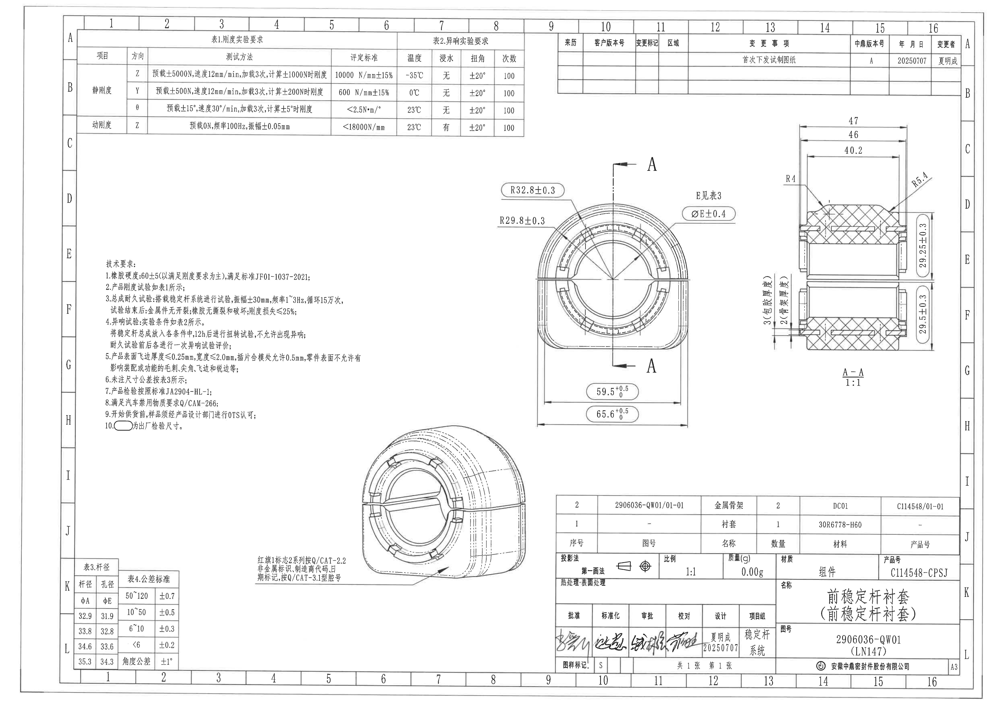
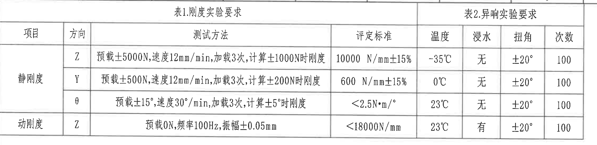
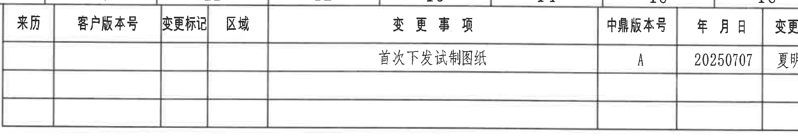
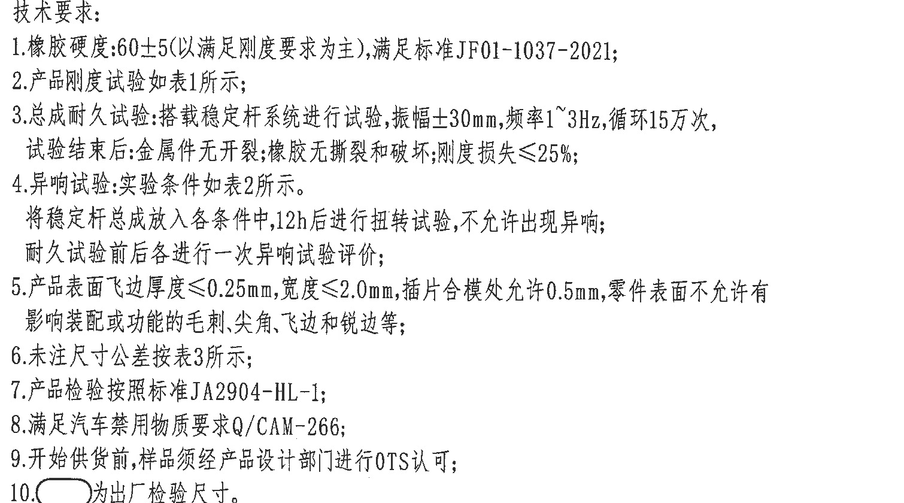
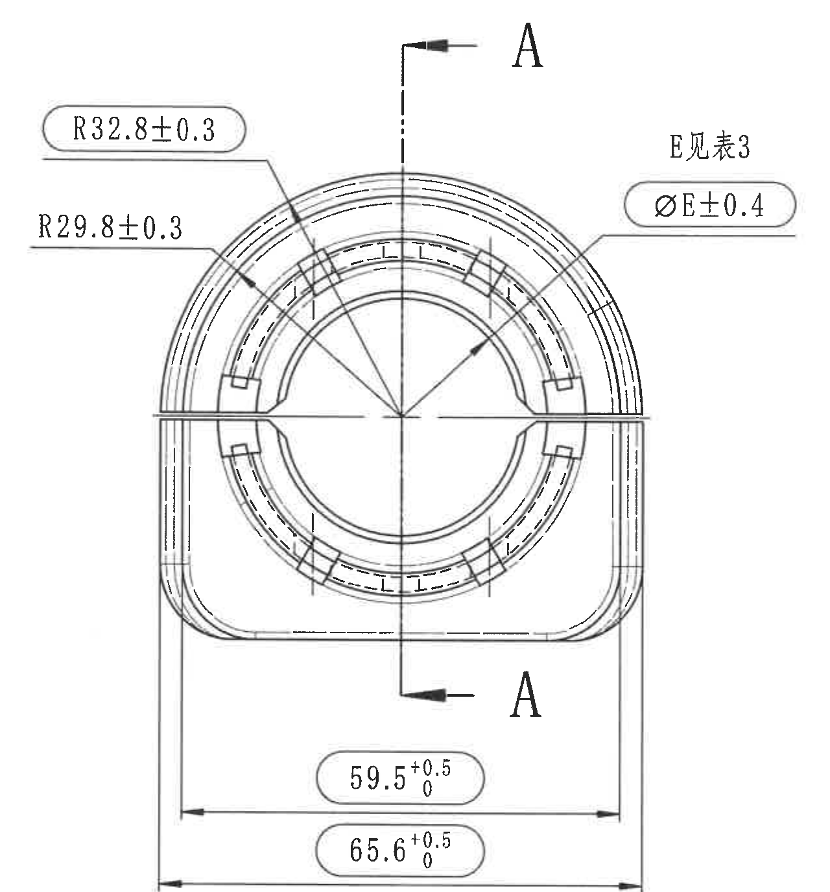
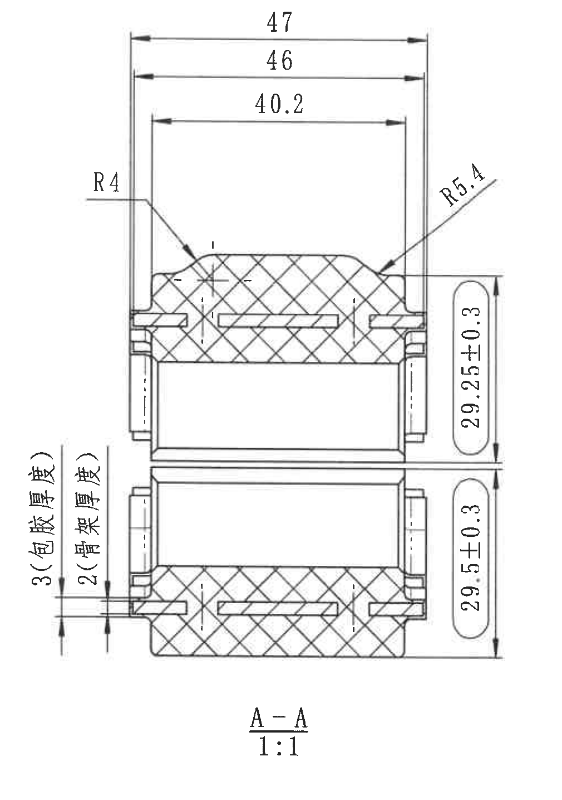
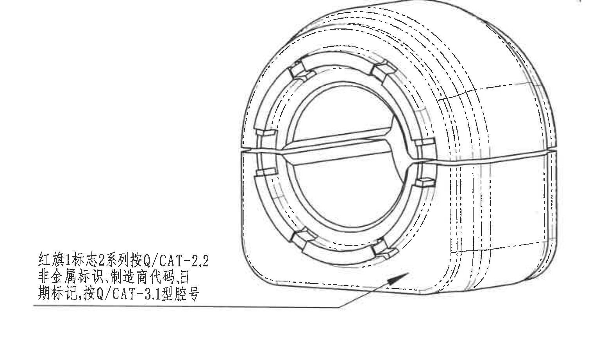
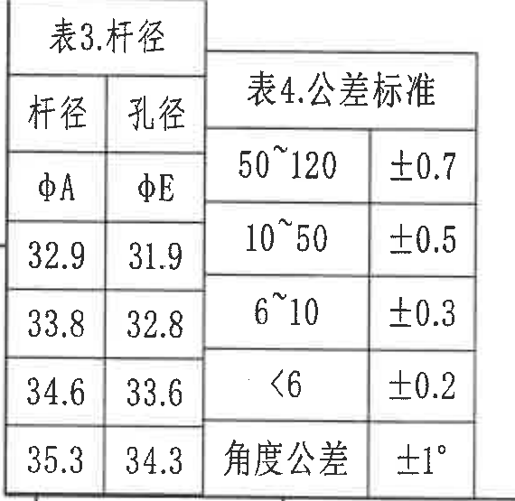
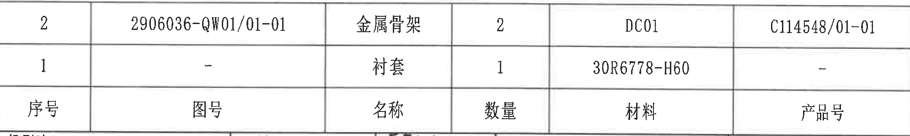
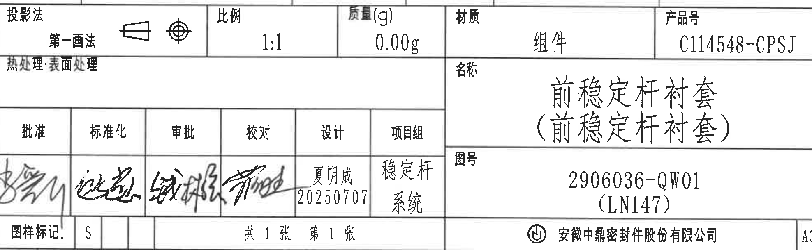

# 20C114548 PDF 内容识别

PDF：`input/20C114548.pdf`

整页渲染图：`outputs/20C114548_assets/images/page_1.png`

页面渲染尺寸：4959 x 3505 px。以下所有 bbox 均为整页 PNG 坐标 `[x1, y1, x2, y2]`。

## object_1 - 表1.刚度实验要求 / 表2.异响实验要求

原图位置/视图名称：页面左上区域，bbox `[390, 150, 2650, 700]`。  
对象类型：table。

### 原表还原

| 项目 | 方向 | 测试方法 | 评定标准 | 温度 | 浸水 | 扭角 | 次数 |
|---|---|---|---|---|---|---|---|
| 静刚度 | Z | 预载±5000N,速度12mm/min,加载3次,计算±1000N时刚度 | 10000 N/mm±15% | -35℃ | 无 | ±20° | 100 |
| 静刚度 | Y | 预载±500N,速度12mm/min,加载3次,计算±200N时刚度 | 600 N/mm±15% | 0℃ | 无 | ±20° | 100 |
| 静刚度 | θ | 预载±15°,速度30°/min,加载3次,计算±5°时刚度 | <2.5N·m/° | 23℃ | 无 | ±20° | 100 |
| 动刚度 | Z | 预载0N,频率100Hz,振幅±0.05mm | <18000N/mm | 23℃ | 有 | ±20° | 100 |

### 提取表

| 提取项 | 原图数值或文本 | 含义说明 |
|---|---|---|
| 表1标题 | 表1.刚度实验要求 | 表头覆盖“项目、方向、测试方法、评定标准”相关列。 |
| 表2标题 | 表2.异响实验要求 | 表头覆盖“温度、浸水、扭角、次数”试验条件列。 |
| 静刚度 Z | 预载±5000N,速度12mm/min,加载3次,计算±1000N时刚度；10000 N/mm±15% | Z 向静刚度测试和判定标准。 |
| 静刚度 Y | 预载±500N,速度12mm/min,加载3次,计算±200N时刚度；600 N/mm±15% | Y 向静刚度测试和判定标准。 |
| 静刚度 θ | 预载±15°,速度30°/min,加载3次,计算±5°时刚度；<2.5N·m/° | 扭转静刚度测试，θ 为角向。 |
| 动刚度 Z | 预载0N,频率100Hz,振幅±0.05mm；<18000N/mm | Z 向动刚度测试和判定标准。 |
| 异响条件 | -35℃/0℃/23℃，浸水无或有，扭角±20°，次数100 | 与各行刚度/异响试验条件对应。 |

边界归属说明：该裁切对象只包含顶部左侧试验要求表。表内温度、浸水、扭角、次数属于表2，不归入主视图或剖面视图。

## object_2 - 修订履历表

原图位置/视图名称：页面右上区域，bbox `[2760, 155, 4705, 490]`。  
对象类型：table。

### 原表还原

| 来历 | 客户版本号 | 变更标记 | 区域 | 变更事项 | 中鼎版本号 | 年 月 日 | 变更者 |
|---|---|---|---|---|---|---|---|
|  |  |  |  | 首次下发试制图纸 | A | 20250707 | 夏明成 |
|  |  |  |  |  |  |  |  |
|  |  |  |  |  |  |  |  |

### 提取表

| 提取项 | 原图数值或文本 | 含义说明 |
|---|---|---|
| 变更事项 | 首次下发试制图纸 | 本图首次发放为试制图纸。 |
| 中鼎版本号 | A | 当前中鼎版本号为 A。 |
| 年月日 | 20250707 | 变更/发放日期。 |
| 变更者 | 夏明成 | 变更责任人。 |

边界归属说明：该裁切对象为修订履历表；右侧图框坐标栏不作为表格字段提取。

## object_3 - 技术要求（NOTES）

原图位置/视图名称：页面左中区域，bbox `[505, 1290, 2015, 2130]`。  
对象类型：notes。

### 原文还原

1. 橡胶硬度:60±5(以满足刚度要求为主),满足标准JF01-1037-2021;
2. 产品刚度试验如表1所示;
3. 总成耐久试验:搭载稳定杆系统进行试验,振幅±30mm,频率1~3Hz,循环15万次,试验结束后:金属件无开裂;橡胶无撕裂和破坏;刚度损失≤25%;
4. 异响试验:实验条件如表2所示。将稳定杆总成放入各条件中,12h后进行扭转试验,不允许出现异响;耐久试验前后各进行一次异响试验评价;
5. 产品表面飞边厚度≤0.25mm,宽度≤2.0mm,插片合模处允许0.5mm,零件表面不允许有影响装配或功能的毛刺,尖角,飞边和锐边等;
6. 未注尺寸公差按表3所示;
7. 产品检验按照标准JA2904-HL-1;
8. 满足汽车禁用物质要求Q/CAM-266;
9. 开始供货前,样品须经产品设计部门进行OTS认可;
10. 椭圆框符号为出厂检验尺寸。

### 提取表

| 提取项 | 原图数值或文本 | 含义说明 |
|---|---|---|
| 橡胶硬度 | 60±5 | 以满足刚度要求为主，执行 JF01-1037-2021。 |
| 刚度试验 | 产品刚度试验如表1所示 | 与 object_1 中表1对应。 |
| 耐久振幅 | ±30mm | 总成耐久试验振幅。 |
| 耐久频率 | 1~3Hz | 总成耐久试验频率范围。 |
| 耐久循环次数 | 15万次 | 总成耐久试验循环次数。 |
| 刚度损失 | ≤25% | 耐久试验后允许刚度损失上限。 |
| 异响试验条件 | 表2；12h 后扭转试验 | 与 object_1 中表2对应，不允许出现异响。 |
| 飞边厚度 | ≤0.25mm | 产品表面飞边厚度要求。 |
| 飞边宽度 | ≤2.0mm | 产品表面飞边宽度要求。 |
| 插片合模处允许值 | 0.5mm | 插片合模处允许尺寸。 |
| 未注尺寸公差 | 按表3所示 | 与左下表格区域的公差/杆径说明关联。 |
| 检验标准 | JA2904-HL-1 | 产品检验标准。 |
| 禁用物质 | Q/CAM-266 | 汽车禁用物质要求。 |
| OTS认可 | 开始供货前须经产品设计部门认可 | 供货前样品认可要求。 |
| 椭圆框符号 | 为出厂检验尺寸 | 图中椭圆框标注的尺寸为出厂检验尺寸。 |

边界归属说明：该裁切对象仅包含技术要求文字。右下方相邻立体视图未纳入本对象；技术要求中引用表1、表2、表3时，仅为跨对象引用。

## object_4 - 主视图

原图位置/视图名称：页面中右区域，bbox `[2420, 745, 3700, 2120]`。  
对象类型：view。

### 提取表

| 提取项 | 原图数值或文本 | 含义说明 |
|---|---|---|
| 半径尺寸 | R32.8±0.3 | 主视图上部环形轮廓引出标注，半径 32.8，公差 ±0.3。 |
| 半径尺寸 | R29.8±0.3 | 主视图左侧引出标注，指向内侧圆弧/槽部轮廓，半径 29.8，公差 ±0.3。 |
| 表格引用 | E见表3 | 主视图右上区域标注，E 尺寸值需查表3.杆径中的孔径 φE。 |
| 直径尺寸 | φE±0.4 | 主视图右侧引出标注，孔径/直径 E 的允许偏差为 ±0.4；E 的名义值按表3取值。 |
| 横向尺寸 | 59.5 +0.5/0 | 主视图底部较短横向尺寸，尺寸框为椭圆框；上偏差 +0.5，下偏差 0。 |
| 横向总宽 | 65.6 +0.5/0 | 主视图底部较长横向尺寸，表示外侧横向尺寸/总宽，尺寸框为椭圆框；上偏差 +0.5，下偏差 0。 |
| 剖切标识 | A-A | 主视图中心竖向剖切线，上下箭头均标注 A，对应右侧 object_5 的 A-A 剖面。 |
| 参考尺寸 | 未见括号内参考尺寸 | 本主视图没有括号内参考尺寸。 |
| 关键尺寸/T编号 | 未见星号关键尺寸、T编号 | 本主视图未出现星号关键尺寸或 T 编号。 |

边界归属说明：主视图下方尺寸 59.5 和 65.6 的完整尺寸线、箭头和文字均在本裁切内，归属主视图。右侧 A-A 剖面图尺寸未混入本对象；本对象中的 A 仅作为剖切方向标识。

## object_5 - A-A 剖面视图

原图位置/视图名称：页面右中区域，bbox `[3730, 560, 4740, 1995]`。  
对象类型：section。

### 提取表

| 提取项 | 原图数值或文本 | 含义说明 |
|---|---|---|
| 剖面名称 | A-A | 与主视图剖切线对应的剖面视图。 |
| 比例 | 1:1 | 剖面图比例。 |
| 横向尺寸 | 47 | 剖面上方最外侧横向尺寸。 |
| 横向尺寸 | 46 | 剖面上方中间横向尺寸。 |
| 横向尺寸 | 40.2 | 剖面上方内侧横向尺寸。 |
| 半径尺寸 | R4 | 左上部小圆角/过渡圆弧半径。 |
| 半径尺寸 | R5.4 | 右上部斜向引出标注的圆角/过渡圆弧半径。 |
| 竖向尺寸 | 29.25±0.3 | 剖面右侧上半部分竖向尺寸，公差 ±0.3。 |
| 竖向尺寸 | 29.5±0.3 | 剖面右侧下半部分竖向尺寸，公差 ±0.3。 |
| 厚度尺寸 | 3(包胶厚度) | 左侧外层厚度标注，括号说明其含义为包胶厚度。 |
| 厚度尺寸 | 2(骨架厚度) | 左侧内层/骨架厚度标注，括号说明其含义为骨架厚度。 |
| 参考尺寸 | 未见括号内参考尺寸 | 本剖面图中的括号为尺寸含义说明，不是参考尺寸标识。 |
| 关键尺寸/T编号 | 未见星号关键尺寸、T编号 | 本剖面图未出现星号关键尺寸或 T 编号。 |

边界归属说明：A-A 剖面尺寸 47、46、40.2、R4、R5.4、29.25±0.3、29.5±0.3、3(包胶厚度)、2(骨架厚度) 均以剖面图尺寸线或引出线为证据，归属 object_5，不归入主视图。右侧图框坐标栏已排除。

## object_6 - 立体/标识局部视图

原图位置/视图名称：页面下中区域，bbox `[1180, 2115, 2690, 3015]`。  
对象类型：detail。

### 提取表

| 提取项 | 原图数值或文本 | 含义说明 |
|---|---|---|
| 视图内容 | 立体视图 | 显示零件外形、槽、内孔和侧面轮廓。 |
| 标识要求 | 红旗1标志2系列按Q/CAT-2.2 | 引线指向零件下方侧面区域，该区域按 Q/CAT-2.2 执行红旗1标志2系列。 |
| 标识要求 | 非金属标识,制造商代码,日期标记,按Q/CAT-3.1型腔号 | 非金属件标识、制造商代码、日期标记及型腔号按 Q/CAT-3.1 执行。 |
| 尺寸标注 | 未见尺寸标注 | 本立体/局部视图中无独立尺寸数值。 |
| 参考尺寸 | 未见括号内参考尺寸 | 本视图没有括号内参考尺寸。 |
| 关键尺寸/T编号 | 未见星号关键尺寸、T编号 | 本视图未出现星号关键尺寸或 T 编号。 |

边界归属说明：该裁切只包含立体/标识局部视图及其引线说明。主视图和剖面图尺寸线未混入；本对象中的文字只归属于标识要求。

## object_7 - 表3.杆径 / 表4.公差标准

原图位置/视图名称：页面左下区域，bbox `[360, 2775, 930, 3330]`。  
对象类型：table。

### 原表还原 - 表3.杆径

| 杆径 φA | 孔径 φE |
|---|---|
| 32.9 | 31.9 |
| 33.8 | 32.8 |
| 34.6 | 33.6 |
| 35.3 | 34.3 |

### 原表还原 - 表4.公差标准

| 尺寸范围 | 公差 |
|---|---|
| 50~120 | ±0.7 |
| 10~50 | ±0.5 |
| 6~10 | ±0.3 |
| <6 | ±0.2 |
| 角度公差 | ±1° |

### 提取表

| 提取项 | 原图数值或文本 | 含义说明 |
|---|---|---|
| 杆径/孔径对应 | φA 32.9 对 φE 31.9 | 当杆径 φA 为 32.9 时，孔径 φE 为 31.9。 |
| 杆径/孔径对应 | φA 33.8 对 φE 32.8 | 当杆径 φA 为 33.8 时，孔径 φE 为 32.8。 |
| 杆径/孔径对应 | φA 34.6 对 φE 33.6 | 当杆径 φA 为 34.6 时，孔径 φE 为 33.6。 |
| 杆径/孔径对应 | φA 35.3 对 φE 34.3 | 当杆径 φA 为 35.3 时，孔径 φE 为 34.3。 |
| 未注线性尺寸公差 | 50~120: ±0.7；10~50: ±0.5；6~10: ±0.3；<6: ±0.2 | 表4给出未注线性尺寸公差标准。 |
| 未注角度公差 | ±1° | 表4给出未注角度公差。 |

边界归属说明：本对象为左下公差/杆径表格；底部图框坐标数字不纳入裁切。主视图中的 “E见表3 / φE±0.4” 引用本表的孔径 φE 值。

## object_8 - BOM / 明细表

原图位置/视图名称：页面右下标题栏上方，bbox `[2765, 2455, 4755, 2755]`。  
对象类型：table。

### 原表还原

原图表头位于表格底行；以下按字段还原，并保留原图中从上到下的序号 2、1 顺序。

| 序号 | 图号 | 名称 | 数量 | 材料 | 产品号 |
|---|---|---|---|---|---|
| 2 | 2906036-QW01/01-01 | 金属骨架 | 2 | DC01 | C114548/01-01 |
| 1 | - | 衬套 | 1 | 30R6778-H60 | - |

### 提取表

| 提取项 | 原图数值或文本 | 含义说明 |
|---|---|---|
| 序号2 | 图号 2906036-QW01/01-01；名称 金属骨架；数量 2；材料 DC01；产品号 C114548/01-01 | 组件中的金属骨架明细。 |
| 序号1 | 图号 -；名称 衬套；数量 1；材料 30R6778-H60；产品号 - | 组件中的衬套明细。 |

边界归属说明：该裁切对象只包含明细/BOM 表。下方标题栏字段不归入本对象。

## object_9 - 标题栏

原图位置/视图名称：页面右下标题栏，bbox `[2765, 2735, 4740, 3345]`。  
对象类型：title_block。

### 提取表

| 提取项 | 原图数值或文本 | 含义说明 |
|---|---|---|
| 投影法 | 第一画法 | 图纸投影法。 |
| 比例 | 1:1 | 图纸比例。 |
| 质量(g) | 0.00g | 标题栏质量字段。 |
| 材质 | 组件 | 标题栏材质字段。 |
| 产品号 | C114548-CPSJ | 产品号。 |
| 热处理/表面处理 | 空白 | 原图对应栏未填写具体值。 |
| 名称 | 前稳定杆衬套（前稳定杆衬套） | 零件/组件名称。 |
| 图号 | 2906036-QW01 (LN147) | 图纸编号及括号内车型/项目代号。 |
| 批准 | 签名 | 原图为手写签名。 |
| 标准化 | 签名 | 原图为手写签名。 |
| 审批 | 签名 | 原图为手写签名。 |
| 校对 | 签名 | 原图为手写签名。 |
| 设计 | 夏明成 20250707 | 设计人员与日期。 |
| 项目组 | 稳定杆系统 | 项目组名称。 |
| 图样标记 | S | 图样标记字段。 |
| 页数 | 共1张 第1张 | 图纸总张数与当前张数。 |
| 公司 | 安徽中鼎密封件股份有限公司 | 出图/归属公司。 |
| 图幅 | A3 | 图幅规格。 |

边界归属说明：标题栏右侧紧邻图框坐标栏，裁切保留标题栏 A3 单元格；右侧图框分区字母不作为标题栏字段提取。上方 BOM 表不归入标题栏。

## 裁切检查记录

| 图片 | 对象 | 检查结果 | 边界处理说明 |
|---|---|---|---|
| page_1.png | 整页渲染 | 完整 | 由 PDF 以 300 dpi 渲染，尺寸 4959 x 3505 px。 |
| object_1.png | 表1/表2试验要求 | 完整 | 表格外框、所有行列、单位和符号完整；未混入下方 NOTES。 |
| object_2.png | 修订履历表 | 完整 | 保留“变更者/夏明成”列；右侧图框坐标栏不提取。 |
| object_3.png | 技术要求 | 完整 | 10 条 NOTES 文字完整；重裁后未混入立体视图片段。 |
| object_4.png | 主视图 | 完整 | R32.8±0.3、R29.8±0.3、φE±0.4、59.5、65.6、A-A 剖切线均完整；重裁后去除下方立体视图片段。 |
| object_5.png | A-A剖面 | 完整 | 横向、竖向、半径和厚度尺寸线及文字完整；右侧图框坐标栏已排除。 |
| object_6.png | 立体/标识局部视图 | 完整 | 标识文字和引线完整；重裁后补全左侧文字并去除上方相邻尺寸线。 |
| object_7.png | 表3/表4 | 完整 | 表格标题、全部行列、角度公差行完整；底部图框坐标数字已排除。 |
| object_8.png | BOM/明细表 | 完整 | 两条物料记录和底部表头完整；未混入标题栏字段。 |
| object_9.png | 标题栏 | 完整 | 投影法、比例、质量、材质、产品号、名称、图号、签名区、图样标记、公司名、A3 字段完整；右侧图框分区字母不提取。 |
