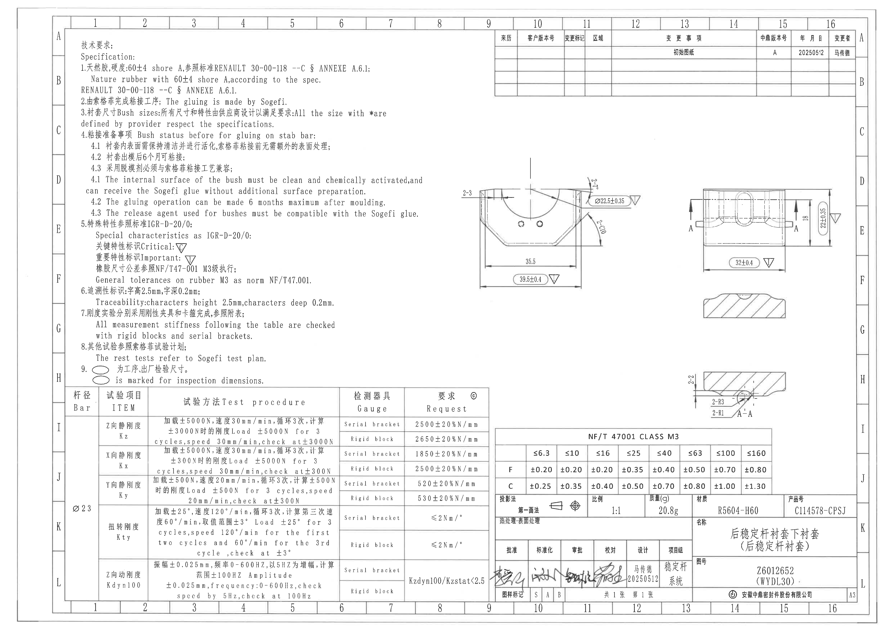
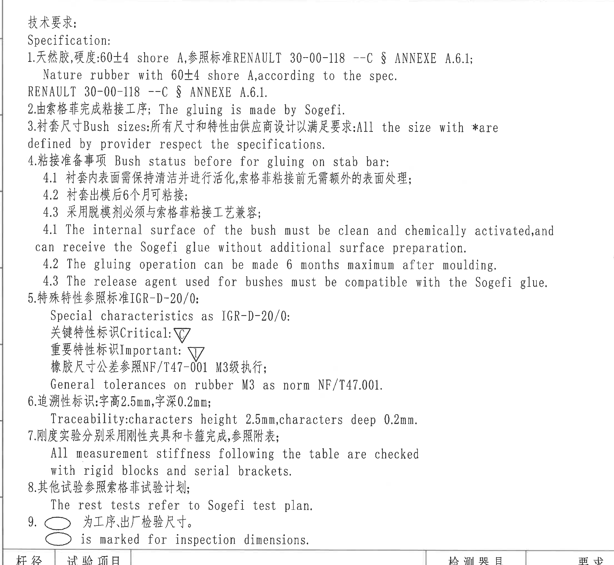
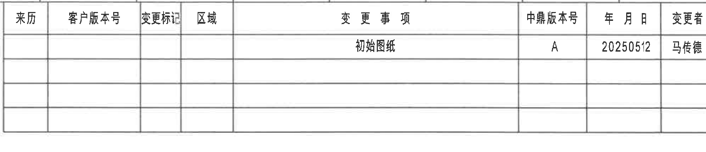
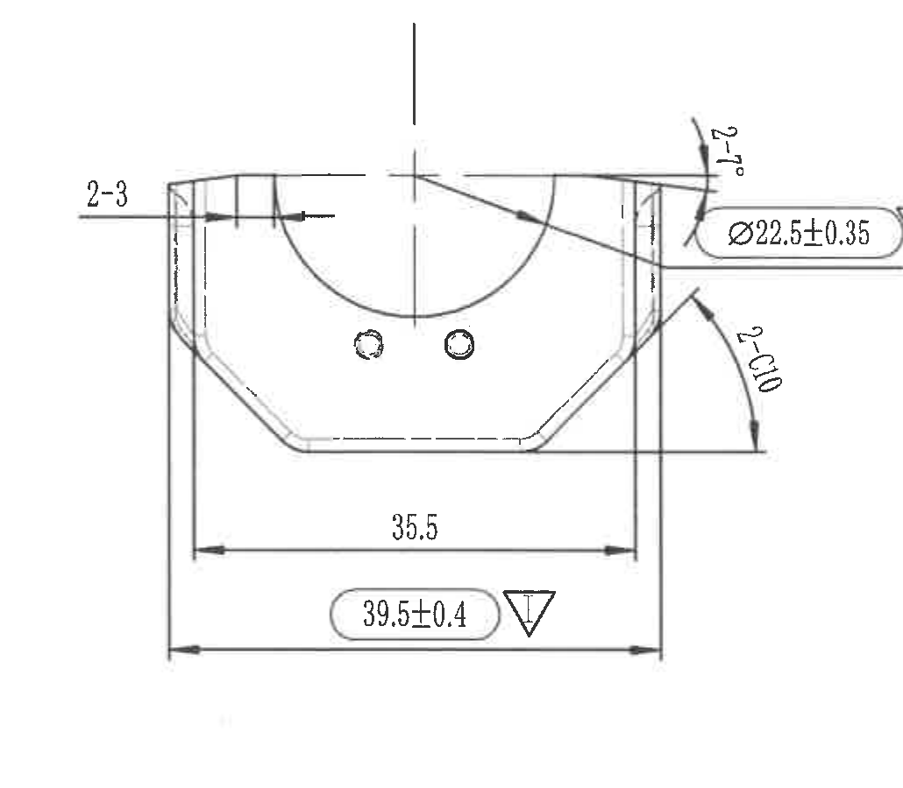
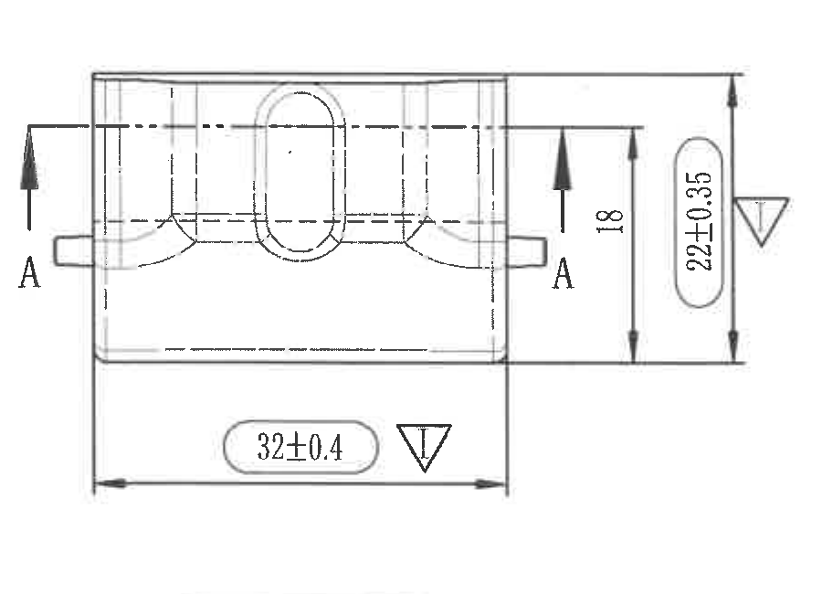
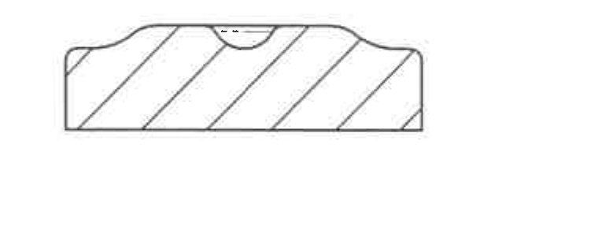
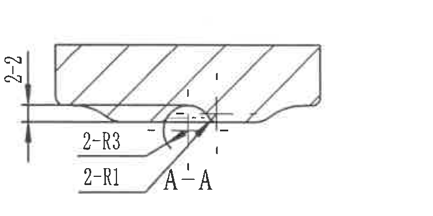
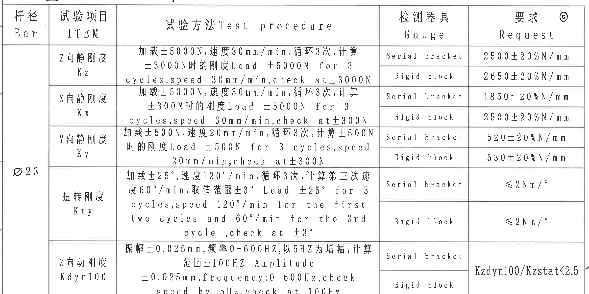
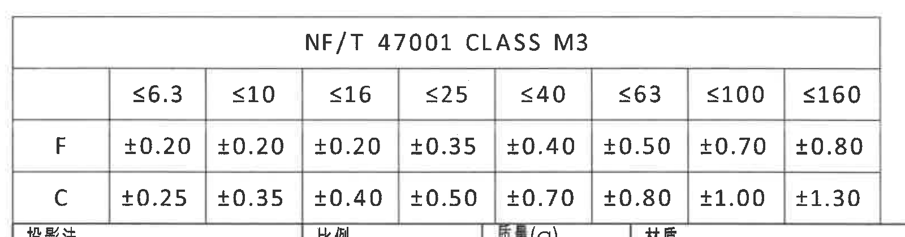
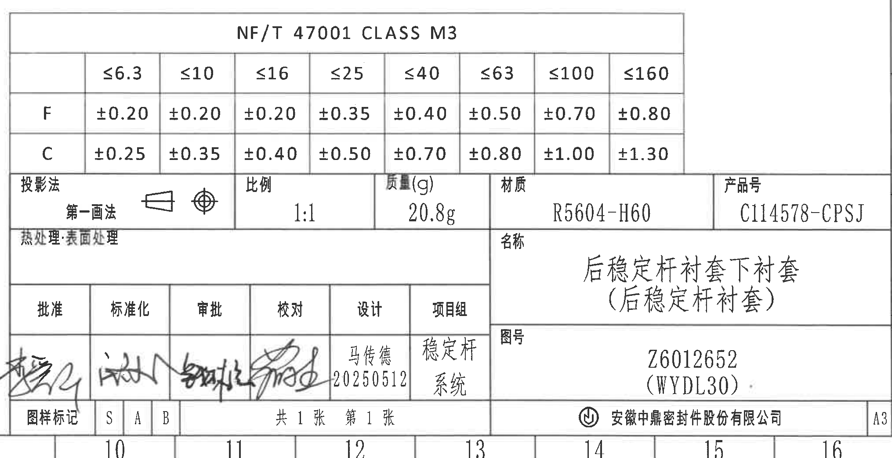

# 20C114578.pdf 内容识别

整页渲染图：`outputs/20C114578_assets/images/page_1.png`  
整页像素：4959 x 3505，以下 bbox 均为该整页 PNG 的像素坐标 `[x0, y0, x1, y1]`。

## object_1：技术要求 / Specification NOTES

原图位置/视图名称：左上至左中 NOTES 区域，bbox `[350, 170, 2560, 2205]`。

### 提取表格

| 提取项 | 原图数值或文本 | 含义说明 |
|---|---|---|
| 标题 | 技术要求；Specification: | 图纸技术要求总说明。 |
| 1 | 天然胶,硬度:60±4 shore A,参照标准 RENAULT 30-00-118 --C § ANNEXE A.6.1; / Nature rubber with 60±4 shore A, according to the spec. RENAULT 30-00-118 --C § ANNEXE A.6.1. | 材料为天然胶，硬度 60±4 Shore A，并按 Renault 标准执行。 |
| 2 | 由索格菲完成粘接工序; The gluing is made by Sogefi. | 粘接工序责任方为 Sogefi。 |
| 3 | 衬套尺寸 Bush sizes:所有尺寸和特性由供应商设计以满足要求: All the size with * are defined by provider respect the specifications. | 带 `*` 的尺寸/特性由供应商定义并满足规范；本图可见加工视图中未出现带星号尺寸。 |
| 4 | 粘接准备事项 Bush status before for gluing on stab bar: | 衬套在稳定杆粘接前的状态要求。 |
| 4.1 | 衬套内表面需保持清洁并进行活化,索格菲粘接前无需额外的表面处理; / The internal surface of the bush must be clean and chemically activated,and can receive the Sogefi glue without additional surface preparation. | 内表面清洁并化学活化后可直接接收 Sogefi 胶。 |
| 4.2 | 衬套出模后6个月可粘接; / The gluing operation can be made 6 months maximum after moulding. | 出模后最长 6 个月内可进行粘接。 |
| 4.3 | 采用脱模剂必须与索格菲粘接工艺兼容; / The release agent used for bushes must be compatible with the Sogefi glue. | 脱模剂必须与 Sogefi 胶兼容。 |
| 5 | 特殊特性参照标准 IGR-D-20/0; Special characteristics as IGR-D-20/0: | 特殊特性标识标准。 |
| 5-关键特性 | 关键特性标识 Critical: 倒三角 C | 倒三角内 `C` 表示关键特性。 |
| 5-重要特性 | 重要特性标识 Important: 倒三角 I | 倒三角内 `I` 表示重要特性。 |
| 5-公差 | 橡胶尺寸公差参照 NF/T47-001 M3级执行; / General tolerances on rubber M3 as norm NF/T47.001. | 橡胶一般尺寸公差采用 NF/T 47001 CLASS M3，详见 object_8。 |
| 6 | 追溯性标识:字高2.5mm,字深0.2mm; / Traceability: characters height 2.5mm,characters deep 0.2mm. | 追溯字符高度 2.5 mm、深度 0.2 mm。 |
| 7 | 刚度实验分别采用刚性夹具和卡箍完成,参照附表; / All measurement stiffness following the table are checked with rigid blocks and serial brackets. | 刚度测试用刚性块和卡箍，详见 object_2。 |
| 8 | 其他试验参照索格菲试验计划; / The rest tests refer to Sogefi test plan. | 其他试验按 Sogefi 试验计划。 |
| 9 | 椭圆标记 为工序、出厂检验尺寸。 / oval is marked for inspection dimensions. | 图中椭圆圈出的尺寸为工序/出厂检验尺寸。 |

边界归属说明：NOTES 下边界为完整包含第 9 条英文说明而下移，底部可见左下试验表表头上沿；该表头归属 object_2，不作为 NOTES 提取内容。右侧靠近主视图的 `2-3` 标注归属 object_4，不归入 NOTES。

## object_3：右上修订履历表 / 变更事项表

原图位置/视图名称：右上修订履历表，bbox `[2735, 160, 4725, 590]`。

### 原表还原

| 来历 | 客户版本号 | 变更标记 | 区域 | 变更事项 | 中鼎版本号 | 年月日 | 变更者 |
|---|---|---|---|---|---|---|---|
|  |  |  |  | 初始图纸 | A | 20250512 | 马传德 |
|  |  |  |  |  |  |  |  |
|  |  |  |  |  |  |  |  |
|  |  |  |  |  |  |  |  |

### 提取表格

| 提取项 | 原图数值或文本 | 含义说明 |
|---|---|---|
| 变更事项 | 初始图纸 | 首次发布/初始图纸记录。 |
| 中鼎版本号 | A | 内部版本号。 |
| 年月日 | 20250512 | 变更日期。 |
| 变更者 | 马传德 | 变更责任人。 |

边界归属说明：右侧外图框线未作为表格字段提取；表格空白行按原图保留为空行。

## object_4：中右左侧主加工视图 / 正面轮廓视图

原图位置/视图名称：中右偏左主加工视图，bbox `[2470, 850, 3500, 1750]`。

### 提取表格

| 提取项 | 原图数值或文本 | 含义说明 |
|---|---|---|
| 数量前缀尺寸 | 2-3 | 图面写作 `2-3`，数量前缀为 2，引线/箭头指向左侧上部局部结构，表示两处相同 3 尺寸/结构。 |
| 直径尺寸 | Ø22.5±0.35 | 带直径符号的尺寸，公差 ±0.35；标注线连接本视图上部凹口/孔相关位置。 |
| 角度 | 2-7° | 两处 7° 角度要求，位于右上弧形/侧壁过渡附近。 |
| 弧向/倒角尺寸 | 2-C10 | 两处 C10 倒角/过渡标注，箭头指向右侧斜边与侧壁区域。 |
| 宽度尺寸 | 35.5 | 下方内侧宽度尺寸，无显式公差，按 general tolerance 执行。 |
| 总宽关键尺寸 | 39.5±0.4 | 下方总宽，椭圆圈出并带倒三角 `I`，为重要/检验尺寸，公差 ±0.4。 |
| 特性标识 | 倒三角 I | 重要特性标识，含义见 NOTES 第 5 条。 |
| 参考尺寸 | 未见括号内参考尺寸 | 本视图未出现括号参考尺寸。 |
| 基准字母 | 未见 | 本视图未标出基准字母。 |
| T 编号 | 未见 | 本视图未出现 T 编号。 |

边界归属说明：左侧 `2-3` 靠近 NOTES 区域，但完整引线、箭头和指向结构均在本主视图内，归属本对象。右侧 `Ø22.5±0.35`、`2-7°`、`2-C10` 的引线均连接本视图右侧轮廓，不归入 object_5。

## object_5：右侧主加工视图 / A-A 剖切指示视图

原图位置/视图名称：右侧 D-E/F 区主视图，bbox `[3800, 970, 4700, 1620]`。

### 提取表格

| 提取项 | 原图数值或文本 | 含义说明 |
|---|---|---|
| 剖切标记 | A-A | 左右两侧剖切箭头标记，指示 A-A 剖面位置。 |
| 高度尺寸 | 18 | 内部高度尺寸，位于右侧内侧竖向尺寸线。 |
| 总高度尺寸 | 22±0.35 | 外侧总高度尺寸，椭圆圈出，公差 ±0.35。 |
| 宽度关键尺寸 | 32±0.4 | 下方宽度尺寸，椭圆圈出并带倒三角 `I`，公差 ±0.4。 |
| 特性标识 | 倒三角 I | 重要特性/检验尺寸标识。 |
| 参考尺寸 | 未见括号内参考尺寸 | 本视图未出现括号参考尺寸。 |
| T 编号 | 未见 | 本视图未出现 T 编号。 |

边界归属说明：下方横截面剖视图另裁为 object_6；本对象只提取上方主视图及其 A-A、18、22±0.35、32±0.4。右侧图框坐标栏不属于本对象。

## object_6：右侧主视图下方横截面剖视图

原图位置/视图名称：object_5 下方横截面剖视图，bbox `[3820, 1600, 4580, 1910]`。

### 提取表格

| 提取项 | 原图数值或文本 | 含义说明 |
|---|---|---|
| 剖面形状 | 剖面线、上方中央浅半圆/槽形凹口、左右上缘台阶/圆角过渡 | 表示橡胶实体横截面。 |
| 尺寸标注 | 未见独立尺寸文字 | 本剖面图中未标出独立尺寸线或文字。 |
| 参考尺寸 | 未见括号内参考尺寸 | 本剖面图未出现括号参考尺寸。 |
| 基准字母/T 编号 | 未见 | 本剖面图未出现基准字母或 T 编号。 |

边界归属说明：该剖面与 object_5 距离较近，但无尺寸线连接；object_5 的 `18`、`22±0.35`、`32±0.4` 不重复归入此剖面。

## object_7：局部剖视图 A-A

原图位置/视图名称：右中下 H 区局部剖视图，bbox `[3810, 1990, 4550, 2360]`。

### 提取表格

| 提取项 | 原图数值或文本 | 含义说明 |
|---|---|---|
| 剖面名称/基准字母 | A-A | 与 object_5 的 A-A 剖切标记对应。 |
| 数量前缀尺寸 | 2-2 | 图面写作 `2-2`，表示两处 2 尺寸/厚度要求，标注位于左侧竖向尺寸线。 |
| 圆角 | 2-R3 | 两处 R3 圆角，箭头指向局部凹槽/过渡圆角。 |
| 圆角 | 2-R1 | 两处 R1 圆角，箭头指向相邻局部小圆角。 |
| 参考尺寸 | 未见括号内参考尺寸 | 本局部剖视图未出现括号参考尺寸。 |
| T 编号 | 未见 | 本局部剖视图未出现 T 编号。 |

边界归属说明：`2-2`、`2-R3`、`2-R1` 的引线均指向 A-A 局部剖视图；底部标题栏边线已排除，不提取标题栏内容。

## object_2：Ø23 杆径试验项目表

原图位置/视图名称：左下试验项目表，bbox `[350, 2130, 2730, 3320]`。

### 原表还原

| 杆径 Bar | 试验项目 ITEM | 试验方法 Test procedure | 检测器具 Gauge | 要求 Request |
|---|---|---|---|---|
| Ø23 | Z向静刚度 Kz | 加载±5000N,速度30mm/min,循环3次,计算±3000N时的刚度 Load ±5000N for 3 cycles,speed 30mm/min,check at±3000N | Serial bracket | 2500±20%N/mm |
| Ø23 | Z向静刚度 Kz | 同上 | Rigid block | 2650±20%N/mm |
| Ø23 | X向静刚度 Kx | 加载±5000N,速度30mm/min,循环3次,计算±300N时的刚度 Load ±5000N for 3 cycles,speed 30mm/min,check at±300N | Serial bracket | 1850±20%N/mm |
| Ø23 | X向静刚度 Kx | 同上 | Rigid block | 2500±20%N/mm |
| Ø23 | Y向静刚度 Ky | 加载±500N,速度20mm/min,循环3次,计算±500N时的刚度 Load ±500N for 3 cycles,speed 20mm/min,check at±300N | Serial bracket | 520±20%N/mm |
| Ø23 | Y向静刚度 Ky | 同上 | Rigid block | 530±20%N/mm |
| Ø23 | 扭转刚度 Kty | 加载±25°,速度120°/min,循环3次,计算第三次速度60°/min,取值范围±3° Load ±25° for 3 cycles,speed 120°/min for the first two cycles and 60°/min for the 3rd cycle,check at ±3° | Serial bracket | ≤2Nm/° |
| Ø23 | 扭转刚度 Kty | 同上 | Rigid block | ≤2Nm/° |
| Ø23 | Z向动刚度 Kdyn100 | 振幅±0.025mm,频率0-600HZ,以5HZ为增幅,计算范围±100HZ Amplitude ±0.025mm,frequency:0-600Hz,check speed by 5Hz,check at 100Hz | Serial bracket | Kzdyn100/Kzstat<2.5 |
| Ø23 | Z向动刚度 Kdyn100 | 同上 | Rigid block | Kzdyn100/Kzstat<2.5 |

### 提取表格

| 提取项 | 原图数值或文本 | 含义说明 |
|---|---|---|
| 杆径 | Ø23 | 试验对象杆径。 |
| Kz 要求 | Serial bracket: 2500±20%N/mm；Rigid block: 2650±20%N/mm | Z 向静刚度要求。 |
| Kx 要求 | Serial bracket: 1850±20%N/mm；Rigid block: 2500±20%N/mm | X 向静刚度要求。 |
| Ky 要求 | Serial bracket: 520±20%N/mm；Rigid block: 530±20%N/mm | Y 向静刚度要求。 |
| Kty 要求 | Serial bracket: ≤2Nm/°；Rigid block: ≤2Nm/° | 扭转刚度上限要求。 |
| Kdyn100 要求 | Kzdyn100/Kzstat<2.5 | 动静刚度比要求。 |

边界归属说明：表格上缘紧邻 NOTES 第 9 条区域；仅从表头“杆径/试验项目/试验方法/检测器具/要求”起归属本对象。右边界重裁扩展，完整包含最后一列 `Kzdyn100/Kzstat<2.5`，未混入右下标题栏。

## object_8：NF/T 47001 CLASS M3 公差表

原图位置/视图名称：右下标题栏上部左侧公差表，bbox `[2725, 2350, 4325, 2770]`。

### 原表还原

| NF/T 47001 CLASS M3 | ≤6.3 | ≤10 | ≤16 | ≤25 | ≤40 | ≤63 | ≤100 | ≤160 |
|---|---:|---:|---:|---:|---:|---:|---:|---:|
| F | ±0.20 | ±0.20 | ±0.20 | ±0.35 | ±0.40 | ±0.50 | ±0.70 | ±0.80 |
| C | ±0.25 | ±0.35 | ±0.40 | ±0.50 | ±0.70 | ±0.80 | ±1.00 | ±1.30 |

### 提取表格

| 提取项 | 原图数值或文本 | 含义说明 |
|---|---|---|
| 标准等级 | NF/T 47001 CLASS M3 | 与 NOTES 第 5 条“橡胶尺寸公差参照 NF/T47-001 M3级执行”对应。 |
| F 行 | ±0.20, ±0.20, ±0.20, ±0.35, ±0.40, ±0.50, ±0.70, ±0.80 | F 类尺寸段公差。 |
| C 行 | ±0.25, ±0.35, ±0.40, ±0.50, ±0.70, ±0.80, ±1.00, ±1.30 | C 类尺寸段公差。 |

边界归属说明：该表与标题栏外框相连，但表格自身有独立行列；标题栏字段另归 object_9。

## object_9：右下标题栏 / Title block

原图位置/视图名称：右下标题栏，bbox `[2725, 2350, 4755, 3395]`。

### 提取表格

| 提取项 | 原图数值或文本 | 含义说明 |
|---|---|---|
| 投影法 | 第一画法 | 投影方式。 |
| 比例 | 1:1 | 图纸比例。 |
| 质量(g) | 20.8g | 零件质量。 |
| 材质 | R5604-H60 | 材料牌号。 |
| 产品号 | C114578-CPSJ | 产品编号。 |
| 热处理/表面处理 | 热处理: 表面处理 | 对应处理栏，图面未填写具体处理参数。 |
| 名称 | 后稳定杆衬套下衬套（后稳定杆衬套） | 零件名称。 |
| 图号 | Z6012652 (WYDL30) | 图纸编号/括号内代号。 |
| 批准 | 签名 | 签署栏，手写签名。 |
| 标准化 | 签名 | 签署栏，手写签名。 |
| 审批 | 签名 | 签署栏，手写签名。 |
| 校对 | 签名 | 签署栏，手写签名。 |
| 设计 | 马传德 20250512 | 设计人和日期。 |
| 项目组 | 稳定杆系统 | 项目组信息。 |
| 图样标记 | S A B | 图样标记栏。 |
| 张数 | 共1张 第1张 | 总页数和当前页。 |
| 公司 | 安徽中鼎密封件股份有限公司 | 出图/公司名称。 |
| 图幅 | A3 | 图幅规格。 |

边界归属说明：标题栏裁切包含上方公差表区域，但公差表已作为 object_8 单独提取；本对象只提取标题栏字段。底部可见图框坐标数字 10-16，属于整页坐标栏，不作为标题栏字段。

## 裁切检查记录

| 对象 | 图片路径 | 检查结果 | 边界/重裁记录 |
|---|---|---|---|
| page_1 | `outputs/20C114578_assets/images/page_1.png` | 完整 | 整页 300 DPI PNG，4959 x 3505。 |
| object_1 | `outputs/20C114578_assets/images/object_1_notes.png` | 完整包含 NOTES 文字 | 初裁第 9 条英文行被下边缘截断，已向下重裁；底部试验表表头只作为相邻边界，不提取。 |
| object_2 | `outputs/20C114578_assets/images/object_2_test_table.png` | 完整包含表格外框、列名、行内容和右侧要求列 | 右边界初裁贴近 `Kzdyn100/Kzstat<2.5`，已向右扩裁。 |
| object_3 | `outputs/20C114578_assets/images/object_3_revision_table.png` | 完整包含修订表表头、首行记录和空白行 | 右侧外图框线未作为表格字段提取。 |
| object_4 | `outputs/20C114578_assets/images/object_4_left_view.png` | 完整包含尺寸线、箭头和文字 | 左侧 `2-3` 初裁贴边，最终向左扩裁；该标注归属本主视图。 |
| object_5 | `outputs/20C114578_assets/images/object_5_right_view.png` | 完整包含主视图尺寸和 A-A 剖切标记 | 下方剖面图分离为 object_6，避免混入。 |
| object_6 | `outputs/20C114578_assets/images/object_6_upper_section.png` | 完整包含横截面剖面线和轮廓 | 无独立尺寸文字；不提取 object_5 尺寸。 |
| object_7 | `outputs/20C114578_assets/images/object_7_section_AA.png` | 完整包含 `2-2`、`2-R3`、`2-R1`、`A-A` | 初裁底部接近标题栏边线，最终上收，标题栏不混入。 |
| object_8 | `outputs/20C114578_assets/images/object_8_tolerance_table.png` | 完整包含 NF/T 47001 CLASS M3 表格 | 与标题栏相连但行列完整，字段单独归属公差表。 |
| object_9 | `outputs/20C114578_assets/images/object_9_title_block.png` | 完整包含标题栏字段、签署区、名称、图号、公司和 A3 | 底部图框坐标数字不作为标题栏字段；上方公差表另归 object_8。 |
