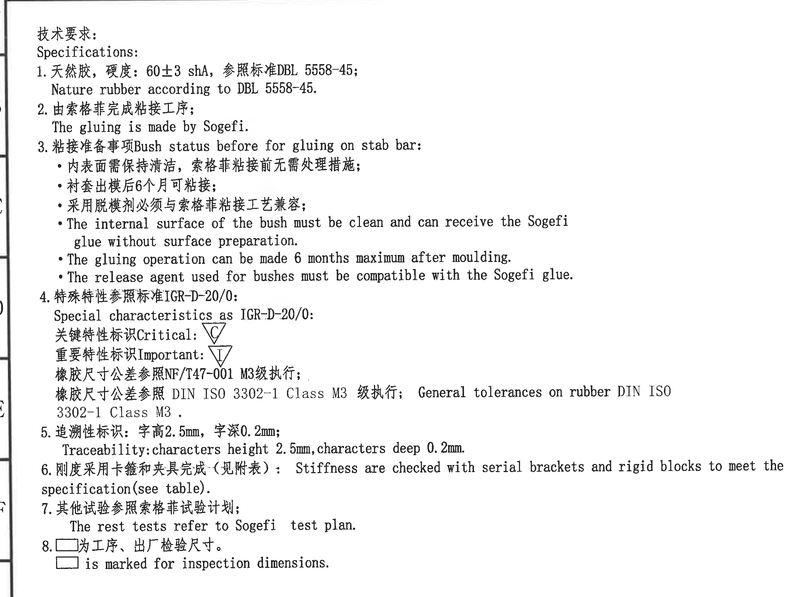
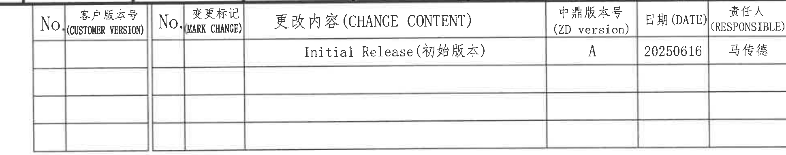
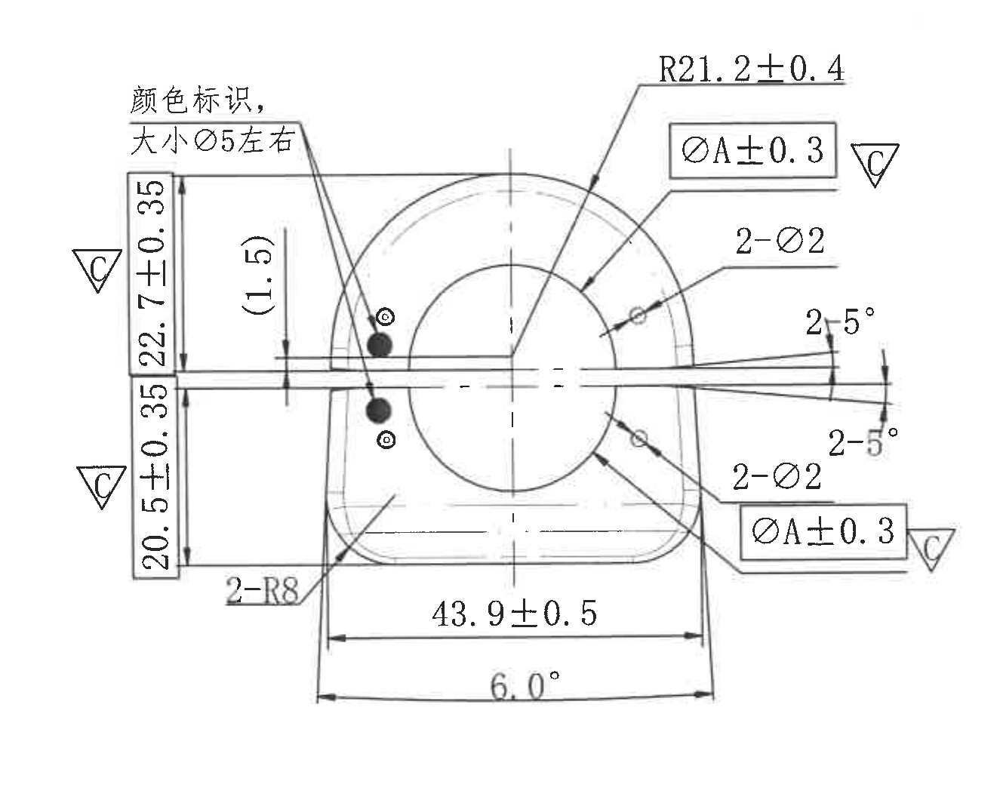
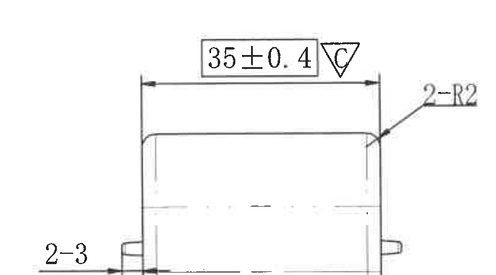
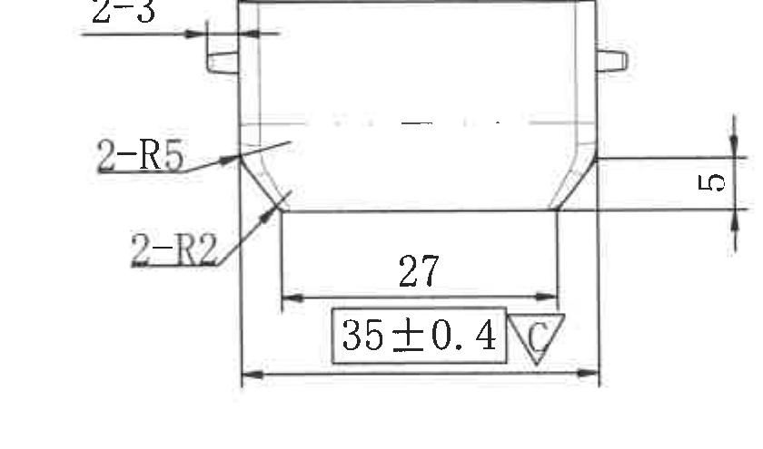
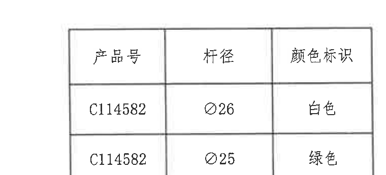
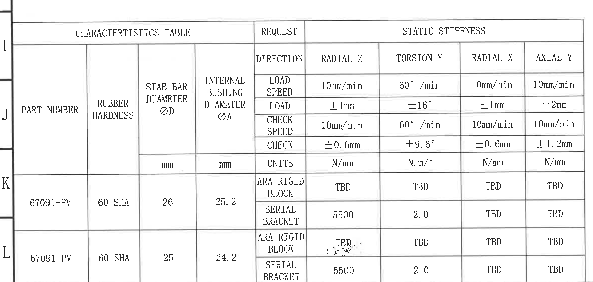
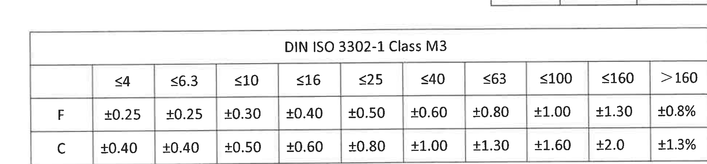
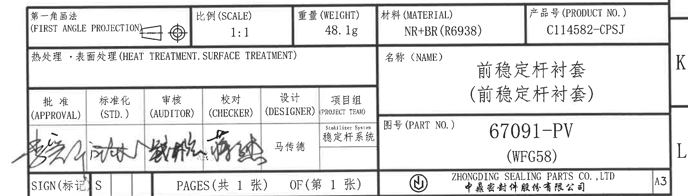

# 20C114582.pdf 内容识别结果

整页渲染图：`outputs/20C114582_assets/images/page_1.png`，页面尺寸 4959 x 3505 px。未识别到独立剖面视图或局部放大视图；本页包含技术要求、修订履历、主视图、两个侧向加工视图、产品颜色表、特性/刚度表、公差表和标题栏。

## object_1 - NOTES / 技术要求

原图位置/视图名称：Page 1，左上技术要求区，bbox `[350, 180, 2500, 1800]`。

| 提取项 | 原图数值或文本 | 含义说明 |
|---|---|---|
| 标题 | 技术要求；Specifications | 本区域为图纸通用技术要求和检验说明。 |
| 1 | 天然胶，硬度：60±3 shA，参照标准 DBL 5558-45；Nature rubber according to DBL 5558-45. | 材料为天然橡胶，硬度公差为 60±3 Shore A，执行 DBL 5558-45。 |
| 2 | 由索格菲完成粘接工序；The gluing is made by Sogefi. | 粘接工序由 Sogefi 完成。 |
| 3 标题 | 粘接准备事项 Bush status before for gluing on stab bar | 粘接到稳定杆前的衬套状态要求。 |
| 3-1 | 内表面需保持清洁，索格菲粘接前无需处理措施 | 内表面清洁即可进入 Sogefi 粘接流程。 |
| 3-2 | 衬套出模后 6 个月可粘接 | 出模后最大 6 个月内允许粘接。 |
| 3-3 | 采用脱模剂必须与索格菲粘接工艺兼容 | 脱模剂不能影响 Sogefi 胶粘工艺。 |
| 3-4 | The internal surface of the bush must be clean and can receive the Sogefi glue without surface preparation. | 英文重复说明内表面清洁即可，无需表面预处理。 |
| 3-5 | The gluing operation can be made 6 months maximum after moulding. | 英文重复说明出模后最长 6 个月内粘接。 |
| 3-6 | The release agent used for bushes must be compatible with the Sogefi glue. | 英文重复说明脱模剂需与 Sogefi 胶兼容。 |
| 4 | 特殊特性参照标准 IGR-D-20/0；Special characteristics as IGR-D-20/0 | 特殊特性标识按 IGR-D-20/0。 |
| 4 关键特性 | 关键特性标识 Critical：倒三角 C | 图中带倒三角 C 的尺寸为关键特性。 |
| 4 重要特性 | 重要特性标识 Important：倒三角 I | 图中带倒三角 I 的项目为重要特性。 |
| 4 橡胶尺寸公差 | 橡胶尺寸公差参照 NF/T47-001 M3 级执行 | 橡胶件尺寸公差执行 NF/T47-001 M3。 |
| 4 通用公差 | 橡胶尺寸公差参照 DIN ISO 3302-1 Class M3 级执行；General tolerances on rubber DIN ISO 3302-1 Class M3. | 橡胶通用公差还引用 DIN ISO 3302-1 Class M3。 |
| 5 | 追溯性标识：字高 2.5mm，字深 0.2mm；Traceability: characters height 2.5mm, characters deep 0.2mm. | 追溯字符的高度和压/刻深要求。 |
| 6 | 刚度采用卡箍和夹具完成（见附表）；Stiffness are checked with serial brackets and rigid blocks to meet the specification (see table). | 静刚度检验用串联支架和刚性块，要求见底部刚度表。 |
| 7 | 其他试验参照索格菲试验计划；The rest tests refer to Sogefi test plan. | 其他测试按 Sogefi 测试计划。 |
| 8 | □ 为工序、出厂检验尺寸；□ is marked for inspection dimensions. | 方框包围的尺寸为工序/出厂检验尺寸。 |

边界归属说明：裁切区只提取左上 NOTES/技术要求文字。右侧主视图尺寸虽靠近 NOTES 区域，但未纳入本对象提取；左侧图框坐标字母仅为图框边界参考，不作为 NOTES 内容。

## object_2 - 修订履历表

原图位置/视图名称：Page 1，右上修订履历表，bbox `[2790, 155, 4730, 540]`。

原表还原：

| No. | 客户版本号 (CUSTOMER VERSION) | No. | 变更标记 (MARK CHANGE) | 更改内容 (CHANGE CONTENT) | 中鼎版本号 (ZD version) | 日期 (DATE) | 责任人 (RESPONSIBLE) |
|---|---|---|---|---|---|---|---|
|  |  |  |  | Initial Release(初始版本) | A | 20250616 | 马传德 |
|  |  |  |  |  |  |  |  |
|  |  |  |  |  |  |  |  |
|  |  |  |  |  |  |  |  |

| 提取项 | 原图数值或文本 | 含义说明 |
|---|---|---|
| 表头 | No.; 客户版本号 (CUSTOMER VERSION); No.; 变更标记 (MARK CHANGE); 更改内容 (CHANGE CONTENT); 中鼎版本号 (ZD version); 日期 (DATE); 责任人 (RESPONSIBLE) | 修订履历的列标题。 |
| 修订记录 | Initial Release(初始版本) | 初始发布版本。 |
| 中鼎版本号 | A | 当前中鼎版本为 A。 |
| 日期 | 20250616 | 修订日期为 2025-06-16。 |
| 责任人 | 马传德 | 该修订记录责任人。 |

边界归属说明：裁切包含修订履历表完整表头、首条修订记录和空白记录行。未提取右侧图框坐标字母内容。

## object_3 - 主视图 / 正面加工视图

原图位置/视图名称：Page 1，中右主视图，bbox `[2500, 685, 3825, 1745]`。

| 提取项 | 原图数值或文本 | 含义说明 |
|---|---|---|
| 颜色标识说明 | 颜色标识，大小 Ø5 左右 | 主视图左上指向两个颜色点，颜色点直径约 Ø5。 |
| 上半竖向尺寸 | 22.7±0.35，方框，C | 中心线至上侧边界的竖向尺寸；带方框为工序/出厂检验尺寸，倒三角 C 为关键特性。 |
| 下半竖向尺寸 | 20.5±0.35，方框，C | 中心线至下侧边界的竖向尺寸；带方框为检验尺寸，倒三角 C 为关键特性。 |
| 参考尺寸 | (1.5) | 括号内参考尺寸，位于左侧中心线附近，用于说明局部间距/偏置关系，不作为主检验公差尺寸。 |
| 上部弧半径 | R21.2±0.4 | 上部外圆弧半径及公差。 |
| 内衬套直径标注 1 | ØA±0.3，方框，C | 指向内孔/内衬套圆形轮廓的直径代号 A 及公差；方框为检验尺寸，C 为关键特性。 |
| 内衬套直径标注 2 | ØA±0.3，方框，C | 主视图下右侧重复标注的内衬套直径代号 A 及公差；归属主视图。 |
| 小孔/标记尺寸 1 | 2-Ø2 | 上右侧两个 Ø2 特征。数量前缀 2 表示两处。 |
| 小孔/标记尺寸 2 | 2-Ø2 | 下右侧两个 Ø2 特征。数量前缀 2 表示两处。 |
| 右侧上斜角 | 2-5° | 右侧槽/开口上侧两处 5° 角度。 |
| 右侧下斜角 | 2-5° | 右侧槽/开口下侧两处 5° 角度。 |
| 下部圆角 | 2-R8 | 下部两处 R8 圆角/弧半径。 |
| 下部水平宽度 | 43.9±0.5 | 底部两侧间的水平尺寸及公差。 |
| 底部角度 | 6.0° | 底部外形两侧的角度/弧向角度标注。 |
| 基准/T 编号 | 未见独立基准字母或 T 编号 | 本主视图内的 A 出现在 ØA 中，是直径代号，不是独立基准框。 |
| 星号关键尺寸 | 未见星号尺寸 | 本主视图关键特性用倒三角 C 标识，未见星号。 |

边界归属说明：裁切保留主视图完整尺寸线、箭头、方框尺寸和倒三角 C。右侧与侧视图相邻，裁切右边界仅保留主视图右侧的 ØA±0.3、2-Ø2、2-5° 标注，不提取侧视图的 2-3、2-R2、2-R5、27、5 等尺寸。

## object_4 - 上侧向加工视图

原图位置/视图名称：Page 1，右侧上方侧向加工视图，bbox `[3800, 685, 4620, 1140]`。

| 提取项 | 原图数值或文本 | 含义说明 |
|---|---|---|
| 顶部水平尺寸 | 35±0.4，方框，C | 上侧视图总宽/长度尺寸；方框为检验尺寸，C 为关键特性。 |
| 右上圆角 | 2-R2 | 两处 R2 圆角，指向右上外角/圆角区域。 |
| 左侧凸台尺寸 | 2-3 | 左侧凸台/耳部两处尺寸 3，数量前缀 2 表示两处。 |
| 隐线/中心线 | 无数值 | 视图中的虚线仅表示内部/中心结构，不单独作为尺寸值。 |
| 基准/T 编号 | 未见独立基准字母或 T 编号 | 本侧视图内无独立基准框和 T 编号。 |

边界归属说明：裁切只保留上侧视图及其 35±0.4、2-R2、2-3 标注。下侧视图的 2-R5、2-R2、5、27、底部 35±0.4 不归入本对象。

## object_5 - 下侧向加工视图

原图位置/视图名称：Page 1，右侧下方侧向加工视图，bbox `[3775, 1190, 4615, 1685]`。

| 提取项 | 原图数值或文本 | 含义说明 |
|---|---|---|
| 左侧凸台尺寸 | 2-3 | 左侧凸台/耳部两处尺寸 3，归属下侧视图。 |
| 斜肩圆角 | 2-R5 | 两处 R5 圆角，指向下侧视图斜肩位置。 |
| 下部过渡圆角 | 2-R2 | 两处 R2 圆角，指向下部过渡位置。 |
| 右侧竖向尺寸 | 5 | 右侧台阶/高度差尺寸。 |
| 内部底部宽度 | 27 | 下部内侧两垂直边之间的宽度。 |
| 底部外宽 | 35±0.4，方框，C | 下侧视图底部外宽/总宽；方框为检验尺寸，C 为关键特性。 |
| 基准/T 编号 | 未见独立基准字母或 T 编号 | 本侧视图内无独立基准框和 T 编号。 |

边界归属说明：裁切保留下侧视图自身轮廓、尺寸线和文字。顶部邻近上侧视图，裁切时已尽量下移边界；顶部残留极少量相邻线条不作为提取内容，所有列出的尺寸均根据箭头和标注文字归属下侧视图。

## object_6 - 产品号/杆径/颜色标识表

原图位置/视图名称：Page 1，右中产品颜色标识表，bbox `[3910, 1875, 4670, 2220]`。

原表还原：

| 产品号 | 杆径 | 颜色标识 |
|---|---|---|
| C114582 | Ø26 | 白色 |
| C114582 | Ø25 | 绿色 |

| 提取项 | 原图数值或文本 | 含义说明 |
|---|---|---|
| 表头 | 产品号；杆径；颜色标识 | 产品号与稳定杆杆径、颜色标识对应关系。 |
| 第 1 行 | C114582；Ø26；白色 | 产品号 C114582 用于 Ø26 杆径时，颜色标识为白色。 |
| 第 2 行 | C114582；Ø25；绿色 | 产品号 C114582 用于 Ø25 杆径时，颜色标识为绿色。 |

边界归属说明：裁切包含完整表格外框、表头和两条数据行。该表独立于右侧视图和标题栏，不将视图尺寸归入表格。

## object_7 - CHARACTERISTICS TABLE / STATIC STIFFNESS

原图位置/视图名称：Page 1，左下特性和静刚度表，bbox `[340, 2205, 2700, 3330]`。

原表还原：

| PART NUMBER | RUBBER HARDNESS | STAB BAR DIAMETER ØD | INTERNAL BUSHING DIAMETER ØA | REQUEST | RADIAL Z | TORSION Y | RADIAL X | AXIAL Y |
|---|---|---|---|---|---|---|---|---|
|  |  |  |  | DIRECTION | RADIAL Z | TORSION Y | RADIAL X | AXIAL Y |
|  |  |  |  | LOAD SPEED | 10mm/min | 60° /min | 10mm/min | 10mm/min |
|  |  |  |  | LOAD | ±1mm | ±16° | ±1mm | ±2mm |
|  |  |  |  | CHECK SPEED | 10mm/min | 60° /min | 10mm/min | 10mm/min |
|  |  |  |  | CHECK | ±0.6mm | ±9.6° | ±0.6mm | ±1.2mm |
|  |  |  |  | UNITS | N/mm | N.m/° | N/mm | N/mm |
| 67091-PV | 60 SHA | 26 | 25.2 | ARA RIGID BLOCK | TBD | TBD | TBD | TBD |
| 67091-PV | 60 SHA | 26 | 25.2 | SERIAL BRACKET | 5500 | 2.0 | TBD | TBD |
| 67091-PV | 60 SHA | 25 | 24.2 | ARA RIGID BLOCK | TBD | TBD | TBD | TBD |
| 67091-PV | 60 SHA | 25 | 24.2 | SERIAL BRACKET | 5500 | 2.0 | TBD | TBD |

| 提取项 | 原图数值或文本 | 含义说明 |
|---|---|---|
| 表标题 | CHARACTERISTICS TABLE；REQUEST；STATIC STIFFNESS | 左侧为零件特性，右侧为静刚度请求和结果/目标值。 |
| PART NUMBER | 67091-PV | 表中两组杆径对应同一零件号。 |
| RUBBER HARDNESS | 60 SHA | 橡胶硬度。 |
| STAB BAR DIAMETER ØD | 26；25 | 稳定杆直径 D，两种规格。 |
| INTERNAL BUSHING DIAMETER ØA | 25.2；24.2 | 内衬套直径 A，对应 ØD=26 和 ØD=25。 |
| RADIAL Z 载荷速度 | 10mm/min | 径向 Z 加载速度。 |
| RADIAL Z 载荷 | ±1mm | 径向 Z 加载位移。 |
| RADIAL Z 检查速度 | 10mm/min | 径向 Z 检查速度。 |
| RADIAL Z 检查 | ±0.6mm | 径向 Z 检查位移。 |
| RADIAL Z 单位 | N/mm | 径向 Z 静刚度单位。 |
| TORSION Y 载荷速度 | 60° /min | 扭转 Y 加载速度。 |
| TORSION Y 载荷 | ±16° | 扭转 Y 加载角度。 |
| TORSION Y 检查速度 | 60° /min | 扭转 Y 检查速度。 |
| TORSION Y 检查 | ±9.6° | 扭转 Y 检查角度。 |
| TORSION Y 单位 | N.m/° | 扭转 Y 静刚度单位。 |
| RADIAL X 载荷/检查 | ±1mm；±0.6mm | 径向 X 加载和检查位移。 |
| AXIAL Y 载荷/检查 | ±2mm；±1.2mm | 轴向 Y 加载和检查位移。 |
| ØD=26, ØA=25.2 ARA RIGID BLOCK | TBD / TBD / TBD / TBD | 刚性块静刚度值待定。 |
| ØD=26, ØA=25.2 SERIAL BRACKET | 5500 / 2.0 / TBD / TBD | 串联支架径向 Z 为 5500，扭转 Y 为 2.0，其余待定。 |
| ØD=25, ØA=24.2 ARA RIGID BLOCK | TBD / TBD / TBD / TBD | 刚性块静刚度值待定。 |
| ØD=25, ØA=24.2 SERIAL BRACKET | 5500 / 2.0 / TBD / TBD | 串联支架径向 Z 为 5500，扭转 Y 为 2.0，其余待定。 |

边界归属说明：裁切包含底部左侧整张特性/静刚度表。右侧 DIN ISO 公差表和标题栏属于其他对象，未归入本表。

## object_8 - DIN ISO 3302-1 Class M3 公差表

原图位置/视图名称：Page 1，右下 DIN ISO 3302-1 Class M3 公差表，bbox `[2705, 2225, 4640, 2675]`。

原表还原：

|  | ≤4 | ≤6.3 | ≤10 | ≤16 | ≤25 | ≤40 | ≤63 | ≤100 | ≤160 | >160 |
|---|---|---|---|---|---|---|---|---|---|---|
| F | ±0.25 | ±0.25 | ±0.30 | ±0.40 | ±0.50 | ±0.60 | ±0.80 | ±1.00 | ±1.30 | ±0.8% |
| C | ±0.40 | ±0.40 | ±0.50 | ±0.60 | ±0.80 | ±1.00 | ±1.30 | ±1.60 | ±2.0 | ±1.3% |

| 提取项 | 原图数值或文本 | 含义说明 |
|---|---|---|
| 表标题 | DIN ISO 3302-1 Class M3 | 橡胶通用尺寸公差表。 |
| 尺寸分档 | ≤4, ≤6.3, ≤10, ≤16, ≤25, ≤40, ≤63, ≤100, ≤160, >160 | 按标称尺寸范围分档。 |
| F 行 | ±0.25, ±0.25, ±0.30, ±0.40, ±0.50, ±0.60, ±0.80, ±1.00, ±1.30, ±0.8% | F 等级在各尺寸范围下的允许公差。 |
| C 行 | ±0.40, ±0.40, ±0.50, ±0.60, ±0.80, ±1.00, ±1.30, ±1.60, ±2.0, ±1.3% | C 等级在各尺寸范围下的允许公差。 |

边界归属说明：裁切完整包含公差表外框、标题、列标题和 F/C 两行。下方标题栏为独立对象，不纳入本表提取。

## object_9 - 标题栏

原图位置/视图名称：Page 1，右下标题栏，bbox `[2685, 2715, 4825, 3325]`。

| 提取项 | 原图数值或文本 | 含义说明 |
|---|---|---|
| 投影法 | 第一角画法；FIRST ANGLE PROJECTION | 图纸采用第一角投影法。 |
| 比例 | 1:1 | 图纸比例。 |
| 重量 | 48.1g | 零件重量。 |
| 材料 | NR+BR(R6938) | 材料为 NR+BR，牌号/配方 R6938。 |
| 产品号 | C114582-CPSJ | 产品编号。 |
| 热处理/表面处理 | 热处理·表面处理 (HEAT TREATMENT. SURFACE TREATMENT)；内容空白 | 未填写具体热处理或表面处理内容。 |
| 名称 | 前稳定杆衬套（前稳定杆衬套） | 零件名称。 |
| 图号 | 67091-PV；(WFG58) | Part No. / 图号。 |
| 批准 | 签名图形 | 批准签署栏，签名手写不可可靠转写。 |
| 标准化 | 签名图形 | 标准化签署栏，签名手写不可可靠转写。 |
| 审核 | 签名图形 | 审核签署栏，签名手写不可可靠转写。 |
| 校对 | 签名图形 | 校对签署栏，签名手写不可可靠转写。 |
| 设计 | 马传德 | 设计人员。 |
| 项目组 | Stabilizer System；稳定杆系统 | 项目组/系统名称。 |
| SIGN | SIGN(标记)；S | 标记栏值为 S。 |
| 页数 | PAGES(共 1 张)；OF(第 1 张) | 共 1 张，第 1 张。 |
| 公司 | ZHONGDING SEALING PARTS CO., LTD；中鼎密封件股份有限公司 | 出图公司。 |
| 图幅 | A3 | 图纸幅面。 |

边界归属说明：裁切只包含标题栏主体。上方 DIN ISO 公差表已作为 object_8 单独提取，标题栏不重复提取公差表内容。

## 裁切检查记录

| 对象 | 图片路径 | 检查结果 | 边界和归属检查 |
|---|---|---|---|
| object_1 | outputs/20C114582_assets/images/object_1.png | 完整 | NOTES 文字完整包含，未截断第 6 条英文长句和第 8 条方框说明；未提取右侧主视图尺寸。 |
| object_2 | outputs/20C114582_assets/images/object_2.png | 完整 | 修订履历表表头、首条记录、日期和责任人完整；未把右侧图框坐标作为表格内容。 |
| object_3 | outputs/20C114582_assets/images/object_3.png | 完整 | 主视图尺寸线、箭头、文字、方框和 C 符号完整；未归入右侧侧视图尺寸。 |
| object_4 | outputs/20C114582_assets/images/object_4.png | 完整 | 上侧视图 35±0.4、2-R2、2-3 完整；下侧视图尺寸未提取到本对象。 |
| object_5 | outputs/20C114582_assets/images/object_5.png | 完整 | 下侧视图 2-3、2-R5、2-R2、5、27、35±0.4 完整；顶部残留线不作为提取内容，尺寸归属按箭头判断为下侧视图。 |
| object_6 | outputs/20C114582_assets/images/object_6.png | 完整 | 产品颜色表三列表头和两行数据完整，右侧外框未截断。 |
| object_7 | outputs/20C114582_assets/images/object_7.png | 完整 | 特性/静刚度表表头、请求行、单位行和两组数据完整；未混入右侧公差表。 |
| object_8 | outputs/20C114582_assets/images/object_8.png | 完整 | DIN ISO 公差表标题、所有尺寸分档、F/C 两行和右侧 >160 列完整；未混入标题栏字段。 |
| object_9 | outputs/20C114582_assets/images/object_9.png | 完整 | 标题栏主体完整包含投影法、比例、重量、材料、产品号、名称、图号、签署栏、页数、公司和 A3；未重复提取上方公差表。 |
