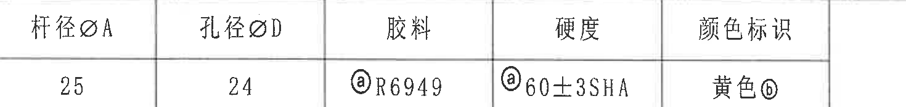
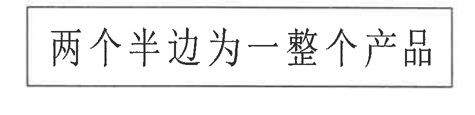
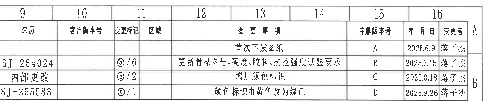
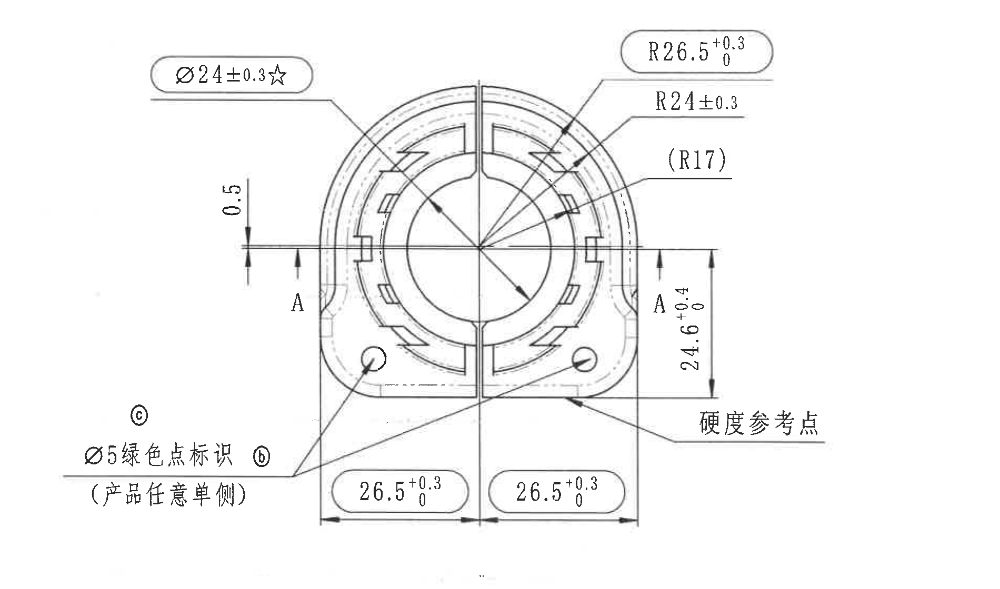
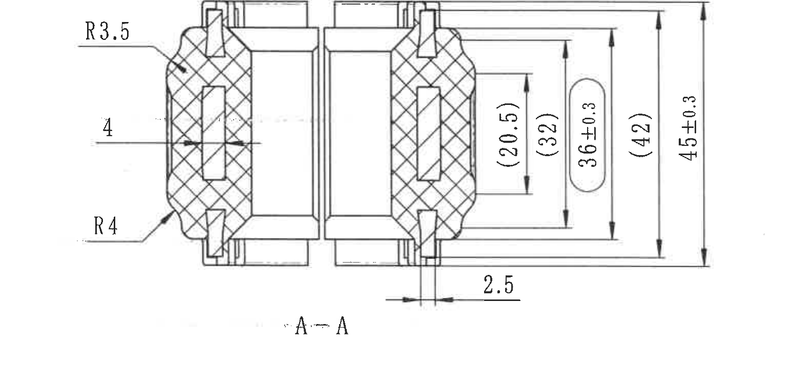
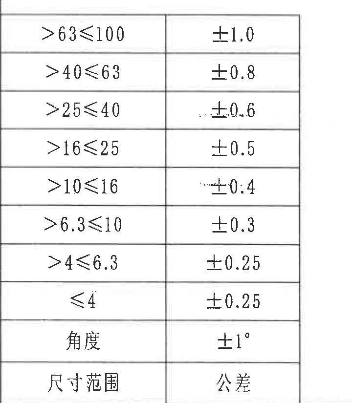
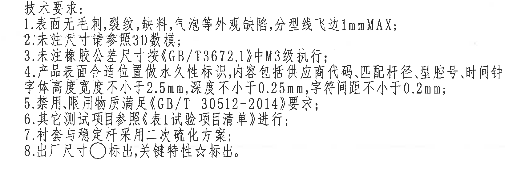
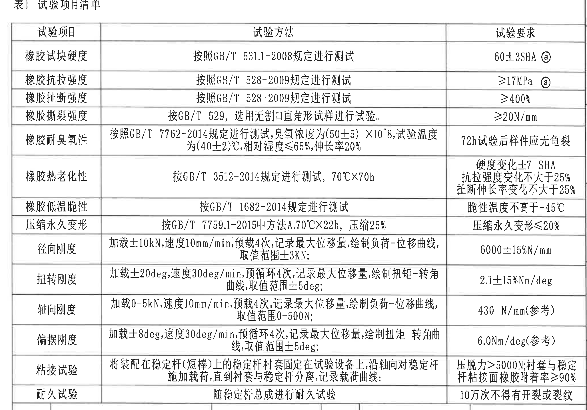
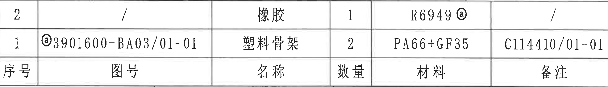
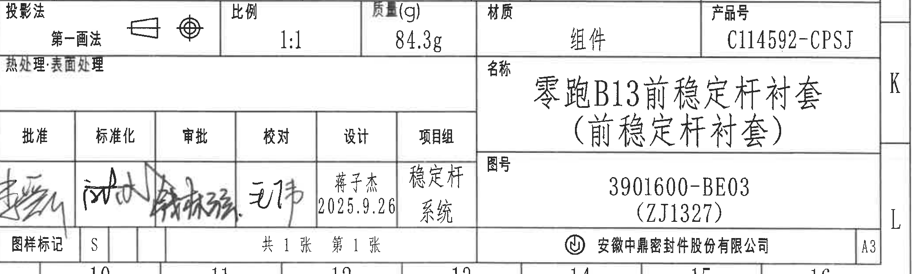

# 20C114592 PDF 内容识别

整页渲染图：`20C114592_assets/images/page_1.png`  
原图页码：1；整页像素：4959 x 3505；坐标系：左上角为 `[0,0]`，bbox 为 `[x1,y1,x2,y2]`。

## object_1 顶部参数表

原图位置/视图名称：第 1 页左上顶部参数表，bbox `[395,170,1865,345]`。

原表还原：

| 杆径øA | 孔径øD | 胶料 | 硬度 | 颜色标识 |
|---|---|---|---|---|
| 25 | 24 | ⓐ R6949 | ⓐ 60±3SHA | 黄色ⓑ |

提取表格：

| 提取项 | 原图数值或文本 | 含义说明 |
|---|---|---|
| 杆径 | 杆径øA = 25 | 对应稳定杆或装配杆的名义直径 A。 |
| 孔径 | 孔径øD = 24 | 对应衬套孔径 D。 |
| 胶料 | ⓐ R6949 | 胶料代号，带变更标记 ⓐ。 |
| 硬度 | ⓐ 60±3SHA | 橡胶硬度要求，公差 ±3 SHA，带变更标记 ⓐ。 |
| 颜色标识 | 黄色ⓑ | 原参数表颜色标识为黄色，带变更标记 ⓑ；修订履历中有后续改绿记录。 |

边界归属说明：裁切只包含参数表本体；上方图框列号 1-5 已排除。表中所有文字和表格线完整。

## object_2 局部文本框

原图位置/视图名称：第 1 页上部居中文本框，bbox `[1580,385,2530,615]`。

提取表格：

| 提取项 | 原图数值或文本 | 含义说明 |
|---|---|---|
| 装配说明 | 两个半边为一整个产品 | 说明零件由两个半边组成，作为一个完整产品使用或交付。 |

边界归属说明：文本框四边完整，未引入相邻表格或视图片段。

## object_3 修订履历表

原图位置/视图名称：第 1 页右上修订履历表，bbox `[2625,75,4875,545]`。

原表还原：

| 来历 | 客户版本号 | 变更标记 | 区域 | 变更事项 | 中鼎版本号 | 年月日 | 变更者 |
|---|---|---|---|---|---|---|---|
|  |  |  |  | 首次下发图纸 | A | 2025.6.9 | 蒋子杰 |
| SJ-254024 |  | ⓐ/6 |  | 更新骨架图号、硬度、胶料、抗拉强度试验要求 | B | 2025.7.15 | 蒋子杰 |
| 内部更改 |  | ⓑ/2 |  | 增加颜色标识 | C | 2025.8.18 | 蒋子杰 |
| SJ-255583 |  | ⓒ/1 |  | 颜色标识由黄色改为绿色 | D | 2025.9.26 | 蒋子杰 |

提取表格：

| 提取项 | 原图数值或文本 | 含义说明 |
|---|---|---|
| 版本 A | 首次下发图纸；2025.6.9；蒋子杰 | 初次发布。 |
| 版本 B | SJ-254024；ⓐ/6；更新骨架图号、硬度、胶料、抗拉强度试验要求；2025.7.15 | ⓐ 对应图中胶料、硬度和试验要求相关变更标记。 |
| 版本 C | 内部更改；ⓑ/2；增加颜色标识；2025.8.18 | ⓑ 对应颜色标识相关变更。 |
| 版本 D | SJ-255583；ⓒ/1；颜色标识由黄色改为绿色；2025.9.26 | ⓒ 对应当前主视图绿色点标识。 |

边界归属说明：为保证最右侧“变更者”列完整，裁切中保留了表外相邻图框列号/坐标边缘；这些图框字符不作为修订履历内容提取。

## object_4 主视图

原图位置/视图名称：第 1 页左中主视图，bbox `[560,650,2460,1770]`。

提取表格：

| 提取项 | 原图数值或文本 | 含义说明 |
|---|---|---|
| 孔径关键尺寸 | Ø24±0.3☆ | 直径尺寸，公差 ±0.3；星号表示关键特性。该标注引线指向主视图中心孔/圆形特征。 |
| 外侧弧半径 | R26.5 +0.3/0 | 主视图上方外侧圆弧半径，单向正公差。 |
| 内侧/相邻弧半径 | R24±0.3 | 主视图右上弧形特征半径，公差 ±0.3。 |
| 参考弧半径 | (R17) | 括号内参考半径，仅作参考尺寸；位于主视图右上引线处。 |
| 局部台阶/间距 | 0.5 | 主视图左侧水平基准附近的竖向小尺寸，箭头和尺寸线完整。 |
| 剖切基准 | A、A | 左右两侧剖切位置标识，指向 A-A 剖视图。 |
| 右侧竖向尺寸 | 24.6 +0.4/0 | 主视图右侧从底部基准到 A 线附近的竖向尺寸，单向正公差。 |
| 左半宽度 | 26.5 +0.3/0 | 下方左侧从中心线到左外侧边界的水平尺寸，单向正公差。 |
| 右半宽度 | 26.5 +0.3/0 | 下方右侧从中心线到右外侧边界的水平尺寸，单向正公差。 |
| 颜色点标识 | Ø5绿色点标识；(产品任意单侧)；ⓑ、ⓒ | 绿色点直径 Ø5，产品任意单侧设置；ⓑ/ⓒ为变更标记，颜色归属与修订履历相关。 |
| 硬度检测位置 | 硬度参考点 | 引线指向主视图右下表面位置，作为硬度测试参考位置。 |
| T 编号 | 未见 T 编号 | 当前主视图内未识别到 T 编号标注。 |

边界归属说明：主视图裁切包含完整主视图、尺寸线、箭头、引线和标注文字。下边界已避开 A-A 剖视图，左侧“Ø5绿色点标识”完整保留；仅提取主视图内尺寸，不将 A-A 剖视图尺寸归入本对象。

## object_5 A-A 剖视图

原图位置/视图名称：第 1 页左下 A-A 剖视图，bbox `[845,1810,2395,2525]`。

提取表格：

| 提取项 | 原图数值或文本 | 含义说明 |
|---|---|---|
| 剖面名称 | A-A | 由主视图 A-A 剖切线生成的剖视图。 |
| 上圆角半径 | R3.5 | 剖面左上外形圆角/过渡半径。 |
| 下圆角半径 | R4 | 剖面左下外形圆角/过渡半径。 |
| 局部厚度/间距 | 4 | 剖面左侧横向标注尺寸，箭头指向局部结构宽度或壁厚。 |
| 内部参考高度 | (20.5) | 括号内参考尺寸，位于右侧最内层竖向尺寸线。 |
| 中间参考高度 | (32) | 括号内参考尺寸，位于右侧第二层竖向尺寸线。 |
| 控制高度 | 36±0.3 | 右侧竖向高度尺寸，公差 ±0.3。 |
| 外侧参考高度 | (42) | 括号内参考尺寸，位于右侧外层竖向尺寸线。 |
| 总高度 | 45±0.3 | 最外侧竖向总高度尺寸，公差 ±0.3。 |
| 底部槽/间隙 | 2.5 | 底部局部宽度尺寸，箭头和尺寸线完整。 |
| T 编号 | 未见 T 编号 | 当前 A-A 剖视图内未识别到 T 编号标注。 |

边界归属说明：裁切只包含 A-A 剖视图及其所属尺寸。上边界未混入主视图尺寸，底部保留 A-A 标识和 2.5 尺寸线完整。

## object_6 通用公差表

原图位置/视图名称：第 1 页左下通用公差表，bbox `[380,2515,1100,3340]`。

原表还原：

| 尺寸范围 | 公差 |
|---|---|
| >63≤100 | ±1.0 |
| >40≤63 | ±0.8 |
| >25≤40 | ±0.6 |
| >16≤25 | ±0.5 |
| >10≤16 | ±0.4 |
| >6.3≤10 | ±0.3 |
| >4≤6.3 | ±0.25 |
| ≤4 | ±0.25 |
| 角度 | ±1° |

提取表格：

| 提取项 | 原图数值或文本 | 含义说明 |
|---|---|---|
| 未注线性尺寸公差 | >63≤100 到 ≤4 对应 ±1.0 到 ±0.25 | 对未单独标注公差的线性尺寸按尺寸范围套用。 |
| 未注角度公差 | 角度 ±1° | 对未单独标注公差的角度尺寸套用。 |
| 表头位置 | 尺寸范围 / 公差 | 原图表头位于表格底行；上表按字段含义还原。 |

边界归属说明：裁切包含表格所有范围行、角度行和底部表头行；底部图框列号已排除。

## object_7 技术要求

原图位置/视图名称：第 1 页下部技术要求，bbox `[1050,2635,2690,3235]`。

提取表格：

| 提取项 | 原图数值或文本 | 含义说明 |
|---|---|---|
| 标题 | 技术要求 | 本对象为技术要求文本区。 |
| 1 | 表面无毛刺、裂纹、缺料、气泡等外观缺陷，分型线飞边1mmMAX； | 外观质量要求和分型线飞边最大值。 |
| 2 | 未注尺寸请参照3D数据； | 未注尺寸以 3D 数据为依据。 |
| 3 | 未注橡胶公差尺寸按《GB/T3672.1》中M3级执行； | 未注橡胶尺寸公差等级要求。 |
| 4 | 产品表面合适位置做永久性标识，内容包括供应商代码、匹配杆径、型腔号、时间钟，字体高度宽度不小于2.5mm，深度不小于0.25mm，字符间距不小于0.2mm； | 永久标识内容及字符尺寸、深度、间距要求。 |
| 5 | 禁用、限用物质满足《GB/T 30512-2014》要求； | 材料受限物质要求。 |
| 6 | 其它测试项目参照《表1试验项目清单》进行； | 试验项目归属到 object_8 表1。 |
| 7 | 衬套与稳定杆采用二次硫化方案； | 制造/装配工艺要求。 |
| 8 | 出厂尺寸○标出，关键特性☆标出。 | ○表示出厂尺寸，☆表示关键特性。 |

边界归属说明：裁切包含技术要求 1-8 条，未包含左侧公差表或右侧标题栏内容。

## object_8 表1 试验项目清单

原图位置/视图名称：第 1 页右中“表1 试验项目清单”，bbox `[2725,1060,4780,2495]`。

原表还原：

| 试验项目 | 试验方法 | 试验要求 |
|---|---|---|
| 橡胶试块硬度 | 按照GB/T 531.1-2008规定进行测试 | 60±3SHA ⓐ |
| 橡胶抗拉强度 | 按照GB/T 528-2009规定进行测试 | ≥17MPa ⓐ |
| 橡胶扯断强度 | 按照GB/T 528-2009规定进行测试 | ≥400% |
| 橡胶撕裂强度 | 按GB/T 529，选用无割口直角形试样进行试验。 | ≥20N/mm |
| 橡胶耐臭氧性 | 按照GB/T 7762-2014规定进行测试，臭氧浓度为(50±5)×10^8，试验温度为(40±2)℃，相对湿度≤65%，伸长率20% | 72h试验后样件应无龟裂 |
| 橡胶热老化性 | 按GB/T 3512-2014规定进行测试，70℃×70h | 硬度变化±7 SHA；抗拉强度变化不大于25%；扯断伸长率变化不大于25% |
| 橡胶低温脆性 | 按GB/T 1682-2014规定进行测试 | 脆性温度不高于-45℃ |
| 压缩永久变形 | 按GB/T 7759.1-2015中方法A.70℃×22h，压缩25% | 压缩永久变形≤20% |
| 径向刚度 | 加载±10kN，速度10mm/min，预载4次，记录最大位移量，绘制负荷-位移曲线，取值范围±3kN； | 6000±15%N/mm |
| 扭转刚度 | 加载±20deg，速度30deg/min，预循环4次，记录最大位移量，绘制扭矩-转角曲线，取值范围±5deg； | 2.1±15%Nm/deg |
| 轴向刚度 | 加载0-5kN，速度10mm/min，预载4次，记录最大位移量，绘制负荷-位移曲线，取值范围0-500N； | 430 N/mm(参考) |
| 偏摆刚度 | 加载±8deg，速度30deg/min，预循环4次，记录最大位移量，绘制扭矩-转角曲线，取值范围±5deg； | 6.0Nm/deg(参考) |
| 粘接试验 | 将装配在稳定杆(短棒)上的稳定杆衬套固定在试验设备上，沿轴向对稳定杆施加载荷，直到衬套与稳定杆分离，记录载荷曲线； | 压脱力>5000N；衬套与稳定杆粘接面橡胶附着率>90% |
| 耐久试验 | 随稳定杆总成进行耐久试验 | 10万次不得有开裂或裂纹 |

提取表格：

| 提取项 | 原图数值或文本 | 含义说明 |
|---|---|---|
| 表题 | 表1 试验项目清单 | 技术要求第 6 条引用的试验清单。 |
| 变更标记 ⓐ | 60±3SHA ⓐ；≥17MPa ⓐ | 与修订履历版本 B 的硬度、胶料、抗拉强度试验要求更新相关。 |
| 参考要求 | 430 N/mm(参考)；6.0Nm/deg(参考) | 括号内“参考”表示该要求为参考值，位于轴向刚度和偏摆刚度行。 |

边界归属说明：裁切包含表题、三列表头和全部 14 行试验项目。右侧图框坐标字母已尽量排除；表格最右列文字完整，不把下方明细表或标题栏内容归入本对象。

## object_9 明细表

原图位置/视图名称：第 1 页右下明细表，bbox `[2780,2470,4750,2755]`。

原表还原：

| 序号 | 图号 | 名称 | 数量 | 材料 | 备注 |
|---|---|---|---|---|---|
| 2 | / | 橡胶 | 1 | R6949ⓐ | / |
| 1 | ⓐ3901600-BA03/01-01 | 塑料骨架 | 2 | PA66+GF35 | C114410/01-01 |

提取表格：

| 提取项 | 原图数值或文本 | 含义说明 |
|---|---|---|
| 明细 2 | 橡胶；数量 1；材料 R6949ⓐ | 橡胶件材料，与参数表胶料 R6949 对应。 |
| 明细 1 | ⓐ3901600-BA03/01-01；塑料骨架；数量 2；PA66+GF35；C114410/01-01 | 塑料骨架零件，数量 2，材料 PA66+GF35。 |
| 表头 | 序号、图号、名称、数量、材料、备注 | 原图表头位于两条明细记录下方；上表按字段还原。 |

边界归属说明：裁切包含明细表三行结构。底边紧贴标题栏上方，未提取标题栏字段。

## object_10 标题栏

原图位置/视图名称：第 1 页右下标题栏，bbox `[2780,2750,4850,3375]`。

提取表格：

| 提取项 | 原图数值或文本 | 含义说明 |
|---|---|---|
| 投影法 | 第一画法 | 标题栏投影法字段。 |
| 比例 | 1:1 | 图样比例。 |
| 质量(g) | 84.3g | 零件或组件质量。 |
| 材质 | 组件 | 标题栏材质字段。 |
| 产品号 | C114592-CPSJ | 产品号。 |
| 热处理/表面处理 | 热处理:表面处理 | 标题栏左侧字段，原图未见填写值。 |
| 名称 | 零跑B13前稳定杆衬套（前稳定杆衬套） | 产品名称。 |
| 图号 | 3901600-BE03 (ZJ1327) | 图样编号及括号内代号。 |
| 批准 | 手写签名，原图难辨 | 签名栏。 |
| 标准化 | 手写签名，原图难辨 | 签名栏。 |
| 审批 | 手写签名，原图难辨 | 签名栏。 |
| 校对 | 手写签名，原图难辨 | 签名栏。 |
| 设计 | 蒋子杰；2025.9.26 | 设计人员和日期。 |
| 项目组 | 稳定杆系统 | 项目组字段。 |
| 图样标记 | S | 图样标记。 |
| 张数 | 共1张 第1张 | 图纸页数信息。 |
| 公司 | 安徽中鼎密封件股份有限公司 | 标题栏公司名。 |
| 图幅 | A3 | 右下图幅。 |

边界归属说明：裁切包含标题栏完整外框和 A3 图幅格。右侧 K/L 图框坐标和底部列号 10-16 属于图纸图框，不作为标题栏字段提取。

## 裁切检查记录

| 对象 | 图片 | 检查结果 | 边界和归属检查 |
|---|---|---|---|
| page_1 | `20C114592_assets/images/page_1.png` | 完整 | PDF 已整页渲染为 PNG，包含整张 A3 图纸。 |
| object_1 | `20C114592_assets/images/object_1.png` | 完整 | 参数表文字和格线完整；不含上方图框列号。 |
| object_2 | `20C114592_assets/images/object_2.png` | 完整 | 文本框四边完整，无其他视图片段。 |
| object_3 | `20C114592_assets/images/object_3.png` | 完整 | 修订履历表全部列和行完整；边缘图框坐标不纳入提取。 |
| object_4 | `20C114592_assets/images/object_4.png` | 完整 | 主视图尺寸线、箭头、引线和文字完整；未把 A-A 剖视图尺寸归入主视图。 |
| object_5 | `20C114592_assets/images/object_5.png` | 完整 | A-A 剖视图尺寸线、剖面线、A-A 标识完整；未混入主视图内容。 |
| object_6 | `20C114592_assets/images/object_6.png` | 完整 | 通用公差表各行和底部表头完整；底部图框编号已排除。 |
| object_7 | `20C114592_assets/images/object_7.png` | 完整 | 技术要求 1-8 条完整；未混入公差表或标题栏。 |
| object_8 | `20C114592_assets/images/object_8.png` | 完整 | 表1标题、表头和全部试验行完整；不提取图框坐标。 |
| object_9 | `20C114592_assets/images/object_9.png` | 完整 | 明细表三行结构完整；未提取下方标题栏字段。 |
| object_10 | `20C114592_assets/images/object_10.png` | 完整 | 标题栏字段、签名栏、图号、公司名和 A3 图幅完整；图框坐标排除。 |
