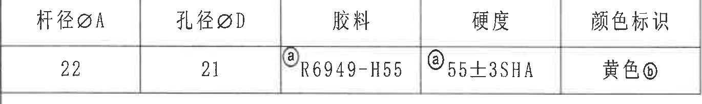
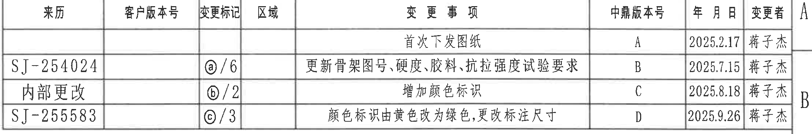
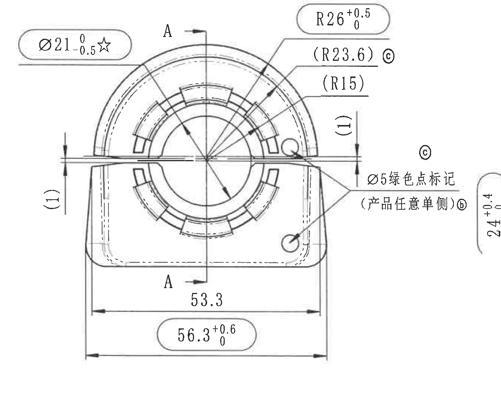
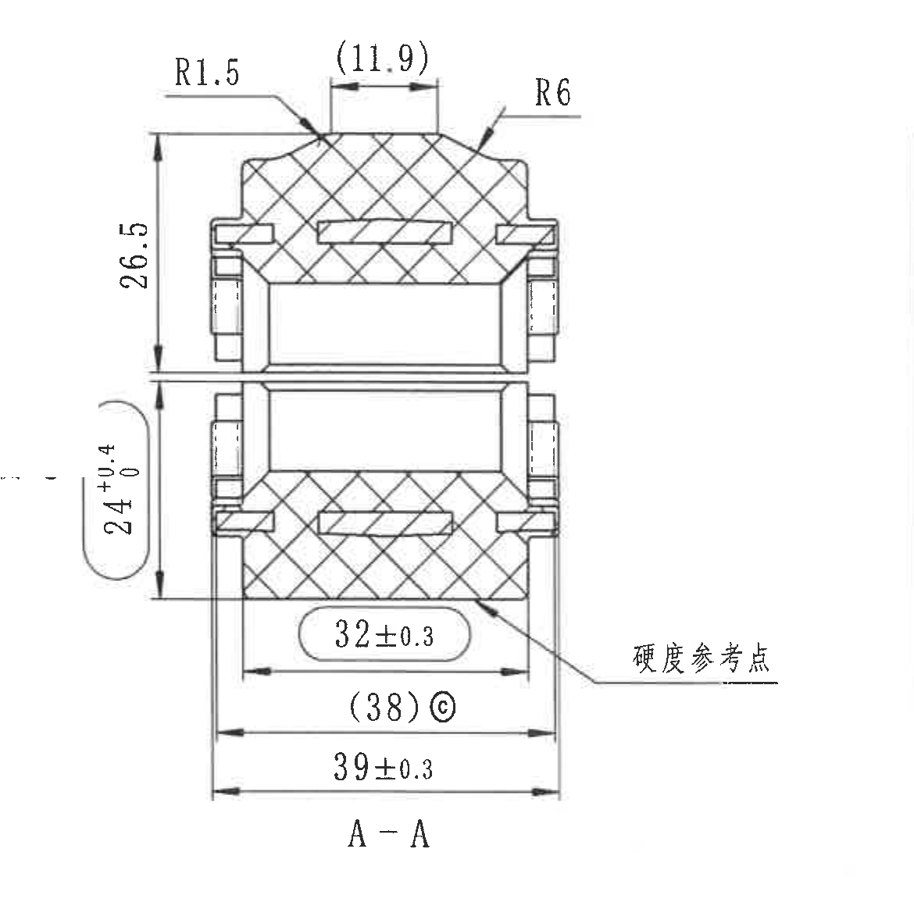
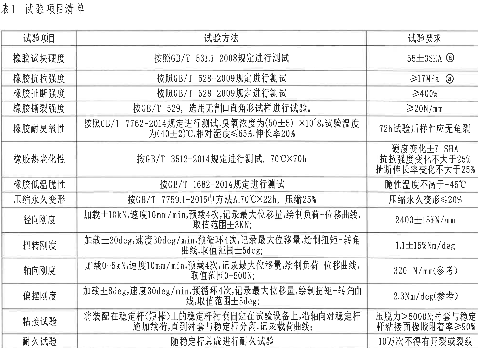
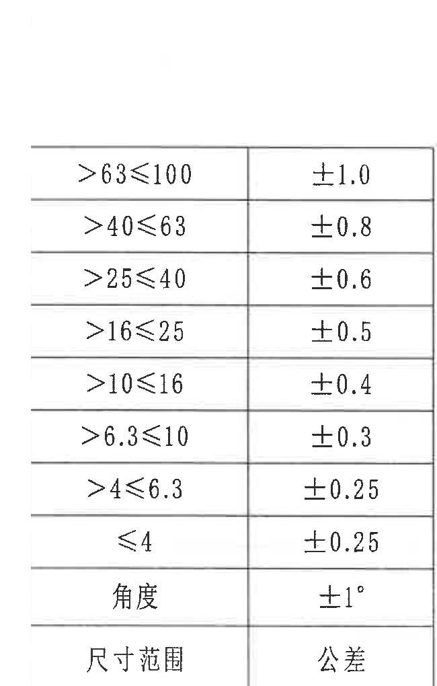
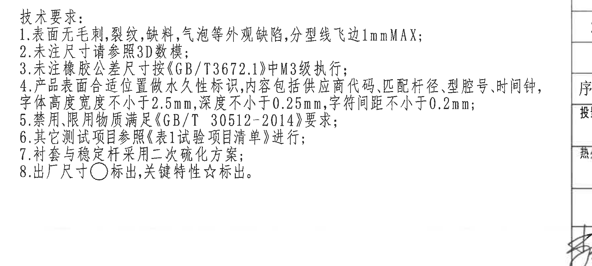
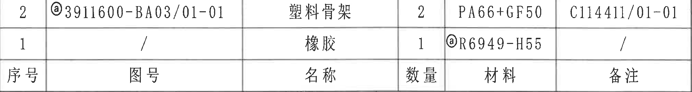
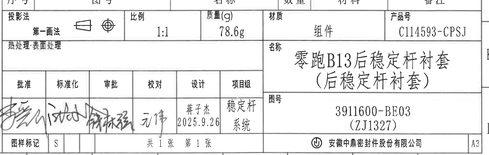

# 20C114593 PDF 内容识别与裁切提取

整页 PNG：`outputs/20C114593_assets/images/page_1.png`  
原始 PDF：`input/20C114593.pdf`  
页面尺寸：4959 x 3505 px，bbox `[0, 0, 4959, 3505]`

## object_1 顶部左侧材料/关键属性表

原图位置/视图名称：第 1 页左上角 A-B/1-5 区域，材料/关键属性表。bbox `[375, 165, 1745, 370]`

| 杆径ØA | 孔径ØD | 胶料 | 硬度 | 颜色标识 |
|---|---:|---|---|---|
| 22 | 21 | ⓐR6949-H55 | ⓐ55±3SHA | 黄色ⓑ |

| 提取项 | 原图数值或文本 | 含义说明 |
|---|---|---|
| 杆径ØA | 22 | 稳定杆匹配杆径/接口直径 A。 |
| 孔径ØD | 21 | 内孔直径 D。 |
| 胶料 | ⓐR6949-H55 | 橡胶材料牌号，ⓐ与修订/试验项关联。 |
| 硬度 | ⓐ55±3SHA | 橡胶硬度要求，允许 55±3 Shore A，ⓐ关联修订。 |
| 颜色标识 | 黄色ⓑ | 颜色标识要求，ⓑ关联修订说明。 |

边界归属说明：裁切仅包含该属性表的行列和文字，未提取图框坐标数字。

## object_2 顶部右侧修订履历表

原图位置/视图名称：第 1 页右上角 A-B/9-16 区域，修订履历表。bbox `[2605, 170, 4825, 540]`

| 来历 | 客户版本号 | 变更标记 | 区域 | 变更事项 | 中鼎版本号 | 年月日 | 变更者 |
|---|---|---|---|---|---|---|---|
|  |  |  |  | 首次下发图纸 | A | 2025.2.17 | 蒋子杰 |
| SJ-254024 |  | ⓐ/6 |  | 更新骨架图号、硬度、胶料、抗拉强度试验要求 | B | 2025.7.15 | 蒋子杰 |
| 内部更改 |  | ⓑ/2 |  | 增加颜色标识 | C | 2025.8.18 | 蒋子杰 |
| SJ-255583 |  | ⓒ/3 |  | 颜色标识由黄色改为绿色，更改标注尺寸 | D | 2025.9.26 | 蒋子杰 |

| 提取项 | 原图数值或文本 | 含义说明 |
|---|---|---|
| 版本 A | 首次下发图纸；2025.2.17；蒋子杰 | 初始发布记录。 |
| 版本 B | SJ-254024；ⓐ/6；更新骨架图号、硬度、胶料、抗拉强度试验要求；2025.7.15 | 与 ⓐ 相关的材料、硬度和试验要求变更。 |
| 版本 C | 内部更改；ⓑ/2；增加颜色标识；2025.8.18 | 与颜色标识新增相关。 |
| 版本 D | SJ-255583；ⓒ/3；颜色标识由黄色改为绿色，更改标注尺寸；2025.9.26 | 与 ⓒ 参考尺寸/颜色变更相关。 |

边界归属说明：右侧靠近图框字母，裁切保留表格外框；图框坐标不作为表格字段提取。

## object_3 主视图

原图位置/视图名称：第 1 页左中 E-G/1-5 区域，主视图。bbox `[420, 1010, 1760, 2090]`

| 提取项 | 原图数值或文本 | 含义说明 |
|---|---|---|
| 关键直径 | Ø21 0/-0.5 ☆ | 圆孔/杆径相关直径尺寸，下偏差 -0.5，上偏差 0；☆表示关键特性。 |
| 外圆弧半径 | R26 +0.5/0 | 上部外圆弧半径，单向正公差。 |
| 参考圆弧半径 | (R23.6)ⓒ | 括号内为参考半径；ⓒ与修订 D 中“更改标注尺寸”关联。 |
| 参考圆弧半径 | (R15) | 内侧圆弧参考半径，不作为直接控制尺寸。 |
| 局部厚度参考 | (1) | 左右两侧各有一处竖向括号参考尺寸，表示局部薄边/间隙厚度参考。 |
| 颜色点标记 | Ø5绿色点标记（产品任意单侧）ⓑ | 标识点直径为 Ø5；绿色点可位于产品任意单侧，ⓑ关联颜色标识修订。 |
| 水平宽度 | 53.3 | 主视图底部内侧宽度尺寸。 |
| 总宽 | 56.3 +0.6/0 | 主视图底部总宽，单向正公差。 |
| 剖切标识 | A-A | 中心竖向剖切线，箭头和上下 A 指向右侧 A-A 剖面视图。 |

边界归属说明：主视图右侧与 A-A 剖面图极近，A-A 的 24+0.4/0 和 26.5 竖向尺寸不归入主视图；裁切已通过局部白化去除剖面图残片，同时完整保留主视图 Ø5 绿色点标记及说明。

## object_4 A-A 剖面视图

原图位置/视图名称：第 1 页中部 E-H/6-8 区域，A-A 剖面视图。bbox `[1590, 960, 2760, 2120]`

| 提取项 | 原图数值或文本 | 含义说明 |
|---|---|---|
| 圆角半径 | R1.5 | 剖面左上过渡圆角半径。 |
| 顶部参考宽度 | (11.9) | 括号内参考尺寸，表示顶部平台宽度参考。 |
| 圆角半径 | R6 | 剖面右上过渡圆角半径。 |
| 上半部高度 | 26.5 | 剖面左侧上半部竖向高度。 |
| 下半部高度 | 24 +0.4/0 | 剖面左侧下半部高度，单向正公差。 |
| 内宽 | 32±0.3 | 剖面底部内侧宽度，双向公差 ±0.3。 |
| 参考宽度 | (38)ⓒ | 括号内参考宽度，ⓒ关联尺寸变更记录。 |
| 总宽 | 39±0.3 | 剖面底部总宽，双向公差 ±0.3。 |
| 硬度位置 | 硬度参考点 | 引线指向剖面中的硬度测试参考位置。 |
| 剖面名称 | A-A | 与主视图剖切线对应。 |

边界归属说明：左侧紧邻主视图的颜色点说明文字不属于剖面，已局部白化；剖面自身尺寸线、箭头、文字和“硬度参考点”引线完整保留。

## object_5 表1 试验项目清单

原图位置/视图名称：第 1 页右中 E-I/9-16 区域，表1 试验项目清单。bbox `[2760, 1000, 4810, 2455]`

| 试验项目 | 试验方法 | 试验要求 |
|---|---|---|
| 橡胶试块硬度 | 按照GB/T 531.1-2008规定进行测试 | 55±3SHA ⓐ |
| 橡胶抗拉强度 | 按照GB/T 528-2009规定进行测试 | ≥17MPa ⓐ |
| 橡胶扯断强度 | 按照GB/T 528-2009规定进行测试 | ≥400% |
| 橡胶撕裂强度 | 按GB/T 529，选用无割口直角形试样进行试验。 | ≥20N/mm |
| 橡胶耐臭氧性 | 按照GB/T 7762-2014规定进行测试，臭氧浓度为(50±5)×10^8，试验温度为(40±2)℃，相对湿度≤65%，伸长率20% | 72h试验后样件应无龟裂 |
| 橡胶热老化性 | 按GB/T 3512-2014规定进行测试，70℃×70h | 硬度变化±7 SHA；抗拉强度变化不大于25%；扯断伸长率变化不大于25% |
| 橡胶低温脆性 | 按GB/T 1682-2014规定进行测试 | 脆性温度不高于-45℃ |
| 压缩永久变形 | 按GB/T 7759.1-2015中方法A，70℃×22h，压缩25% | 压缩永久变形≤20% |
| 径向刚度 | 加载±10kN，速度10mm/min，预载4次，记录最大位移量，绘制负荷-位移曲线，取值范围±3KN； | 2400±15%N/mm |
| 扭转刚度 | 加载±20deg，速度30deg/min，预循环4次，记录最大位移量，绘制扭矩-转角曲线，取值范围±5deg； | 1.1±15%Nm/deg |
| 轴向刚度 | 加载0-5kN，速度10mm/min，预载4次，记录最大位移量，绘制负荷-位移曲线，取值范围0-500N； | 320 N/mm(参考) |
| 偏摆刚度 | 加载±8deg，速度30deg/min，预循环4次，记录最大位移量，绘制扭矩-转角曲线，取值范围±5deg； | 2.3Nm/deg(参考) |
| 粘接试验 | 将装配在稳定杆(短棒)上的稳定杆衬套固定在试验设备上，沿轴向对稳定杆施加载荷，直到衬套与稳定杆分离，记录载荷曲线； | 压脱力>5000N；衬套与稳定杆粘接面橡胶附着率≥90% |
| 耐久试验 | 随稳定杆总成进行耐久试验 | 10万次不得有开裂或裂纹 |

| 提取项 | 原图数值或文本 | 含义说明 |
|---|---|---|
| 硬度要求 | 55±3SHA ⓐ | 胶料硬度验收要求，ⓐ关联修订。 |
| 抗拉强度 | ≥17MPa ⓐ | 橡胶拉伸性能最低要求，ⓐ关联修订。 |
| 扯断强度 | ≥400% | 断裂伸长相关要求。 |
| 撕裂强度 | ≥20N/mm | 无割口直角形试样撕裂强度要求。 |
| 臭氧条件 | (50±5)×10^8；(40±2)℃；≤65%；20%；72h | 臭氧浓度、温度、湿度、伸长率和试验时间/结果要求。 |
| 热老化条件 | 70℃×70h；±7 SHA；≤25%；≤25% | 老化后硬度、抗拉强度、扯断伸长率变化限值。 |
| 低温脆性 | 不高于-45℃ | 低温脆化温度上限。 |
| 压缩永久变形 | 70℃×22h；压缩25%；≤20% | 方法 A 条件和结果上限。 |
| 刚度类要求 | ±10kN、±20deg、0-5kN、±8deg 等 | 径向、扭转、轴向、偏摆刚度的加载和结果范围。 |
| 参考刚度 | 320 N/mm(参考)、2.3Nm/deg(参考) | 括号中“参考”表示图面给出参考验收/记录值。 |

边界归属说明：裁切包含完整试验表格和标题“表1 试验项目清单”；下方明细表不归入该对象。右侧图框坐标已白化，表格内容保留完整。

## object_6 左下通用公差表

原图位置/视图名称：第 1 页左下 J-L/1-2 区域，通用公差表。bbox `[350, 2300, 1000, 3320]`

| 尺寸范围 | 公差 |
|---|---:|
| >63≤100 | ±1.0 |
| >40≤63 | ±0.8 |
| >25≤40 | ±0.6 |
| >16≤25 | ±0.5 |
| >10≤16 | ±0.4 |
| >6.3≤10 | ±0.3 |
| >4≤6.3 | ±0.25 |
| ≤4 | ±0.25 |
| 角度 | ±1° |

| 提取项 | 原图数值或文本 | 含义说明 |
|---|---|---|
| 线性尺寸通用公差 | >63≤100 到 ≤4 对应 ±1.0 到 ±0.25 | 用于未单独标注公差的线性尺寸。 |
| 角度通用公差 | ±1° | 用于未单独标注公差的角度尺寸。 |

边界归属说明：表格左侧贴近图框字母，已白化图框坐标；表格行列和表头完整保留。

## object_7 技术要求 NOTES

原图位置/视图名称：第 1 页下中 I-K/3-8 区域，技术要求。bbox `[1050, 2425, 2830, 3225]`

| 提取项 | 原图数值或文本 | 含义说明 |
|---|---|---|
| 1 | 表面无毛刺、裂纹、缺料、气泡等外观缺陷，分型线飞边1mmMAX； | 外观缺陷和飞边最大值要求。 |
| 2 | 未注尺寸请参照3D数模； | 未标注尺寸以 3D 数模为依据。 |
| 3 | 未注橡胶公差尺寸按《GB/T3672.1》中M3级执行； | 橡胶未注公差执行标准和等级。 |
| 4 | 产品表面合适位置做永久性标识，内容包括供应商代码、匹配杆径、型腔号、时间钟，字体高度宽度不小于2.5mm，深度不小于0.25mm，字符间距不小于0.2mm； | 永久标识内容、字体尺寸、深度和间距要求。 |
| 5 | 禁用限用物质满足《GB/T 30512-2014》要求； | 材料禁限用物质合规要求。 |
| 6 | 其它测试项目参照《表1试验项目清单》进行； | 试验项目归口到表1。 |
| 7 | 衬套与稳定杆采用二次硫化方案； | 制造/装配方案说明。 |
| 8 | 出厂尺寸○标出，关键特性☆标出。 | 图面符号规则：○为出厂尺寸，☆为关键特性。 |

边界归属说明：裁切仅包含“技术要求”正文，与左侧通用公差表、右侧标题栏分离。

## object_8 底部右侧明细/材料表

原图位置/视图名称：第 1 页右下 J/9-16 区域，明细/材料表。bbox `[2770, 2470, 4780, 2740]`

| 序号 | 图号 | 名称 | 数量 | 材料 | 备注 |
|---:|---|---|---:|---|---|
| 2 | ⓐ3911600-BA03/01-01 | 塑料骨架 | 2 | PA66+GF50 | C114411/01-01 |
| 1 | / | 橡胶 | 1 | ⓐR6949-H55 | / |

| 提取项 | 原图数值或文本 | 含义说明 |
|---|---|---|
| 塑料骨架 | 图号 ⓐ3911600-BA03/01-01；数量 2；材料 PA66+GF50；备注 C114411/01-01 | 组件中的塑料骨架物料。 |
| 橡胶 | 图号 /；数量 1；材料 ⓐR6949-H55；备注 / | 组件中的橡胶物料，材料与顶部胶料表一致。 |

边界归属说明：该对象只包含明细表；下方投影法、比例、质量、产品号和图名属于标题栏 object_9。

## object_9 右下标题栏

原图位置/视图名称：第 1 页右下 K-L/9-16 区域，标题栏。bbox `[2760, 2695, 4810, 3345]`

| 字段 | 原图数值或文本 |
|---|---|
| 投影法 | 第一画法 |
| 比例 | 1:1 |
| 质量(g) | 78.6g |
| 材质 | 组件 |
| 产品号 | C114593-CPSJ |
| 热处理·表面处理 |  |
| 名称 | 零跑B13后稳定杆衬套（后稳定杆衬套） |
| 图号 | 3911600-BE03（ZJ1327） |
| 批准 | 签名/手写 |
| 标准化 | 签名/手写 |
| 审批 | 签名/手写 |
| 校对 | 签名/手写 |
| 设计 | 蒋子杰 2025.9.26 |
| 项目组 | 稳定杆系统 |
| 图样标记 | S |
| 张数 | 共1张 第1张 |
| 公司 | 安徽中鼎密封件股份有限公司 |
| 图幅 | A3 |

| 提取项 | 原图数值或文本 | 含义说明 |
|---|---|---|
| 图纸名称 | 零跑B13后稳定杆衬套（后稳定杆衬套） | 零件/组件名称。 |
| 图号 | 3911600-BE03（ZJ1327） | 图纸编号和括号内编号。 |
| 产品号 | C114593-CPSJ | 产品编号。 |
| 质量 | 78.6g | 图纸给定质量。 |
| 比例 | 1:1 | 绘图比例。 |
| 投影法 | 第一画法 | 投影方式。 |
| 设计日期 | 蒋子杰 2025.9.26 | 设计人员和日期。 |

边界归属说明：上方明细/材料表为 object_8，不归入标题栏；当前裁切保留标题栏本体和右侧 A3 图幅栏，未提取下方图框坐标。

## 裁切检查记录

| 对象 | 检查结论 | 边界处理记录 |
|---|---|---|
| object_1 顶部左侧材料/关键属性表 | 完整包含表格文字和行列线。 | 无边缘文字被裁；未带入相邻图框坐标。 |
| object_2 修订履历表 | 完整包含表头和 4 行修订记录。 | 右侧靠近图框字母，裁切保留表格外框；图框坐标不作为内容。 |
| object_3 主视图 | 完整包含主视图尺寸线、箭头、尺寸文字和颜色点标记说明。 | 与 A-A 剖面过近，已白化右侧剖面图残片；A-A 的 24+0.4/0、26.5 不归入主视图。 |
| object_4 A-A 剖面视图 | 完整包含剖面线、尺寸线、箭头、文字、硬度参考点和 A-A 标题。 | 已白化左侧主视图颜色点说明残片；剖面尺寸归属清晰。 |
| object_5 表1 试验项目清单 | 完整包含标题、表头和所有试验行。 | 下方明细表未纳入；右侧图框坐标白化，表格要求列内容保留。 |
| object_6 通用公差表 | 完整包含尺寸范围/公差列和全部可见公差行。 | 左侧图框坐标白化；顶部留白用于保护表头边线。 |
| object_7 技术要求 NOTES | 完整包含技术要求 1-8 条。 | 与左侧通用公差表、右侧标题栏分离。 |
| object_8 明细/材料表 | 完整包含序号、图号、名称、数量、材料、备注列及两行物料。 | 未带入下方标题栏字段。 |
| object_9 标题栏 | 完整包含标题栏字段、签署栏、图名、图号、公司和 A3 图幅栏。 | 上方明细表不归入该对象；下方图框坐标未作为标题栏内容。 |
