# 20C114601 内容识别与裁切提取

源文件：`input/20C114601.pdf`

整页渲染图：`outputs/20C114601_assets/images/page_1.png`，尺寸 4959 x 3505 px。

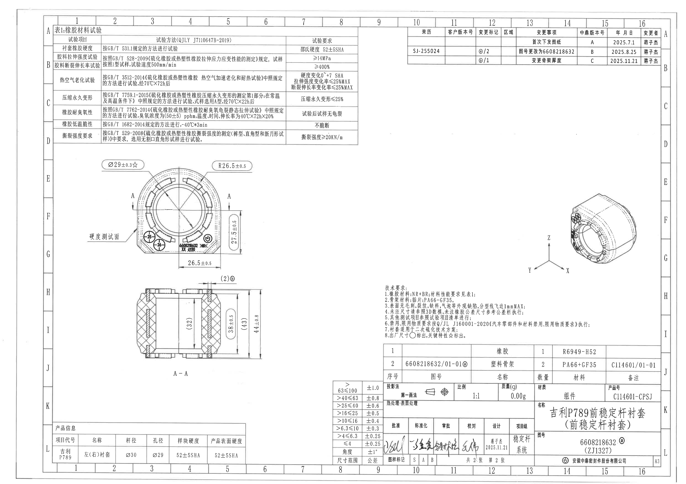

## object_1：表1 橡胶材料试验

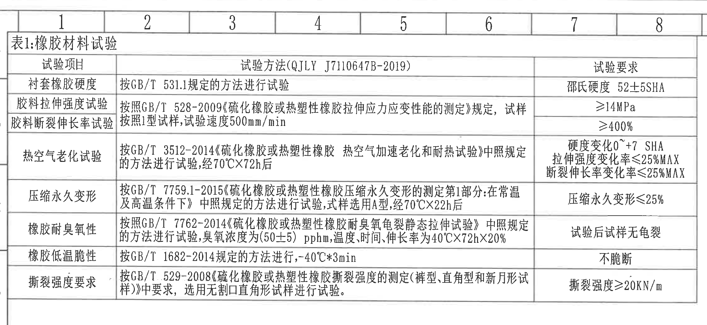

原图位置/视图名称：第 1 页左上区域，bbox `[360, 80, 2620, 1120]`，object_kind=`table`。

原表 Markdown 还原：

| 试验项目 | 试验方法(QJLY J7110647B-2019) | 试验要求 |
|---|---|---|
| 衬套橡胶硬度 | 按GB/T 531.1规定的方法进行试验 | 邵氏硬度 52±5SHA |
| 胶料拉伸强度试验 | 按照GB/T 528-2009《硫化橡胶或热塑性橡胶拉伸应力应变性能的测定》规定，试样按照1型试样，试验速度500mm/min | ≥14MPa |
| 胶料断裂伸长率试验 | 同上：按GB/T 528-2009，1型试样，试验速度500mm/min | ≥400% |
| 热空气老化试验 | 按GB/T 3512-2014《硫化橡胶或热塑性橡胶 热空气加速老化和耐热试验》中照规定的方法进行试验，经70℃X72h后 | 硬度变化0~+7 SHA；拉伸强度变化率≤25%MAX；断裂伸长率变化率≤25%MAX |
| 压缩永久变形 | 按GB/T 7759.1-2015《硫化橡胶或热塑性橡胶压缩永久变形的测定第1部分：在常温及高温条件下》中照规定的方法进行试验，试样选用A型，经70℃X22h后 | 压缩永久变形≤25% |
| 橡胶耐臭氧性 | 按照GB/T 7762-2014《硫化橡胶或热塑性橡胶耐臭氧龟裂静态拉伸试验》中照规定的方法进行试验，臭氧浓度为(50±5) pphm，温度、时间、伸长率为40℃X72hX20% | 试验后试样无龟裂 |
| 橡胶低温脆性 | 按GB/T 1682-2014规定的方法进行，-40℃*3min | 不脆断 |
| 撕裂强度要求 | 按GB/T 529-2008《硫化橡胶或热塑性橡胶撕裂强度的测定(裤型、直角型和新月形试样)》中要求，选用无割口直角形试样进行试验。 | 撕裂强度≥20KN/m |

提取表格：

| 提取项 | 原图数值或文本 | 含义说明 |
|---|---|---|
| 表号/表名 | 表1:橡胶材料试验 | 材料性能试验总表。 |
| 标准文件 | QJLY J7110647B-2019 | 表头中列出的试验方法依据文件。 |
| 硬度要求 | 邵氏硬度 52±5SHA | 衬套橡胶硬度验收范围。 |
| 拉伸强度 | ≥14MPa | 胶料拉伸强度最低要求。 |
| 断裂伸长率 | ≥400% | 胶料断裂伸长率最低要求。 |
| 老化后硬度变化 | 0~+7 SHA | 热空气老化后硬度变化范围。 |
| 老化后强度/伸长变化 | ≤25%MAX | 热空气老化后拉伸强度和断裂伸长率变化率上限。 |
| 压缩永久变形 | ≤25% | 压缩永久变形验收上限。 |
| 臭氧试验条件 | (50±5) pphm，40℃X72hX20% | 耐臭氧试验浓度、温度、时间和伸长率条件。 |
| 低温脆性 | -40℃*3min；不脆断 | 低温脆性试验条件和验收要求。 |
| 撕裂强度 | ≥20KN/m | 撕裂强度最低要求。 |

边界归属说明：该裁切只提取左上材料试验表内容；上方图框坐标数字属于图框坐标，不作为表格字段。下边界已重裁到完整包含“撕裂强度要求”行和外框。

## object_2：右上修订履历表

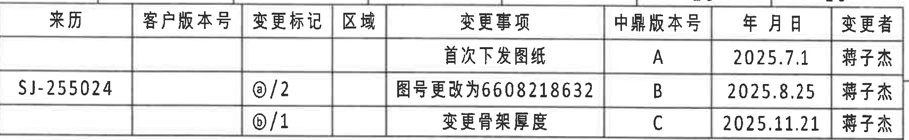

原图位置/视图名称：第 1 页右上区域，bbox `[2950, 190, 4790, 475]`，object_kind=`table`。

原表 Markdown 还原：

| 来源 | 客户版本号 | 变更标记 | 区域 | 变更事项 | 中鼎版本号 | 年 月 日 | 变更者 |
|---|---|---|---|---|---|---|---|
|  |  |  |  | 首次下发图纸 | A | 2025.7.1 | 蒋子杰 |
| SJ-255024 |  | ⓐ/2 |  | 图号更改为6608218632 | B | 2025.8.25 | 蒋子杰 |
|  |  | ⓑ/1 |  | 变更骨架厚度 | C | 2025.11.21 | 蒋子杰 |

提取表格：

| 提取项 | 原图数值或文本 | 含义说明 |
|---|---|---|
| 表头 | 来源、客户版本号、变更标记、区域、变更事项、中鼎版本号、年 月 日、变更者 | 修订履历字段。 |
| 修订 A | 首次下发图纸；A；2025.7.1；蒋子杰 | 初次下发记录。 |
| 修订 B | 来源 SJ-255024；变更标记 ⓐ/2；图号更改为6608218632；B；2025.8.25；蒋子杰 | 图号变更记录。 |
| 修订 C | 变更标记 ⓑ/1；变更骨架厚度；C；2025.11.21；蒋子杰 | 骨架厚度变更记录。 |

边界归属说明：顶部靠近图框坐标 10-16，裁切以保留完整表头和三条修订记录为优先；顶部残留的图框坐标不作为修订表字段提取。该区域不提取右侧图框字母。

## object_3：主视图/正视加工视图

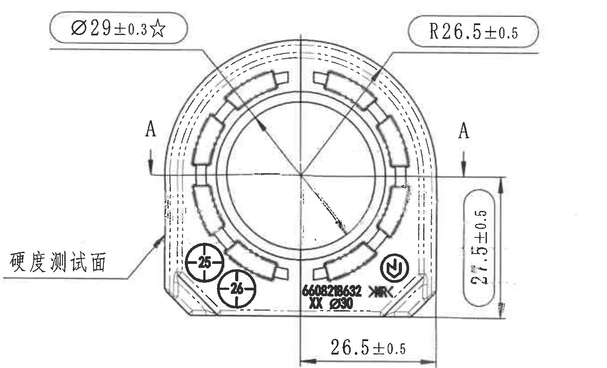

原图位置/视图名称：第 1 页左中主视图，bbox `[625, 1130, 1975, 1950]`，object_kind=`view`。

提取表格：

| 提取项 | 原图数值或文本 | 含义说明 |
|---|---|---|
| 直径尺寸/关键特性 | Ø29±0.3☆ | 主视图上方左侧引出标注；孔径/内圆相关尺寸，星号按技术要求表示关键特性。 |
| 圆弧半径 | R26.5±0.5 | 主视图上方右侧引出标注；外圆弧/外轮廓半径尺寸。 |
| 竖向尺寸 | 27.5±0.5 | 主视图右侧竖向尺寸线；由底部基准线到中部水平线的高度尺寸。 |
| 水平尺寸 | 26.5±0.5 | 主视图底部水平尺寸线；由中心线到右侧外轮廓的水平距离。 |
| 剖切基准 | A、A | 主视图左右两侧剖切箭头，指向 A-A 剖面位置。 |
| 硬度测试面 | 硬度测试面 | 左侧引出文字，指示硬度测试所在外表面。 |
| T编号/圆靶标编号 | 25、26 | 主视图下部两个圆靶标编号，分别位于左下和中下区域。 |
| 标识/方向符号 | 圆圈内 N 形符号 | 主视图右下区域的标识符号，不是尺寸。 |
| 产品/材料标识 | 6608218632、>NR<、XX、Ø30 | 主视图下部产品标识和材料/孔径相关标记；该处文字属于主视图标识。 |

边界归属说明：该裁切重裁后只包含主视图本体及其上、左、右、下方尺寸标注；下方 A-A 剖视图顶部的 `(2)ⓑ` 标注已排除，不归入主视图。主视图中所有引出线、箭头和尺寸文字均完整保留。

## object_4：A-A 剖面视图

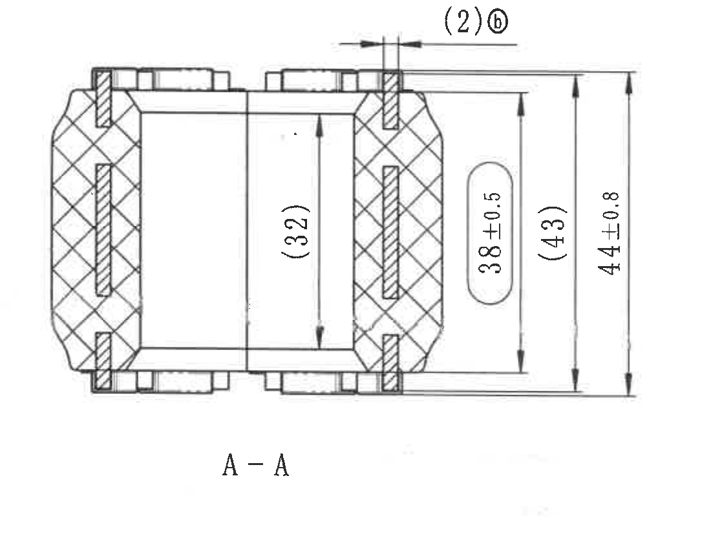

原图位置/视图名称：第 1 页左下中部 A-A 剖面，bbox `[910, 1985, 2010, 2835]`，object_kind=`section`。

提取表格：

| 提取项 | 原图数值或文本 | 含义说明 |
|---|---|---|
| 剖面名称 | A-A | 与主视图中 A-A 剖切箭头对应。 |
| 顶部局部尺寸/参考标记 | (2)ⓑ | 剖视图顶部局部小尺寸，括号表示参考尺寸；ⓑ对应修订标记/变更标识。 |
| 内部竖向参考尺寸 | (32) | 剖面中央内部竖向尺寸，括号表示参考尺寸。 |
| 竖向尺寸 | 38±0.5 | 剖面右侧椭圆框内竖向尺寸，带 ±0.5 公差。 |
| 外侧竖向参考尺寸 | (43) | 剖面右侧外部竖向参考尺寸，括号表示参考尺寸。 |
| 总高度 | 44±0.8 | 剖面最右侧总高度尺寸，带 ±0.8 公差。 |
| 剖面材料表达 | 交叉剖面线、竖向嵌件剖面线 | 表示橡胶本体与内部骨架/嵌件的剖切结构。 |

边界归属说明：该裁切只提取 A-A 剖面尺寸；其顶部 `(2)ⓑ` 属于剖视图，不归入主视图。右侧三条竖向尺寸线、箭头和文字完整包含。

## object_5：等轴测视图

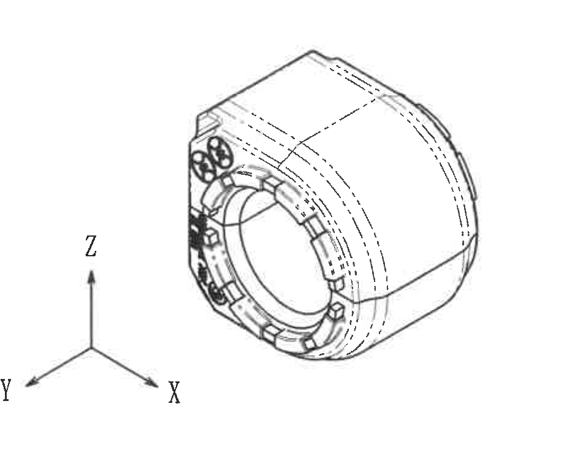

原图位置/视图名称：第 1 页右中等轴测图，bbox `[3820, 1320, 4740, 2080]`，object_kind=`view`。

提取表格：

| 提取项 | 原图数值或文本 | 含义说明 |
|---|---|---|
| 视图类型 | 等轴测三维外观视图 | 显示零件整体外观、端面槽形、圆孔和外圆曲面。 |
| 坐标轴 | X、Y、Z | 三维方向标识，位于视图左下。 |
| 尺寸标注 | 无 | 该裁切内没有尺寸数字、半径、直径或公差标注。 |

边界归属说明：该裁切包含等轴测图和 XYZ 坐标轴；周围主视图、剖视图、技术要求和标题栏均未纳入。不存在尺寸归属争议。

## object_6：技术要求 NOTES

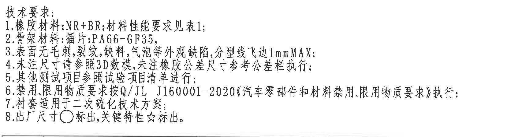

原图位置/视图名称：第 1 页右下中部技术要求，bbox `[2765, 2045, 4435, 2495]`，object_kind=`notes`。

原文还原：

| 序号 | 原图文本 |
|---|---|
| 标题 | 技术要求: |
| 1 | 橡胶材料:NR+BR;材料性能要求见表1; |
| 2 | 骨架材料:插件:PA66-GF35; |
| 3 | 表面无毛刺,裂纹,缺料,气泡等外观缺陷,分型线飞边1mmMAX; |
| 4 | 未注尺寸请参照3D数模,未注橡胶公差尺寸参考公差栏执行; |
| 5 | 其他测试项目参照试验项目清单进行; |
| 6 | 禁用,限用物质要求按Q/JL J160001-2020《汽车零部件和材料禁用、限用物质要求》执行; |
| 7 | 衬套适用于二次硫化技术方案; |
| 8 | 出厂尺寸○标出,关键特性☆标出。 |

提取表格：

| 提取项 | 原图数值或文本 | 含义说明 |
|---|---|---|
| 橡胶材料 | NR+BR | 橡胶材料组合；性能要求引用表1。 |
| 骨架材料 | 插件:PA66-GF35 | 骨架/插件材料。 |
| 外观缺陷要求 | 无毛刺、裂纹、缺料、气泡；分型线飞边1mmMAX | 外观检验要求和飞边最大限值。 |
| 未注尺寸依据 | 3D数模；未注橡胶公差参考公差栏 | 对图面未标注尺寸的执行依据。 |
| 物质禁限用标准 | Q/JL J160001-2020 | 汽车零部件和材料禁用、限用物质要求。 |
| 工艺适用 | 二次硫化技术方案 | 衬套制造/装配工艺说明。 |
| 出厂尺寸标识 | ○ | 技术要求第8条定义出厂尺寸符号。 |
| 关键特性标识 | ☆ | 技术要求第8条定义关键特性符号。 |

边界归属说明：该裁切只包含“技术要求”8条文本，右侧扩大后第6条完整显示；下方标题栏和左侧视图尺寸不属于该对象。

## object_7：产品信息表

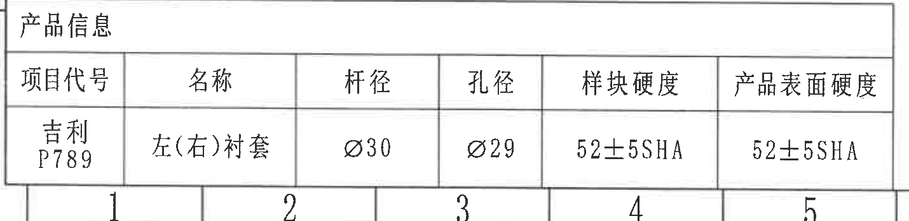

原图位置/视图名称：第 1 页左下角产品信息，bbox `[370, 3060, 1800, 3410]`，object_kind=`table`。

原表 Markdown 还原：

| 项目代号 | 名称 | 杆径 | 孔径 | 样块硬度 | 产品表面硬度 |
|---|---|---|---|---|---|
| 吉利P789 | 左(右)衬套 | Ø30 | Ø29 | 52±5SHA | 52±5SHA |

提取表格：

| 提取项 | 原图数值或文本 | 含义说明 |
|---|---|---|
| 项目代号 | 吉利P789 | 产品所属项目。 |
| 名称 | 左(右)衬套 | 左右件通用或成对衬套名称。 |
| 杆径 | Ø30 | 配合稳定杆直径。 |
| 孔径 | Ø29 | 衬套孔径，与主视图 Ø29±0.3 关联。 |
| 样块硬度 | 52±5SHA | 样块硬度要求。 |
| 产品表面硬度 | 52±5SHA | 产品表面硬度要求。 |

边界归属说明：该裁切完整包含产品信息表外框、表头和数据行；底部轻微露出的图框坐标数字不作为表格内容。

## object_8：零件明细/BOM 表

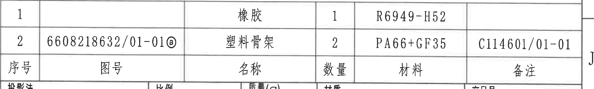

原图位置/视图名称：第 1 页右下上方零件明细表，bbox `[2770, 2490, 4820, 2800]`，object_kind=`table`。

原表 Markdown 还原：

| 序号 | 图号 | 名称 | 数量 | 材料 | 备注 |
|---|---|---|---|---|---|
| 1 |  | 橡胶 | 1 | R6949-H52 |  |
| 2 | 6608218632/01-01ⓐ | 塑料骨架 | 2 | PA66+GF35 | C114601/01-01 |

原图结构说明：原图中两条明细行位于上方，表头“序号、图号、名称、数量、材料、备注”位于明细行下方；上表按同一列顺序还原字段。

提取表格：

| 提取项 | 原图数值或文本 | 含义说明 |
|---|---|---|
| 明细1名称 | 橡胶 | 组件中的橡胶件。 |
| 明细1数量 | 1 | 橡胶件数量。 |
| 明细1材料 | R6949-H52 | 橡胶材料牌号。 |
| 明细2图号 | 6608218632/01-01ⓐ | 塑料骨架图号，带修订标记 ⓐ。 |
| 明细2名称 | 塑料骨架 | 组件中的骨架件。 |
| 明细2数量 | 2 | 塑料骨架数量。 |
| 明细2材料 | PA66+GF35 | 骨架材料。 |
| 明细2备注 | C114601/01-01 | 备注/关联图号。 |

边界归属说明：该裁切保留 BOM 两行明细和表头。下边界与标题栏上边界相邻，少量下方标题栏线/文字顶部不作为 BOM 内容提取。

## object_9：未注尺寸公差表

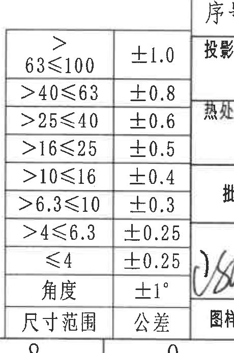

原图位置/视图名称：第 1 页下方中偏左公差栏，bbox `[2395, 2700, 2855, 3395]`，object_kind=`table`。

原表 Markdown 还原：

| 尺寸范围 | 公差 |
|---|---|
| >63≤100 | ±1.0 |
| >40≤63 | ±0.8 |
| >25≤40 | ±0.6 |
| >16≤25 | ±0.5 |
| >10≤16 | ±0.4 |
| >6.3≤10 | ±0.3 |
| >4≤6.3 | ±0.25 |
| ≤4 | ±0.25 |
| 角度 | ±1° |

提取表格：

| 提取项 | 原图数值或文本 | 含义说明 |
|---|---|---|
| 线性公差范围1 | >63≤100：±1.0 | 未注线性尺寸公差。 |
| 线性公差范围2 | >40≤63：±0.8 | 未注线性尺寸公差。 |
| 线性公差范围3 | >25≤40：±0.6 | 未注线性尺寸公差。 |
| 线性公差范围4 | >16≤25：±0.5 | 未注线性尺寸公差。 |
| 线性公差范围5 | >10≤16：±0.4 | 未注线性尺寸公差。 |
| 线性公差范围6 | >6.3≤10：±0.3 | 未注线性尺寸公差。 |
| 线性公差范围7 | >4≤6.3：±0.25 | 未注线性尺寸公差。 |
| 线性公差范围8 | ≤4：±0.25 | 未注线性尺寸公差。 |
| 角度公差 | 角度：±1° | 未注角度尺寸公差。 |

边界归属说明：该裁切完整包含公差栏两列和全部范围行；右侧签审/标题栏与本表相邻，露出的右侧边缘不作为公差表字段。

## object_10：标题栏/签审栏

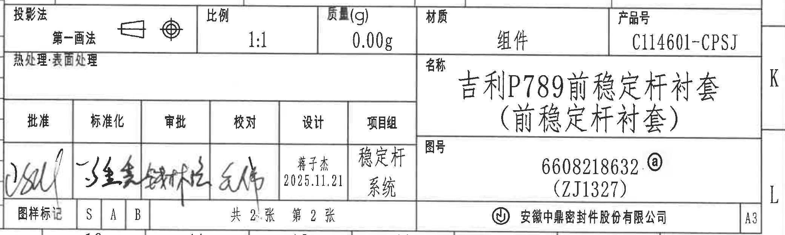

原图位置/视图名称：第 1 页右下角标题栏主体，bbox `[2760, 2760, 4840, 3385]`，object_kind=`title_block`。

标题栏字段还原：

| 字段 | 原图数值或文本 |
|---|---|
| 投影法 | 第一画法；含第一角法投影符号 |
| 比例 | 1:1 |
| 质量(g) | 0.00g |
| 材质 | 组件 |
| 产品号 | C114601-CPSJ |
| 热处理·表面处理 | 空白 |
| 名称 | 吉利P789前稳定杆衬套（前稳定杆衬套） |
| 图号 | 6608218632,ⓐ（ZJ1327） |
| 图样标记 | S、A、B |
| 张数 | 共2张 第2张 |
| 公司 | 安徽中鼎密封件股份有限公司 |
| 图幅 | A3 |

签审栏还原：

| 批准 | 标准化 | 审批 | 校对 | 设计 | 项目组 |
|---|---|---|---|---|---|
| 签名 | 签名 | 签名 | 签名 | 蒋子杰 2025.11.21 | 稳定杆系统 |

提取表格：

| 提取项 | 原图数值或文本 | 含义说明 |
|---|---|---|
| 产品名称 | 吉利P789前稳定杆衬套（前稳定杆衬套） | 图样标题名称。 |
| 图号 | 6608218632,ⓐ（ZJ1327） | 图纸编号和修订标记。 |
| 产品号 | C114601-CPSJ | 产品编号。 |
| 材质 | 组件 | 标题栏材质字段。 |
| 比例 | 1:1 | 图纸比例。 |
| 质量 | 0.00g | 标题栏质量字段。 |
| 设计 | 蒋子杰 2025.11.21 | 设计人员和日期。 |
| 项目组 | 稳定杆系统 | 项目组/系统归属。 |
| 图样标记 | S、A、B | 图样标记栏。 |
| 公司 | 安徽中鼎密封件股份有限公司 | 图纸发布单位。 |

边界归属说明：标题栏与左侧公差表、上方 BOM 相邻；该对象只提取标题栏/签审栏/图号名称公司信息，不把左侧公差范围或上方 BOM 行归入标题栏。左边界已重裁以完整包含“投影法”文字。

## 裁切检查记录

| object_id | 裁切对象 | 检查结果 | 处理记录 |
|---|---|---|---|
| page_1 | 整页 PNG | 完整渲染整页，4959 x 3505 px。 | 作为所有 bbox 的坐标基准。 |
| object_1 | 表1 橡胶材料试验 | 完整包含表名、表头、全部 8 条试验项目和外框。 | 初裁切底部截断“撕裂强度要求”行，已向下重裁。 |
| object_2 | 右上修订履历表 | 完整包含表头和 A/B/C 三条修订记录。 | 表格贴近图框坐标，顶部少量坐标残留已在归属说明中排除。 |
| object_3 | 主视图 | 完整包含 Ø29±0.3☆、R26.5±0.5、27.5±0.5、26.5±0.5、A-A 剖切标识、硬度测试面和 T编号/圆靶标。 | 初裁切带入下方剖视图 `(2)ⓑ`，已上收底边重裁并排除。 |
| object_4 | A-A 剖面 | 完整包含 `(2)ⓑ`、`(32)`、`38±0.5`、`(43)`、`44±0.8` 和 A-A 名称。 | 未发现文字或尺寸线被裁断。 |
| object_5 | 等轴测视图 | 完整包含三维视图和 X/Y/Z 坐标轴。 | 无尺寸标注；未混入其他视图。 |
| object_6 | 技术要求 NOTES | 完整包含“技术要求”标题和 1-8 条文本。 | 初裁切左、右边界分别截断行首/第6条，已扩大并重裁。 |
| object_7 | 产品信息表 | 完整包含表头和数据行。 | 底部图框坐标轻微进入，不作为表格内容。 |
| object_8 | 零件明细/BOM 表 | 完整包含两条明细和表头。 | 下方标题栏与表格共边，少量下方线/文字顶部不作为 BOM 内容。 |
| object_9 | 未注尺寸公差表 | 完整包含全部尺寸范围、公差和角度行。 | 右侧标题栏边缘相邻，不作为公差内容。 |
| object_10 | 标题栏/签审栏 | 完整包含投影法、比例、质量、材质、产品号、名称、图号、签审、图样标记、公司和图幅。 | 左边界重裁以完整包含“投影法”；左侧邻接公差表不作为标题栏内容。 |
