# 20C114602 内容识别结果

源文件：`input/20C114602.pdf`  
整页渲染图：`outputs/20C114602_assets/images/page_1.png`  
页面：1 页，渲染尺寸 4959 x 3505 px。

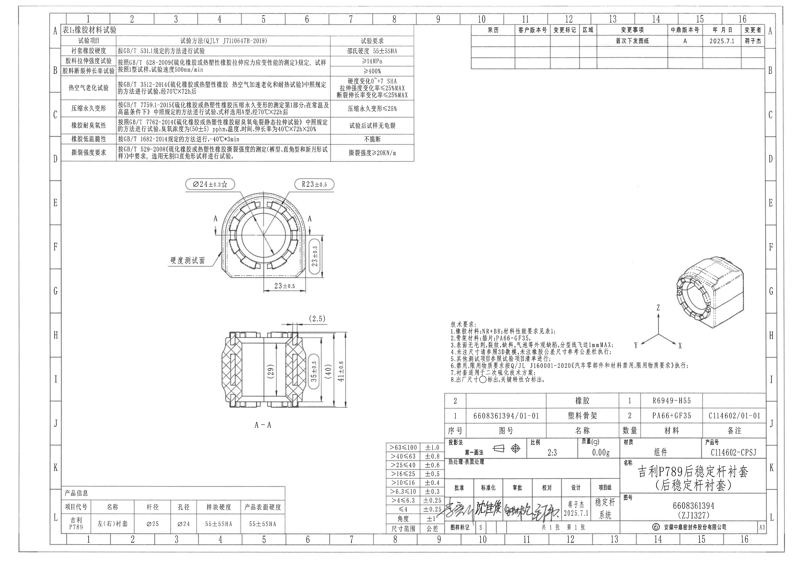

## object_1：表1 橡胶材料试验

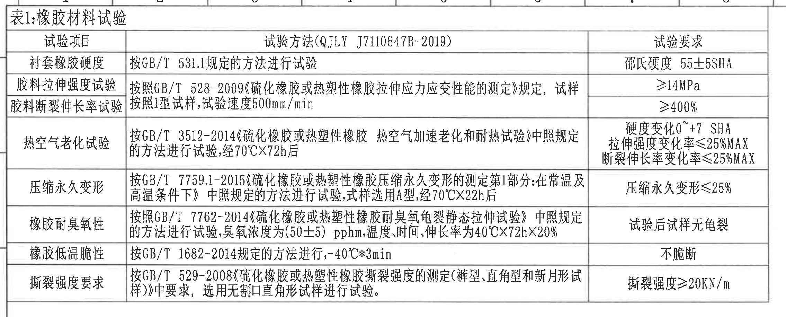

原图位置/视图名称：第 1 页左上区域，表1:橡胶材料试验。  
边界归属说明：裁切包含表格标题、三列表头、全部横纵表格线和各行文字；上缘贴近图框坐标线，但未把相邻加工视图或其他表格内容纳入本对象。

### 原表还原

| 试验项目 | 试验方法(QJLY J7110647B-2019) | 试验要求 |
|---|---|---|
| 衬套橡胶硬度 | 按GB/T 531.1规定的方法进行试验 | 邵氏硬度 55±5SHA |
| 胶料拉伸强度试验 | 按照GB/T 528-2009《硫化橡胶或热塑性橡胶拉伸应力应变性能的测定》规定，试样按照1型试样，试验速度500mm/min | ≥14MPa |
| 胶料断裂伸长率试验 | 按照GB/T 528-2009《硫化橡胶或热塑性橡胶拉伸应力应变性能的测定》规定，试样按照1型试样，试验速度500mm/min | ≥400% |
| 热空气老化试验 | 按GB/T 3512-2014《硫化橡胶或热塑性橡胶 热空气加速老化和耐热试验》中照规定的方法进行试验，经70℃X72h后 | 硬度变化0~+7 SHA；拉伸强度变化率≤25%MAX；断裂伸长率变化率≤25%MAX |
| 压缩永久变形 | 按GB/T 7759.1-2015《硫化橡胶或热塑性橡胶压缩永久变形的测定第1部分:在常温及高温条件下》中照规定的方法进行试验，试样选用A型，经70℃X22h后 | 压缩永久变形≤25% |
| 橡胶耐臭氧性 | 按照GB/T 7762-2014《硫化橡胶或热塑性橡胶耐臭氧龟裂静态拉伸试验》中照规定的方法进行试验，臭氧浓度为(50±5) pphm，温度、时间、伸长率为40℃X72hX20% | 试验后试样无龟裂 |
| 橡胶低温脆性 | 按GB/T 1682-2014规定的方法进行，-40℃*3min | 不脆断 |
| 撕裂强度要求 | 按GB/T 529-2008《硫化橡胶或热塑性橡胶撕裂强度的测定(裤型、直角型和新月形试样)》中要求，选用无割口直角形试样进行试验。 | 撕裂强度≥20KN/m |

### 提取表

| 提取项 | 原图数值或文本 | 含义说明 |
|---|---|---|
| 表题 | 表1:橡胶材料试验 | 技术要求第 1 条引用的材料性能要求表。 |
| 橡胶硬度要求 | 邵氏硬度 55±5SHA | 衬套橡胶硬度试验的判定要求。 |
| 拉伸强度 | ≥14MPa | 胶料拉伸强度最低要求。 |
| 断裂伸长率 | ≥400% | 胶料断裂伸长率最低要求。 |
| 热空气老化 | 70℃X72h后；硬度变化0~+7 SHA；拉伸强度变化率≤25%MAX；断裂伸长率变化率≤25%MAX | 热老化后性能变化限制。 |
| 压缩永久变形 | 70℃X22h后；压缩永久变形≤25% | A型试样在规定温度时间后的压缩永久变形限制。 |
| 耐臭氧性 | 臭氧浓度(50±5) pphm；40℃X72hX20%；试验后试样无龟裂 | 臭氧龟裂静态拉伸试验条件及判定。 |
| 低温脆性 | -40℃*3min；不脆断 | 低温条件下不允许脆断。 |
| 撕裂强度 | 撕裂强度≥20KN/m | 无割口直角形试样的撕裂强度下限。 |

## object_2：修订履历表

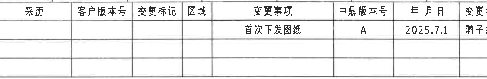

原图位置/视图名称：第 1 页右上区域，修订/变更履历表。  
边界归属说明：裁切覆盖表头、首条变更记录和下方空白记录行；右侧靠近图框行号 A/B，图框行号不属于修订履历表，未作为表格字段提取。

### 原表还原

| 来历 | 客户版本号 | 变更标记 | 区域 | 变更事项 | 中鼎版本号 | 年 月 日 | 变更者 |
|---|---|---|---|---|---|---|---|
|  |  |  |  | 首次下发图纸 | A | 2025.7.1 | 蒋子杰 |
|  |  |  |  |  |  |  |  |
|  |  |  |  |  |  |  |  |

### 提取表

| 提取项 | 原图数值或文本 | 含义说明 |
|---|---|---|
| 变更事项 | 首次下发图纸 | 图纸首次发布。 |
| 中鼎版本号 | A | 中鼎内部版本。 |
| 日期 | 2025.7.1 | 变更记录日期。 |
| 变更者 | 蒋子杰 | 变更记录责任人。 |
| 空白记录行 | 两行空白 | 表格预留后续变更记录。 |

## object_3：端面主视图

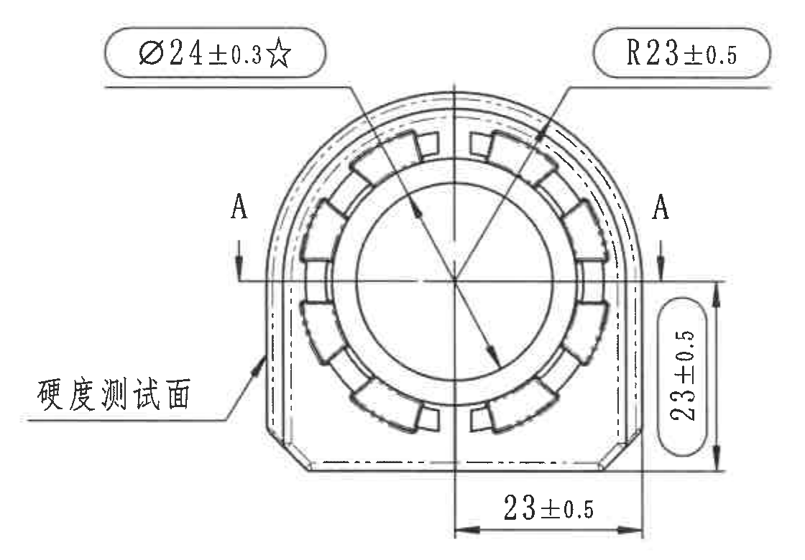

原图位置/视图名称：第 1 页中左区域，零件端面主视图，含 A-A 剖切方向标识。  
边界归属说明：裁切保留端面轮廓、全部属于端面视图的尺寸线、箭头和文字；已排除下方 A-A 剖面视图顶部的 `(2.5)` 标注，未将剖面尺寸归入端面主视图。

### 提取表

| 提取项 | 原图数值或文本 | 含义说明 |
|---|---|---|
| 关键孔径尺寸 | Ø24±0.3☆ | 带直径符号和星号的关键尺寸；技术要求第 8 条说明关键特性用 ☆ 标出。该尺寸指向端面中心孔/内圆相关直径。 |
| 外圆弧半径 | R23±0.5 | 端面上部外轮廓弧半径，属于弧/半径尺寸。 |
| 右侧竖向尺寸 | 23±0.5 | 端面右侧竖向局部高度/投影尺寸，箭头和尺寸线完整位于端面视图内。 |
| 底部横向尺寸 | 23±0.5 | 端面底部从中心基准线到右侧边界的横向尺寸。 |
| 剖切标识 | A、A | 两侧 A 字母和箭头定义 A-A 剖切位置，对应下方 object_4。 |
| 指定测试面 | 硬度测试面 | 文字引出线指向左下外表面，表示硬度测试位置。 |
| 基准字母 | 未见 | 图中 A、A 为剖切标识，不是形位公差基准字母。 |
| 数量前缀 | 未见 | 此视图尺寸标注中未见如 2X、4- 等数量前缀。 |
| 角度/弧向尺寸 | 未见 | 除 R23±0.5 半径标注外，未见角度、弧长或弧向尺寸标注。 |
| T 编号 | 未见 | 此视图未标出 T 编号。 |
| 括号参考尺寸 | 未见 | 此端面主视图裁切范围内未见括号参考尺寸。 |

## object_4：A-A 剖面视图

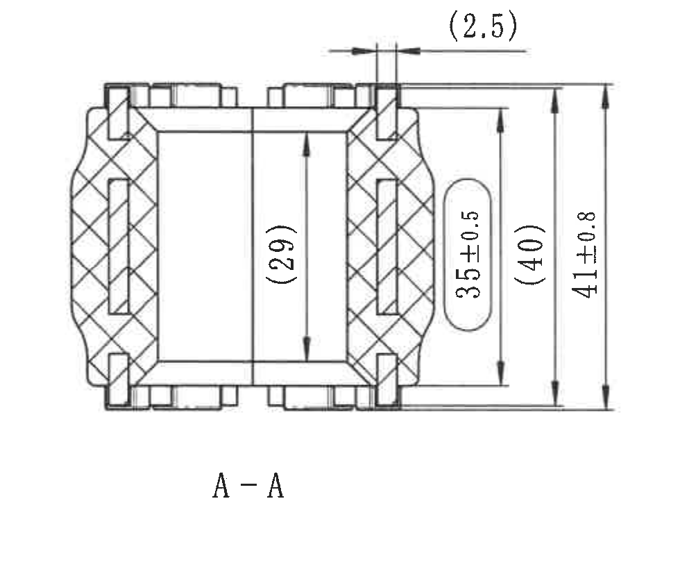

原图位置/视图名称：第 1 页中下区域，A-A 剖面视图。  
边界归属说明：裁切包含剖面轮廓、剖面线、顶部参考尺寸和右侧全部竖向尺寸；未把端面主视图中的 Ø24±0.3☆、R23±0.5 或端面 23±0.5 尺寸归入本剖面。

### 提取表

| 提取项 | 原图数值或文本 | 含义说明 |
|---|---|---|
| 视图名称 | A-A | 表示由 object_3 中 A-A 剖切标识得到的剖面。 |
| 顶部参考尺寸 | (2.5) | 括号内参考尺寸，表示顶部局部结构间距/凸台间距的参考值；括号说明该尺寸为参考信息而非主要检验控制尺寸。 |
| 内部参考高度 | (29) | 括号内参考尺寸，位于剖面内腔竖向方向，表示内腔高度/长度参考值。 |
| 竖向控制尺寸 | 35±0.5 | 剖面右侧内层竖向尺寸，带 ±0.5 公差。 |
| 外侧参考高度 | (40) | 括号内参考尺寸，位于右侧外层尺寸线，表示外部高度参考值。 |
| 总高度 | 41±0.8 | 最外侧竖向总高度尺寸，带 ±0.8 公差。 |
| 基准字母 | 未见 | A-A 为剖面名称，不是基准字母。 |
| 数量前缀 | 未见 | 此剖面视图尺寸标注中未见数量前缀。 |
| T 编号 | 未见 | 此剖面视图未标出 T 编号。 |
| 角度/弧向尺寸 | 未见 | 此剖面视图未给出角度、弧长或半径标注。 |

## object_5：轴测视图

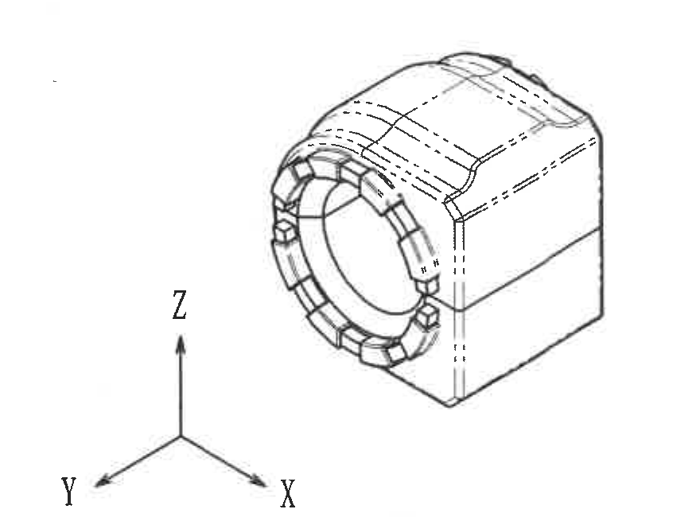

原图位置/视图名称：第 1 页右侧中部，三维轴测视图。  
边界归属说明：裁切保留零件轴测图和 X/Y/Z 坐标方向标识；未包含下方技术要求文字。该图仅作形状和方向表达，未标注尺寸线。

### 提取表

| 提取项 | 原图数值或文本 | 含义说明 |
|---|---|---|
| 轴测外形 | 零件三维外形 | 显示衬套前端圆形结构、外部包覆/块状轮廓及隐藏线。 |
| 坐标方向 | X、Y、Z | 说明轴测图方向；Z 竖直向上，X/Y 为图中两个斜向轴。 |
| 尺寸标注 | 未见 | 轴测视图没有独立尺寸、角度、半径或公差标注。 |
| 基准字母/数量前缀 | 未见 | 轴测视图未标注基准字母、数量前缀或 T 编号。 |
| T 编号 | 未见 | 此视图未标出 T 编号。 |

## object_6：技术要求 / NOTES

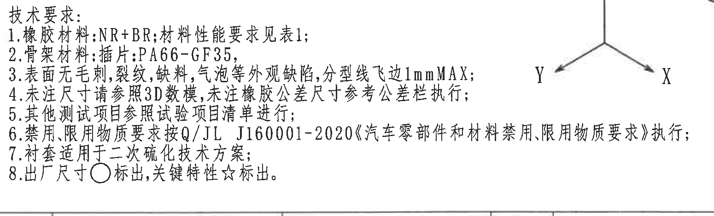

原图位置/视图名称：第 1 页右下中部，技术要求。  
边界归属说明：裁切为完整容纳第 6 条长文本而向右扩展；右上方可见轴测图坐标标识的局部线段，该坐标标识归属 object_5，不作为 NOTES 内容提取。

### 原文还原

1. 橡胶材料:NR+BR;材料性能要求见表1;
2. 骨架材料:插件:PA66-GF35;
3. 表面无毛刺,裂纹,缺料,气泡等外观缺陷,分型线飞边1mmMAX;
4. 未注尺寸请参照3D数模,未注橡胶公差尺寸参考公差栏执行;
5. 其他测试项目参照试验项目清单进行;
6. 禁用,限用物质要求按Q/JL J160001-2020《汽车零部件和材料禁用,限用物质要求》执行;
7. 衬套适用于二次硫化技术方案;
8. 出厂尺寸○标出;关键特性☆标出。

### 提取表

| 提取项 | 原图数值或文本 | 含义说明 |
|---|---|---|
| 橡胶材料 | NR+BR | 橡胶材料组合；性能要求引用 object_1 表1。 |
| 骨架材料 | 插件:PA66-GF35 | 骨架/插件材料要求。 |
| 外观要求 | 无毛刺、裂纹、缺料、气泡等外观缺陷 | 外观质量限制。 |
| 分型线飞边 | 1mmMAX | 分型线飞边最大允许值 1 mm。 |
| 未注尺寸依据 | 参照3D数模 | 未在图纸中标注的尺寸以 3D 数模为依据。 |
| 未注橡胶公差 | 参考公差栏执行 | 未注橡胶公差尺寸适用 object_8 公差表。 |
| 禁限用物质 | Q/JL J160001-2020 | 禁用、限用物质按该标准执行。 |
| 工艺方案 | 二次硫化技术方案 | 衬套适用工艺方案。 |
| 出厂尺寸标识 | ○ | 出厂尺寸由圆圈标出。 |
| 关键特性标识 | ☆ | 关键特性由星号标出，例如 object_3 的 Ø24±0.3☆。 |

## object_7：产品信息表

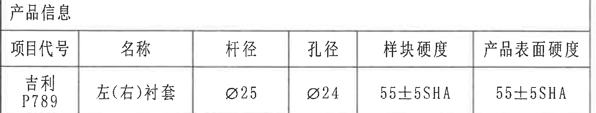

原图位置/视图名称：第 1 页左下区域，产品信息表。  
边界归属说明：裁切保留产品信息表标题、表头和值；已去除下方图框坐标行，不把图框索引作为产品信息表内容。

### 原表还原

| 项目代号 | 名称 | 杆径 | 孔径 | 样块硬度 | 产品表面硬度 |
|---|---|---|---|---|---|
| 吉利 P789 | 左(右)衬套 | Ø25 | Ø24 | 55±5SHA | 55±5SHA |

### 提取表

| 提取项 | 原图数值或文本 | 含义说明 |
|---|---|---|
| 项目代号 | 吉利 P789 | 产品项目代号。 |
| 名称 | 左(右)衬套 | 产品名称，左右件共用/对称。 |
| 杆径 | Ø25 | 杆径为直径 25。 |
| 孔径 | Ø24 | 孔径为直径 24，与 object_3 的关键孔径尺寸相关。 |
| 样块硬度 | 55±5SHA | 样块邵氏硬度要求。 |
| 产品表面硬度 | 55±5SHA | 产品表面邵氏硬度要求。 |

## object_8：未注尺寸公差表

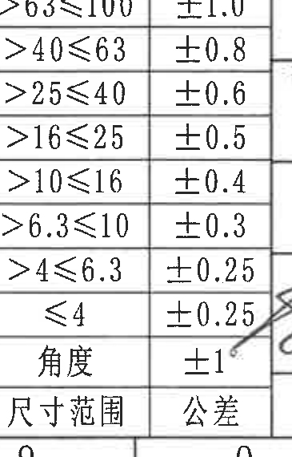

原图位置/视图名称：第 1 页底部偏右，公差栏。  
边界归属说明：裁切包含“尺寸范围/公差”两列及全部可见公差行；右侧有标题栏手写签名区的少量笔迹边缘贴近表格外框，该笔迹归属 object_10，不作为公差表内容提取。原图中“尺寸范围/公差”表头位于裁切图底部。

### 原表还原

| 尺寸范围 | 公差 |
|---|---|
| >63≤100 | ±1.0 |
| >40≤63 | ±0.8 |
| >25≤40 | ±0.6 |
| >16≤25 | ±0.5 |
| >10≤16 | ±0.4 |
| >6.3≤10 | ±0.3 |
| >4≤6.3 | ±0.25 |
| ≤4 | ±0.25 |
| 角度 | ±1° |

### 提取表

| 提取项 | 原图数值或文本 | 含义说明 |
|---|---|---|
| 尺寸范围 >63≤100 | ±1.0 | 未注线性尺寸在该范围内的公差。 |
| 尺寸范围 >40≤63 | ±0.8 | 未注线性尺寸在该范围内的公差。 |
| 尺寸范围 >25≤40 | ±0.6 | 未注线性尺寸在该范围内的公差。 |
| 尺寸范围 >16≤25 | ±0.5 | 未注线性尺寸在该范围内的公差。 |
| 尺寸范围 >10≤16 | ±0.4 | 未注线性尺寸在该范围内的公差。 |
| 尺寸范围 >6.3≤10 | ±0.3 | 未注线性尺寸在该范围内的公差。 |
| 尺寸范围 >4≤6.3 | ±0.25 | 未注线性尺寸在该范围内的公差。 |
| 尺寸范围 ≤4 | ±0.25 | 未注线性尺寸在该范围内的公差。 |
| 角度 | ±1° | 未注角度尺寸公差。 |

## object_9：明细表 / BOM

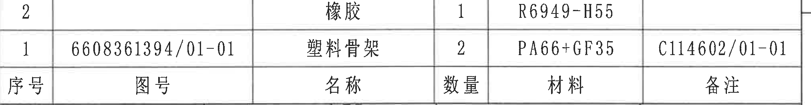

原图位置/视图名称：第 1 页右下标题栏上方，零件明细表。  
边界归属说明：裁切包含明细表两条物料记录及列名行；下方与标题栏共用边界线，标题栏字段不纳入本对象。原图中列名“序号/图号/名称/数量/材料/备注”位于记录下方。

### 原表还原

| 序号 | 图号 | 名称 | 数量 | 材料 | 备注 |
|---|---|---|---|---|---|
| 2 |  | 橡胶 | 1 | R6949-H55 |  |
| 1 | 6608361394/01-01 | 塑料骨架 | 2 | PA66+GF35 | C114602/01-01 |

### 提取表

| 提取项 | 原图数值或文本 | 含义说明 |
|---|---|---|
| 明细序号 2 | 名称:橡胶；数量:1；材料:R6949-H55 | 橡胶件明细记录，图号和备注为空白。 |
| 明细序号 1 | 图号:6608361394/01-01；名称:塑料骨架；数量:2；材料:PA66+GF35；备注:C114602/01-01 | 塑料骨架明细记录。 |

## object_10：标题栏

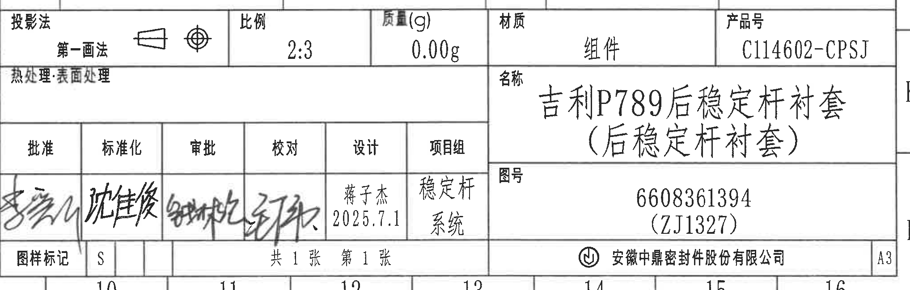

原图位置/视图名称：第 1 页右下角标题栏。  
边界归属说明：裁切包含标题栏主体、投影法、比例、质量、材质、产品号、名称、图号、签署栏、图样标记、张数、公司名和图幅；上边缘与 object_9 明细表相接，明细表记录不纳入本标题栏。左侧少量相邻公差表边界不作为标题栏字段提取。

### 原表还原

| 字段 | 原图数值或文本 |
|---|---|
| 投影法 | 第一画法（含第一角法投影符号） |
| 比例 | 2:3 |
| 质量(g) | 0.00g |
| 材质 | 组件 |
| 产品号 | C114602-CPSJ |
| 热处理·表面处理 | 空白 |
| 名称 | 吉利P789后稳定杆衬套（后稳定杆衬套） |
| 图号 | 6608361394（ZJ1327） |
| 批准 | 手写签名，无法可靠辨读 |
| 标准化 | 沈佳俊 |
| 审批 | 手写签名，无法可靠辨读 |
| 校对 | 手写签名，无法可靠辨读 |
| 设计 | 蒋子杰；2025.7.1 |
| 项目组 | 稳定杆系统 |
| 图样标记 | S |
| 张数 | 共1张 第1张 |
| 公司 | 安徽中鼎密封件股份有限公司 |
| 图幅 | A3 |

### 提取表

| 提取项 | 原图数值或文本 | 含义说明 |
|---|---|---|
| 产品号 | C114602-CPSJ | 标题栏产品编号。 |
| 图号 | 6608361394（ZJ1327） | 图纸编号及括号内编号。 |
| 名称 | 吉利P789后稳定杆衬套（后稳定杆衬套） | 图纸标题/零件名称。 |
| 比例 | 2:3 | 图样比例。 |
| 质量 | 0.00g | 标题栏质量字段。 |
| 材质 | 组件 | 标题栏材质字段。 |
| 投影法 | 第一画法 | 表示采用第一角法投影。 |
| 设计 | 蒋子杰 2025.7.1 | 设计责任人和日期。 |
| 项目组 | 稳定杆系统 | 所属项目组。 |
| 图样标记 | S | 图样标记字段。 |
| 张数 | 共1张 第1张 | 单张图纸。 |
| 公司 | 安徽中鼎密封件股份有限公司 | 出图单位。 |

## 裁切检查记录

| 对象 | 图片路径 | 检查结果 |
|---|---|---|
| page_1 | outputs/20C114602_assets/images/page_1.png | 整页 PNG 已由 PDF 渲染，页面完整，尺寸 4959 x 3505 px。 |
| object_1 | outputs/20C114602_assets/images/object_1.png | 表1全部表头、行列线和文字完整；未混入加工视图。 |
| object_2 | outputs/20C114602_assets/images/object_2.png | 修订表列完整；右侧靠近图框行号，图框行号不提取。 |
| object_3 | outputs/20C114602_assets/images/object_3.png | 端面主视图尺寸线、箭头、Ø24±0.3☆、R23±0.5、两个 23±0.5 和“硬度测试面”完整；未带入 A-A 剖面的 `(2.5)`。 |
| object_4 | outputs/20C114602_assets/images/object_4.png | A-A 剖面轮廓、剖面线、`(2.5)`、`(29)`、35±0.5、`(40)`、41±0.8 和视图名完整。 |
| object_5 | outputs/20C114602_assets/images/object_5.png | 轴测图和 X/Y/Z 方向标完整；未带入 NOTES 文字。 |
| object_6 | outputs/20C114602_assets/images/object_6.png | 技术要求 1-8 条完整；为保留第 6 条完整文本，右上保留轴测坐标局部线段，该线段归属 object_5。 |
| object_7 | outputs/20C114602_assets/images/object_7.png | 产品信息表标题、表头和值完整；下方图框坐标行已排除。 |
| object_8 | outputs/20C114602_assets/images/object_8.png | 公差表各行文字完整；右侧少量签字笔迹边缘属于标题栏，不提取为公差内容。 |
| object_9 | outputs/20C114602_assets/images/object_9.png | 明细表两条记录和列名完整；下方标题栏不纳入本对象。 |
| object_10 | outputs/20C114602_assets/images/object_10.png | 标题栏字段完整；手写签名部分按可辨识程度提取，不可靠辨读的签名已标注。 |
