# 20C114603 图纸内容识别

整页渲染图：`outputs/20C114603_assets/images/page_1.png`，像素尺寸 4959 x 3505。

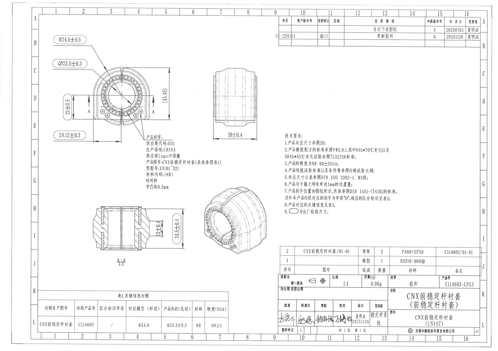

说明：以下 bbox 均以整页 PNG 左上角为原点，格式为 `[x, y, width, height]`。

## object_1 主视图 / 前端加工视图

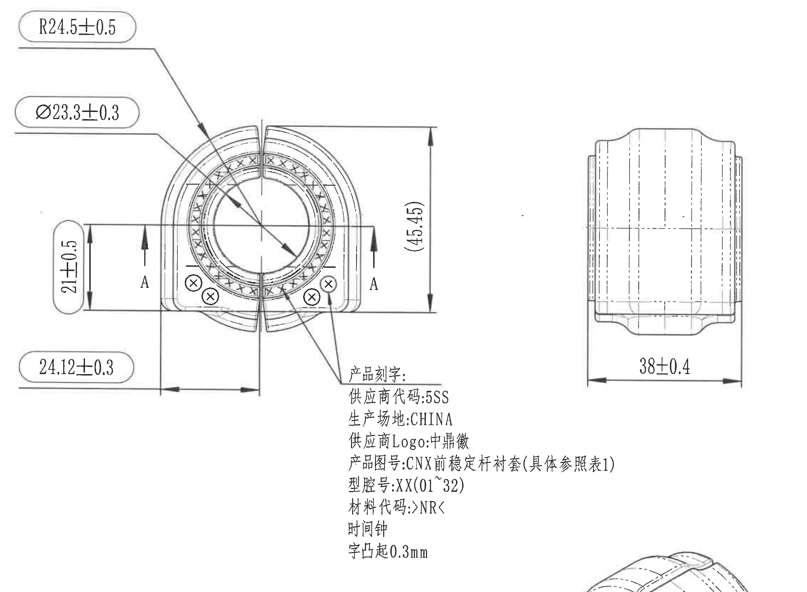

原图位置/视图名称：第 1 页左上主视图，bbox `[480, 320, 2260, 1660]`。

| 提取项 | 原图数值或文本 | 含义说明 |
|---|---|---|
| 半径尺寸 | R24.5±0.5 | 圆弧半径尺寸，标注框为圆角矩形，按技术要求第 9 条为出厂检验尺寸。 |
| 直径尺寸 | Ø23.3±0.3 | 内孔/产品内径相关直径；表 1 中对应“产品内径(孔径)”同为 φ23.3±0.3。 |
| 垂直尺寸 | 21±0.5 | 主视图左侧局部高度尺寸，带上下箭头和公差 ±0.5。 |
| 参考尺寸 | (45.45) | 主视图右侧总高度参考尺寸，括号表示参考尺寸，不作为直接检验公差尺寸。 |
| 水平尺寸 | 24.12±0.3 | 主视图底部水平定位/宽度尺寸，带公差 ±0.3，标注框为出厂检验尺寸。 |
| 剖切标识 | A / A | 主视图两侧剖切箭头，指示 A-A 剖视方向；A-A 剖视图见 object_3。 |
| 刻字引线 | 产品刻字 | 引线从主视图下部特征指向产品刻字位置；刻字明细另见 object_10、object_11、object_12。 |
| 数量/角度/弧向尺寸 | 未见 | 本主视图未见数量前缀、角度尺寸、弧向尺寸、T 编号或星号关键尺寸。 |

边界归属说明：该裁切为了完整保留主视图尺寸线、A-A 剖切标识和刻字引线，右侧同框可见侧视图及其 `38±0.4` 尺寸、下方可见少量轴测图边缘；这些邻近内容不归入主视图提取，侧视图尺寸只归 object_2，轴测图只归 object_4。主视图中带圆角框的尺寸按技术要求第 9 条解释为出厂检验尺寸。

## object_2 右上侧视图

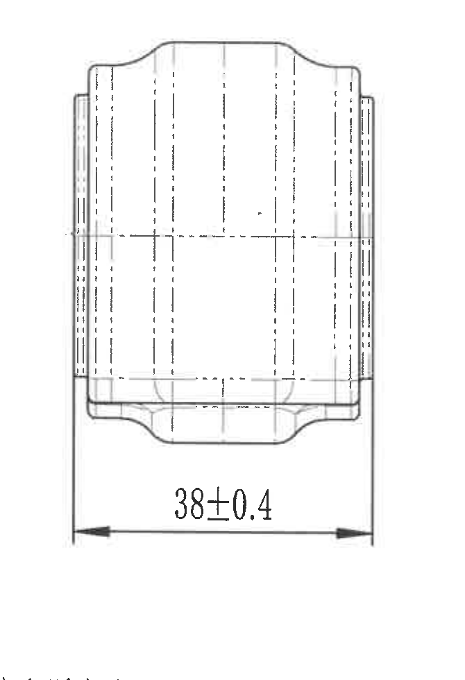

原图位置/视图名称：第 1 页上中偏右侧视图，bbox `[2020, 620, 670, 980]`。

| 提取项 | 原图数值或文本 | 含义说明 |
|---|---|---|
| 水平总宽尺寸 | 38±0.4 | 侧视图底部两端箭头之间的整体宽度/长度尺寸，带公差 ±0.4。 |
| 轮廓与隐藏线 | 侧视轮廓、中心线、虚线 | 表示零件侧向外形、内部轮廓和对称/中心关系。 |
| 其他尺寸 | 未见 | 本侧视图未见角度、半径、直径、数量前缀、T 编号或星号关键尺寸。 |

边界归属说明：该裁切完整包含侧视图轮廓、底部尺寸线、箭头和 `38±0.4` 文本；没有把该尺寸归入主视图。底部左侧仅有极少空白，不含其他视图有效内容。

## object_3 A-A 剖视图

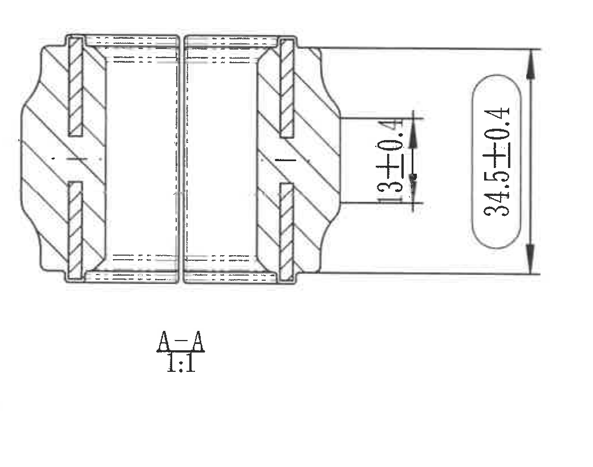

原图位置/视图名称：第 1 页左下 A-A 剖视图，bbox `[890, 2000, 1040, 820]`。

| 提取项 | 原图数值或文本 | 含义说明 |
|---|---|---|
| 剖视名称 | A-A | 与主视图中的 A-A 剖切箭头对应。 |
| 比例 | 1:1 | 剖视图比例。 |
| 局部垂直尺寸 | 13±0.4 | 剖视图右侧局部高度/台阶尺寸，带公差 ±0.4。 |
| 总高度尺寸 | 34.5±0.4 | 剖视图右侧整体高度尺寸，带公差 ±0.4。 |
| 剖面线 | 斜剖面线 | 表示被剖切的材料区域。 |
| 其他尺寸 | 未见 | 本剖视图未见直径符号、半径符号、角度、弧向尺寸、数量前缀、T 编号或星号关键尺寸。 |

边界归属说明：裁切包含 A-A 剖面全部剖线、尺寸线、箭头、`13±0.4`、`34.5±0.4` 和视图名；没有纳入主视图、轴测图或标题栏内容。

## object_4 轴测图

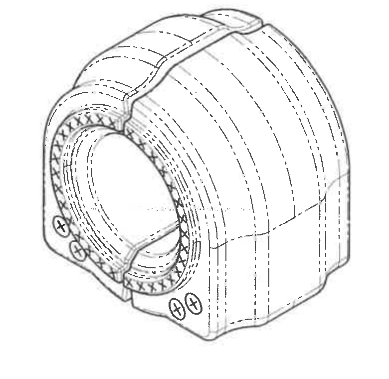

原图位置/视图名称：第 1 页下中轴测图，bbox `[1950, 1850, 780, 760]`。

| 提取项 | 原图数值或文本 | 含义说明 |
|---|---|---|
| 轴测形体 | 3D 轴测外形 | 展示衬套整体三维形状、开口、内孔、外轮廓及前端圆形标识位置。 |
| 剖面/材料表达 | 局部剖面线 | 轴测图前端局部用剖面线表现材料或截面结构。 |
| 尺寸文字 | 未见 | 轴测图无独立尺寸值、角度、半径、直径、公差、T 编号或星号关键尺寸。 |

边界归属说明：裁切只包含轴测图主体，不提取相邻刻字说明或技术要求文字。

## object_5 技术要求 / NOTES

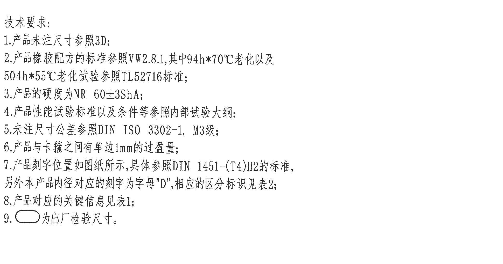

原图位置/视图名称：第 1 页右中技术要求，bbox `[2820, 1270, 1940, 1020]`。

| 提取项 | 原图数值或文本 | 含义说明 |
|---|---|---|
| 1 | 产品未注尺寸参照3D; | 未在 2D 图纸标出的尺寸以 3D 数据为准。 |
| 2 | 产品橡胶配方的标准参照VW2.8.1, 其中94h*70°C老化以及504h*55°C老化试验参照TL52716标准; | 橡胶配方和老化试验标准要求。 |
| 3 | 产品的硬度为NR 60±3ShA; | 材料为 NR，硬度要求 60±3 Shore A。 |
| 4 | 产品性能试验标准以及条件等参照内部试验大纲; | 性能试验按内部大纲执行。 |
| 5 | 未注尺寸公差参照DIN ISO 3302-1. M3级; | 未注尺寸公差等级为 DIN ISO 3302-1 M3。 |
| 6 | 产品与卡箍之间有单边1mm的过盈量; | 与卡箍配合时单边过盈 1 mm。 |
| 7 | 产品刻字位置如图纸所示, 具体参照DIN 1451-(T4)H2的标准, 另外本产品内径对应的刻字为字母"D", 相应的区分标识见表2; | 规定刻字位置、字体标准和内径对应刻字标识。 |
| 8 | 产品对应的关键信息见表1; | 关键信息由表 1 给出。 |
| 9 | 圆角矩形标注为出厂检验尺寸。 | 图中用圆角矩形框圈住的尺寸需作为出厂检验尺寸。 |

边界归属说明：技术要求裁切完整包含 1-9 条文字及第 9 条圆角矩形符号，不包含右下标题栏或左侧视图。

## object_6 修订履历表

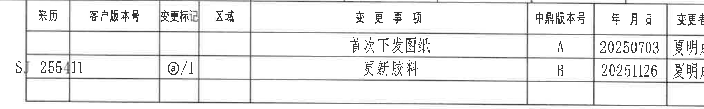

原图位置/视图名称：第 1 页右上修订履历表，bbox `[2700, 160, 2045, 320]`。

原表还原：

| 来历 | 客户版本号 | 变更标记 | 区域 | 变更事项 | 中鼎版本号 | 年月日 | 变更者 |
|---|---|---|---|---|---|---|---|
|  |  |  |  | 首次下发图纸 | A | 20250703 | 夏明成 |
| SJ-255411 |  | ⓐ/1 |  | 更新胶料 | B | 20251126 | 夏明成 |

| 提取项 | 原图数值或文本 | 含义说明 |
|---|---|---|
| 版本 A | 首次下发图纸 / 20250703 / 夏明成 | 首次发行记录。 |
| 版本 B | SJ-255411 / ⓐ/1 / 更新胶料 / 20251126 / 夏明成 | 胶料更新记录，关联来历 SJ-255411 和变更标记 ⓐ/1。 |

边界归属说明：表格左侧来历字段、右侧变更者列均完整可读；裁切右侧靠近外图框坐标字母 A/B，但坐标字母不作为表格内容提取。

## object_7 表1.关键信息对照

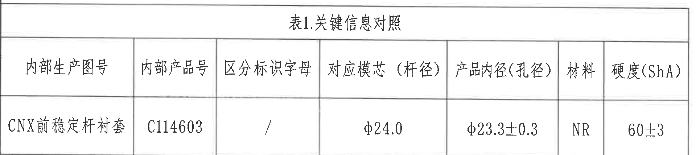

原图位置/视图名称：第 1 页左下表 1，bbox `[375, 2890, 1930, 430]`。

原表还原：

| 内部生产图号 | 内部产品号 | 区分标识字母 | 对应模芯（杆径） | 产品内径(孔径) | 材料 | 硬度(ShA) |
|---|---|---|---|---|---|---|
| CNX前稳定杆衬套 | C114603 | / | φ24.0 | φ23.3±0.3 | NR | 60±3 |

| 提取项 | 原图数值或文本 | 含义说明 |
|---|---|---|
| 内部生产图号 | CNX前稳定杆衬套 | 产品内部生产名称。 |
| 内部产品号 | C114603 | 产品内部编号。 |
| 区分标识字母 | / | 本表未给出区分字母。 |
| 对应模芯（杆径） | φ24.0 | 对应模芯/杆径尺寸。 |
| 产品内径(孔径) | φ23.3±0.3 | 产品孔径尺寸，与主视图 Ø23.3±0.3 对应。 |
| 材料 | NR | 橡胶材料。 |
| 硬度(ShA) | 60±3 | Shore A 硬度范围。 |

边界归属说明：表格外框、表头和数据行完整；裁切下缘不提取图框坐标编号。

## object_8 明细表 / 组成材料表

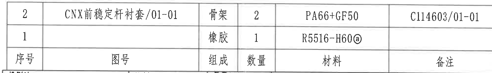

原图位置/视图名称：第 1 页右下上部明细表，bbox `[2760, 2450, 2000, 300]`。

原表还原：

| 序号 | 图号 | 组成 | 数量 | 材料 | 备注 |
|---|---|---|---|---|---|
| 2 | CNX前稳定杆衬套/01-01 | 骨架 | 2 | PA66+GF50 | C114603/01-01 |
| 1 |  | 橡胶 | 1 | R5516-H60ⓐ |  |

| 提取项 | 原图数值或文本 | 含义说明 |
|---|---|---|
| 序号 2 | 骨架 / 数量 2 / PA66+GF50 / C114603/01-01 | 骨架材料和数量。 |
| 序号 1 | 橡胶 / 数量 1 / R5516-H60ⓐ | 橡胶材料和数量，胶料标识含圈 a。 |

边界归属说明：明细表三行和六列完整可读；裁切下缘靠近标题栏上边界，标题栏字段另见 object_9，不在本对象提取。

## object_9 标题栏

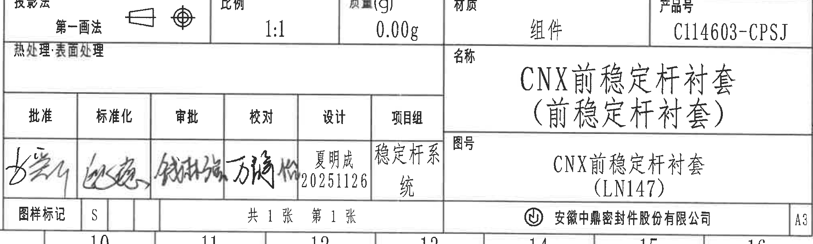

原图位置/视图名称：第 1 页右下标题栏，bbox `[2760, 2760, 2020, 610]`。

标题栏字段还原：

| 字段 | 原图文本 |
|---|---|
| 投影法 | 第一画法，含第一角法投影符号 |
| 比例 | 1:1 |
| 质量(g) | 0.00g |
| 材质 | 组件 |
| 产品号 | C114603-CPSJ |
| 热处理·表面处理 | 空白 |
| 名称 | CNX前稳定杆衬套（前稳定杆衬套） |
| 图号 | CNX前稳定杆衬套（LN147） |
| 图样标记 | S |
| 页数 | 共 1 张 第 1 张 |
| 公司 | 安徽中鼎密封件股份有限公司 |
| 图幅 | A3 |

签署栏还原：

| 批准 | 标准化 | 审批 | 校对 | 设计 | 项目组 |
|---|---|---|---|---|---|
| 手写签名 | 手写签名 | 手写签名 | 手写签名 | 夏明成 20251126 | 稳定杆系统 |

| 提取项 | 原图数值或文本 | 含义说明 |
|---|---|---|
| 产品号 | C114603-CPSJ | 标题栏产品号。 |
| 名称 | CNX前稳定杆衬套（前稳定杆衬套） | 图纸名称。 |
| 图号 | CNX前稳定杆衬套（LN147） | 图号/项目识别。 |
| 比例与质量 | 1:1 / 0.00g | 图纸比例和标称质量。 |
| 设计 | 夏明成 20251126 | 设计责任人和日期。 |

边界归属说明：标题栏主体、签署栏、公司名和 A3 图幅完整；底部可见少量外图框坐标编号，不作为标题栏字段提取。

## object_10 产品刻字局部说明一

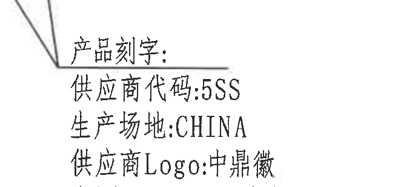

原图位置/视图名称：第 1 页主视图右下刻字局部，bbox `[1340, 1285, 690, 310]`。

| 提取项 | 原图数值或文本 | 含义说明 |
|---|---|---|
| 刻字标题 | 产品刻字: | 说明后续文字为产品刻字内容。 |
| 供应商代码 | 5SS | 需刻在产品上的供应商代码。 |
| 生产场地 | CHINA | 需刻在产品上的生产场地。 |
| 供应商 Logo | 中鼎徽 | 需刻供应商 Logo。 |

边界归属说明：该局部只包含刻字引线标题和前三行刻字内容，不包含侧视图尺寸 `38±0.4`。

## object_11 产品刻字局部说明二

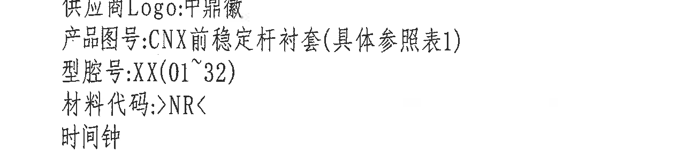

原图位置/视图名称：第 1 页主视图右下刻字局部，bbox `[1340, 1545, 1280, 290]`。

| 提取项 | 原图数值或文本 | 含义说明 |
|---|---|---|
| 供应商 Logo | 中鼎徽 | 与 object_10 最后一行衔接。 |
| 产品图号 | CNX前稳定杆衬套(具体参照表1) | 刻字中的产品图号说明，括号内容表示具体参照表 1。 |
| 型腔号 | XX(01~32) | 刻字中的型腔号范围，01 至 32。 |
| 材料代码 | >NR< | 刻字中的材料代码。 |
| 时间钟 | 时间钟 | 表示产品上需有时间钟刻字/日期钟标识。 |

边界归属说明：该局部只提取刻字说明文字；下缘已避开轴测图主体，未提取任何轴测图尺寸或形体信息。

## object_12 产品刻字局部说明三

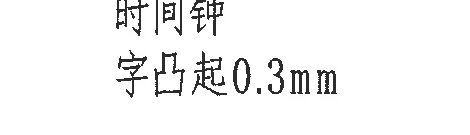

原图位置/视图名称：第 1 页主视图右下刻字局部，bbox `[1340, 1790, 470, 135]`。

| 提取项 | 原图数值或文本 | 含义说明 |
|---|---|---|
| 时间钟 | 时间钟 | 与 object_11 末行相邻，表示时间钟标识。 |
| 字凸起 | 字凸起0.3mm | 刻字凸起高度为 0.3 mm。 |

边界归属说明：该局部仅用于补全刻字说明最后一行，未提取邻近 A-A 剖视图或轴测图内容。

## 裁切检查记录

| 对象 | 检查结果 |
|---|---|
| page_1.png | 整页 PNG 渲染完整，包含图框、全部视图、表格、技术要求和标题栏。 |
| object_1.png | 主视图尺寸线、箭头、标注文字、A-A 标识和刻字引线完整；同框可见侧视图和轴测图边缘，已在归属说明中排除。 |
| object_2.png | 侧视图和 `38±0.4` 尺寸线完整，无边缘文字裁断。 |
| object_3.png | A-A 剖视图、`13±0.4`、`34.5±0.4`、剖视名和比例完整。 |
| object_4.png | 轴测图主体完整，无尺寸文字裁断。 |
| object_5.png | 技术要求 1-9 条文字完整，圆角矩形符号完整。 |
| object_6.png | 修订履历表行列完整；右侧靠近外图框坐标字母，但表格字段未裁断。 |
| object_7.png | 表 1 标题、表头和数据行完整，未把底部坐标编号作为表格内容。 |
| object_8.png | 明细表表头和两条物料记录完整；下缘靠近标题栏但不提取标题栏内容。 |
| object_9.png | 标题栏、签署栏、公司名和 A3 图幅完整；底部外图框坐标编号可见但不归属标题栏。 |
| object_10.png | 刻字标题及前三行完整，无侧视图尺寸混入。 |
| object_11.png | 刻字中间说明完整，未提取其他视图内容。 |
| object_12.png | `字凸起0.3mm` 完整，作为刻字局部补充。 |

