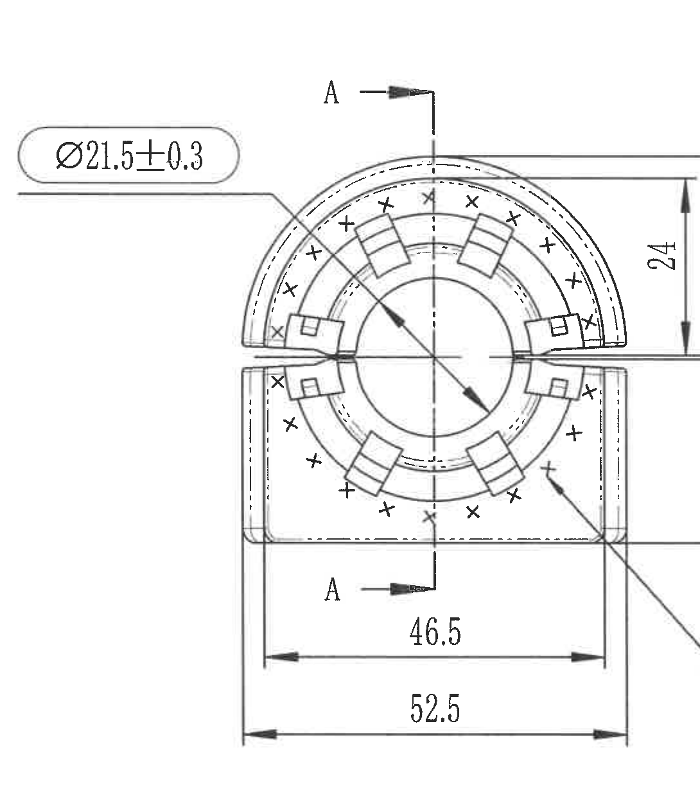
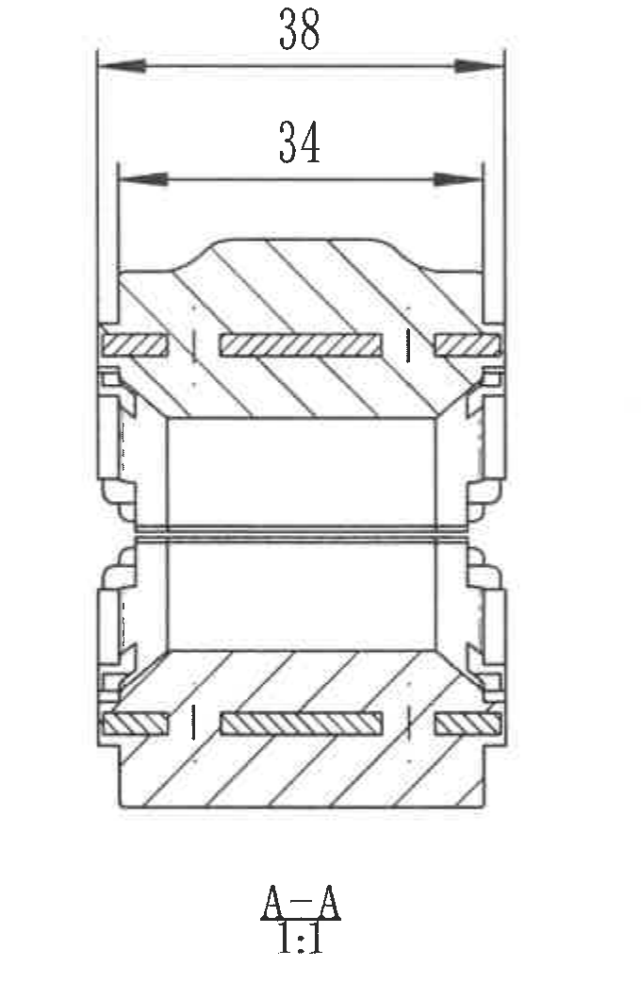
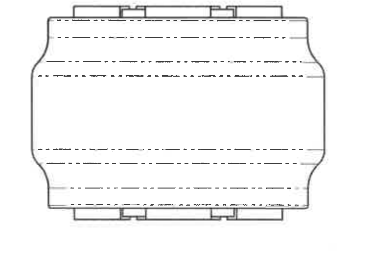
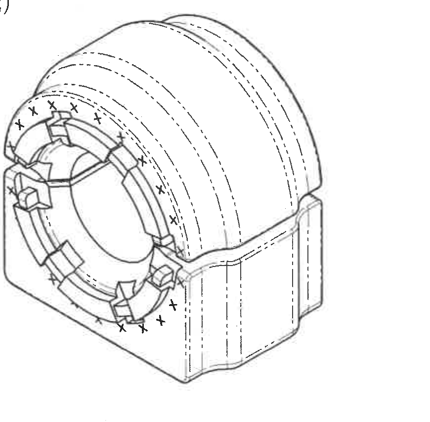
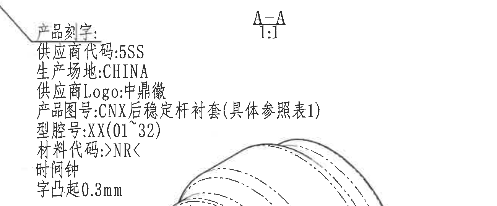
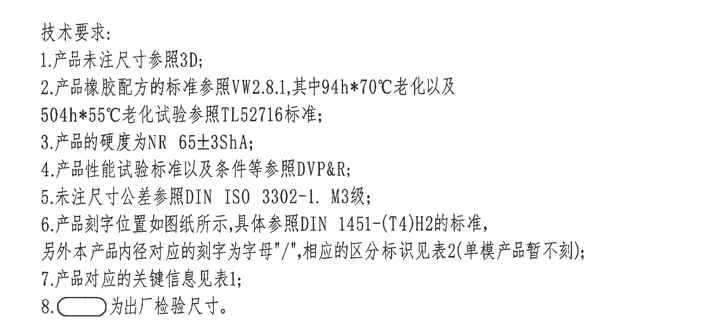
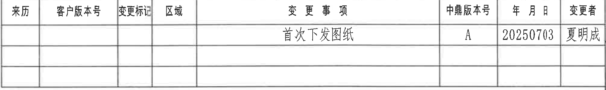
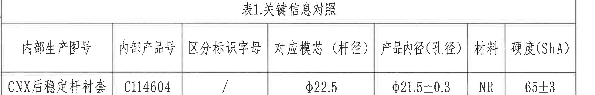
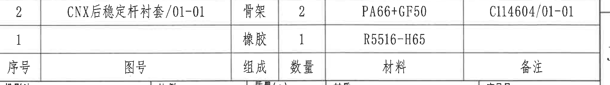
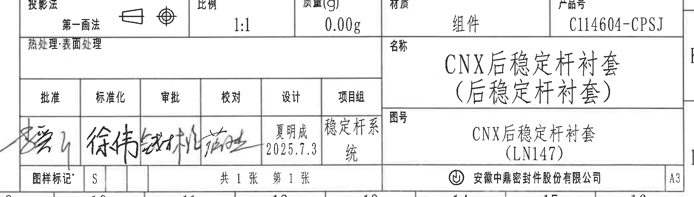

# 20C114604 内容识别

整页渲染图：`outputs/20C114604_assets/images/page_1.png`

页面信息：第 1 页，整页 PNG 尺寸 4959 x 3505 px。

## object_1 - 主视图

原图位置/视图名称：第 1 页，左上主视图，bbox `[420, 390, 1510, 1640]`。

| 提取项 | 原图数值或文本 | 含义说明 |
|---|---|---|
| 出厂检验尺寸 | Ø21.5±0.3 | 内孔直径尺寸，带直径符号和 ±0.3 公差；外加圆角长框，按技术要求第 8 条属于出厂检验尺寸。 |
| 剖切基准 | A / A | 上下两个 A 剖切箭头，表示此主视图中取 A-A 剖面，箭头方向指向剖视观察方向。 |
| 垂直尺寸 | 24 | 上半部从中间水平基准线到上部外形/尺寸界线的高度尺寸。 |
| 垂直尺寸 | 27±0.3 | 上半部外侧总高度尺寸，带 ±0.3 公差；尺寸文字竖排，右侧圆角长框标注。 |
| 垂直尺寸 | 25±0.3 | 下半部外侧总高度尺寸，带 ±0.3 公差；尺寸文字竖排，右侧圆角长框标注。 |
| 水平尺寸 | 46.5 | 下部内侧宽度/台阶间距，尺寸线位于主视图下方内侧。 |
| 水平总宽 | 52.5 | 主视图整体底部宽度，尺寸线位于最下方。 |
| 刻字引线 | 从右下角区域引出 | 引线从主视图右下区域引向产品刻字说明；文字内容归属 object_5。 |
| 前端标记 | 多处 “+” 与 “x” | 分布在内径周边和前端环形区域的刻字/区分标识位置示意；具体字母/标识规则见产品刻字说明和技术要求。 |

边界归属说明：本裁切只提取主视图内尺寸、A-A 剖切箭头和从主视图发出的刻字引线。右侧产品刻字文字未纳入本对象，归属 object_5；A-A 剖视图尺寸不归入本对象。

## object_2 - A-A 剖视图

原图位置/视图名称：第 1 页，右上 A-A 剖视图，bbox `[1815, 380, 2495, 1440]`。

| 提取项 | 原图数值或文本 | 含义说明 |
|---|---|---|
| 剖面名称 | A-A | 与主视图 A/A 剖切箭头对应的剖视图名称。 |
| 比例 | 1:1 | 剖视图绘图比例。 |
| 外侧宽度 | 38 | 剖视图顶部外侧总宽度尺寸，尺寸线横跨最外侧尺寸界线。 |
| 内侧宽度 | 34 | 剖视图顶部内侧宽度尺寸，尺寸线位于 38 尺寸线下方。 |
| 剖面线 | 斜向剖面线 | 表示被剖切实体材料区域。 |
| 中间孔/通道 | 剖视中心开口 | 表示零件内孔/通道在 A-A 剖面中的形态；该对象内未标注直径尺寸。 |

边界归属说明：本裁切完整包含剖视外形、剖面线、A-A 标题、1:1 比例和 38、34 两条尺寸线。主视图的 24、27±0.3、25±0.3、46.5、52.5、Ø21.5±0.3 不归入本对象。

## object_3 - 侧向视图

原图位置/视图名称：第 1 页，左下侧向视图，bbox `[735, 1760, 1495, 2280]`。

| 提取项 | 原图数值或文本 | 含义说明 |
|---|---|---|
| 侧向外形 | 无尺寸文字 | 显示零件侧向轮廓，上下有局部凸台/齿形结构。 |
| 隐藏线 | 多条虚线/点划线 | 表示内孔、内腔或不可见轮廓位置。 |
| 尺寸标注 | 未见独立尺寸数值 | 该视图内没有独立标注尺寸、角度、弧度、基准字母或公差。 |

边界归属说明：本裁切只包含侧向视图，不包含主视图、轴测图、表格或技术要求文字；没有从相邻视图提取尺寸。

## object_4 - 轴测图

原图位置/视图名称：第 1 页，中下轴测图，bbox `[1830, 1625, 2700, 2480]`。

| 提取项 | 原图数值或文本 | 含义说明 |
|---|---|---|
| 轴测外观 | 无尺寸文字 | 立体显示零件外形、前端环形结构、上部弧形罩和下部支撑体。 |
| 标记 | 多处 “x” | 前端环形区域周边的标识/刻字位置示意。 |
| 隐藏/轮廓线 | 多条虚线和实线 | 表示弧形外表面、内轮廓和背侧形状。 |
| 尺寸标注 | 未见独立尺寸数值 | 该轴测图内没有独立尺寸、公差、角度或剖切编号。 |

边界归属说明：本裁切优先保证轴测零件外轮廓完整。左上角有相邻产品刻字说明的极少残边，因进一步裁除会截断轴测前端轮廓；该残边不作为轴测图内容提取，产品刻字文本归属 object_5。

## object_5 - 产品刻字说明

原图位置/视图名称：第 1 页，主视图右下方产品刻字说明，bbox `[1430, 1290, 2730, 1830]`。

| 提取项 | 原图数值或文本 | 含义说明 |
|---|---|---|
| 标题 | 产品刻字: | 说明主视图引线指向的刻字要求。 |
| 供应商代码 | 5SS | 产品刻字内容之一。 |
| 生产场地 | CHINA | 产品刻字内容之一。 |
| 供应商 Logo | 中鼎徽 | 产品刻字内容之一，表示供应商标识。 |
| 产品图号 | CNX后稳定杆衬套(具体参照表1) | 产品刻字内容之一；图号名称需参照表 1 关键信息。 |
| 型腔号 | XX(01~32) | 产品刻字内容之一，型腔编号范围 01 到 32。 |
| 材料代码 | >NR< | 产品刻字内容之一，材料代码按尖括号格式刻印。 |
| 时间钟 | 时间钟 | 产品刻字内容之一，表示时间钟刻印。 |
| 字凸起高度 | 字凸起0.3mm | 刻字凸起高度为 0.3 mm。 |

边界归属说明：本对象与 A-A 剖面标题、轴测图上缘在原图上距离很近。裁切保留完整刻字文本；图中右上 A-A/1:1 和右下轴测外形边缘属于邻近对象，不在本对象提取表中作为刻字内容解读。

## object_6 - 技术要求

原图位置/视图名称：第 1 页，右中技术要求，bbox `[2700, 1400, 4480, 2220]`。

| 提取项 | 原图数值或文本 | 含义说明 |
|---|---|---|
| 标题 | 技术要求: | 技术要求列表标题。 |
| 1 | 产品未注尺寸参照3D; | 未在二维图中标注的尺寸以 3D 数据为准。 |
| 2 | 产品橡胶配方的标准参照VW2.8.1, 其中94h*70℃老化以及504h*55℃老化试验参照TL52716标准; | 橡胶配方标准参照 VW2.8.1；94h*70℃ 与 504h*55℃ 老化试验参照 TL52716。 |
| 3 | 产品的硬度为NR 65±3ShA; | 产品硬度要求为 NR 65±3 ShA。 |
| 4 | 产品性能试验标准以及条件等参照DVP&R; | 性能试验标准和条件按 DVP&R。 |
| 5 | 未注尺寸公差参照DIN ISO 3302-1. M3级; | 未注尺寸公差采用 DIN ISO 3302-1，M3 级。 |
| 6 | 产品刻字位置如图纸所示, 具体参照DIN 1451-(T4)H2的标准, 另外本产品内径对应的刻字为字母“/”, 相应的区分标识见表2(单模产品暂不刻); | 刻字位置按图纸，刻字标准按 DIN 1451-(T4)H2；内径对应刻字为字母“/”；区分标识见表 2，单模产品暂不刻。 |
| 7 | 产品对应的关键信息见表1; | 关键信息应查看 object_8 的表 1。 |
| 8 | 圆角长框 为出厂检验尺寸。 | 图中圆角长框包围的尺寸为出厂检验尺寸，例如主视图 Ø21.5±0.3、27±0.3、25±0.3。 |

边界归属说明：本裁切只包含技术要求文字。右下标题栏、下方明细表和左侧轴测图不归入本对象。

## object_7 - 修订履历表

原图位置/视图名称：第 1 页，顶部右侧修订履历表，bbox `[2750, 160, 4760, 460]`。

| 来历 | 客户版本号 | 变更标记 | 区域 | 变更事项 | 中鼎版本号 | 年月日 | 变更者 |
|---|---|---|---|---|---|---|---|
|  |  |  |  | 首次下发图纸 | A | 20250703 | 夏明成 |
|  |  |  |  |  |  |  |  |
|  |  |  |  |  |  |  |  |

含义说明：该表记录图纸变更履历。当前有一条有效记录：中鼎版本号 A，日期 20250703，变更者夏明成，变更事项为首次下发图纸；其余行为空白。

边界归属说明：裁切从修订表上边线开始，不把图框坐标数字作为表格字段；右侧图框坐标字母不作为修订表内容提取。

## object_8 - 表1 关键信息对照

原图位置/视图名称：第 1 页，左下表 1 关键信息对照，bbox `[365, 2995, 2325, 3310]`。

| 内部生产图号 | 内部产品号 | 区分标识字母 | 对应模芯（杆径） | 产品内径(孔径) | 材料 | 硬度(ShA) |
|---|---|---|---|---|---|---|
| CNX后稳定杆衬套 | C114604 | / | φ22.5 | φ21.5±0.3 | NR | 65±3 |

含义说明：该表给出产品关键信息。内部产品号为 C114604；区分标识字母为 `/`；对应模芯/杆径为 φ22.5；产品内径/孔径为 φ21.5±0.3；材料为 NR；硬度为 65±3 ShA。

边界归属说明：裁切包含表 1 标题、表头和唯一数据行。下方图框坐标编号不作为表格内容提取。

## object_9 - 明细表/材料表

原图位置/视图名称：第 1 页，右下标题栏上方明细表，bbox `[2770, 2460, 4800, 2745]`。

| 序号 | 图号 | 组成 | 数量 | 材料 | 备注 |
|---|---|---|---|---|---|
| 2 | CNX后稳定杆衬套/01-01 | 骨架 | 2 | PA66+GF50 | C114604/01-01 |
| 1 |  | 橡胶 | 1 | R5516-H65 |  |

含义说明：明细表列出组件组成。序号 2 为骨架，数量 2，材料 PA66+GF50，备注 C114604/01-01；序号 1 为橡胶，数量 1，材料 R5516-H65。

边界归属说明：本裁切包含明细表完整两行和表头。下方投影法/比例/质量等标题栏内容归属 object_10。

## object_10 - 标题栏与签批区

原图位置/视图名称：第 1 页，右下标题栏与签批区，bbox `[2700, 2745, 4800, 3345]`。

| 提取项 | 原图数值或文本 | 含义说明 |
|---|---|---|
| 投影法 | 第一画法 | 投影法为第一画法，旁有投影视图符号。 |
| 比例 | 1:1 | 图纸比例。 |
| 质量(g) | 0.00g | 标题栏质量字段。 |
| 材质 | 组件 | 标题栏材质字段。 |
| 产品号 | C114604-CPSJ | 产品号字段。 |
| 热处理/表面处理 | 热处理:表面处理 | 处理字段，未见具体数值内容。 |
| 名称 | CNX后稳定杆衬套（后稳定杆衬套） | 产品名称。 |
| 图号 | CNX后稳定杆衬套（LN147） | 图号/项目名称字段。 |
| 批准 | 手写签名 | 签批栏。 |
| 标准化 | 手写签名 | 签批栏。 |
| 审批 | 手写签名 | 签批栏。 |
| 校对 | 手写签名 | 签批栏。 |
| 设计 | 夏明成 2025.7.3 | 设计者和日期。 |
| 项目组 | 稳定杆系统 | 项目组字段。 |
| 图样标记 | S | 图样标记字段。 |
| 页码 | 共 1 张 第 1 张 | 图纸张数和页序。 |
| 公司 | 安徽中鼎密封件股份有限公司 | 出图公司。 |
| 幅面 | A3 | 图纸幅面。 |

边界归属说明：本对象包含标题栏、投影法/比例/质量/材质/产品号字段、名称/图号字段、签批区、图样标记、页码、公司和 A3 幅面。上方明细表归属 object_9。

## 裁切检查记录

| 对象 | 检查结果 | 边界/完整性说明 |
|---|---|---|
| page_1 | 合格 | 整页 PNG 由 PDF 以 300 dpi 渲染，尺寸 4959 x 3505 px。 |
| object_1 | 合格 | 主视图尺寸线、箭头、Ø21.5±0.3、24、27±0.3、25±0.3、46.5、52.5 和 A/A 剖切箭头完整；未提取右侧刻字文字。 |
| object_2 | 合格 | A-A 剖视图、1:1、38、34 及剖面线完整，无相邻主视图尺寸混入。 |
| object_3 | 合格 | 侧向视图轮廓和隐藏线完整；该视图无独立尺寸文字。 |
| object_4 | 基本合格 | 轴测零件轮廓完整；左上有相邻刻字说明极少残边，继续裁除会影响外轮廓，未将残边提取为轴测信息。 |
| object_5 | 基本合格 | 产品刻字文本完整；因原图位置贴近，包含 A-A/1:1 和轴测上缘邻近片段，已在归属说明中排除，不作为刻字内容提取。 |
| object_6 | 合格 | 技术要求 1 至 8 条完整，未截断行首和行尾。 |
| object_7 | 合格 | 修订履历表表头、有效记录和空白行完整；未把图框坐标编号提取为表格字段。 |
| object_8 | 合格 | 表 1 标题、表头和数据行完整；下方图框坐标编号未作为表格内容。 |
| object_9 | 合格 | 明细表表头、序号 1 和 2 两行完整；下方标题栏未纳入本对象提取。 |
| object_10 | 合格 | 标题栏、签批区、名称/图号/公司/A3 信息完整；上方明细表不归入本对象。 |
