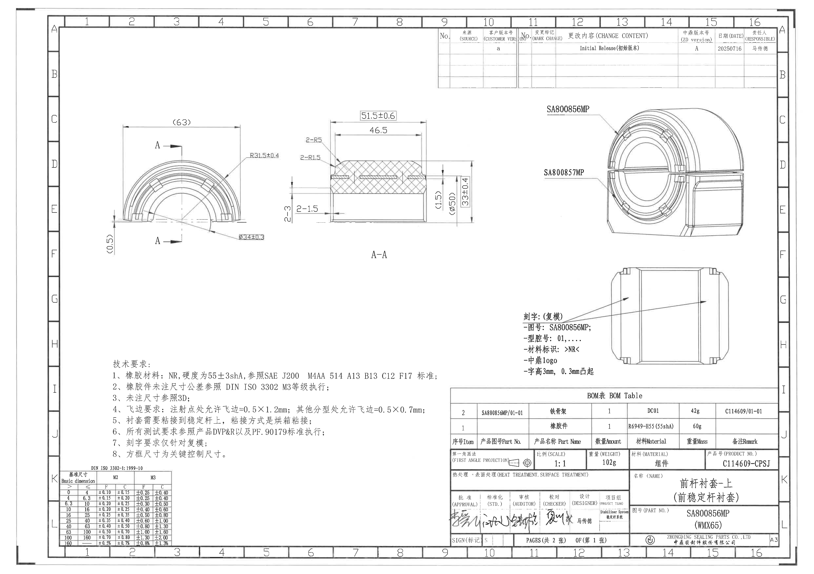
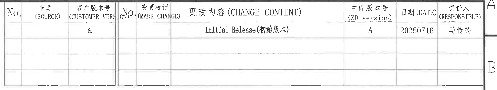
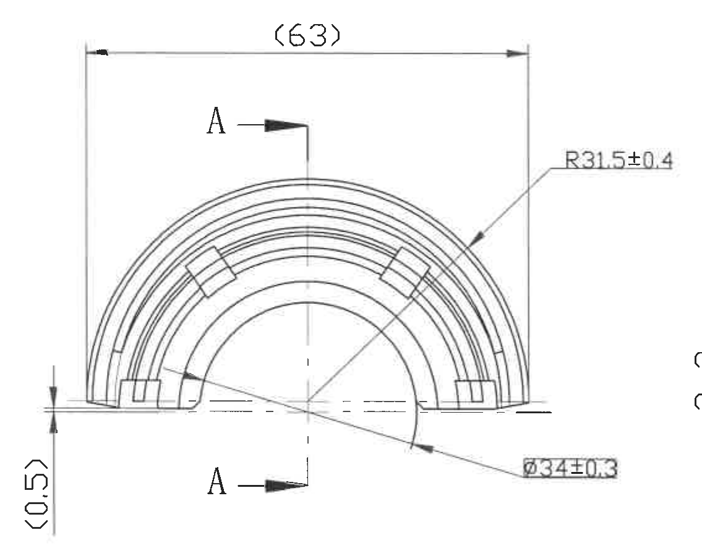
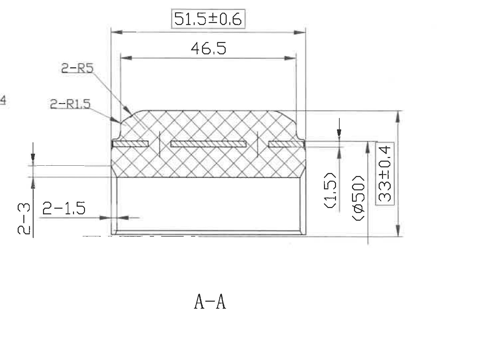
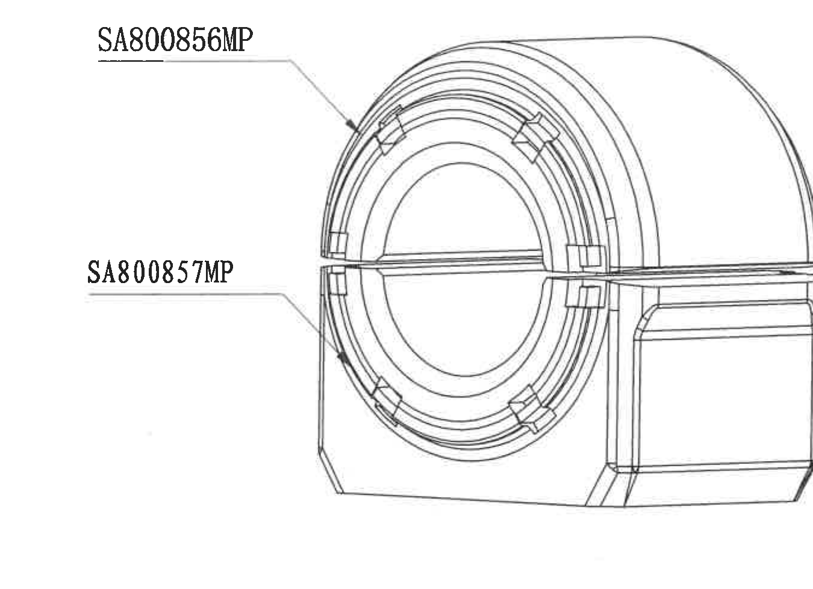
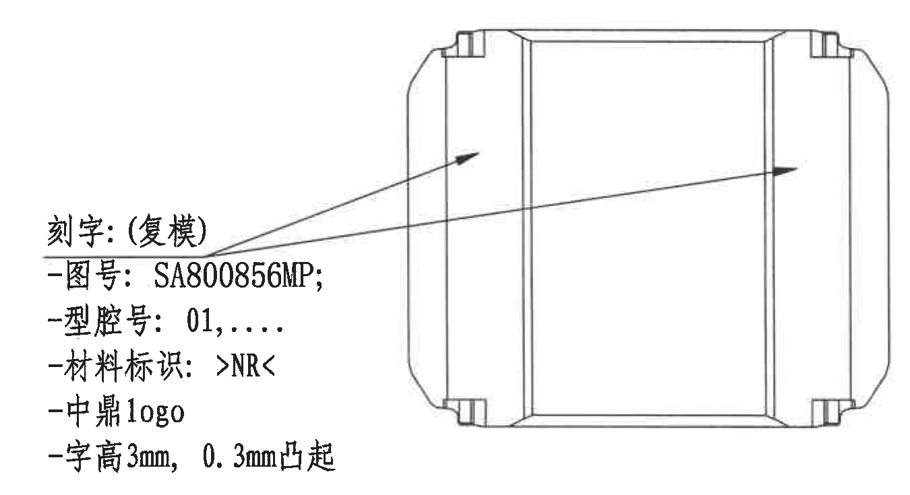
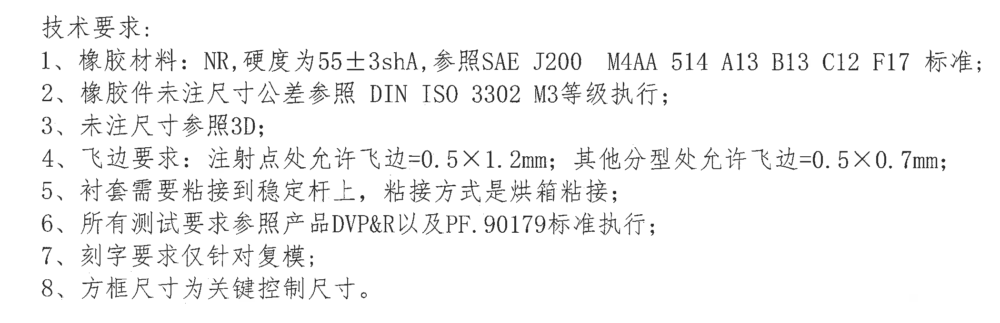
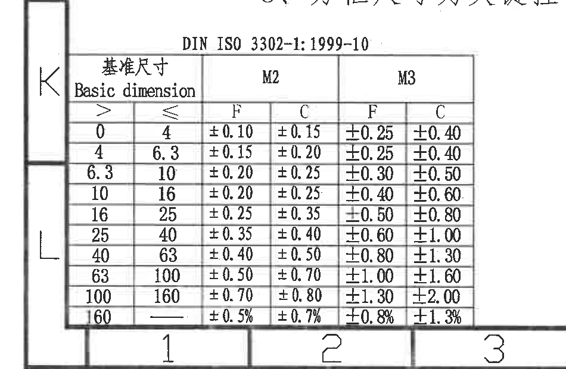
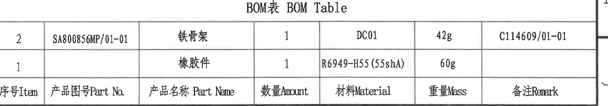
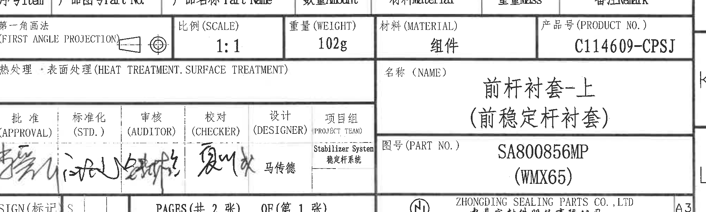

# 20C114609 PDF 内容识别

整页 PNG：

## object_7 顶部变更履历表

原图位置/视图名称：页面顶部 9-16 分区，变更履历表。

| No. | 来源(SOURCE) | 客户版本号(CUSTOMER VERSION) | No. | 变更标记(MARK CHANGE) | 更改内容(CHANGE CONTENT) | 中鼎版本号(ZD version) | 日期(DATE) | 责任人(RESPONSIBLE) |
|---|---|---|---|---|---|---|---|---|
|  |  | a |  |  | Initial Release(初始版本) | A | 20250716 | 马传德 |
|  |  |  |  |  |  |  |  |  |
|  |  |  |  |  |  |  |  |  |

| 提取项 | 原图数值或文本 | 含义说明 |
|---|---|---|
| 客户版本号 | a | 客户版本栏的版本标识。 |
| 更改内容 | Initial Release(初始版本) | 初始发布记录。 |
| 中鼎版本号 | A | 中鼎内部版本。 |
| 日期 | 20250716 | 变更/发布日期。 |
| 责任人 | 马传德 | 该版本记录责任人。 |

边界归属说明：表格右侧靠近图框 A/B 字母，图框字母不是表格内容；只提取表格内列名和行记录。

## object_1 左侧主视图/端面加工视图

原图位置/视图名称：页面左中 C-F 区域，主视图/端面加工视图。

| 提取项 | 原图数值或文本 | 含义说明 |
|---|---|---|
| 顶部参考外宽 | (63) | 半圆外形两端间水平参考尺寸；括号表示参考尺寸。 |
| 外弧半径 | R31.5±0.4 | 外圆/外弧半径，带 ±0.4 公差。 |
| 内孔/内圆直径 | Ø34±0.3 | 内圆直径尺寸，带 ±0.3 公差。 |
| 左下端面参考高度 | (0.5) | 左下竖向参考尺寸，括号表示参考尺寸。 |
| 剖切基准 | A-A | 两个 A 箭头标出剖切位置，对应中央 A-A 剖面视图。 |

边界归属说明：右侧邻近 A-A 剖视，主视图只提取与半圆端面轮廓直接连接的尺寸；A-A 剖视的 2-3、2-1.5 等标注不归入本视图。

## object_2 A-A 剖面视图

原图位置/视图名称：页面中央 C-F 区域，A-A 剖面视图。

| 提取项 | 原图数值或文本 | 含义说明 |
|---|---|---|
| 总长度 | 51.5±0.6 | 剖面顶部外侧总长，方框标注，按技术要求为关键控制尺寸。 |
| 内侧长度 | 46.5 | 剖面顶部内侧长度。 |
| 左上圆角数量半径 | 2-R5 | 两处 R5 圆角。 |
| 左侧圆角数量半径 | 2-R1.5 | 两处 R1.5 圆角。 |
| 左侧高度/厚度 | 2-3 | 两处尺寸 3 的高度/厚度标注。 |
| 左下台阶/槽宽 | 2-1.5 | 两处尺寸 1.5 的台阶/槽宽标注。 |
| 右侧局部参考厚度 | (1.5) | 右侧竖向参考尺寸，括号表示参考尺寸。 |
| 右侧参考外径 | (Ø50) | 右侧竖向参考直径，括号表示参考尺寸。 |
| 总高度 | 33±0.4 | 右侧方框标注总高度，带 ±0.4 公差，按技术要求为关键控制尺寸。 |
| 剖面名称 | A-A | 对应主视图 A-A 剖切方向。 |

边界归属说明：左侧与主视图相邻，剖视对象只提取与剖面轮廓、剖面线和剖面尺寸线直接连接的标注；主视图 R31.5±0.4 不归入 A-A。

## object_3 右上外观/装配示意视图

原图位置/视图名称：页面右上 C-E 区域，外观/装配示意视图。

| 提取项 | 原图数值或文本 | 含义说明 |
|---|---|---|
| 上方引出标注 | SA800856MP | 指向套体/本零件区域的零件标识。 |
| 下方引出标注 | SA800857MP | 指向相邻部件区域的标识。 |

边界归属说明：该视图没有独立尺寸线；只提取两个引出零件标识，底部刻字视图内容不归入本对象。

## object_4 右中刻字/复模局部视图

原图位置/视图名称：页面右中 G-H 区域，刻字/复模局部视图。

| 提取项 | 原图数值或文本 | 含义说明 |
|---|---|---|
| 刻字对象 | 刻字：(复模) | 刻字要求仅针对复模。 |
| 图号 | SA800856MP | 需要刻在零件上的图号。 |
| 型腔号 | 01,.... | 型腔号格式要求。 |
| 材料标识 | >NR< | 需要刻出的材料标识。 |
| logo | 中鼎logo | 需要刻出中鼎 logo。 |
| 字高 | 3mm | 刻字字符高度。 |
| 凸起高度 | 0.3mm凸起 | 刻字凸起高度。 |

边界归属说明：箭头指向零件外表面刻字位置；底部靠近 BOM 表，BOM 内容不属于此局部视图。

## object_5 左下技术要求 NOTES

原图位置/视图名称：页面左下 H-J 区域，技术要求。

| 提取项 | 原图数值或文本 | 含义说明 |
|---|---|---|
| 1 | 橡胶材料：NR，硬度为55±3shA，参照SAE J200 M4AA 514 A13 B13 C12 F17 标准； | 材料、硬度和材料标准要求。 |
| 2 | 橡胶件未注尺寸公差参照 DIN ISO 3302 M3等级执行； | 未注公差按 DIN ISO 3302 M3。 |
| 3 | 未注尺寸参照3D； | 未标尺寸以 3D 数据为准。 |
| 4 | 飞边要求：注射点处允许飞边=0.5×1.2mm；其他分型处允许飞边=0.5×0.7mm； | 飞边允许值，区分注射点和其他分型处。 |
| 5 | 衬套需要粘接到稳定杆上，粘接方式是烘箱粘接； | 装配粘接要求。 |
| 6 | 所有测试要求参照产品DVP&R以及PF.90179标准执行； | 测试依据。 |
| 7 | 刻字要求仅针对复模； | 限定刻字对象。 |
| 8 | 方框尺寸为关键控制尺寸。 | 方框标注尺寸为关键控制尺寸。 |

边界归属说明：该对象只包含技术要求 1-8；下方 DIN ISO 3302 公差表另作为 object_6 记录。

## object_6 左下 DIN ISO 3302-1:1999-10 基准尺寸公差表

原图位置/视图名称：页面左下 K-L 区域，DIN ISO 3302-1:1999-10 公差表。

| Basic dimension > | Basic dimension ≤ | M2 F | M2 C | M3 F | M3 C |
|---|---|---|---|---|---|
| 0 | 4 | ±0.10 | ±0.15 | ±0.25 | ±0.40 |
| 4 | 6.3 | ±0.15 | ±0.20 | ±0.25 | ±0.40 |
| 6.3 | 10 | ±0.20 | ±0.25 | ±0.30 | ±0.50 |
| 10 | 16 | ±0.20 | ±0.25 | ±0.40 | ±0.60 |
| 16 | 25 | ±0.25 | ±0.35 | ±0.50 | ±0.80 |
| 25 | 40 | ±0.35 | ±0.40 | ±0.60 | ±1.00 |
| 40 | 63 | ±0.40 | ±0.50 | ±0.80 | ±1.30 |
| 63 | 100 | ±0.50 | ±0.70 | ±1.00 | ±1.60 |
| 100 | 160 | ±0.70 | ±0.80 | ±1.30 | ±2.00 |
| 160 | - | ±0.5% | ±0.7% | ±0.8% | ±1.3% |

| 提取项 | 原图数值或文本 | 含义说明 |
|---|---|---|
| 标准号 | DIN ISO 3302-1:1999-10 | 公差表引用标准。 |
| 等级 | M2、M3 | 橡胶件尺寸公差等级列。 |
| 分类 | F、C | 各等级下的 F/C 类公差。 |

边界归属说明：表格与图框坐标栏距离很近，裁切带入左侧 K/L 与底部 1/2/3 图框标识；这些图框标识不属于公差表内容。

## object_8 右下 BOM 表

原图位置/视图名称：页面右下 I-J 区域，BOM 表。

| 序号Item | 产品图号Part No. | 产品名称Part Name | 数量Amount | 材料Material | 重量Mass | 备注Remark |
|---|---|---|---|---|---|---|
| 2 | SA800856MP/01-01 | 铁骨架 | 1 | DC01 | 42g | C114609/01-01 |
| 1 |  | 橡胶件 | 1 | R6949-H55(55shA) | 60g |  |

| 提取项 | 原图数值或文本 | 含义说明 |
|---|---|---|
| BOM 表题 | BOM表 BOM Table | 物料明细表标题。 |
| Item 2 | SA800856MP/01-01；铁骨架；1；DC01；42g；C114609/01-01 | 铁骨架物料记录。 |
| Item 1 | 橡胶件；1；R6949-H55(55shA)；60g | 橡胶件物料记录，产品图号和备注栏为空白。 |

边界归属说明：BOM 表底线与标题栏上边界相邻；标题栏比例、重量、材料等字段不归入 BOM 表。

## object_9 右下标题栏

原图位置/视图名称：页面右下 J-L 区域，标题栏。

| 提取项 | 原图数值或文本 | 含义说明 |
|---|---|---|
| 投影法 | 第一角画法 / FIRST ANGLE PROJECTION | 图纸投影方式。 |
| 比例 | 1:1 | 图纸比例。 |
| 重量 | 102g | 组件重量。 |
| 材料 | 组件 | 材料/对象类型栏。 |
| 产品号 | C114609-CPSJ | 产品编号。 |
| 热处理·表面处理 | 空白 | 未填写具体热处理或表面处理。 |
| 名称 | 前杆衬套-上（前稳定杆衬套） | 零件/组件名称。 |
| 图号 | SA800856MP (WMX65) | 图纸/零件编号及括号内补充型号。 |
| 批准 | 手写签名 | 批准栏为手写签名，未作姓名识别。 |
| 标准化 | 手写签名 | 标准化栏为手写签名，未作姓名识别。 |
| 审核 | 手写签名 | 审核栏为手写签名，未作姓名识别。 |
| 校对 | 手写签名 | 校对栏为手写签名，未作姓名识别。 |
| 设计 | 马传德 | 设计栏责任人。 |
| 项目组 | Stabilizer System / 稳定杆系统 | 项目组。 |
| SIGN(标记) | S | 标记栏。 |
| 页码 | PAGES(共2张) OF(第1张) | 共 2 张，第 1 张。 |
| 公司 | ZHONGDING SEALING PARTS CO.,LTD / 中鼎密封件股份有限公司 | 出图公司。 |
| 图幅 | A3 | 图纸幅面。 |

边界归属说明：标题栏与 BOM 表共用上边界、与底部图框坐标栏相邻；只提取标题栏字段，上方 BOM 字段和底部坐标编号不归入标题栏。

## 裁切检查记录

| 对象 | 检查结果 | 边界处理记录 |
|---|---|---|
| page_1 | 完整 | PDF 已先渲染为整页 PNG，尺寸 4959×3505。 |
| object_1 | 完整 | 主视图尺寸线和文字完整；重裁去除了右侧 A-A 剖视标注片段。 |
| object_2 | 完整 | A-A 剖视尺寸线、箭头、剖面文字完整；左侧主视图 R31.5 残留已排除在提取内容外。 |
| object_3 | 完整 | 右上外观视图和两个引出标注完整；底部未带入刻字视图。 |
| object_4 | 完整 | 刻字说明和箭头完整；重裁去除了底部 BOM 表线。 |
| object_5 | 完整 | 技术要求 1-8 完整；下方公差表未归入 NOTES。 |
| object_6 | 完整 | 标准号和公差表所有行列完整；因表格贴近图框，裁切包含左侧 K/L 与底部 1/2/3 图框标识，已明确不属于表格内容。 |
| object_7 | 完整 | 变更履历表表头和首行记录完整；右侧图框 A/B 字母不属于表格内容。 |
| object_8 | 完整 | BOM 表题、列名和两行物料记录完整；下方标题栏字段未归入 BOM。 |
| object_9 | 完整 | 标题栏主要字段完整；上方与 BOM 共用边线，底部邻近图框坐标栏，坐标编号不归入标题栏。 |
